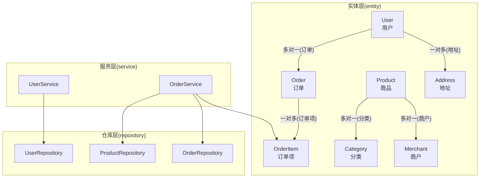
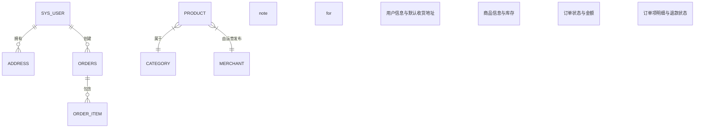
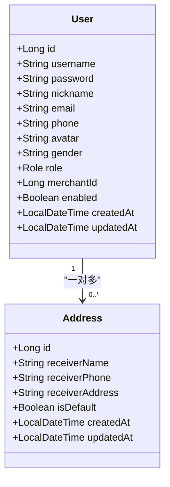
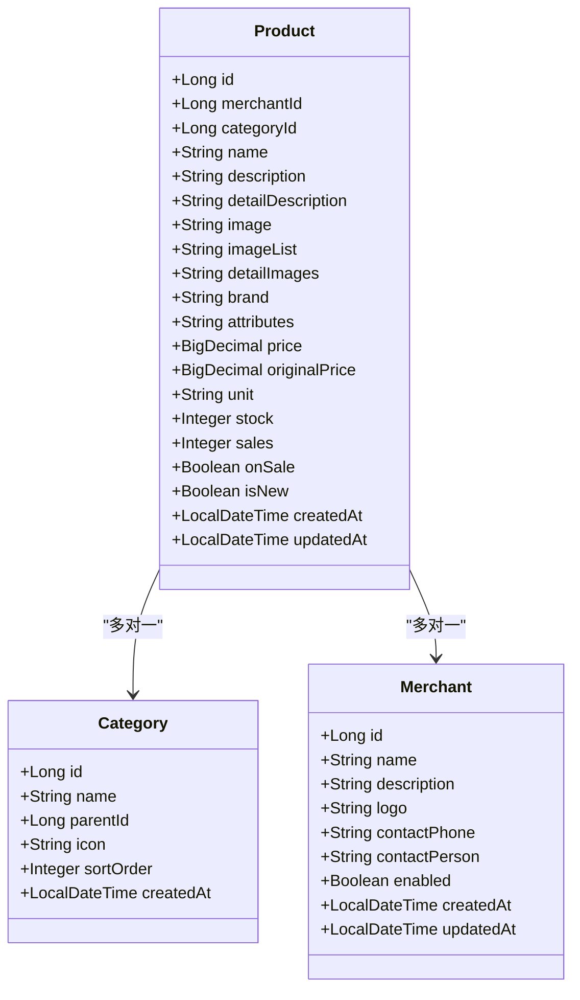
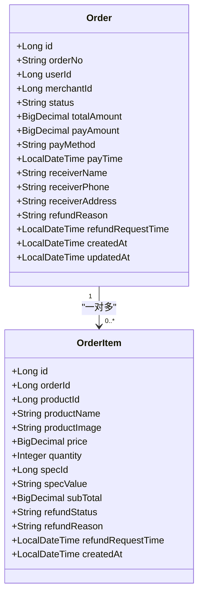
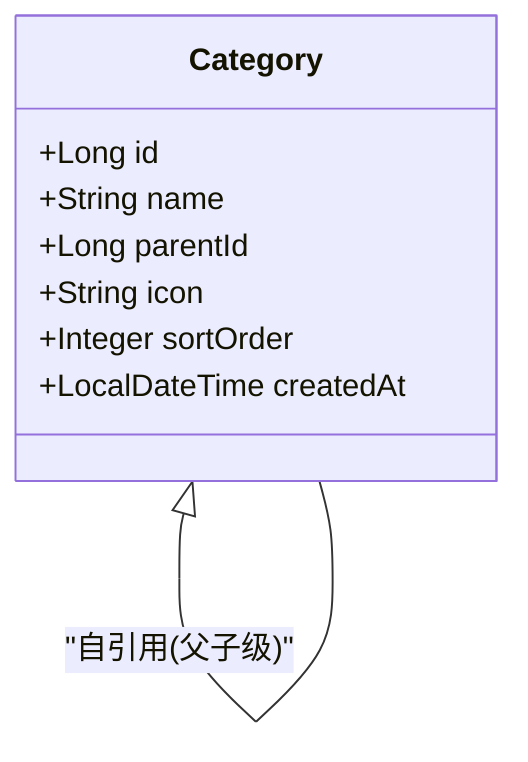
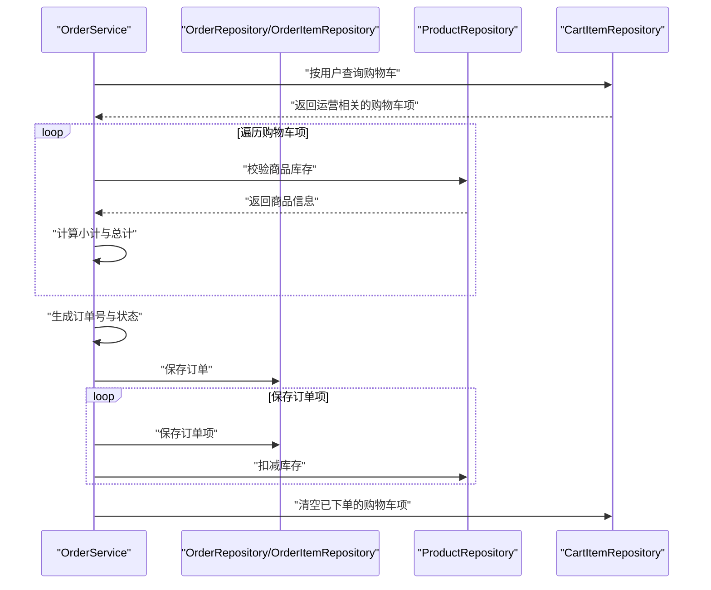
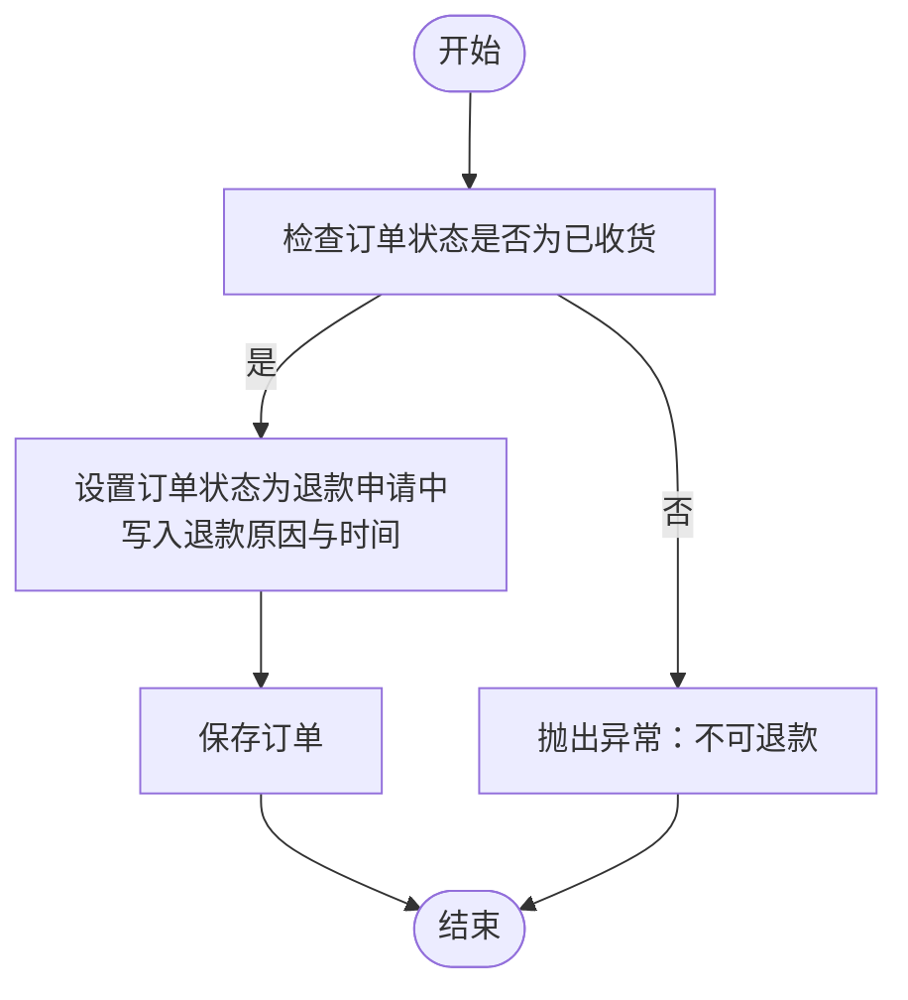
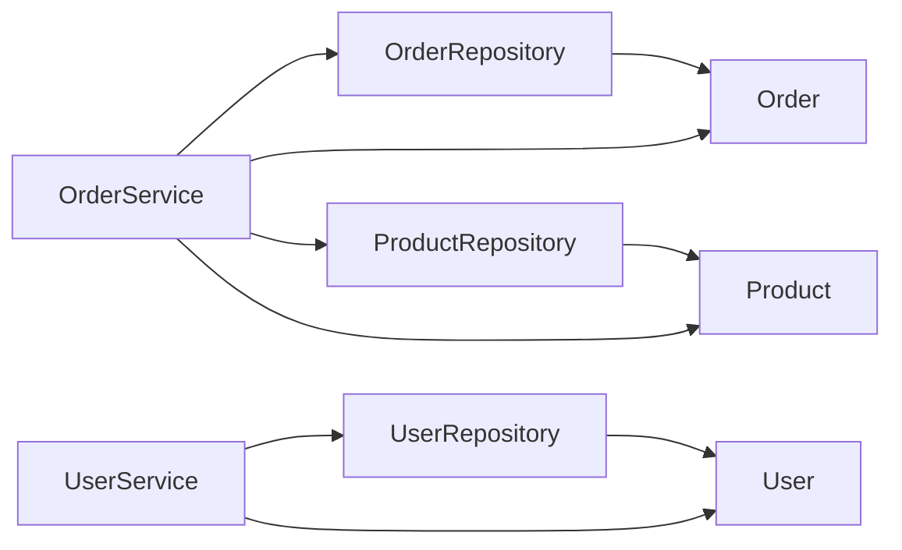

# 核心实体详解

<cite>
**本文引用的文件**
- [User.java](file://backend/src/main/java/com/mall/entity/User.java)
- [Product.java](file://backend/src/main/java/com/mall/entity/Product.java)
- [Order.java](file://backend/src/main/java/com/mall/entity/Order.java)
- [Category.java](file://backend/src/main/java/com/mall/entity/Category.java)
- [OrderItem.java](file://backend/src/main/java/com/mall/entity/OrderItem.java)
- [Address.java](file://backend/src/main/java/com/mall/entity/Address.java)
- [Merchant.java](file://backend/src/main/java/com/mall/entity/Merchant.java)
- [Role.java](file://backend/src/main/java/com/mall/common/Role.java)
- [UserRepository.java](file://backend/src/main/java/com/mall/repository/UserRepository.java)
- [OrderRepository.java](file://backend/src/main/java/com/mall/repository/OrderRepository.java)
- [ProductRepository.java](file://backend/src/main/java/com/mall/repository/ProductRepository.java)
- [OrderService.java](file://backend/src/main/java/com/mall/service/OrderService.java)
- [UserService.java](file://backend/src/main/java/com/mall/service/UserService.java)
</cite>

## 目录
1. [简介](#简介)
2. [项目结构](#项目结构)
3. [核心组件](#核心组件)
4. [架构总览](#架构总览)
5. [详细组件分析](#详细组件分析)
6. [依赖分析](#依赖分析)
7. [性能考虑](#性能考虑)
8. [故障排查指南](#故障排查指南)
9. [结论](#结论)

## 简介
本文件聚焦电商商城系统的核心实体，围绕用户(User)、商品(Product)、订单(Order)、分类(Category)进行数据模型深度解析。内容涵盖主键策略、字段约束、数据类型选择、业务含义、实体间关联关系映射（@OneToOne/@OneToMany/@ManyToOne）、完整字段清单、默认值与约束、以及实体生命周期回调的作用与实现。

## 项目结构
后端采用Spring Boot + JPA/Hibernate实现，核心实体位于entity包，仓库接口位于repository包，服务层位于service包。User与Product等实体通过JPA注解映射到数据库表，配合Repository接口完成数据访问，Service层承载业务流程。

图表来源
- [User.java:73-75](file://backend/src/main/java/com/mall/entity/User.java#L73-L75)
- [Address.java:15-17](file://backend/src/main/java/com/mall/entity/Address.java#L15-L17)
- [Order.java:25-29](file://backend/src/main/java/com/mall/entity/Order.java#L25-L29)
- [OrderItem.java:22-26](file://backend/src/main/java/com/mall/entity/OrderItem.java#L22-L26)
- [Product.java:22-26](file://backend/src/main/java/com/mall/entity/Product.java#L22-L26)
- [Category.java:24-25](file://backend/src/main/java/com/mall/entity/Category.java#L24-L25)
- [OrderService.java:28-31](file://backend/src/main/java/com/mall/service/OrderService.java#L28-L31)
- [UserService.java:16-16](file://backend/src/main/java/com/mall/service/UserService.java#L16-L16)

章节来源
- [User.java:1-88](file://backend/src/main/java/com/mall/entity/User.java#L1-L88)
- [Product.java:1-101](file://backend/src/main/java/com/mall/entity/Product.java#L1-L101)
- [Order.java:1-83](file://backend/src/main/java/com/mall/entity/Order.java#L1-L83)
- [Category.java:1-41](file://backend/src/main/java/com/mall/entity/Category.java#L1-L41)
- [OrderItem.java:1-73](file://backend/src/main/java/com/mall/entity/OrderItem.java#L1-L73)
- [Address.java:1-60](file://backend/src/main/java/com/mall/entity/Address.java#L1-L60)
- [Merchant.java:1-56](file://backend/src/main/java/com/mall/entity/Merchant.java#L1-L56)

## 核心组件

### User 用户实体
- 主键策略：自增IDENTITY
- 表名：sys_user
- 角色枚举：Role(ADMIN/MERCHANT/USER)
- 关联关系：
  - 一对多：User -> Address（mappedBy="user"）
- 生命周期回调：
  - @PrePersist：创建时间与更新时间均设为当前时间
  - @PreUpdate：更新时间设为当前时间
- 默认值与约束：
  - enabled默认true
  - username唯一且非空
  - password非空
  - email/phone/avatar/nickname等长度限制
  - 收货人信息字段用于默认收货地址
  - merchantId仅在角色为MERCHANT时有效

字段清单与约束
- id: 主键
- username: 唯一, 非空, 长度64
- password: 非空, 长度128, JSON序列化时忽略
- nickname: 长度32
- email: 长度64
- phone: 长度20
- avatar: 长度255
- gender: 长度10
- receiverName/receiverPhone/receiverAddress: 收货人信息
- role: 非空, 枚举STRING
- merchantId: 非空时仅对MERCHANT角色有效
- enabled: 非空, 默认true
- createdAt: 非空, 不可更新
- updatedAt: 可更新

章节来源
- [User.java:10-87](file://backend/src/main/java/com/mall/entity/User.java#L10-L87)
- [Role.java:1-8](file://backend/src/main/java/com/mall/common/Role.java#L1-L8)
- [UserRepository.java:10-19](file://backend/src/main/java/com/mall/repository/UserRepository.java#L10-L19)

### Product 商品实体
- 主键策略：自增IDENTITY
- 表名：product
- 关联关系：
  - 多对一：Product -> Category(categoryId)
  - 多对一：Product -> Merchant(merchantId)
- 生命周期回调：
  - @PrePersist：创建时间与更新时间均设为当前时间
  - @PreUpdate：更新时间设为当前时间
- 默认值与约束：
  - name非空, 长度128
  - price非空, 精度12, 小数2位
  - originalPrice精度12, 小数2位
  - unit默认"件"
  - stock/sales默认0
  - onSale默认true
  - isNew默认false
  - image/imageList/detailImages为图片URL集合
  - attributes/detailDescription为长文本存储

字段清单与约束
- id: 主键
- merchantId: 非空
- categoryId: 可空
- name: 非空, 长度128
- description: 长度500
- detailDescription: LONGTEXT
- image: 长度512
- imageList: TEXT
- detailImages: TEXT
- brand: 长度64
- attributes: LONGTEXT
- price: 非空, 精度12, 小数2位
- originalPrice: 精度12, 小数2位
- unit: 非空, 默认"件"
- stock: 非空, 默认0
- sales: 非空, 默认0
- onSale: 非空, 默认true
- isNew: 非空, 默认false
- createdAt: 非空, 不可更新
- updatedAt: 可更新

章节来源
- [Product.java:9-100](file://backend/src/main/java/com/mall/entity/Product.java#L9-L100)
- [Category.java:1-41](file://backend/src/main/java/com/mall/entity/Category.java#L1-L41)
- [Merchant.java:1-56](file://backend/src/main/java/com/mall/entity/Merchant.java#L1-L56)
- [ProductRepository.java:13-124](file://backend/src/main/java/com/mall/repository/ProductRepository.java#L13-L124)

### Order 订单实体
- 主键策略：自增IDENTITY
- 表名：orders
- 关联关系：
  - 多对一：Order -> User(userId)
  - 一对多：Order -> OrderItem(orderId)
- 生命周期回调：
  - @PrePersist：创建时间与更新时间均设为当前时间
  - @PreUpdate：更新时间设为当前时间
- 默认值与约束：
  - orderNo唯一且非空, 长度32
  - userId/merchantId非空
  - status非空, 长度20
  - totalAmount/payAmount精度12, 小数2位
  - 收货人信息字段用于配送地址
  - 退款相关字段用于售后流程

字段清单与约束
- id: 主键
- orderNo: 唯一, 非空, 长度32
- userId: 非空
- merchantId: 非空
- status: 非空, 长度20
- totalAmount: 非空, 精度12, 小数2位
- payAmount: 精度12, 小数2位
- payMethod: 长度32
- payTime: 可空
- receiverName: 长度32
- receiverPhone: 长度20
- receiverAddress: 长度256
- refundReason: 长度256
- refundRequestTime: 可空
- createdAt: 非空, 不可更新
- updatedAt: 可更新

章节来源
- [Order.java:9-82](file://backend/src/main/java/com/mall/entity/Order.java#L9-L82)
- [OrderItem.java:1-73](file://backend/src/main/java/com/mall/entity/OrderItem.java#L1-L73)
- [OrderRepository.java:13-27](file://backend/src/main/java/com/mall/repository/OrderRepository.java#L13-L27)

### Category 分类实体
- 主键策略：自增IDENTITY
- 表名：category
- 关联关系：
  - 自引用：parentId指向父级分类
- 生命周期回调：
  - @PrePersist：创建时间设为当前时间
- 默认值与约束：
  - name非空, 长度64
  - icon长度200
  - sortOrder非空, 默认0

字段清单与约束
- id: 主键
- name: 非空, 长度64
- parentId: 可空
- icon: 长度200
- sortOrder: 非空, 默认0
- createdAt: 非空, 不可更新

章节来源
- [Category.java:8-40](file://backend/src/main/java/com/mall/entity/Category.java#L8-L40)

## 架构总览
下图展示核心实体之间的关系与典型业务流程（下单、库存扣减、退款申请）：

图表来源
- [User.java:73-75](file://backend/src/main/java/com/mall/entity/User.java#L73-L75)
- [Address.java:15-17](file://backend/src/main/java/com/mall/entity/Address.java#L15-L17)
- [Order.java:25-29](file://backend/src/main/java/com/mall/entity/Order.java#L25-L29)
- [OrderItem.java:22-26](file://backend/src/main/java/com/mall/entity/OrderItem.java#L22-L26)
- [Product.java:22-26](file://backend/src/main/java/com/mall/entity/Product.java#L22-L26)
- [Category.java:24-25](file://backend/src/main/java/com/mall/entity/Category.java#L24-L25)

## 详细组件分析

### User 用户实体
- 设计要点
  - 使用JSON忽略敏感字段password
  - 支持角色枚举，便于权限控制
  - 与Address建立一对多关系，支持多收货地址与默认地址标记
- 字段与约束
  - 唯一索引：username
  - 默认值：enabled=true
  - 时间戳：createdAt/updatedAt
- 生命周期
  - 创建与更新自动填充时间

图表来源
- [User.java:17-87](file://backend/src/main/java/com/mall/entity/User.java#L17-L87)
- [Address.java:10-59](file://backend/src/main/java/com/mall/entity/Address.java#L10-L59)

章节来源
- [User.java:10-87](file://backend/src/main/java/com/mall/entity/User.java#L10-L87)
- [Address.java:1-60](file://backend/src/main/java/com/mall/entity/Address.java#L1-L60)
- [UserRepository.java:10-19](file://backend/src/main/java/com/mall/repository/UserRepository.java#L10-L19)

### Product 商品实体
- 设计要点
  - 商品详情页多图与轮播图字段
  - 原价与现价分离，便于营销展示
  - 新品标识与销量统计
- 字段与约束
  - merchantId非空，确保商品归属运营
  - onSale控制是否对外销售
- 生命周期
  - 创建与更新自动填充时间

图表来源
- [Product.java:16-100](file://backend/src/main/java/com/mall/entity/Product.java#L16-L100)
- [Category.java:15-40](file://backend/src/main/java/com/mall/entity/Category.java#L15-L40)
- [Merchant.java:15-56](file://backend/src/main/java/com/mall/entity/Merchant.java#L15-L56)

章节来源
- [Product.java:9-100](file://backend/src/main/java/com/mall/entity/Product.java#L9-L100)
- [ProductRepository.java:13-124](file://backend/src/main/java/com/mall/repository/ProductRepository.java#L13-L124)

### Order 订单实体
- 设计要点
  - 订单号唯一，便于外部系统对接
  - 支付方式、支付时间、退款原因与时间等字段支撑售后流程
  - 与OrderItem形成一对多，记录购买明细
- 字段与约束
  - 订单状态与金额字段
  - 收货人信息与配送地址
- 生命周期
  - 创建与更新自动填充时间

图表来源
- [Order.java:16-82](file://backend/src/main/java/com/mall/entity/Order.java#L16-L82)
- [OrderItem.java:16-73](file://backend/src/main/java/com/mall/entity/OrderItem.java#L16-L73)

章节来源
- [Order.java:9-82](file://backend/src/main/java/com/mall/entity/Order.java#L9-L82)
- [OrderItem.java:1-73](file://backend/src/main/java/com/mall/entity/OrderItem.java#L1-L73)
- [OrderRepository.java:13-27](file://backend/src/main/java/com/mall/repository/OrderRepository.java#L13-L27)

### Category 分类实体
- 设计要点
  - 支持树形结构（自引用）
  - 排序字段支持前端展示顺序
- 字段与约束
  - name唯一性与长度限制
  - sortOrder默认0

图表来源
- [Category.java:15-40](file://backend/src/main/java/com/mall/entity/Category.java#L15-L40)

章节来源
- [Category.java:8-40](file://backend/src/main/java/com/mall/entity/Category.java#L8-L40)

### 典型业务流程：下单与退款

图表来源
- [OrderService.java:34-88](file://backend/src/main/java/com/mall/service/OrderService.java#L34-L88)
- [OrderRepository.java:13-27](file://backend/src/main/java/com/mall/repository/OrderRepository.java#L13-L27)
- [ProductRepository.java:13-124](file://backend/src/main/java/com/mall/repository/ProductRepository.java#L13-L124)

章节来源
- [OrderService.java:27-88](file://backend/src/main/java/com/mall/service/OrderService.java#L27-L88)

### 退款申请流程（简化）

图表来源
- [OrderService.java:150-161](file://backend/src/main/java/com/mall/service/OrderService.java#L150-L161)

章节来源
- [OrderService.java:147-161](file://backend/src/main/java/com/mall/service/OrderService.java#L147-L161)

## 依赖分析
- 实体间依赖
  - User与Address：一对多
  - Order与OrderItem：一对多
  - Product与Category/ Merchant：多对一
- 仓库接口依赖
  - UserRepository：按用户名、角色、运营ID查询
  - OrderRepository：按用户/运营/状态分页查询
  - ProductRepository：按运营/分类/上下架/新品/销量等查询
- 服务层依赖
  - OrderService：聚合订单、订单项、购物车、商品仓库
  - UserService：用户资料更新

图表来源
- [UserRepository.java:10-19](file://backend/src/main/java/com/mall/repository/UserRepository.java#L10-L19)
- [OrderRepository.java:13-27](file://backend/src/main/java/com/mall/repository/OrderRepository.java#L13-L27)
- [ProductRepository.java:13-124](file://backend/src/main/java/com/mall/repository/ProductRepository.java#L13-L124)
- [OrderService.java:28-31](file://backend/src/main/java/com/mall/service/OrderService.java#L28-L31)
- [UserService.java:16-16](file://backend/src/main/java/com/mall/service/UserService.java#L16-L16)

章节来源
- [UserRepository.java:10-19](file://backend/src/main/java/com/mall/repository/UserRepository.java#L10-L19)
- [OrderRepository.java:13-27](file://backend/src/main/java/com/mall/repository/OrderRepository.java#L13-L27)
- [ProductRepository.java:13-124](file://backend/src/main/java/com/mall/repository/ProductRepository.java#L13-L124)
- [OrderService.java:27-88](file://backend/src/main/java/com/mall/service/OrderService.java#L27-L88)
- [UserService.java:14-41](file://backend/src/main/java/com/mall/service/UserService.java#L14-L41)

## 性能考虑
- 索引与查询
  - ProductRepository提供按运营、分类、上下架、销量、新品等分页查询，建议在对应列建立索引以提升查询效率
  - OrderRepository提供按用户/运营/状态分页查询，建议在userId/merchantId/status列建立复合索引
- 关联查询
  - OrderService在创建订单时需要多次读取商品信息与库存，建议缓存热点商品信息或批量查询
- 写入路径
  - 下单流程涉及订单、订单项与商品库存的多步写入，建议使用事务保证一致性，并尽量减少不必要的查询

## 故障排查指南
- 用户相关
  - 用户名重复：User.username唯一约束导致插入失败
  - 密码安全：password字段在JSON序列化时被忽略，避免泄露
- 商品相关
  - 库存不足：下单时若商品库存小于购买数量会抛出异常
  - 上架状态：仅onSale=true的商品才参与公开查询
- 订单相关
  - 状态流转：仅“已收货”状态允许发起退款申请
  - 取消订单：仅在未发货状态下可取消，且会回补库存
- 退款相关
  - 退款数量校验：部分退款时需校验数量合法性
  - 订单整体退款状态同步：当所有订单项都已退款时，订单整体标记为已退款

章节来源
- [OrderService.java:123-161](file://backend/src/main/java/com/mall/service/OrderService.java#L123-L161)
- [ProductRepository.java:34-91](file://backend/src/main/java/com/mall/repository/ProductRepository.java#L34-L91)
- [UserRepository.java:12-18](file://backend/src/main/java/com/mall/repository/UserRepository.java#L12-L18)

## 结论
本文基于实际代码对电商系统核心实体进行了全面的数据模型解析，明确了主键策略、字段约束、默认值、业务含义与生命周期回调。通过实体关系图与典型业务流程图，帮助读者理解User、Product、Order、Category等实体在系统中的定位与协作方式。建议在生产环境中结合查询需求完善索引策略，并在高并发场景下优化事务边界与缓存策略。