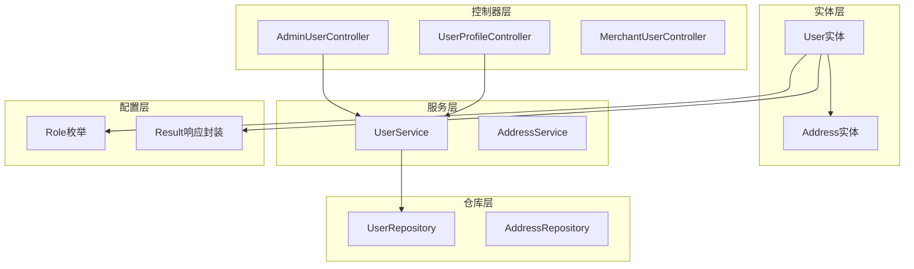
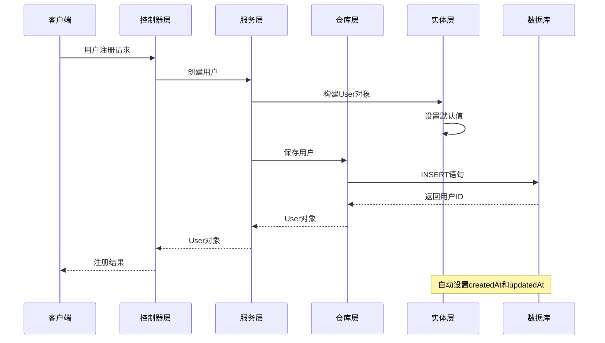
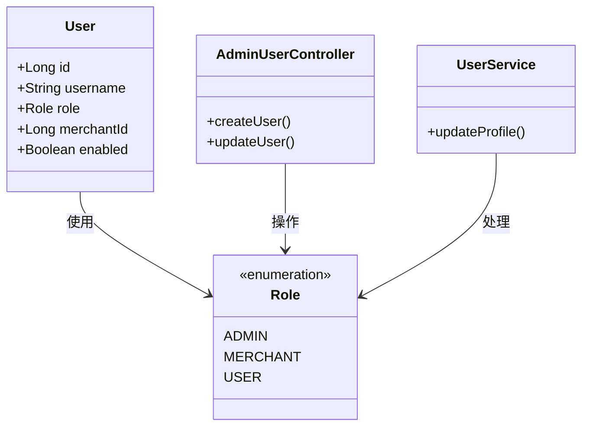
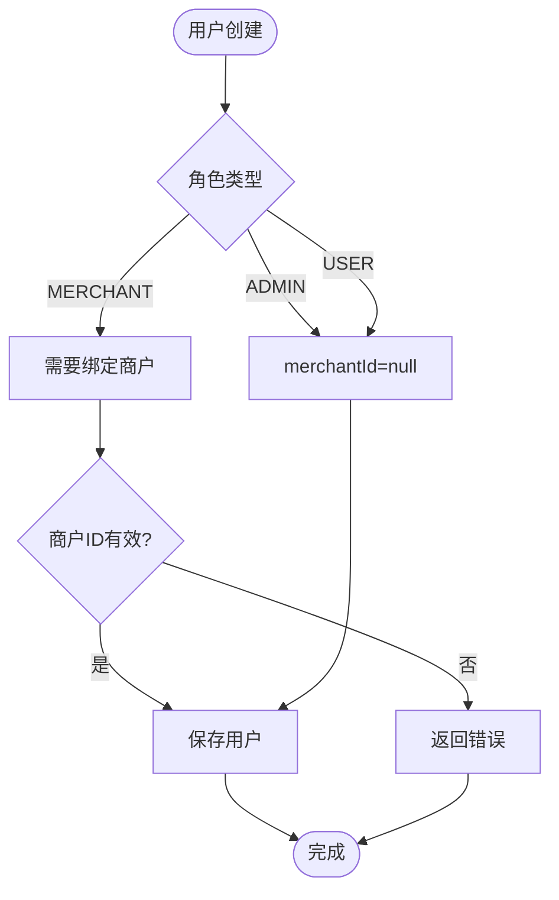
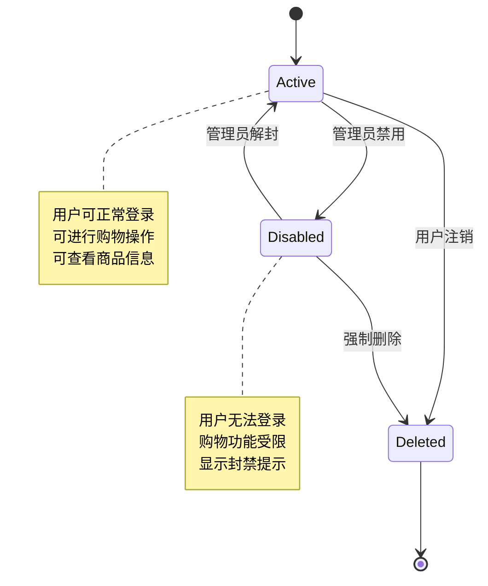
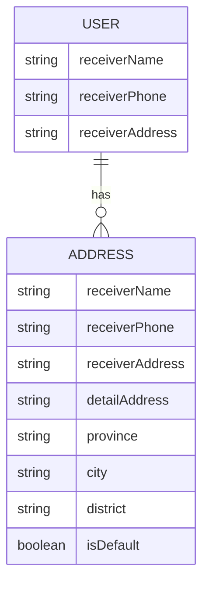
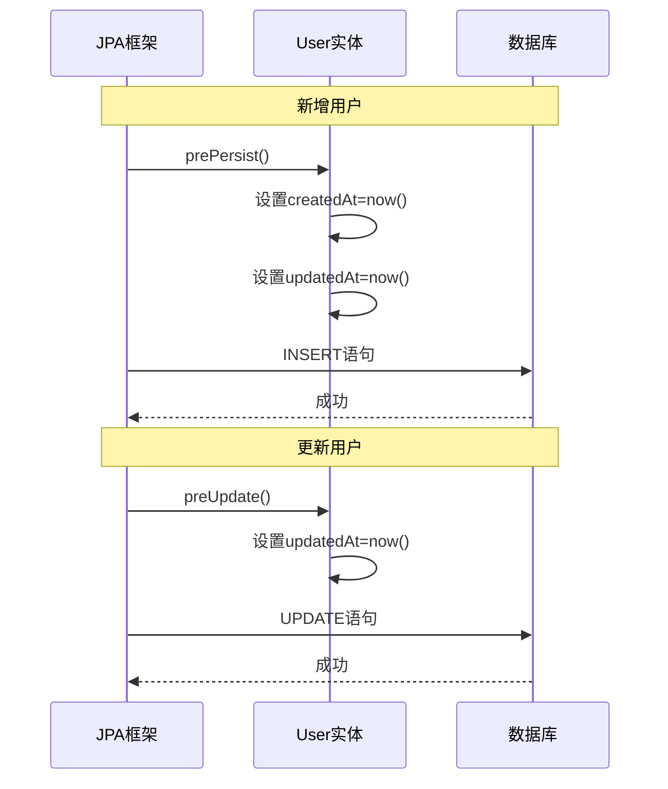
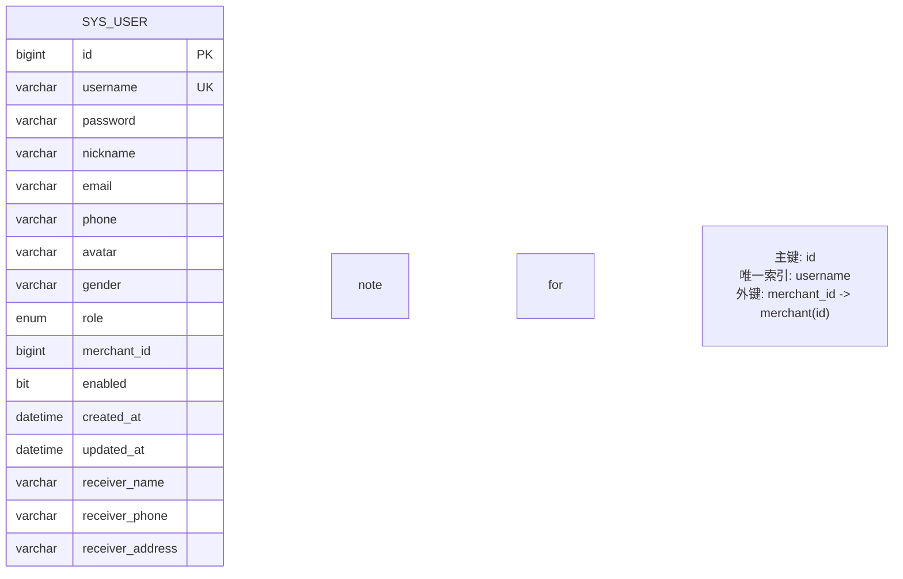
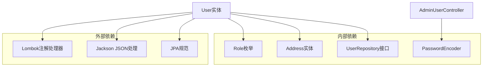

# 用户实体(User)

<cite>
**本文档引用的文件**
- [User.java](file://backend/src/main/java/com/mall/entity/User.java)
- [Role.java](file://backend/src/main/java/com/mall/common/Role.java)
- [UserRepository.java](file://backend/src/main/java/com/mall/repository/UserRepository.java)
- [UserService.java](file://backend/src/main/java/com/mall/service/UserService.java)
- [UserProfileController.java](file://backend/src/main/java/com/mall/controller/user/UserProfileController.java)
- [AdminUserController.java](file://backend/src/main/java/com/mall/controller/admin/AdminUserController.java)
- [Address.java](file://backend/src/main/java/com/mall/entity/Address.java)
- [Result.java](file://backend/src/main/java/com/mall/dto/Result.java)
- [banner.sql](file://backend/src/main/resources/banner.sql)
</cite>

## 目录
1. [简介](#简介)
2. [项目结构](#项目结构)
3. [核心组件](#核心组件)
4. [架构概览](#架构概览)
5. [详细组件分析](#详细组件分析)
6. [依赖关系分析](#依赖关系分析)
7. [性能考虑](#性能考虑)
8. [故障排除指南](#故障排除指南)
9. [结论](#结论)

## 简介

用户实体(User)是商城系统中的核心数据模型，负责管理平台所有用户的基本信息、权限控制和业务关联。该实体采用JPA注解进行持久化映射，实现了完整的用户生命周期管理和数据完整性约束。

本实体不仅包含标准的用户基本信息字段，还集成了角色权限系统、商户关联机制和收货人信息管理功能，为整个商城系统的用户管理体系提供了坚实的数据基础。

## 项目结构

用户实体在项目中的组织结构如下：

**图表来源**
- [User.java:10-87](file://backend/src/main/java/com/mall/entity/User.java#L10-L87)
- [UserRepository.java:10-19](file://backend/src/main/java/com/mall/repository/UserRepository.java#L10-L19)
- [UserService.java:14-41](file://backend/src/main/java/com/mall/service/UserService.java#L14-L41)

**章节来源**
- [User.java:1-88](file://backend/src/main/java/com/mall/entity/User.java#L1-L88)
- [Role.java:1-8](file://backend/src/main/java/com/mall/common/Role.java#L1-L8)

## 核心组件

### 数据模型概述

用户实体采用JPA注解进行完整映射，表名为`sys_user`，实现了以下核心功能：

- **身份认证**：用户名和密码字段用于系统登录认证
- **个人信息**：昵称、邮箱、手机号、头像、性别等基础信息
- **权限管理**：通过Role枚举实现多级权限控制
- **业务关联**：merchantId字段支持商户运营模式
- **状态管理**：enabled字段控制用户启用状态
- **时间追踪**：自动记录创建和更新时间

### 字段约束和数据类型

| 字段名 | 类型 | 长度限制 | 约束条件 | 描述 |
|--------|------|----------|----------|------|
| id | Long | - | 主键, 自增 | 用户唯一标识符 |
| username | String | 64字符 | 唯一, 非空 | 登录用户名 |
| password | String | 128字符 | 非空 | 加密后的用户密码 |
| nickname | String | 32字符 | 可空 | 用户昵称 |
| email | String | 64字符 | 可空 | 用户邮箱地址 |
| phone | String | 20字符 | 可空 | 用户手机号码 |
| avatar | String | 255字符 | 可空 | 用户头像URL |
| gender | String | 10字符 | 可空 | 用户性别(MALE/FEMALE/OTHER) |
| receiverName | String | 32字符 | 可空 | 收货人姓名 |
| receiverPhone | String | 20字符 | 可空 | 收货人电话 |
| receiverAddress | String | 255字符 | 可空 | 收货人地址 |
| role | Role | 枚举值 | 非空 | 用户角色(ADMIN/MERCHANT/USER) |
| merchantId | Long | - | 可空 | 关联的商户ID |
| enabled | Boolean | - | 非空, 默认true | 用户启用状态 |
| createdAt | LocalDateTime | - | 非空, 不可更新 | 创建时间 |
| updatedAt | LocalDateTime | - | 可空 | 更新时间 |

**章节来源**
- [User.java:23-65](file://backend/src/main/java/com/mall/entity/User.java#L23-L65)
- [User.java:67-71](file://backend/src/main/java/com/mall/entity/User.java#L67-L71)

## 架构概览

用户实体在整个系统架构中扮演着核心角色，连接着多个层次的功能模块：

**图表来源**
- [AdminUserController.java:38-59](file://backend/src/main/java/com/mall/controller/admin/AdminUserController.java#L38-L59)
- [User.java:77-86](file://backend/src/main/java/com/mall/entity/User.java#L77-L86)

## 详细组件分析

### 角色枚举(Role)设计

角色枚举定义了系统的三种基本用户类型：

**图表来源**
- [Role.java:3-7](file://backend/src/main/java/com/mall/common/Role.java#L3-L7)
- [User.java:56-62](file://backend/src/main/java/com/mall/entity/User.java#L56-L62)

角色设计遵循最小权限原则：
- **ADMIN(管理员)**：拥有系统最高权限，可管理所有用户和商品
- **MERCHANT(运营)**：只能管理自己商户下的商品和订单
- **USER(普通用户)**：仅能进行购物和查看个人资料

**章节来源**
- [Role.java:1-8](file://backend/src/main/java/com/mall/common/Role.java#L1-L8)
- [User.java:56-58](file://backend/src/main/java/com/mall/entity/User.java#L56-L58)

### 商户关联字段设计

merchantId字段实现了灵活的商户运营模式：

**图表来源**
- [AdminUserController.java:44-56](file://backend/src/main/java/com/mall/controller/admin/AdminUserController.java#L44-L56)
- [User.java:60-62](file://backend/src/main/java/com/mall/entity/User.java#L60-L62)

设计要点：
- 仅当角色为MERCHANT时，merchantId才具有实际意义
- 通过UserRepository的findByMerchantId方法实现商户用户查询
- 支持NULL值，表示未绑定任何商户

**章节来源**
- [UserRepository.java:18](file://backend/src/main/java/com/mall/repository/UserRepository.java#L18)
- [AdminUserController.java:68-69](file://backend/src/main/java/com/mall/controller/admin/AdminUserController.java#L68-L69)

### 启用状态(enabled)机制

enabled字段提供了灵活的用户状态管理：

| 状态值 | 含义 | 业务场景 |
|--------|------|----------|
| true | 已启用 | 正常登录、购物、查看商品 |
| false | 已禁用 | 禁止登录、禁止购物、显示封禁状态 |

**图表来源**
- [User.java:64](file://backend/src/main/java/com/mall/entity/User.java#L64)
- [AdminUserController.java:67-69](file://backend/src/main/java/com/mall/controller/admin/AdminUserController.java#L67-L69)

**章节来源**
- [User.java:64](file://backend/src/main/java/com/mall/entity/User.java#L64)
- [AdminUserController.java:67-69](file://backend/src/main/java/com/mall/controller/admin/AdminUserController.java#L67-L69)

### 收货人信息字段设计

收货人信息字段专门用于电商购物场景：

**图表来源**
- [User.java:46-54](file://backend/src/main/java/com/mall/entity/User.java#L46-L54)
- [Address.java:19-38](file://backend/src/main/java/com/mall/entity/Address.java#L19-L38)

设计考虑：
- 收货人信息作为用户的基础信息存储
- 与Address实体形成一对多关系，支持多个收货地址
- 提供快速收货信息访问，减少重复输入

**章节来源**
- [User.java:46-54](file://backend/src/main/java/com/mall/entity/User.java#L46-L54)
- [Address.java:19-38](file://backend/src/main/java/com/mall/entity/Address.java#L19-L38)

### 实体生命周期回调

User实体实现了完整的生命周期管理：

**图表来源**
- [User.java:77-86](file://backend/src/main/java/com/mall/entity/User.java#L77-L86)

回调机制确保：
- 所有新创建的用户都有准确的创建时间
- 每次更新都会自动更新修改时间
- 避免了手动管理时间戳的错误

**章节来源**
- [User.java:77-86](file://backend/src/main/java/com/mall/entity/User.java#L77-L86)

### 数据库表结构

根据SQL脚本，sys_user表的完整结构如下：

**图表来源**
- [banner.sql:456-475](file://backend/src/main/resources/banner.sql#L456-L475)

**章节来源**
- [banner.sql:456-475](file://backend/src/main/resources/banner.sql#L456-L475)

## 依赖关系分析

用户实体与其他组件的依赖关系：

**图表来源**
- [User.java:3-5](file://backend/src/main/java/com/mall/entity/User.java#L3-L5)
- [AdminUserController.java:10](file://backend/src/main/java/com/mall/controller/admin/AdminUserController.java#L10)

**章节来源**
- [User.java:3-5](file://backend/src/main/java/com/mall/entity/User.java#L3-L5)
- [AdminUserController.java:10](file://backend/src/main/java/com/mall/controller/admin/AdminUserController.java#L10)

## 性能考虑

### 查询优化

1. **索引策略**
   - username字段具有唯一索引，支持快速查找
   - merchant_id字段适合建立索引以优化商户用户查询

2. **懒加载配置**
   - addresses字段使用LAZY加载，避免不必要的关联查询

3. **分页查询**
   - UserRepository提供分页查询支持，适合大数据量场景

### 缓存策略

建议在高并发场景下考虑：
- 用户基本信息缓存
- 角色权限信息缓存
- 商户关联信息缓存

## 故障排除指南

### 常见问题及解决方案

1. **用户名重复**
   - 现象：创建用户时报用户名已存在
   - 解决：检查用户名唯一性约束，使用existsByUsername方法

2. **商户ID无效**
   - 现象：MERCHANT角色用户无法保存
   - 解决：验证merchantId是否指向有效的商户记录

3. **密码安全问题**
   - 现象：密码明文存储风险
   - 解决：使用PasswordEncoder进行密码加密

4. **时间戳异常**
   - 现象：createdAt或updatedAt为空
   - 解决：确认prePersist和preUpdate回调正常执行

**章节来源**
- [AdminUserController.java:45-47](file://backend/src/main/java/com/mall/controller/admin/AdminUserController.java#L45-L47)
- [AdminUserController.java:51](file://backend/src/main/java/com/mall/controller/admin/AdminUserController.java#L51)

## 结论

用户实体(User)作为商城系统的核心数据模型，成功实现了以下目标：

1. **完整性**：涵盖了用户管理的所有必要字段和约束
2. **灵活性**：支持多种用户角色和业务场景
3. **安全性**：内置密码加密和权限控制机制
4. **可扩展性**：为未来的功能扩展预留了充足空间

该实体的设计充分体现了领域驱动设计的原则，通过清晰的职责分离和合理的抽象层次，为整个商城系统的稳定运行奠定了坚实基础。其生命周期管理、权限控制和业务关联机制的实现，展现了现代企业级应用的最佳实践。