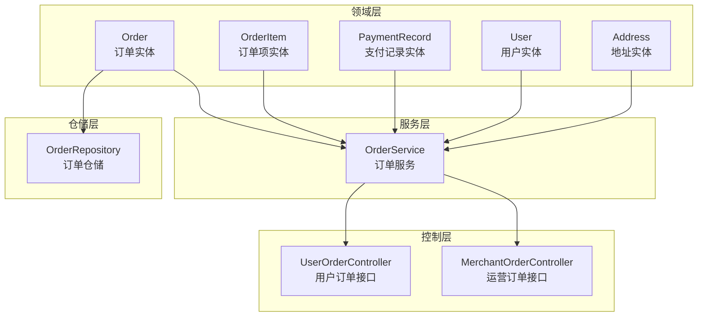
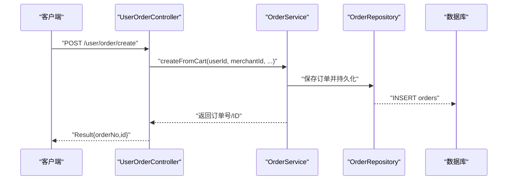
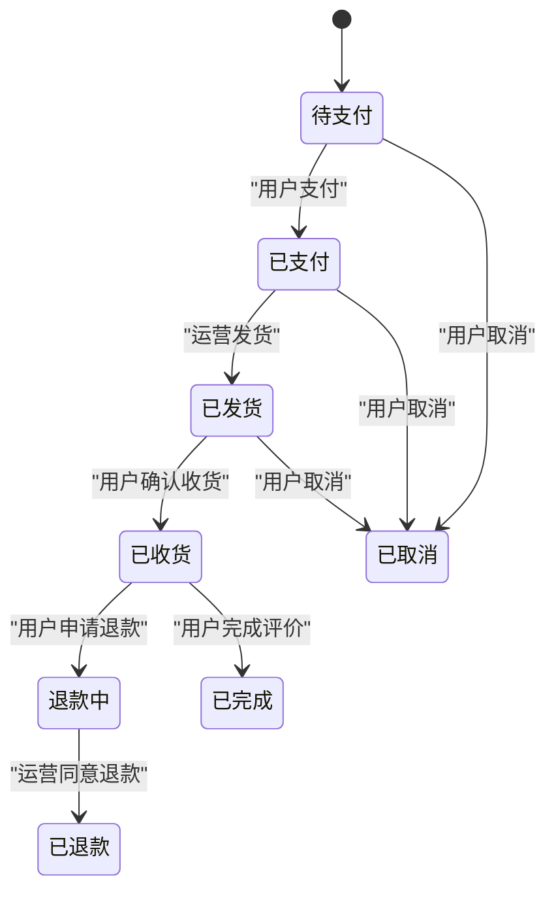
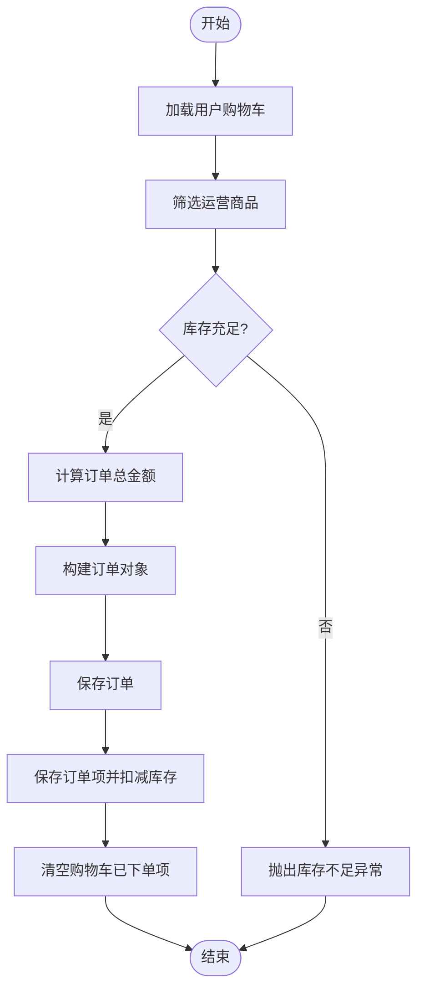
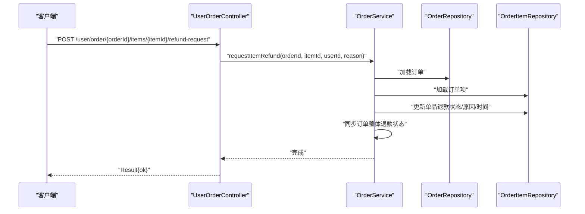
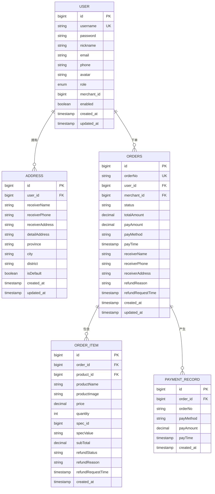
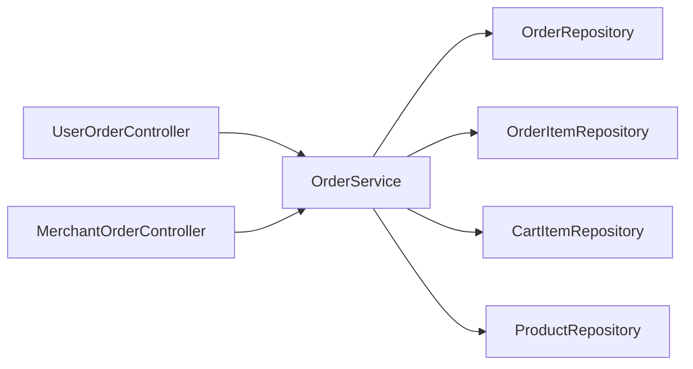

# 订单实体(Order)

<cite>
**本文引用的文件**
- [Order.java](file://backend/src/main/java/com/mall/entity/Order.java)
- [OrderItem.java](file://backend/src/main/java/com/mall/entity/OrderItem.java)
- [PaymentRecord.java](file://backend/src/main/java/com/mall/entity/PaymentRecord.java)
- [User.java](file://backend/src/main/java/com/mall/entity/User.java)
- [Address.java](file://backend/src/main/java/com/mall/entity/Address.java)
- [OrderRepository.java](file://backend/src/main/java/com/mall/repository/OrderRepository.java)
- [OrderService.java](file://backend/src/main/java/com/mall/service/OrderService.java)
- [UserOrderController.java](file://backend/src/main/java/com/mall/controller/user/UserOrderController.java)
- [MerchantOrderController.java](file://backend/src/main/java/com/mall/controller/merchant/MerchantOrderController.java)
- [Role.java](file://backend/src/main/java/com/mall/common/Role.java)
- [application.yml](file://backend/src/main/resources/application.yml)
</cite>

## 目录
1. [简介](#简介)
2. [项目结构](#项目结构)
3. [核心组件](#核心组件)
4. [架构概览](#架构概览)
5. [详细组件分析](#详细组件分析)
6. [依赖分析](#依赖分析)
7. [性能考虑](#性能考虑)
8. [故障排查指南](#故障排查指南)
9. [结论](#结论)
10. [附录](#附录)

## 简介
本文件为 Order 订单实体的详细数据模型文档，覆盖字段定义、状态设计与流转、与用户/商品/地址等实体的关联关系、审计字段作用、以及业务约束与流程。通过代码级分析与图示，帮助开发者与产品人员准确理解订单在系统中的结构与行为。

## 项目结构
本项目采用分层架构，订单实体位于领域层，配合仓储、服务与控制器共同完成下单、支付、发货、退款等业务流程。

图表来源
- [Order.java:16-82](file://backend/src/main/java/com/mall/entity/Order.java#L16-L82)
- [OrderItem.java:16-72](file://backend/src/main/java/com/mall/entity/OrderItem.java#L16-L72)
- [PaymentRecord.java:17-44](file://backend/src/main/java/com/mall/entity/PaymentRecord.java#L17-L44)
- [User.java:17-86](file://backend/src/main/java/com/mall/entity/User.java#L17-L86)
- [Address.java:10-58](file://backend/src/main/java/com/mall/entity/Address.java#L10-L58)
- [OrderRepository.java:13-27](file://backend/src/main/java/com/mall/repository/OrderRepository.java#L13-L27)
- [OrderService.java:26-279](file://backend/src/main/java/com/mall/service/OrderService.java#L26-L279)
- [UserOrderController.java:23-197](file://backend/src/main/java/com/mall/controller/user/UserOrderController.java#L23-L197)
- [MerchantOrderController.java:24-99](file://backend/src/main/java/com/mall/controller/merchant/MerchantOrderController.java#L24-L99)

章节来源
- [application.yml:1-36](file://backend/src/main/resources/application.yml#L1-L36)

## 核心组件
- 订单实体 Order：承载订单号、用户与运营关联、状态、金额、收货信息、退款信息、审计字段等。
- 订单项实体 OrderItem：描述订单内单个商品的明细、单价、数量、小计、退款状态与评价标记。
- 支付记录实体 PaymentRecord：用于模拟支付场景下的记录落库，确保数据一致性。
- 用户实体 User：与订单存在用户维度关联，同时维护收货人信息。
- 地址实体 Address：用户维度的收货地址集合，支持默认地址等属性。
- 订单仓储 OrderRepository：提供按用户/运营/全站分页查询、按订单号查询、按状态筛选等方法。
- 订单服务 OrderService：实现下单、状态更新、取消、退款申请与审批等核心业务逻辑。
- 控制器 UserOrderController/MerchantOrderController：暴露用户与运营端的订单操作接口。

章节来源
- [Order.java:16-82](file://backend/src/main/java/com/mall/entity/Order.java#L16-L82)
- [OrderItem.java:16-72](file://backend/src/main/java/com/mall/entity/OrderItem.java#L16-L72)
- [PaymentRecord.java:17-44](file://backend/src/main/java/com/mall/entity/PaymentRecord.java#L17-L44)
- [User.java:17-86](file://backend/src/main/java/com/mall/entity/User.java#L17-L86)
- [Address.java:10-58](file://backend/src/main/java/com/mall/entity/Address.java#L10-L58)
- [OrderRepository.java:13-27](file://backend/src/main/java/com/mall/repository/OrderRepository.java#L13-L27)
- [OrderService.java:26-279](file://backend/src/main/java/com/mall/service/OrderService.java#L26-L279)
- [UserOrderController.java:23-197](file://backend/src/main/java/com/mall/controller/user/UserOrderController.java#L23-L197)
- [MerchantOrderController.java:24-99](file://backend/src/main/java/com/mall/controller/merchant/MerchantOrderController.java#L24-L99)

## 架构概览
订单相关的关键交互如下：

图表来源
- [UserOrderController.java:34-50](file://backend/src/main/java/com/mall/controller/user/UserOrderController.java#L34-L50)
- [OrderService.java:34-88](file://backend/src/main/java/com/mall/service/OrderService.java#L34-L88)
- [OrderRepository.java:13-27](file://backend/src/main/java/com/mall/repository/OrderRepository.java#L13-L27)

## 详细组件分析

### 订单实体(Order)字段定义与语义
- 主键与标识
  - id：自增主键
  - orderNo：订单号，唯一且非空，长度限制为32
- 关联字段
  - userId：下单用户ID，非空
  - merchantId：运营ID，非空
- 状态与金额
  - status：订单状态，字符串类型，取值见“订单状态与流转”
  - totalAmount：订单总金额，精度12位，小数2位
  - payAmount：实付金额，精度12位，小数2位
  - payMethod：支付方式，长度32
  - payTime：支付时间
- 收货信息
  - receiverName/receiverPhone/receiverAddress：收货人姓名、电话、地址
- 退款信息
  - refundReason/refundRequestTime：退款原因与申请时间
- 审计字段
  - createdAt/updatedAt：创建与更新时间，使用预持久化/更新钩子自动填充

章节来源
- [Order.java:18-81](file://backend/src/main/java/com/mall/entity/Order.java#L18-L81)

### 订单项实体(OrderItem)字段定义与语义
- 主键与关联
  - id：自增主键
  - orderId：所属订单ID，非空
  - productId：商品ID，非空
- 商品快照
  - productName/productImage：商品名称与图片快照
  - price：下单时单价
  - quantity：购买数量
  - specId/specValue：规格ID与规格值快照
  - subTotal：小计金额
- 退款与评价
  - refundStatus/refundReason/refundRequestTime：单品退款状态、原因与申请时间
  - reviewed：是否已评价，默认false
- 审计字段
  - createdAt：创建时间

章节来源
- [OrderItem.java:18-71](file://backend/src/main/java/com/mall/entity/OrderItem.java#L18-L71)

### 支付记录实体(PaymentRecord)字段定义与语义
- 主键与关联
  - id：自增主键
  - orderId/orderNo：订单ID与订单号，非空
- 支付信息
  - payMethod：支付方式，长度32
  - payAmount：支付金额，精度12位，小数2位
  - payTime：支付时间
- 审计字段
  - createdAt：创建时间

章节来源
- [PaymentRecord.java:19-44](file://backend/src/main/java/com/mall/entity/PaymentRecord.java#L19-L44)

### 用户与地址实体(User/Address)的关联
- 用户与订单
  - 订单通过 userId 关联用户，用于用户维度的订单查询与权限校验
- 用户与地址
  - 用户拥有多个地址，通过 addresses 字段懒加载
  - 地址实体通过 user 外键关联用户
- 收货信息来源
  - 订单的收货信息可来源于用户默认地址或下单时传入

章节来源
- [User.java:73-75](file://backend/src/main/java/com/mall/entity/User.java#L73-L75)
- [Address.java:15-17](file://backend/src/main/java/com/mall/entity/Address.java#L15-L17)

### 订单状态设计与流转逻辑
- 状态枚举与含义
  - PENDING：待支付
  - PAID：已支付
  - SHIPPED：已发货
  - RECEIVED：已收货
  - CANCELLED：已取消
  - REFUND_REQUESTED：退款中
  - REFUNDED：已退款
- 流转路径
  - 下单后：PENDING
  - 用户支付：PAID
  - 运营发货：PAID → SHIPPED
  - 用户确认收货：SHIPPED → RECEIVED
  - 用户取消（收货前）：PENDING/PAID/SHIPPED → CANCELLED
  - 用户申请退款：RECEIVED → REFUND_REQUESTED
  - 运营同意退款：REFUND_REQUESTED → REFUNDED
  - 完成订单：RECEIVED → COMPLETED（由用户完成评价后触发）
- 约束与校验
  - 发货仅允许已支付订单
  - 仅已收货订单可申请退款
  - 退款申请需满足单品状态与数量合法性
  - 订单整体状态与单品状态保持一致

图表来源
- [OrderService.java:115-161](file://backend/src/main/java/com/mall/service/OrderService.java#L115-L161)
- [MerchantOrderController.java:61-85](file://backend/src/main/java/com/mall/controller/merchant/MerchantOrderController.java#L61-L85)
- [UserOrderController.java:113-133](file://backend/src/main/java/com/mall/controller/user/UserOrderController.java#L113-L133)

### 订单创建流程与库存扣减
- 从购物车创建订单
  - 校验购物车中是否存在该运营的商品
  - 校验商品库存充足
  - 计算订单总金额与订单项明细
  - 生成唯一订单号
  - 保存订单与订单项，并扣减对应商品库存
  - 清空已下单的购物车项
- 审计与并发
  - 使用事务保证订单创建与库存扣减的一致性
  - 创建与更新时间自动填充

图表来源
- [OrderService.java:34-88](file://backend/src/main/java/com/mall/service/OrderService.java#L34-L88)

章节来源
- [OrderService.java:34-88](file://backend/src/main/java/com/mall/service/OrderService.java#L34-L88)

### 退款申请与审批流程
- 单品退款
  - 用户针对单个订单项申请退款，校验订单状态与单品状态
  - 支持部分数量退款：拆分子订单项，保留剩余数量，新增退款申请项
  - 同步订单整体退款状态：若所有项均处于“退款中/已退款”，则订单整体标记为“退款中”
- 批量退款
  - 支持一次选择多个订单项与数量进行批量申请
- 运营审批
  - 同意单个订单项退款：将该项标记为“已退款”
  - 若所有有退款申请的项均已退款，则订单整体标记为“已退款”

图表来源
- [UserOrderController.java:154-168](file://backend/src/main/java/com/mall/controller/user/UserOrderController.java#L154-L168)
- [OrderService.java:166-252](file://backend/src/main/java/com/mall/service/OrderService.java#L166-L252)

章节来源
- [OrderService.java:147-278](file://backend/src/main/java/com/mall/service/OrderService.java#L147-L278)

### 审计字段与时间管理
- 订单与订单项
  - createdAt：创建时自动设置
  - updatedAt：更新时自动更新
- 用户与地址
  - createdAt/updatedAt：创建与更新时间自动填充
- 作用
  - 便于审计追踪、排序与统计
  - 保证数据一致性与可追溯性

章节来源
- [Order.java:72-81](file://backend/src/main/java/com/mall/entity/Order.java#L72-L81)
- [OrderItem.java:68-71](file://backend/src/main/java/com/mall/entity/OrderItem.java#L68-L71)
- [User.java:77-86](file://backend/src/main/java/com/mall/entity/User.java#L77-L86)
- [Address.java:49-58](file://backend/src/main/java/com/mall/entity/Address.java#L49-L58)

### 与用户、商品、地址等实体的关联关系
- 订单与用户
  - 多对一：订单.userId → 用户.id
  - 用于用户维度的订单查询与权限校验
- 订单与运营
  - 多对一：订单.merchantId → 运营ID
  - 用于运营维度的订单查询与发货、退款审批
- 订单与订单项
  - 一对多：订单.id → 订单项.orderId
  - 用于展示订单明细与退款管理
- 订单与支付记录
  - 一对多：订单.id → 支付记录.orderId
  - 用于模拟支付场景下的记录落库
- 用户与地址
  - 一对多：用户.id → 地址.user_id
  - 用于收货地址管理与默认地址选择

图表来源
- [User.java:17-86](file://backend/src/main/java/com/mall/entity/User.java#L17-L86)
- [Address.java:10-58](file://backend/src/main/java/com/mall/entity/Address.java#L10-L58)
- [Order.java:16-82](file://backend/src/main/java/com/mall/entity/Order.java#L16-L82)
- [OrderItem.java:16-72](file://backend/src/main/java/com/mall/entity/OrderItem.java#L16-L72)
- [PaymentRecord.java:17-44](file://backend/src/main/java/com/mall/entity/PaymentRecord.java#L17-L44)

## 依赖分析
- 组件耦合
  - OrderService 对 OrderRepository、OrderItemRepository、CartItemRepository、ProductRepository 存在直接依赖，承担下单、状态更新、退款等核心逻辑
  - 控制器仅依赖服务层，职责清晰
- 外部依赖
  - Spring Data JPA 提供仓储能力
  - Spring Security 提供认证上下文（用户ID/运营ID解析）

图表来源
- [UserOrderController.java:25-26](file://backend/src/main/java/com/mall/controller/user/UserOrderController.java#L25-L26)
- [MerchantOrderController.java:26-27](file://backend/src/main/java/com/mall/controller/merchant/MerchantOrderController.java#L26-L27)
- [OrderService.java:28-31](file://backend/src/main/java/com/mall/service/OrderService.java#L28-L31)

章节来源
- [OrderService.java:28-31](file://backend/src/main/java/com/mall/service/OrderService.java#L28-L31)

## 性能考虑
- 分页查询
  - 仓储提供按用户/运营/全站的分页查询，避免一次性加载大量订单
- 懒加载
  - 用户地址列表使用懒加载，减少不必要的关联查询
- 事务边界
  - 订单创建与库存扣减在单事务中执行，降低并发冲突概率
- 审计字段
  - 自动填充减少应用层逻辑开销

## 故障排查指南
- 订单不存在
  - 控制器在访问订单时会校验归属关系，若不匹配返回错误
- 状态非法
  - 发货要求订单为“已支付”；退款要求订单为“已收货”或“退款中”
  - 取消订单要求订单状态在“收货前”
- 库存不足
  - 下单时会检查商品库存，不足时抛出异常
- 退款数量不合法
  - 批量退款时需校验申请数量不超过购买数量
- 退款重复申请
  - 已申请退款的单品不允许重复申请

章节来源
- [UserOrderController.java:90-100](file://backend/src/main/java/com/mall/controller/user/UserOrderController.java#L90-L100)
- [MerchantOrderController.java:61-85](file://backend/src/main/java/com/mall/controller/merchant/MerchantOrderController.java#L61-L85)
- [OrderService.java:123-145](file://backend/src/main/java/com/mall/service/OrderService.java#L123-L145)
- [OrderService.java:147-240](file://backend/src/main/java/com/mall/service/OrderService.java#L147-L240)

## 结论
Order 订单实体以简洁明确的字段与状态设计支撑了完整的电商交易闭环。通过服务层的严格约束与控制器的权限校验，实现了从下单、支付、发货、收货到退款的完整业务流程。审计字段与事务机制保障了数据一致性与可追溯性。建议在后续版本中引入更细粒度的状态机与事件驱动机制，进一步提升扩展性与可观测性。

## 附录
- 数据库方言与连接配置参考 application.yml
- 角色枚举 Role 用于区分 ADMIN/MERCHANT/USER

章节来源
- [application.yml:1-36](file://backend/src/main/resources/application.yml#L1-L36)
- [Role.java:3-7](file://backend/src/main/java/com/mall/common/Role.java#L3-L7)