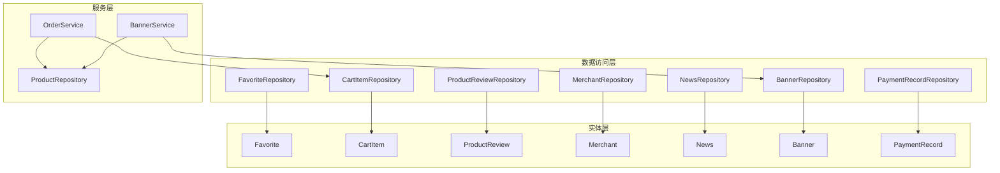
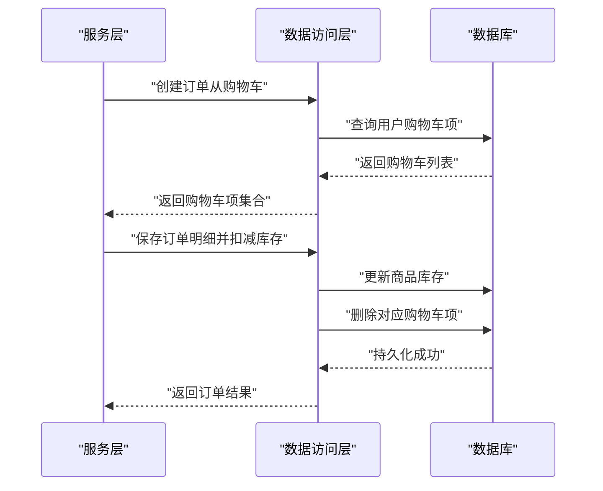
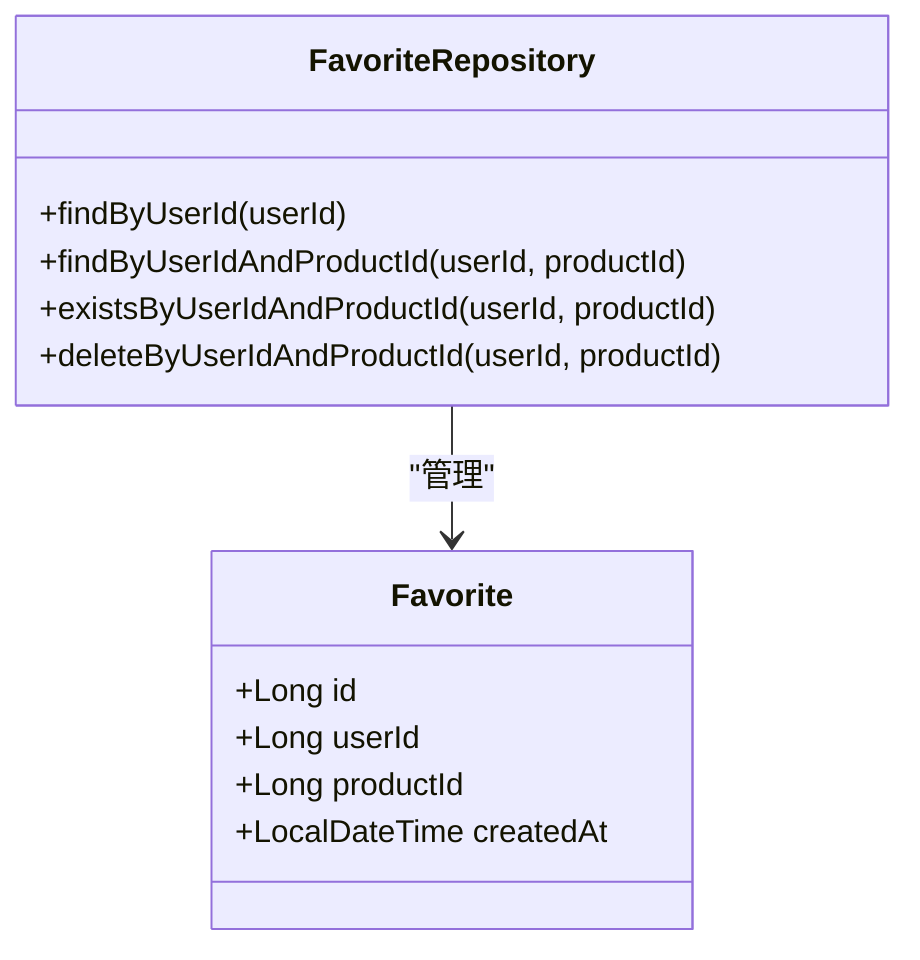
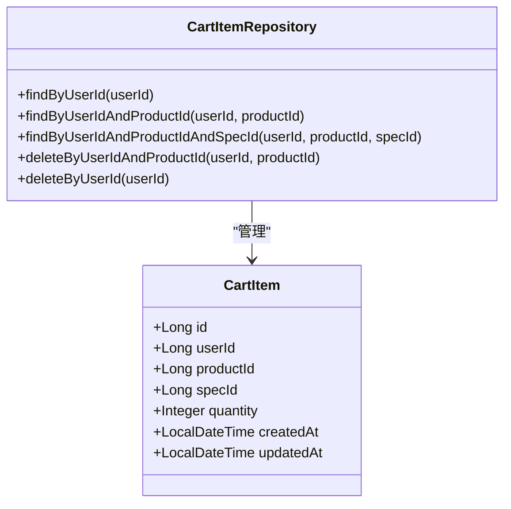
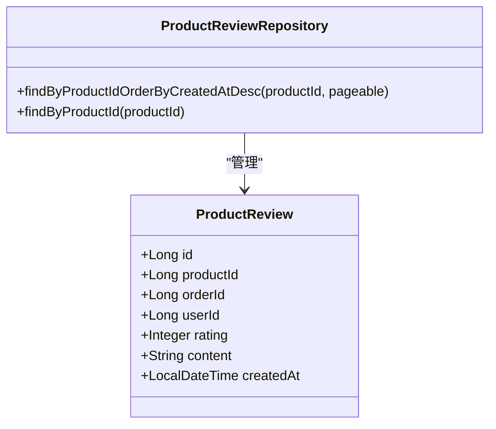
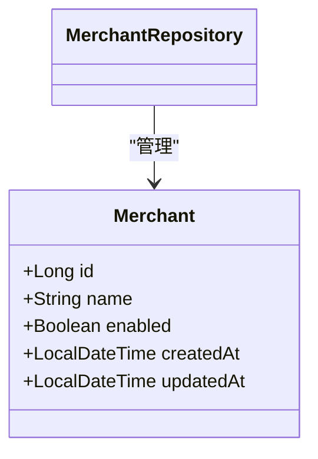
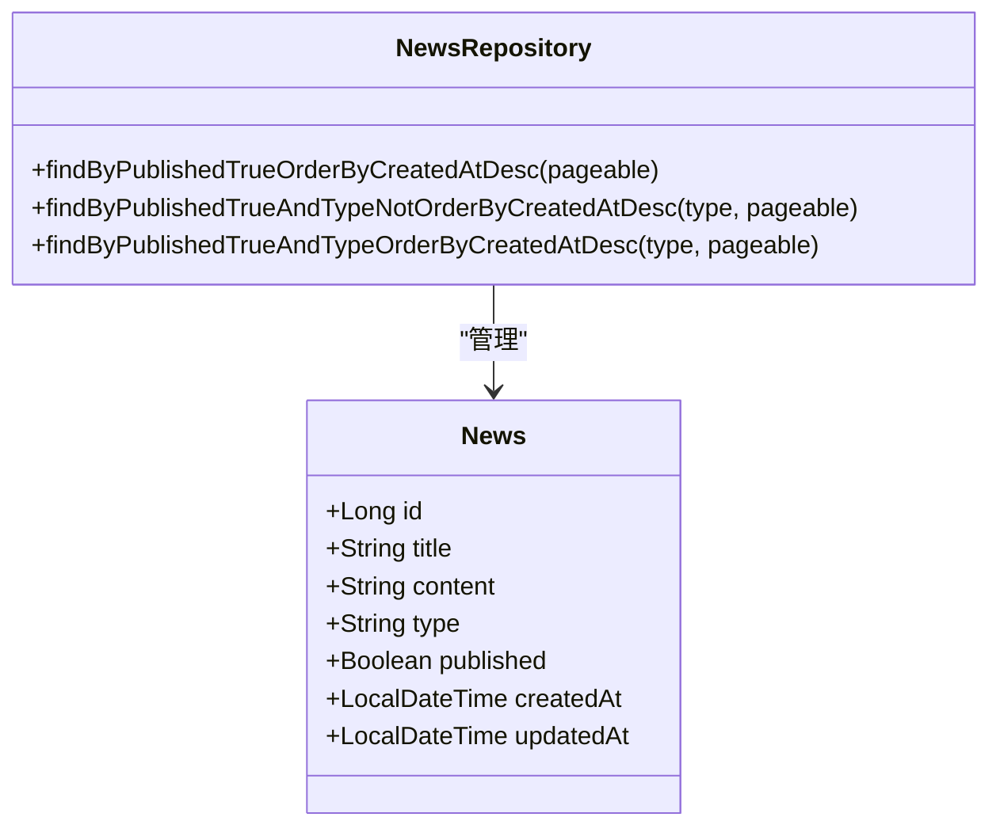
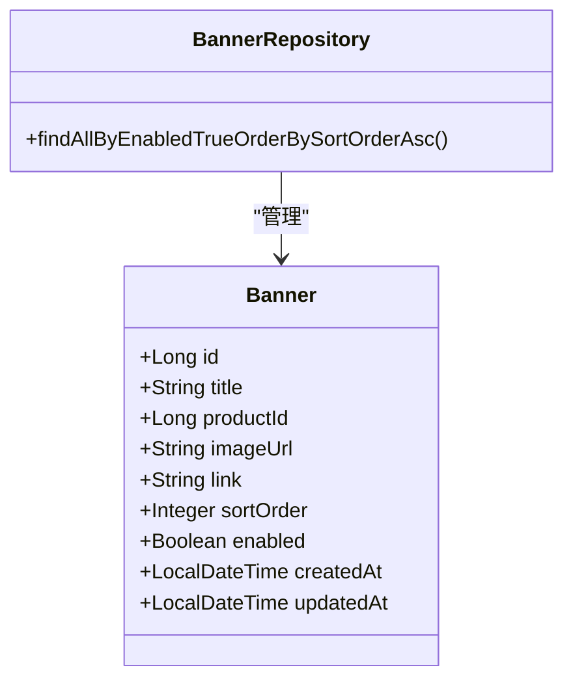
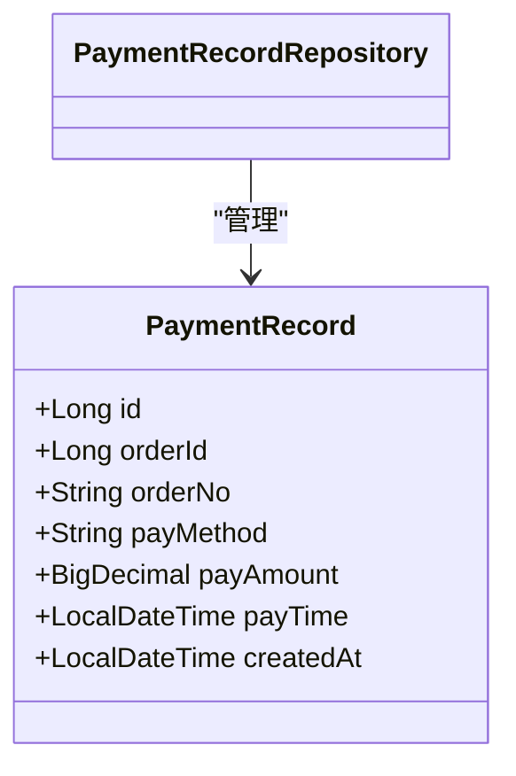
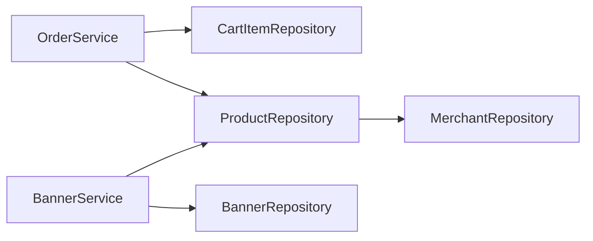

# 其他数据访问层

<cite>
**本文引用的文件**
- [FavoriteRepository.java](file://backend/src/main/java/com/mall/repository/FavoriteRepository.java)
- [CartItemRepository.java](file://backend/src/main/java/com/mall/repository/CartItemRepository.java)
- [ProductReviewRepository.java](file://backend/src/main/java/com/mall/repository/ProductReviewRepository.java)
- [MerchantRepository.java](file://backend/src/main/java/com/mall/repository/MerchantRepository.java)
- [NewsRepository.java](file://backend/src/main/java/com/mall/repository/NewsRepository.java)
- [BannerRepository.java](file://backend/src/main/java/com/mall/repository/BannerRepository.java)
- [PaymentRecordRepository.java](file://backend/src/main/java/com/mall/repository/PaymentRecordRepository.java)
- [Favorite.java](file://backend/src/main/java/com/mall/entity/Favorite.java)
- [CartItem.java](file://backend/src/main/java/com/mall/entity/CartItem.java)
- [ProductReview.java](file://backend/src/main/java/com/mall/entity/ProductReview.java)
- [Merchant.java](file://backend/src/main/java/com/mall/entity/Merchant.java)
- [News.java](file://backend/src/main/java/com/mall/entity/News.java)
- [Banner.java](file://backend/src/main/java/com/mall/entity/Banner.java)
- [PaymentRecord.java](file://backend/src/main/java/com/mall/entity/PaymentRecord.java)
- [OrderService.java](file://backend/src/main/java/com/mall/service/OrderService.java)
- [BannerService.java](file://backend/src/main/java/com/mall/service/BannerService.java)
- [ProductRepository.java](file://backend/src/main/java/com/mall/repository/ProductRepository.java)
</cite>

## 目录
1. [简介](#简介)
2. [项目结构](#项目结构)
3. [核心组件](#核心组件)
4. [架构总览](#架构总览)
5. [详细组件分析](#详细组件分析)
6. [依赖分析](#依赖分析)
7. [性能考虑](#性能考虑)
8. [故障排查指南](#故障排查指南)
9. [结论](#结论)

## 简介
本文件面向电商系统中的其他数据访问层，围绕以下Repository接口进行综合性技术文档编写：FavoriteRepository（收藏夹）、CartItemRepository（购物车）、ProductReviewRepository（商品评价）、MerchantRepository（商户）、NewsRepository（新闻资讯）、BannerRepository（轮播图）、PaymentRecordRepository（支付记录）。文档重点覆盖各Repository的查询设计、业务场景下的特殊需求（如收藏去重、购物车批量操作、评价统计、商户资质审核关联查询等），以及它们在整体业务流程中的作用与相互关系，并给出查询优化策略与数据一致性保障方案。

## 项目结构
后端采用Spring Data JPA标准Repository接口定义，结合实体类与服务层调用，形成清晰的数据访问层职责划分。各Repository均继承JpaRepository，具备基础CRUD能力，并按业务需要扩展了命名查询方法。

图表来源
- [FavoriteRepository.java:1-19](file://backend/src/main/java/com/mall/repository/FavoriteRepository.java#L1-L19)
- [CartItemRepository.java:1-21](file://backend/src/main/java/com/mall/repository/CartItemRepository.java#L1-L21)
- [ProductReviewRepository.java:1-16](file://backend/src/main/java/com/mall/repository/ProductReviewRepository.java#L1-L16)
- [MerchantRepository.java:1-9](file://backend/src/main/java/com/mall/repository/MerchantRepository.java#L1-L9)
- [NewsRepository.java:1-19](file://backend/src/main/java/com/mall/repository/NewsRepository.java#L1-L19)
- [BannerRepository.java:1-10](file://backend/src/main/java/com/mall/repository/BannerRepository.java#L1-L10)
- [PaymentRecordRepository.java:1-8](file://backend/src/main/java/com/mall/repository/PaymentRecordRepository.java#L1-L8)
- [Favorite.java:1-35](file://backend/src/main/java/com/mall/entity/Favorite.java#L1-L35)
- [CartItem.java:1-50](file://backend/src/main/java/com/mall/entity/CartItem.java#L1-L50)
- [ProductReview.java:1-44](file://backend/src/main/java/com/mall/entity/ProductReview.java#L1-L44)
- [Merchant.java:1-56](file://backend/src/main/java/com/mall/entity/Merchant.java#L1-L56)
- [News.java:1-52](file://backend/src/main/java/com/mall/entity/News.java#L1-L52)
- [Banner.java:1-60](file://backend/src/main/java/com/mall/entity/Banner.java#L1-L60)
- [PaymentRecord.java:1-46](file://backend/src/main/java/com/mall/entity/PaymentRecord.java#L1-L46)
- [OrderService.java:1-113](file://backend/src/main/java/com/mall/service/OrderService.java#L1-L113)
- [BannerService.java:1-37](file://backend/src/main/java/com/mall/service/BannerService.java#L1-L37)
- [ProductRepository.java:1-124](file://backend/src/main/java/com/mall/repository/ProductRepository.java#L1-L124)

章节来源
- [FavoriteRepository.java:1-19](file://backend/src/main/java/com/mall/repository/FavoriteRepository.java#L1-L19)
- [CartItemRepository.java:1-21](file://backend/src/main/java/com/mall/repository/CartItemRepository.java#L1-L21)
- [ProductReviewRepository.java:1-16](file://backend/src/main/java/com/mall/repository/ProductReviewRepository.java#L1-L16)
- [MerchantRepository.java:1-9](file://backend/src/main/java/com/mall/repository/MerchantRepository.java#L1-L9)
- [NewsRepository.java:1-19](file://backend/src/main/java/com/mall/repository/NewsRepository.java#L1-L19)
- [BannerRepository.java:1-10](file://backend/src/main/java/com/mall/repository/BannerRepository.java#L1-L10)
- [PaymentRecordRepository.java:1-8](file://backend/src/main/java/com/mall/repository/PaymentRecordRepository.java#L1-L8)

## 核心组件
- 收藏夹Repository（FavoriteRepository）
  - 提供按用户与商品组合查询、存在性检查、按用户与商品删除等方法，底层通过唯一约束避免重复收藏。
- 购物车Repository（CartItemRepository）
  - 提供按用户查询、按用户+商品查询、按用户+商品+规格查询、按用户批量删除等方法，支持购物车的精细化操作。
- 商品评价Repository（ProductReviewRepository）
  - 提供按商品分页查询评价、按商品列表查询等方法，支撑评价展示与统计分析。
- 商户Repository（MerchantRepository）
  - 继承JpaRepository，提供基础CRUD能力，用于商户信息维护与关联查询。
- 新闻资讯Repository（NewsRepository）
  - 提供已发布资讯的分页查询、按类型过滤的分页查询、按类型排序的列表查询等方法，支撑首页与公告展示。
- 轮播图Repository（BannerRepository）
  - 提供启用状态下的按排序字段升序查询，支撑首页轮播图渲染。
- 支付记录Repository（PaymentRecordRepository）
  - 继承JpaRepository，提供基础CRUD能力，用于支付流水记录与对账。

章节来源
- [FavoriteRepository.java:9-18](file://backend/src/main/java/com/mall/repository/FavoriteRepository.java#L9-L18)
- [CartItemRepository.java:9-20](file://backend/src/main/java/com/mall/repository/CartItemRepository.java#L9-L20)
- [ProductReviewRepository.java:10-15](file://backend/src/main/java/com/mall/repository/ProductReviewRepository.java#L10-L15)
- [MerchantRepository.java:7-8](file://backend/src/main/java/com/mall/repository/MerchantRepository.java#L7-L8)
- [NewsRepository.java:11-18](file://backend/src/main/java/com/mall/repository/NewsRepository.java#L11-L18)
- [BannerRepository.java:7-9](file://backend/src/main/java/com/mall/repository/BannerRepository.java#L7-L9)
- [PaymentRecordRepository.java:6-7](file://backend/src/main/java/com/mall/repository/PaymentRecordRepository.java#L6-L7)

## 架构总览
下图展示了数据访问层与服务层之间的交互关系，以及关键业务流程中的调用路径。

图表来源
- [OrderService.java:33-88](file://backend/src/main/java/com/mall/service/OrderService.java#L33-L88)
- [CartItemRepository.java:11-19](file://backend/src/main/java/com/mall/repository/CartItemRepository.java#L11-L19)
- [ProductRepository.java:1-124](file://backend/src/main/java/com/mall/repository/ProductRepository.java#L1-L124)

章节来源
- [OrderService.java:33-88](file://backend/src/main/java/com/mall/service/OrderService.java#L33-L88)

## 详细组件分析

### 收藏夹Repository（FavoriteRepository）
- 设计要点
  - 基于实体的唯一约束（用户+商品）实现天然去重，避免重复收藏。
  - 提供按用户查询、按用户+商品查询、存在性检查、按用户+商品删除等方法，满足收藏增删查场景。
- 特殊查询需求
  - 去重查询：通过唯一约束与存在性检查确保同一用户对同一商品仅能收藏一次。
- 业务作用
  - 支撑用户收藏功能，作为个性化推荐与订单转化的重要数据来源。
- 性能与一致性
  - 唯一约束保证数据一致性；查询方法基于索引列，具备良好性能表现。

图表来源
- [Favorite.java:8-35](file://backend/src/main/java/com/mall/entity/Favorite.java#L8-L35)
- [FavoriteRepository.java:9-18](file://backend/src/main/java/com/mall/repository/FavoriteRepository.java#L9-L18)

章节来源
- [FavoriteRepository.java:9-18](file://backend/src/main/java/com/mall/repository/FavoriteRepository.java#L9-L18)
- [Favorite.java:8-35](file://backend/src/main/java/com/mall/entity/Favorite.java#L8-L35)

### 购物车Repository（CartItemRepository）
- 设计要点
  - 实体包含用户、商品、规格与数量字段，支持按用户+商品+规格的精确匹配。
  - 提供按用户查询、按用户+商品删除、按用户批量删除等方法，便于清空购物车或下单后清理。
- 特殊查询需求
  - 批量操作：按用户批量删除，支持下单后一次性清理。
  - 精准定位：按用户+商品+规格查询，避免同商品不同规格被误删。
- 业务作用
  - 与订单服务协作，完成从购物车到订单的转换，并在下单后清理对应购物车项。
- 性能与一致性
  - 唯一约束（用户+商品+规格）避免重复添加；查询方法覆盖常用筛选条件，具备良好性能。

图表来源
- [CartItem.java:8-50](file://backend/src/main/java/com/mall/entity/CartItem.java#L8-L50)
- [CartItemRepository.java:9-20](file://backend/src/main/java/com/mall/repository/CartItemRepository.java#L9-L20)

章节来源
- [CartItemRepository.java:9-20](file://backend/src/main/java/com/mall/repository/CartItemRepository.java#L9-L20)
- [CartItem.java:8-50](file://backend/src/main/java/com/mall/entity/CartItem.java#L8-L50)

### 商品评价Repository（ProductReviewRepository）
- 设计要点
  - 提供按商品分页查询评价（按创建时间倒序）与按商品列表查询等方法。
- 特殊查询需求
  - 评价展示：按商品分页展示评价，支持翻页与排序。
  - 统计分析：可结合服务层聚合逻辑对评分、评论数等进行统计。
- 业务作用
  - 支撑商品详情页评价模块与运营侧评价管理。
- 性能与一致性
  - 分页查询配合索引可获得稳定性能；实体字段完整记录评价信息。

图表来源
- [ProductReview.java:8-44](file://backend/src/main/java/com/mall/entity/ProductReview.java#L8-L44)
- [ProductReviewRepository.java:10-15](file://backend/src/main/java/com/mall/repository/ProductReviewRepository.java#L10-L15)

章节来源
- [ProductReviewRepository.java:10-15](file://backend/src/main/java/com/mall/repository/ProductReviewRepository.java#L10-L15)
- [ProductReview.java:8-44](file://backend/src/main/java/com/mall/entity/ProductReview.java#L8-L44)

### 商户Repository（MerchantRepository）
- 设计要点
  - 继承JpaRepository，提供基础CRUD能力。
- 特殊查询需求
  - 资质审核关联查询：在商品查询中通过子查询将“上架商品”限定在“运营启用”的商户范围内，间接实现商户资质审核的查询约束。
- 业务作用
  - 作为运营启用状态的控制点，影响商品对外展示范围。
- 性能与一致性
  - 子查询在商品查询中统一应用，避免重复逻辑，提升一致性与可维护性。

图表来源
- [Merchant.java:8-56](file://backend/src/main/java/com/mall/entity/Merchant.java#L8-L56)
- [MerchantRepository.java:7-8](file://backend/src/main/java/com/mall/repository/MerchantRepository.java#L7-L8)

章节来源
- [MerchantRepository.java:7-8](file://backend/src/main/java/com/mall/repository/MerchantRepository.java#L7-L8)
- [Merchant.java:8-56](file://backend/src/main/java/com/mall/entity/Merchant.java#L8-L56)
- [ProductRepository.java:34-58](file://backend/src/main/java/com/mall/repository/ProductRepository.java#L34-L58)

### 新闻资讯Repository（NewsRepository）
- 设计要点
  - 提供已发布资讯的分页查询、按类型过滤的分页查询、按类型排序的列表查询等方法。
- 特殊查询需求
  - 首页资讯与公告分离：通过类型字段区分资讯与公告，并提供独立查询接口。
- 业务作用
  - 支撑首页公告栏与资讯列表展示。
- 性能与一致性
  - 分页查询配合索引可获得稳定性能；类型字段用于业务隔离。

图表来源
- [News.java:8-52](file://backend/src/main/java/com/mall/entity/News.java#L8-L52)
- [NewsRepository.java:11-18](file://backend/src/main/java/com/mall/repository/NewsRepository.java#L11-L18)

章节来源
- [NewsRepository.java:11-18](file://backend/src/main/java/com/mall/repository/NewsRepository.java#L11-L18)
- [News.java:8-52](file://backend/src/main/java/com/mall/entity/News.java#L8-L52)

### 轮播图Repository（BannerRepository）
- 设计要点
  - 提供启用状态下的按排序字段升序查询，支撑首页轮播图渲染。
- 特殊查询需求
  - 公共展示过滤：服务层在查询后进一步过滤掉无效商品或图片缺失的轮播项。
- 业务作用
  - 支撑首页轮播图展示与跳转。
- 性能与一致性
  - 升序排序字段用于前端展示顺序控制；服务层二次过滤保证展示质量。

图表来源
- [Banner.java:7-60](file://backend/src/main/java/com/mall/entity/Banner.java#L7-L60)
- [BannerRepository.java:7-9](file://backend/src/main/java/com/mall/repository/BannerRepository.java#L7-L9)

章节来源
- [BannerRepository.java:7-9](file://backend/src/main/java/com/mall/repository/BannerRepository.java#L7-L9)
- [Banner.java:7-60](file://backend/src/main/java/com/mall/entity/Banner.java#L7-L60)
- [BannerService.java:22-33](file://backend/src/main/java/com/mall/service/BannerService.java#L22-L33)

### 支付记录Repository（PaymentRecordRepository）
- 设计要点
  - 继承JpaRepository，提供基础CRUD能力。
- 特殊查询需求
  - 对账与查询：可通过订单号、支付方式、支付金额、支付时间等字段进行查询与核对。
- 业务作用
  - 作为支付流水记录，支撑订单支付后的数据完整性与对账。
- 性能与一致性
  - 字段设计完整，便于后续扩展查询与统计。

图表来源
- [PaymentRecord.java:9-46](file://backend/src/main/java/com/mall/entity/PaymentRecord.java#L9-L46)
- [PaymentRecordRepository.java:6-7](file://backend/src/main/java/com/mall/repository/PaymentRecordRepository.java#L6-L7)

章节来源
- [PaymentRecordRepository.java:6-7](file://backend/src/main/java/com/mall/repository/PaymentRecordRepository.java#L6-L7)
- [PaymentRecord.java:9-46](file://backend/src/main/java/com/mall/entity/PaymentRecord.java#L9-L46)

## 依赖分析
- 与订单服务的耦合
  - 订单服务在创建订单时会读取购物车并删除对应项，体现Cart与Order的直接依赖。
- 与商品查询的耦合
  - 商品查询通过子查询将“上架商品”限定在“运营启用”的商户范围内，体现Merchant与Product的间接依赖。
- 与轮播图服务的耦合
  - 轮播图服务在查询后进行二次过滤，体现Banner与Product的关联依赖。

图表来源
- [OrderService.java:33-88](file://backend/src/main/java/com/mall/service/OrderService.java#L33-L88)
- [ProductRepository.java:34-58](file://backend/src/main/java/com/mall/repository/ProductRepository.java#L34-L58)
- [BannerService.java:22-33](file://backend/src/main/java/com/mall/service/BannerService.java#L22-L33)

章节来源
- [OrderService.java:33-88](file://backend/src/main/java/com/mall/service/OrderService.java#L33-L88)
- [ProductRepository.java:34-58](file://backend/src/main/java/com/mall/repository/ProductRepository.java#L34-L58)
- [BannerService.java:22-33](file://backend/src/main/java/com/mall/service/BannerService.java#L22-L33)

## 性能考虑
- 索引与查询优化
  - 收藏与购物车的查询均基于用户与商品组合键，建议在数据库层面建立复合索引以提升命中率。
  - 商品查询中使用子查询限制商户状态，建议对商户启用状态与商品上架状态建立索引。
  - 轮播图查询按启用状态与排序字段排序，建议在启用状态与排序字段上建立索引。
- 分页与排序
  - 评价与资讯查询采用分页与排序，建议在创建时间、排序字段上建立索引，避免排序开销过大。
- 事务与一致性
  - 订单创建涉及购物车读取、库存扣减与购物车项删除，应置于同一事务中，确保原子性与一致性。
- 缓存策略
  - 对热点商品、轮播图与公告列表可引入缓存，降低数据库压力并提升响应速度。

## 故障排查指南
- 重复收藏问题
  - 现象：同一用户重复收藏同一商品。
  - 排查：确认唯一约束是否生效；检查是否存在并发插入导致的短暂异常。
  - 参考
    - [Favorite.java:9-9](file://backend/src/main/java/com/mall/entity/Favorite.java#L9-L9)
    - [FavoriteRepository.java:13-15](file://backend/src/main/java/com/mall/repository/FavoriteRepository.java#L13-L15)
- 购物车未清空或重复下单
  - 现象：下单后购物车项未删除或重复下单。
  - 排查：确认订单服务在保存订单明细后执行了删除购物车项的操作；检查事务边界。
  - 参考
    - [OrderService.java:86-86](file://backend/src/main/java/com/mall/service/OrderService.java#L86-L86)
    - [CartItemRepository.java:19-19](file://backend/src/main/java/com/mall/repository/CartItemRepository.java#L19-L19)
- 商品未显示或显示异常
  - 现象：商品未在前台展示或显示在错误区域。
  - 排查：确认商品上架状态与商户启用状态；检查商品查询是否正确应用商户启用状态过滤。
  - 参考
    - [ProductRepository.java:34-58](file://backend/src/main/java/com/mall/repository/ProductRepository.java#L34-L58)
    - [Merchant.java:37-37](file://backend/src/main/java/com/mall/entity/Merchant.java#L37-L37)
- 轮播图不显示或跳转异常
  - 现象：轮播图不显示或点击无跳转。
  - 排查：确认轮播图启用状态与排序字段；检查服务层二次过滤逻辑是否剔除了无效项。
  - 参考
    - [BannerRepository.java:8-8](file://backend/src/main/java/com/mall/repository/BannerRepository.java#L8-L8)
    - [BannerService.java:27-33](file://backend/src/main/java/com/mall/service/BannerService.java#L27-L33)

章节来源
- [Favorite.java:9-9](file://backend/src/main/java/com/mall/entity/Favorite.java#L9-L9)
- [FavoriteRepository.java:13-15](file://backend/src/main/java/com/mall/repository/FavoriteRepository.java#L13-L15)
- [OrderService.java:86-86](file://backend/src/main/java/com/mall/service/OrderService.java#L86-L86)
- [CartItemRepository.java:19-19](file://backend/src/main/java/com/mall/repository/CartItemRepository.java#L19-L19)
- [ProductRepository.java:34-58](file://backend/src/main/java/com/mall/repository/ProductRepository.java#L34-L58)
- [Merchant.java:37-37](file://backend/src/main/java/com/mall/entity/Merchant.java#L37-L37)
- [BannerRepository.java:8-8](file://backend/src/main/java/com/mall/repository/BannerRepository.java#L8-L8)
- [BannerService.java:27-33](file://backend/src/main/java/com/mall/service/BannerService.java#L27-L33)

## 结论
本文档系统梳理了收藏夹、购物车、商品评价、商户、新闻资讯、轮播图与支付记录等Repository的设计与实现，明确了其在业务流程中的角色与相互依赖关系，并给出了针对去重、批量操作、统计分析与资质审核等特殊查询需求的解决方案与优化建议。通过合理的索引设计、事务边界与缓存策略，可在保证数据一致性的前提下显著提升查询性能与用户体验。