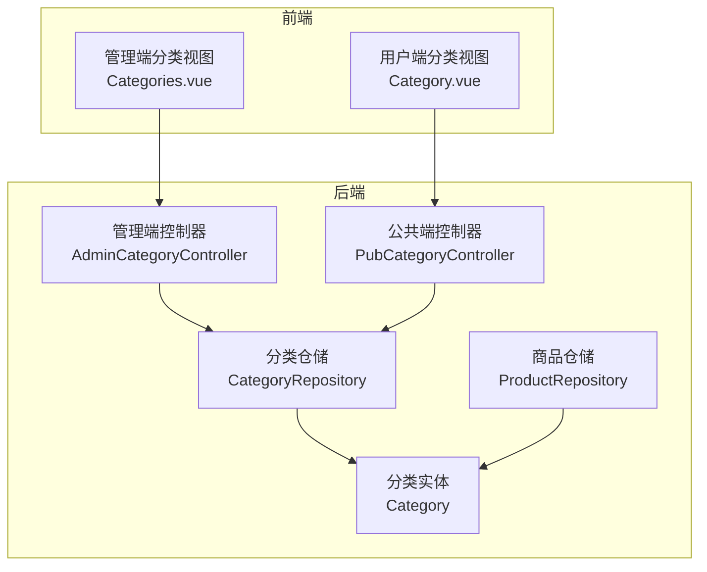
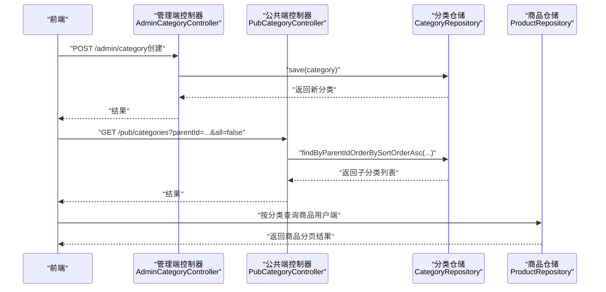
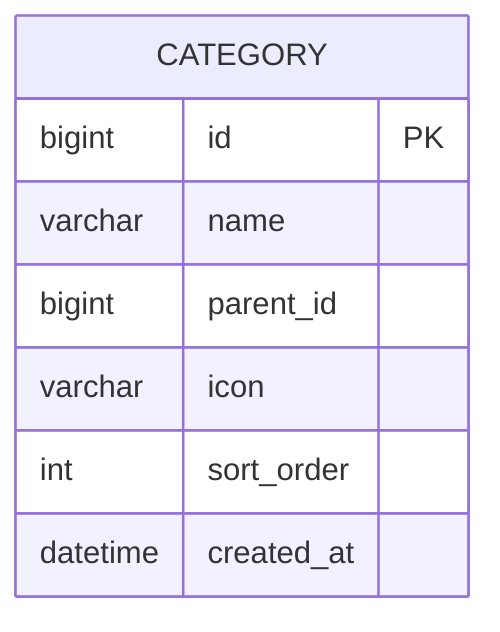
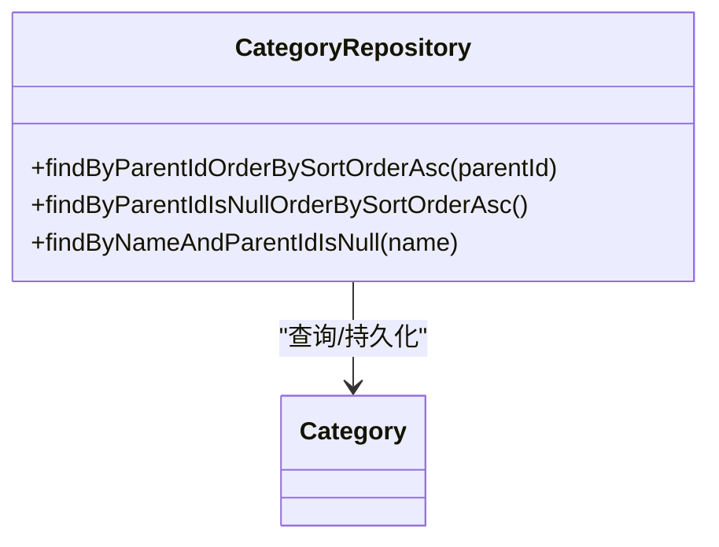
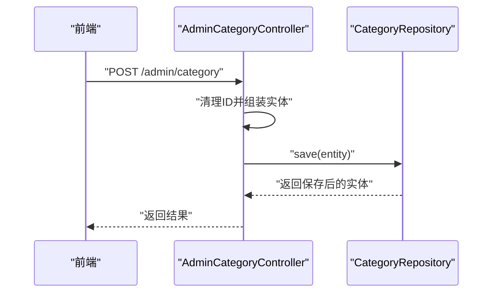
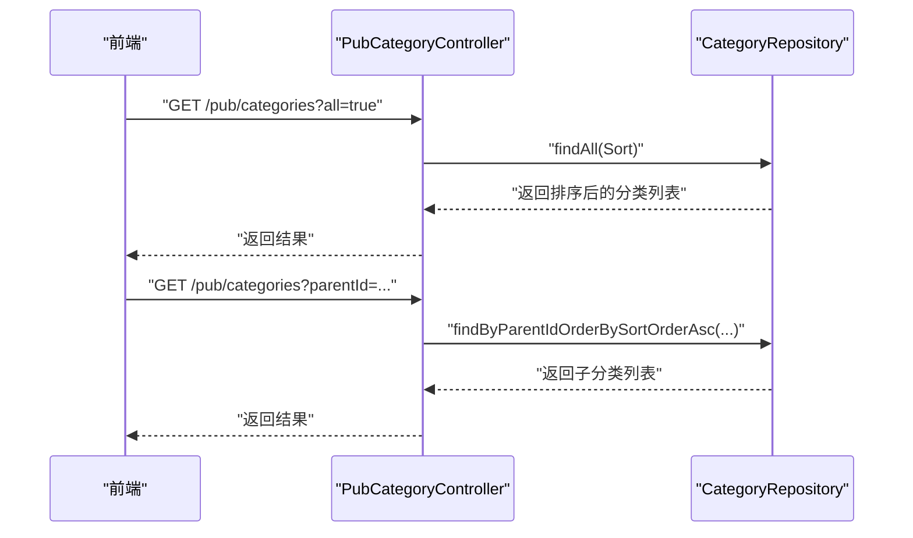
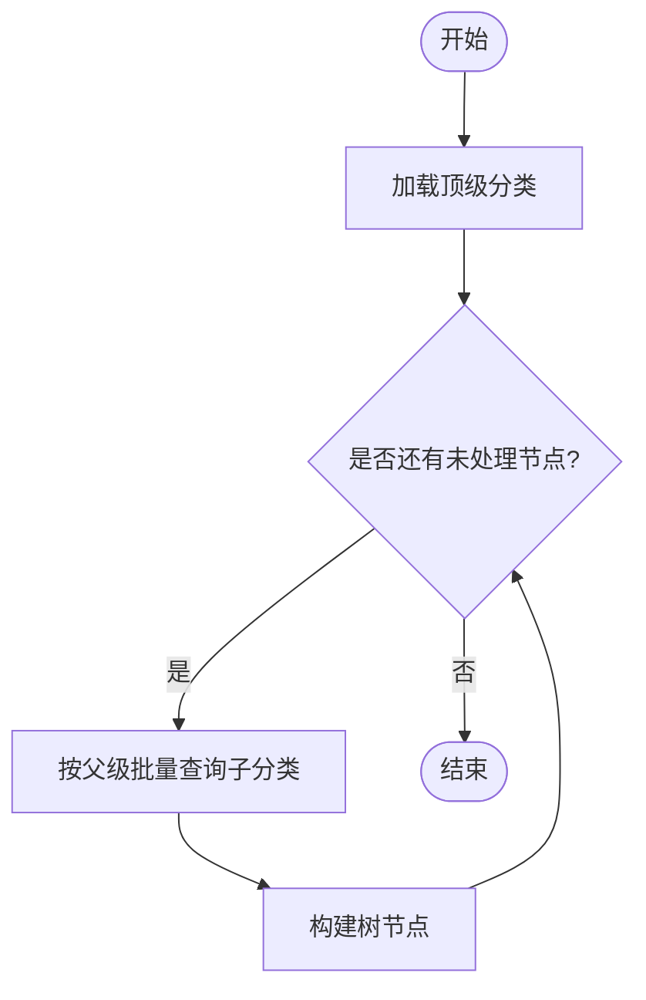
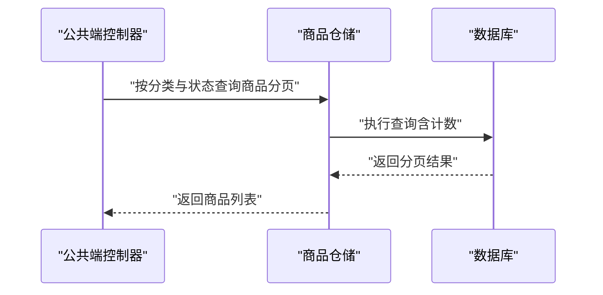
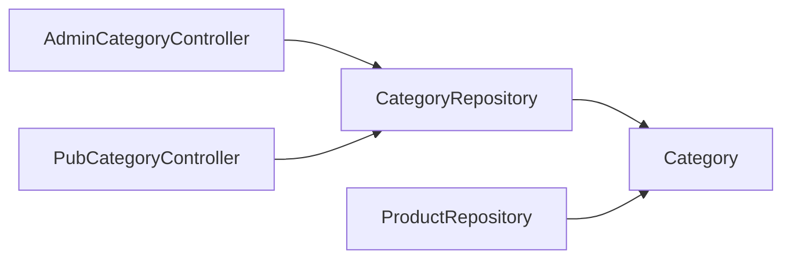

# 分类数据访问层

<cite>
**本文引用的文件**
- [Category.java](file://backend/src/main/java/com/mall/entity/Category.java)
- [CategoryRepository.java](file://backend/src/main/java/com/mall/repository/CategoryRepository.java)
- [PubCategoryController.java](file://backend/src/main/java/com/mall/controller/pub/PubCategoryController.java)
- [AdminCategoryController.java](file://backend/src/main/java/com/mall/controller/admin/AdminCategoryController.java)
- [ProductRepository.java](file://backend/src/main/java/com/mall/repository/ProductRepository.java)
- [application.yml](file://backend/src/main/resources/application.yml)
- [MallApplication.java](file://backend/src/main/java/com/mall/MallApplication.java)
- [Categories.vue](file://frontend/src/views/admin/Categories.vue)
- [Category.vue](file://frontend/src/views/user/Category.vue)
</cite>

## 目录
1. [引言](#引言)
2. [项目结构](#项目结构)
3. [核心组件](#核心组件)
4. [架构总览](#架构总览)
5. [详细组件分析](#详细组件分析)
6. [依赖分析](#依赖分析)
7. [性能考量](#性能考量)
8. [故障排查指南](#故障排查指南)
9. [结论](#结论)
10. [附录](#附录)

## 引言
本文件聚焦于电商系统中的“分类数据访问层”，围绕 CategoryRepository 接口的设计与实现展开，系统性阐述以下主题：
- 商品分类的层级结构查询与父子关系处理
- 分类树形结构的递归查询思路与实现建议
- 分类的增删改查操作在控制层与仓储层的映射
- 分类层级遍历算法与分类商品数量统计的实现路径
- 自定义查询实现分类的快速检索与排序
- 分类缓存策略的考虑与落地建议
- 商品分类管理场景下的数据访问最佳实践与查询性能优化技巧

## 项目结构
后端采用 Spring Boot + Spring Data JPA 架构，分类相关代码分布如下：
- 实体层：Category 实体定义了分类的主键、名称、父级、图标、排序字段及创建时间等属性
- 数据访问层：CategoryRepository 提供基于父级的查询与排序能力
- 控制层：AdminCategoryController 与 PubCategoryController 分别提供管理端与公共端的分类接口
- 商品仓储：ProductRepository 提供与分类关联的商品查询能力，便于统计某分类下的商品数量
- 前端视图：Categories.vue（管理端）与 Category.vue（用户端）展示了分类数据的使用场景

**图表来源**
- [AdminCategoryController.java:1-47](file://backend/src/main/java/com/mall/controller/admin/AdminCategoryController.java#L1-47)
- [PubCategoryController.java:1-38](file://backend/src/main/java/com/mall/controller/pub/PubCategoryController.java#L1-38)
- [CategoryRepository.java:1-17](file://backend/src/main/java/com/mall/repository/CategoryRepository.java#L1-17)
- [Category.java:1-41](file://backend/src/main/java/com/mall/entity/Category.java#L1-41)
- [ProductRepository.java:1-125](file://backend/src/main/java/com/mall/repository/ProductRepository.java#L1-125)
- [Categories.vue:1-236](file://frontend/src/views/admin/Categories.vue#L1-236)
- [Category.vue:1-35](file://frontend/src/views/user/Category.vue#L1-35)

**章节来源**
- [MallApplication.java:1-13](file://backend/src/main/java/com/mall/MallApplication.java#L1-13)
- [application.yml:1-36](file://backend/src/main/resources/application.yml#L1-36)

## 核心组件
- 分类实体 Category：包含主键、名称、父级、图标、排序、创建时间等字段，并在持久化前自动填充创建时间
- 分类仓储 CategoryRepository：继承 JpaRepository，提供按父级查询与排序的能力，以及按名称与父级为空的唯一性查询
- 管理端控制器 AdminCategoryController：提供分类列表、创建、更新、删除的 REST 接口
- 公共端控制器 PubCategoryController：提供分类列表查询接口，支持按父级或全量查询
- 商品仓储 ProductRepository：提供按分类与状态过滤的商品查询，可用于统计某分类下的商品数量

**章节来源**
- [Category.java:1-41](file://backend/src/main/java/com/mall/entity/Category.java#L1-41)
- [CategoryRepository.java:1-17](file://backend/src/main/java/com/mall/repository/CategoryRepository.java#L1-17)
- [AdminCategoryController.java:1-47](file://backend/src/main/java/com/mall/controller/admin/AdminCategoryController.java#L1-47)
- [PubCategoryController.java:1-38](file://backend/src/main/java/com/mall/controller/pub/PubCategoryController.java#L1-38)
- [ProductRepository.java:1-125](file://backend/src/main/java/com/mall/repository/ProductRepository.java#L1-125)

## 架构总览
分类数据访问层遵循“控制层-服务层-仓储层-实体层”的分层设计，控制层负责请求接入与参数校验，仓储层负责数据查询与持久化，实体层描述数据库表结构。

**图表来源**
- [AdminCategoryController.java:26-38](file://backend/src/main/java/com/mall/controller/admin/AdminCategoryController.java#L26-L38)
- [PubCategoryController.java:21-36](file://backend/src/main/java/com/mall/controller/pub/PubCategoryController.java#L21-L36)
- [CategoryRepository.java:11-16](file://backend/src/main/java/com/mall/repository/CategoryRepository.java#L11-L16)
- [ProductRepository.java:19-58](file://backend/src/main/java/com/mall/repository/ProductRepository.java#L19-L58)

## 详细组件分析

### 分类实体与表结构
- 字段设计：主键、名称、父级、图标、排序、创建时间；其中排序默认值为 0，创建时间在持久化前自动填充
- 关系模型：通过 parentId 指向父分类，形成树形层级结构；顶级分类的 parentId 为 null
- 时间戳：createdAt 仅在插入时设置，避免后续更新覆盖

**图表来源**
- [Category.java:17-39](file://backend/src/main/java/com/mall/entity/Category.java#L17-L39)

**章节来源**
- [Category.java:1-41](file://backend/src/main/java/com/mall/entity/Category.java#L1-41)

### 分类仓储接口设计
- findByParentIdOrderBySortOrderAsc：按父级查询并按排序字段升序排列
- findByParentIdIsNullOrderBySortOrderAsc：查询顶级分类（父级为空）
- findByNameAndParentIdIsNull：按名称与父级为空查询唯一分类，用于名称唯一性约束

**图表来源**
- [CategoryRepository.java:9-16](file://backend/src/main/java/com/mall/repository/CategoryRepository.java#L9-L16)

**章节来源**
- [CategoryRepository.java:1-17](file://backend/src/main/java/com/mall/repository/CategoryRepository.java#L1-17)

### 管理端分类接口
- 列表：返回所有分类
- 创建：清空 ID 后保存，支持设置父级与排序
- 更新：传入 ID 后保存
- 删除：按 ID 删除

**图表来源**
- [AdminCategoryController.java:26-38](file://backend/src/main/java/com/mall/controller/admin/AdminCategoryController.java#L26-L38)

**章节来源**
- [AdminCategoryController.java:1-47](file://backend/src/main/java/com/mall/controller/admin/AdminCategoryController.java#L1-47)

### 公共端分类接口
- 支持两种查询模式：
  - all=true：返回全部分类，按排序与 ID 升序
  - parentId 参数：若为空则查询顶级分类，否则查询指定父级的子分类
- 该接口直接调用仓储层的查询方法，保证排序一致性

**图表来源**
- [PubCategoryController.java:21-36](file://backend/src/main/java/com/mall/controller/pub/PubCategoryController.java#L21-L36)
- [CategoryRepository.java:11-13](file://backend/src/main/java/com/mall/repository/CategoryRepository.java#L11-L13)

**章节来源**
- [PubCategoryController.java:1-38](file://backend/src/main/java/com/mall/controller/pub/PubCategoryController.java#L1-38)

### 分类层级遍历与树形结构
- 当前实现：通过父级字段逐层查询，先获取顶级分类，再逐级获取子分类
- 递归查询建议：
  - 在服务层构建树形结构：先查询所有分类，再以 parentId 为键组织子节点
  - 使用分页与批量查询减少 N+1 查询
  - 对热点分类可引入缓存，提升遍历效率
- 注意事项：避免循环引用与重复查询，确保排序字段一致

[此图为概念流程图，无需图表来源]

### 分类商品数量统计
- 统计方式：通过商品仓储按分类与状态过滤查询，统计符合条件的商品数量
- 典型查询：按分类与“上架”状态过滤，或结合商家启用状态进行公开端统计
- 性能建议：对高频统计字段建立索引，使用分页与投影减少数据传输

**图表来源**
- [ProductRepository.java:19-58](file://backend/src/main/java/com/mall/repository/ProductRepository.java#L19-L58)

**章节来源**
- [ProductRepository.java:1-125](file://backend/src/main/java/com/mall/repository/ProductRepository.java#L1-125)

### 自定义查询与排序优化
- 自定义 JPQL/原生 SQL：可在商品仓储中添加按分类与状态组合的复杂查询，以支持快速检索
- 排序策略：优先使用数据库排序，避免在内存中二次排序
- 索引建议：为分类的 parentId、sortOrder、name 建立复合索引，提升查询与排序性能

**章节来源**
- [ProductRepository.java:34-105](file://backend/src/main/java/com/mall/repository/ProductRepository.java#L34-L105)
- [CategoryRepository.java:11-16](file://backend/src/main/java/com/mall/repository/CategoryRepository.java#L11-L16)

### 分类缓存策略
- 缓存对象：分类树、顶级分类列表、按父级的子分类列表
- 缓存键：如 “category_tree”、“category_children:{parentId}”
- 失效策略：分类变更（增删改）时主动失效相关缓存键
- 容错与一致性：读取缓存失败回源数据库，写入时采用“先写库再写缓存”顺序

[本节为通用策略说明，无需章节来源]

## 依赖分析
- 控制层依赖仓储层：AdminCategoryController 与 PubCategoryController 直接依赖 CategoryRepository
- 仓储层依赖实体层：CategoryRepository 操作 Category 实体
- 商品仓储与分类关联：ProductRepository 的查询涉及分类字段，用于统计与展示
- 前端依赖后端接口：管理端与用户端分别调用对应的分类接口

**图表来源**
- [AdminCategoryController.java:18-24](file://backend/src/main/java/com/mall/controller/admin/AdminCategoryController.java#L18-L24)
- [PubCategoryController.java:19-26](file://backend/src/main/java/com/mall/controller/pub/PubCategoryController.java#L19-L26)
- [CategoryRepository.java:9-16](file://backend/src/main/java/com/mall/repository/CategoryRepository.java#L9-L16)
- [ProductRepository.java:19-58](file://backend/src/main/java/com/mall/repository/ProductRepository.java#L19-L58)

**章节来源**
- [AdminCategoryController.java:1-47](file://backend/src/main/java/com/mall/controller/admin/AdminCategoryController.java#L1-47)
- [PubCategoryController.java:1-38](file://backend/src/main/java/com/mall/controller/pub/PubCategoryController.java#L1-38)
- [CategoryRepository.java:1-17](file://backend/src/main/java/com/mall/repository/CategoryRepository.java#L1-17)
- [ProductRepository.java:1-125](file://backend/src/main/java/com/mall/repository/ProductRepository.java#L1-125)

## 性能考量
- 查询性能
  - 使用 orderBySortOrderAsc 保证排序稳定性，避免在应用层二次排序
  - 对高频查询建立数据库索引，如 (parentId, sortOrder)、(name, parentId)
- 分页与批量
  - 使用 Pageable 进行分页，避免一次性加载大量数据
  - 批量查询子分类，减少多次往返
- 缓存
  - 对分类树与热门分类列表进行缓存，降低数据库压力
  - 写入时采用“先写数据库再写缓存”的顺序，确保一致性
- SQL 优化
  - 避免 N+1 查询，尽量一次性加载所需数据
  - 使用投影或 DTO 减少字段传输

[本节提供通用性能建议，无需章节来源]

## 故障排查指南
- 常见问题
  - 分类排序异常：检查 sortOrder 字段是否正确设置，以及查询排序条件是否一致
  - 子分类缺失：确认 parentId 是否正确，是否存在孤立数据
  - 名称冲突：利用 findByNameAndParentIdIsNull 确保同级分类名称唯一
- 排查步骤
  - 核对数据库中分类记录的 parentId 与 sortOrder
  - 通过控制台接口验证查询逻辑
  - 检查 JPA 配置与日志输出，定位慢查询
- 前端联动
  - 管理端 Categories.vue 支持按名称与父级筛选，有助于定位问题数据
  - 用户端 Category.vue 展示按分类的商品列表，可辅助验证分类与商品关联

**章节来源**
- [CategoryRepository.java:15-16](file://backend/src/main/java/com/mall/repository/CategoryRepository.java#L15-L16)
- [Categories.vue:134-155](file://frontend/src/views/admin/Categories.vue#L134-L155)
- [application.yml:9-17](file://backend/src/main/resources/application.yml#L9-L17)

## 结论
本分类数据访问层以简洁的仓储接口与清晰的控制层职责实现了对商品分类的高效管理。通过父级与排序字段的规范设计，结合分页与批量查询，能够满足管理端与公共端的多样化需求。建议在现有基础上引入缓存与索引优化，并在服务层实现树形结构的统一构建，以进一步提升查询性能与可维护性。

## 附录
- 配置参考：JPA 与 MySQL 连接配置位于 application.yml
- 应用入口：MallApplication 启动类

**章节来源**
- [application.yml:1-36](file://backend/src/main/resources/application.yml#L1-36)
- [MallApplication.java:1-13](file://backend/src/main/java/com/mall/MallApplication.java#L1-13)