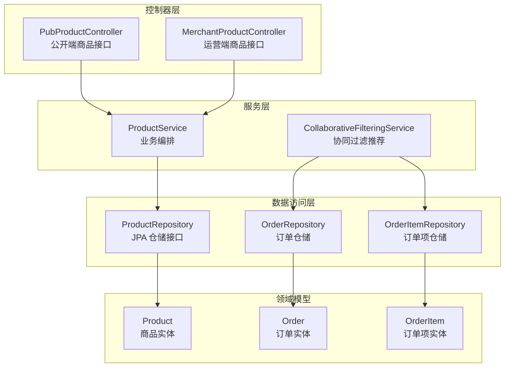
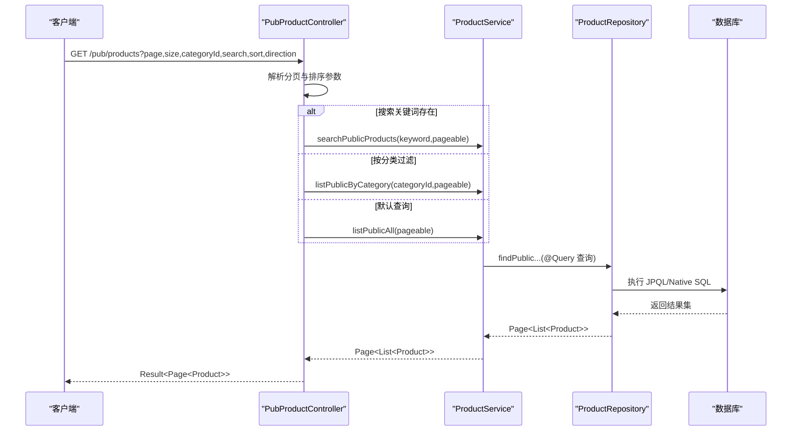
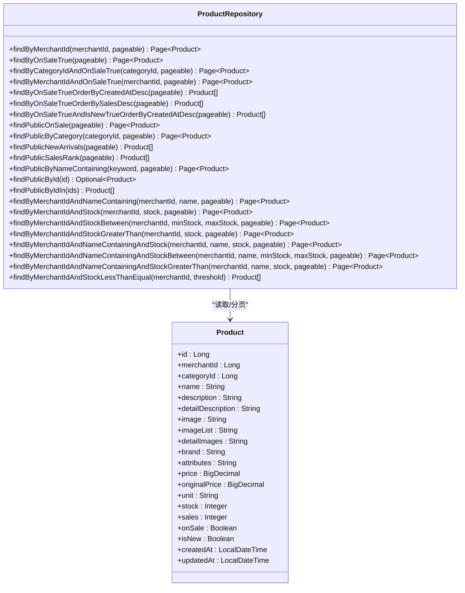
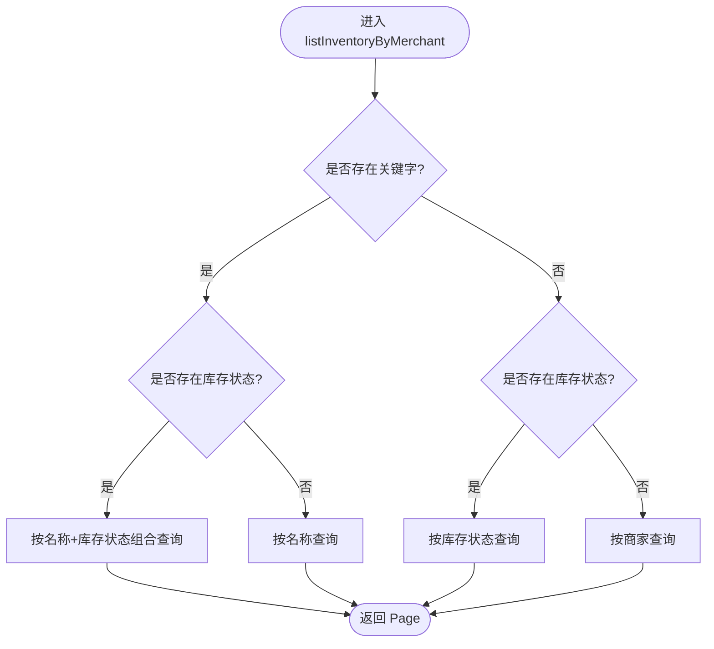
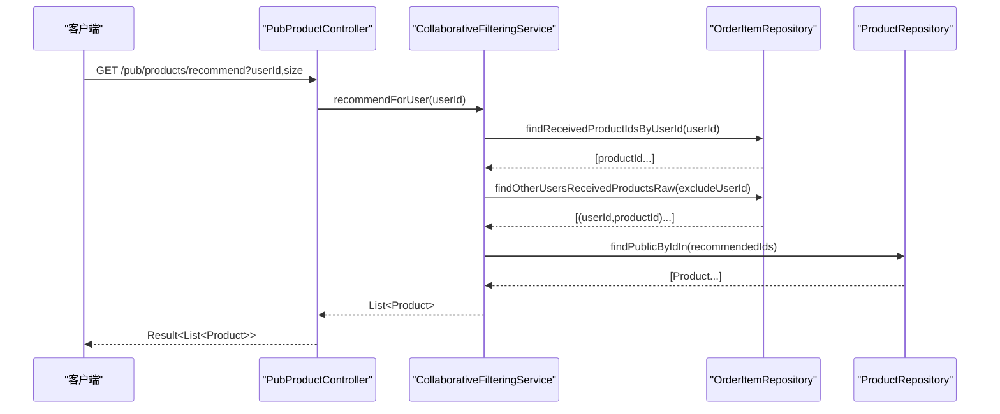
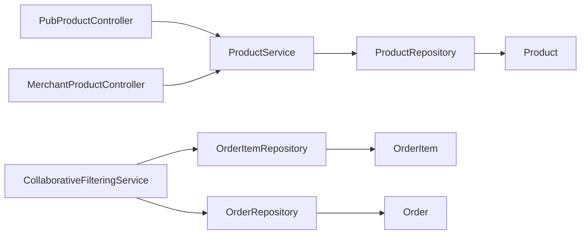

# 商品数据访问层

<cite>
**本文引用的文件**
- [ProductRepository.java](file://backend/src/main/java/com/mall/repository/ProductRepository.java)
- [Product.java](file://backend/src/main/java/com/mall/entity/Product.java)
- [ProductService.java](file://backend/src/main/java/com/mall/service/ProductService.java)
- [PubProductController.java](file://backend/src/main/java/com/mall/controller/pub/PubProductController.java)
- [MerchantProductController.java](file://backend/src/main/java/com/mall/controller/merchant/MerchantProductController.java)
- [CollaborativeFilteringService.java](file://backend/src/main/java/com/mall/service/CollaborativeFilteringService.java)
- [OrderItemRepository.java](file://backend/src/main/java/com/mall/repository/OrderItemRepository.java)
- [OrderRepository.java](file://backend/src/main/java/com/mall/repository/OrderRepository.java)
- [application.yml](file://backend/src/main/resources/application.yml)
</cite>

## 目录
1. [简介](#简介)
2. [项目结构](#项目结构)
3. [核心组件](#核心组件)
4. [架构总览](#架构总览)
5. [详细组件分析](#详细组件分析)
6. [依赖分析](#依赖分析)
7. [性能考量](#性能考量)
8. [故障排查指南](#故障排查指南)
9. [结论](#结论)
10. [附录](#附录)

## 简介
本技术文档聚焦于商品数据访问层，系统性解析 ProductRepository 接口的设计与实现，覆盖以下关键主题：
- 商品信息的增删改查与分页查询
- 商品搜索与筛选（名称关键字、分类、状态）
- 库存管理查询（按商家、名称、库存阈值、区间）
- 商品分类关联查询与价格/销量排序
- 商品推荐（协同过滤）相关查询优化
- 使用 @Query 注解实现高效 SQL 查询
- 数据访问最佳实践与性能优化建议

## 项目结构
商品数据访问层位于后端模块 backend 中，采用 Spring Data JPA 的仓储模式，结合服务层与控制器层对外提供管理端与公开端的商品查询与维护能力。

图表来源
- [PubProductController.java:1-95](file://backend/src/main/java/com/mall/controller/pub/PubProductController.java#L1-L95)
- [MerchantProductController.java:1-180](file://backend/src/main/java/com/mall/controller/merchant/MerchantProductController.java#L1-L180)
- [ProductService.java:1-126](file://backend/src/main/java/com/mall/service/ProductService.java#L1-L126)
- [CollaborativeFilteringService.java:1-81](file://backend/src/main/java/com/mall/service/CollaborativeFilteringService.java#L1-L81)
- [ProductRepository.java:1-125](file://backend/src/main/java/com/mall/repository/ProductRepository.java#L1-L125)
- [OrderItemRepository.java:1-20](file://backend/src/main/java/com/mall/repository/OrderItemRepository.java#L1-L20)
- [OrderRepository.java:1-28](file://backend/src/main/java/com/mall/repository/OrderRepository.java#L1-L28)
- [Product.java:1-101](file://backend/src/main/java/com/mall/entity/Product.java#L1-L101)

章节来源
- [application.yml:1-36](file://backend/src/main/resources/application.yml#L1-L36)

## 核心组件
- ProductRepository：继承 JpaRepository，提供商品的 CRUD、分页、条件查询与复杂 @Query 查询。涵盖管理端与公开端两类查询场景，并包含库存管理相关查询方法。
- ProductService：面向业务的编排层，负责将控制器请求转换为仓储调用，处理排序、分页与业务规则（如库存状态映射）。
- PubProductController 与 MerchantProductController：分别提供公开端与运营端的商品查询接口，支持分页、排序、搜索、分类过滤等。
- CollaborativeFilteringService：基于订单行为的协同过滤推荐，依赖 OrderItemRepository 与 ProductRepository 完成推荐流程与回退策略。

章节来源
- [ProductRepository.java:12-125](file://backend/src/main/java/com/mall/repository/ProductRepository.java#L12-L125)
- [ProductService.java:15-126](file://backend/src/main/java/com/mall/service/ProductService.java#L15-L126)
- [PubProductController.java:15-95](file://backend/src/main/java/com/mall/controller/pub/PubProductController.java#L15-L95)
- [MerchantProductController.java:18-180](file://backend/src/main/java/com/mall/controller/merchant/MerchantProductController.java#L18-L180)
- [CollaborativeFilteringService.java:14-81](file://backend/src/main/java/com/mall/service/CollaborativeFilteringService.java#L14-L81)

## 架构总览
商品数据访问层遵循分层架构：控制器接收请求，服务层编排业务逻辑，仓储层负责数据持久化与查询，实体模型承载数据结构与元数据。

图表来源
- [PubProductController.java:24-46](file://backend/src/main/java/com/mall/controller/pub/PubProductController.java#L24-L46)
- [ProductService.java:42-82](file://backend/src/main/java/com/mall/service/ProductService.java#L42-L82)
- [ProductRepository.java:34-105](file://backend/src/main/java/com/mall/repository/ProductRepository.java#L34-L105)

## 详细组件分析

### ProductRepository 设计与实现
- 继承关系：基于 JpaRepository<Product, Long>，天然具备基础 CRUD 与分页能力。
- 方法族划分：
  - 管理端查询：按商家、分类、是否上架、创建时间/销量排序等。
  - 公开端查询：在管理端基础上增加“商家启用”约束，确保仅返回运营可用的商品。
  - 搜索与筛选：名称关键字模糊匹配、库存阈值与区间查询。
  - 推荐辅助：按 ID 集合查询公开商品，用于推荐回填。
- 关键设计点：
  - 使用 @Query 自定义 JPQL/Native SQL，显式 countQuery 提升分页统计效率。
  - 将“商家启用”校验下沉到 SQL 层，避免在应用层重复过滤。
  - 通过 Pageable 支持灵活的分页与排序，减少一次性加载大量数据。

章节来源
- [ProductRepository.java:13-125](file://backend/src/main/java/com/mall/repository/ProductRepository.java#L13-L125)

#### 类图：仓储接口与实体关系

图表来源
- [ProductRepository.java:13-125](file://backend/src/main/java/com/mall/repository/ProductRepository.java#L13-L125)
- [Product.java:16-100](file://backend/src/main/java/com/mall/entity/Product.java#L16-L100)

### 商品搜索与筛选实现
- 公开端搜索：使用 @Query 对名称或描述进行模糊匹配，并限定 onSale 与商家启用状态；同时提供 countQuery 以提升分页统计性能。
- 管理端搜索：支持按商家、名称关键字与库存状态组合查询，服务层根据入参动态选择具体仓储方法。
- 筛选策略：
  - 关键字为空时，仅按商家与库存状态筛选。
  - 关键字不为空时，先按名称过滤，再按库存状态细分。
  - 库存状态枚举映射：缺货、低库存、正常。

章节来源
- [ProductRepository.java:93-105](file://backend/src/main/java/com/mall/repository/ProductRepository.java#L93-L105)
- [ProductService.java:94-119](file://backend/src/main/java/com/mall/service/ProductService.java#L94-L119)

#### 流程图：库存管理查询分支

图表来源
- [ProductService.java:94-119](file://backend/src/main/java/com/mall/service/ProductService.java#L94-L119)
- [ProductRepository.java:109-123](file://backend/src/main/java/com/mall/repository/ProductRepository.java#L109-L123)

### 商品分类关联查询与排序
- 分类关联查询：通过 categoryId 与 onSale 组合查询，公开端额外加入商家启用限制。
- 排序策略：
  - 按创建时间倒序：新品展示。
  - 按销量倒序：销售排行。
  - 控制器层支持前端传参映射到实体字段（价格、销量、创建时间），并设置升/降序。

章节来源
- [ProductRepository.java:19-28](file://backend/src/main/java/com/mall/repository/ProductRepository.java#L19-L28)
- [PubProductController.java:48-61](file://backend/src/main/java/com/mall/controller/pub/PubProductController.java#L48-L61)

### 价格范围与商品状态过滤
- 价格范围：通过 JPQL 的 IN 子句与 onSale 约束实现，适用于推荐回填与批量查询。
- 商品状态过滤：统一使用 onSale 字段控制上下架状态；公开端查询进一步限定商家启用状态。
- 推荐回填：findPublicByIdIn 用于将协同过滤得到的商品 ID 列表回填为完整商品对象。

章节来源
- [ProductRepository.java:29-30](file://backend/src/main/java/com/mall/repository/ProductRepository.java#L29-L30)
- [ProductRepository.java:85-83](file://backend/src/main/java/com/mall/repository/ProductRepository.java#L85-L83)
- [CollaborativeFilteringService.java:32-75](file://backend/src/main/java/com/mall/service/CollaborativeFilteringService.java#L32-L75)

### 商品推荐相关查询优化
- 推荐算法：基于“共同购买”的协同过滤，统计其他用户与当前用户共同购买的商品，按共同度打分排序。
- 查询路径：
  - 获取当前用户已收货商品 ID 列表。
  - 遍历其他用户的已收货商品集合，计算共同度。
  - 生成候选商品 ID 列表，使用 findPublicByIdIn 回填商品。
  - 若无足够样本，回退到公开销量排行（findPublicSalesRank）。
- 性能要点：
  - 使用原生 SQL 快速扫描订单与订单项，降低 ORM 开销。
  - 限制推荐上限与最小共同度，避免过度计算。
  - 通过 PageRequest 控制回退查询的大小。

章节来源
- [CollaborativeFilteringService.java:14-81](file://backend/src/main/java/com/mall/service/CollaborativeFilteringService.java#L14-L81)
- [OrderItemRepository.java:13-18](file://backend/src/main/java/com/mall/repository/OrderItemRepository.java#L13-L18)
- [ProductRepository.java:77-79](file://backend/src/main/java/com/mall/repository/ProductRepository.java#L77-L79)

#### 序列图：协同过滤推荐流程

图表来源
- [PubProductController.java:85-93](file://backend/src/main/java/com/mall/controller/pub/PubProductController.java#L85-L93)
- [CollaborativeFilteringService.java:32-75](file://backend/src/main/java/com/mall/service/CollaborativeFilteringService.java#L32-L75)
- [OrderItemRepository.java:13-18](file://backend/src/main/java/com/mall/repository/OrderItemRepository.java#L13-L18)
- [ProductRepository.java:85-83](file://backend/src/main/java/com/mall/repository/ProductRepository.java#L85-L83)

### 分页查询的性能考虑
- 使用 Pageable 与 @Query(countQuery=...)：确保分页统计高效，避免全量扫描。
- 控制排序字段：仅允许有限字段参与排序，避免索引失效。
- 合理的分页大小：控制器默认 size=12 或 10，避免过大页导致内存压力。
- 推荐回退策略：当协同过滤样本不足时，回退到销量排行，减少复杂计算。

章节来源
- [PubProductController.java:27-37](file://backend/src/main/java/com/mall/controller/pub/PubProductController.java#L27-L37)
- [CollaborativeFilteringService.java:77-79](file://backend/src/main/java/com/mall/service/CollaborativeFilteringService.java#L77-L79)

### 增删改查与库存管理
- 增删改查：通过 JpaRepository 原生方法与自定义 @Query 实现；控制器层负责鉴权与参数校验。
- 库存管理：
  - 按商家查询商品列表，支持名称关键字与库存状态筛选。
  - 提供低库存阈值查询，便于预警与补货。
- 运营端接口：MerchantProductController 将登录用户映射为商家 ID，确保数据隔离与权限控制。

章节来源
- [MerchantProductController.java:28-34](file://backend/src/main/java/com/mall/controller/merchant/MerchantProductController.java#L28-L34)
- [ProductService.java:94-124](file://backend/src/main/java/com/mall/service/ProductService.java#L94-L124)

## 依赖分析
- 控制器依赖服务层，服务层依赖仓储层，仓储层依赖实体模型。
- 推荐服务依赖订单与订单项仓储，以获取用户行为数据。
- 公开端查询统一依赖 ProductRepository 的 @Query 方法，确保业务一致性与性能。

图表来源
- [PubProductController.java:15-95](file://backend/src/main/java/com/mall/controller/pub/PubProductController.java#L15-L95)
- [MerchantProductController.java:18-180](file://backend/src/main/java/com/mall/controller/merchant/MerchantProductController.java#L18-L180)
- [ProductService.java:15-126](file://backend/src/main/java/com/mall/service/ProductService.java#L15-L126)
- [CollaborativeFilteringService.java:14-81](file://backend/src/main/java/com/mall/service/CollaborativeFilteringService.java#L14-L81)
- [ProductRepository.java:13-125](file://backend/src/main/java/com/mall/repository/ProductRepository.java#L13-L125)
- [OrderItemRepository.java:1-20](file://backend/src/main/java/com/mall/repository/OrderItemRepository.java#L1-L20)
- [OrderRepository.java:1-28](file://backend/src/main/java/com/mall/repository/OrderRepository.java#L1-L28)
- [Product.java:16-100](file://backend/src/main/java/com/mall/entity/Product.java#L16-L100)
- [OrderItem.java:1-73](file://backend/src/main/java/com/mall/entity/OrderItem.java#L1-L73)
- [Order.java:1-83](file://backend/src/main/java/com/mall/entity/Order.java#L1-L83)

## 性能考量
- SQL 层面：
  - 使用 @Query 并显式 countQuery，避免 ORM 在分页统计上的额外开销。
  - 公开端查询统一加入“商家启用”限制，减少无效数据传输。
- 推荐算法：
  - 使用原生 SQL 快速聚合用户-商品交互，降低 ORM 循环成本。
  - 设置最小共同度与推荐上限，平衡召回与性能。
- 分页与排序：
  - 控制器层仅暴露必要排序字段，避免全表排序。
  - 合理设置分页大小，避免大页导致内存与网络压力。
- 数据库配置：
  - application.yml 中配置 MySQL 连接与方言，确保 SQL 生成与执行效率。

章节来源
- [ProductRepository.java:34-105](file://backend/src/main/java/com/mall/repository/ProductRepository.java#L34-L105)
- [CollaborativeFilteringService.java:26-28](file://backend/src/main/java/com/mall/service/CollaborativeFilteringService.java#L26-L28)
- [application.yml:4-16](file://backend/src/main/resources/application.yml#L4-L16)

## 故障排查指南
- 公开端商品不存在：
  - 现象：返回“商品不存在”。可能原因：商品未上架、商家未启用、ID 不正确。
  - 排查：确认 ProductRepository.findPublicById 的条件是否满足 onSale 与商家启用。
- 搜索结果异常：
  - 现象：搜索不到或结果过多。
  - 排查：检查关键字是否为空、是否正确传入 Pageable；确认 @Query 的 LIKE 条件与 countQuery 一致。
- 推荐为空：
  - 现象：返回空列表或回退到销量排行。
  - 排查：确认用户是否有已收货订单；检查 OrderItemRepository 的原生 SQL 是否返回数据；验证最小共同度阈值。
- 库存查询不符合预期：
  - 现象：按关键字或库存状态筛选结果错误。
  - 排查：核对 ProductService 的分支逻辑与对应仓储方法签名；确认 Pageable 参数传递。

章节来源
- [PubProductController.java:63-69](file://backend/src/main/java/com/mall/controller/pub/PubProductController.java#L63-L69)
- [ProductRepository.java:93-105](file://backend/src/main/java/com/mall/repository/ProductRepository.java#L93-L105)
- [CollaborativeFilteringService.java:32-75](file://backend/src/main/java/com/mall/service/CollaborativeFilteringService.java#L32-L75)
- [ProductService.java:94-119](file://backend/src/main/java/com/mall/service/ProductService.java#L94-L119)

## 结论
商品数据访问层通过清晰的分层设计与 @Query 的高效实现，兼顾了公开端与运营端的查询需求。结合库存管理与推荐算法的查询优化，能够在保证业务正确性的同时，获得良好的性能表现。建议在生产环境中持续关注索引设计、分页大小与排序字段的合理性，并配合监控与日志定位潜在问题。

## 附录
- 最佳实践清单
  - 优先使用 @Query 并提供 countQuery，确保分页统计高效。
  - 公开端查询统一加入“商家启用”限制，避免无效数据泄露。
  - 控制器层仅暴露必要的排序字段，避免全表排序。
  - 推荐算法设置合理阈值与上限，平衡召回与性能。
  - 库存查询采用组合条件，减少不必要的全表扫描。
- 性能优化建议
  - 为常用查询字段建立合适索引（如 merchant_id、category_id、onSale、stock、sales、created_at）。
  - 对大结果集分页查询，尽量使用覆盖索引与 limit 优化。
  - 推荐回退策略使用固定大小的 PageRequest，避免动态扩展。