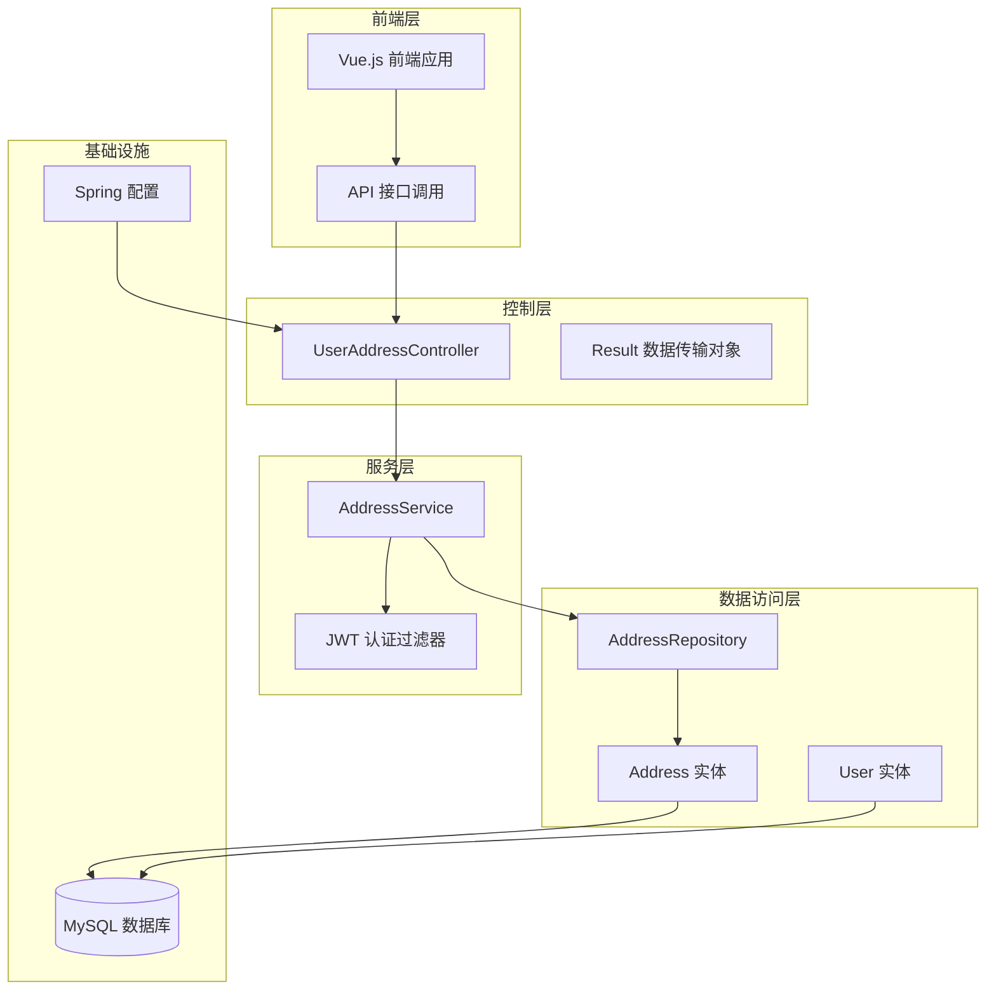
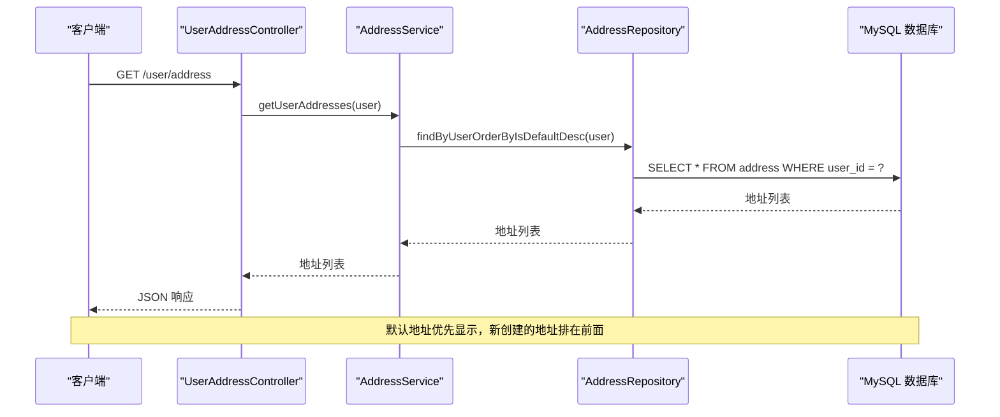
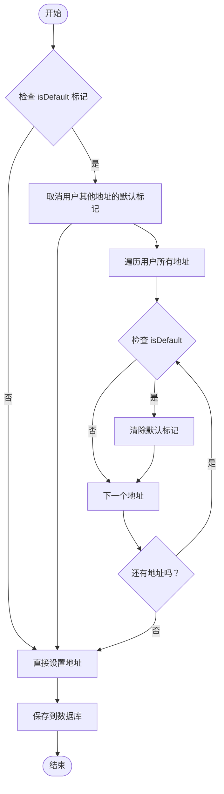
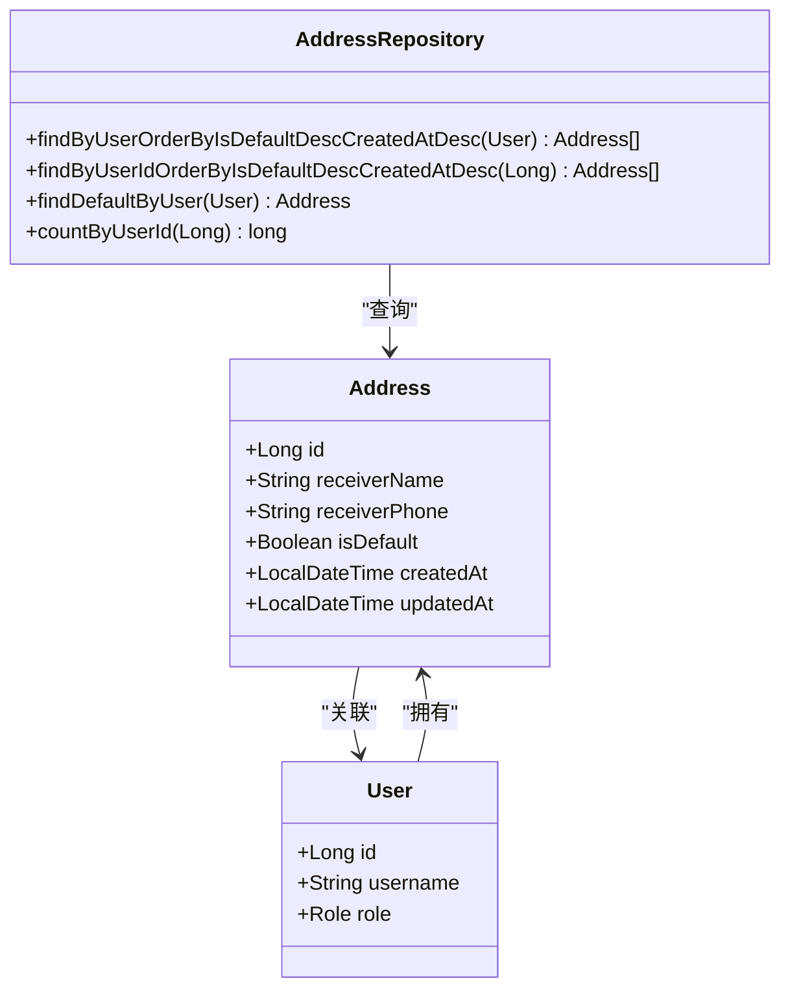
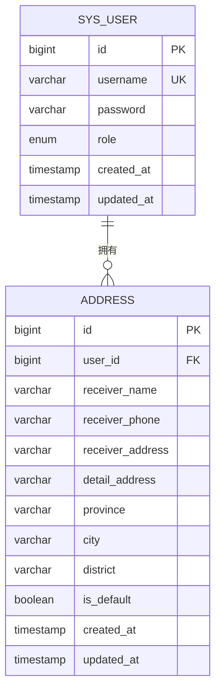
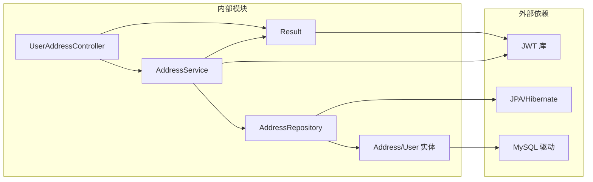
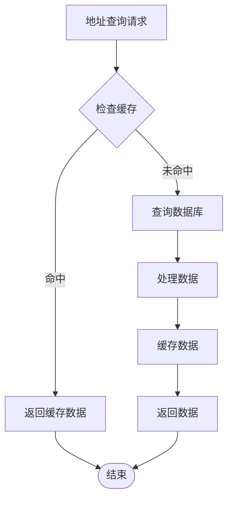

# 地址数据访问层

<cite>
**本文档引用的文件**
- [Address.java](file://backend/src/main/java/com/mall/entity/Address.java)
- [AddressRepository.java](file://backend/src/main/java/com/mall/repository/AddressRepository.java)
- [AddressService.java](file://backend/src/main/java/com/mall/service/AddressService.java)
- [UserAddressController.java](file://backend/src/main/java/com/mall/controller/user/UserAddressController.java)
- [User.java](file://backend/src/main/java/com/mall/entity/User.java)
- [Result.java](file://backend/src/main/java/com/mall/dto/Result.java)
- [application.yml](file://backend/src/main/resources/application.yml)
- [JwtAuthFilter.java](file://backend/src/main/java/com/mall/security/JwtAuthFilter.java)
- [Role.java](file://backend/src/main/java/com/mall/common/Role.java)
- [user.js](file://frontend/src/api/user.js)
- [AddressBook.vue](file://frontend/src/views/user/AddressBook.vue)
</cite>

## 目录
1. [简介](#简介)
2. [项目结构](#项目结构)
3. [核心组件](#核心组件)
4. [架构概览](#架构概览)
5. [详细组件分析](#详细组件分析)
6. [依赖关系分析](#依赖关系分析)
7. [性能考虑](#性能考虑)
8. [故障排除指南](#故障排除指南)
9. [结论](#结论)

## 简介

本文档深入分析了电商系统中的地址数据访问层设计与实现。该系统采用Spring Boot + Spring Data JPA + MySQL的技术栈，实现了完整的用户地址管理功能，包括地址的增删改查、默认地址管理、地址列表查询、地址与用户的关联查询、地址状态管理等核心功能。

系统通过分层架构设计，将业务逻辑清晰分离：控制器层负责HTTP请求处理，服务层封装业务规则，数据访问层负责数据库操作，实体层定义数据模型。这种设计确保了代码的可维护性、可扩展性和安全性。

## 项目结构

地址数据访问层遵循标准的MVC分层架构模式，主要包含以下层次：

**图表来源**
- [UserAddressController.java:1-73](file://backend/src/main/java/com/mall/controller/user/UserAddressController.java#L1-L73)
- [AddressService.java:1-91](file://backend/src/main/java/com/mall/service/AddressService.java#L1-L91)
- [AddressRepository.java:1-22](file://backend/src/main/java/com/mall/repository/AddressRepository.java#L1-L22)

**章节来源**
- [UserAddressController.java:1-73](file://backend/src/main/java/com/mall/controller/user/UserAddressController.java#L1-L73)
- [application.yml:1-36](file://backend/src/main/resources/application.yml#L1-L36)

## 核心组件

### 数据模型设计

系统采用简洁而完整的数据模型设计，主要包含两个核心实体：

#### Address 实体
Address实体定义了用户收货地址的所有必要字段，采用JPA注解进行映射配置：

- **基础字段**：收货人姓名、电话号码、详细地址、省市区信息
- **状态字段**：默认地址标记(isDefault)
- **时间戳**：创建时间和更新时间自动管理
- **关联关系**：与User实体建立多对一关系

#### User 实体
User实体包含了用户的基本信息和地址关联：

- **用户基本信息**：用户名、密码、昵称、邮箱、电话等
- **角色权限**：支持ADMIN、MERCHANT、USER三种角色
- **地址关联**：与Address实体建立一对多关系

**章节来源**
- [Address.java:1-60](file://backend/src/main/java/com/mall/entity/Address.java#L1-L60)
- [User.java:1-88](file://backend/src/main/java/com/mall/entity/User.java#L1-L88)

### 数据访问接口

AddressRepository接口继承自Spring Data JPA的JpaRepository，提供了丰富的查询方法：

#### 核心查询方法
- `findByUserOrderByIsDefaultDescCreatedAtDesc(User user)`：按用户查询地址，优先返回默认地址
- `findByUserIdOrderByIsDefaultDescCreatedAtDesc(Long userId)`：按用户ID查询地址
- `findDefaultByUser(User user)`：查询用户的默认地址
- `countByUserId(Long userId)`：统计用户地址数量

这些查询方法利用了Spring Data JPA的命名约定，实现了直观的数据库查询逻辑。

**章节来源**
- [AddressRepository.java:1-22](file://backend/src/main/java/com/mall/repository/AddressRepository.java#L1-L22)

## 架构概览

地址数据访问层采用经典的三层架构模式，各层职责明确：

**图表来源**
- [UserAddressController.java:19-23](file://backend/src/main/java/com/mall/controller/user/UserAddressController.java#L19-L23)
- [AddressService.java:17-19](file://backend/src/main/java/com/mall/service/AddressService.java#L17-L19)
- [AddressRepository.java:15](file://backend/src/main/java/com/mall/repository/AddressRepository.java#L15)

**章节来源**
- [UserAddressController.java:1-73](file://backend/src/main/java/com/mall/controller/user/UserAddressController.java#L1-L73)
- [AddressService.java:1-91](file://backend/src/main/java/com/mall/service/AddressService.java#L1-L91)

## 详细组件分析

### 控制器层分析

UserAddressController作为RESTful API的入口点，提供了完整的地址管理接口：

#### 主要接口功能

| 接口 | 方法 | 描述 |
|------|------|------|
| `/user/address` | GET | 获取用户所有地址，按默认地址优先排序 |
| `/user/address/{id}` | GET | 获取指定地址详情 |
| `/user/address` | POST | 创建新地址 |
| `/user/address/{id}` | PUT | 更新现有地址 |
| `/user/address/{id}` | DELETE | 删除地址 |
| `/user/address/{id}/default` | PUT | 设置默认地址 |
| `/user/address/default` | GET | 获取默认地址 |

每个接口都经过JWT认证过滤器的验证，确保只有合法用户才能访问其地址数据。

**章节来源**
- [UserAddressController.java:1-73](file://backend/src/main/java/com/mall/controller/user/UserAddressController.java#L1-L73)

### 服务层分析

AddressService封装了所有业务逻辑，是连接控制器和数据访问层的桥梁：

#### 核心业务流程

**图表来源**
- [AddressService.java:27-34](file://backend/src/main/java/com/mall/service/AddressService.java#L27-L34)
- [AddressService.java:78-85](file://backend/src/main/java/com/mall/service/AddressService.java#L78-L85)

#### 关键业务方法

1. **地址创建**：自动处理默认地址冲突，确保同一用户只有一个默认地址
2. **地址更新**：支持部分字段更新，智能处理默认地址变更
3. **默认地址管理**：提供原子性的默认地址切换操作
4. **地址查询**：支持按ID精确查询和列表查询

**章节来源**
- [AddressService.java:1-91](file://backend/src/main/java/com/mall/service/AddressService.java#L1-L91)

### 数据访问层分析

AddressRepository实现了Spring Data JPA的Repository接口，提供了类型安全的数据访问能力：

#### 查询策略设计

**图表来源**
- [AddressRepository.java:12-21](file://backend/src/main/java/com/mall/repository/AddressRepository.java#L12-L21)
- [Address.java:15-17](file://backend/src/main/java/com/mall/entity/Address.java#L15-L17)

#### 性能优化策略

1. **懒加载配置**：使用FetchType.LAZY避免不必要的关联数据加载
2. **索引优化**：在user_id和is_default字段上建立合适的索引
3. **查询优化**：通过自定义查询减少数据库往返次数

**章节来源**
- [AddressRepository.java:1-22](file://backend/src/main/java/com/mall/repository/AddressRepository.java#L1-L22)

### 实体关系分析

系统采用标准的数据库规范化设计，通过外键约束保证数据完整性：

**图表来源**
- [User.java:73-75](file://backend/src/main/java/com/mall/entity/User.java#L73-L75)
- [Address.java:15-17](file://backend/src/main/java/com/mall/entity/Address.java#L15-L17)

**章节来源**
- [User.java:1-88](file://backend/src/main/java/com/mall/entity/User.java#L1-L88)
- [Address.java:1-60](file://backend/src/main/java/com/mall/entity/Address.java#L1-L60)

## 依赖关系分析

系统采用松耦合的设计原则，各组件之间的依赖关系清晰明确：

**图表来源**
- [JwtAuthFilter.java:24-28](file://backend/src/main/java/com/mall/security/JwtAuthFilter.java#L24-L28)
- [application.yml:5-8](file://backend/src/main/resources/application.yml#L5-L8)

### 关键依赖特性

1. **JWT认证集成**：通过JwtAuthFilter实现统一的认证机制
2. **JPA持久化**：利用Spring Data JPA简化数据库操作
3. **类型安全**：编译时检查确保数据类型正确性
4. **事务管理**：基于注解的声明式事务管理

**章节来源**
- [JwtAuthFilter.java:1-57](file://backend/src/main/java/com/mall/security/JwtAuthFilter.java#L1-L57)
- [application.yml:1-36](file://backend/src/main/resources/application.yml#L1-L36)

## 性能考虑

### 查询性能优化

1. **索引策略**：
   - 在`user_id`字段上建立索引以加速用户地址查询
   - 在`is_default`字段上建立索引以优化默认地址查找
   - 在`created_at`字段上建立索引以支持时间排序查询

2. **查询优化**：
   - 使用投影查询只选择必要的字段
   - 避免N+1查询问题，合理使用JOIN查询
   - 对频繁查询的结果进行缓存

3. **分页策略**：
   - 对于大量地址的用户，实现分页查询
   - 提供适当的默认分页大小限制

### 缓存策略

### 并发控制

1. **乐观锁**：在地址更新时使用版本号防止并发修改冲突
2. **事务隔离**：合理设置事务隔离级别避免脏读和幻读
3. **默认地址原子性**：通过数据库事务保证默认地址切换的原子性

## 故障排除指南

### 常见问题及解决方案

#### 1. 地址权限验证失败
**症状**：用户尝试访问其他用户的地址
**原因**：安全过滤器未正确验证用户身份
**解决方案**：检查JWT令牌解析和用户ID匹配逻辑

#### 2. 默认地址冲突
**症状**：多个地址同时标记为默认
**原因**：并发更新导致的竞争条件
**解决方案**：使用数据库事务确保默认地址切换的原子性

#### 3. 查询性能问题
**症状**：地址列表加载缓慢
**原因**：缺少必要的数据库索引
**解决方案**：为常用查询字段添加索引

#### 4. 内存泄漏
**症状**：长时间运行后内存占用持续增长
**原因**：实体关联未正确关闭
**解决方案**：检查懒加载配置和实体生命周期管理

**章节来源**
- [AddressService.java:27-34](file://backend/src/main/java/com/mall/service/AddressService.java#L27-L34)
- [AddressService.java:67-76](file://backend/src/main/java/com/mall/service/AddressService.java#L67-L76)

### 调试技巧

1. **日志配置**：启用JPA SQL日志查看实际执行的查询语句
2. **数据库监控**：使用慢查询日志识别性能瓶颈
3. **单元测试**：编写针对边界条件的测试用例
4. **性能分析**：使用APM工具监控关键路径的性能指标

## 结论

地址数据访问层设计体现了现代Java企业级应用的最佳实践。通过清晰的分层架构、完善的实体关系设计、高效的查询策略和严格的安全控制，系统实现了可靠、高性能的地址管理功能。

### 设计优势

1. **架构清晰**：分层设计使代码职责明确，易于维护和扩展
2. **性能优秀**：合理的查询策略和索引设计确保了良好的响应性能
3. **安全可靠**：完整的认证授权机制和数据验证确保了系统安全
4. **用户体验**：直观的API设计和友好的错误处理提升了用户体验

### 改进建议

1. **地理围栏**：可以集成地理信息系统(GIS)实现配送范围判断
2. **地址验证**：增加地址格式验证和重复地址检测
3. **审计日志**：记录重要的地址变更操作便于追踪
4. **国际化**：支持多语言地址格式和翻译

该地址数据访问层为电商系统的地址管理提供了坚实的基础，能够满足大多数业务场景的需求，并为未来的功能扩展预留了充足的空间。