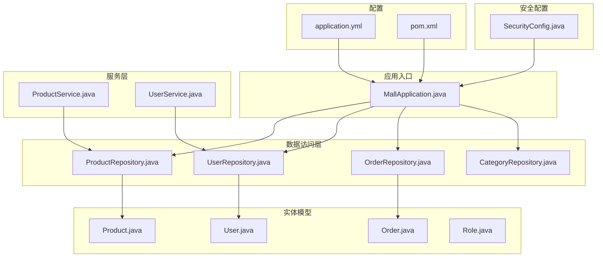
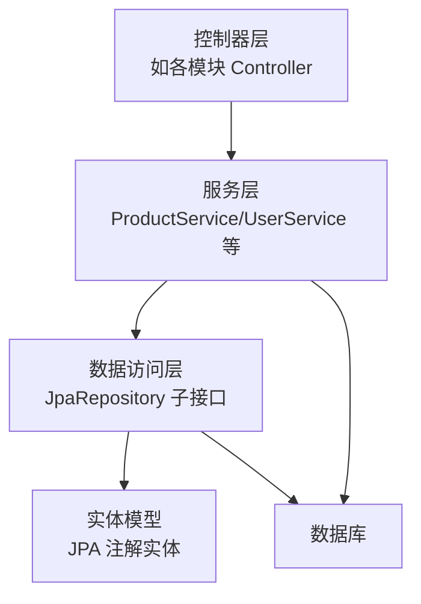
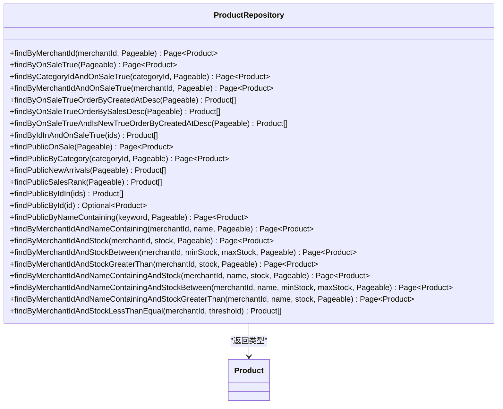
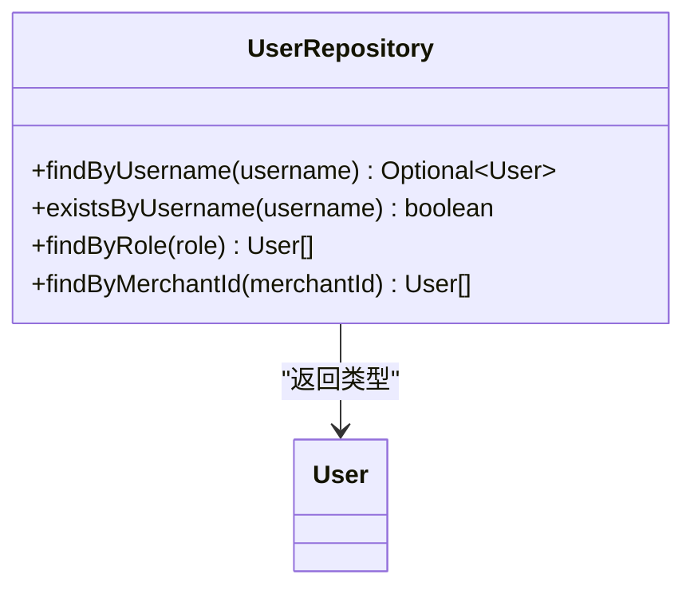
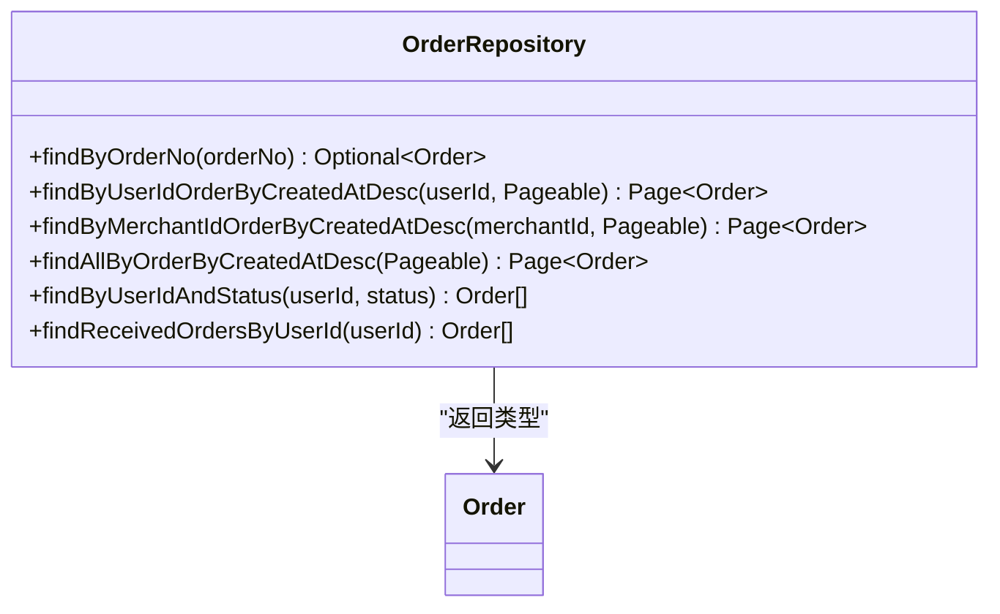
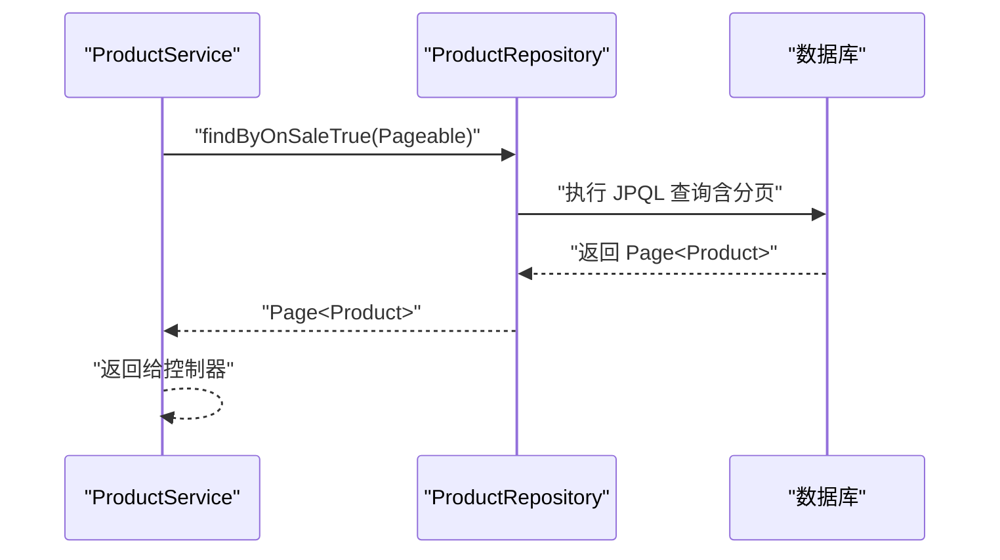
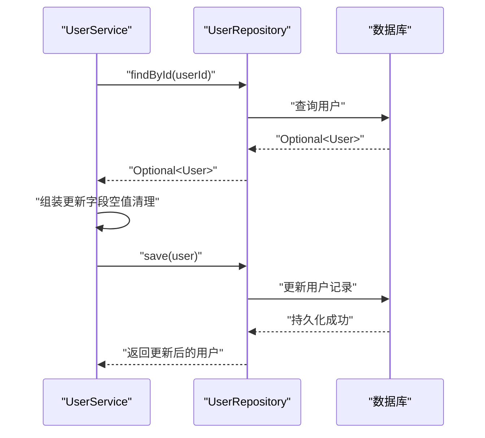
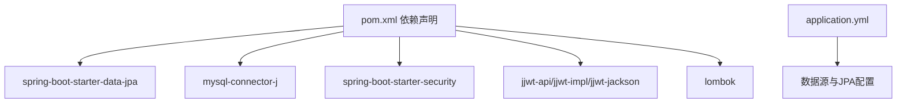

# 数据访问层

<cite>
**本文引用的文件**
- [MallApplication.java](file://backend/src/main/java/com/mall/MallApplication.java)
- [pom.xml](file://backend/pom.xml)
- [application.yml](file://backend/src/main/resources/application.yml)
- [ProductRepository.java](file://backend/src/main/java/com/mall/repository/ProductRepository.java)
- [UserRepository.java](file://backend/src/main/java/com/mall/repository/UserRepository.java)
- [OrderRepository.java](file://backend/src/main/java/com/mall/repository/OrderRepository.java)
- [CategoryRepository.java](file://backend/src/main/java/com/mall/repository/CategoryRepository.java)
- [Product.java](file://backend/src/main/java/com/mall/entity/Product.java)
- [User.java](file://backend/src/main/java/com/mall/entity/User.java)
- [Order.java](file://backend/src/main/java/com/mall/entity/Order.java)
- [Role.java](file://backend/src/main/java/com/mall/common/Role.java)
- [ProductService.java](file://backend/src/main/java/com/mall/service/ProductService.java)
- [UserService.java](file://backend/src/main/java/com/mall/service/UserService.java)
- [SecurityConfig.java](file://backend/src/main/java/com/mall/config/SecurityConfig.java)
</cite>

## 目录
1. [引言](#引言)
2. [项目结构](#项目结构)
3. [核心组件](#核心组件)
4. [架构总览](#架构总览)
5. [详细组件分析](#详细组件分析)
6. [依赖分析](#依赖分析)
7. [性能考虑](#性能考虑)
8. [故障排查指南](#故障排查指南)
9. [结论](#结论)
10. [附录](#附录)

## 引言
本文件聚焦于电商商城系统的数据访问层（Repository 层），系统性阐述基于 Spring Data JPA 的设计模式与实现原理，覆盖以下主题：
- Repository 接口设计与继承关系
- 自定义查询方法命名约定与参数绑定
- JPQL 查询与原生 SQL 的编写规范
- 分页与排序的实现方式
- 事务管理配置与最佳实践
- 批量操作与查询性能优化策略
- 常用查询方法的使用路径与示例参考

通过结合实体模型、Repository 接口与服务层调用，帮助开发者快速掌握高效、可维护的数据访问模式。

## 项目结构
后端采用 Spring Boot 标准目录组织，数据访问层位于 repository 包，实体模型位于 entity 包，服务层位于 service 包，配置位于 config 包，入口类位于根包。

图表来源
- [MallApplication.java:1-13](file://backend/src/main/java/com/mall/MallApplication.java#L1-L13)
- [application.yml:1-36](file://backend/src/main/resources/application.yml#L1-L36)
- [pom.xml:1-107](file://backend/pom.xml#L1-L107)
- [ProductRepository.java:1-125](file://backend/src/main/java/com/mall/repository/ProductRepository.java#L1-L125)
- [UserRepository.java:1-20](file://backend/src/main/java/com/mall/repository/UserRepository.java#L1-L20)
- [OrderRepository.java:1-28](file://backend/src/main/java/com/mall/repository/OrderRepository.java#L1-L28)
- [CategoryRepository.java:1-17](file://backend/src/main/java/com/mall/repository/CategoryRepository.java#L1-L17)
- [Product.java:1-101](file://backend/src/main/java/com/mall/entity/Product.java#L1-L101)
- [User.java:1-88](file://backend/src/main/java/com/mall/entity/User.java#L1-L88)
- [Order.java:1-83](file://backend/src/main/java/com/mall/entity/Order.java#L1-L83)
- [Role.java:1-8](file://backend/src/main/java/com/mall/common/Role.java#L1-L8)
- [ProductService.java:1-126](file://backend/src/main/java/com/mall/service/ProductService.java#L1-L126)
- [UserService.java:1-42](file://backend/src/main/java/com/mall/service/UserService.java#L1-L42)
- [SecurityConfig.java:1-74](file://backend/src/main/java/com/mall/config/SecurityConfig.java#L1-L74)

章节来源
- [MallApplication.java:1-13](file://backend/src/main/java/com/mall/MallApplication.java#L1-L13)
- [application.yml:1-36](file://backend/src/main/resources/application.yml#L1-L36)
- [pom.xml:1-107](file://backend/pom.xml#L1-L107)

## 核心组件
- 实体模型：Product、User、Order 及枚举 Role，均标注 JPA 注解并定义了常用字段与生命周期回调。
- Repository 接口：以 JpaRepository 为基础扩展，提供基于命名规则的查询方法与 JPQL/原生 SQL 查询。
- 服务层：ProductService、UserService 封装业务逻辑，负责分页构建、条件拼装与事务控制。
- 配置：JPA/Hibernate 参数、数据库连接、CORS、JWT 安全过滤器等。

章节来源
- [Product.java:1-101](file://backend/src/main/java/com/mall/entity/Product.java#L1-L101)
- [User.java:1-88](file://backend/src/main/java/com/mall/entity/User.java#L1-L88)
- [Order.java:1-83](file://backend/src/main/java/com/mall/entity/Order.java#L1-L83)
- [Role.java:1-8](file://backend/src/main/java/com/mall/common/Role.java#L1-L8)
- [ProductRepository.java:1-125](file://backend/src/main/java/com/mall/repository/ProductRepository.java#L1-L125)
- [UserRepository.java:1-20](file://backend/src/main/java/com/mall/repository/UserRepository.java#L1-L20)
- [OrderRepository.java:1-28](file://backend/src/main/java/com/mall/repository/OrderRepository.java#L1-L28)
- [CategoryRepository.java:1-17](file://backend/src/main/java/com/mall/repository/CategoryRepository.java#L1-L17)
- [ProductService.java:1-126](file://backend/src/main/java/com/mall/service/ProductService.java#L1-L126)
- [UserService.java:1-42](file://backend/src/main/java/com/mall/service/UserService.java#L1-L42)

## 架构总览
数据访问层遵循“Repository + Service + Controller”三层结构，Repository 负责数据存取，Service 负责业务编排与事务边界，Controller 提供 REST 接口。

图表来源
- [ProductService.java:1-126](file://backend/src/main/java/com/mall/service/ProductService.java#L1-L126)
- [UserService.java:1-42](file://backend/src/main/java/com/mall/service/UserService.java#L1-L42)
- [ProductRepository.java:1-125](file://backend/src/main/java/com/mall/repository/ProductRepository.java#L1-L125)
- [UserRepository.java:1-20](file://backend/src/main/java/com/mall/repository/UserRepository.java#L1-L20)
- [OrderRepository.java:1-28](file://backend/src/main/java/com/mall/repository/OrderRepository.java#L1-L28)
- [Product.java:1-101](file://backend/src/main/java/com/mall/entity/Product.java#L1-L101)
- [User.java:1-88](file://backend/src/main/java/com/mall/entity/User.java#L1-L88)
- [Order.java:1-83](file://backend/src/main/java/com/mall/entity/Order.java#L1-L83)

## 详细组件分析

### ProductRepository：查询方法设计与命名约定
- 继承关系：基于 JpaRepository<Product, Long>，天然具备 CRUD 与分页能力。
- 命名规则查询：
  - 基于布尔字段 onSale 的分页查询，支持按商户、分类筛选。
  - 支持排序修饰符（如 orderBy...）与组合条件（and/or）。
  - 支持集合参数 in 条件与大小比较（between/greaterThan/lessThan）。
- JPQL 查询：
  - 使用 @Query 定义复杂条件，包含子查询（筛选启用的商户）。
  - 显式 countQuery 用于分页统计，避免重复计算。
  - 关键字搜索支持名称或描述模糊匹配。
- 原生 SQL：
  - 当前仓库未使用原生 SQL，推荐在复杂统计或跨表聚合时采用 @Query(value=..., nativeQuery=true) 并显式 countQuery。

图表来源
- [ProductRepository.java:1-125](file://backend/src/main/java/com/mall/repository/ProductRepository.java#L1-L125)
- [Product.java:1-101](file://backend/src/main/java/com/mall/entity/Product.java#L1-L101)

章节来源
- [ProductRepository.java:1-125](file://backend/src/main/java/com/mall/repository/ProductRepository.java#L1-L125)
- [Product.java:1-101](file://backend/src/main/java/com/mall/entity/Product.java#L1-L101)

### UserRepository：基础查询与角色过滤
- 继承关系：基于 JpaRepository<User, Long>。
- 常用查询：
  - 按用户名查找与存在性判断。
  - 按角色与商户 ID 过滤用户列表。
- 适用场景：登录校验、权限分配、商户关联用户管理。

图表来源
- [UserRepository.java:1-20](file://backend/src/main/java/com/mall/repository/UserRepository.java#L1-L20)
- [User.java:1-88](file://backend/src/main/java/com/mall/entity/User.java#L1-L88)
- [Role.java:1-8](file://backend/src/main/java/com/mall/common/Role.java#L1-L8)

章节来源
- [UserRepository.java:1-20](file://backend/src/main/java/com/mall/repository/UserRepository.java#L1-L20)
- [User.java:1-88](file://backend/src/main/java/com/mall/entity/User.java#L1-L88)
- [Role.java:1-8](file://backend/src/main/java/com/mall/common/Role.java#L1-L8)

### OrderRepository：订单查询与状态筛选
- 继承关系：基于 JpaRepository<Order, Long>。
- 常用查询：
  - 按订单号唯一查询。
  - 按用户/商户维度分页查询，并按创建时间倒序。
  - 全局订单列表按创建时间倒序。
  - 按用户与状态筛选订单集合。
  - 使用 JPQL 精确筛选特定状态的订单。

图表来源
- [OrderRepository.java:1-28](file://backend/src/main/java/com/mall/repository/OrderRepository.java#L1-L28)
- [Order.java:1-83](file://backend/src/main/java/com/mall/entity/Order.java#L1-L83)

章节来源
- [OrderRepository.java:1-28](file://backend/src/main/java/com/mall/repository/OrderRepository.java#L1-L28)
- [Order.java:1-83](file://backend/src/main/java/com/mall/entity/Order.java#L1-L83)

### CategoryRepository：树形分类查询
- 继承关系：基于 JpaRepository<Category, Long>。
- 常用查询：
  - 按父节点排序列出子分类。
  - 查询顶级分类（父节点为空）。
  - 按名称与父节点为空查找唯一分类。

章节来源
- [CategoryRepository.java:1-17](file://backend/src/main/java/com/mall/repository/CategoryRepository.java#L1-L17)

### ProductService：分页与查询编排
- 分页构建：使用 PageRequest.of(0, size) 构建固定大小的分页对象，便于排行榜、新品等场景。
- 条件拼装：库存管理根据关键词与库存状态动态选择查询方法，提升灵活性。
- 调用路径：服务层方法统一委托到对应 Repository 接口，保持职责清晰。

图表来源
- [ProductService.java:1-126](file://backend/src/main/java/com/mall/service/ProductService.java#L1-L126)
- [ProductRepository.java:1-125](file://backend/src/main/java/com/mall/repository/ProductRepository.java#L1-L125)

章节来源
- [ProductService.java:1-126](file://backend/src/main/java/com/mall/service/ProductService.java#L1-L126)

### UserService：事务管理与更新流程
- 事务注解：@Transactional 在更新用户资料时确保一致性。
- 参数处理：对传入字段进行空值与空白字符清理，避免脏数据写入。
- 调用路径：先加载再保存，利用 Repository 的 save 方法持久化。

图表来源
- [UserService.java:1-42](file://backend/src/main/java/com/mall/service/UserService.java#L1-L42)
- [UserRepository.java:1-20](file://backend/src/main/java/com/mall/repository/UserRepository.java#L1-L20)
- [User.java:1-88](file://backend/src/main/java/com/mall/entity/User.java#L1-L88)

章节来源
- [UserService.java:1-42](file://backend/src/main/java/com/mall/service/UserService.java#L1-L42)

## 依赖分析
- Spring Data JPA：提供 Repository 抽象与分页排序能力。
- MySQL Connector/J：数据库驱动。
- JWT 与 Spring Security：安全框架集成，与数据访问层无直接耦合，但影响请求上下文与权限控制。
- Lombok：简化实体与 DTO 的样板代码。

图表来源
- [pom.xml:1-107](file://backend/pom.xml#L1-L107)
- [application.yml:1-36](file://backend/src/main/resources/application.yml#L1-L36)

章节来源
- [pom.xml:1-107](file://backend/pom.xml#L1-L107)
- [application.yml:1-36](file://backend/src/main/resources/application.yml#L1-L36)

## 性能考虑
- 分页与排序
  - 使用 Pageable 与 Sort 控制结果集大小与排序方向，避免一次性加载全量数据。
  - 对高频查询字段建立索引（如 onSale、merchantId、categoryId、createdAt、status 等）。
- JPQL 与 countQuery
  - 复杂分页查询建议显式提供 countQuery，减少重复统计开销。
- 延迟加载与 N+1
  - 实体间关联使用懒加载（FetchType.LAZY），避免不必要的 JOIN。
- 查询优化
  - 使用 in、between、like 等操作时注意参数绑定与索引命中。
  - 避免 select *，仅查询必要字段；必要时使用投影或 DTO。
- 事务与批量
  - 批量更新/删除建议在事务中执行，合理分批提交，避免长时间锁表。
- 日志与诊断
  - 生产环境建议关闭 show-sql，开启格式化输出以便排查慢查询。

## 故障排查指南
- 分页结果异常
  - 检查 Pageable 构造是否正确，确认排序字段是否存在且有索引。
- 查询性能差
  - 使用 EXPLAIN 分析 SQL，确认索引使用情况；必要时添加复合索引。
- JPQL 语法错误
  - 核对实体与属性名大小写一致；参数绑定使用命名参数（如 :keyword）。
- 事务不生效
  - 确认方法可见性与调用链路（同 class 内部调用不会触发 AOP 代理）。
- 安全过滤器影响
  - 若出现跨域或鉴权问题，检查 CORS 配置与 JWT 过滤器顺序。

章节来源
- [SecurityConfig.java:1-74](file://backend/src/main/java/com/mall/config/SecurityConfig.java#L1-L74)

## 结论
本数据访问层以 Spring Data JPA 为核心，通过 Repository 接口与 JPQL/原生 SQL 的组合，实现了灵活高效的查询能力。配合服务层的分页与条件编排、以及明确的事务边界，能够支撑电商系统中的商品、用户、订单等核心业务的数据访问需求。建议在生产环境中进一步完善索引策略、慢查询监控与批量操作的事务控制，持续优化查询性能与稳定性。

## 附录

### 查询方法命名约定与参数绑定要点
- 命名规则
  - 基于属性名与布尔条件：如 findByOnSaleTrue。
  - 组合条件：如 findByCategoryIdAndOnSaleTrue。
  - 排序修饰：如 OrderByCreatedAtDesc。
  - 集合 in：如 findByIdIn。
  - 比较运算：如 Between/GreaterThan/LessThan。
- 参数绑定
  - JPQL 使用命名参数（如 :categoryId、:keyword）。
  - 分页参数 Pageable 必须作为最后一个参数。
  - 注意布尔/枚举字段的大小写与默认值。

章节来源
- [ProductRepository.java:1-125](file://backend/src/main/java/com/mall/repository/ProductRepository.java#L1-L125)
- [OrderRepository.java:1-28](file://backend/src/main/java/com/mall/repository/OrderRepository.java#L1-L28)
- [UserRepository.java:1-20](file://backend/src/main/java/com/mall/repository/UserRepository.java#L1-L20)

### 常用查询方法使用路径参考
- 商品查询
  - 列表与分页：[ProductService.java:33-45](file://backend/src/main/java/com/mall/service/ProductService.java#L33-L45)
  - 用户侧公开查询：[ProductService.java:43-50](file://backend/src/main/java/com/mall/service/ProductService.java#L43-L50)
  - 搜索与关键字：[ProductService.java:80-82](file://backend/src/main/java/com/mall/service/ProductService.java#L80-L82)
  - 库存管理：[ProductService.java:95-119](file://backend/src/main/java/com/mall/service/ProductService.java#L95-L119)
- 用户查询
  - 登录/权限：[UserRepository.java:12-16](file://backend/src/main/java/com/mall/repository/UserRepository.java#L12-L16)
  - 角色过滤：[UserRepository.java:16-18](file://backend/src/main/java/com/mall/repository/UserRepository.java#L16-L18)
- 订单查询
  - 用户/商户维度分页：[OrderRepository.java:17-19](file://backend/src/main/java/com/mall/repository/OrderRepository.java#L17-L19)
  - 状态筛选：[OrderRepository.java:23-26](file://backend/src/main/java/com/mall/repository/OrderRepository.java#L23-L26)