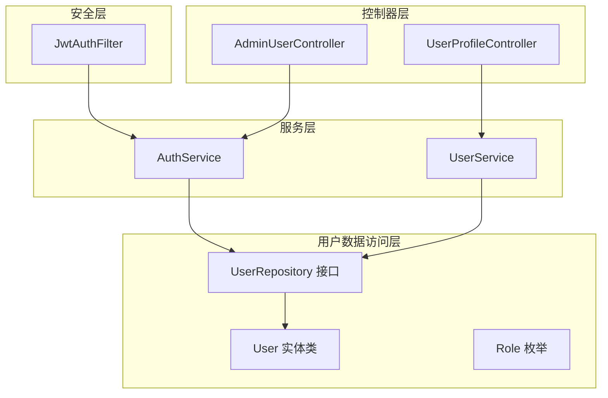
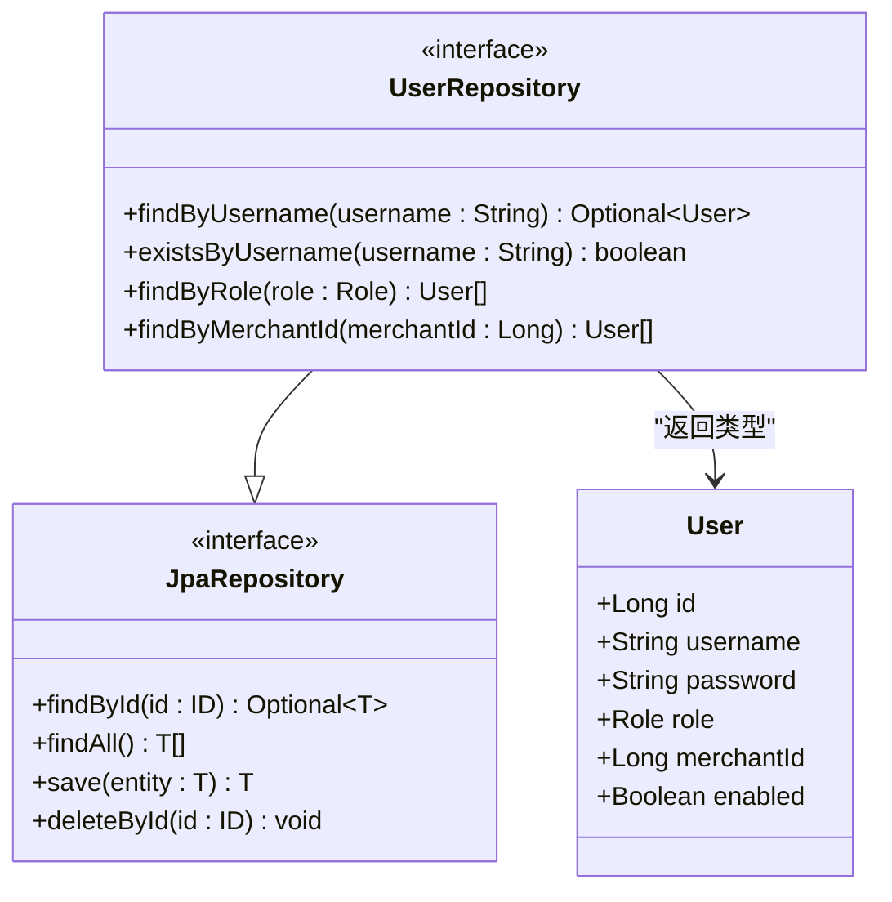
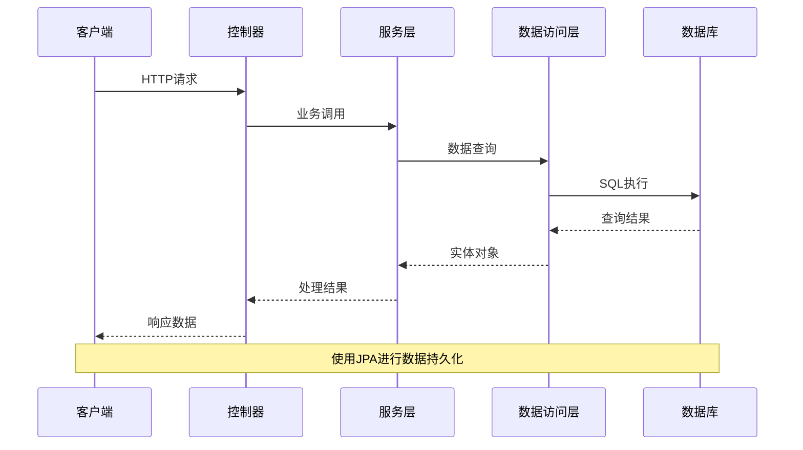
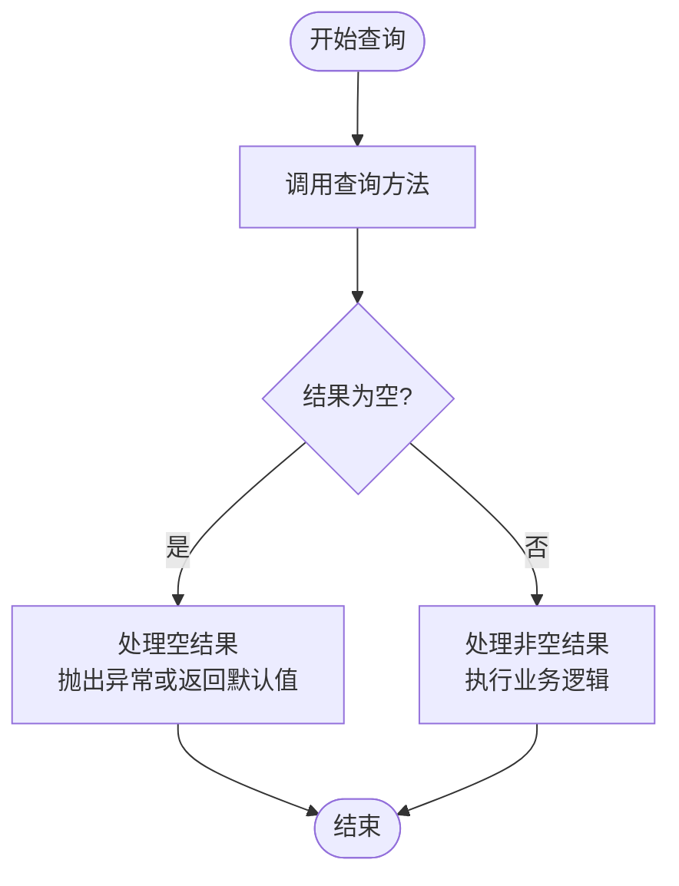
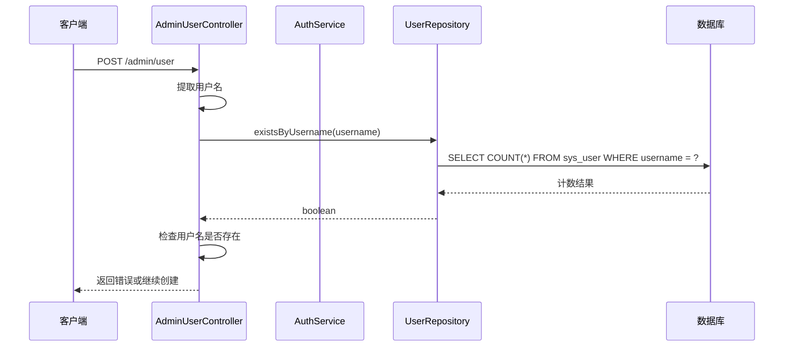
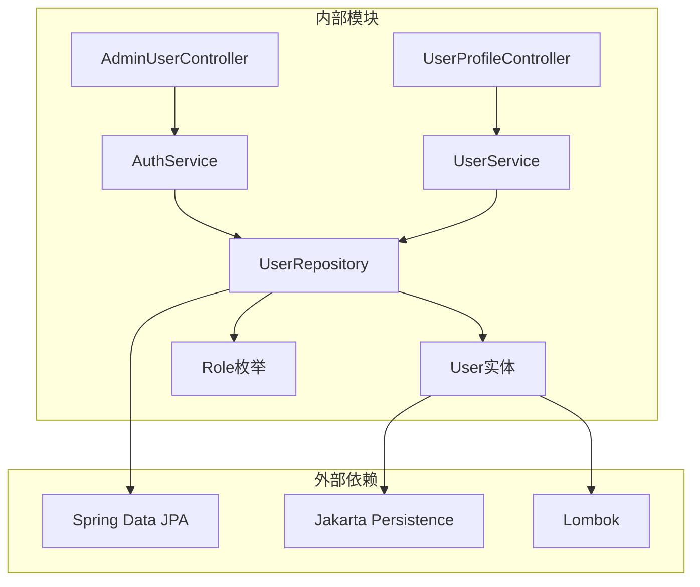

# 用户数据访问层

<cite>
**本文档引用的文件**
- [UserRepository.java](file://backend/src/main/java/com/mall/repository/UserRepository.java)
- [User.java](file://backend/src/main/java/com/mall/entity/User.java)
- [Role.java](file://backend/src/main/java/com/mall/common/Role.java)
- [AuthService.java](file://backend/src/main/java/com/mall/service/AuthService.java)
- [AdminUserController.java](file://backend/src/main/java/com/mall/controller/admin/AdminUserController.java)
- [UserProfileController.java](file://backend/src/main/java/com/mall/controller/user/UserProfileController.java)
- [UserService.java](file://backend/src/main/java/com/mall/service/UserService.java)
- [JwtAuthFilter.java](file://backend/src/main/java/com/mall/security/JwtAuthFilter.java)
</cite>

## 目录
1. [简介](#简介)
2. [项目结构](#项目结构)
3. [核心组件](#核心组件)
4. [架构概览](#架构概览)
5. [详细组件分析](#详细组件分析)
6. [依赖关系分析](#依赖关系分析)
7. [性能考虑](#性能考虑)
8. [故障排除指南](#故障排除指南)
9. [结论](#结论)

## 简介

本文档深入分析了电商系统中的用户数据访问层设计与实现。该层基于Spring Data JPA构建，提供了完整的用户数据管理功能，包括基本的CRUD操作、自定义查询方法以及复杂的数据检索场景。系统采用分层架构设计，确保了良好的可维护性和扩展性。

## 项目结构

用户数据访问层位于后端应用的`com.mall.repository`包中，与实体模型、服务层和控制器层形成清晰的分层结构：



**图表来源**
- [UserRepository.java:1-20](file://backend/src/main/java/com/mall/repository/UserRepository.java#L1-L20)
- [User.java:1-88](file://backend/src/main/java/com/mall/entity/User.java#L1-L88)
- [AuthService.java:1-92](file://backend/src/main/java/com/mall/service/AuthService.java#L1-L92)

**章节来源**
- [UserRepository.java:1-20](file://backend/src/main/java/com/mall/repository/UserRepository.java#L1-L20)
- [User.java:1-88](file://backend/src/main/java/com/mall/entity/User.java#L1-L88)

## 核心组件

### UserRepository 接口设计

UserRepository接口继承自JpaRepository，提供了丰富的数据访问能力：



**图表来源**
- [UserRepository.java:10-19](file://backend/src/main/java/com/mall/repository/UserRepository.java#L10-L19)
- [User.java:17-87](file://backend/src/main/java/com/mall/entity/User.java#L17-L87)

### User 实体模型

User实体类映射到数据库表`sys_user`，包含了完整的用户信息字段：

| 字段名 | 类型 | 约束 | 描述 |
|--------|------|------|------|
| id | Long | 主键, 自增 | 用户唯一标识 |
| username | String | 唯一, 非空, 长度64 | 用户名 |
| password | String | 非空, 长度128 | 密码(加密存储) |
| nickname | String | 长度32 | 昵称 |
| email | String | 长度64 | 邮箱地址 |
| phone | String | 长度20 | 联系电话 |
| avatar | String | 长度255 | 头像URL |
| gender | String | 长度10 | 性别(MALE/FEMALE/OTHER) |
| role | Role | 非空, ENUM | 用户角色(ADMIN/MERCHANT/USER) |
| merchantId | Long | 外键 | 商户关联ID |
| enabled | Boolean | 非空 | 账号启用状态 |
| createdAt | LocalDateTime | 非空, 不可更新 | 创建时间 |
| updatedAt | LocalDateTime | 更新时间 | 最后更新时间 |

**章节来源**
- [User.java:17-87](file://backend/src/main/java/com/mall/entity/User.java#L17-L87)
- [Role.java:3-7](file://backend/src/main/java/com/mall/common/Role.java#L3-L7)

## 架构概览

用户数据访问层采用经典的三层架构模式，实现了清晰的关注点分离：



**图表来源**
- [AuthService.java:28-59](file://backend/src/main/java/com/mall/service/AuthService.java#L28-L59)
- [AdminUserController.java:26-36](file://backend/src/main/java/com/mall/controller/admin/AdminUserController.java#L26-L36)

## 详细组件分析

### Spring Data JPA 查询方法命名规范

UserRepository遵循Spring Data JPA的查询方法命名约定，提供了直观且类型安全的查询接口：

#### 基本查询方法

| 方法签名 | 查询条件 | 返回类型 | 使用场景 |
|----------|----------|----------|----------|
| findByUsername(String username) | username = ? | Optional<User> | 用户名精确查询 |
| existsByUsername(String username) | username = ? | boolean | 用户名存在性检查 |
| findByRole(Role role) | role = ? | List<User> | 角色过滤查询 |
| findByMerchantId(Long merchantId) | merchant_id = ? | List<User> | 商户关联查询 |

#### 查询方法命名规则

Spring Data JPA遵循以下命名规范：
1. **基础方法名**：`findBy` + 属性名
2. **属性名大小写**：首字母大写，驼峰命名保持不变
3. **比较运算符**：默认等于，可通过关键字修饰
4. **逻辑组合**：使用`And`、`Or`连接多个条件
5. **特殊关键字**：`Containing`、`Like`、`Between`、`IsNull`等

**章节来源**
- [UserRepository.java:12-18](file://backend/src/main/java/com/mall/repository/UserRepository.java#L12-L18)

### Optional 类型使用策略

系统广泛使用Java 8的Optional类型来处理可能为空的结果集：



**图表来源**
- [AuthService.java:29-32](file://backend/src/main/java/com/mall/service/AuthService.java#L29-L32)
- [UserService.java:18-20](file://backend/src/main/java/com/mall/service/UserService.java#L18-L20)

### 复杂查询实现策略

虽然当前UserRepository未使用@Query注解，但系统提供了多种实现复杂查询的方法：

#### 方法1：基于命名的查询方法
```java
// 支持更复杂的条件组合
List<User> findByRoleAndEnabled(Role role, Boolean enabled);
List<User> findByUsernameContaining(String keyword);
List<User> findByCreatedAtBetween(Date start, Date end);
```

#### 方法2：使用@Query注解
对于需要复杂SQL的场景，可以在接口中添加：
```java
@Query("SELECT u FROM User u WHERE u.role = :role AND u.enabled = true")
List<User> findActiveUsersByRole(@Param("role") Role role);
```

**章节来源**
- [AuthService.java:42-47](file://backend/src/main/java/com/mall/service/AuthService.java#L42-L47)

### 用户相关数据操作最佳实践

#### 用户名唯一性检查



**图表来源**
- [AdminUserController.java:45-47](file://backend/src/main/java/com/mall/controller/admin/AdminUserController.java#L45-L47)
- [AuthService.java:73-75](file://backend/src/main/java/com/mall/service/AuthService.java#L73-L75)

#### 角色过滤查询

系统支持三种角色的用户查询：
- **ADMIN**: 系统管理员
- **MERCHANT**: 商户运营人员  
- **USER**: 普通消费者

查询实现通过枚举类型确保类型安全，避免字符串硬编码带来的错误。

#### 商户关联查询

对于MERCHANT角色的用户，系统支持按商户ID进行关联查询：
- 仅当用户角色为MERCHANT时，merchantId字段才有效
- 支持批量查询特定商户的所有员工
- 用于权限控制和数据隔离

**章节来源**
- [AdminUserController.java:26-36](file://backend/src/main/java/com/mall/controller/admin/AdminUserController.java#L26-L36)
- [User.java:60-62](file://backend/src/main/java/com/mall/entity/User.java#L60-L62)

## 依赖关系分析

用户数据访问层的依赖关系体现了清晰的分层架构：



**图表来源**
- [UserRepository.java:3-5](file://backend/src/main/java/com/mall/repository/UserRepository.java#L3-L5)
- [User.java:3-5](file://backend/src/main/java/com/mall/entity/User.java#L3-L5)

### 组件耦合度分析

- **低耦合**: Repository层与实体层通过JPA注解解耦
- **单向依赖**: 控制器→服务→仓库，符合分层原则
- **接口隔离**: 使用接口定义数据访问契约，便于测试和替换

**章节来源**
- [UserRepository.java:10](file://backend/src/main/java/com/mall/repository/UserRepository.java#L10)
- [AuthService.java:22](file://backend/src/main/java/com/mall/service/AuthService.java#L22)

## 性能考虑

### 查询优化策略

1. **索引优化**
   - 在username字段上建立唯一索引
   - 在role和merchantId字段上建立普通索引
   - 在createdAt和updatedAt字段上建立时间索引

2. **分页查询**
   ```java
   PageRequest pageRequest = PageRequest.of(page, size);
   List<User> users = userRepository.findAll(pageRequest);
   ```

3. **懒加载配置**
   - 关联实体使用LAZY加载策略
   - 避免N+1查询问题

### 缓存策略

建议在高频查询场景中引入缓存：
- 用户名存在性检查结果缓存
- 角色过滤查询结果缓存
- 商户关联查询结果缓存

## 故障排除指南

### 常见问题及解决方案

#### 1. 用户名重复错误
**症状**: 创建用户时报用户名已存在
**原因**: 数据库唯一约束冲突
**解决**: 
- 使用existsByUsername方法预检查
- 在事务中处理并发情况

#### 2. 查询结果为空
**症状**: findByUsername返回空结果
**原因**: 用户不存在或账号被禁用
**解决**:
- 检查用户状态字段
- 验证用户名拼写

#### 3. 权限验证失败
**症状**: 登录时提示角色不匹配
**原因**: 用户实际角色与选择角色不符
**解决**:
- 验证用户角色字段
- 检查商户状态（MERCHANT角色）

**章节来源**
- [AuthService.java:30-40](file://backend/src/main/java/com/mall/service/AuthService.java#L30-L40)
- [AdminUserController.java:45](file://backend/src/main/java/com/mall/controller/admin/AdminUserController.java#L45)

### 调试技巧

1. **启用SQL日志**
   ```properties
   spring.jpa.show-sql=true
   logging.level.com.mall.repository=DEBUG
   ```

2. **监控查询性能**
   - 使用慢查询日志
   - 监控数据库连接池
   - 分析查询执行计划

## 结论

用户数据访问层设计充分体现了Spring Data JPA的优势，通过简洁的接口定义实现了强大的数据访问能力。系统采用Optional类型确保了空值处理的安全性，通过枚举类型保证了业务逻辑的正确性。

主要优势包括：
- **类型安全**: 泛型接口和枚举类型确保编译时类型检查
- **易用性强**: 基于命名的查询方法简化了开发工作
- **扩展灵活**: 支持复杂查询和自定义SQL
- **性能优化**: 合理的索引设计和分页查询策略

建议在未来版本中：
- 添加@Query注解支持复杂SQL查询
- 实现缓存机制提升查询性能
- 增加数据访问层的单元测试覆盖率
- 考虑实现软删除和审计日志功能