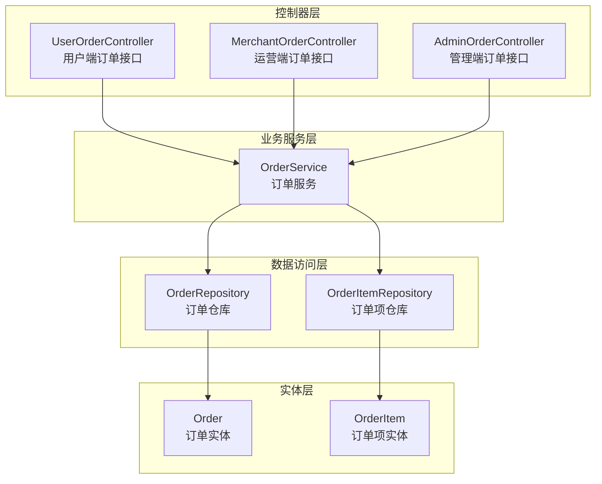
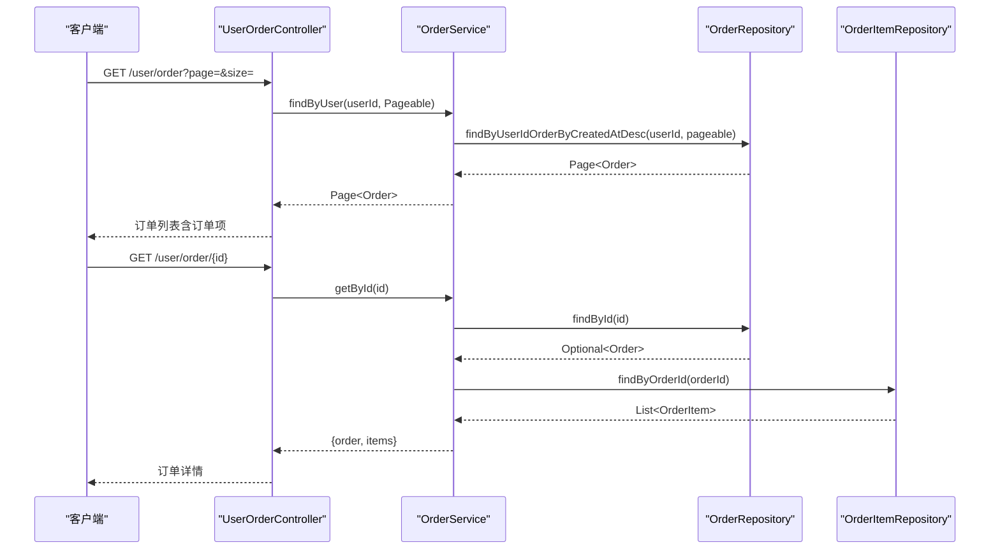
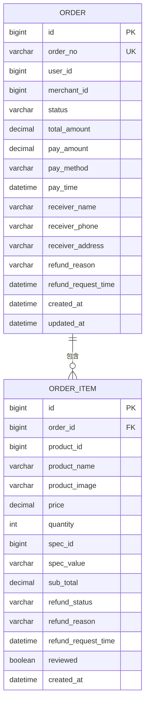
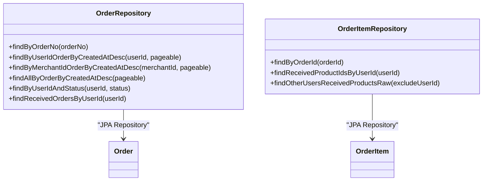
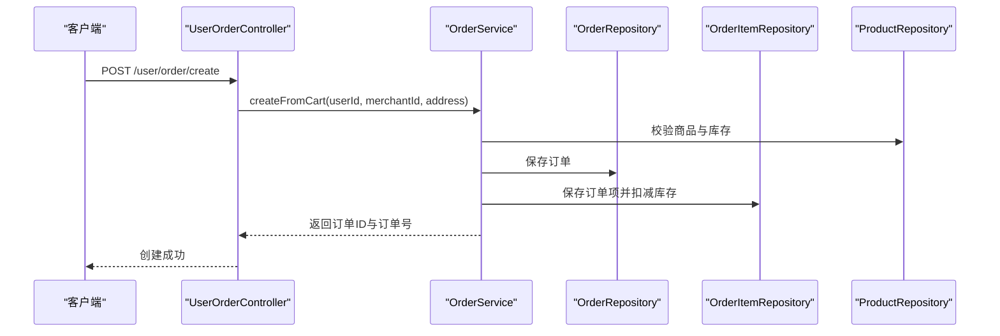
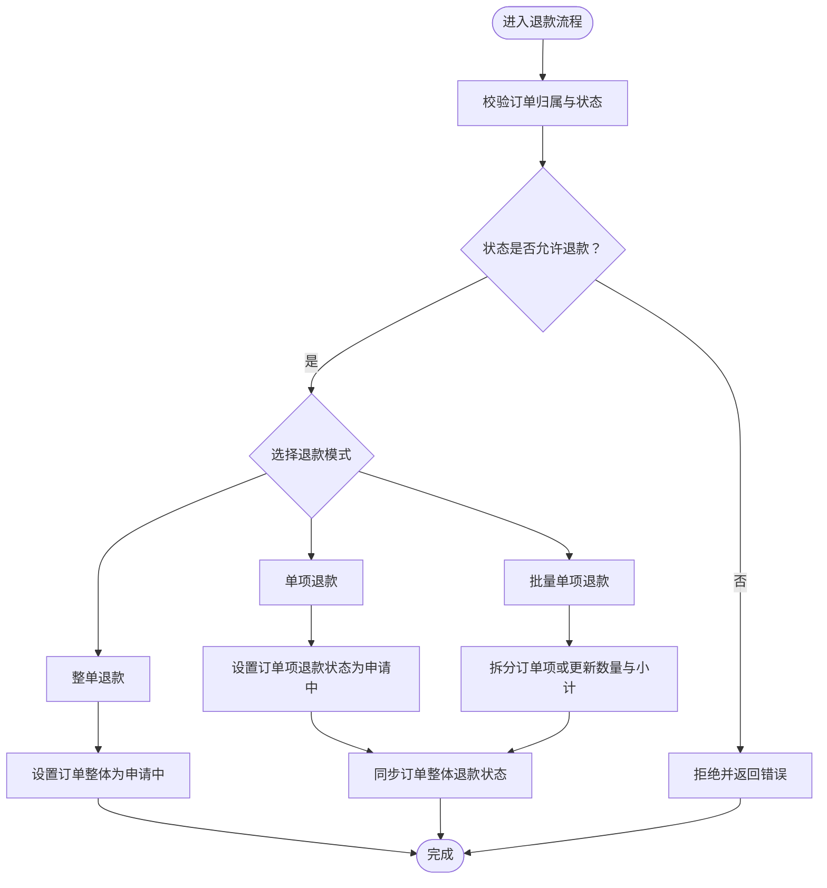
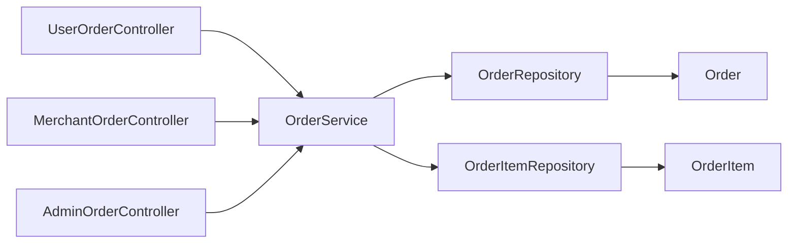

# 订单数据访问层

<cite>
**本文引用的文件**
- [Order.java](file://backend/src/main/java/com/mall/entity/Order.java)
- [OrderItem.java](file://backend/src/main/java/com/mall/entity/OrderItem.java)
- [OrderRepository.java](file://backend/src/main/java/com/mall/repository/OrderRepository.java)
- [OrderItemRepository.java](file://backend/src/main/java/com/mall/repository/OrderItemRepository.java)
- [OrderService.java](file://backend/src/main/java/com/mall/service/OrderService.java)
- [UserOrderController.java](file://backend/src/main/java/com/mall/controller/user/UserOrderController.java)
- [MerchantOrderController.java](file://backend/src/main/java/com/mall/controller/merchant/MerchantOrderController.java)
- [AdminOrderController.java](file://backend/src/main/java/com/mall/controller/admin/AdminOrderController.java)
- [application.yml](file://backend/src/main/resources/application.yml)
</cite>

## 目录
1. [简介](#简介)
2. [项目结构](#项目结构)
3. [核心组件](#核心组件)
4. [架构总览](#架构总览)
5. [详细组件分析](#详细组件分析)
6. [依赖关系分析](#依赖关系分析)
7. [性能考量](#性能考量)
8. [故障排查指南](#故障排查指南)
9. [结论](#结论)

## 简介
本技术文档聚焦于订单数据访问层的设计与实现，系统性解析 OrderRepository 与 OrderItemRepository 的职责边界、主从表关联查询策略、订单状态管理机制、订单项明细处理流程，以及复杂查询条件组合（用户订单历史、商户订单统计、订单状态筛选等）的实现方式。同时，文档阐述订单金额计算、统计分析的查询优化策略，以及订单与商品、用户之间的多对多关系查询处理方法，并总结订单管理场景下的数据访问最佳实践与性能优化方案。

## 项目结构
订单相关代码采用分层架构组织，遵循 Spring Boot 常见约定：
- 实体层：定义订单与订单项的数据模型及字段约束
- 数据访问层：通过 JPA Repository 提供基础 CRUD 与查询能力
- 业务服务层：封装订单创建、状态流转、退款申请等业务逻辑
- 控制器层：面向用户、运营、管理三类角色提供统一的订单接口

图表来源
- [UserOrderController.java:1-198](file://backend/src/main/java/com/mall/controller/user/UserOrderController.java#L1-L198)
- [MerchantOrderController.java:1-100](file://backend/src/main/java/com/mall/controller/merchant/MerchantOrderController.java#L1-L100)
- [AdminOrderController.java:1-45](file://backend/src/main/java/com/mall/controller/admin/AdminOrderController.java#L1-L45)
- [OrderService.java:1-280](file://backend/src/main/java/com/mall/service/OrderService.java#L1-L280)
- [OrderRepository.java:1-28](file://backend/src/main/java/com/mall/repository/OrderRepository.java#L1-L28)
- [OrderItemRepository.java:1-20](file://backend/src/main/java/com/mall/repository/OrderItemRepository.java#L1-L20)
- [Order.java:1-83](file://backend/src/main/java/com/mall/entity/Order.java#L1-L83)
- [OrderItem.java:1-73](file://backend/src/main/java/com/mall/entity/OrderItem.java#L1-L73)

章节来源
- [UserOrderController.java:1-198](file://backend/src/main/java/com/mall/controller/user/UserOrderController.java#L1-L198)
- [MerchantOrderController.java:1-100](file://backend/src/main/java/com/mall/controller/merchant/MerchantOrderController.java#L1-L100)
- [AdminOrderController.java:1-45](file://backend/src/main/java/com/mall/controller/admin/AdminOrderController.java#L1-L45)
- [OrderService.java:1-280](file://backend/src/main/java/com/mall/service/OrderService.java#L1-L280)
- [OrderRepository.java:1-28](file://backend/src/main/java/com/mall/repository/OrderRepository.java#L1-L28)
- [OrderItemRepository.java:1-20](file://backend/src/main/java/com/mall/repository/OrderItemRepository.java#L1-L20)
- [Order.java:1-83](file://backend/src/main/java/com/mall/entity/Order.java#L1-L83)
- [OrderItem.java:1-73](file://backend/src/main/java/com/mall/entity/OrderItem.java#L1-L73)

## 核心组件
- 订单实体 Order：包含订单号、用户与商户标识、状态、金额、收货信息、退款相关信息、时间戳等字段，并在持久化前后自动维护创建与更新时间。
- 订单项实体 OrderItem：包含订单项与商品的快照信息（名称、图片、单价、数量、小计）、规格信息、单品退款状态与时间戳等。
- 订单仓库 OrderRepository：提供基于用户、商户、状态的分页查询，以及已收货订单查询等方法。
- 订单项仓库 OrderItemRepository：提供按订单查询订单项、按用户查询已收货商品 ID 列表、以及用于协同过滤的原始 SQL 查询等方法。
- 订单服务 OrderService：封装下单、查询、状态更新、取消、退款申请与审批等完整业务流程，确保事务一致性与数据完整性。

章节来源
- [Order.java:1-83](file://backend/src/main/java/com/mall/entity/Order.java#L1-L83)
- [OrderItem.java:1-73](file://backend/src/main/java/com/mall/entity/OrderItem.java#L1-L73)
- [OrderRepository.java:1-28](file://backend/src/main/java/com/mall/repository/OrderRepository.java#L1-L28)
- [OrderItemRepository.java:1-20](file://backend/src/main/java/com/mall/repository/OrderItemRepository.java#L1-L20)
- [OrderService.java:1-280](file://backend/src/main/java/com/mall/service/OrderService.java#L1-L280)

## 架构总览
订单数据访问层围绕“控制器-服务-仓库-实体”四层展开，控制器负责请求接入与参数校验，服务层编排业务流程并保证事务边界，仓库层提供数据访问能力，实体层承载数据模型与映射规则。

图表来源
- [UserOrderController.java:52-100](file://backend/src/main/java/com/mall/controller/user/UserOrderController.java#L52-L100)
- [OrderService.java:90-113](file://backend/src/main/java/com/mall/service/OrderService.java#L90-L113)
- [OrderRepository.java:17-18](file://backend/src/main/java/com/mall/repository/OrderRepository.java#L17-L18)
- [OrderItemRepository.java:11](file://backend/src/main/java/com/mall/repository/OrderItemRepository.java#L11)

## 详细组件分析

### 订单实体与订单项实体
- 订单实体 Order 关键点：
  - 主键自增 id
  - 订单号 orderNo 唯一且非空
  - 用户与商户标识 userId、merchantId
  - 订单状态 status（枚举式字符串）
  - 金额字段 totalAmount、payAmount、payMethod、payTime
  - 收货人信息 receiverName、receiverPhone、receiverAddress
  - 退款相关字段 refundReason、refundRequestTime
  - 时间戳 createdAt、updatedAt，持久化与更新时自动维护
- 订单项实体 OrderItem 关键点：
  - 主键自增 id
  - 外键 orderId、productId
  - 商品快照：productName、productImage、price、quantity、subTotal
  - 规格信息：specId、specValue
  - 单品退款状态 refundStatus、退款原因与时间
  - 评价标记 reviewed
  - 时间戳 createdAt

图表来源
- [Order.java:18-81](file://backend/src/main/java/com/mall/entity/Order.java#L18-L81)
- [OrderItem.java:18-71](file://backend/src/main/java/com/mall/entity/OrderItem.java#L18-L71)

章节来源
- [Order.java:1-83](file://backend/src/main/java/com/mall/entity/Order.java#L1-L83)
- [OrderItem.java:1-73](file://backend/src/main/java/com/mall/entity/OrderItem.java#L1-L73)

### 订单仓库与订单项仓库
- 订单仓库 OrderRepository：
  - 基于用户分页查询：按创建时间倒序
  - 基于商户分页查询：按创建时间倒序
  - 全站分页查询：按创建时间倒序
  - 用户+状态查询：按状态过滤
  - 已收货订单查询：使用 JPQL 条件过滤
- 订单项仓库 OrderItemRepository：
  - 按订单查询订单项
  - 按用户查询已收货商品 ID 列表（用于复购推荐）
  - 协同过滤原始 SQL：查询所有已收货订单的 (用户ID, 商品ID)，排除指定用户

图表来源
- [OrderRepository.java:13-27](file://backend/src/main/java/com/mall/repository/OrderRepository.java#L13-L27)
- [OrderItemRepository.java:9-19](file://backend/src/main/java/com/mall/repository/OrderItemRepository.java#L9-L19)

章节来源
- [OrderRepository.java:1-28](file://backend/src/main/java/com/mall/repository/OrderRepository.java#L1-L28)
- [OrderItemRepository.java:1-20](file://backend/src/main/java/com/mall/repository/OrderItemRepository.java#L1-L20)

### 订单服务：下单、状态管理与退款
- 下单流程（按运营从购物车创建）：
  - 校验购物车中是否存在该运营的商品
  - 计算订单总金额与订单项明细（单价×数量）
  - 生成唯一订单号，保存订单与订单项，并扣减对应商品库存
  - 清空购物车中已下单的商品
- 订单状态管理：
  - 用户端：创建后为待支付，确认收货后为已收货，完成订单后为已完成
  - 运营端：已支付后可发货，同意退款后为已退款
  - 退款流程：支持整单或单项退款，单项部分退款时进行订单项拆分
- 退款同步机制：
  - 当所有订单项均处于“申请中/已退款”状态时，订单整体同步为“申请中/已退款”

图表来源
- [UserOrderController.java:34-50](file://backend/src/main/java/com/mall/controller/user/UserOrderController.java#L34-L50)
- [OrderService.java:34-88](file://backend/src/main/java/com/mall/service/OrderService.java#L34-L88)

图表来源
- [OrderService.java:147-278](file://backend/src/main/java/com/mall/service/OrderService.java#L147-L278)

章节来源
- [OrderService.java:1-280](file://backend/src/main/java/com/mall/service/OrderService.java#L1-L280)

### 控制器层：用户、运营、管理端接口
- 用户端接口：
  - 创建订单、分页查询我的订单、订单详情、模拟支付、确认收货、取消订单、整单/单项/批量单项退款
- 运营端接口：
  - 分页查询运营订单、订单详情、发货、同意整单/单项退款
- 管理端接口：
  - 分页查询全站订单、订单详情

章节来源
- [UserOrderController.java:1-198](file://backend/src/main/java/com/mall/controller/user/UserOrderController.java#L1-L198)
- [MerchantOrderController.java:1-100](file://backend/src/main/java/com/mall/controller/merchant/MerchantOrderController.java#L1-L100)
- [AdminOrderController.java:1-45](file://backend/src/main/java/com/mall/controller/admin/AdminOrderController.java#L1-L45)

## 依赖关系分析
- 控制器依赖服务：三层解耦清晰，控制器仅负责参数解析与结果封装
- 服务依赖仓库：服务层集中编排业务，避免在控制器中直接操作数据库
- 仓库依赖实体：JPA 自动映射，减少手写 SQL 的复杂度
- 协同过滤依赖原生 SQL：OrderItemRepository 提供原生 SQL 查询以支持跨用户-商品的关联分析

图表来源
- [UserOrderController.java:25-26](file://backend/src/main/java/com/mall/controller/user/UserOrderController.java#L25-L26)
- [MerchantOrderController.java:26-27](file://backend/src/main/java/com/mall/controller/merchant/MerchantOrderController.java#L26-L27)
- [AdminOrderController.java:23](file://backend/src/main/java/com/mall/controller/admin/AdminOrderController.java#L23)
- [OrderService.java:28-31](file://backend/src/main/java/com/mall/service/OrderService.java#L28-L31)
- [OrderRepository.java:13](file://backend/src/main/java/com/mall/repository/OrderRepository.java#L13)
- [OrderItemRepository.java:9](file://backend/src/main/java/com/mall/repository/OrderItemRepository.java#L9)

章节来源
- [OrderRepository.java:1-28](file://backend/src/main/java/com/mall/repository/OrderRepository.java#L1-L28)
- [OrderItemRepository.java:1-20](file://backend/src/main/java/com/mall/repository/OrderItemRepository.java#L1-L20)
- [OrderService.java:1-280](file://backend/src/main/java/com/mall/service/OrderService.java#L1-L280)

## 性能考量
- 查询优化
  - 使用分页查询：用户/运营/管理端均采用分页接口，避免一次性加载大量订单
  - 索引建议：在订单表的 user_id、merchant_id、status、created_at 上建立复合索引，提升分页与筛选效率
  - JPQL 与原生 SQL 结合：对于协同过滤等复杂关联分析，使用原生 SQL 可获得更优执行计划
- 事务与一致性
  - 下单与库存扣减、取消与库存回补、退款与订单项状态同步均在事务内完成，保证 ACID
- 订单金额计算
  - 订单项小计=subTotal=单价×数量；订单总金额=所有订单项小计之和
  - 在下单流程中逐项计算并累加，避免重复计算与精度问题
- 多对多关系查询
  - 订单与商品：通过订单项表 order_item 作为中间表，实现订单到商品的多对多映射
  - 协同过滤：利用原生 SQL 聚合用户-商品的购买行为，支持推荐系统需求

[本节为通用性能指导，不直接分析具体文件，故无章节来源]

## 故障排查指南
- 订单不存在或越权访问
  - 用户端与运营端接口均会校验订单归属，若订单不存在或不属于当前用户/运营，返回错误
- 订单状态异常
  - 取消订单仅允许在特定状态；申请退款仅允许已收货或退款申请中状态；发货仅允许已支付状态
- 退款数量不合法
  - 批量单项退款时需校验申请数量不超过购买数量，否则抛出异常
- 库存不足
  - 下单时若商品库存不足，抛出异常并阻止下单
- 退款同步
  - 当所有订单项均处于“申请中/已退款”状态时，订单整体状态才会同步为“申请中/已退款”

章节来源
- [UserOrderController.java:90-144](file://backend/src/main/java/com/mall/controller/user/UserOrderController.java#L90-L144)
- [MerchantOrderController.java:61-99](file://backend/src/main/java/com/mall/controller/merchant/MerchantOrderController.java#L61-L99)
- [OrderService.java:123-145](file://backend/src/main/java/com/mall/service/OrderService.java#L123-L145)
- [OrderService.java:147-278](file://backend/src/main/java/com/mall/service/OrderService.java#L147-L278)

## 结论
订单数据访问层通过清晰的分层设计与完善的业务编排，实现了从下单、状态流转到退款处理的全链路能力。OrderRepository 与 OrderItemRepository 提供了高效的基础查询能力，结合 OrderService 的事务控制与状态同步机制，保障了数据一致性与用户体验。针对复杂查询与统计分析，系统采用 JPQL 与原生 SQL 相结合的方式，在保证可读性的同时兼顾性能。建议在生产环境中进一步完善索引策略与缓存机制，持续优化分页查询与高并发场景下的响应性能。