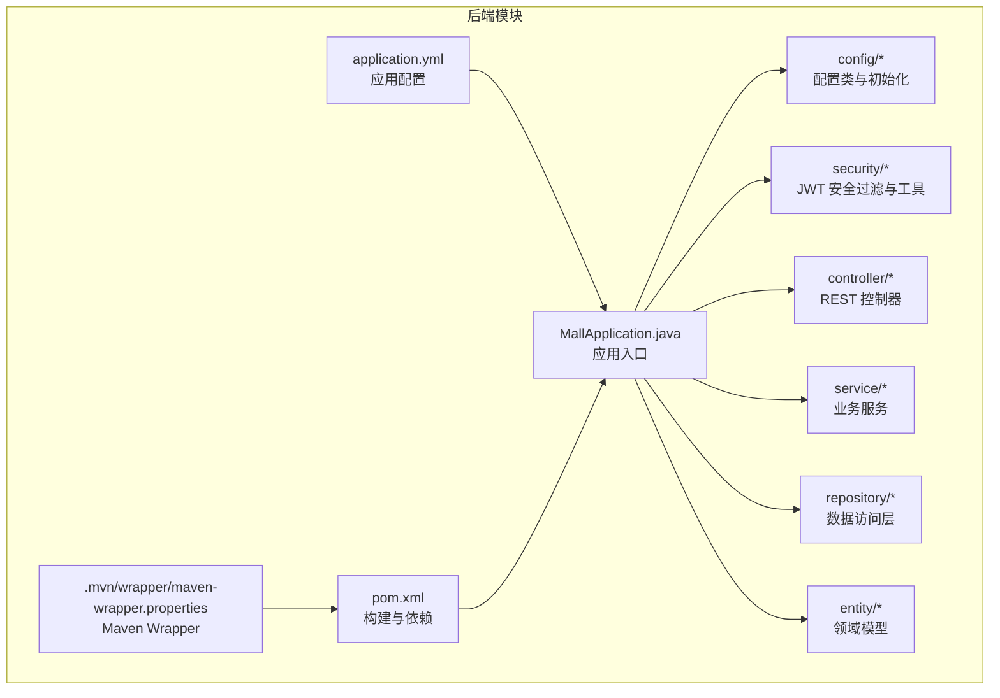
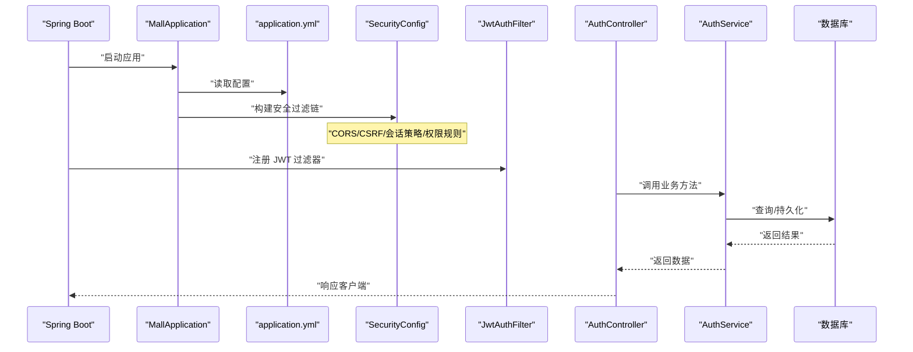
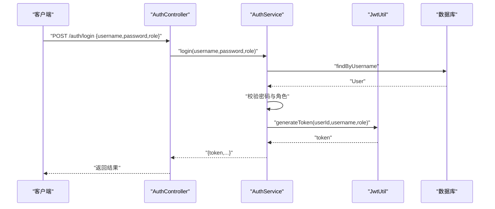
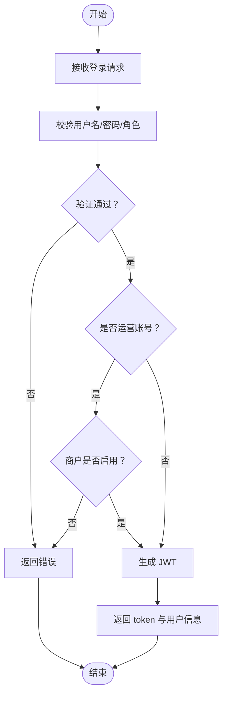

# 核心配置与启动

<cite>
**本文引用的文件**
- [MallApplication.java](file://backend/src/main/java/com/mall/MallApplication.java)
- [application.yml](file://backend/src/main/resources/application.yml)
- [pom.xml](file://backend/pom.xml)
- [maven-wrapper.properties](file://backend/.mvn/wrapper/maven-wrapper.properties)
- [JwtProperties.java](file://backend/src/main/java/com/mall/config/JwtProperties.java)
- [SecurityConfig.java](file://backend/src/main/java/com/mall/config/SecurityConfig.java)
- [JwtAuthFilter.java](file://backend/src/main/java/com/mall/security/JwtAuthFilter.java)
- [JwtUtil.java](file://backend/src/main/java/com/mall/security/JwtUtil.java)
- [Role.java](file://backend/src/main/java/com/mall/common/Role.java)
- [DataInitializer.java](file://backend/src/main/java/com/mall/config/DataInitializer.java)
- [AuthController.java](file://backend/src/main/java/com/mall/controller/AuthController.java)
- [AuthService.java](file://backend/src/main/java/com/mall/service/AuthService.java)
</cite>

## 目录
1. [简介](#简介)
2. [项目结构](#项目结构)
3. [核心组件](#核心组件)
4. [架构总览](#架构总览)
5. [详细组件分析](#详细组件分析)
6. [依赖分析](#依赖分析)
7. [性能考虑](#性能考虑)
8. [故障排查指南](#故障排查指南)
9. [结论](#结论)
10. [附录](#附录)

## 简介
本文件聚焦于电商商城系统（Spring Boot 后端）的核心配置与启动机制，围绕以下目标展开：
- 解析 Spring Boot 应用启动流程与 @SpringBootApplication 注解的作用与配置原理
- 详解 application.yml 的关键配置项：数据库连接、JPA/Hibernate、服务器端口与上下文路径、JWT 密钥与过期时间、日志级别等
- 解释 Maven 构建配置 pom.xml 中的依赖管理与插件配置
- 提供配置文件示例与最佳实践，帮助开发者正确配置开发与生产环境

## 项目结构
后端采用标准 Spring Boot 结构，主要目录与职责如下：
- src/main/java/com/mall：应用主包，包含启动类、配置类、安全过滤器、实体、仓库、服务、控制器等
- src/main/resources：资源文件，包含 application.yml、静态资源目录等
- pom.xml：Maven 构建配置，定义依赖与插件
- .mvn/wrapper：Maven Wrapper 配置，确保团队使用统一的 Maven 版本

图表来源
- [MallApplication.java:1-13](file://backend/src/main/java/com/mall/MallApplication.java#L1-L13)
- [application.yml:1-36](file://backend/src/main/resources/application.yml#L1-L36)
- [pom.xml:1-107](file://backend/pom.xml#L1-L107)
- [maven-wrapper.properties:1-4](file://backend/.mvn/wrapper/maven-wrapper.properties#L1-L4)

章节来源
- [MallApplication.java:1-13](file://backend/src/main/java/com/mall/MallApplication.java#L1-L13)
- [application.yml:1-36](file://backend/src/main/resources/application.yml#L1-L36)
- [pom.xml:1-107](file://backend/pom.xml#L1-L107)
- [maven-wrapper.properties:1-4](file://backend/.mvn/wrapper/maven-wrapper.properties#L1-L4)

## 核心组件
- 应用启动类：位于 com.mall 包下，通过 @SpringBootApplication 注解启用自动配置与组件扫描，main 方法调用 SpringApplication.run 启动应用
- 配置中心：application.yml 提供数据库、JPA、服务器、JWT、日志等配置
- 安全体系：基于 Spring Security + JWT，通过 SecurityConfig 定义 CORS、CSRF、会话策略与权限规则；JwtAuthFilter 在请求链中解析并注入认证信息；JwtUtil 负责签名与解析
- 初始化器：DataInitializer 实现 CommandLineRunner，在应用启动时按需初始化基础数据
- 构建系统：pom.xml 管理 Spring Boot 3.4.1、Java 17、MySQL Connector、JWT 依赖及编译与打包插件

章节来源
- [MallApplication.java:1-13](file://backend/src/main/java/com/mall/MallApplication.java#L1-L13)
- [application.yml:1-36](file://backend/src/main/resources/application.yml#L1-L36)
- [SecurityConfig.java:1-74](file://backend/src/main/java/com/mall/config/SecurityConfig.java#L1-L74)
- [JwtAuthFilter.java:1-57](file://backend/src/main/java/com/mall/security/JwtAuthFilter.java#L1-L57)
- [JwtUtil.java:1-48](file://backend/src/main/java/com/mall/security/JwtUtil.java#L1-L48)
- [DataInitializer.java:1-95](file://backend/src/main/java/com/mall/config/DataInitializer.java#L1-L95)
- [pom.xml:1-107](file://backend/pom.xml#L1-L107)

## 架构总览
下图展示从启动到请求处理的关键路径：应用启动、配置加载、安全过滤链、JWT 解析与授权、业务服务调用。

图表来源
- [MallApplication.java:1-13](file://backend/src/main/java/com/mall/MallApplication.java#L1-L13)
- [application.yml:1-36](file://backend/src/main/resources/application.yml#L1-L36)
- [SecurityConfig.java:1-74](file://backend/src/main/java/com/mall/config/SecurityConfig.java#L1-L74)
- [JwtAuthFilter.java:1-57](file://backend/src/main/java/com/mall/security/JwtAuthFilter.java#L1-L57)
- [AuthController.java:1-73](file://backend/src/main/java/com/mall/controller/AuthController.java#L1-L73)
- [AuthService.java:1-92](file://backend/src/main/java/com/mall/service/AuthService.java#L1-L92)

## 详细组件分析

### 启动类与自动装配
- @SpringBootApplication 组合注解包含：
  - @SpringBootConfiguration：标记配置类
  - @EnableAutoConfiguration：开启自动配置
  - @ComponentScan：启用组件扫描，默认扫描当前包及其子包
- main 方法通过 SpringApplication.run 启动嵌入式 Web 容器（默认 Tomcat），加载 application.yml 并完成 Bean 初始化

章节来源
- [MallApplication.java:1-13](file://backend/src/main/java/com/mall/MallApplication.java#L1-L13)

### 配置文件 application.yml 关键项解析
- spring.application.name：应用名称
- spring.datasource.*：数据库连接参数（URL、用户名、密码、驱动）
- spring.jpa.*：Hibernate 行为（DDL 自动更新、SQL 输出、方言、格式化、open-in-view）
- server.*：服务器端口与上下文路径
- jwt.*：JWT 密钥与过期时间（毫秒）
- logging.level.*：日志级别

章节来源
- [application.yml:1-36](file://backend/src/main/resources/application.yml#L1-L36)

### 安全配置与 CORS
- 基于 Spring Security 的 Web 安全配置：
  - 禁用 CSRF，启用 CORS
  - SessionCreationPolicy.STATELESS：无状态会话
  - 权限规则：公开接口放行、按角色限制访问、其他请求需认证
  - 注册 JwtAuthFilter 于 UsernamePasswordAuthenticationFilter 之前
- CORS 配置：允许特定前端地址、所有方法、允许凭据

章节来源
- [SecurityConfig.java:1-74](file://backend/src/main/java/com/mall/config/SecurityConfig.java#L1-L74)

### JWT 配置与工具
- JwtProperties：通过 @ConfigurationProperties(prefix = "jwt") 绑定配置项（secret、expirationMs）
- JwtUtil：基于 HMAC-SHA 使用密钥生成与解析 JWT，包含生成令牌与解析声明的方法
- JwtAuthFilter：从 Authorization 头解析 Bearer Token，注入认证上下文

章节来源
- [JwtProperties.java:1-18](file://backend/src/main/java/com/mall/config/JwtProperties.java#L1-L18)
- [JwtUtil.java:1-48](file://backend/src/main/java/com/mall/security/JwtUtil.java#L1-L48)
- [JwtAuthFilter.java:1-57](file://backend/src/main/java/com/mall/security/JwtAuthFilter.java#L1-L57)

### 数据初始化器
- 实现 CommandLineRunner，在应用启动时检查用户表是否为空，若为空则批量插入管理员、运营与普通用户，以及分类、商品与公告等初始数据

章节来源
- [DataInitializer.java:1-95](file://backend/src/main/java/com/mall/config/DataInitializer.java#L1-L95)

### 认证流程与控制器
- AuthController：提供 /auth/login 与 /auth/register 接口，接收用户名、密码、角色等参数
- AuthService：登录校验用户状态与角色匹配，必要时校验商户启用状态，签发 JWT；注册时进行用户名唯一性校验并保存用户

图表来源
- [AuthController.java:1-73](file://backend/src/main/java/com/mall/controller/AuthController.java#L1-L73)
- [AuthService.java:1-92](file://backend/src/main/java/com/mall/service/AuthService.java#L1-L92)
- [JwtUtil.java:1-48](file://backend/src/main/java/com/mall/security/JwtUtil.java#L1-L48)

章节来源
- [AuthController.java:1-73](file://backend/src/main/java/com/mall/controller/AuthController.java#L1-L73)
- [AuthService.java:1-92](file://backend/src/main/java/com/mall/service/AuthService.java#L1-L92)

### 角色与权限模型
- Role 枚举定义 ADMIN、MERCHANT、USER 三类角色
- SecurityConfig 中对不同前缀路径进行角色授权控制

章节来源
- [Role.java:1-8](file://backend/src/main/java/com/mall/common/Role.java#L1-L8)
- [SecurityConfig.java:1-74](file://backend/src/main/java/com/mall/config/SecurityConfig.java#L1-L74)

## 依赖分析
- Spring Boot 3.4.1（父 POM）：提供自动配置、Starter 依赖与构建插件
- Web、Data JPA、Security、Validation：提供 Web MVC、ORM、安全与校验能力
- MySQL Connector：数据库驱动
- JWT：jjwt-api/impl/jackson
- Lombok：简化实体与配置类代码
- 测试 Starter 与 Spring Security Test：测试支持

```mermaid
graph TB
Root["pom.xml"]
Parent["spring-boot-starter-parent 3.4.1"]
Java["java.version 17"]
Web["spring-boot-starter-web"]
JPA["spring-boot-starter-data-jpa"]
Sec["spring-boot-starter-security"]
Val["spring-boot-starter-validation"]
MySQL["mysql-connector-j (runtime)"]
JWT_API["jjwt-api 0.12.6"]
JWT_IMPL["jjwt-impl 0.12.6 (runtime)"]
JWT_JACKSON["jjwt-jackson 0.12.6 (runtime)"]
Lombok["lombok 1.18.34 (optional)"]
Test["spring-boot-starter-test (test)"]
SecTest["spring-security-test (test)"]
Root --> Parent
Root --> Java
Root --> Web
Root --> JPA
Root --> Sec
Root --> Val
Root --> MySQL
Root --> JWT_API
Root --> JWT_IMPL
Root --> JWT_JACKSON
Root --> Lombok
Root --> Test
Root --> SecTest
```

图表来源
- [pom.xml:1-107](file://backend/pom.xml#L1-L107)

章节来源
- [pom.xml:1-107](file://backend/pom.xml#L1-L107)

## 性能考虑
- 无状态会话：通过 STATELESS 策略减少会话开销
- SQL 输出：在开发环境可开启 show-sql，生产环境建议关闭以降低日志开销
- DDL 自动更新：开发阶段可用，生产环境建议改为手动迁移策略
- CORS 凭据：允许凭据会增加跨域复杂请求处理成本，仅在必要时开启
- 日志级别：合理设置日志级别，避免过度输出影响性能

## 故障排查指南
- 启动失败（端口占用）：检查 server.port 是否被占用，或调整为未占用端口
- 数据库连接异常：核对 spring.datasource.url、username、password、driver-class-name
- JWT 解析失败：确认 jwt.secret 与 jwt.expiration-ms 配置一致，且客户端携带正确的 Authorization: Bearer <token>
- CORS 报错：确认前端地址已在 cors.allowed-origins 列表中，且允许凭据
- 登录失败：检查用户是否存在、密码是否匹配、角色是否正确、商户是否启用
- 权限拒绝：确认请求路径是否命中相应角色规则，或是否被放行

章节来源
- [application.yml:1-36](file://backend/src/main/resources/application.yml#L1-L36)
- [SecurityConfig.java:1-74](file://backend/src/main/java/com/mall/config/SecurityConfig.java#L1-L74)
- [JwtAuthFilter.java:1-57](file://backend/src/main/java/com/mall/security/JwtAuthFilter.java#L1-L57)
- [AuthService.java:1-92](file://backend/src/main/java/com/mall/service/AuthService.java#L1-L92)

## 结论
本项目通过 @SpringBootApplication 快速启用自动配置与组件扫描，结合 application.yml 的集中配置与 Spring Security + JWT 的无状态认证方案，实现了清晰的启动流程与安全控制。pom.xml 明确了技术栈与构建插件，配合 Maven Wrapper 确保团队一致性。建议在生产环境中严格管理敏感配置（如数据库与 JWT 密钥），并采用更稳健的数据库迁移策略与日志监控体系。

## 附录

### 配置文件示例与最佳实践
- 数据库配置
  - 开发环境：本地 MySQL，使用最小权限账户
  - 生产环境：使用只读账号用于查询，写操作使用专用账号；启用 SSL 连接
- JWT 配置
  - 密钥长度至少 256 位，定期轮换；过期时间根据业务场景调整
  - 生产环境禁止明文存储密钥，使用环境变量或密钥管理服务
- 服务器与上下文路径
  - 上下文路径 /api 与前端路由保持一致，避免路径冲突
  - 端口与容器编排一致，避免端口冲突
- CORS
  - 仅允许受信域名，避免使用通配符 *
  - 仅在必要时允许凭据
- 日志
  - 生产环境将 com.mall 与 Spring Security 日志级别设为 INFO 或更高
- Maven
  - 使用 Maven Wrapper 固定版本，避免团队差异
  - 编译插件与 Java 版本保持一致

### 关键流程图：JWT 登录与鉴权

图表来源
- [AuthService.java:1-92](file://backend/src/main/java/com/mall/service/AuthService.java#L1-L92)
- [JwtUtil.java:1-48](file://backend/src/main/java/com/mall/security/JwtUtil.java#L1-L48)