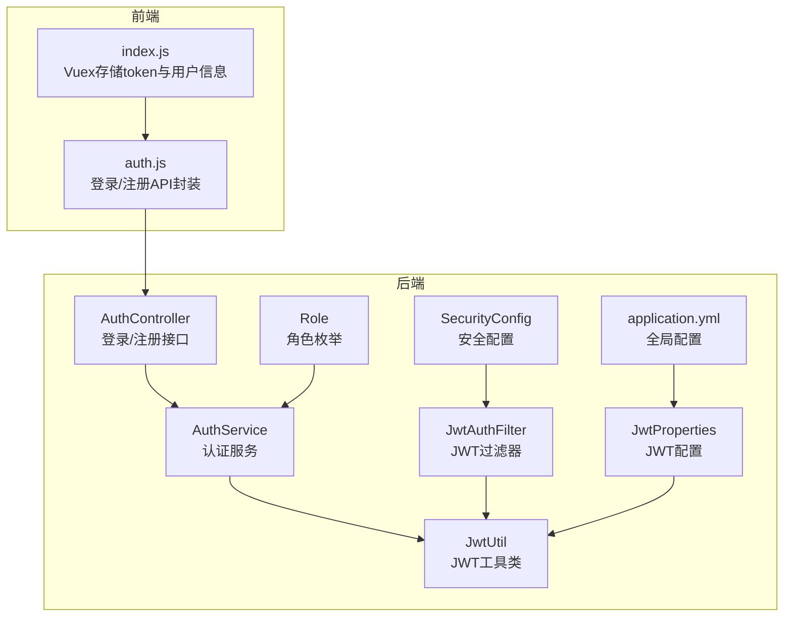
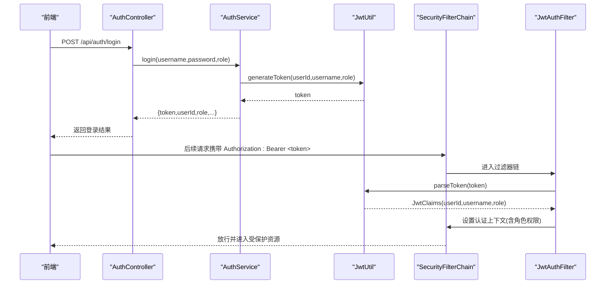
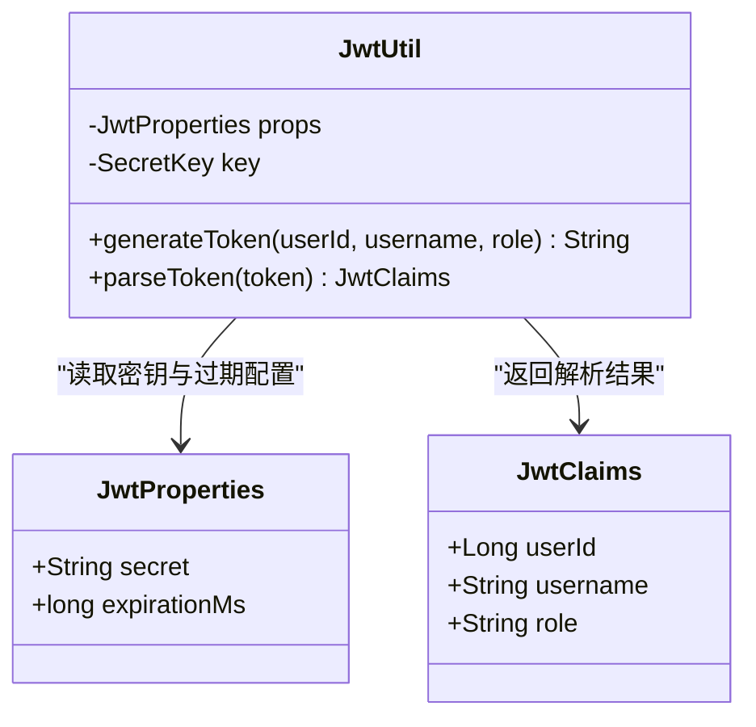
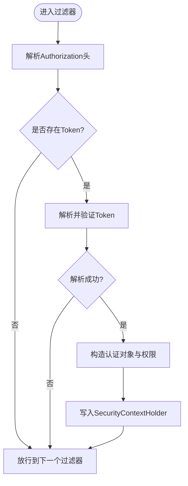
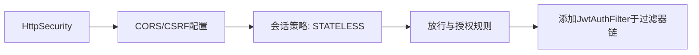
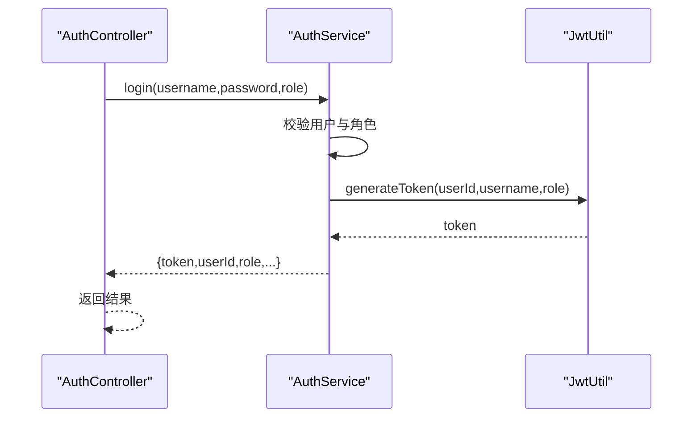
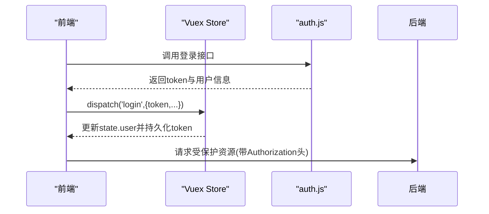
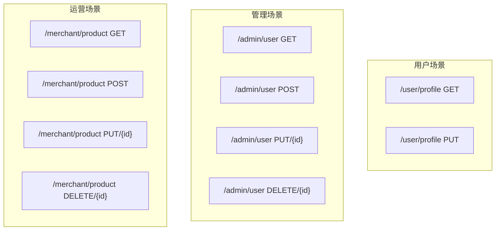
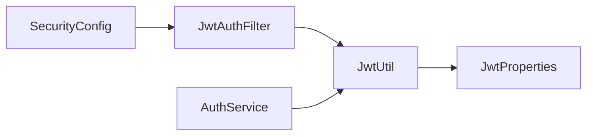

# JWT认证机制

<cite>
**本文引用的文件**
- [JwtUtil.java](file://backend/src/main/java/com/mall/security/JwtUtil.java)
- [JwtAuthFilter.java](file://backend/src/main/java/com/mall/security/JwtAuthFilter.java)
- [JwtProperties.java](file://backend/src/main/java/com/mall/config/JwtProperties.java)
- [SecurityConfig.java](file://backend/src/main/java/com/mall/config/SecurityConfig.java)
- [AuthService.java](file://backend/src/main/java/com/mall/service/AuthService.java)
- [AuthController.java](file://backend/src/main/java/com/mall/controller/AuthController.java)
- [application.yml](file://backend/src/main/resources/application.yml)
- [Role.java](file://backend/src/main/java/com/mall/common/Role.java)
- [UserProfileController.java](file://backend/src/main/java/com/mall/controller/user/UserProfileController.java)
- [AdminUserController.java](file://backend/src/main/java/com/mall/controller/admin/AdminUserController.java)
- [MerchantProductController.java](file://backend/src/main/java/com/mall/controller/merchant/MerchantProductController.java)
- [auth.js](file://frontend/src/api/auth.js)
- [index.js](file://frontend/src/store/index.js)
</cite>

## 目录
1. [引言](#引言)
2. [项目结构](#项目结构)
3. [核心组件](#核心组件)
4. [架构总览](#架构总览)
5. [详细组件分析](#详细组件分析)
6. [依赖分析](#依赖分析)
7. [性能考虑](#性能考虑)
8. [故障排查指南](#故障排查指南)
9. [结论](#结论)
10. [附录](#附录)

## 引言
本文件系统性阐述本项目的JWT认证机制，覆盖以下要点：
- JWT工作原理：生成、签名、验证流程
- 工具类JwtUtil的实现细节与数据模型
- 过期时间管理与刷新策略建议
- 过滤器JwtAuthFilter如何拦截请求、提取与验证Token、设置用户身份
- JWT配置参数说明与安全传输注意事项
- 在不同业务场景（用户、运营、管理）下的使用方式
- Token失效处理策略与与Spring Security的集成方式

## 项目结构
后端采用基于注解的Spring Boot工程，JWT相关代码集中在security与config包；前端通过Vuex持久化存储token并在请求头携带。

**图表来源**
- [JwtUtil.java:1-48](file://backend/src/main/java/com/mall/security/JwtUtil.java#L1-L48)
- [JwtAuthFilter.java:1-57](file://backend/src/main/java/com/mall/security/JwtAuthFilter.java#L1-L57)
- [JwtProperties.java:1-18](file://backend/src/main/java/com/mall/config/JwtProperties.java#L1-L18)
- [SecurityConfig.java:1-74](file://backend/src/main/java/com/mall/config/SecurityConfig.java#L1-L74)
- [AuthService.java:1-92](file://backend/src/main/java/com/mall/service/AuthService.java#L1-L92)
- [AuthController.java:1-73](file://backend/src/main/java/com/mall/controller/AuthController.java#L1-L73)
- [application.yml:27-30](file://backend/src/main/resources/application.yml#L27-L30)
- [Role.java:1-8](file://backend/src/main/java/com/mall/common/Role.java#L1-L8)
- [auth.js:1-26](file://frontend/src/api/auth.js#L1-L26)
- [index.js:1-31](file://frontend/src/store/index.js#L1-L31)

**章节来源**
- [JwtUtil.java:1-48](file://backend/src/main/java/com/mall/security/JwtUtil.java#L1-L48)
- [JwtAuthFilter.java:1-57](file://backend/src/main/java/com/mall/security/JwtAuthFilter.java#L1-L57)
- [JwtProperties.java:1-18](file://backend/src/main/java/com/mall/config/JwtProperties.java#L1-L18)
- [SecurityConfig.java:1-74](file://backend/src/main/java/com/mall/config/SecurityConfig.java#L1-L74)
- [AuthService.java:1-92](file://backend/src/main/java/com/mall/service/AuthService.java#L1-L92)
- [AuthController.java:1-73](file://backend/src/main/java/com/mall/controller/AuthController.java#L1-L73)
- [application.yml:27-30](file://backend/src/main/resources/application.yml#L27-L30)
- [Role.java:1-8](file://backend/src/main/java/com/mall/common/Role.java#L1-L8)
- [auth.js:1-26](file://frontend/src/api/auth.js#L1-L26)
- [index.js:1-31](file://frontend/src/store/index.js#L1-L31)

## 核心组件
- JwtUtil：负责Token生成、签名与解析，内部使用对称密钥进行HMAC-SHA签名
- JwtAuthFilter：拦截HTTP请求，从Authorization头解析Bearer Token，验证后向SecurityContext写入认证信息
- JwtProperties：承载JWT密钥与过期时长配置
- SecurityConfig：配置无状态会话、CORS、放行路径与过滤器链顺序
- AuthService/AuthController：登录流程中签发Token并返回用户信息
- 前端auth.js与Vuex：发起登录请求、接收Token并持久化

**章节来源**
- [JwtUtil.java:13-46](file://backend/src/main/java/com/mall/security/JwtUtil.java#L13-L46)
- [JwtAuthFilter.java:18-56](file://backend/src/main/java/com/mall/security/JwtAuthFilter.java#L18-L56)
- [JwtProperties.java:9-17](file://backend/src/main/java/com/mall/config/JwtProperties.java#L9-L17)
- [SecurityConfig.java:22-55](file://backend/src/main/java/com/mall/config/SecurityConfig.java#L22-L55)
- [AuthService.java:27-59](file://backend/src/main/java/com/mall/service/AuthService.java#L27-L59)
- [AuthController.java:18-35](file://backend/src/main/java/com/mall/controller/AuthController.java#L18-L35)
- [auth.js:14-25](file://frontend/src/api/auth.js#L14-L25)
- [index.js:6-29](file://frontend/src/store/index.js#L6-L29)

## 架构总览
下图展示从登录到请求拦截的端到端流程，以及与Spring Security的集成位置。

**图表来源**
- [AuthController.java:18-35](file://backend/src/main/java/com/mall/controller/AuthController.java#L18-L35)
- [AuthService.java:27-59](file://backend/src/main/java/com/mall/service/AuthService.java#L27-L59)
- [JwtUtil.java:23-32](file://backend/src/main/java/com/mall/security/JwtUtil.java#L23-L32)
- [SecurityConfig.java:33-55](file://backend/src/main/java/com/mall/config/SecurityConfig.java#L33-L55)
- [JwtAuthFilter.java:30-47](file://backend/src/main/java/com/mall/security/JwtAuthFilter.java#L30-L47)

## 详细组件分析

### JwtUtil：Token生成、签名与解析
- 生成流程
  - 使用对称密钥（基于配置secret）构建HMAC-SHA密钥
  - 构建载荷：subject为username，附加userId与role声明
  - 设置签发时间与过期时间（基于配置的过期毫秒数）
  - 使用密钥签名并紧凑编码为JWT字符串
- 解析流程
  - 使用相同密钥验证签名并解析载荷
  - 提取userId、role、username，封装为JwtClaims记录类型供过滤器使用

**图表来源**
- [JwtUtil.java:13-46](file://backend/src/main/java/com/mall/security/JwtUtil.java#L13-L46)
- [JwtProperties.java:9-17](file://backend/src/main/java/com/mall/config/JwtProperties.java#L9-L17)

**章节来源**
- [JwtUtil.java:18-46](file://backend/src/main/java/com/mall/security/JwtUtil.java#L18-L46)
- [JwtProperties.java:15-16](file://backend/src/main/java/com/mall/config/JwtProperties.java#L15-L16)

### JwtAuthFilter：请求拦截与身份设置
- 请求拦截
  - 从Authorization头解析Bearer前缀的Token
  - 若存在且有效，解析出JwtClaims
  - 构造SimpleGrantedAuthority，前缀为ROLE_，与后端Role枚举对应
  - 创建UsernamePasswordAuthenticationToken并写入SecurityContextHolder
- 异常处理
  - 解析异常时忽略，继续放行（交由后续授权规则决定访问控制）

**图表来源**
- [JwtAuthFilter.java:30-47](file://backend/src/main/java/com/mall/security/JwtAuthFilter.java#L30-L47)

**章节来源**
- [JwtAuthFilter.java:18-56](file://backend/src/main/java/com/mall/security/JwtAuthFilter.java#L18-L56)

### Spring Security集成：SecurityConfig
- 无状态会话：禁用Session，使用STATELESS
- 放行路径：OPTIONS、公开资源、/auth/**等
- 资源授权：/user/**要求USER角色，/merchant/**要求MERCHANT角色，/admin/**要求ADMIN角色
- 过滤器链：在标准用户名密码过滤器之前插入JwtAuthFilter

**图表来源**
- [SecurityConfig.java:33-55](file://backend/src/main/java/com/mall/config/SecurityConfig.java#L33-L55)

**章节来源**
- [SecurityConfig.java:22-74](file://backend/src/main/java/com/mall/config/SecurityConfig.java#L22-L74)
- [Role.java:3-7](file://backend/src/main/java/com/mall/common/Role.java#L3-L7)

### 登录流程与Token发放：AuthController与AuthService
- AuthController接收用户名、密码与角色参数，调用AuthService
- AuthService校验用户状态、角色匹配、运营主体有效性
- 成功后调用JwtUtil生成Token，并返回token与用户信息

**图表来源**
- [AuthController.java:18-35](file://backend/src/main/java/com/mall/controller/AuthController.java#L18-L35)
- [AuthService.java:27-59](file://backend/src/main/java/com/mall/service/AuthService.java#L27-L59)
- [JwtUtil.java:23-32](file://backend/src/main/java/com/mall/security/JwtUtil.java#L23-L32)

**章节来源**
- [AuthController.java:18-35](file://backend/src/main/java/com/mall/controller/AuthController.java#L18-L35)
- [AuthService.java:27-59](file://backend/src/main/java/com/mall/service/AuthService.java#L27-L59)

### 前端集成：请求头携带与持久化
- 登录成功后，前端将token与用户信息存入Vuex与localStorage
- 后续请求在请求头添加Authorization: Bearer <token>，由后端JwtAuthFilter解析

**图表来源**
- [auth.js:14-25](file://frontend/src/api/auth.js#L14-L25)
- [index.js:10-20](file://frontend/src/store/index.js#L10-L20)

**章节来源**
- [auth.js:14-25](file://frontend/src/api/auth.js#L14-L25)
- [index.js:6-29](file://frontend/src/store/index.js#L6-L29)

### 不同场景下的使用示例
- 用户资料接口：/user/profile
  - GET：获取当前登录用户资料
  - PUT：更新当前登录用户资料
- 管理端用户接口：/admin/user/*
  - 支持分页查询、创建、更新、删除用户
- 运营商品接口：/merchant/product/*
  - 当前运营ID由登录用户映射，仅能操作自身所属商家的商品

**图表来源**
- [UserProfileController.java:21-39](file://backend/src/main/java/com/mall/controller/user/UserProfileController.java#L21-L39)
- [AdminUserController.java:26-79](file://backend/src/main/java/com/mall/controller/admin/AdminUserController.java#L26-L79)
- [MerchantProductController.java:36-178](file://backend/src/main/java/com/mall/controller/merchant/MerchantProductController.java#L36-L178)

**章节来源**
- [UserProfileController.java:15-40](file://backend/src/main/java/com/mall/controller/user/UserProfileController.java#L15-L40)
- [AdminUserController.java:17-80](file://backend/src/main/java/com/mall/controller/admin/AdminUserController.java#L17-L80)
- [MerchantProductController.java:18-179](file://backend/src/main/java/com/mall/controller/merchant/MerchantProductController.java#L18-L179)

## 依赖分析
- 组件耦合
  - JwtAuthFilter依赖JwtUtil进行Token解析
  - AuthService依赖JwtUtil签发Token
  - JwtUtil依赖JwtProperties提供密钥与过期配置
  - SecurityConfig依赖JwtAuthFilter注入过滤器链
- 外部依赖
  - Spring Security用于认证与授权
  - Spring MVC用于REST接口
  - io.jsonwebtoken用于JWT生成与解析

**图表来源**
- [JwtAuthFilter.java:24-28](file://backend/src/main/java/com/mall/security/JwtAuthFilter.java#L24-L28)
- [JwtUtil.java:15-21](file://backend/src/main/java/com/mall/security/JwtUtil.java#L15-L21)
- [JwtProperties.java:9-17](file://backend/src/main/java/com/mall/config/JwtProperties.java#L9-L17)
- [SecurityConfig.java:27-31](file://backend/src/main/java/com/mall/config/SecurityConfig.java#L27-L31)
- [AuthService.java:24-25](file://backend/src/main/java/com/mall/service/AuthService.java#L24-L25)

**章节来源**
- [JwtAuthFilter.java:18-28](file://backend/src/main/java/com/mall/security/JwtAuthFilter.java#L18-L28)
- [JwtUtil.java:13-21](file://backend/src/main/java/com/mall/security/JwtUtil.java#L13-L21)
- [JwtProperties.java:9-17](file://backend/src/main/java/com/mall/config/JwtProperties.java#L9-L17)
- [SecurityConfig.java:22-31](file://backend/src/main/java/com/mall/config/SecurityConfig.java#L22-L31)
- [AuthService.java:17-25](file://backend/src/main/java/com/mall/service/AuthService.java#L17-L25)

## 性能考虑
- Token解析成本低：HMAC-SHA验证与载荷解析开销极小
- 过滤器链顺序：JwtAuthFilter位于标准认证过滤器之前，避免重复认证
- 无状态设计：STATELESS减少服务器端会话存储压力
- 建议
  - 合理设置过期时间，平衡安全性与用户体验
  - 对高频接口可结合缓存与限流策略
  - 前端避免频繁刷新页面导致重复登录

[本节为通用指导，无需特定文件引用]

## 故障排查指南
- 登录失败
  - 检查用户名/密码与角色是否正确
  - 确认运营主体启用状态
- Token无效或过期
  - 检查Authorization头格式是否为Bearer <token>
  - 确认后端密钥与前端密钥一致
  - 核对application.yml中的jwt.secret与expiration-ms
- 授权失败
  - 检查SecurityConfig中放行与授权规则
  - 确认JwtAuthFilter是否正确设置角色权限（ROLE_前缀）
- 前端未携带Token
  - 确认Vuex与localStorage中是否保存token
  - 检查auth.js与拦截器是否正确设置请求头

**章节来源**
- [AuthService.java:27-59](file://backend/src/main/java/com/mall/service/AuthService.java#L27-L59)
- [JwtAuthFilter.java:30-47](file://backend/src/main/java/com/mall/security/JwtAuthFilter.java#L30-L47)
- [SecurityConfig.java:39-53](file://backend/src/main/java/com/mall/config/SecurityConfig.java#L39-L53)
- [application.yml:27-30](file://backend/src/main/resources/application.yml#L27-L30)
- [index.js:10-20](file://frontend/src/store/index.js#L10-L20)

## 结论
本项目采用Spring Security + JWT实现无状态认证，核心流程清晰：登录签发Token，请求拦截解析并设置认证上下文，配合细粒度授权规则实现多角色访问控制。通过合理配置密钥与过期时间、规范请求头携带方式，可在保证安全性的前提下获得良好的用户体验。

[本节为总结性内容，无需特定文件引用]

## 附录

### JWT配置参数说明
- jwt.secret：用于生成HMAC-SHA密钥的对称密钥（建议≥256位）
- jwt.expiration-ms：Token有效期（毫秒），默认一天

**章节来源**
- [JwtProperties.java:15-16](file://backend/src/main/java/com/mall/config/JwtProperties.java#L15-L16)
- [application.yml:28-30](file://backend/src/main/resources/application.yml#L28-L30)

### Token格式解析
- 头部：算法与类型标识（HMAC-SHA与JWT）
- 载荷：包含sub（用户名）、userId、role、iat（签发时间）、exp（过期时间）
- 签名：基于密钥与头部+载荷计算得出

**章节来源**
- [JwtUtil.java:23-46](file://backend/src/main/java/com/mall/security/JwtUtil.java#L23-L46)

### 安全传输注意事项
- 仅在HTTPS环境下传输Token
- 避免在URL或日志中打印Token
- 前端localStorage存储Token需防范XSS攻击
- 后端严格校验签名与过期时间

[本节为通用指导，无需特定文件引用]

### Token失效处理策略
- 自动刷新：建议引入短期访问令牌与长期刷新令牌机制（当前实现未包含刷新逻辑）
- 黑名单：可扩展加入Redis黑名单以支持即时吊销
- 前端统一拦截401并引导重新登录

[本节为通用指导，无需特定文件引用]