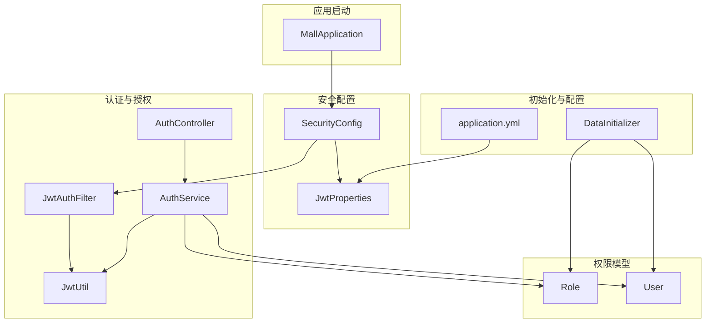
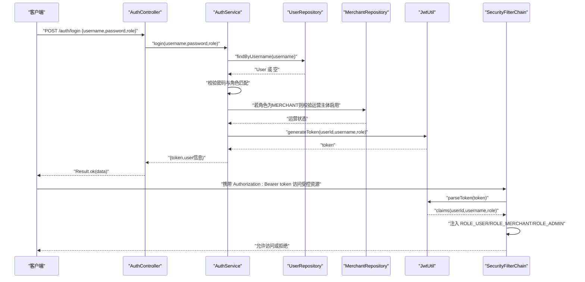
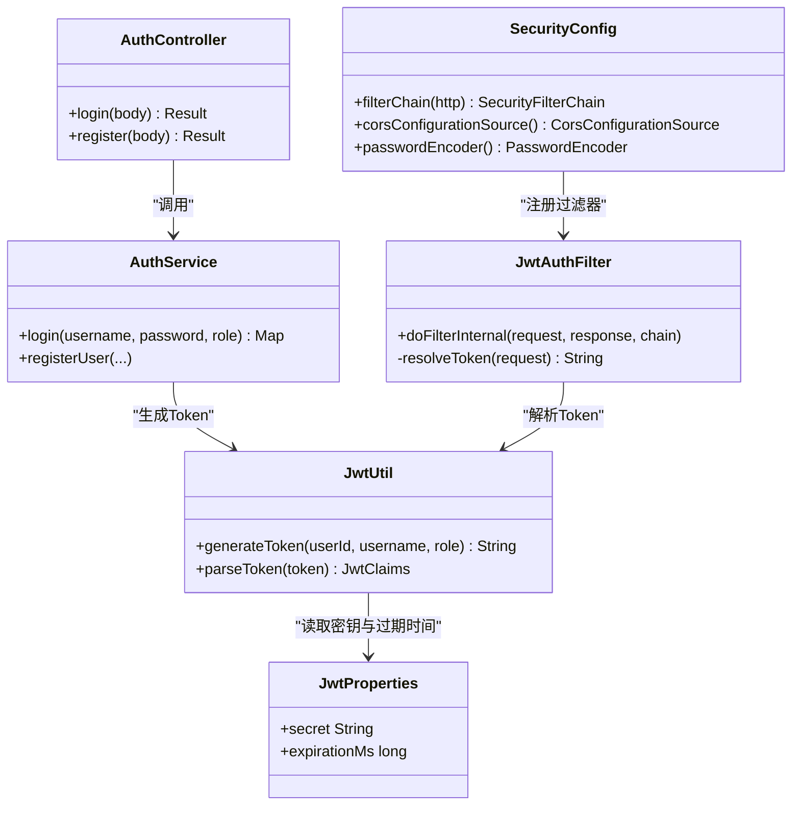
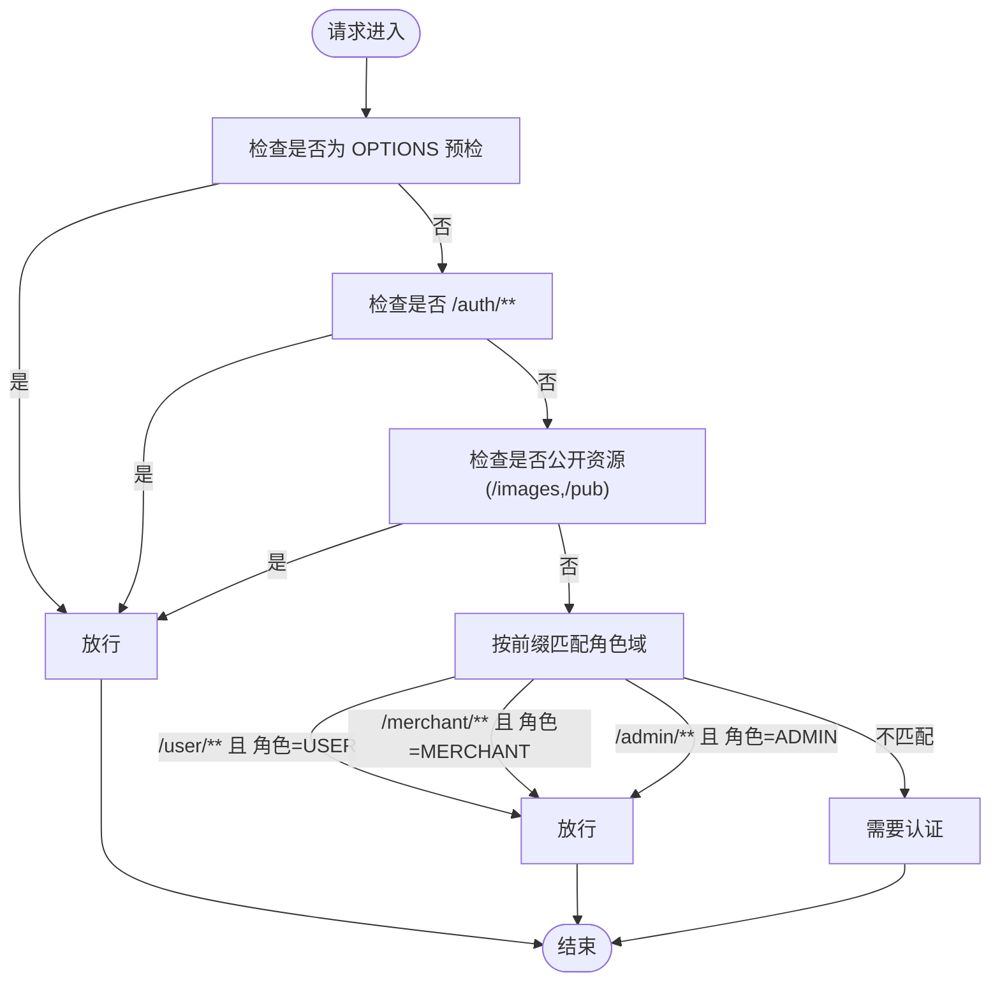
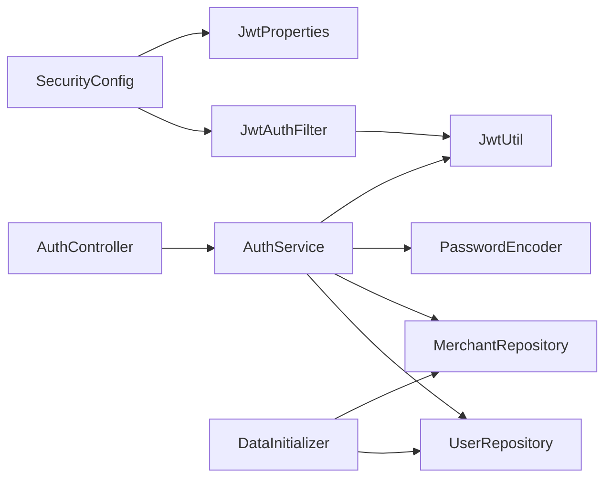

# 安全与权限控制

<cite>
**本文引用的文件**
- [MallApplication.java](file://backend/src/main/java/com/mall/MallApplication.java)
- [SecurityConfig.java](file://backend/src/main/java/com/mall/config/SecurityConfig.java)
- [JwtProperties.java](file://backend/src/main/java/com/mall/config/JwtProperties.java)
- [JwtUtil.java](file://backend/src/main/java/com/mall/security/JwtUtil.java)
- [JwtAuthFilter.java](file://backend/src/main/java/com/mall/security/JwtAuthFilter.java)
- [Role.java](file://backend/src/main/java/com/mall/common/Role.java)
- [AuthController.java](file://backend/src/main/java/com/mall/controller/AuthController.java)
- [AuthService.java](file://backend/src/main/java/com/mall/service/AuthService.java)
- [application.yml](file://backend/src/main/resources/application.yml)
- [AdminUserController.java](file://backend/src/main/java/com/mall/controller/admin/AdminUserController.java)
- [MerchantProductController.java](file://backend/src/main/java/com/mall/controller/merchant/MerchantProductController.java)
- [UserProfileController.java](file://backend/src/main/java/com/mall/controller/user/UserProfileController.java)
- [User.java](file://backend/src/main/java/com/mall/entity/User.java)
- [DataInitializer.java](file://backend/src/main/java/com/mall/config/DataInitializer.java)
- [Result.java](file://backend/src/main/java/com/mall/dto/Result.java)
- [GlobalExceptionHandler.java](file://backend/src/main/java/com/mall/exception/GlobalExceptionHandler.java)
</cite>

## 目录
1. [引言](#引言)
2. [项目结构](#项目结构)
3. [核心组件](#核心组件)
4. [架构总览](#架构总览)
5. [详细组件分析](#详细组件分析)
6. [依赖分析](#依赖分析)
7. [性能考虑](#性能考虑)
8. [故障排查指南](#故障排查指南)
9. [结论](#结论)
10. [附录](#附录)

## 引言
本文件面向电商商城系统的安全与权限控制，围绕基于 JWT 的多角色认证机制进行系统化梳理，覆盖 Token 生成、解析与验证、刷新策略建议、Spring Security 配置策略、角色权限设计与资源访问控制、密码加密策略（BCrypt）、CORS 与 CSRF 防护、不同角色（ADMIN、MERCHANT、USER）的权限范围与访问规则，并给出安全漏洞防范、最佳实践、安全审计与监控方案，以及安全配置示例与常见问题解决方案。

## 项目结构
后端采用 Spring Boot 架构，安全相关代码集中在以下模块：
- 配置层：SecurityConfig（Web 安全策略）、JwtProperties（JWT 参数）
- 安全过滤与工具：JwtAuthFilter（请求拦截与认证注入）、JwtUtil（Token 生成与解析）
- 控制器与服务：AuthController（登录/注册入口）、AuthService（登录鉴权与签发 Token）
- 权限模型：Role（角色枚举）、User（用户实体含角色字段）
- 初始化数据：DataInitializer（内置管理员、运营、普通用户）
- 响应封装：Result（统一返回体）

图表来源
- [MallApplication.java:1-13](file://backend/src/main/java/com/mall/MallApplication.java#L1-L13)
- [SecurityConfig.java:22-74](file://backend/src/main/java/com/mall/config/SecurityConfig.java#L22-L74)
- [JwtProperties.java:9-18](file://backend/src/main/java/com/mall/config/JwtProperties.java#L9-L18)
- [JwtAuthFilter.java:18-57](file://backend/src/main/java/com/mall/security/JwtAuthFilter.java#L18-L57)
- [JwtUtil.java:12-48](file://backend/src/main/java/com/mall/security/JwtUtil.java#L12-L48)
- [AuthService.java:17-92](file://backend/src/main/java/com/mall/service/AuthService.java#L17-L92)
- [AuthController.java:11-73](file://backend/src/main/java/com/mall/controller/AuthController.java#L11-L73)
- [Role.java:3-8](file://backend/src/main/java/com/mall/common/Role.java#L3-L8)
- [User.java:17-88](file://backend/src/main/java/com/mall/entity/User.java#L17-L88)
- [DataInitializer.java:14-95](file://backend/src/main/java/com/mall/config/DataInitializer.java#L14-L95)
- [application.yml:27-31](file://backend/src/main/resources/application.yml#L27-L31)

章节来源
- [MallApplication.java:1-13](file://backend/src/main/java/com/mall/MallApplication.java#L1-L13)
- [SecurityConfig.java:22-74](file://backend/src/main/java/com/mall/config/SecurityConfig.java#L22-L74)
- [application.yml:1-36](file://backend/src/main/resources/application.yml#L1-L36)

## 核心组件
- 角色枚举 Role：定义 ADMIN、MERCHANT、USER 三类角色。
- 用户实体 User：包含用户名、密码、昵称、性别、邮箱、电话、头像、角色、运营绑定 merchantId、启用状态等字段。
- 安全配置 SecurityConfig：开启方法级安全，禁用 CSRF，设置 Session 为无状态，配置 CORS，定义 URL 路由到角色的授权规则，并在过滤链中加入 JWT 过滤器。
- JWT 属性 JwtProperties：集中管理密钥与过期时间。
- JWT 工具 JwtUtil：使用对称密钥生成与解析 Token，封装 claims。
- JWT 过滤器 JwtAuthFilter：从 Authorization 请求头解析 Bearer Token，解析出用户身份与角色，注入到 Spring Security 上下文。
- 认证服务 AuthService：登录校验（用户名、密码、角色匹配、运营主体启用状态），签发 JWT；注册时密码加密存储。
- 认证控制器 AuthController：提供登录与注册接口。
- 初始化 DataInitializer：创建内置管理员、运营与普通用户账户，密码经 BCrypt 加密。
- 统一响应 Result：封装业务返回码、消息与数据。
- 全局异常 GlobalExceptionHandler：捕获运行时异常并统一返回。

章节来源
- [Role.java:3-8](file://backend/src/main/java/com/mall/common/Role.java#L3-L8)
- [User.java:17-88](file://backend/src/main/java/com/mall/entity/User.java#L17-L88)
- [SecurityConfig.java:22-74](file://backend/src/main/java/com/mall/config/SecurityConfig.java#L22-L74)
- [JwtProperties.java:9-18](file://backend/src/main/java/com/mall/config/JwtProperties.java#L9-L18)
- [JwtUtil.java:12-48](file://backend/src/main/java/com/mall/security/JwtUtil.java#L12-L48)
- [JwtAuthFilter.java:18-57](file://backend/src/main/java/com/mall/security/JwtAuthFilter.java#L18-L57)
- [AuthService.java:17-92](file://backend/src/main/java/com/mall/service/AuthService.java#L17-L92)
- [AuthController.java:11-73](file://backend/src/main/java/com/mall/controller/AuthController.java#L11-L73)
- [DataInitializer.java:14-95](file://backend/src/main/java/com/mall/config/DataInitializer.java#L14-L95)
- [Result.java:10-24](file://backend/src/main/java/com/mall/dto/Result.java#L10-L24)
- [GlobalExceptionHandler.java:10-18](file://backend/src/main/java/com/mall/exception/GlobalExceptionHandler.java#L10-L18)

## 架构总览
系统采用无状态认证（JWT + 无 Session），通过自定义过滤器在进入业务逻辑前完成身份解析与授权注入。路由层面以“路径前缀”划分角色域，结合方法级安全注解实现细粒度控制。

图表来源
- [AuthController.java:18-35](file://backend/src/main/java/com/mall/controller/AuthController.java#L18-L35)
- [AuthService.java:28-59](file://backend/src/main/java/com/mall/service/AuthService.java#L28-L59)
- [JwtUtil.java:23-44](file://backend/src/main/java/com/mall/security/JwtUtil.java#L23-L44)
- [SecurityConfig.java:34-55](file://backend/src/main/java/com/mall/config/SecurityConfig.java#L34-L55)

## 详细组件分析

### JWT 多角色认证机制
- Token 生成：JwtUtil 使用对称密钥与过期时间生成签名 Token，载荷包含 userId、username、role。
- Token 解析：JwtAuthFilter 从请求头提取 Bearer Token，调用 JwtUtil 解析并注入 Authentication 到 SecurityContext。
- 登录流程：AuthController 接收用户名、密码、角色参数，AuthService 校验用户状态、密码、角色一致性与运营主体启用状态，最终签发 Token 并返回用户信息。
- 角色注入：JwtAuthFilter 将角色转换为 ROLE_* 权威，供授权规则使用。

图表来源
- [JwtUtil.java:12-48](file://backend/src/main/java/com/mall/security/JwtUtil.java#L12-L48)
- [JwtAuthFilter.java:18-57](file://backend/src/main/java/com/mall/security/JwtAuthFilter.java#L18-L57)
- [AuthController.java:11-73](file://backend/src/main/java/com/mall/controller/AuthController.java#L11-L73)
- [AuthService.java:17-92](file://backend/src/main/java/com/mall/service/AuthService.java#L17-L92)
- [SecurityConfig.java:22-74](file://backend/src/main/java/com/mall/config/SecurityConfig.java#L22-L74)
- [JwtProperties.java:9-18](file://backend/src/main/java/com/mall/config/JwtProperties.java#L9-L18)

章节来源
- [JwtUtil.java:12-48](file://backend/src/main/java/com/mall/security/JwtUtil.java#L12-L48)
- [JwtAuthFilter.java:18-57](file://backend/src/main/java/com/mall/security/JwtAuthFilter.java#L18-L57)
- [AuthController.java:18-35](file://backend/src/main/java/com/mall/controller/AuthController.java#L18-L35)
- [AuthService.java:28-59](file://backend/src/main/java/com/mall/service/AuthService.java#L28-L59)
- [SecurityConfig.java:34-55](file://backend/src/main/java/com/mall/config/SecurityConfig.java#L34-L55)
- [JwtProperties.java:15-17](file://backend/src/main/java/com/mall/config/JwtProperties.java#L15-L17)

### Spring Security 配置策略
- CSRF 关闭：REST API 采用无状态认证，禁用 CSRF。
- Session 无状态：设置为 STATELESS，避免会话劫持与服务器端状态膨胀。
- CORS 配置：允许指定前端地址与常用方法，支持凭证传递。
- 路由授权：
  - 明确放行：OPTIONS、/auth/**、公开图片与公开接口。
  - 角色域：/user/** 仅 USER，/merchant/** 仅 MERCHANT，/admin/** 仅 ADMIN。
  - 其他请求均需认证。
- 密码编码：使用 BCryptPasswordEncoder。

图表来源
- [SecurityConfig.java:34-55](file://backend/src/main/java/com/mall/config/SecurityConfig.java#L34-L55)

章节来源
- [SecurityConfig.java:34-74](file://backend/src/main/java/com/mall/config/SecurityConfig.java#L34-L74)

### 角色权限设计与资源访问控制
- 角色枚举 Role：ADMIN、MERCHANT、USER。
- 用户实体 User：包含 role 字段与 merchantId（仅运营角色有效）。
- 授权规则：
  - ADMIN：后台管理域，可访问 /admin/**。
  - MERCHANT：运营域，可访问 /merchant/**，控制器内部进一步校验当前用户所属运营主体。
  - USER：用户域，可访问 /user/**。
- 方法级安全：SecurityConfig 启用了方法级安全注解，可在具体业务方法上使用注解细化权限（例如 @PreAuthorize）。

章节来源
- [Role.java:3-8](file://backend/src/main/java/com/mall/common/Role.java#L3-L8)
- [User.java:56-65](file://backend/src/main/java/com/mall/entity/User.java#L56-L65)
- [SecurityConfig.java:24](file://backend/src/main/java/com/mall/config/SecurityConfig.java#L24)
- [SecurityConfig.java:48-50](file://backend/src/main/java/com/mall/config/SecurityConfig.java#L48-L50)

### 密码加密策略（BCrypt）
- 密码编码器：SecurityConfig 中定义 BCryptPasswordEncoder。
- 注册流程：AuthService.registerUser 对明文密码进行编码后保存。
- 登录流程：AuthService.login 使用 matches 校验密码与数据库存储的编码值。

章节来源
- [SecurityConfig.java:69-72](file://backend/src/main/java/com/mall/config/SecurityConfig.java#L69-L72)
- [AuthService.java:76-89](file://backend/src/main/java/com/mall/service/AuthService.java#L76-L89)
- [AuthService.java:34](file://backend/src/main/java/com/mall/service/AuthService.java#L34)

### CORS 与 CSRF 防护
- CORS：SecurityConfig 配置允许本地开发前端地址与常用方法，支持凭证。
- CSRF：禁用 CSRF，符合无状态 API 设计。

章节来源
- [SecurityConfig.java:57-67](file://backend/src/main/java/com/mall/config/SecurityConfig.java#L57-L67)
- [SecurityConfig.java:37](file://backend/src/main/java/com/mall/config/SecurityConfig.java#L37)

### 不同角色的权限范围与访问控制规则
- ADMIN（管理员）
  - 路由：/admin/**
  - 示例：AdminUserController 提供用户查询、创建、更新、删除等管理功能。
- MERCHANT（运营）
  - 路由：/merchant/**
  - 示例：MerchantProductController 内部通过 Authentication 获取当前用户，再从 User 实体读取 merchantId，确保只能操作本运营主体的商品。
- USER（普通用户）
  - 路由：/user/**
  - 示例：UserProfileController 获取与更新当前登录用户资料。

章节来源
- [AdminUserController.java:17-81](file://backend/src/main/java/com/mall/controller/admin/AdminUserController.java#L17-L81)
- [MerchantProductController.java:18-180](file://backend/src/main/java/com/mall/controller/merchant/MerchantProductController.java#L18-L180)
- [UserProfileController.java:12-41](file://backend/src/main/java/com/mall/controller/user/UserProfileController.java#L12-L41)
- [SecurityConfig.java:48-50](file://backend/src/main/java/com/mall/config/SecurityConfig.java#L48-L50)

### 安全漏洞防范与最佳实践
- 传输安全：生产环境务必启用 HTTPS，防止中间人攻击与 Token 泄露。
- 密钥管理：JWT 密钥应足够长（建议≥256bit），定期轮换，严格保密，避免硬编码在代码中。
- Token 过期与刷新：当前未实现刷新接口，建议引入短期访问 Token 与长期刷新 Token 的双 Token 机制，并在服务端记录刷新 Token 的黑名单/白名单。
- 输入校验与参数化：控制器与服务层已做基本校验，建议补充更严格的参数校验与 SQL 注入防护（已使用 JPA Repository，默认具备一定防护）。
- 最小权限原则：路由授权与业务内校验双重保障，避免越权访问。
- 日志与审计：记录登录、登出、敏感操作日志，保留 Token 签发与解析轨迹，便于审计与追踪。
- 速率限制与防护：建议引入限流与防暴力破解策略（如登录失败次数限制）。

### 安全审计与监控方案
- 认证审计：记录登录时间、IP、角色、Token 签发与失效事件。
- 操作审计：记录关键业务操作（增删改查）与变更前后数据。
- 监控指标：登录成功率、异常登录次数、Token 解析失败率、慢查询与超时。
- 告警机制：触发阈值（如短时间内大量失败）立即告警并阻断。

### 安全配置示例与常见问题
- JWT 配置示例（application.yml）
  - secret：至少 256bit 的强密钥。
  - expiration-ms：根据业务设定（当前默认 24h）。
- 常见问题与解决
  - 登录失败：检查用户名是否存在、密码是否正确、角色是否匹配、运营主体是否启用。
  - 403/401：确认请求头 Authorization 是否为 Bearer Token，Token 是否过期或被篡改。
  - 跨域失败：确认前端地址与方法是否在 CORS 白名单中，是否允许凭证。
  - 越权访问：检查控制器内是否对 merchantId 进行了业务级校验。

章节来源
- [application.yml:27-31](file://backend/src/main/resources/application.yml#L27-L31)
- [AuthService.java:30-47](file://backend/src/main/java/com/mall/service/AuthService.java#L30-L47)
- [MerchantProductController.java:29-34](file://backend/src/main/java/com/mall/controller/merchant/MerchantProductController.java#L29-L34)

## 依赖分析
- 组件耦合
  - SecurityConfig 依赖 JwtAuthFilter 与 JwtProperties。
  - JwtAuthFilter 依赖 JwtUtil。
  - AuthService 依赖 UserRepository、MerchantRepository、PasswordEncoder、JwtUtil。
  - AuthController 依赖 AuthService。
  - DataInitializer 依赖 UserRepository、MerchantRepository、CategoryRepository、ProductRepository、NewsRepository、PasswordEncoder。
- 外部依赖
  - Spring Security（WebSecurity、方法级安全、密码编码器）。
  - Java JWT（io.jsonwebtoken）用于 Token 生成与解析。
  - MySQL/Hibernate（JPA）持久化。

图表来源
- [SecurityConfig.java:27-31](file://backend/src/main/java/com/mall/config/SecurityConfig.java#L27-L31)
- [JwtAuthFilter.java:24-28](file://backend/src/main/java/com/mall/security/JwtAuthFilter.java#L24-L28)
- [JwtUtil.java:15-21](file://backend/src/main/java/com/mall/security/JwtUtil.java#L15-L21)
- [AuthController.java:16](file://backend/src/main/java/com/mall/controller/AuthController.java#L16)
- [AuthService.java:22-25](file://backend/src/main/java/com/mall/service/AuthService.java#L22-L25)
- [DataInitializer.java:18-23](file://backend/src/main/java/com/mall/config/DataInitializer.java#L18-L23)

章节来源
- [SecurityConfig.java:22-74](file://backend/src/main/java/com/mall/config/SecurityConfig.java#L22-L74)
- [JwtAuthFilter.java:18-57](file://backend/src/main/java/com/mall/security/JwtAuthFilter.java#L18-L57)
- [JwtUtil.java:12-48](file://backend/src/main/java/com/mall/security/JwtUtil.java#L12-L48)
- [AuthController.java:11-73](file://backend/src/main/java/com/mall/controller/AuthController.java#L11-L73)
- [AuthService.java:17-92](file://backend/src/main/java/com/mall/service/AuthService.java#L17-L92)
- [DataInitializer.java:14-95](file://backend/src/main/java/com/mall/config/DataInitializer.java#L14-L95)

## 性能考虑
- 无状态认证降低服务器端会话开销，适合水平扩展。
- JWT 解析为 CPU 密集型操作，建议：
  - 使用高性能密钥与硬件加速（如 AES-NI）。
  - 缓存近期频繁使用的用户角色信息（谨慎使用，避免缓存穿透）。
  - 控制 Token 过期时间，平衡安全性与重试成本。
- 数据库访问：
  - UserRepository.findByUsername 与 MerchantRepository.findById 应建立索引，避免慢查询。
  - 批量初始化数据仅在首次启动执行，避免重复 IO。

## 故障排查指南
- 登录失败
  - 检查用户名是否存在、密码是否匹配、角色是否一致、运营主体是否启用。
  - 参考：[AuthService.java:28-59](file://backend/src/main/java/com/mall/service/AuthService.java#L28-L59)
- Token 无效
  - 确认 Authorization 头格式为 Bearer token，密钥一致，未过期。
  - 参考：[JwtAuthFilter.java:30-47](file://backend/src/main/java/com/mall/security/JwtAuthFilter.java#L30-L47)，[JwtUtil.java:23-44](file://backend/src/main/java/com/mall/security/JwtUtil.java#L23-L44)
- 跨域问题
  - 确认前端地址与方法在 CORS 白名单，允许凭证。
  - 参考：[SecurityConfig.java:57-67](file://backend/src/main/java/com/mall/config/SecurityConfig.java#L57-L67)
- 越权访问
  - 检查控制器内是否对 merchantId 进行业务校验。
  - 参考：[MerchantProductController.java:29-34](file://backend/src/main/java/com/mall/controller/merchant/MerchantProductController.java#L29-L34)
- 统一异常处理
  - 运行时异常会被全局处理器转换为业务失败响应。
  - 参考：[GlobalExceptionHandler.java:10-18](file://backend/src/main/java/com/mall/exception/GlobalExceptionHandler.java#L10-L18)

章节来源
- [AuthService.java:28-59](file://backend/src/main/java/com/mall/service/AuthService.java#L28-L59)
- [JwtAuthFilter.java:30-47](file://backend/src/main/java/com/mall/security/JwtAuthFilter.java#L30-L47)
- [JwtUtil.java:23-44](file://backend/src/main/java/com/mall/security/JwtUtil.java#L23-L44)
- [SecurityConfig.java:57-67](file://backend/src/main/java/com/mall/config/SecurityConfig.java#L57-L67)
- [MerchantProductController.java:29-34](file://backend/src/main/java/com/mall/controller/merchant/MerchantProductController.java#L29-L34)
- [GlobalExceptionHandler.java:10-18](file://backend/src/main/java/com/mall/exception/GlobalExceptionHandler.java#L10-L18)

## 结论
本系统采用 JWT 无状态认证与 Spring Security 路由授权相结合的方式，实现了 ADMIN、MERCHANT、USER 三层角色的清晰隔离。通过 BCrypt 密码加密、CORS 与 CSRF 防护、业务内运营主体校验等措施，构建了较为完善的安全体系。建议后续补充 Token 刷新机制、强化密钥管理与审计监控，并持续优化性能与可用性。

## 附录
- 内置账户（初始化）
  - 管理员：admin / admin123
  - 运营：merchant / merchant123
  - 普通用户：user / user123
  - 参考：[DataInitializer.java:30-61](file://backend/src/main/java/com/mall/config/DataInitializer.java#L30-L61)

章节来源
- [DataInitializer.java:30-61](file://backend/src/main/java/com/mall/config/DataInitializer.java#L30-L61)