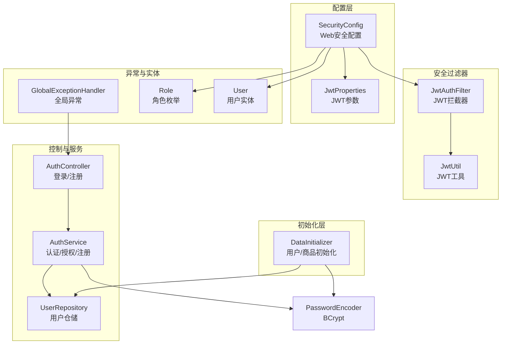
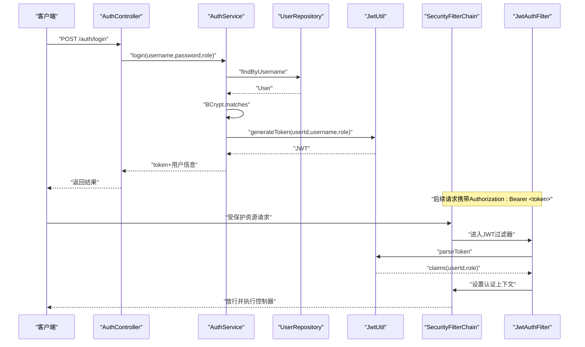
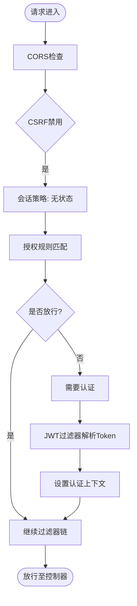
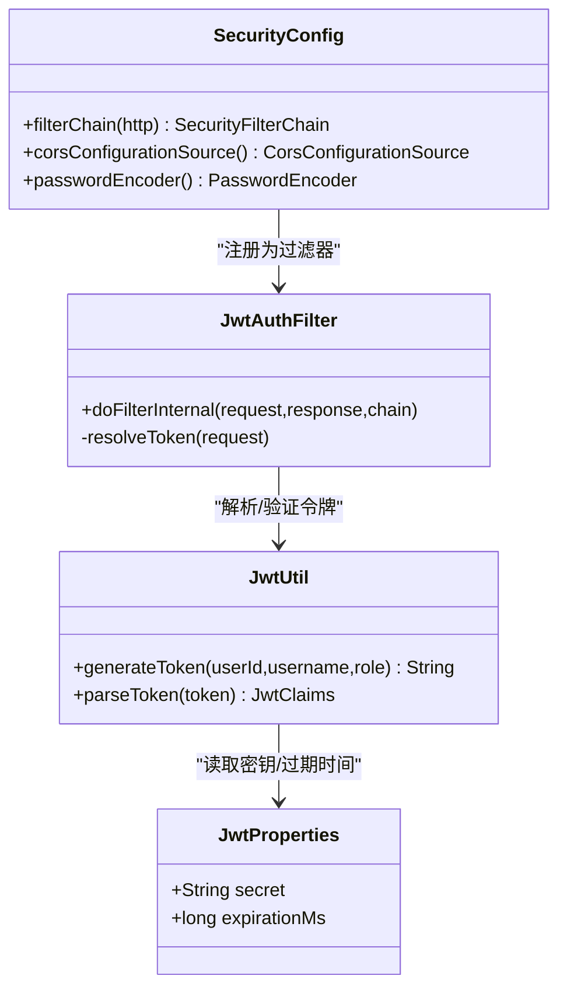
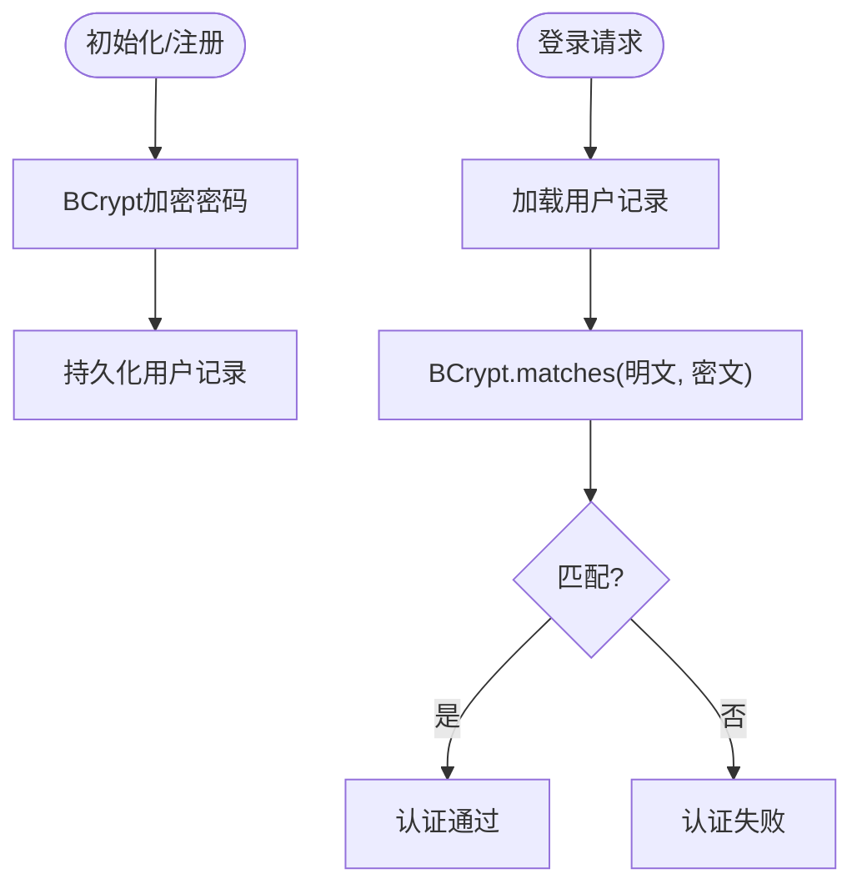
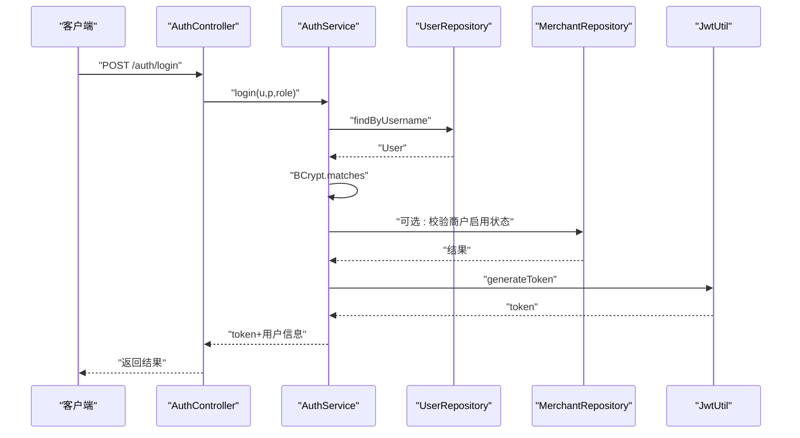
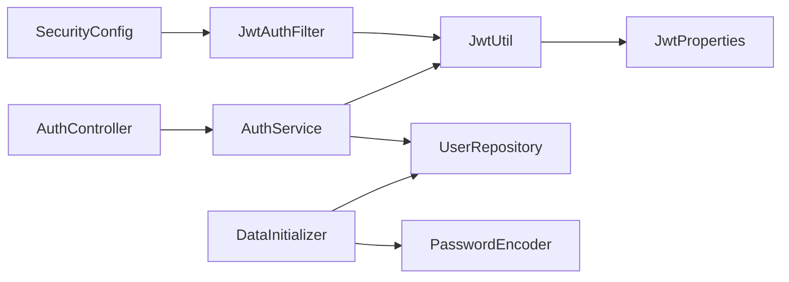

# 安全配置策略

<cite>
**本文引用的文件**
- [SecurityConfig.java](file://backend/src/main/java/com/mall/config/SecurityConfig.java)
- [JwtAuthFilter.java](file://backend/src/main/java/com/mall/security/JwtAuthFilter.java)
- [JwtUtil.java](file://backend/src/main/java/com/mall/security/JwtUtil.java)
- [JwtProperties.java](file://backend/src/main/java/com/mall/config/JwtProperties.java)
- [DataInitializer.java](file://backend/src/main/java/com/mall/config/DataInitializer.java)
- [application.yml](file://backend/src/main/resources/application.yml)
- [AuthService.java](file://backend/src/main/java/com/mall/service/AuthService.java)
- [AuthController.java](file://backend/src/main/java/com/mall/controller/AuthController.java)
- [UserRepository.java](file://backend/src/main/java/com/mall/repository/UserRepository.java)
- [GlobalExceptionHandler.java](file://backend/src/main/java/com/mall/exception/GlobalExceptionHandler.java)
- [Role.java](file://backend/src/main/java/com/mall/common/Role.java)
- [User.java](file://backend/src/main/java/com/mall/entity/User.java)
</cite>

## 目录
1. [引言](#引言)
2. [项目结构](#项目结构)
3. [核心组件](#核心组件)
4. [架构总览](#架构总览)
5. [详细组件分析](#详细组件分析)
6. [依赖分析](#依赖分析)
7. [性能考虑](#性能考虑)
8. [故障排查指南](#故障排查指南)
9. [结论](#结论)
10. [附录](#附录)

## 引言
本文件面向系统安全配置策略，围绕后端Spring Security与JWT认证体系进行深入解析。重点覆盖以下主题：
- HTTP安全配置与访问控制策略
- CORS跨域资源共享设置
- CSRF防护策略（本项目中禁用）
- 密码加密策略（BCryptPasswordEncoder）
- 用户数据初始化流程
- 会话管理（无状态）
- 安全头建议（X-Frame-Options、X-Content-Type-Options等）
- SSL/TLS配置建议
- 安全审计与异常处理机制
- 生产环境安全最佳实践与常见漏洞防范
- 安全配置调试与监控方法

## 项目结构
后端安全相关代码主要分布在以下模块：
- 配置层：SecurityConfig（Web安全）、JwtProperties（JWT参数）
- 安全过滤器：JwtAuthFilter（拦截器链注入）、JwtUtil（令牌生成与解析）
- 初始化层：DataInitializer（系统初始用户与商品数据）
- 控制层：AuthController（登录/注册接口）
- 服务层：AuthService（登录鉴权与注册逻辑）
- 数据层：UserRepository（用户查询）
- 异常层：GlobalExceptionHandler（全局异常转业务响应）

**图表来源**
- [SecurityConfig.java:33-55](file://backend/src/main/java/com/mall/config/SecurityConfig.java#L33-L55)
- [JwtAuthFilter.java:18-57](file://backend/src/main/java/com/mall/security/JwtAuthFilter.java#L18-L57)
- [JwtUtil.java:12-48](file://backend/src/main/java/com/mall/security/JwtUtil.java#L12-L48)
- [JwtProperties.java:9-17](file://backend/src/main/java/com/mall/config/JwtProperties.java#L9-L17)
- [DataInitializer.java:14-95](file://backend/src/main/java/com/mall/config/DataInitializer.java#L14-L95)
- [AuthController.java:11-73](file://backend/src/main/java/com/mall/controller/AuthController.java#L11-L73)
- [AuthService.java:17-92](file://backend/src/main/java/com/mall/service/AuthService.java#L17-L92)
- [UserRepository.java:10-20](file://backend/src/main/java/com/mall/repository/UserRepository.java#L10-L20)
- [GlobalExceptionHandler.java:7-20](file://backend/src/main/java/com/mall/exception/GlobalExceptionHandler.java#L7-L20)
- [Role.java:3-7](file://backend/src/main/java/com/mall/common/Role.java#L3-L7)
- [User.java:10-88](file://backend/src/main/java/com/mall/entity/User.java#L10-L88)

**章节来源**
- [SecurityConfig.java:22-73](file://backend/src/main/java/com/mall/config/SecurityConfig.java#L22-L73)
- [application.yml:1-36](file://backend/src/main/resources/application.yml#L1-L36)

## 核心组件
- Web安全配置（SecurityConfig）
  - 启用Web安全与方法级安全注解
  - 关闭CSRF（无状态JWT）
  - 会话策略设为STATELESS
  - CORS允许本地开发源，支持凭证
  - 路由级权限控制：公开路径、按角色访问控制
  - 在用户名密码过滤器之前添加JWT过滤器
- JWT认证链路（JwtAuthFilter + JwtUtil + JwtProperties）
  - 从请求头提取Bearer Token
  - 解析并校验签名，构建认证上下文
  - 将用户角色映射为权限
- 密码加密策略（BCryptPasswordEncoder）
  - 注入PasswordEncoder Bean
  - 初始化与注册均使用BCrypt加密
- 用户数据初始化（DataInitializer）
  - 创建管理员、运营、普通用户
  - 使用BCrypt对初始密码加密
- 登录/注册流程（AuthController + AuthService）
  - 登录：校验用户状态、密码匹配、角色一致性、运营主体有效性，签发JWT
  - 注册：用户名唯一性校验，BCrypt加密后保存

**章节来源**
- [SecurityConfig.java:33-73](file://backend/src/main/java/com/mall/config/SecurityConfig.java#L33-L73)
- [JwtAuthFilter.java:30-47](file://backend/src/main/java/com/mall/security/JwtAuthFilter.java#L30-L47)
- [JwtUtil.java:23-46](file://backend/src/main/java/com/mall/security/JwtUtil.java#L23-L46)
- [JwtProperties.java:13-17](file://backend/src/main/java/com/mall/config/JwtProperties.java#L13-L17)
- [DataInitializer.java:23-95](file://backend/src/main/java/com/mall/config/DataInitializer.java#L23-L95)
- [AuthService.java:27-90](file://backend/src/main/java/com/mall/service/AuthService.java#L27-L90)
- [AuthController.java:18-71](file://backend/src/main/java/com/mall/controller/AuthController.java#L18-L71)

## 架构总览
下图展示从客户端到后端的认证与授权流程，以及安全配置在整体中的位置。

**图表来源**
- [AuthController.java:18-35](file://backend/src/main/java/com/mall/controller/AuthController.java#L18-L35)
- [AuthService.java:27-59](file://backend/src/main/java/com/mall/service/AuthService.java#L27-L59)
- [UserRepository.java:12-14](file://backend/src/main/java/com/mall/repository/UserRepository.java#L12-L14)
- [JwtUtil.java:23-46](file://backend/src/main/java/com/mall/security/JwtUtil.java#L23-L46)
- [JwtAuthFilter.java:30-47](file://backend/src/main/java/com/mall/security/JwtAuthFilter.java#L30-L47)
- [SecurityConfig.java:34-54](file://backend/src/main/java/com/mall/config/SecurityConfig.java#L34-L54)

## 详细组件分析

### Web安全配置（SecurityConfig）
- CORS配置
  - 允许本地开发源（localhost:8081）
  - 支持常用HTTP方法与通配符头
  - 允许携带凭证（Cookie/Authorization）
- CSRF禁用
  - 基于JWT的无状态认证无需CSRF保护
- 会话策略
  - STATELESS：不创建会话，降低状态耦合
- 授权规则
  - OPTIONS预检放行
  - /auth/** 全部放行（登录/注册）
  - 图片资源路径放行
  - 公共接口放行
  - /user/** 仅USER角色
  - /merchant/** 仅MERCHANT角色
  - /admin/** 仅ADMIN角色
  - 其他请求必须认证
- 过滤器链
  - 在用户名密码过滤器前插入JWT过滤器，实现无状态认证

**图表来源**
- [SecurityConfig.java:34-54](file://backend/src/main/java/com/mall/config/SecurityConfig.java#L34-L54)
- [SecurityConfig.java:57-67](file://backend/src/main/java/com/mall/config/SecurityConfig.java#L57-L67)

**章节来源**
- [SecurityConfig.java:33-73](file://backend/src/main/java/com/mall/config/SecurityConfig.java#L33-L73)

### JWT认证链路（JwtAuthFilter + JwtUtil + JwtProperties）
- 请求头解析
  - 从Authorization头读取Bearer Token
- 令牌解析
  - 使用对称密钥验证签名并解析载荷
  - 提取用户ID、用户名、角色
- 权限映射
  - 将角色字符串映射为ROLE_前缀权限
- 认证上下文
  - 设置UsernamePasswordAuthenticationToken到SecurityContext
- JWT参数
  - 密钥与过期时间通过配置类注入

**图表来源**
- [JwtAuthFilter.java:18-57](file://backend/src/main/java/com/mall/security/JwtAuthFilter.java#L18-L57)
- [JwtUtil.java:12-48](file://backend/src/main/java/com/mall/security/JwtUtil.java#L12-L48)
- [JwtProperties.java:9-17](file://backend/src/main/java/com/mall/config/JwtProperties.java#L9-L17)
- [SecurityConfig.java:27-31](file://backend/src/main/java/com/mall/config/SecurityConfig.java#L27-L31)

**章节来源**
- [JwtAuthFilter.java:30-47](file://backend/src/main/java/com/mall/security/JwtAuthFilter.java#L30-L47)
- [JwtUtil.java:23-46](file://backend/src/main/java/com/mall/security/JwtUtil.java#L23-L46)
- [JwtProperties.java:13-17](file://backend/src/main/java/com/mall/config/JwtProperties.java#L13-L17)

### 密码加密策略（BCryptPasswordEncoder）
- 注入PasswordEncoder Bean
- 初始化与注册流程均使用BCrypt加密存储
- 登录时使用matches进行明文比对

**图表来源**
- [SecurityConfig.java:69-72](file://backend/src/main/java/com/mall/config/SecurityConfig.java#L69-L72)
- [DataInitializer.java:33-33](file://backend/src/main/java/com/mall/config/DataInitializer.java#L33-L33)
- [AuthService.java:78-78](file://backend/src/main/java/com/mall/service/AuthService.java#L78-L78)
- [AuthService.java:34-34](file://backend/src/main/java/com/mall/service/AuthService.java#L34-L34)

**章节来源**
- [SecurityConfig.java:69-72](file://backend/src/main/java/com/mall/config/SecurityConfig.java#L69-L72)
- [DataInitializer.java:33-33](file://backend/src/main/java/com/mall/config/DataInitializer.java#L33-L33)
- [AuthService.java:78-78](file://backend/src/main/java/com/mall/service/AuthService.java#L78-L78)
- [AuthService.java:34-34](file://backend/src/main/java/com/mall/service/AuthService.java#L34-L34)

### 用户数据初始化（DataInitializer）
- 初始用户：admin、merchant、user
- 角色与启用状态：ADMIN/MERCHANT/USER，enabled=true
- 商品分类与示例商品：用于演示与测试
- 公告初始化：系统公告

**章节来源**
- [DataInitializer.java:23-95](file://backend/src/main/java/com/mall/config/DataInitializer.java#L23-L95)

### 登录/注册流程（AuthController + AuthService）
- 登录
  - 校验用户是否存在且启用
  - BCrypt校验密码
  - 校验所选角色与用户角色一致
  - 运营账号额外校验商户主体启用状态
  - 成功后签发JWT并返回用户信息
- 注册
  - 校验用户名唯一性
  - BCrypt加密密码后保存为USER角色

**图表来源**
- [AuthController.java:18-35](file://backend/src/main/java/com/mall/controller/AuthController.java#L18-L35)
- [AuthService.java:27-59](file://backend/src/main/java/com/mall/service/AuthService.java#L27-L59)
- [UserRepository.java:12-14](file://backend/src/main/java/com/mall/repository/UserRepository.java#L12-L14)

**章节来源**
- [AuthController.java:18-71](file://backend/src/main/java/com/mall/controller/AuthController.java#L18-L71)
- [AuthService.java:27-90](file://backend/src/main/java/com/mall/service/AuthService.java#L27-L90)

### 会话管理与安全头
- 会话管理
  - 已配置为STATELESS，无会话创建
- 安全头建议
  - X-Frame-Options：DENY或SAMEORIGIN
  - X-Content-Type-Options：nosniff
  - Referrer-Policy：strict-origin-when-cross-origin
  - Content-Security-Policy：限制脚本与资源来源
  - Strict-Transport-Security：HTTPS强制（生产环境）
  - 注意：当前代码未显式设置上述头，建议通过WebMvcConfigurer或Filter统一注入

**章节来源**
- [SecurityConfig.java:38-38](file://backend/src/main/java/com/mall/config/SecurityConfig.java#L38-L38)

### SSL/TLS配置建议
- 生产环境必须启用HTTPS
- 使用强密码套件与TLS 1.2+
- 强制HSTS（Strict-Transport-Security）
- 证书轮换与吊销检查
- 反向代理（Nginx/Traefik）终止TLS并转发至应用

## 依赖分析
- 组件内聚与耦合
  - SecurityConfig集中定义Web安全策略，低耦合
  - JwtAuthFilter依赖JwtUtil，职责清晰
  - AuthService聚合仓储与加密器，遵循单一职责
- 外部依赖
  - Spring Security、Spring Data JPA、BCrypt、JWT库
- 潜在循环依赖
  - 当前结构无循环依赖风险

**图表来源**
- [SecurityConfig.java:27-31](file://backend/src/main/java/com/mall/config/SecurityConfig.java#L27-L31)
- [JwtAuthFilter.java:24-27](file://backend/src/main/java/com/mall/security/JwtAuthFilter.java#L24-L27)
- [JwtUtil.java:15-20](file://backend/src/main/java/com/mall/security/JwtUtil.java#L15-L20)
- [AuthController.java:16-16](file://backend/src/main/java/com/mall/controller/AuthController.java#L16-L16)
- [AuthService.java:22-25](file://backend/src/main/java/com/mall/service/AuthService.java#L22-L25)
- [DataInitializer.java:18-23](file://backend/src/main/java/com/mall/config/DataInitializer.java#L18-L23)

**章节来源**
- [SecurityConfig.java:22-73](file://backend/src/main/java/com/mall/config/SecurityConfig.java#L22-L73)
- [JwtAuthFilter.java:18-57](file://backend/src/main/java/com/mall/security/JwtAuthFilter.java#L18-L57)
- [JwtUtil.java:12-48](file://backend/src/main/java/com/mall/security/JwtUtil.java#L12-L48)
- [AuthService.java:17-92](file://backend/src/main/java/com/mall/service/AuthService.java#L17-L92)
- [DataInitializer.java:14-95](file://backend/src/main/java/com/mall/config/DataInitializer.java#L14-L95)

## 性能考虑
- 无状态认证减少服务器会话开销
- BCrypt成本因子默认即可，避免过度提升导致登录延迟
- JWT载荷尽量精简，避免过大Claims影响网络与解析性能
- 建议对频繁访问的公共资源开启缓存与CDN

## 故障排查指南
- 登录失败
  - 检查用户名是否存在且启用
  - 确认密码BCrypt匹配
  - 校验角色选择与用户角色一致
  - 运营账号需确认商户主体启用
- JWT无效
  - 检查Authorization头格式（Bearer Token）
  - 核对密钥与过期时间配置
  - 查看日志级别以定位解析异常
- CORS问题
  - 确认请求源在允许列表
  - 检查凭证是否允许
- 全局异常
  - 运行时异常统一转为业务失败响应，便于前端处理

**章节来源**
- [AuthService.java:30-47](file://backend/src/main/java/com/mall/service/AuthService.java#L30-L47)
- [JwtAuthFilter.java:34-44](file://backend/src/main/java/com/mall/security/JwtAuthFilter.java#L34-L44)
- [GlobalExceptionHandler.java:13-17](file://backend/src/main/java/com/mall/exception/GlobalExceptionHandler.java#L13-L17)

## 结论
本项目采用“无状态JWT + Spring Security”的安全架构，通过明确的路由授权、严格的密码加密与最小权限原则，实现了基础而稳健的认证与授权能力。建议在生产环境中补充安全头、HSTS、HTTPS与审计日志，并持续监控异常与访问模式，以进一步提升安全性与可观测性。

## 附录

### 生产环境安全配置最佳实践
- 强制HTTPS与HSTS
- 严格CORS白名单，禁止通配符
- 安全头标准化（XFO、XCTO、Referrer-Policy、CSP、HSTS）
- 最小权限与分层防御
- 审计日志与入侵检测
- 定期安全扫描与渗透测试

### 常见安全漏洞与防范
- 注入攻击（SQLi/NoSQLi）：使用ORM与参数化查询
- XSS：输入净化、输出编码、CSP
- CSRF：本项目禁用CSRF，基于JWT；若改回表单+CSRF，需启用并配置同源策略
- 权限提升：严格角色与资源授权
- 令牌泄露：缩短过期时间、支持黑名单/撤销、传输层保护

### 安全配置调试与监控
- 日志级别：提升org.springframework.security日志级别以观察认证决策
- 审计日志：记录登录、角色变更、敏感操作
- 监控指标：认证失败率、异常量、慢请求、异常IP/UA
- 测试手段：单元测试覆盖认证分支、集成测试覆盖CORS/CSRF/JWT

**章节来源**
- [application.yml:32-35](file://backend/src/main/resources/application.yml#L32-L35)