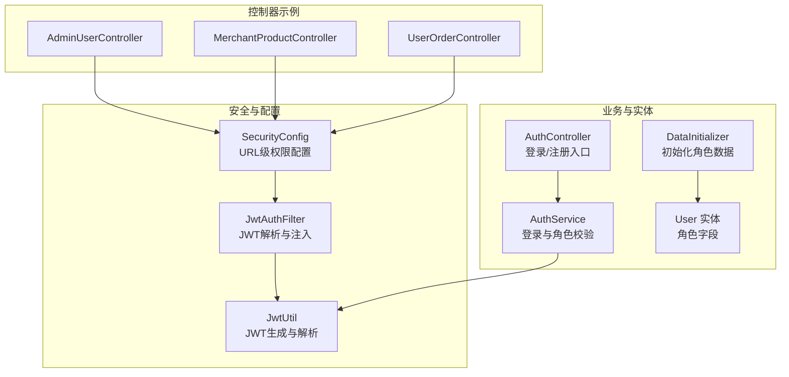
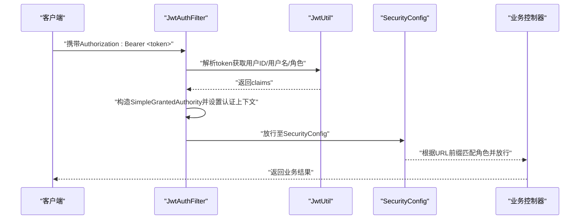
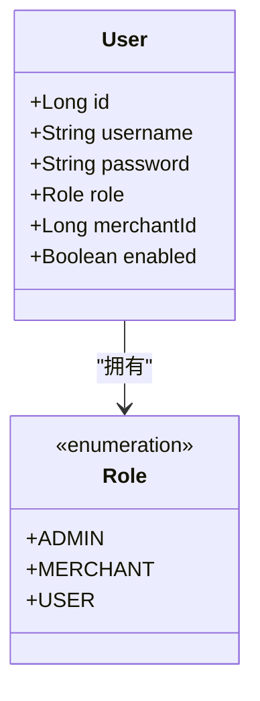
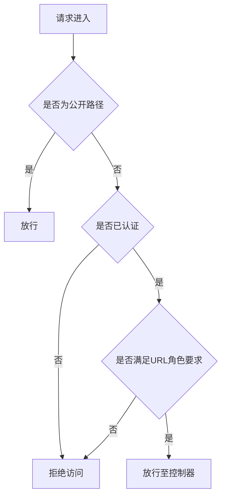
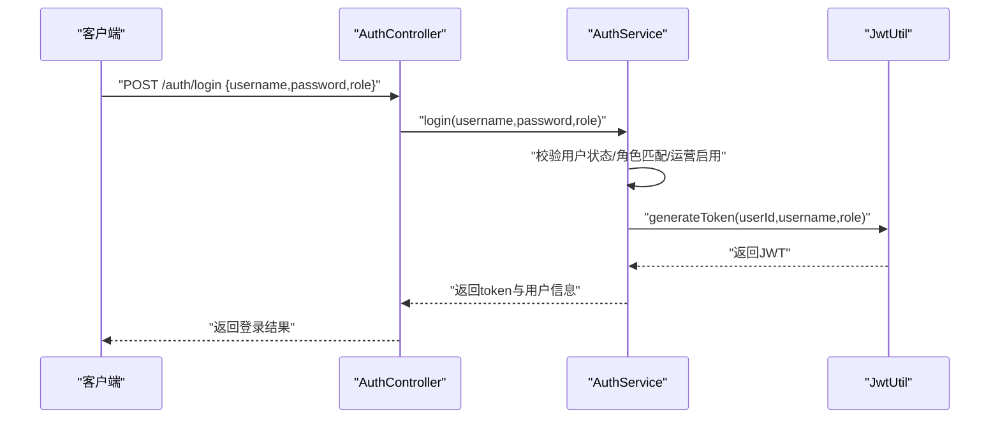
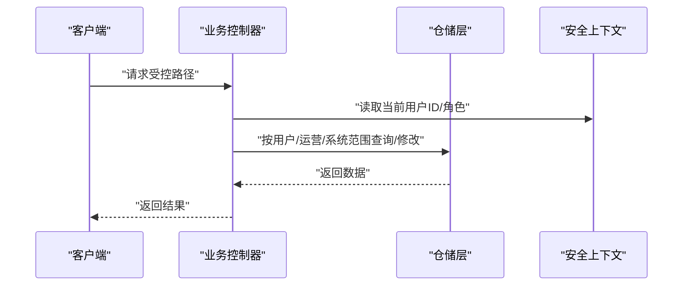
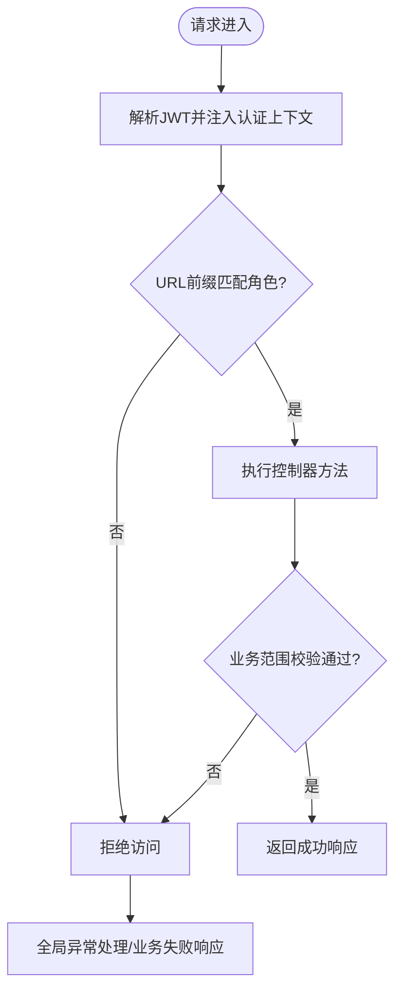
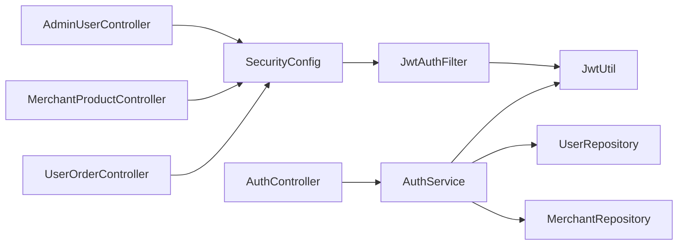

# 角色权限管理

<cite>
**本文引用的文件**
- [Role.java](file://backend/src/main/java/com/mall/common/Role.java)
- [SecurityConfig.java](file://backend/src/main/java/com/mall/config/SecurityConfig.java)
- [DataInitializer.java](file://backend/src/main/java/com/mall/config/DataInitializer.java)
- [JwtAuthFilter.java](file://backend/src/main/java/com/mall/security/JwtAuthFilter.java)
- [JwtUtil.java](file://backend/src/main/java/com/mall/security/JwtUtil.java)
- [AdminUserController.java](file://backend/src/main/java/com/mall/controller/admin/AdminUserController.java)
- [MerchantProductController.java](file://backend/src/main/java/com/mall/controller/merchant/MerchantProductController.java)
- [UserOrderController.java](file://backend/src/main/java/com/mall/controller/user/UserOrderController.java)
- [User.java](file://backend/src/main/java/com/mall/entity/User.java)
- [AuthService.java](file://backend/src/main/java/com/mall/service/AuthService.java)
- [GlobalExceptionHandler.java](file://backend/src/main/java/com/mall/exception/GlobalExceptionHandler.java)
- [AuthController.java](file://backend/src/main/java/com/mall/controller/AuthController.java)
</cite>

## 目录
1. [引言](#引言)
2. [项目结构](#项目结构)
3. [核心组件](#核心组件)
4. [架构总览](#架构总览)
5. [详细组件分析](#详细组件分析)
6. [依赖分析](#依赖分析)
7. [性能考虑](#性能考虑)
8. [故障排查指南](#故障排查指南)
9. [结论](#结论)
10. [附录](#附录)

## 引言
本文件面向角色权限管理系统，系统通过三类角色（ADMIN、MERCHANT、USER）实现分层治理与访问控制。系统采用基于路径的URL级访问控制与基于方法的注解式权限控制相结合的方式，结合JWT进行无状态认证与授权。本文将系统性阐述角色权限模型、权限配置策略、控制器方法的权限使用方式、权限验证流程、错误处理以及动态权限分配机制，并给出扩展与安全最佳实践。

## 项目结构
后端采用按功能域划分的目录组织，权限相关的关键模块集中在以下位置：
- 权限模型与实体：common/Role.java、entity/User.java
- 安全配置：config/SecurityConfig.java、security/JwtAuthFilter.java、security/JwtUtil.java
- 初始化数据：config/DataInitializer.java
- 认证与授权：service/AuthService.java、controller/AuthController.java
- 控制器权限示例：controller/admin、controller/merchant、controller/user 下的控制器
- 全局异常处理：exception/GlobalExceptionHandler.java

图表来源
- [SecurityConfig.java:34-55](file://backend/src/main/java/com/mall/config/SecurityConfig.java#L34-L55)
- [JwtAuthFilter.java:30-47](file://backend/src/main/java/com/mall/security/JwtAuthFilter.java#L30-L47)
- [JwtUtil.java:23-43](file://backend/src/main/java/com/mall/security/JwtUtil.java#L23-L43)
- [AuthService.java:28-58](file://backend/src/main/java/com/mall/service/AuthService.java#L28-L58)
- [AuthController.java:18-35](file://backend/src/main/java/com/mall/controller/AuthController.java#L18-L35)
- [User.java:56-62](file://backend/src/main/java/com/mall/entity/User.java#L56-L62)
- [DataInitializer.java:30-61](file://backend/src/main/java/com/mall/config/DataInitializer.java#L30-L61)
- [AdminUserController.java:27-78](file://backend/src/main/java/com/mall/controller/admin/AdminUserController.java#L27-L78)
- [MerchantProductController.java:36-178](file://backend/src/main/java/com/mall/controller/merchant/MerchantProductController.java#L36-L178)
- [UserOrderController.java:33-196](file://backend/src/main/java/com/mall/controller/user/UserOrderController.java#L33-L196)

章节来源
- [SecurityConfig.java:34-55](file://backend/src/main/java/com/mall/config/SecurityConfig.java#L34-L55)
- [JwtAuthFilter.java:30-47](file://backend/src/main/java/com/mall/security/JwtAuthFilter.java#L30-L47)
- [JwtUtil.java:23-43](file://backend/src/main/java/com/mall/security/JwtUtil.java#L23-L43)
- [AuthService.java:28-58](file://backend/src/main/java/com/mall/service/AuthService.java#L28-L58)
- [AuthController.java:18-35](file://backend/src/main/java/com/mall/controller/AuthController.java#L18-L35)
- [User.java:56-62](file://backend/src/main/java/com/mall/entity/User.java#L56-L62)
- [DataInitializer.java:30-61](file://backend/src/main/java/com/mall/config/DataInitializer.java#L30-L61)
- [AdminUserController.java:27-78](file://backend/src/main/java/com/mall/controller/admin/AdminUserController.java#L27-L78)
- [MerchantProductController.java:36-178](file://backend/src/main/java/com/mall/controller/merchant/MerchantProductController.java#L36-L178)
- [UserOrderController.java:33-196](file://backend/src/main/java/com/mall/controller/user/UserOrderController.java#L33-L196)

## 核心组件
- 角色枚举 Role：定义了 ADMIN、MERCHANT、USER 三类角色，作为系统权限的基础标识。
- 用户实体 User：包含角色字段与运营关联字段，用于区分不同角色与运营主体。
- 安全配置 SecurityConfig：集中定义URL级访问控制规则，将请求路径与角色进行绑定。
- JWT认证链路：JwtUtil负责令牌生成与解析；JwtAuthFilter在请求进入时解析JWT并注入认证上下文。
- 认证服务 AuthService：登录时校验用户状态、角色匹配与运营主体启用状态，签发对应角色的JWT。
- 初始化数据 DataInitializer：预置管理员、运营与普通用户，便于演示与测试。
- 控制器示例：AdminUserController、MerchantProductController、UserOrderController 展示了不同角色的业务边界与权限约束。

章节来源
- [Role.java:3-7](file://backend/src/main/java/com/mall/common/Role.java#L3-L7)
- [User.java:56-62](file://backend/src/main/java/com/mall/entity/User.java#L56-L62)
- [SecurityConfig.java:39-51](file://backend/src/main/java/com/mall/config/SecurityConfig.java#L39-L51)
- [JwtUtil.java:23-43](file://backend/src/main/java/com/mall/security/JwtUtil.java#L23-L43)
- [JwtAuthFilter.java:36-41](file://backend/src/main/java/com/mall/security/JwtAuthFilter.java#L36-L41)
- [AuthService.java:28-58](file://backend/src/main/java/com/mall/service/AuthService.java#L28-L58)
- [DataInitializer.java:30-61](file://backend/src/main/java/com/mall/config/DataInitializer.java#L30-L61)
- [AdminUserController.java:27-78](file://backend/src/main/java/com/mall/controller/admin/AdminUserController.java#L27-L78)
- [MerchantProductController.java:29-34](file://backend/src/main/java/com/mall/controller/merchant/MerchantProductController.java#L29-L34)
- [UserOrderController.java:29-31](file://backend/src/main/java/com/mall/controller/user/UserOrderController.java#L29-L31)

## 架构总览
系统采用“无状态JWT + URL级+方法级权限”的混合授权模式：
- URL级：SecurityConfig通过请求路径前缀将/admin/**、/merchant/**、/user/** 与角色绑定，未登录请求会被拦截。
- 方法级：Spring Security方法级注解（如 @PreAuthorize、@PostAuthorize）可进一步细化到具体方法的权限判断（本仓库未显式使用，但已开启@EnableMethodSecurity）。
- 认证链路：JwtAuthFilter在过滤器链中解析Authorization头中的Bearer Token，解析出用户ID、用户名与角色，注入到SecurityContext，供后续授权使用。

图表来源
- [JwtAuthFilter.java:30-47](file://backend/src/main/java/com/mall/security/JwtAuthFilter.java#L30-L47)
- [JwtUtil.java:34-43](file://backend/src/main/java/com/mall/security/JwtUtil.java#L34-L43)
- [SecurityConfig.java:39-51](file://backend/src/main/java/com/mall/config/SecurityConfig.java#L39-L51)

## 详细组件分析

### 角色与权限模型
- 角色定义：Role枚举包含 ADMIN、MERCHANT、USER 三类角色，作为系统权限的最小单位。
- 用户实体：User实体包含角色字段与运营关联字段，用于区分运营主体与普通用户。
- 角色继承与组合：系统未实现角色继承或权限组合的抽象基类，而是通过URL前缀与角色直接绑定的方式实现“角色-路径”映射。

图表来源
- [Role.java:3-7](file://backend/src/main/java/com/mall/common/Role.java#L3-L7)
- [User.java:56-62](file://backend/src/main/java/com/mall/entity/User.java#L56-L62)

章节来源
- [Role.java:3-7](file://backend/src/main/java/com/mall/common/Role.java#L3-L7)
- [User.java:56-62](file://backend/src/main/java/com/mall/entity/User.java#L56-L62)

### URL级访问控制与路径映射
- 路径与角色绑定：
  - /admin/** 仅 ADMIN 可访问
  - /merchant/** 仅 MERCHANT 可访问
  - /user/** 仅 USER 可访问
- 公开资源：
  - /auth/** 登录/注册接口无需认证
  - 图片相关 GET 接口无需认证
- 其他请求：除上述外均需认证。

图表来源
- [SecurityConfig.java:39-51](file://backend/src/main/java/com/mall/config/SecurityConfig.java#L39-L51)

章节来源
- [SecurityConfig.java:39-51](file://backend/src/main/java/com/mall/config/SecurityConfig.java#L39-L51)

### JWT认证与授权上下文注入
- JwtUtil：负责生成与解析JWT，载荷包含用户ID、用户名与角色。
- JwtAuthFilter：从Authorization头解析Bearer Token，构造SimpleGrantedAuthority（前缀为ROLE_），并将认证对象写入SecurityContext，供后续授权使用。
- 登录流程：AuthController调用AuthService进行账号状态与角色匹配校验，成功后由JwtUtil签发对应角色的JWT。

图表来源
- [AuthController.java:18-35](file://backend/src/main/java/com/mall/controller/AuthController.java#L18-L35)
- [AuthService.java:28-58](file://backend/src/main/java/com/mall/service/AuthService.java#L28-L58)
- [JwtUtil.java:23-32](file://backend/src/main/java/com/mall/security/JwtUtil.java#L23-L32)

章节来源
- [JwtAuthFilter.java:36-41](file://backend/src/main/java/com/mall/security/JwtAuthFilter.java#L36-L41)
- [JwtUtil.java:23-43](file://backend/src/main/java/com/mall/security/JwtUtil.java#L23-L43)
- [AuthService.java:28-58](file://backend/src/main/java/com/mall/service/AuthService.java#L28-L58)
- [AuthController.java:18-35](file://backend/src/main/java/com/mall/controller/AuthController.java#L18-L35)

### 控制器方法的权限边界与业务逻辑
- 管理端（/admin/**）：
  - AdminUserController 提供用户查询、创建、更新、删除等接口，体现ADMIN对系统的运维与管理能力。
- 运营端（/merchant/**）：
  - MerchantProductController 通过当前登录用户的merchantId限定业务范围，确保运营只能操作自身商品。
- 用户端（/user/**）：
  - UserOrderController 通过currentUserId限制订单查询与操作范围，保障用户只能访问自己的订单。

图表来源
- [AdminUserController.java:27-78](file://backend/src/main/java/com/mall/controller/admin/AdminUserController.java#L27-L78)
- [MerchantProductController.java:29-34](file://backend/src/main/java/com/mall/controller/merchant/MerchantProductController.java#L29-L34)
- [UserOrderController.java:29-31](file://backend/src/main/java/com/mall/controller/user/UserOrderController.java#L29-L31)

章节来源
- [AdminUserController.java:27-78](file://backend/src/main/java/com/mall/controller/admin/AdminUserController.java#L27-L78)
- [MerchantProductController.java:29-34](file://backend/src/main/java/com/mall/controller/merchant/MerchantProductController.java#L29-L34)
- [UserOrderController.java:29-31](file://backend/src/main/java/com/mall/controller/user/UserOrderController.java#L29-L31)

### 权限验证流程与错误处理
- 权限验证流程：
  - 请求到达JwtAuthFilter，解析JWT并注入认证上下文。
  - 进入SecurityConfig，按URL前缀匹配角色，若不满足则拒绝。
  - 控制器方法执行业务逻辑，必要时再次基于用户ID/merchantId进行细粒度校验。
- 错误处理：
  - 全局异常处理器将运行时异常统一包装为业务失败响应，避免前端直接暴露内部错误。
  - 登录/注册接口对必填参数进行前置校验，失败时返回明确提示。

图表来源
- [JwtAuthFilter.java:30-47](file://backend/src/main/java/com/mall/security/JwtAuthFilter.java#L30-L47)
- [SecurityConfig.java:39-51](file://backend/src/main/java/com/mall/config/SecurityConfig.java#L39-L51)
- [GlobalExceptionHandler.java:13-17](file://backend/src/main/java/com/mall/exception/GlobalExceptionHandler.java#L13-L17)

章节来源
- [GlobalExceptionHandler.java:13-17](file://backend/src/main/java/com/mall/exception/GlobalExceptionHandler.java#L13-L17)
- [AuthController.java:23-28](file://backend/src/main/java/com/mall/controller/AuthController.java#L23-L28)

### 动态权限分配机制
- 当前实现为静态路径-角色映射，未见基于数据库的动态权限表或RBAC扩展。
- 若需扩展，建议引入权限表与角色-权限映射，结合方法级注解（如 @PreAuthorize）实现更细粒度的动态授权。

## 依赖分析
- 组件耦合：
  - SecurityConfig 依赖 JwtAuthFilter；JwtAuthFilter 依赖 JwtUtil。
  - AuthService 依赖 UserRepository、MerchantRepository、JwtUtil。
  - 控制器依赖服务层与仓储层，同时受SecurityConfig的URL规则约束。
- 外部依赖：
  - Spring Security Web与Method Security；BCrypt密码编码器；JWT库。

图表来源
- [SecurityConfig.java:27-31](file://backend/src/main/java/com/mall/config/SecurityConfig.java#L27-L31)
- [JwtAuthFilter.java:24-28](file://backend/src/main/java/com/mall/security/JwtAuthFilter.java#L24-L28)
- [JwtUtil.java:18-21](file://backend/src/main/java/com/mall/security/JwtUtil.java#L18-L21)
- [AuthService.java:22-25](file://backend/src/main/java/com/mall/service/AuthService.java#L22-L25)
- [AuthController.java:16-17](file://backend/src/main/java/com/mall/controller/AuthController.java#L16-L17)
- [AdminUserController.java:23-24](file://backend/src/main/java/com/mall/controller/admin/AdminUserController.java#L23-L24)
- [MerchantProductController.java:24-26](file://backend/src/main/java/com/mall/controller/merchant/MerchantProductController.java#L24-L26)
- [UserOrderController.java:25-26](file://backend/src/main/java/com/mall/controller/user/UserOrderController.java#L25-L26)

章节来源
- [SecurityConfig.java:27-31](file://backend/src/main/java/com/mall/config/SecurityConfig.java#L27-L31)
- [JwtAuthFilter.java:24-28](file://backend/src/main/java/com/mall/security/JwtAuthFilter.java#L24-L28)
- [JwtUtil.java:18-21](file://backend/src/main/java/com/mall/security/JwtUtil.java#L18-L21)
- [AuthService.java:22-25](file://backend/src/main/java/com/mall/service/AuthService.java#L22-L25)
- [AuthController.java:16-17](file://backend/src/main/java/com/mall/controller/AuthController.java#L16-L17)
- [AdminUserController.java:23-24](file://backend/src/main/java/com/mall/controller/admin/AdminUserController.java#L23-L24)
- [MerchantProductController.java:24-26](file://backend/src/main/java/com/mall/controller/merchant/MerchantProductController.java#L24-L26)
- [UserOrderController.java:25-26](file://backend/src/main/java/com/mall/controller/user/UserOrderController.java#L25-L26)

## 性能考虑
- 无状态JWT：避免服务器端会话存储，降低横向扩展复杂度。
- 过滤器链短小精悍：仅在JWT解析与URL匹配阶段进行少量计算。
- 建议优化点：
  - 对频繁访问的公共资源（如图片）可配合CDN与缓存策略。
  - 控制器内二次校验应尽量使用索引列（如merchantId、userId）以提升查询效率。

## 故障排查指南
- 登录失败：
  - 检查用户名/密码与角色参数是否正确；确认用户状态与运营主体启用状态。
- 权限不足：
  - 确认请求路径前缀与当前登录角色一致；检查JWT是否过期或被篡改。
- 业务范围错误：
  - 运营/用户操作越权时，控制器会基于当前用户ID/merchantId进行校验并拒绝。
- 异常统一处理：
  - 运行时异常会被全局异常处理器包装为业务失败响应，便于前端展示友好提示。

章节来源
- [AuthService.java:30-47](file://backend/src/main/java/com/mall/service/AuthService.java#L30-L47)
- [MerchantProductController.java:116-122](file://backend/src/main/java/com/mall/controller/merchant/MerchantProductController.java#L116-L122)
- [UserOrderController.java:90-99](file://backend/src/main/java/com/mall/controller/user/UserOrderController.java#L90-L99)
- [GlobalExceptionHandler.java:13-17](file://backend/src/main/java/com/mall/exception/GlobalExceptionHandler.java#L13-L17)

## 结论
本系统通过简洁清晰的“角色-路径”映射与JWT无状态认证，实现了ADMIN、MERCHANT、USER三类角色的明确边界与可控访问。控制器层面进一步以用户ID/merchantId进行细粒度校验，确保业务数据隔离。未来可在现有基础上引入动态权限与方法级注解，以支持更灵活的权限模型与审计需求。

## 附录
- 角色与职责概览
  - ADMIN：系统管理与运维，访问/admin/**下的全部接口。
  - MERCHANT：运营主体，访问/merchant/**下的商品与订单相关接口，业务范围受其merchantId限制。
  - USER：普通用户，访问/user/**下的个人中心与订单相关接口，业务范围受其userId限制。
- 初始化数据
  - 系统启动时自动创建管理员、运营与用户账户，便于快速验证权限体系。

章节来源
- [DataInitializer.java:30-61](file://backend/src/main/java/com/mall/config/DataInitializer.java#L30-L61)