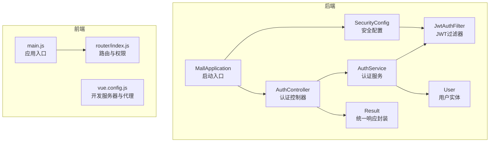
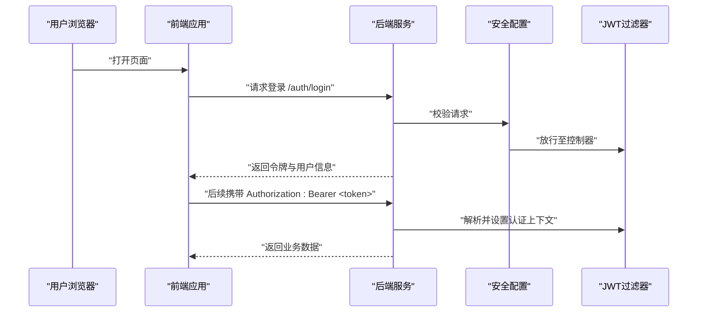
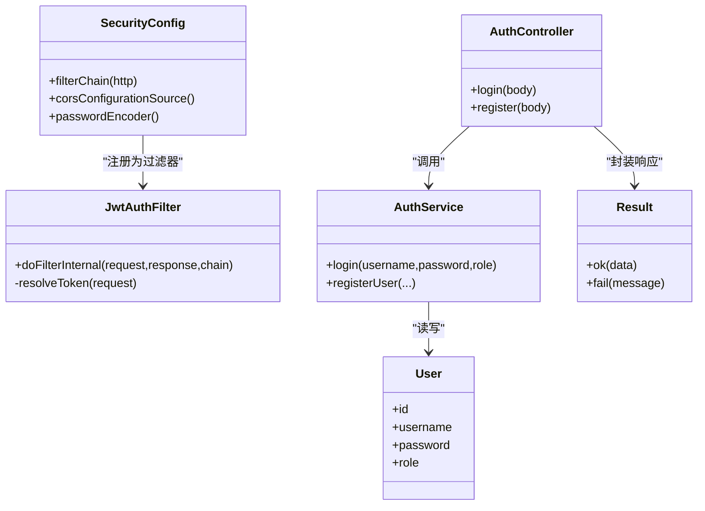
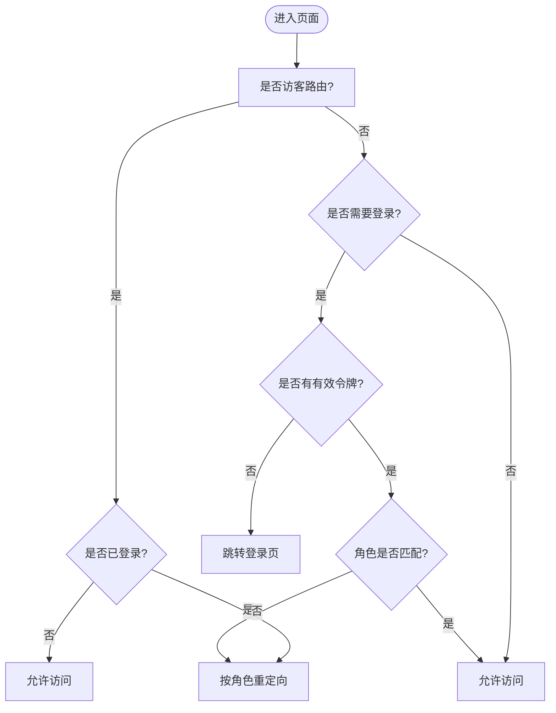
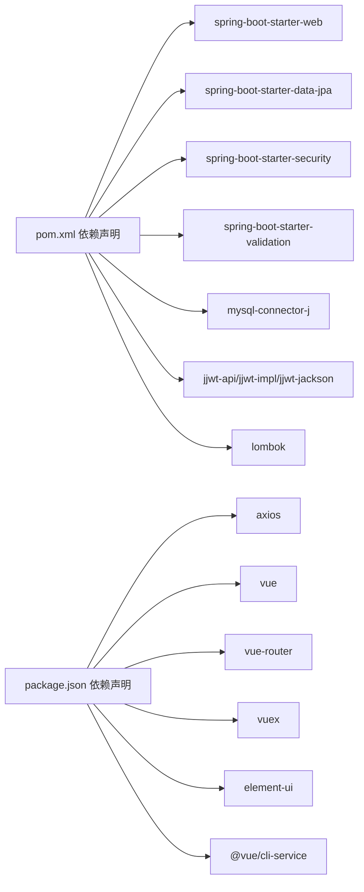

# 开发者指南

<cite>
**本文引用的文件**
- [MallApplication.java](file://backend/src/main/java/com/mall/MallApplication.java)
- [pom.xml](file://backend/pom.xml)
- [application.yml](file://backend/src/main/resources/application.yml)
- [SecurityConfig.java](file://backend/src/main/java/com/mall/config/SecurityConfig.java)
- [JwtAuthFilter.java](file://backend/src/main/java/com/mall/security/JwtAuthFilter.java)
- [Result.java](file://backend/src/main/java/com/mall/dto/Result.java)
- [User.java](file://backend/src/main/java/com/mall/entity/User.java)
- [AuthService.java](file://backend/src/main/java/com/mall/service/AuthService.java)
- [AuthController.java](file://backend/src/main/java/com/mall/controller/AuthController.java)
- [main.js](file://frontend/src/main.js)
- [index.js](file://frontend/src/router/index.js)
- [vue.config.js](file://frontend/vue.config.js)
- [package.json](file://frontend/package.json)
- [babel.config.js](file://frontend/babel.config.js)
</cite>

## 目录
1. [简介](#简介)
2. [项目结构](#项目结构)
3. [核心组件](#核心组件)
4. [架构总览](#架构总览)
5. [详细组件分析](#详细组件分析)
6. [依赖分析](#依赖分析)
7. [性能考虑](#性能考虑)
8. [故障排查指南](#故障排查指南)
9. [结论](#结论)
10. [附录](#附录)

## 简介
本指南面向新加入的开发者，帮助你快速理解并参与电商商城系统的前后端开发。内容涵盖代码规范与最佳实践、开发环境配置、IDE 设置、调试技巧、单元测试、扩展点与插件机制、代码审查清单、性能优化、安全编码规范、常见问题解决、团队协作与文档维护等。

## 项目结构
系统采用前后端分离架构：
- 后端基于 Spring Boot 3.4.1（Java 17），使用 Spring Web、JPA、Security、Validation、MySQL Connector、JWT（jjwt）以及 Lombok。
- 前端基于 Vue 2.6.14，使用 Vue Router、Vuex、Element UI，通过代理访问后端接口。

**图表来源**
- [MallApplication.java:1-13](file://backend/src/main/java/com/mall/MallApplication.java#L1-L13)
- [SecurityConfig.java:1-74](file://backend/src/main/java/com/mall/config/SecurityConfig.java#L1-L74)
- [JwtAuthFilter.java:1-57](file://backend/src/main/java/com/mall/security/JwtAuthFilter.java#L1-L57)
- [AuthController.java:1-73](file://backend/src/main/java/com/mall/controller/AuthController.java#L1-L73)
- [AuthService.java:1-92](file://backend/src/main/java/com/mall/service/AuthService.java#L1-L92)
- [Result.java:1-24](file://backend/src/main/java/com/mall/dto/Result.java#L1-L24)
- [User.java:1-88](file://backend/src/main/java/com/mall/entity/User.java#L1-L88)
- [main.js:1-20](file://frontend/src/main.js#L1-L20)
- [index.js:1-208](file://frontend/src/router/index.js#L1-L208)
- [vue.config.js:1-20](file://frontend/vue.config.js#L1-L20)

**章节来源**
- [MallApplication.java:1-13](file://backend/src/main/java/com/mall/MallApplication.java#L1-L13)
- [pom.xml:1-107](file://backend/pom.xml#L1-L107)
- [application.yml:1-36](file://backend/src/main/resources/application.yml#L1-L36)
- [main.js:1-20](file://frontend/src/main.js#L1-L20)
- [index.js:1-208](file://frontend/src/router/index.js#L1-L208)
- [vue.config.js:1-20](file://frontend/vue.config.js#L1-L20)

## 核心组件
- 应用启动与依赖
  - 后端启动入口位于 [MallApplication.java:1-13](file://backend/src/main/java/com/mall/MallApplication.java#L1-L13)，使用 Spring Boot 自动装配。
  - 依赖管理与构建在 [pom.xml:1-107](file://backend/pom.xml#L1-L107) 中定义，包含 Web、JPA、Security、Validation、MySQL Connector、JWT 与 Lombok。
  - 运行参数与数据库、JPA、JWT、日志等配置在 [application.yml:1-36](file://backend/src/main/resources/application.yml#L1-L36) 中集中管理。
- 安全与认证
  - 安全策略与 CORS 在 [SecurityConfig.java:1-74](file://backend/src/main/java/com/mall/config/SecurityConfig.java#L1-L74) 中配置，开启无状态会话，放行公开路径，对受保护路径按角色授权。
  - JWT 过滤器在 [JwtAuthFilter.java:1-57](file://backend/src/main/java/com/mall/security/JwtAuthFilter.java#L1-L57) 中解析 Authorization 头中的 Bearer Token，解析失败则忽略。
  - 认证控制器 [AuthController.java:1-73](file://backend/src/main/java/com/mall/controller/AuthController.java#L1-L73) 提供登录与注册接口；认证服务 [AuthService.java:1-92](file://backend/src/main/java/com/mall/service/AuthService.java#L1-L92) 执行登录校验、角色匹配、商户状态检查与 JWT 签发。
- 统一响应
  - 统一响应封装 [Result.java:1-24](file://backend/src/main/java/com/mall/dto/Result.java#L1-L24) 规范了后端返回格式，便于前端统一处理。
- 前端入口与路由
  - 前端入口 [main.js:1-20](file://frontend/src/main.js#L1-L20) 引入 Element UI、主题样式与全局挂载。
  - 路由与权限控制在 [index.js:1-208](file://frontend/src/router/index.js#L1-L208) 中实现，按角色分发到用户、管理员、商户布局。
  - 开发服务器代理在 [vue.config.js:1-20](file://frontend/vue.config.js#L1-L20) 中配置，将 /api、/pub、/images 代理到后端 8080 端口。

**章节来源**
- [MallApplication.java:1-13](file://backend/src/main/java/com/mall/MallApplication.java#L1-L13)
- [pom.xml:1-107](file://backend/pom.xml#L1-L107)
- [application.yml:1-36](file://backend/src/main/resources/application.yml#L1-L36)
- [SecurityConfig.java:1-74](file://backend/src/main/java/com/mall/config/SecurityConfig.java#L1-L74)
- [JwtAuthFilter.java:1-57](file://backend/src/main/java/com/mall/security/JwtAuthFilter.java#L1-L57)
- [AuthController.java:1-73](file://backend/src/main/java/com/mall/controller/AuthController.java#L1-L73)
- [AuthService.java:1-92](file://backend/src/main/java/com/mall/service/AuthService.java#L1-L92)
- [Result.java:1-24](file://backend/src/main/java/com/mall/dto/Result.java#L1-L24)
- [main.js:1-20](file://frontend/src/main.js#L1-L20)
- [index.js:1-208](file://frontend/src/router/index.js#L1-L208)
- [vue.config.js:1-20](file://frontend/vue.config.js#L1-L20)

## 架构总览
系统采用“前端路由 + 后端无状态认证”的典型电商架构。前端通过代理访问后端 REST 接口，后端通过 JWT 实现跨域无状态鉴权，按角色限制访问路径。

**图表来源**
- [AuthController.java:1-73](file://backend/src/main/java/com/mall/controller/AuthController.java#L1-L73)
- [SecurityConfig.java:1-74](file://backend/src/main/java/com/mall/config/SecurityConfig.java#L1-L74)
- [JwtAuthFilter.java:1-57](file://backend/src/main/java/com/mall/security/JwtAuthFilter.java#L1-L57)

## 详细组件分析

### 安全与认证组件
- 安全配置
  - 放行公开路径：图片读取与公开接口。
  - 受保护路径：/user/**（USER）、/merchant/**（MERCHANT）、/admin/**（ADMIN）。
  - 无状态会话：SessionCreationPolicy.STATELESS。
  - CORS：允许本地前端 8081 端口访问。
- JWT 过滤器
  - 解析 Authorization 头，提取 Bearer Token。
  - 解析失败则忽略，保证非认证接口可用。
- 认证服务
  - 登录：校验用户状态、密码、角色匹配、商户启用状态，签发 JWT 并返回用户信息。
  - 注册：校验用户名唯一性，加密密码后保存为普通用户。

**图表来源**
- [SecurityConfig.java:1-74](file://backend/src/main/java/com/mall/config/SecurityConfig.java#L1-L74)
- [JwtAuthFilter.java:1-57](file://backend/src/main/java/com/mall/security/JwtAuthFilter.java#L1-L57)
- [AuthController.java:1-73](file://backend/src/main/java/com/mall/controller/AuthController.java#L1-L73)
- [AuthService.java:1-92](file://backend/src/main/java/com/mall/service/AuthService.java#L1-L92)
- [Result.java:1-24](file://backend/src/main/java/com/mall/dto/Result.java#L1-L24)
- [User.java:1-88](file://backend/src/main/java/com/mall/entity/User.java#L1-L88)

**章节来源**
- [SecurityConfig.java:1-74](file://backend/src/main/java/com/mall/config/SecurityConfig.java#L1-L74)
- [JwtAuthFilter.java:1-57](file://backend/src/main/java/com/mall/security/JwtAuthFilter.java#L1-L57)
- [AuthService.java:1-92](file://backend/src/main/java/com/mall/service/AuthService.java#L1-L92)
- [AuthController.java:1-73](file://backend/src/main/java/com/mall/controller/AuthController.java#L1-L73)
- [Result.java:1-24](file://backend/src/main/java/com/mall/dto/Result.java#L1-L24)
- [User.java:1-88](file://backend/src/main/java/com/mall/entity/User.java#L1-L88)

### 前端路由与权限
- 路由分层：用户、管理员、商户三类布局，子路由覆盖商品、订单、收藏、新闻等场景。
- 权限守卫：未登录跳转登录页；已登录根据角色重定向至对应后台；访客路由仅对未登录开放。
- 开发代理：将 /api、/pub、/images 代理到后端 8080 端口，避免跨域。

**图表来源**
- [index.js:1-208](file://frontend/src/router/index.js#L1-L208)
- [vue.config.js:1-20](file://frontend/vue.config.js#L1-L20)

**章节来源**
- [index.js:1-208](file://frontend/src/router/index.js#L1-L208)
- [vue.config.js:1-20](file://frontend/vue.config.js#L1-L20)

## 依赖分析
- 后端依赖
  - Web、JPA、Security、Validation：提供 MVC、ORM、安全与校验能力。
  - MySQL Connector：连接 MySQL 数据库。
  - jjwt：生成与解析 JWT。
  - Lombok：减少样板代码。
- 前端依赖
  - axios：HTTP 客户端。
  - vue、vue-router、vuex：框架与状态管理。
  - element-ui：UI 组件库。
  - @vue/cli-service：开发与构建工具链。

**图表来源**
- [pom.xml:1-107](file://backend/pom.xml#L1-L107)
- [package.json:1-24](file://frontend/package.json#L1-L24)

**章节来源**
- [pom.xml:1-107](file://backend/pom.xml#L1-L107)
- [package.json:1-24](file://frontend/package.json#L1-L24)

## 性能考虑
- 无状态认证：JWT 无状态设计降低会话存储开销，但需注意令牌大小与过期策略。
- 数据库连接：合理配置连接池与超时，避免长事务与 N+1 查询。
- 前端缓存：利用浏览器缓存静态资源，减少重复请求。
- 日志级别：生产环境适当降低日志级别，避免 IO 抖动。
- 分页与懒加载：列表页使用分页或虚拟滚动，减轻前端渲染压力。
- CDN 与压缩：静态资源走 CDN，开启 Gzip/Brotli 压缩。

## 故障排查指南
- 登录失败
  - 检查用户名/密码与角色是否正确，确认用户启用状态与商户启用状态。
  - 查看后端日志中认证异常信息与密码编码匹配逻辑。
- 跨域问题
  - 确认前端代理配置与后端 CORS 允许的源一致。
  - 检查浏览器 Network 面板中预检请求（OPTIONS）是否通过。
- 图片上传/访问
  - 确认静态资源目录与映射路径配置，检查上传接口权限是否放行。
- JWT 无效
  - 检查 Authorization 头格式是否为 Bearer Token，密钥与过期时间是否正确。
- 前端路由跳转异常
  - 检查 localStorage 中用户信息与角色，确认路由守卫逻辑与重定向分支。

**章节来源**
- [SecurityConfig.java:1-74](file://backend/src/main/java/com/mall/config/SecurityConfig.java#L1-L74)
- [JwtAuthFilter.java:1-57](file://backend/src/main/java/com/mall/security/JwtAuthFilter.java#L1-L57)
- [AuthController.java:1-73](file://backend/src/main/java/com/mall/controller/AuthController.java#L1-L73)
- [index.js:1-208](file://frontend/src/router/index.js#L1-L208)
- [vue.config.js:1-20](file://frontend/vue.config.js#L1-L20)

## 结论
本指南提供了从环境搭建到日常开发、测试、部署与维护的完整路径。建议团队在开发过程中严格遵循本文的规范与流程，持续进行代码审查与性能优化，确保系统稳定、可扩展、易维护。

## 附录

### 代码规范与最佳实践
- 命名约定
  - 包名：小写 com.mall
  - 类名：帕斯卡命名，如 UserController
  - 方法/字段：驼峰命名，如 getUserById
  - 常量：全大写下划线，如 MAX_RETRY
- 代码结构
  - 控制器：仅处理请求与响应封装，不包含业务逻辑
  - 服务：封装业务规则与流程
  - 实体：仅包含数据与简单生命周期回调
  - DTO：用于接口间传输的数据对象
- 注释规范
  - 公共 API 使用简明注释说明用途、参数与返回值
  - 复杂逻辑补充算法思路与边界条件说明
- Git 工作流
  - 分支策略：主干发布，功能开发在 feature/*，修复在 hotfix/*
  - 提交信息：类型: 内容（如 feat: 新增用户注册接口）
  - 合并与审核：Pull Request + 代码审查 + CI 通过

### 开发环境配置
- 后端
  - JDK 17，Maven 3.6+
  - MySQL 5.7+/8.0，初始化 mall 数据库
  - 修改 [application.yml:5-8](file://backend/src/main/resources/application.yml#L5-L8) 中数据库连接信息
  - 运行 [MallApplication.java:1-13](file://backend/src/main/java/com/mall/MallApplication.java#L1-L13) 启动服务
- 前端
  - Node.js 16+，npm 8+
  - 安装依赖：npm install
  - 启动开发服务器：npm run serve（默认 8081）
  - 代理配置见 [vue.config.js:1-20](file://frontend/vue.config.js#L1-L20)

**章节来源**
- [application.yml:1-36](file://backend/src/main/resources/application.yml#L1-L36)
- [MallApplication.java:1-13](file://backend/src/main/java/com/mall/MallApplication.java#L1-L13)
- [vue.config.js:1-20](file://frontend/vue.config.js#L1-L20)

### IDE 设置与调试技巧
- 后端
  - 使用 IntelliJ IDEA 或 VS Code，启用 Lombok 插件
  - 运行配置：Main Class 为 MallApplication，VM Options 可设置日志级别
  - 断点调试：在控制器、服务与过滤器关键节点设置断点
- 前端
  - VS Code 安装 Vue 插件，启用 ESLint 与 Prettier
  - 使用 Vue Devtools 调试组件与状态
  - 代理调试：观察 Network 面板中 /api、/pub、/images 请求

### 单元测试编写
- 后端
  - 使用 Spring Boot Test 与 MockMvc 测试控制器
  - 使用 @MockBean 模拟 Repository 与 Service
  - 覆盖正常与异常分支，如登录失败、权限不足
- 前端
  - 使用 Jest + Vue Test Utils 编写组件与路由守卫测试
  - 模拟 localStorage 与路由状态，验证重定向逻辑

### 扩展点与插件机制
- 新增功能模块步骤
  1) 设计实体与 Repository（如 BannerRepository）
  2) 编写 Service 层业务逻辑（如 BannerService）
  3) 创建 Controller 并在 [SecurityConfig.java:1-74](file://backend/src/main/java/com/mall/config/SecurityConfig.java#L1-L74) 中配置访问权限
  4) 前端新增路由与视图组件，必要时更新 [index.js:1-208](file://frontend/src/router/index.js#L1-L208)
  5) 如涉及静态资源，调整 [application.yml:20-21](file://backend/src/main/resources/application.yml#L20-L21) 的静态映射
- 插件化建议
  - 将可配置项集中于配置文件（如 application.yml）
  - 对外暴露的接口尽量幂等与可回滚
  - 使用事件总线或消息队列解耦异步任务

**章节来源**
- [SecurityConfig.java:1-74](file://backend/src/main/java/com/mall/config/SecurityConfig.java#L1-L74)
- [index.js:1-208](file://frontend/src/router/index.js#L1-L208)
- [application.yml:1-36](file://backend/src/main/resources/application.yml#L1-L36)

### 代码审查清单
- 功能正确性：输入校验、边界条件、异常处理
- 安全性：密码加密、JWT 密钥管理、CORS 配置、敏感信息脱敏
- 性能：查询优化、分页、缓存策略
- 可维护性：命名一致性、注释清晰、模块职责单一
- 兼容性：版本升级与依赖兼容、跨域与代理配置

### 安全编码规范
- 密码处理：使用 BCrypt 编码，禁止明文存储
- 令牌安全：JWT 密钥长度足够，设置合理过期时间，HTTPS 传输
- 输入校验：后端 DTO 参数校验，防止 SQL 注入与 XSS
- 权限控制：细粒度角色控制，避免硬编码权限判断
- 日志安全：避免记录敏感信息，生产环境降低日志级别

### 团队协作与文档维护
- 文档同步：需求、设计、接口文档与代码保持同步
- 版本管理：语义化版本，变更日志清晰
- 代码评审：强制 PR 审查，保留评审意见与结论
- 知识沉淀：常见问题与解决方案形成 Wiki，新成员入职手册