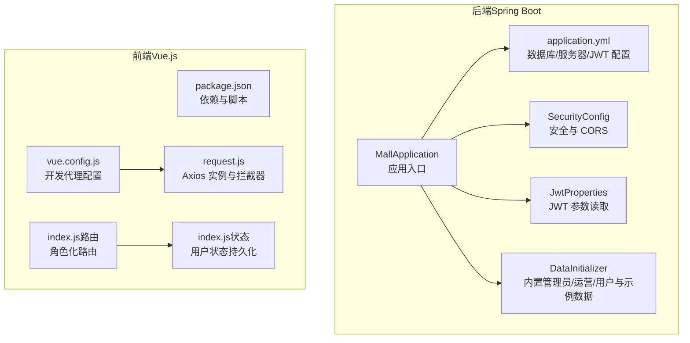
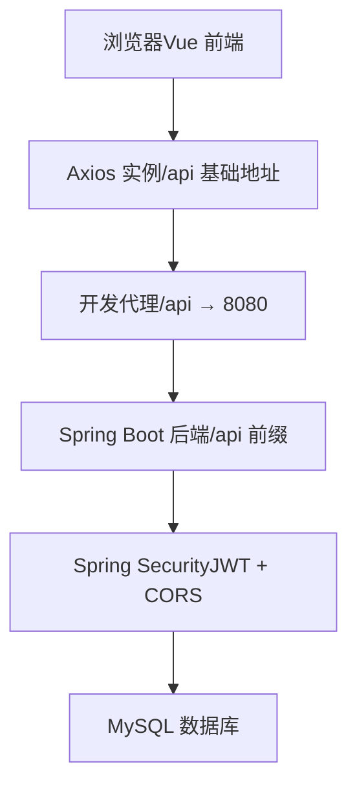
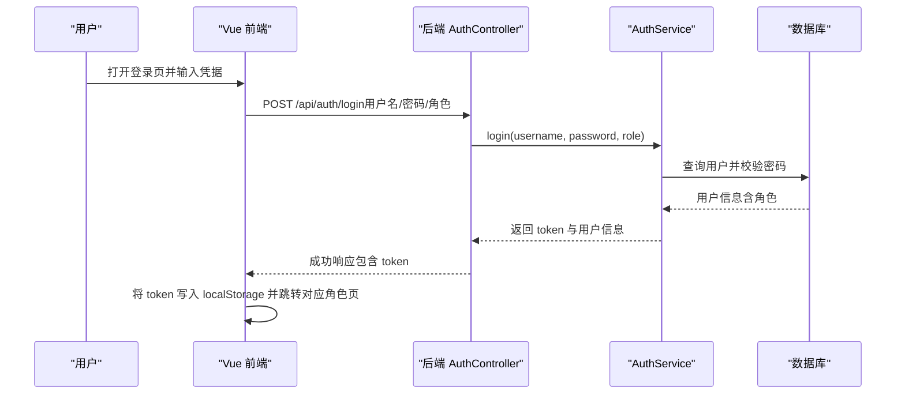
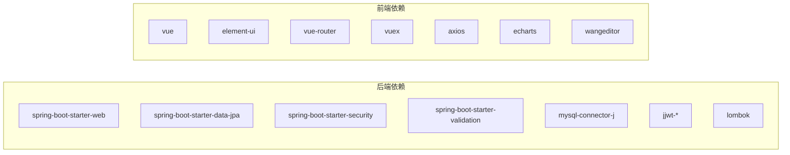

# 快速开始

<cite>
**本文引用的文件**
- [application.yml](file://backend/src/main/resources/application.yml)
- [pom.xml](file://backend/pom.xml)
- [MallApplication.java](file://backend/src/main/java/com/mall/MallApplication.java)
- [JwtProperties.java](file://backend/src/main/java/com/mall/config/JwtProperties.java)
- [SecurityConfig.java](file://backend/src/main/java/com/mall/config/SecurityConfig.java)
- [DataInitializer.java](file://backend/src/main/java/com/mall/config/DataInitializer.java)
- [AuthController.java](file://backend/src/main/java/com/mall/controller/AuthController.java)
- [User.java](file://backend/src/main/java/com/mall/entity/User.java)
- [Role.java](file://backend/src/main/java/com/mall/common/Role.java)
- [banner.sql](file://backend/src/main/resources/banner.sql)
- [package.json](file://frontend/package.json)
- [vue.config.js](file://frontend/vue.config.js)
- [request.js](file://frontend/src/api/request.js)
- [index.js（前端路由）](file://frontend/src/router/index.js)
- [index.js（前端状态管理）](file://frontend/src/store/index.js)
</cite>

## 目录
1. [简介](#简介)
2. [项目结构](#项目结构)
3. [核心组件](#核心组件)
4. [架构总览](#架构总览)
5. [详细组件分析](#详细组件分析)
6. [依赖分析](#依赖分析)
7. [性能考虑](#性能考虑)
8. [故障排查指南](#故障排查指南)
9. [结论](#结论)
10. [附录](#附录)

## 简介
本指南面向新加入的开发者，帮助你在约 30 分钟内完成电商商城系统的本地环境搭建与首次运行。你将学会：
- 搭建 Java 开发环境（含 JDK 17）、MySQL 数据库与 Node.js 环境
- 启动后端 Spring Boot 项目与前端 Vue.js 项目
- 初始化数据库与内置数据
- 配置 JWT 参数
- 测试关键 API 端点
- 常见问题与调试技巧

## 项目结构
该仓库包含前后端两个子项目：
- 后端：基于 Spring Boot 3.4.1，使用 JPA/Hibernate、MySQL Connector、Spring Security、JWT
- 前端：基于 Vue 2.6.14，使用 Element UI、Vuex、Vue Router，通过代理访问后端接口

图表来源
- [MallApplication.java:1-13](file://backend/src/main/java/com/mall/MallApplication.java#L1-L13)
- [application.yml:1-36](file://backend/src/main/resources/application.yml#L1-L36)
- [SecurityConfig.java:1-74](file://backend/src/main/java/com/mall/config/SecurityConfig.java#L1-L74)
- [JwtProperties.java:1-18](file://backend/src/main/java/com/mall/config/JwtProperties.java#L1-L18)
- [DataInitializer.java:1-95](file://backend/src/main/java/com/mall/config/DataInitializer.java#L1-L95)
- [package.json:1-24](file://frontend/package.json#L1-L24)
- [vue.config.js:1-20](file://frontend/vue.config.js#L1-L20)
- [request.js:1-38](file://frontend/src/api/request.js#L1-L38)
- [index.js（前端路由）:1-208](file://frontend/src/router/index.js#L1-L208)
- [index.js（前端状态管理）:1-31](file://frontend/src/store/index.js#L1-L31)

章节来源
- [MallApplication.java:1-13](file://backend/src/main/java/com/mall/MallApplication.java#L1-L13)
- [application.yml:1-36](file://backend/src/main/resources/application.yml#L1-L36)
- [package.json:1-24](file://frontend/package.json#L1-L24)

## 核心组件
- 应用入口与打包：后端通过 Spring Boot 启动类运行；前端通过 @vue/cli 提供开发与构建脚本
- 安全与认证：Spring Security + JWT，支持跨域、无状态会话、角色级路径控制
- 数据层：JPA/Hibernate 自动建模，DDL 自动更新
- 前端代理：开发时将 /api、/pub、/images 代理到后端 8080 端口
- 内置数据：启动时自动创建管理员、运营、普通用户及示例商品、分类、公告

章节来源
- [MallApplication.java:1-13](file://backend/src/main/java/com/mall/MallApplication.java#L1-L13)
- [SecurityConfig.java:1-74](file://backend/src/main/java/com/mall/config/SecurityConfig.java#L1-L74)
- [JwtProperties.java:1-18](file://backend/src/main/java/com/mall/config/JwtProperties.java#L1-L18)
- [DataInitializer.java:1-95](file://backend/src/main/java/com/mall/config/DataInitializer.java#L1-L95)
- [vue.config.js:1-20](file://frontend/vue.config.js#L1-L20)

## 架构总览
系统采用前后端分离架构，前端通过 Axios 访问后端 REST 接口，后端提供统一的 /api 前缀。JWT 用于鉴权，CORS 允许前端本地开发域名访问。

图表来源
- [request.js:1-38](file://frontend/src/api/request.js#L1-L38)
- [vue.config.js:1-20](file://frontend/vue.config.js#L1-L20)
- [SecurityConfig.java:1-74](file://backend/src/main/java/com/mall/config/SecurityConfig.java#L1-L74)
- [application.yml:1-36](file://backend/src/main/resources/application.yml#L1-L36)

## 详细组件分析

### 后端启动与配置
- Java 与 Maven：后端使用 Java 17，Spring Boot 3.4.1，依赖 MySQL Connector、Spring Security、JWT 等
- 数据库连接：默认连接本地 MySQL，数据库名、用户名、密码在配置文件中定义
- 服务器端口与上下文：后端监听 8080 端口，请求前缀为 /api
- JWT 参数：密钥与过期时间在配置文件中定义，可通过属性对象读取
- 安全策略：禁用 CSRF，无状态会话；对公开资源放行，对受保护资源按角色授权
- 数据初始化：首次启动自动创建管理员、运营、用户与示例数据

章节来源
- [pom.xml:1-107](file://backend/pom.xml#L1-L107)
- [application.yml:1-36](file://backend/src/main/resources/application.yml#L1-L36)
- [JwtProperties.java:1-18](file://backend/src/main/java/com/mall/config/JwtProperties.java#L1-L18)
- [SecurityConfig.java:1-74](file://backend/src/main/java/com/mall/config/SecurityConfig.java#L1-L74)
- [DataInitializer.java:1-95](file://backend/src/main/java/com/mall/config/DataInitializer.java#L1-L95)

### 前端运行与代理
- 本地开发端口：8081
- 代理规则：将 /api、/pub、/images 请求转发至后端 8080
- Axios 实例：统一基础地址与超时；自动携带本地存储的 token；401/403 清理本地会话并跳转登录
- 路由与权限：按角色（ADMIN/MERCHANT/USER）划分布局与页面，全局前置守卫校验登录态与角色
- 状态管理：Vuex 存储用户信息与 token，自动同步到 localStorage

章节来源
- [package.json:1-24](file://frontend/package.json#L1-L24)
- [vue.config.js:1-20](file://frontend/vue.config.js#L1-L20)
- [request.js:1-38](file://frontend/src/api/request.js#L1-L38)
- [index.js（前端路由）:1-208](file://frontend/src/router/index.js#L1-L208)
- [index.js（前端状态管理）:1-31](file://frontend/src/store/index.js#L1-L31)

### 数据模型与初始化
- 用户实体：包含用户名、密码、昵称、性别、邮箱、手机号、头像、角色、商户关联等字段
- 角色枚举：ADMIN、MERCHANT、USER
- 初始化数据：创建管理员、运营、用户；生成多个分类与商品；插入一条公告

章节来源
- [User.java:1-88](file://backend/src/main/java/com/mall/entity/User.java#L1-L88)
- [Role.java:1-8](file://backend/src/main/java/com/mall/common/Role.java#L1-L8)
- [DataInitializer.java:1-95](file://backend/src/main/java/com/mall/config/DataInitializer.java#L1-L95)

### 登录与认证流程

图表来源
- [AuthController.java:1-73](file://backend/src/main/java/com/mall/controller/AuthController.java#L1-L73)
- [request.js:1-38](file://frontend/src/api/request.js#L1-L38)
- [index.js（前端状态管理）:1-31](file://frontend/src/store/index.js#L1-L31)

## 依赖分析
- 后端依赖：Spring Web、Data JPA、Security、Validation、MySQL Connector、JWT、Lombok、测试依赖
- 前端依赖：Vue 2.6.14、Element UI、Vue Router、Vuex、Axios、ECharts、wangEditor
- 构建工具：Maven（后端）、@vue/cli（前端）

图表来源
- [pom.xml:1-107](file://backend/pom.xml#L1-L107)
- [package.json:1-24](file://frontend/package.json#L1-L24)

章节来源
- [pom.xml:1-107](file://backend/pom.xml#L1-L107)
- [package.json:1-24](file://frontend/package.json#L1-L24)

## 性能考虑
- 数据库连接池与 SQL 输出：当前配置关闭了 SQL 输出，建议在开发阶段开启以观察查询性能
- DDL 自动更新：开发阶段方便迭代，生产环境建议改为手动迁移
- JWT 过期时间：默认一天，可根据业务调整
- 前端静态资源：构建后部署于 Nginx/Apache，减少后端静态资源压力

## 故障排查指南
- 启动后端报数据库连接错误
  - 检查本地 MySQL 是否启动，确认配置中的主机、端口、数据库名、用户名、密码是否正确
  - 参考：[application.yml:4-8](file://backend/src/main/resources/application.yml#L4-L8)
- 启动后端报端口占用
  - 修改 server.port 或释放 8080 端口占用
  - 参考：[application.yml:22-25](file://backend/src/main/resources/application.yml#L22-L25)
- 前端无法访问后端接口
  - 确认后端已启动且端口为 8080
  - 确认前端代理配置正确，开发端口为 8081
  - 参考：[vue.config.js:1-20](file://frontend/vue.config.js#L1-L20)
- 登录后 401/403
  - 检查前端是否正确写入 token 到 localStorage
  - 检查后端 JWT 密钥与过期时间配置
  - 参考：[request.js:1-38](file://frontend/src/api/request.js#L1-L38)，[JwtProperties.java:1-18](file://backend/src/main/java/com/mall/config/JwtProperties.java#L1-L18)
- CORS 跨域问题
  - 确认前端本地开发域名已在后端 CORS 白名单中
  - 参考：[SecurityConfig.java:58-67](file://backend/src/main/java/com/mall/config/SecurityConfig.java#L58-L67)
- 首次启动无示例数据
  - 确认 DataInitializer 已执行（首次启动自动执行）
  - 参考：[DataInitializer.java:25-95](file://backend/src/main/java/com/mall/config/DataInitializer.java#L25-L95)

章节来源
- [application.yml:4-8](file://backend/src/main/resources/application.yml#L4-L8)
- [vue.config.js:1-20](file://frontend/vue.config.js#L1-L20)
- [request.js:1-38](file://frontend/src/api/request.js#L1-L38)
- [JwtProperties.java:1-18](file://backend/src/main/java/com/mall/config/JwtProperties.java#L1-L18)
- [SecurityConfig.java:58-67](file://backend/src/main/java/com/mall/config/SecurityConfig.java#L58-L67)
- [DataInitializer.java:25-95](file://backend/src/main/java/com/mall/config/DataInitializer.java#L25-L95)

## 结论
按照本指南，你可以在本地快速完成电商系统的环境搭建与首次运行。建议后续进一步完善：
- 生产环境的数据库迁移策略
- JWT 密钥的安全管理与轮换
- 前端构建产物的部署与缓存策略
- 接口文档与自动化测试

## 附录

### 环境与依赖安装清单
- Java 17 与 Maven
  - 参考：[pom.xml:16-18](file://backend/pom.xml#L16-L18)
- MySQL 8+
  - 参考：[application.yml:4-8](file://backend/src/main/resources/application.yml#L4-L8)
- Node.js 与 npm/yarn
  - 参考：[package.json:1-24](file://frontend/package.json#L1-L24)

### 数据库初始化脚本
- 表结构脚本：[banner.sql:1-14](file://backend/src/main/resources/banner.sql#L1-L14)
- 注意：项目使用 JPA 自动建模，默认启用 DDL 自动更新，通常无需手动执行 SQL 文件即可创建表

章节来源
- [banner.sql:1-14](file://backend/src/main/resources/banner.sql#L1-L14)
- [application.yml:10-11](file://backend/src/main/resources/application.yml#L10-L11)

### 后端启动步骤
- 进入后端目录，使用 Maven 启动
  - 参考：[MallApplication.java:1-13](file://backend/src/main/java/com/mall/MallApplication.java#L1-L13)，[pom.xml:75-105](file://backend/pom.xml#L75-L105)
- 默认访问地址：http://localhost:8080/api

章节来源
- [MallApplication.java:1-13](file://backend/src/main/java/com/mall/MallApplication.java#L1-L13)
- [application.yml:22-25](file://backend/src/main/resources/application.yml#L22-L25)

### 前端运行步骤
- 安装依赖后启动开发服务器
  - 参考：[package.json:5-8](file://frontend/package.json#L5-L8)
- 默认访问地址：http://localhost:8081
- 代理规则：/api、/pub、/images → http://localhost:8080
  - 参考：[vue.config.js:1-20](file://frontend/vue.config.js#L1-L20)

章节来源
- [package.json:5-8](file://frontend/package.json#L5-L8)
- [vue.config.js:1-20](file://frontend/vue.config.js#L1-L20)

### JWT 配置参数
- 密钥与过期时间
  - 参考：[application.yml:27-30](file://backend/src/main/resources/application.yml#L27-L30)，[JwtProperties.java:1-18](file://backend/src/main/java/com/mall/config/JwtProperties.java#L1-L18)

章节来源
- [application.yml:27-30](file://backend/src/main/resources/application.yml#L27-L30)
- [JwtProperties.java:1-18](file://backend/src/main/java/com/mall/config/JwtProperties.java#L1-L18)

### 关键 API 端点测试
- 登录
  - 方法：POST
  - 地址：/api/auth/login
  - 请求体：用户名、密码、角色（ADMIN/MERCHANT/USER）
  - 成功后返回 token 与用户信息
  - 参考：[AuthController.java:18-35](file://backend/src/main/java/com/mall/controller/AuthController.java#L18-L35)，[request.js:10-16](file://frontend/src/api/request.js#L10-L16)
- 注册（用户）
  - 方法：POST
  - 地址：/api/auth/register
  - 请求体：用户名、密码、昵称等
  - 参考：[AuthController.java:37-71](file://backend/src/main/java/com/mall/controller/AuthController.java#L37-L71)
- 公共资源
  - GET /pub/**
  - GET /images/**
  - 无需登录
  - 参考：[SecurityConfig.java:42-48](file://backend/src/main/java/com/mall/config/SecurityConfig.java#L42-L48)

章节来源
- [AuthController.java:18-71](file://backend/src/main/java/com/mall/controller/AuthController.java#L18-L71)
- [SecurityConfig.java:42-48](file://backend/src/main/java/com/mall/config/SecurityConfig.java#L42-L48)
- [request.js:10-16](file://frontend/src/api/request.js#L10-L16)

### 内置账户与初始数据
- 管理员：用户名与密码分别为 admin/admin123
- 运营：用户名与密码分别为 merchant/merchant123
- 普通用户：用户名与密码分别为 user/user123
- 启动后自动生成示例分类、商品与公告
- 参考：[DataInitializer.java:30-92](file://backend/src/main/java/com/mall/config/DataInitializer.java#L30-L92)

章节来源
- [DataInitializer.java:30-92](file://backend/src/main/java/com/mall/config/DataInitializer.java#L30-L92)