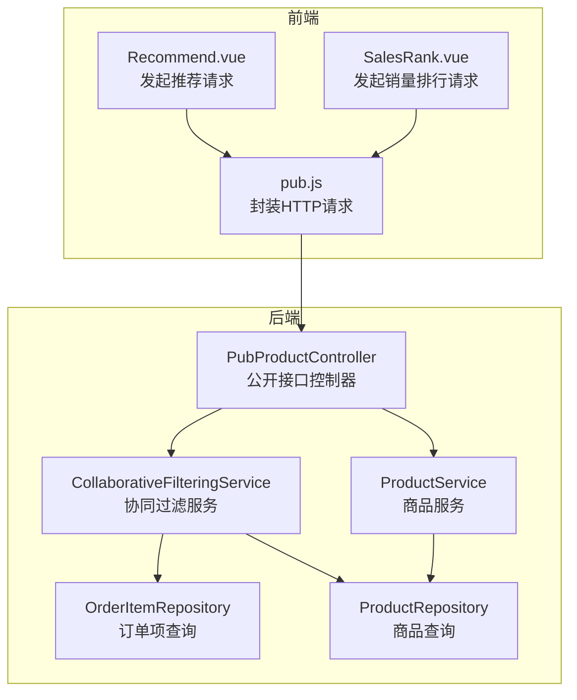
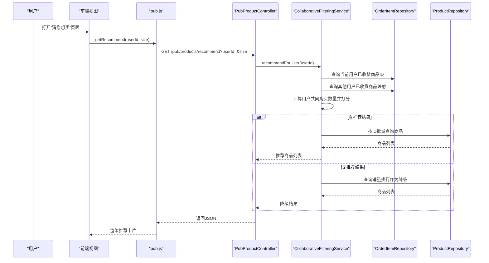
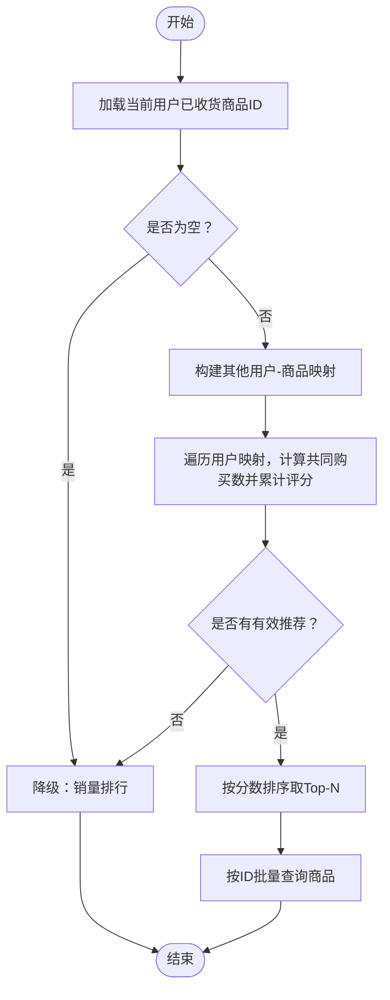
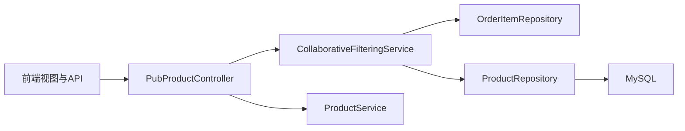

# 推荐系统设计

<cite>
**本文引用的文件**
- [CollaborativeFilteringService.java](file://backend/src/main/java/com/mall/service/CollaborativeFilteringService.java)
- [OrderItemRepository.java](file://backend/src/main/java/com/mall/repository/OrderItemRepository.java)
- [ProductRepository.java](file://backend/src/main/java/com/mall/repository/ProductRepository.java)
- [PubProductController.java](file://backend/src/main/java/com/mall/controller/pub/PubProductController.java)
- [ProductService.java](file://backend/src/main/java/com/mall/service/ProductService.java)
- [Recommend.vue](file://frontend/src/views/user/Recommend.vue)
- [SalesRank.vue](file://frontend/src/views/user/SalesRank.vue)
- [pub.js](file://frontend/src/api/pub.js)
- [application.yml](file://backend/src/main/resources/application.yml)
</cite>

## 目录
1. [简介](#简介)
2. [项目结构](#项目结构)
3. [核心组件](#核心组件)
4. [架构总览](#架构总览)
5. [详细组件分析](#详细组件分析)
6. [依赖关系分析](#依赖关系分析)
7. [性能考量](#性能考量)
8. [故障与降级策略](#故障与降级策略)
9. [推荐效果评估与A/B测试](#推荐效果评估与ab测试)
10. [监控与调优策略](#监控与调优策略)
11. [结论](#结论)
12. [附录](#附录)

## 简介
本技术文档围绕电商商城系统的推荐子系统展开，重点阐述协同过滤算法在“猜您想买”中的实现方式，包括用户相似度计算、物品相似度分析、推荐结果生成流程；同时说明数据采集机制、用户行为分析策略、性能优化方案、个性化推荐的降级策略（销量排行），以及推荐效果评估指标、A/B测试方法、监控与调优策略，并提供算法流程图与性能基准测试建议。

## 项目结构
推荐系统由前后端协作完成：
- 前端负责页面展示与请求发起，分别调用“猜您想买”和“销量排行”两个接口。
- 后端通过控制器暴露公开接口，服务层实现协同过滤算法，仓储层提供数据库查询能力。

图表来源
- [Recommend.vue:18-35](file://frontend/src/views/user/Recommend.vue#L18-L35)
- [SalesRank.vue:16-29](file://frontend/src/views/user/SalesRank.vue#L16-L29)
- [pub.js:28-31](file://frontend/src/api/pub.js#L28-L31)
- [PubProductController.java:85-93](file://backend/src/main/java/com/mall/controller/pub/PubProductController.java#L85-L93)
- [CollaborativeFilteringService.java:32-75](file://backend/src/main/java/com/mall/service/CollaborativeFilteringService.java#L32-L75)
- [OrderItemRepository.java:13-18](file://backend/src/main/java/com/mall/repository/OrderItemRepository.java#L13-L18)
- [ProductRepository.java:69-75](file://backend/src/main/java/com/mall/repository/ProductRepository.java#L69-L75)
- [ProductService.java:74-77](file://backend/src/main/java/com/mall/service/ProductService.java#L74-L77)

章节来源
- [Recommend.vue:1-41](file://frontend/src/views/user/Recommend.vue#L1-L41)
- [SalesRank.vue:1-32](file://frontend/src/views/user/SalesRank.vue#L1-L32)
- [pub.js:1-74](file://frontend/src/api/pub.js#L1-L74)
- [PubProductController.java:1-94](file://backend/src/main/java/com/mall/controller/pub/PubProductController.java#L1-L94)
- [CollaborativeFilteringService.java:1-81](file://backend/src/main/java/com/mall/service/CollaborativeFilteringService.java#L1-L81)
- [OrderItemRepository.java:1-20](file://backend/src/main/java/com/mall/repository/OrderItemRepository.java#L1-L20)
- [ProductRepository.java:1-125](file://backend/src/main/java/com/mall/repository/ProductRepository.java#L1-L125)
- [ProductService.java:1-126](file://backend/src/main/java/com/mall/service/ProductService.java#L1-L126)

## 核心组件
- 协同过滤服务：实现“猜您想买”的核心算法，基于用户共同购买行为进行相似度匹配与打分。
- 订单项仓储：提供当前用户已收货商品ID列表，以及排除当前用户外其他用户的已收货商品映射。
- 商品仓储：提供公开商品查询、销量排行查询、按ID批量查询等能力。
- 公开控制器：对外暴露“猜您想买”和“销量排行”接口。
- 商品服务：封装销量排行与新品等查询逻辑，供控制器调用。
- 前端视图与API：负责向控制器发起请求并渲染推荐/排行结果。

章节来源
- [CollaborativeFilteringService.java:14-80](file://backend/src/main/java/com/mall/service/CollaborativeFilteringService.java#L14-L80)
- [OrderItemRepository.java:13-18](file://backend/src/main/java/com/mall/repository/OrderItemRepository.java#L13-L18)
- [ProductRepository.java:69-83](file://backend/src/main/java/com/mall/repository/ProductRepository.java#L69-L83)
- [PubProductController.java:85-93](file://backend/src/main/java/com/mall/controller/pub/PubProductController.java#L85-L93)
- [ProductService.java:74-77](file://backend/src/main/java/com/mall/service/ProductService.java#L74-L77)
- [Recommend.vue:18-35](file://frontend/src/views/user/Recommend.vue#L18-L35)
- [pub.js:28-31](file://frontend/src/api/pub.js#L28-L31)

## 架构总览
推荐系统采用“前端请求—后端控制器—服务层—仓储层”的分层架构，协同过滤算法在服务层执行，数据库查询由仓储层承担，前端通过公开接口获取推荐与排行数据。

图表来源
- [Recommend.vue:26-31](file://frontend/src/views/user/Recommend.vue#L26-L31)
- [pub.js:28-31](file://frontend/src/api/pub.js#L28-L31)
- [PubProductController.java:85-93](file://backend/src/main/java/com/mall/controller/pub/PubProductController.java#L85-L93)
- [CollaborativeFilteringService.java:32-75](file://backend/src/main/java/com/mall/service/CollaborativeFilteringService.java#L32-L75)
- [OrderItemRepository.java:13-18](file://backend/src/main/java/com/mall/repository/OrderItemRepository.java#L13-L18)
- [ProductRepository.java:69-83](file://backend/src/main/java/com/mall/repository/ProductRepository.java#L69-L83)

## 详细组件分析

### 协同过滤算法实现
- 输入：当前用户ID
- 处理步骤：
  1) 获取当前用户已收货商品ID列表；若为空则降级为销量排行。
  2) 获取其他用户已收货商品映射（排除当前用户）。
  3) 对每个其他用户，计算其与当前用户的共同购买商品数，作为相似度权重。
  4) 对其他用户购买但当前用户未购买的商品进行加权计分，得分越高越推荐。
  5) 按分数降序取Top-N（默认20）并按ID批量查询商品详情。
  6) 若最终无推荐结果，回退到销量排行。
- 关键参数：推荐上限、最小共同购买数阈值。

图表来源
- [CollaborativeFilteringService.java:32-75](file://backend/src/main/java/com/mall/service/CollaborativeFilteringService.java#L32-L75)
- [OrderItemRepository.java:13-18](file://backend/src/main/java/com/mall/repository/OrderItemRepository.java#L13-L18)
- [ProductRepository.java:69-83](file://backend/src/main/java/com/mall/repository/ProductRepository.java#L69-L83)

章节来源
- [CollaborativeFilteringService.java:26-75](file://backend/src/main/java/com/mall/service/CollaborativeFilteringService.java#L26-L75)

### 数据收集与用户行为分析
- 行为数据来源：订单状态为“已收货”的订单项，确保用户已完成购买并确认收货。
- 数据结构：
  - 当前用户已收货商品ID集合
  - 其他用户-已收货商品集合映射
- 分析策略：
  - 使用“共同购买数”作为相似度指标，体现用户偏好一致性。
  - 通过阈值过滤低相似度组合，减少噪声。
  - 对候选商品进行加权累计评分，突出高相似度用户的偏好。

章节来源
- [OrderItemRepository.java:13-18](file://backend/src/main/java/com/mall/repository/OrderItemRepository.java#L13-L18)
- [CollaborativeFilteringService.java:32-60](file://backend/src/main/java/com/mall/service/CollaborativeFilteringService.java#L32-L60)

### 推荐结果生成与前端集成
- 控制器接口：
  - “猜您想买”：需要传入用户ID与大小参数，返回商品列表。
  - “销量排行”：返回公开商品的销量排行。
- 前端调用：
  - 登录态下从Vuex获取用户ID，调用推荐接口。
  - 未登录或无推荐时显示提示文案。
- 页面渲染：
  - 使用商品卡片组件循环展示推荐结果。

章节来源
- [PubProductController.java:85-93](file://backend/src/main/java/com/mall/controller/pub/PubProductController.java#L85-L93)
- [Recommend.vue:26-31](file://frontend/src/views/user/Recommend.vue#L26-L31)
- [pub.js:28-31](file://frontend/src/api/pub.js#L28-L31)

### 降级策略：销量排行
- 触发条件：当前用户无已收货商品记录，或协同过滤无法生成有效推荐。
- 实现方式：直接调用销量排行查询，保证首页/推荐位始终有内容输出。
- 作用：提升用户体验，避免空推荐带来的挫败感。

章节来源
- [CollaborativeFilteringService.java:36-37](file://backend/src/main/java/com/mall/service/CollaborativeFilteringService.java#L36-L37)
- [CollaborativeFilteringService.java:63-64](file://backend/src/main/java/com/mall/service/CollaborativeFilteringService.java#L63-L64)
- [ProductRepository.java:69-75](file://backend/src/main/java/com/mall/repository/ProductRepository.java#L69-L75)

## 依赖关系分析
- 组件耦合：
  - 控制器依赖服务层；服务层依赖仓储层；前端仅依赖公开接口。
- 外部依赖：
  - 数据库连接配置于应用配置文件中，JPA/Hibernate用于ORM。
- 可能的循环依赖：
  - 当前模块间无循环依赖迹象，职责清晰。

图表来源
- [PubProductController.java:21-22](file://backend/src/main/java/com/mall/controller/pub/PubProductController.java#L21-L22)
- [CollaborativeFilteringService.java:22-24](file://backend/src/main/java/com/mall/service/CollaborativeFilteringService.java#L22-L24)
- [OrderItemRepository.java:1-20](file://backend/src/main/java/com/mall/repository/OrderItemRepository.java#L1-L20)
- [ProductRepository.java:1-125](file://backend/src/main/java/com/mall/repository/ProductRepository.java#L1-L125)
- [ProductService.java](file://backend/src/main/java/com/mall/service/ProductService.java#L20)
- [application.yml:4-17](file://backend/src/main/resources/application.yml#L4-L17)

章节来源
- [application.yml:1-36](file://backend/src/main/resources/application.yml#L1-L36)

## 性能考量
- 时间复杂度分析：
  - 用户-商品映射构建：O(U×P)，U为其他用户数，P为平均每个用户购买商品数。
  - 共同购买统计与评分：O(U×P)。
  - 排序与取Top-N：O(N log N)，N为候选商品数。
  - 批量查询商品：O(M)，M为推荐商品数。
- 空间复杂度：O(U×P + N)。
- 优化建议：
  - 数据库层面：
    - 为订单状态与用户ID建立索引，加速“已收货”筛选。
    - 对订单项与订单表进行关联查询优化，必要时使用物化视图或缓存中间结果。
  - 算法层面：
    - 引入用户-商品倒排索引，减少重复扫描。
    - 设置更严格的相似度阈值与Top-N上限，降低后续处理量。
  - 缓存策略：
    - 将热门商品的销量排行结果缓存，设置合理过期时间。
    - 对近期活跃用户的“共同购买”统计进行周期性预计算并缓存。
  - 并发与限流：
    - 对推荐接口增加限流与熔断，防止突发流量击垮数据库。
  - 分页与分批：
    - 对大规模用户集合作分页/分批处理，避免一次性加载过多数据。

[本节为通用性能指导，不直接分析具体文件，故无章节来源]

## 故障与降级策略
- 降级触发点：
  - 当前用户无历史购买记录。
  - 协同过滤无法找到足够相似用户或候选商品。
- 降级实现：
  - 回退至销量排行查询，确保返回非空结果。
- 前端提示：
  - 无推荐时显示友好提示，引导用户多下单以获得更好推荐。

章节来源
- [CollaborativeFilteringService.java:36-37](file://backend/src/main/java/com/mall/service/CollaborativeFilteringService.java#L36-L37)
- [CollaborativeFilteringService.java:63-64](file://backend/src/main/java/com/mall/service/CollaborativeFilteringService.java#L63-L64)
- [Recommend.vue](file://frontend/src/views/user/Recommend.vue#L14)

## 推荐效果评估与A/B测试
- 评估指标建议：
  - 点击率（CTR）：推荐商品被点击的比例。
  - 转化率（CVR）：推荐商品被购买的比例。
  - 平均停留时长：用户在推荐商品详情页的停留时间。
  - 复购率：用户在一定周期内对推荐商品的复购比例。
  - 多样性与新颖性：通过覆盖率与新颖度衡量推荐的广度与新意。
- A/B测试方法：
  - 将用户随机分为对照组与实验组，实验组启用协同过滤，对照组使用销量排行。
  - 对比两组的转化率、点击率、留存率等关键指标，统计显著性差异。
  - 持续观察30天以上，确保样本稳定。
- 实施要点：
  - 明确实验目标与假设，设定显著性水平与样本量。
  - 控制变量，避免促销活动等外部因素干扰。
  - 定期复盘，迭代优化相似度计算与阈值。

[本节为通用评估与测试方法，不直接分析具体文件，故无章节来源]

## 监控与调优策略
- 监控指标：
  - 推荐接口QPS、延迟、错误率。
  - 协同过滤命中率（有推荐结果的比例）、Top-N命中情况。
  - 降级触发频率与原因分布。
- 日志与追踪：
  - 记录用户ID、请求参数、推荐结果、降级原因，便于回溯与分析。
- 调优方向：
  - 动态调整相似度阈值与Top-N上限，平衡召回与精准度。
  - 引入实时行为特征（如浏览、收藏）扩展用户画像。
  - 结合业务规则（品类偏好、价格区间）做二次筛选。

[本节为通用监控与调优建议，不直接分析具体文件，故无章节来源]

## 结论
该推荐系统以简单高效的协同过滤为核心，结合销量排行降级策略，在无用户历史的情况下仍能提供稳定的内容输出。通过明确的分层架构、清晰的接口定义与可扩展的优化路径，系统具备良好的可维护性与演进空间。建议在后续版本中引入更丰富的用户行为特征与缓存机制，持续提升推荐质量与性能表现。

[本节为总结性内容，不直接分析具体文件，故无章节来源]

## 附录

### 接口定义与调用示例
- 接口：GET /pub/products/recommend
  - 参数：userId（必填）、size（可选，默认20）
  - 返回：商品列表
- 接口：GET /pub/products/rank
  - 参数：size（可选，默认10）
  - 返回：销量排行商品列表

章节来源
- [PubProductController.java:85-93](file://backend/src/main/java/com/mall/controller/pub/PubProductController.java#L85-L93)
- [pub.js:23-31](file://frontend/src/api/pub.js#L23-L31)

### 数据模型与查询要点
- 订单项查询：
  - 当前用户已收货商品ID：基于订单状态=已收货筛选。
  - 其他用户已收货商品映射：排除当前用户，构建用户-商品集合。
- 商品查询：
  - 公开商品销量排行：按销量降序查询。
  - 按ID批量查询：确保商品上架且商家启用。

章节来源
- [OrderItemRepository.java:13-18](file://backend/src/main/java/com/mall/repository/OrderItemRepository.java#L13-L18)
- [ProductRepository.java:69-83](file://backend/src/main/java/com/mall/repository/ProductRepository.java#L69-L83)

### 性能基准测试建议
- 测试场景：
  - 小规模：1万用户、10万商品、100万订单项。
  - 中规模：10万用户、100万商品、1000万订单项。
  - 大规模：100万用户、1000万商品、1亿订单项。
- 指标：
  - 单次推荐响应时间（P50/P95/P99）。
  - 推荐接口QPS与并发用户数。
  - 数据库查询耗时与锁等待。
- 工具：
  - JMeter/LoadRunner进行压测。
  - Prometheus+Grafana监控系统资源与接口指标。
  - 慢查询日志与执行计划分析。

[本节为通用测试建议，不直接分析具体文件，故无章节来源]