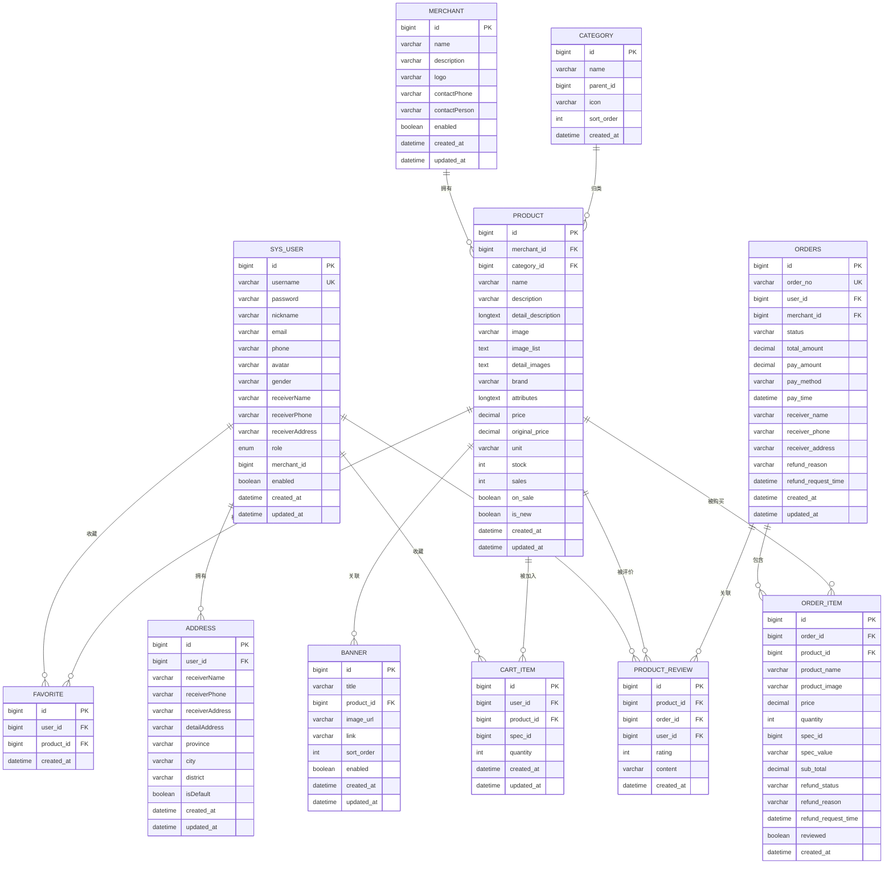
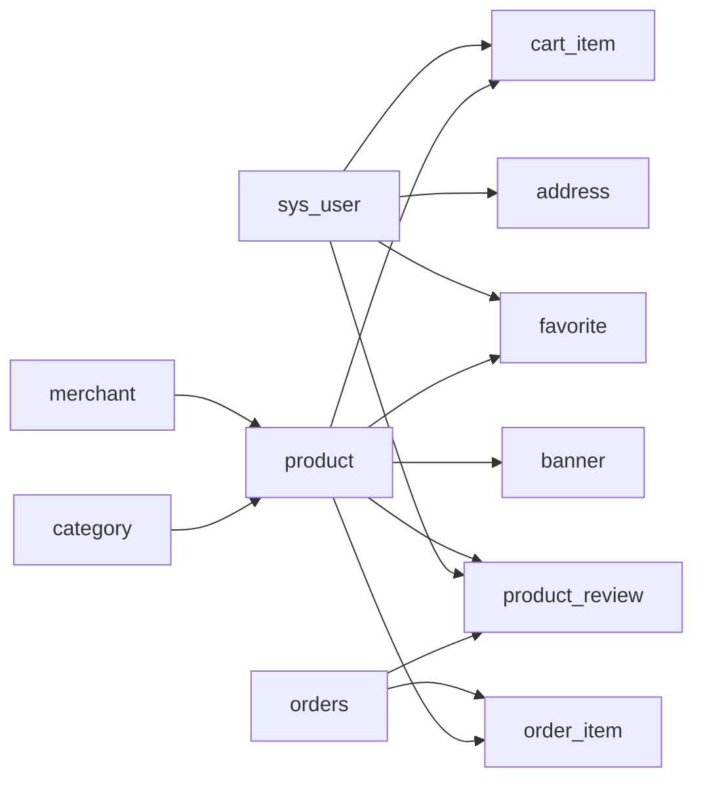

# 数据库设计

<cite>
**本文引用的文件**
- [application.yml](file://backend/src/main/resources/application.yml)
- [User.java](file://backend/src/main/java/com/mall/entity/User.java)
- [Address.java](file://backend/src/main/java/com/mall/entity/Address.java)
- [Product.java](file://backend/src/main/java/com/mall/entity/Product.java)
- [Category.java](file://backend/src/main/java/com/mall/entity/Category.java)
- [Order.java](file://backend/src/main/java/com/mall/entity/Order.java)
- [OrderItem.java](file://backend/src/main/java/com/mall/entity/OrderItem.java)
- [Merchant.java](file://backend/src/main/java/com/mall/entity/Merchant.java)
- [CartItem.java](file://backend/src/main/java/com/mall/entity/CartItem.java)
- [Favorite.java](file://backend/src/main/java/com/mall/entity/Favorite.java)
- [ProductReview.java](file://backend/src/main/java/com/mall/entity/ProductReview.java)
- [Banner.java](file://backend/src/main/java/com/mall/entity/Banner.java)
- [UserRepository.java](file://backend/src/main/java/com/mall/repository/UserRepository.java)
- [Role.java](file://backend/src/main/java/com/mall/common/Role.java)
- [banner.sql](file://backend/src/main/resources/banner.sql)
</cite>

## 目录
1. [简介](#简介)
2. [项目结构](#项目结构)
3. [核心组件](#核心组件)
4. [架构总览](#架构总览)
5. [详细组件分析](#详细组件分析)
6. [依赖分析](#依赖分析)
7. [性能考虑](#性能考虑)
8. [故障排查指南](#故障排查指南)
9. [结论](#结论)
10. [附录](#附录)

## 简介
本设计文档面向电商商城系统的数据库层，基于后端实体与仓库接口，梳理核心数据模型、JPA 注解映射、主外键关系、索引策略，并给出初始化脚本、种子数据建议、迁移策略、ER 图与表结构图、数据字典说明以及性能优化与备份恢复建议。目标是帮助开发与运维团队快速理解并高效维护数据库。

## 项目结构
后端采用 Spring Boot + JPA/Hibernate 技术栈，数据库连接与 JPA 配置集中在应用配置文件中；实体类位于 entity 包，仓库接口位于 repository 包，用于数据访问与查询扩展。

```mermaid
graph TB
subgraph "应用配置"
A["application.yml<br/>数据源与JPA配置"]
end
subgraph "实体模型"
U["User<br/>用户"]
AD["Address<br/>地址"]
M["Merchant<br/>商户"]
C["Category<br/>分类"]
P["Product<br/>商品"]
O["Order<br/>订单"]
OI["OrderItem<br/>订单项"]
CI["CartItem<br/>购物车"]
F["Favorite<br/>收藏"]
PR["ProductReview<br/>商品评价"]
B["Banner<br/>首页轮播"]
end
subgraph "仓储接口"
UR["UserRepository<br/>用户仓库"]
end
A --> U
A --> M
A --> C
A --> P
A --> O
A --> OI
A --> CI
A --> F
A --> PR
A --> B
U < --> AD
M < --> P
C < --> P
O < --> OI
P < --> OI
P < --> PR
U < --> PR
U < --> CI
P < --> CI
U < --> F
P < --> F
P < --> B
```

图表来源
- [application.yml:1-36](file://backend/src/main/resources/application.yml#L1-L36)
- [User.java:10-87](file://backend/src/main/java/com/mall/entity/User.java#L10-L87)
- [Address.java:15-17](file://backend/src/main/java/com/mall/entity/Address.java#L15-L17)
- [Merchant.java:1-56](file://backend/src/main/java/com/mall/entity/Merchant.java#L1-L56)
- [Product.java:1-101](file://backend/src/main/java/com/mall/entity/Product.java#L1-L101)
- [Category.java:1-41](file://backend/src/main/java/com/mall/entity/Category.java#L1-L41)
- [Order.java:1-83](file://backend/src/main/java/com/mall/entity/Order.java#L1-L83)
- [OrderItem.java:1-73](file://backend/src/main/java/com/mall/entity/OrderItem.java#L1-L73)
- [CartItem.java:1-50](file://backend/src/main/java/com/mall/entity/CartItem.java#L1-L50)
- [Favorite.java:1-35](file://backend/src/main/java/com/mall/entity/Favorite.java#L1-L35)
- [ProductReview.java:1-44](file://backend/src/main/java/com/mall/entity/ProductReview.java#L1-L44)
- [Banner.java:1-60](file://backend/src/main/java/com/mall/entity/Banner.java#L1-L60)
- [UserRepository.java:1-20](file://backend/src/main/java/com/mall/repository/UserRepository.java#L1-L20)

章节来源
- [application.yml:1-36](file://backend/src/main/resources/application.yml#L1-L36)

## 核心组件
本节概述核心数据模型及其职责边界：
- 用户与地址：用户表存储身份与角色信息，地址表记录收货地址并由用户管理。
- 商户与商品：商户负责商品上下架与库存管理，商品表承载基础属性与销售统计。
- 分类体系：分类支持父子层级与排序，用于商品归类与展示。
- 订单与订单项：订单聚合支付、收货信息与状态，订单项记录购买快照与售后标记。
- 购物车与收藏：购物车按用户+商品+规格去重，收藏用于用户偏好管理。
- 评价与轮播：商品评价支撑评分与内容，轮播图关联商品并支持排序与开关。

章节来源
- [User.java:10-87](file://backend/src/main/java/com/mall/entity/User.java#L10-L87)
- [Address.java:15-17](file://backend/src/main/java/com/mall/entity/Address.java#L15-L17)
- [Merchant.java:1-56](file://backend/src/main/java/com/mall/entity/Merchant.java#L1-L56)
- [Product.java:1-101](file://backend/src/main/java/com/mall/entity/Product.java#L1-L101)
- [Category.java:1-41](file://backend/src/main/java/com/mall/entity/Category.java#L1-L41)
- [Order.java:1-83](file://backend/src/main/java/com/mall/entity/Order.java#L1-L83)
- [OrderItem.java:1-73](file://backend/src/main/java/com/mall/entity/OrderItem.java#L1-L73)
- [CartItem.java:1-50](file://backend/src/main/java/com/mall/entity/CartItem.java#L1-L50)
- [Favorite.java:1-35](file://backend/src/main/java/com/mall/entity/Favorite.java#L1-L35)
- [ProductReview.java:1-44](file://backend/src/main/java/com/mall/entity/ProductReview.java#L1-L44)
- [Banner.java:1-60](file://backend/src/main/java/com/mall/entity/Banner.java#L1-L60)

## 架构总览
下图展示数据库层的实体关系与映射要点，包括一对一、一对多、多对多关系及关键字段。



图表来源
- [User.java:10-87](file://backend/src/main/java/com/mall/entity/User.java#L10-L87)
- [Address.java:15-17](file://backend/src/main/java/com/mall/entity/Address.java#L15-L17)
- [Merchant.java:1-56](file://backend/src/main/java/com/mall/entity/Merchant.java#L1-L56)
- [Category.java:1-41](file://backend/src/main/java/com/mall/entity/Category.java#L1-L41)
- [Product.java:1-101](file://backend/src/main/java/com/mall/entity/Product.java#L1-L101)
- [Order.java:1-83](file://backend/src/main/java/com/mall/entity/Order.java#L1-L83)
- [OrderItem.java:1-73](file://backend/src/main/java/com/mall/entity/OrderItem.java#L1-L73)
- [CartItem.java:1-50](file://backend/src/main/java/com/mall/entity/CartItem.java#L1-L50)
- [Favorite.java:1-35](file://backend/src/main/java/com/mall/entity/Favorite.java#L1-L35)
- [ProductReview.java:1-44](file://backend/src/main/java/com/mall/entity/ProductReview.java#L1-L44)
- [Banner.java:1-60](file://backend/src/main/java/com/mall/entity/Banner.java#L1-L60)

## 详细组件分析

### 用户与地址模型
- 实体映射
  - 用户表：自增主键、唯一用户名、枚举角色、启用状态、时间戳。
  - 地址表：外键关联用户，记录收货人、电话、地址、省市区、默认地址标记与时间戳。
- 关系映射
  - 用户与地址：一对多，懒加载，级联保存。
- 约束与索引
  - 用户名唯一；地址默认索引可按需扩展。
- JPA 注解要点
  - 使用生成策略、列长度、非空、唯一、枚举类型映射、预处理时间戳。

章节来源
- [User.java:10-87](file://backend/src/main/java/com/mall/entity/User.java#L10-L87)
- [Address.java:15-17](file://backend/src/main/java/com/mall/entity/Address.java#L15-L17)

### 商户与商品模型
- 实体映射
  - 商户表：名称、描述、LOGO、联系方式、启用状态与更新时间。
  - 商品表：所属商户与分类、名称、描述、详情、图片集、品牌、参数、价格、库存、销量、上下架状态、新品标识与时间戳。
- 关系映射
  - 商户与商品：一对多；分类与商品：一对多。
- 约束与索引
  - 商品详情/列表图片使用大文本类型；价格精度与标度定义明确。
- JPA 注解要点
  - 默认值注解、金额类型、布尔字段、时间戳自动填充。

章节来源
- [Merchant.java:1-56](file://backend/src/main/java/com/mall/entity/Merchant.java#L1-L56)
- [Product.java:1-101](file://backend/src/main/java/com/mall/entity/Product.java#L1-L101)
- [Category.java:1-41](file://backend/src/main/java/com/mall/entity/Category.java#L1-L41)

### 订单与订单项模型
- 实体映射
  - 订单表：订单号唯一、用户与商户、状态、金额、支付方式与时间、收货信息、退款相关字段与时间戳。
  - 订单项表：订单与商品快照、单价、数量、小计、退款状态与是否评价、时间戳。
- 关系映射
  - 订单与订单项：一对多；订单项与商品：多对一。
- 约束与索引
  - 订单号唯一；可考虑在订单号、用户ID、商户ID、状态建立复合索引以优化查询。
- JPA 注解要点
  - 时间戳自动填充、金额精度控制。

章节来源
- [Order.java:1-83](file://backend/src/main/java/com/mall/entity/Order.java#L1-L83)
- [OrderItem.java:1-73](file://backend/src/main/java/com/mall/entity/OrderItem.java#L1-L73)

### 购物车与收藏模型
- 实体映射
  - 购物车：用户+商品+规格唯一组合，数量与时间戳。
  - 收藏：用户+商品唯一组合，时间戳。
- 关系映射
  - 用户与购物车：一对多；商品与购物车：一对多；用户与收藏：一对多；商品与收藏：一对多。
- 约束与索引
  - 购物车唯一约束；收藏唯一约束；可考虑在用户ID、商品ID上建立二级索引。
- JPA 注解要点
  - 唯一约束声明、默认数量与时间戳。

章节来源
- [CartItem.java:1-50](file://backend/src/main/java/com/mall/entity/CartItem.java#L1-L50)
- [Favorite.java:1-35](file://backend/src/main/java/com/mall/entity/Favorite.java#L1-L35)

### 评价与轮播模型
- 实体映射
  - 商品评价：商品、订单、用户、评分、内容与时间戳。
  - 轮播图：标题、关联商品、图片URL、跳转链接、排序与开关、时间戳。
- 关系映射
  - 商品与评价：一对多；用户与评价：一对多；商品与轮播：一对多。
- 约束与索引
  - 轮播图存在外键与索引；可考虑在 enabled 与 sort_order 上建立复合索引。
- JPA 注解要点
  - 时间戳自动填充、大文本字段。

章节来源
- [ProductReview.java:1-44](file://backend/src/main/java/com/mall/entity/ProductReview.java#L1-L44)
- [Banner.java:1-60](file://backend/src/main/java/com/mall/entity/Banner.java#L1-L60)
- [banner.sql:1-14](file://backend/src/main/resources/banner.sql#L1-L14)

### 角色与仓库接口
- 角色枚举：ADMIN、MERCHANT、USER。
- 用户仓库：提供按用户名查找、是否存在、按角色查询、按商户ID查询等方法。

章节来源
- [Role.java:1-8](file://backend/src/main/java/com/mall/common/Role.java#L1-L8)
- [UserRepository.java:1-20](file://backend/src/main/java/com/mall/repository/UserRepository.java#L1-L20)

## 依赖分析
- 外键依赖
  - address.user_id → sys_user.id
  - product.merchant_id → merchant.id
  - product.category_id → category.id
  - order_item.order_id → orders.id
  - order_item.product_id → product.id
  - product_review.product_id → product.id
  - product_review.order_id → orders.id
  - product_review.user_id → sys_user.id
  - favorite.user_id → sys_user.id
  - favorite.product_id → product.id
  - cart_item.user_id → sys_user.id
  - cart_item.product_id → product.id
  - banner.product_id → product.id
- 约束与索引
  - sys_user.username 唯一
  - orders.order_no 唯一
  - cart_item 三元唯一约束（user_id, product_id, spec_id）
  - favorite 二元唯一约束（user_id, product_id）
  - banner.idx_enabled_sort（enabled, sort_order）



图表来源
- [User.java:10-87](file://backend/src/main/java/com/mall/entity/User.java#L10-L87)
- [Address.java:15-17](file://backend/src/main/java/com/mall/entity/Address.java#L15-L17)
- [Merchant.java:1-56](file://backend/src/main/java/com/mall/entity/Merchant.java#L1-L56)
- [Category.java:1-41](file://backend/src/main/java/com/mall/entity/Category.java#L1-L41)
- [Product.java:1-101](file://backend/src/main/java/com/mall/entity/Product.java#L1-L101)
- [Order.java:1-83](file://backend/src/main/java/com/mall/entity/Order.java#L1-L83)
- [OrderItem.java:1-73](file://backend/src/main/java/com/mall/entity/OrderItem.java#L1-L73)
- [Favorite.java:1-35](file://backend/src/main/java/com/mall/entity/Favorite.java#L1-L35)
- [CartItem.java:1-50](file://backend/src/main/java/com/mall/entity/CartItem.java#L1-L50)
- [ProductReview.java:1-44](file://backend/src/main/java/com/mall/entity/ProductReview.java#L1-L44)
- [Banner.java:1-60](file://backend/src/main/java/com/mall/entity/Banner.java#L1-L60)

## 性能考虑
- 查询优化
  - 在订单表的 user_id、merchant_id、status、order_no 建立复合索引，提升订单检索效率。
  - 在商品表的 merchant_id、category_id、on_sale、sales 建立复合索引，优化商品筛选与排行。
  - 在订单项表的 order_id、product_id 建立复合索引，加速订单明细查询。
  - 在购物车表的 user_id、product_id、spec_id 建立复合索引，避免重复加购。
  - 在收藏表的 user_id、product_id 建立复合索引，提升收藏查询。
  - 在评价表的 product_id、user_id、order_id 建立复合索引，优化评价统计与分页。
- 写入优化
  - 批量插入与更新时使用合适的数据类型与默认值，减少空值与冗余字段。
  - 控制大文本字段写入频率，必要时拆分或延迟加载。
- 缓存策略
  - 对热点商品与分类信息进行缓存，降低数据库压力。
- 连接与事务
  - 合理设置连接池大小与超时时间，避免长事务占用资源。
- 监控与诊断
  - 开启慢查询日志与执行计划分析，定期审查索引使用情况。

## 故障排查指南
- 初始化与迁移
  - DDL 自动模式：当前配置为更新模式，适用于开发环境；生产环境建议改为严格模式并使用迁移工具（如 Flyway/Liquibase）管理版本。
- 常见问题定位
  - 主键冲突：检查唯一约束（用户名、订单号、购物车三元唯一、收藏二元唯一）。
  - 外键失败：确认被引用记录存在且状态有效（如商品已上架、商户启用）。
  - 索引缺失：对高频查询字段补充复合索引。
- 日志与配置
  - 关注应用日志与 SQL 输出，结合数据库慢查询日志定位瓶颈。

章节来源
- [application.yml:9-17](file://backend/src/main/resources/application.yml#L9-L17)

## 结论
本设计文档基于现有实体与配置，给出了电商商城数据库的完整 ER 模型、表结构与索引策略，并提供了初始化脚本、迁移建议与性能优化思路。建议在生产环境中采用显式迁移与严格的索引策略，持续监控与迭代优化。

## 附录

### 数据库初始化脚本与种子数据
- 初始化脚本
  - 轮播表初始化脚本已提供，包含索引与外键定义，可直接执行。
- 种子数据建议
  - 用户：管理员、运营、普通用户各一条，角色枚举对应。
  - 商户：至少一个启用商户，用于商品上架。
  - 分类：根分类与子分类若干，配合排序字段。
  - 商品：关联商户与分类，设置价格、库存、上下架状态。
  - 轮播：绑定已上架商品，设置排序与启用状态。
  - 订单与订单项：模拟下单流程，包含支付状态与收货信息。
  - 评价：基于真实订单生成，包含评分与内容。
- 迁移策略
  - 开发环境：DDL 更新模式，便于快速迭代。
  - 测试/生产环境：使用迁移工具管理版本，先创建索引再变更表结构，确保回滚路径清晰。

章节来源
- [banner.sql:1-14](file://backend/src/main/resources/banner.sql#L1-L14)

### 表结构与字段说明（数据字典）
- sys_user（用户）
  - 字段：id、username（UK）、password、nickname、email、phone、avatar、gender、receiverName、receiverPhone、receiverAddress、role、merchant_id、enabled、created_at、updated_at。
  - 约束：username 唯一；enabled 默认 true。
- address（地址）
  - 字段：id、user_id（FK）、receiverName、receiverPhone、receiverAddress、detailAddress、province、city、district、isDefault、created_at、updated_at。
  - 约束：isDefault 默认 false。
- merchant（商户）
  - 字段：id、name、description、logo、contactPhone、contactPerson、enabled、created_at、updated_at。
  - 约束：enabled 默认 true。
- category（分类）
  - 字段：id、name、parent_id、icon、sort_order、created_at。
  - 约束：sort_order 默认 0。
- product（商品）
  - 字段：id、merchant_id（FK）、category_id（FK）、name、description、detail_description、image、image_list、detail_images、brand、attributes、price、original_price、unit、stock、sales、on_sale、is_new、created_at、updated_at。
  - 约束：stock/sales/on_sale 默认 0/true；unit 默认“件”。
- orders（订单）
  - 字段：id、order_no（UK）、user_id（FK）、merchant_id（FK）、status、total_amount、pay_amount、pay_method、pay_time、receiver_name、receiver_phone、receiver_address、refund_reason、refund_request_time、created_at、updated_at。
  - 约束：order_no 唯一；status 为枚举字符串。
- order_item（订单项）
  - 字段：id、order_id（FK）、product_id（FK）、product_name、product_image、price、quantity、spec_id、spec_value、sub_total、refund_status、refund_reason、refund_request_time、reviewed、created_at。
  - 约束：reviewed 默认 false。
- cart_item（购物车）
  - 字段：id、user_id（FK）、product_id（FK）、spec_id、quantity、created_at、updated_at。
  - 约束：quantity 默认 1；三元唯一。
- favorite（收藏）
  - 字段：id、user_id（FK）、product_id（FK）、created_at。
  - 约束：二元唯一。
- product_review（评价）
  - 字段：id、product_id（FK）、order_id（FK）、user_id（FK）、rating、content、created_at。
  - 约束：rating 默认 5。
- banner（轮播）
  - 字段：id、title、product_id（FK）、image_url、link、sort_order、enabled、created_at、updated_at。
  - 约束：enabled 默认 true；idx_enabled_sort 索引。

章节来源
- [User.java:10-87](file://backend/src/main/java/com/mall/entity/User.java#L10-L87)
- [Address.java:15-17](file://backend/src/main/java/com/mall/entity/Address.java#L15-L17)
- [Merchant.java:1-56](file://backend/src/main/java/com/mall/entity/Merchant.java#L1-L56)
- [Category.java:1-41](file://backend/src/main/java/com/mall/entity/Category.java#L1-L41)
- [Product.java:1-101](file://backend/src/main/java/com/mall/entity/Product.java#L1-L101)
- [Order.java:1-83](file://backend/src/main/java/com/mall/entity/Order.java#L1-L83)
- [OrderItem.java:1-73](file://backend/src/main/java/com/mall/entity/OrderItem.java#L1-L73)
- [CartItem.java:1-50](file://backend/src/main/java/com/mall/entity/CartItem.java#L1-L50)
- [Favorite.java:1-35](file://backend/src/main/java/com/mall/entity/Favorite.java#L1-L35)
- [ProductReview.java:1-44](file://backend/src/main/java/com/mall/entity/ProductReview.java#L1-L44)
- [Banner.java:1-60](file://backend/src/main/java/com/mall/entity/Banner.java#L1-L60)
- [banner.sql:1-14](file://backend/src/main/resources/banner.sql#L1-L14)

### JPA 注解与关系映射要点
- 实体与表映射
  - @Entity、@Table(name="...") 明确表名。
- 主键与生成策略
  - @Id、@GeneratedValue(strategy=IDENTITY) 自增主键。
- 列约束与类型
  - @Column(unique/nullable/length/precision/scale/updatable) 细化列属性。
- 枚举与时间戳
  - @Enumerated(EnumType.STRING) 枚举持久化；@PrePersist/@PreUpdate 自动填充时间。
- 关系映射
  - @OneToOne/@OneToMany/@ManyToOne + @JoinColumn/@MapsId/@OrderBy。
  - @OneToMany(mappedBy="...") 反向映射。
- 唯一约束
  - @UniqueConstraint 定义复合唯一。
- 查询扩展
  - UserRepository 提供按用户名、角色、商户ID等查询方法。

章节来源
- [User.java:10-87](file://backend/src/main/java/com/mall/entity/User.java#L10-L87)
- [Address.java:15-17](file://backend/src/main/java/com/mall/entity/Address.java#L15-L17)
- [CartItem.java:8-9](file://backend/src/main/java/com/mall/entity/CartItem.java#L8-L9)
- [Favorite.java:8-9](file://backend/src/main/java/com/mall/entity/Favorite.java#L8-L9)
- [UserRepository.java:10-19](file://backend/src/main/java/com/mall/repository/UserRepository.java#L10-L19)