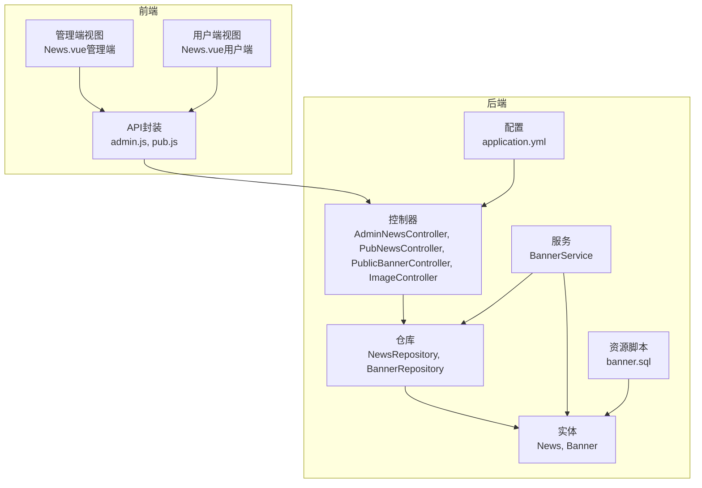
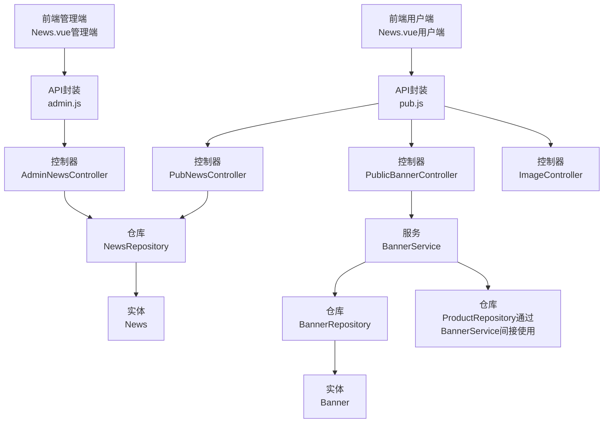
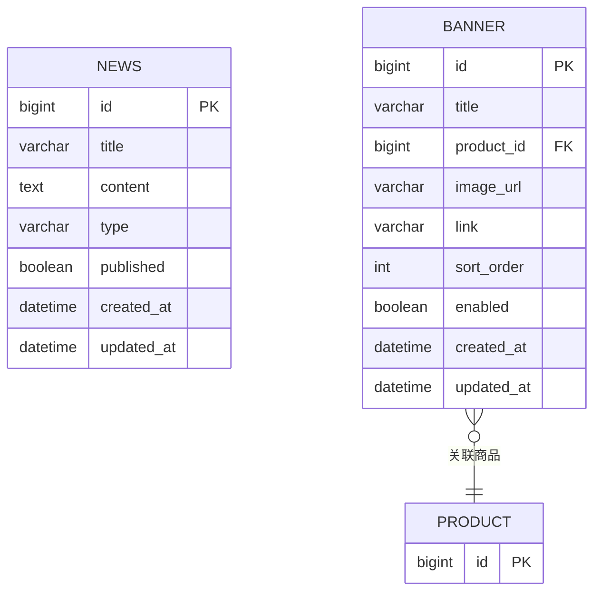
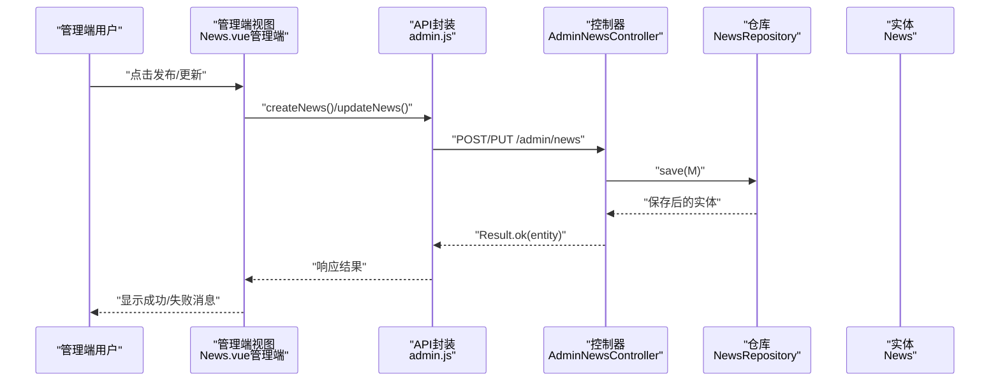
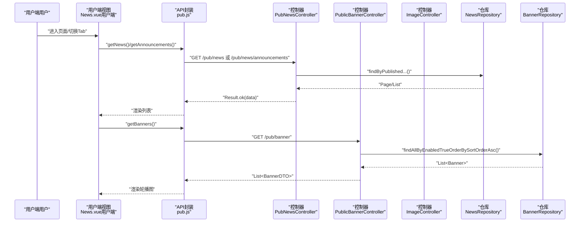
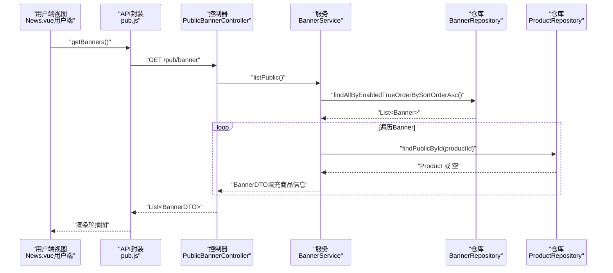
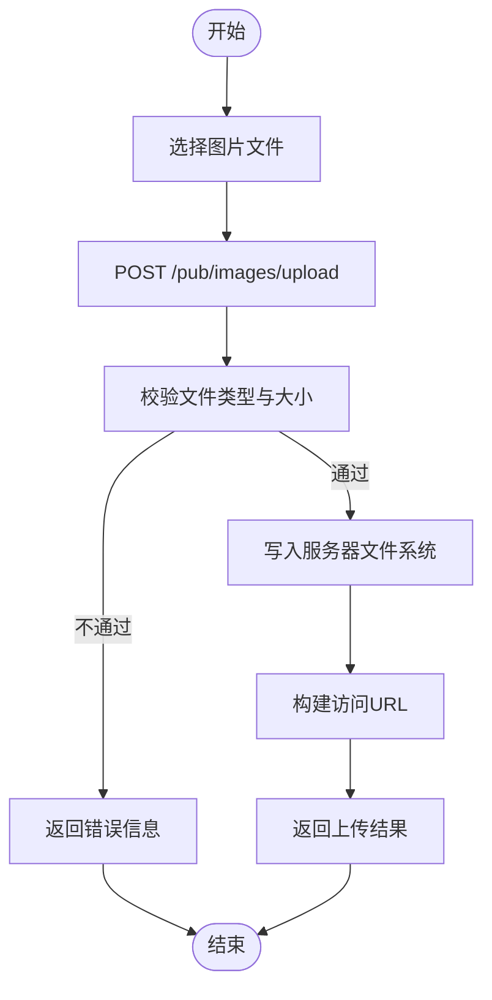
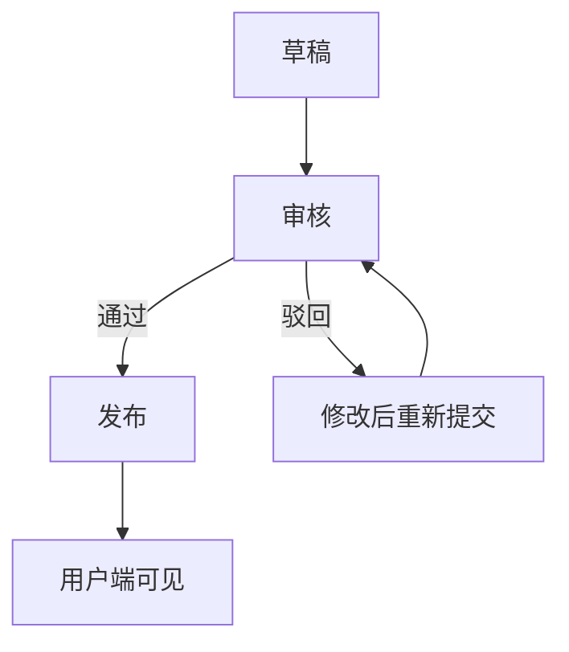
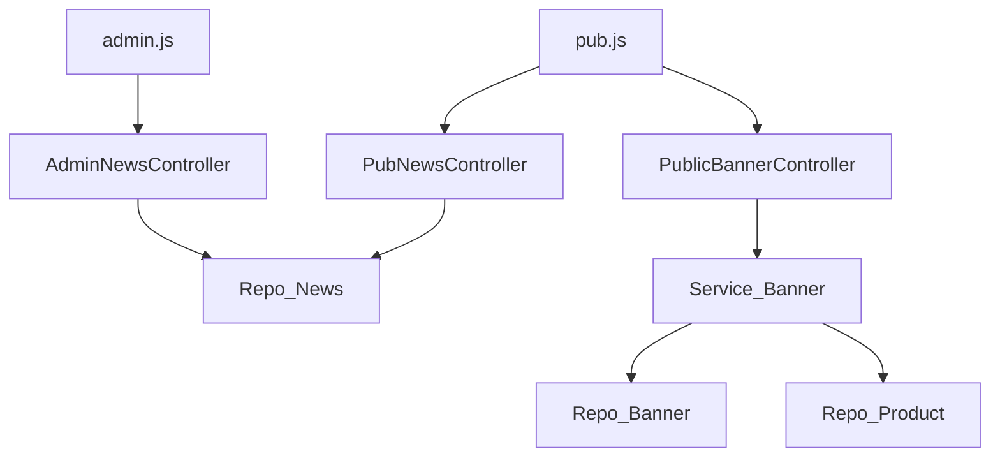

# 内容管理系统

<cite>
**本文引用的文件**
- [News.java](file://backend/src/main/java/com/mall/entity/News.java)
- [Banner.java](file://backend/src/main/java/com/mall/entity/Banner.java)
- [BannerDTO.java](file://backend/src/main/java/com/mall/dto/BannerDTO.java)
- [NewsRepository.java](file://backend/src/main/java/com/mall/repository/NewsRepository.java)
- [BannerRepository.java](file://backend/src/main/java/com/mall/repository/BannerRepository.java)
- [AdminNewsController.java](file://backend/src/main/java/com/mall/controller/admin/AdminNewsController.java)
- [PubNewsController.java](file://backend/src/main/java/com/mall/controller/pub/PubNewsController.java)
- [PublicBannerController.java](file://backend/src/main/java/com/mall/controller/pub/PublicBannerController.java)
- [BannerService.java](file://backend/src/main/java/com/mall/service/BannerService.java)
- [ImageController.java](file://backend/src/main/java/com/mall/controller/pub/ImageController.java)
- [application.yml](file://backend/src/main/resources/application.yml)
- [banner.sql](file://backend/src/main/resources/banner.sql)
- [News.vue（管理端）](file://frontend/src/views/admin/News.vue)
- [News.vue（用户端）](file://frontend/src/views/user/News.vue)
- [admin.js](file://frontend/src/api/admin.js)
- [pub.js](file://frontend/src/api/pub.js)
</cite>

## 目录
1. [简介](#简介)
2. [项目结构](#项目结构)
3. [核心组件](#核心组件)
4. [架构总览](#架构总览)
5. [详细组件分析](#详细组件分析)
6. [依赖分析](#依赖分析)
7. [性能考虑](#性能考虑)
8. [故障排查指南](#故障排查指南)
9. [结论](#结论)
10. [附录](#附录)

## 简介
本内容管理系统围绕“新闻资讯管理”“轮播图管理”“公告发布”“内容审核（草稿/发布）”等核心功能展开，提供从后端数据模型到前端展示界面的完整链路。系统采用 Spring Boot + Vue 的前后端分离架构，后端负责数据持久化与业务逻辑，前端提供管理端与用户端两类界面。

## 项目结构
- 后端位于 backend，采用标准 Spring Boot 结构，包含实体、仓库、服务、控制器、配置与资源。
- 前端位于 frontend，采用 Vue 3 + Element Plus，分为管理端、商户端、用户端三类布局与视图。

**图表来源**
- [application.yml:1-36](file://backend/src/main/resources/application.yml#L1-L36)
- [banner.sql:1-14](file://backend/src/main/resources/banner.sql#L1-L14)

**章节来源**
- [application.yml:1-36](file://backend/src/main/resources/application.yml#L1-L36)
- [banner.sql:1-14](file://backend/src/main/resources/banner.sql#L1-L14)

## 核心组件
- 数据模型
  - News：存储资讯与公告，字段包括标题、内容、类型（NEWS/ANNOUNCEMENT）、发布状态、创建/更新时间。
  - Banner：存储轮播图，字段包括标题、关联商品ID、图片URL、跳转链接、排序权重、启用状态、创建/更新时间。
- 控制器
  - 管理端：AdminNewsController 提供资讯/公告的增删改查。
  - 公共端：PubNewsController 提供资讯列表与公告列表查询；PublicBannerController 提供轮播图列表查询；ImageController 提供图片上传与查看。
- 服务层
  - BannerService：封装轮播图列表查询、DTO转换、商品信息填充、保存与删除。
- 仓库层
  - NewsRepository：提供按发布状态与类型筛选的分页/列表查询。
  - BannerRepository：提供按启用状态与排序权重的查询。
- 前端
  - 管理端 News.vue：支持创建/编辑/删除资讯/公告，支持草稿与发布切换。
  - 用户端 News.vue：支持资讯与公告的分类浏览与合并展示。
  - API 封装：admin.js 与 pub.js 对应管理端与公共端接口。

**章节来源**
- [News.java:1-52](file://backend/src/main/java/com/mall/entity/News.java#L1-L52)
- [Banner.java:1-60](file://backend/src/main/java/com/mall/entity/Banner.java#L1-L60)
- [AdminNewsController.java:1-48](file://backend/src/main/java/com/mall/controller/admin/AdminNewsController.java#L1-L48)
- [PubNewsController.java:1-36](file://backend/src/main/java/com/mall/controller/pub/PubNewsController.java#L1-L36)
- [PublicBannerController.java:1-23](file://backend/src/main/java/com/mall/controller/pub/PublicBannerController.java#L1-L23)
- [BannerService.java:1-85](file://backend/src/main/java/com/mall/service/BannerService.java#L1-L85)
- [NewsRepository.java:1-19](file://backend/src/main/java/com/mall/repository/NewsRepository.java#L1-L19)
- [BannerRepository.java:1-10](file://backend/src/main/java/com/mall/repository/BannerRepository.java#L1-L10)
- [News.vue（管理端）:1-307](file://frontend/src/views/admin/News.vue#L1-L307)
- [News.vue（用户端）:1-279](file://frontend/src/views/user/News.vue#L1-L279)
- [admin.js:1-129](file://frontend/src/api/admin.js#L1-L129)
- [pub.js:1-74](file://frontend/src/api/pub.js#L1-L74)

## 架构总览
系统采用前后端分离架构，后端通过 REST 接口提供数据，前端通过统一的 API 封装进行调用。管理端与用户端分别使用不同的控制器与视图组件。

**图表来源**
- [AdminNewsController.java:1-48](file://backend/src/main/java/com/mall/controller/admin/AdminNewsController.java#L1-L48)
- [PubNewsController.java:1-36](file://backend/src/main/java/com/mall/controller/pub/PubNewsController.java#L1-L36)
- [PublicBannerController.java:1-23](file://backend/src/main/java/com/mall/controller/pub/PublicBannerController.java#L1-L23)
- [ImageController.java:1-155](file://backend/src/main/java/com/mall/controller/pub/ImageController.java#L1-L155)
- [BannerService.java:1-85](file://backend/src/main/java/com/mall/service/BannerService.java#L1-L85)
- [NewsRepository.java:1-19](file://backend/src/main/java/com/mall/repository/NewsRepository.java#L1-L19)
- [BannerRepository.java:1-10](file://backend/src/main/java/com/mall/repository/BannerRepository.java#L1-L10)
- [News.java:1-52](file://backend/src/main/java/com/mall/entity/News.java#L1-L52)
- [Banner.java:1-60](file://backend/src/main/java/com/mall/entity/Banner.java#L1-L60)
- [News.vue（管理端）:1-307](file://frontend/src/views/admin/News.vue#L1-L307)
- [News.vue（用户端）:1-279](file://frontend/src/views/user/News.vue#L1-L279)
- [admin.js:1-129](file://frontend/src/api/admin.js#L1-L129)
- [pub.js:1-74](file://frontend/src/api/pub.js#L1-L74)

## 详细组件分析

### 数据模型设计
- News 实体
  - 字段：id、title、content、type（NEWS/ANNOUNCEMENT）、published、createdAt、updatedAt。
  - 时间戳在持久化与更新时自动维护。
- Banner 实体
  - 字段：id、title、productId、imageUrl、link、sortOrder、enabled、createdAt、updatedAt。
  - 通过索引与外键约束保证查询效率与数据一致性。

**图表来源**
- [News.java:1-52](file://backend/src/main/java/com/mall/entity/News.java#L1-L52)
- [Banner.java:1-60](file://backend/src/main/java/com/mall/entity/Banner.java#L1-L60)
- [banner.sql:1-14](file://backend/src/main/resources/banner.sql#L1-L14)

**章节来源**
- [News.java:1-52](file://backend/src/main/java/com/mall/entity/News.java#L1-L52)
- [Banner.java:1-60](file://backend/src/main/java/com/mall/entity/Banner.java#L1-L60)
- [banner.sql:1-14](file://backend/src/main/resources/banner.sql#L1-L14)

### 新闻资讯管理（管理端）
- 功能概述
  - 支持创建/编辑/删除资讯与公告。
  - 支持草稿与发布切换（published 字段）。
  - 支持按标题搜索与按创建时间排序。
- 关键流程（创建/更新）
  - 前端提交表单，调用 admin.js 中的 createNews/updateNews。
  - 后端 AdminNewsController 接收请求，设置主键为空以创建，或传入 id 以更新。
  - 保存后返回 Result 包裹的数据。

**图表来源**
- [AdminNewsController.java:1-48](file://backend/src/main/java/com/mall/controller/admin/AdminNewsController.java#L1-L48)
- [News.vue（管理端）:1-307](file://frontend/src/views/admin/News.vue#L1-L307)
- [admin.js:1-129](file://frontend/src/api/admin.js#L1-L129)

**章节来源**
- [AdminNewsController.java:1-48](file://backend/src/main/java/com/mall/controller/admin/AdminNewsController.java#L1-L48)
- [News.vue（管理端）:1-307](file://frontend/src/views/admin/News.vue#L1-L307)
- [admin.js:1-129](file://frontend/src/api/admin.js#L1-L129)

### 公共资讯与公告展示（用户端）
- 功能概述
  - 支持资讯与公告的分类浏览与合并展示。
  - 资讯列表通过 /pub/news 查询，公告列表通过 /pub/news/announcements 查询。
- 关键流程（加载数据）
  - 用户端 News.vue 根据当前 Tab 调用 pub.js 的 getNews/getAnnouncements。
  - 若选择“全部”，则并行请求资讯与公告，合并后按时间倒序排序。

**图表来源**
- [PubNewsController.java:1-36](file://backend/src/main/java/com/mall/controller/pub/PubNewsController.java#L1-L36)
- [PublicBannerController.java:1-23](file://backend/src/main/java/com/mall/controller/pub/PublicBannerController.java#L1-L23)
- [News.vue（用户端）:1-279](file://frontend/src/views/user/News.vue#L1-L279)
- [pub.js:1-74](file://frontend/src/api/pub.js#L1-L74)
- [NewsRepository.java:1-19](file://backend/src/main/java/com/mall/repository/NewsRepository.java#L1-L19)
- [BannerRepository.java:1-10](file://backend/src/main/java/com/mall/repository/BannerRepository.java#L1-L10)

**章节来源**
- [PubNewsController.java:1-36](file://backend/src/main/java/com/mall/controller/pub/PubNewsController.java#L1-L36)
- [PublicBannerController.java:1-23](file://backend/src/main/java/com/mall/controller/pub/PublicBannerController.java#L1-L23)
- [News.vue（用户端）:1-279](file://frontend/src/views/user/News.vue#L1-L279)
- [pub.js:1-74](file://frontend/src/api/pub.js#L1-L74)
- [NewsRepository.java:1-19](file://backend/src/main/java/com/mall/repository/NewsRepository.java#L1-L19)
- [BannerRepository.java:1-10](file://backend/src/main/java/com/mall/repository/BannerRepository.java#L1-L10)

### 轮播图管理与展示
- 功能概述
  - 轮播图与商品绑定，支持启用/禁用、排序权重控制。
  - 管理端可查看商品信息（名称、价格、图片等），用户端仅展示公开商品信息。
- 关键流程（列表与DTO转换）
  - BannerService 将 Banner 实体转换为 BannerDTO，并填充商品信息。
  - PublicBannerController 返回公开轮播图列表，过滤掉不满足条件的记录。

**图表来源**
- [PublicBannerController.java:1-23](file://backend/src/main/java/com/mall/controller/pub/PublicBannerController.java#L1-L23)
- [BannerService.java:1-85](file://backend/src/main/java/com/mall/service/BannerService.java#L1-L85)
- [BannerRepository.java:1-10](file://backend/src/main/java/com/mall/repository/BannerRepository.java#L1-L10)
- [BannerDTO.java:1-33](file://backend/src/main/java/com/mall/dto/BannerDTO.java#L1-L33)
- [News.vue（用户端）:1-279](file://frontend/src/views/user/News.vue#L1-L279)
- [pub.js:1-74](file://frontend/src/api/pub.js#L1-L74)

**章节来源**
- [PublicBannerController.java:1-23](file://backend/src/main/java/com/mall/controller/pub/PublicBannerController.java#L1-L23)
- [BannerService.java:1-85](file://backend/src/main/java/com/mall/service/BannerService.java#L1-L85)
- [BannerRepository.java:1-10](file://backend/src/main/java/com/mall/repository/BannerRepository.java#L1-L10)
- [BannerDTO.java:1-33](file://backend/src/main/java/com/mall/dto/BannerDTO.java#L1-L33)
- [News.vue（用户端）:1-279](file://frontend/src/views/user/News.vue#L1-L279)
- [pub.js:1-74](file://frontend/src/api/pub.js#L1-L74)

### 图片上传与访问
- 功能概述
  - 支持图片上传、列出可用图片、通过 API 访问图片。
  - 上传后返回可访问的 URL，便于在资讯/轮播图中引用。
- 关键流程（上传）
  - 前端选择文件，调用 pub.js 的 getBanners 或管理端上传接口。
  - 后端 ImageController 校验文件类型与路径，生成唯一文件名并保存至指定目录，返回访问 URL。

**图表来源**
- [ImageController.java:1-155](file://backend/src/main/java/com/mall/controller/pub/ImageController.java#L1-L155)
- [pub.js:1-74](file://frontend/src/api/pub.js#L1-L74)

**章节来源**
- [ImageController.java:1-155](file://backend/src/main/java/com/mall/controller/pub/ImageController.java#L1-L155)
- [pub.js:1-74](file://frontend/src/api/pub.js#L1-L74)

### 内容发布流程与内容审核
- 发布流程
  - 管理端创建内容时，可选择 published=false 保存为草稿；选择 published=true 即发布。
  - 用户端通过 /pub/news 与 /pub/news/announcements 获取已发布内容。
- 审核要点
  - type 字段区分 NEWS 与 ANNOUNCEMENT。
  - published 字段控制是否对外可见。
  - 建议在管理端增加“审核”状态字段与审批流程（当前代码未体现）。

**图表来源**
- [AdminNewsController.java:1-48](file://backend/src/main/java/com/mall/controller/admin/AdminNewsController.java#L1-L48)
- [PubNewsController.java:1-36](file://backend/src/main/java/com/mall/controller/pub/PubNewsController.java#L1-L36)
- [News.vue（管理端）:1-307](file://frontend/src/views/admin/News.vue#L1-L307)
- [News.vue（用户端）:1-279](file://frontend/src/views/user/News.vue#L1-L279)

**章节来源**
- [AdminNewsController.java:1-48](file://backend/src/main/java/com/mall/controller/admin/AdminNewsController.java#L1-L48)
- [PubNewsController.java:1-36](file://backend/src/main/java/com/mall/controller/pub/PubNewsController.java#L1-L36)
- [News.vue（管理端）:1-307](file://frontend/src/views/admin/News.vue#L1-L307)
- [News.vue（用户端）:1-279](file://frontend/src/views/user/News.vue#L1-L279)

### SEO 优化配置
- 当前配置
  - application.yml 中未包含专门的 SEO 配置项（如 robots.txt、sitemap、meta 标签注入等）。
- 建议
  - 在模板或网关层添加 meta 标签注入与 sitemap 生成。
  - 使用 Spring MVC 的 ViewResolver 或 Thymeleaf 注入 SEO 元数据。
  - 前端可通过路由级别的 meta 配置提升 SEO 友好度（当前为 SPA，建议服务端渲染或静态导出）。

**章节来源**
- [application.yml:1-36](file://backend/src/main/resources/application.yml#L1-L36)

### 内容展示界面设计与移动端适配
- 界面设计
  - 管理端 News.vue：支持草稿/发布切换、标题搜索、表格展示与对话框编辑。
  - 用户端 News.vue：支持资讯/公告分类与合并展示，卡片式布局，悬停效果。
- 移动端适配
  - 使用 Element Plus 的栅格与按钮组，具备基础响应式能力。
  - 建议在样式中增加媒体查询，针对窄屏设备优化卡片间距与字体大小。

**章节来源**
- [News.vue（管理端）:1-307](file://frontend/src/views/admin/News.vue#L1-L307)
- [News.vue（用户端）:1-279](file://frontend/src/views/user/News.vue#L1-L279)

### 内容缓存机制
- 当前实现
  - 未发现显式的缓存层（如 Redis、Ehcache）。
- 建议
  - 对高频读取的资讯列表与公告列表增加缓存。
  - 使用 @Cacheable 注解或 RedisTemplate 实现缓存。
  - 缓存失效策略：内容发布/更新时主动失效相关缓存。

**章节来源**
- [PubNewsController.java:1-36](file://backend/src/main/java/com/mall/controller/pub/PubNewsController.java#L1-L36)
- [PublicBannerController.java:1-23](file://backend/src/main/java/com/mall/controller/pub/PublicBannerController.java#L1-L23)

## 依赖分析
- 组件耦合
  - 控制器依赖仓库；服务层依赖仓库与 DTO；前端通过 API 封装与控制器交互。
- 外部依赖
  - MySQL 数据库、Spring Data JPA、Element Plus 前端组件库。
- 潜在风险
  - 轮播图与商品的强耦合需确保商品状态一致（上架/下架）。
  - 图片上传未做压缩与格式转换，建议增加水印与 CDN。

**图表来源**
- [AdminNewsController.java:1-48](file://backend/src/main/java/com/mall/controller/admin/AdminNewsController.java#L1-L48)
- [PubNewsController.java:1-36](file://backend/src/main/java/com/mall/controller/pub/PubNewsController.java#L1-L36)
- [PublicBannerController.java:1-23](file://backend/src/main/java/com/mall/controller/pub/PublicBannerController.java#L1-L23)
- [BannerService.java:1-85](file://backend/src/main/java/com/mall/service/BannerService.java#L1-L85)
- [NewsRepository.java:1-19](file://backend/src/main/java/com/mall/repository/NewsRepository.java#L1-L19)
- [BannerRepository.java:1-10](file://backend/src/main/java/com/mall/repository/BannerRepository.java#L1-L10)
- [admin.js:1-129](file://frontend/src/api/admin.js#L1-L129)
- [pub.js:1-74](file://frontend/src/api/pub.js#L1-L74)

**章节来源**
- [BannerService.java:1-85](file://backend/src/main/java/com/mall/service/BannerService.java#L1-L85)
- [BannerRepository.java:1-10](file://backend/src/main/java/com/mall/repository/BannerRepository.java#L1-L10)
- [admin.js:1-129](file://frontend/src/api/admin.js#L1-L129)
- [pub.js:1-74](file://frontend/src/api/pub.js#L1-L74)

## 性能考虑
- 查询优化
  - BannerRepository 已按 enabled 与 sortOrder 排序，减少前端排序开销。
  - NewsRepository 提供分页查询，避免一次性加载大量数据。
- 存储与网络
  - 图片上传建议结合 CDN 与缩略图策略，降低带宽与延迟。
- 缓存策略
  - 引入缓存层，热点内容（资讯列表、公告列表、轮播图）缓存 5-10 分钟。
- 并发与事务
  - 控制器方法为幂等操作，注意并发更新时的乐观锁或版本号控制。

[本节为通用建议，无需特定文件引用]

## 故障排查指南
- 图片上传失败
  - 检查文件类型是否在允许范围内（jpg、jpeg、png、gif、webp、bmp）。
  - 确认上传目录存在且有写权限。
  - 查看返回的错误信息，定位具体异常。
- 图片无法访问
  - 确认文件名未包含非法字符（..、/）。
  - 检查服务器端口与上下文路径配置，确保返回 URL 正确。
- 轮播图不显示
  - 确认 Banner.enabled 为 true 且商品存在且公开。
  - 检查 Banner.productId 是否正确关联商品。
- 资讯/公告未显示
  - 确认 published 为 true 且 type 不是 ANNOUNCEMENT（资讯列表排除公告）。
  - 检查分页参数 page/size 是否合理。

**章节来源**
- [ImageController.java:1-155](file://backend/src/main/java/com/mall/controller/pub/ImageController.java#L1-L155)
- [BannerService.java:1-85](file://backend/src/main/java/com/mall/service/BannerService.java#L1-L85)
- [PubNewsController.java:1-36](file://backend/src/main/java/com/mall/controller/pub/PubNewsController.java#L1-L36)

## 结论
该内容管理系统提供了完整的资讯与公告管理能力，配合轮播图与图片上传，满足电商前台内容展示需求。建议后续增强缓存机制、SEO 配置与内容审核流程，进一步提升性能与可维护性。

## 附录

### API 调用示例（路径）
- 管理端
  - 获取资讯列表：GET /admin/news
  - 创建资讯/公告：POST /admin/news
  - 更新资讯/公告：PUT /admin/news/{id}
  - 删除资讯/公告：DELETE /admin/news/{id}
- 公共端
  - 获取资讯列表：GET /pub/news
  - 获取公告列表：GET /pub/news/announcements
  - 获取轮播图列表：GET /pub/banner
  - 图片上传：POST /pub/images/upload
  - 查看图片：GET /pub/images/view/{fileName}

**章节来源**
- [admin.js:1-129](file://frontend/src/api/admin.js#L1-L129)
- [pub.js:1-74](file://frontend/src/api/pub.js#L1-L74)
- [AdminNewsController.java:1-48](file://backend/src/main/java/com/mall/controller/admin/AdminNewsController.java#L1-L48)
- [PubNewsController.java:1-36](file://backend/src/main/java/com/mall/controller/pub/PubNewsController.java#L1-L36)
- [PublicBannerController.java:1-23](file://backend/src/main/java/com/mall/controller/pub/PublicBannerController.java#L1-L23)
- [ImageController.java:1-155](file://backend/src/main/java/com/mall/controller/pub/ImageController.java#L1-L155)