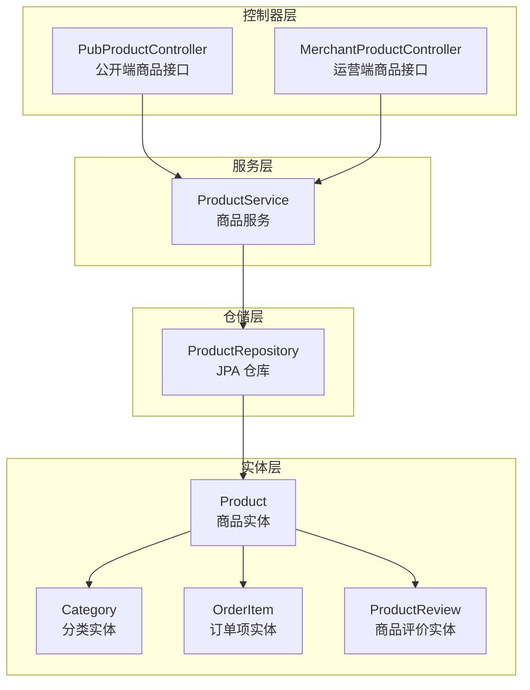
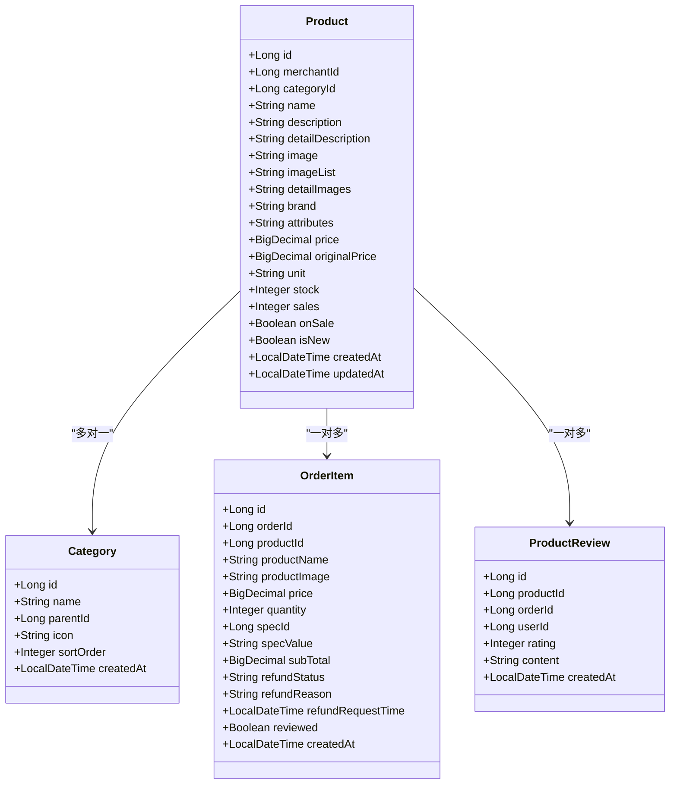
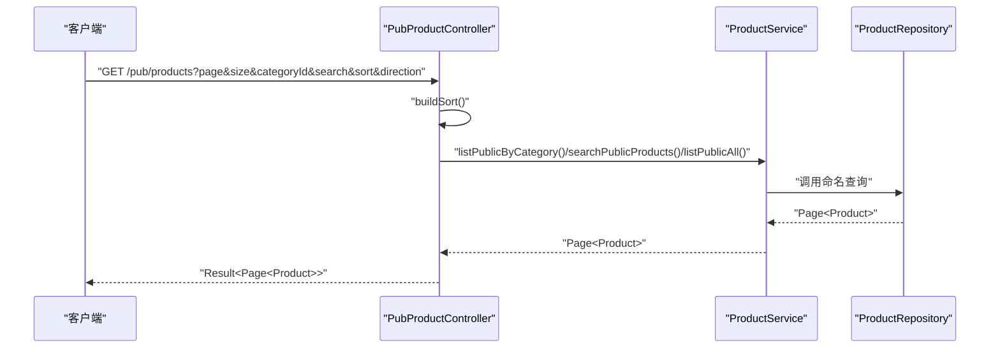
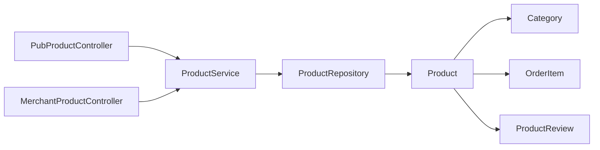

# 商品数据模型

<cite>
**本文引用的文件**
- [Product.java](file://backend/src/main/java/com/mall/entity/Product.java)
- [Category.java](file://backend/src/main/java/com/mall/entity/Category.java)
- [OrderItem.java](file://backend/src/main/java/com/mall/entity/OrderItem.java)
- [ProductReview.java](file://backend/src/main/java/com/mall/entity/ProductReview.java)
- [ProductRepository.java](file://backend/src/main/java/com/mall/repository/ProductRepository.java)
- [ProductService.java](file://backend/src/main/java/com/mall/service/ProductService.java)
- [PubProductController.java](file://backend/src/main/java/com/mall/controller/pub/PubProductController.java)
- [MerchantProductController.java](file://backend/src/main/java/com/mall/controller/merchant/MerchantProductController.java)
- [ProductCreateRequest.java](file://backend/src/main/java/com/mall/dto/ProductCreateRequest.java)
- [application.yml](file://backend/src/main/resources/application.yml)
- [mall.sql](file://mall.sql)
- [banner.sql](file://backend/src/main/resources/banner.sql)
</cite>

## 目录
1. [简介](#简介)
2. [项目结构](#项目结构)
3. [核心组件](#核心组件)
4. [架构总览](#架构总览)
5. [详细组件分析](#详细组件分析)
6. [依赖分析](#依赖分析)
7. [性能考虑](#性能考虑)
8. [故障排查指南](#故障排查指南)
9. [结论](#结论)
10. [附录](#附录)

## 简介
本文件系统性梳理商品数据模型的设计与实现，围绕 Product 实体类展开，覆盖字段定义、JPA 注解、数据类型与约束；阐明商品与分类的多对一关系、商品与订单项的一对多关系、商品与评价的一对多关系；给出数据库表结构、索引策略、外键约束与数据完整性保障；总结查询方法定义与复杂查询优化策略，并补充价格计算与库存管理等业务规则。

## 项目结构
后端采用 Spring Boot + JPA 的分层架构，商品相关代码主要分布在以下包与文件：
- 实体层：com.mall.entity 下的 Product、Category、OrderItem、ProductReview
- 仓储层：com.mall.repository 下的 ProductRepository
- 服务层：com.mall.service 下的 ProductService
- 控制器层：com.mall.controller 下的 PubProductController（公开端）、MerchantProductController（运营端）
- DTO：com.mall.dto 下的 ProductCreateRequest
- 配置：application.yml
- 数据库脚本：mall.sql、banner.sql

图表来源
- [PubProductController.java:15-95](file://backend/src/main/java/com/mall/controller/pub/PubProductController.java#L15-L95)
- [MerchantProductController.java:18-180](file://backend/src/main/java/com/mall/controller/merchant/MerchantProductController.java#L18-L180)
- [ProductService.java:15-126](file://backend/src/main/java/com/mall/service/ProductService.java#L15-L126)
- [ProductRepository.java:12-125](file://backend/src/main/java/com/mall/repository/ProductRepository.java#L12-L125)
- [Product.java:9-101](file://backend/src/main/java/com/mall/entity/Product.java#L9-L101)
- [Category.java:8-41](file://backend/src/main/java/com/mall/entity/Category.java#L8-L41)
- [OrderItem.java:9-73](file://backend/src/main/java/com/mall/entity/OrderItem.java#L9-L73)
- [ProductReview.java:8-44](file://backend/src/main/java/com/mall/entity/ProductReview.java#L8-L44)

章节来源
- [PubProductController.java:15-95](file://backend/src/main/java/com/mall/controller/pub/PubProductController.java#L15-L95)
- [MerchantProductController.java:18-180](file://backend/src/main/java/com/mall/controller/merchant/MerchantProductController.java#L18-L180)
- [ProductService.java:15-126](file://backend/src/main/java/com/mall/service/ProductService.java#L15-L126)
- [ProductRepository.java:12-125](file://backend/src/main/java/com/mall/repository/ProductRepository.java#L12-L125)

## 核心组件
- Product 实体：承载商品基本信息、价格、库存、上下架状态、新品标记、创建/更新时间等
- Category 实体：承载分类信息，支持父子关系与排序
- OrderItem 实体：承载订单项快照，包含购买时的价格、数量、小计、退款状态、是否评价等
- ProductReview 实体：承载商品评价，包含评分、内容、关联用户与订单
- ProductRepository：提供多种查询方法，包括公开端与运营端的筛选、分页、搜索、库存管理等
- ProductService：封装业务逻辑，如公开端商品查询、运营端商品管理、库存查询与低库存预警
- PubProductController / MerchantProductController：对外暴露公开端与运营端商品接口

章节来源
- [Product.java:9-101](file://backend/src/main/java/com/mall/entity/Product.java#L9-L101)
- [Category.java:8-41](file://backend/src/main/java/com/mall/entity/Category.java#L8-L41)
- [OrderItem.java:9-73](file://backend/src/main/java/com/mall/entity/OrderItem.java#L9-L73)
- [ProductReview.java:8-44](file://backend/src/main/java/com/mall/entity/ProductReview.java#L8-L44)
- [ProductRepository.java:12-125](file://backend/src/main/java/com/mall/repository/ProductRepository.java#L12-L125)
- [ProductService.java:15-126](file://backend/src/main/java/com/mall/service/ProductService.java#L15-L126)
- [PubProductController.java:15-95](file://backend/src/main/java/com/mall/controller/pub/PubProductController.java#L15-L95)
- [MerchantProductController.java:18-180](file://backend/src/main/java/com/mall/controller/merchant/MerchantProductController.java#L18-L180)

## 架构总览
商品数据模型在系统中的位置如下：

图表来源
- [Product.java:9-101](file://backend/src/main/java/com/mall/entity/Product.java#L9-L101)
- [Category.java:8-41](file://backend/src/main/java/com/mall/entity/Category.java#L8-L41)
- [OrderItem.java:9-73](file://backend/src/main/java/com/mall/entity/OrderItem.java#L9-L73)
- [ProductReview.java:8-44](file://backend/src/main/java/com/mall/entity/ProductReview.java#L8-L44)

## 详细组件分析

### Product 实体设计
- 设计理念
  - 使用 JPA 注解映射到数据库表，通过 Lombok 简化样板代码
  - 采用 @PrePersist/@PreUpdate 统一设置创建/更新时间
  - 字段覆盖商品核心属性：基础信息、图片集合、品牌、参数、价格体系、库存与销量、状态位
- 字段定义与约束
  - 主键：自增 Long id
  - 商户与分类：merchantId、categoryId（非空/可空视业务场景）
  - 名称与描述：name（非空，长度限制）、description、detailDescription（长文本）
  - 图片：image（主图）、imageList（多图，逗号分隔）、detailImages（详情轮播图）
  - 品牌与参数：brand、attributes（长文本）
  - 价格：price（非空，精度12，标度2）、originalPrice（可空）
  - 计价单位：unit（默认“件”）
  - 库存与销量：stock（默认0）、sales（默认0）
  - 状态：onSale（默认true）、isNew（默认false）
  - 时间戳：createdAt（不可更新）、updatedAt（可更新）
- JPA 注解要点
  - @Entity、@Table(name="product")
  - @Id、@GeneratedValue(strategy=IDENTITY)
  - @Column 定义长度、精度、是否非空、默认值、列定义（如 LONGTEXT/TEXT）
  - @PrePersist/@PreUpdate 设置时间字段
- 业务规则
  - 价格字段使用 BigDecimal，避免浮点误差
  - 默认 onSale=true，便于新商品快速上架
  - 默认 stock/sales=0，保证初始状态清晰

章节来源
- [Product.java:9-101](file://backend/src/main/java/com/mall/entity/Product.java#L9-L101)

### 关系建模与外键约束
- 商品与分类（多对一）
  - Product.categoryId 指向 Category.id
  - Category 支持 parentId，形成树形分类结构
- 商品与订单项（一对多）
  - Product.id → OrderItem.productId
  - 订单项保存购买时的价格、数量、小计、退款状态、是否评价等快照
- 商品与评价（一对多）
  - Product.id → ProductReview.productId
  - 评价包含评分与内容，可关联订单与用户

章节来源
- [Product.java:22-26](file://backend/src/main/java/com/mall/entity/Product.java#L22-L26)
- [OrderItem.java:22-26](file://backend/src/main/java/com/mall/entity/OrderItem.java#L22-L26)
- [ProductReview.java:21-25](file://backend/src/main/java/com/mall/entity/ProductReview.java#L21-L25)

### 数据库表结构与索引策略
- 表结构概览（来自 mall.sql）
  - product：包含 id、merchant_id、category_id、name、description、image、images、specs、colors、detail_description、detail_images、brand、attributes、unit、price、original_price、stock、sales、on_sale、is_new、created_at、updated_at
  - category：包含 id、parent_id、name、icon、sort_order、created_at
  - order_item：包含 id、order_id、product_id、product_name、product_image、price、quantity、spec_id、spec_value、sub_total、refund_status、refund_reason、refund_request_time、reviewed、created_at
  - product_review：包含 id、product_id、order_id、user_id、rating、content、created_at
  - product_spec：包含 id、product_id、spec_name、spec_value、stock、price_delta、spec_image、sort_order、enabled、created_at、updated_at、image、spec_images
  - shop：包含 id、merchant_id、name、description、logo、status、created_at、updated_at
  - sys_user：包含 id、username、password、role、merchant_id、enabled、created_at、updated_at 等
- 索引与外键
  - product：主键 id
  - category：主键 id
  - order_item：主键 id；唯一索引用于购物车去重（用户+商品+规格）
  - product_review：主键 id
  - product_spec：主键 id，索引 idx_product(product_id)，外键 product(id) 级联删除
  - shop：唯一索引 idx_shop_merchant_id(merchant_id)
  - banner：外键 product(id)（参考 banner.sql）

章节来源
- [mall.sql:322-350](file://mall.sql#L322-L350)
- [mall.sql:92-103](file://mall.sql#L92-L103)
- [mall.sql:200-220](file://mall.sql#L200-L220)
- [mall.sql:363-375](file://mall.sql#L363-L375)
- [mall.sql:403-423](file://mall.sql#L403-L423)
- [mall.sql:430-445](file://mall.sql#L430-L445)
- [mall.sql:453-475](file://mall.sql#L453-L475)
- [banner.sql:1-14](file://backend/src/main/resources/banner.sql#L1-L14)

### 查询方法定义与复杂查询优化
- 公开端查询（仅返回 onSale=true 且商户 enabled=true 的商品）
  - 分页查询全部：findPublicOnSale
  - 分类过滤：findPublicByCategory
  - 新品：findPublicNewArrivals（按创建时间倒序）
  - 销量排行：findPublicSalesRank（按销量倒序）
  - 搜索：findPublicByNameContaining（模糊匹配 name 或 description）
  - 单品详情：findPublicById（严格限定 onSale=true 且商户启用）
- 运营端查询（按 merchantId 过滤）
  - 分页查询全部：findByMerchantId
  - 分类过滤：findByCategoryIdAndOnSaleTrue
  - 上架商品：findByOnSaleTrue
  - 搜索与库存组合查询：提供多重重载以支持关键词与库存阈值组合
- 复杂查询优化建议
  - 为高频查询字段建立索引：merchant_id、category_id、on_sale、is_new、sales、stock
  - 使用原生 SQL 或分页 + 排序减少全表扫描
  - 搜索使用 LIKE %keyword% 时，建议配合全文检索或前缀索引
  - 将“公开端”查询统一走 Repository 的命名查询，避免业务层重复逻辑

章节来源
- [ProductRepository.java:12-125](file://backend/src/main/java/com/mall/repository/ProductRepository.java#L12-L125)
- [ProductService.java:15-126](file://backend/src/main/java/com/mall/service/ProductService.java#L15-L126)

### 控制器与业务流程
- 公开端接口（PubProductController）
  - GET /pub/products：分页、分类过滤、关键词搜索、排序
  - GET /pub/products/{id}：公开端详情
  - GET /pub/products/new：新品列表
  - GET /pub/products/rank：销量排行
  - GET /pub/products/recommend：协同过滤推荐
- 运营商端接口（MerchantProductController）
  - GET /merchant/product：按当前登录运营分页查询
  - GET /merchant/product/{id}：校验商品归属
  - POST /merchant/product：创建商品，支持按分类名自动创建分类
  - PUT /merchant/product/{id}：更新商品
  - DELETE /merchant/product/{id}：删除商品
- DTO 与字段映射
  - ProductCreateRequest：封装创建/更新所需字段，含图片列表转 detailImages 的处理

图表来源
- [PubProductController.java:24-46](file://backend/src/main/java/com/mall/controller/pub/PubProductController.java#L24-L46)
- [ProductService.java:42-50](file://backend/src/main/java/com/mall/service/ProductService.java#L42-L50)
- [ProductRepository.java:34-58](file://backend/src/main/java/com/mall/repository/ProductRepository.java#L34-L58)

章节来源
- [PubProductController.java:15-95](file://backend/src/main/java/com/mall/controller/pub/PubProductController.java#L15-L95)
- [MerchantProductController.java:18-180](file://backend/src/main/java/com/mall/controller/merchant/MerchantProductController.java#L18-L180)
- [ProductCreateRequest.java:14-32](file://backend/src/main/java/com/mall/dto/ProductCreateRequest.java#L14-L32)

### 业务规则实现
- 商品状态
  - onSale：控制商品是否对外展示
  - isNew：标记新品
  - reviewed：订单项中标记是否评价
- 价格计算
  - price 为最终销售价，originalPrice 为划线价
  - 订单项中保存购买时的价格与小计，确保历史价格不可篡改
- 库存管理
  - stock：实时库存
  - 提供低库存预警与库存区间查询
  - 运营商端支持批量更新库存与预警查询

章节来源
- [Product.java:57-82](file://backend/src/main/java/com/mall/entity/Product.java#L57-L82)
- [OrderItem.java:34-48](file://backend/src/main/java/com/mall/entity/OrderItem.java#L34-L48)
- [ProductRepository.java:107-124](file://backend/src/main/java/com/mall/repository/ProductRepository.java#L107-L124)
- [MerchantProductController.java:96-113](file://backend/src/main/java/com/mall/controller/merchant/MerchantProductController.java#L96-L113)

## 依赖分析
- 控制器依赖服务，服务依赖仓储，仓储依赖实体
- 商品实体与分类、订单项、评价存在一对一/一对多关系
- 公开端查询依赖商户启用状态，确保数据完整性

图表来源
- [PubProductController.java:15-95](file://backend/src/main/java/com/mall/controller/pub/PubProductController.java#L15-L95)
- [MerchantProductController.java:18-180](file://backend/src/main/java/com/mall/controller/merchant/MerchantProductController.java#L18-L180)
- [ProductService.java:15-126](file://backend/src/main/java/com/mall/service/ProductService.java#L15-L126)
- [ProductRepository.java:12-125](file://backend/src/main/java/com/mall/repository/ProductRepository.java#L12-L125)
- [Product.java:9-101](file://backend/src/main/java/com/mall/entity/Product.java#L9-L101)

章节来源
- [PubProductController.java:15-95](file://backend/src/main/java/com/mall/controller/pub/PubProductController.java#L15-L95)
- [MerchantProductController.java:18-180](file://backend/src/main/java/com/mall/controller/merchant/MerchantProductController.java#L18-L180)
- [ProductService.java:15-126](file://backend/src/main/java/com/mall/service/ProductService.java#L15-L126)
- [ProductRepository.java:12-125](file://backend/src/main/java/com/mall/repository/ProductRepository.java#L12-L125)

## 性能考虑
- 索引策略
  - 为 merchant_id、category_id、on_sale、is_new、sales、stock 建立复合或单独索引
  - 搜索关键词使用前缀索引或全文检索（如需）
- 查询优化
  - 使用分页 + 排序，避免一次性加载大量数据
  - 公开端查询统一走命名查询，减少重复逻辑
  - 对高频字段（如 sales、stock）进行统计汇总，必要时引入缓存
- 存储与类型
  - 价格使用 BigDecimal，库存使用整型，避免精度与溢出问题
  - 图片字段使用 TEXT/LONGTEXT，注意存储路径与 CDN 集成

## 故障排查指南
- 公开端商品为空
  - 检查商品 onSale 是否为 true，商户 enabled 是否为 true
  - 核对公开端查询方法是否正确使用
- 库存不一致
  - 核对库存更新流程与事务边界
  - 检查批量更新库存接口是否正确
- 查询性能差
  - 检查是否缺少必要的索引
  - 评估分页大小与排序字段是否合理
- 数据一致性
  - 订单项保存购买时价格与小计，避免后续修改影响历史数据

章节来源
- [ProductRepository.java:34-58](file://backend/src/main/java/com/mall/repository/ProductRepository.java#L34-L58)
- [ProductRepository.java:107-124](file://backend/src/main/java/com/mall/repository/ProductRepository.java#L107-L124)
- [MerchantProductController.java:96-113](file://backend/src/main/java/com/mall/controller/merchant/MerchantProductController.java#L96-L113)

## 结论
商品数据模型以 Product 为核心，通过清晰的字段定义、严格的 JPA 注解与合理的业务规则，支撑公开端与运营端的完整商品生命周期管理。结合数据库层面的索引与外键约束，以及仓储层的命名查询与服务层的业务封装，实现了高内聚、低耦合、易扩展的数据建模方案。

## 附录
- 配置参考
  - 数据源与 JPA 配置位于 application.yml
- 表结构参考
  - 完整表结构与索引定义见 mall.sql
  - 轮播图与商品关联定义见 banner.sql

章节来源
- [application.yml:1-36](file://backend/src/main/resources/application.yml#L1-L36)
- [mall.sql:322-350](file://mall.sql#L322-L350)
- [banner.sql:1-14](file://backend/src/main/resources/banner.sql#L1-L14)