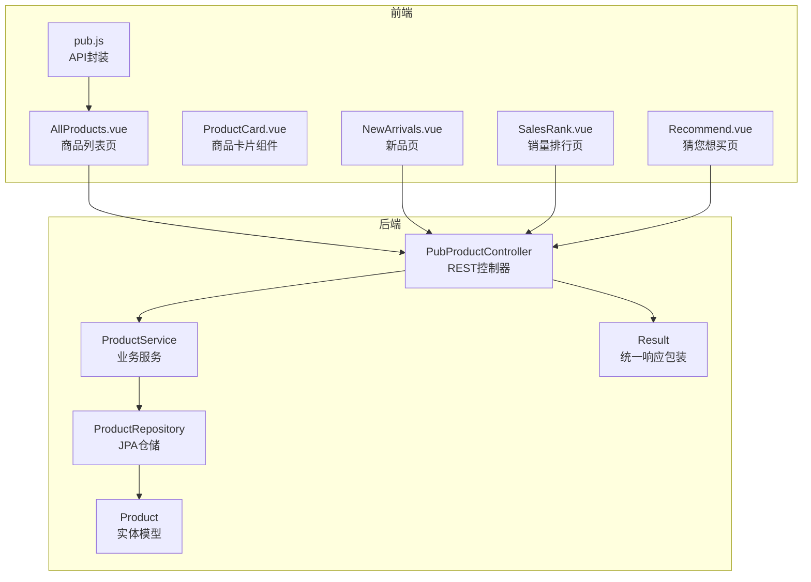
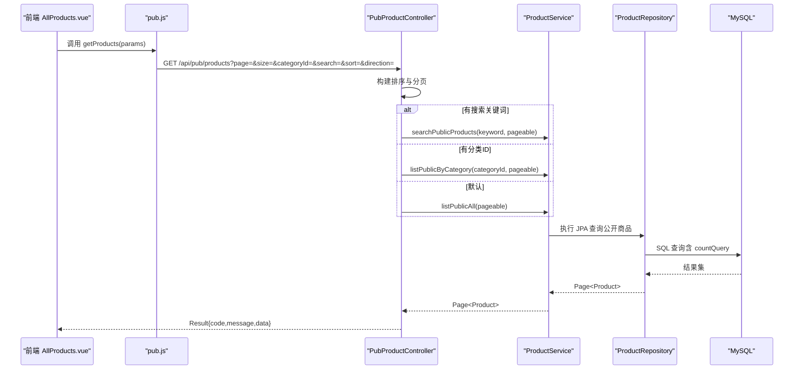
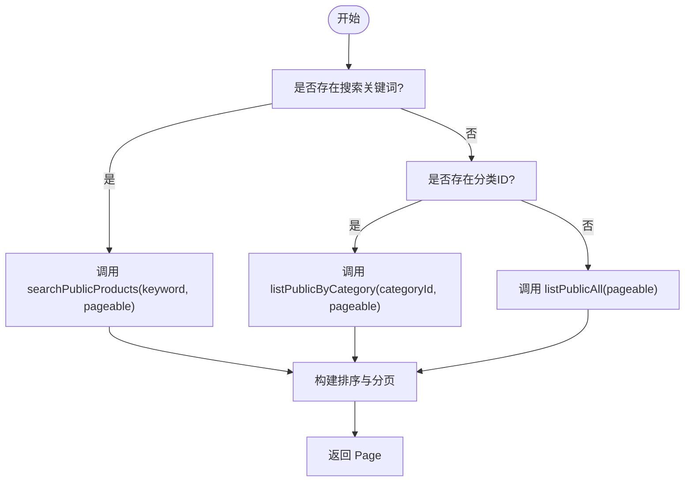
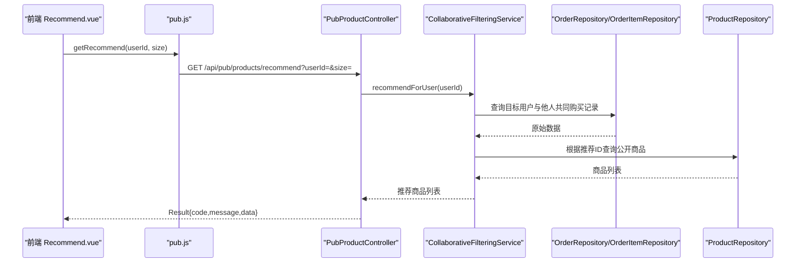
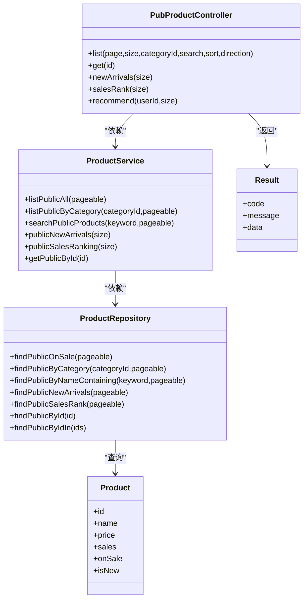

# 商品浏览与搜索

<cite>
**本文引用的文件**
- [PubProductController.java](file://backend/src/main/java/com/mall/controller/pub/PubProductController.java)
- [ProductService.java](file://backend/src/main/java/com/mall/service/ProductService.java)
- [ProductRepository.java](file://backend/src/main/java/com/mall/repository/ProductRepository.java)
- [Product.java](file://backend/src/main/java/com/mall/entity/Product.java)
- [Result.java](file://backend/src/main/java/com/mall/dto/Result.java)
- [application.yml](file://backend/src/main/resources/application.yml)
- [AllProducts.vue](file://frontend/src/views/user/AllProducts.vue)
- [pub.js](file://frontend/src/api/pub.js)
- [ProductCard.vue](file://frontend/src/components/ProductCard.vue)
- [NewArrivals.vue](file://frontend/src/views/user/NewArrivals.vue)
- [SalesRank.vue](file://frontend/src/views/user/SalesRank.vue)
- [Recommend.vue](file://frontend/src/views/user/Recommend.vue)
- [CollaborativeFilteringService.java](file://backend/src/main/java/com/mall/service/CollaborativeFilteringService.java)
</cite>

## 目录
1. [简介](#简介)
2. [项目结构](#项目结构)
3. [核心组件](#核心组件)
4. [架构总览](#架构总览)
5. [详细组件分析](#详细组件分析)
6. [依赖关系分析](#依赖关系分析)
7. [性能考虑](#性能考虑)
8. [故障排查指南](#故障排查指南)
9. [结论](#结论)
10. [附录](#附录)

## 简介
本文件面向开发者，系统性阐述商品浏览与搜索功能的实现细节，包括：
- 商品列表分页查询、条件过滤、搜索功能、排序机制
- PubProductController 中 list、search、get 等核心方法的参数配置、返回值格式、分页逻辑
- 商品搜索算法、关键词匹配、模糊搜索、分类筛选的具体实现
- 前端页面组件的使用示例、API 调用参数说明、搜索结果展示效果
- 新品推荐、销量排行、价格排序等常用查询场景

## 项目结构
后端采用 Spring Boot + Spring Data JPA 架构，控制器位于 `backend/src/main/java/com/mall/controller/pub/`，服务层在 `backend/src/main/java/com/mall/service/`，仓储层在 `backend/src/main/java/com/mall/repository/`，实体模型在 `backend/src/main/java/com/mall/entity/`。前端 Vue 组件位于 `frontend/src/views/user/` 和 `frontend/src/components/`，API 封装在 `frontend/src/api/pub.js`。

图表来源
- [PubProductController.java:1-95](file://backend/src/main/java/com/mall/controller/pub/PubProductController.java#L1-L95)
- [ProductService.java:1-126](file://backend/src/main/java/com/mall/service/ProductService.java#L1-L126)
- [ProductRepository.java:1-125](file://backend/src/main/java/com/mall/repository/ProductRepository.java#L1-L125)
- [Product.java:1-101](file://backend/src/main/java/com/mall/entity/Product.java#L1-L101)
- [Result.java:1-24](file://backend/src/main/java/com/mall/dto/Result.java#L1-L24)
- [pub.js:1-74](file://frontend/src/api/pub.js#L1-L74)
- [AllProducts.vue:1-561](file://frontend/src/views/user/AllProducts.vue#L1-L561)

章节来源
- [application.yml:1-36](file://backend/src/main/resources/application.yml#L1-L36)

## 核心组件
- 控制器层：负责接收前端请求、参数校验、调用服务层、封装统一响应。
- 服务层：聚合业务逻辑，协调仓储层执行查询，处理分页与排序。
- 仓储层：基于 Spring Data JPA 的方法命名约定与自定义查询，实现公开商品的分页、搜索、分类筛选、新品与销量排行等查询。
- 实体层：商品实体包含基础信息、价格、销量、上下架状态、新品标记等字段。
- 前端组件：商品列表页支持搜索、分类筛选、排序；商品卡片组件展示商品信息；新品、销量排行、个性化推荐页面分别调用对应 API。

章节来源
- [PubProductController.java:24-93](file://backend/src/main/java/com/mall/controller/pub/PubProductController.java#L24-L93)
- [ProductService.java:18-125](file://backend/src/main/java/com/mall/service/ProductService.java#L18-L125)
- [ProductRepository.java:13-124](file://backend/src/main/java/com/mall/repository/ProductRepository.java#L13-L124)
- [Product.java:16-99](file://backend/src/main/java/com/mall/entity/Product.java#L16-L99)
- [Result.java:10-23](file://backend/src/main/java/com/mall/dto/Result.java#L10-L23)

## 架构总览
后端 REST 接口统一以 `/api/pub` 作为前缀，控制器将请求参数映射为分页与排序对象，服务层调用仓储层执行数据库查询，最终通过统一响应包装返回给前端。前端通过 pub.js 封装的 API 方法调用后端接口，AllProducts.vue 负责搜索、筛选、排序与分页交互。

图表来源
- [AllProducts.vue:186-217](file://frontend/src/views/user/AllProducts.vue#L186-L217)
- [pub.js:9-11](file://frontend/src/api/pub.js#L9-L11)
- [PubProductController.java:25-46](file://backend/src/main/java/com/mall/controller/pub/PubProductController.java#L25-L46)
- [ProductService.java:43-82](file://backend/src/main/java/com/mall/service/ProductService.java#L43-L82)
- [ProductRepository.java:44-105](file://backend/src/main/java/com/mall/repository/ProductRepository.java#L44-L105)

## 详细组件分析

### PubProductController：商品浏览与搜索核心控制器
- list 方法
  - 参数：page（默认 0）、size（默认 12）、categoryId（可选）、search（可选）、sort（可选）、direction（默认 asc）
  - 分页逻辑：根据 sort 是否为空决定是否应用排序；PageRequest.of(page, size[, sortSpec])
  - 条件优先级：若存在 search，则走搜索；否则若存在 categoryId，则按分类过滤；否则返回全部公开商品
  - 返回值：Result.ok(data)，data 为 Page<Product> 或 List<Product>（新品/销量排行）
- get 方法
  - 查询公开商品详情（上架且运营启用），不存在则返回失败
- 新品与销量排行
  - /pub/products/new：返回新品列表（上架且运营启用）
  - /pub/products/rank：返回销量排行（上架且运营启用）
- 推荐
  - /pub/products/recommend：协同过滤推荐，需传入 userId

章节来源
- [PubProductController.java:24-93](file://backend/src/main/java/com/mall/controller/pub/PubProductController.java#L24-L93)

### ProductService：业务服务层
- 公开商品查询
  - listPublicAll：返回所有上架且运营启用的商品
  - listPublicByCategory：按分类返回上架且运营启用的商品
  - searchPublicProducts：按名称或描述模糊匹配（上架且运营启用）
  - publicNewArrivals/publicSalesRanking：新品与销量排行（上架且运营启用）
- 详情查询
  - getPublicById：仅返回上架且运营启用的商品
- 分页与排序
  - 所有查询均通过 Pageable 传递分页与排序参数

章节来源
- [ProductService.java:43-82](file://backend/src/main/java/com/mall/service/ProductService.java#L43-L82)
- [ProductService.java:28-30](file://backend/src/main/java/com/mall/service/ProductService.java#L28-L30)

### ProductRepository：数据访问层
- 公开商品查询（上架且商家启用）
  - findPublicOnSale：全部公开商品
  - findPublicByCategory：按分类公开商品
  - findPublicNewArrivals：新品（按创建时间倒序）
  - findPublicSalesRank：销量排行（按销量倒序）
  - findPublicById/findPublicByIdIn：公开商品详情与批量查询
  - findPublicByNameContaining：名称或描述模糊匹配（公开商品）
- 分页与计数
  - 使用自定义 countQuery 确保分页总数准确

章节来源
- [ProductRepository.java:44-105](file://backend/src/main/java/com/mall/repository/ProductRepository.java#L44-L105)

### Product：商品实体模型
- 字段要点：id、merchantId、categoryId、name、description、detailDescription、image、imageList、detailImages、brand、attributes、price、originalPrice、unit、stock、sales、onSale、isNew、createdAt、updatedAt
- 业务含义：用于控制商品的上架状态、新品标记、销量统计、价格展示等

章节来源
- [Product.java:16-99](file://backend/src/main/java/com/mall/entity/Product.java#L16-L99)

### 前端组件与 API 使用
- AllProducts.vue
  - 支持搜索框输入、回车触发、清空搜索、分类筛选、排序切换（综合、价格升/降、销量）
  - 分页组件：当 total > pageSize 时显示分页器
  - 请求参数：page、size、categoryId、search、sort、direction
  - 展示：商品网格、空状态提示、建议与返回按钮
- pub.js
  - getProducts：GET /pub/products
  - getProduct：GET /pub/products/:id
  - getNewArrivals：GET /pub/products/new
  - getSalesRank：GET /pub/products/rank
  - getRecommend：GET /pub/products/recommend
- ProductCard.vue
  - 展示商品图片、名称、描述、价格、原价、销量、新品/热销标签
  - 点击进入详情；加入购物车需登录态

章节来源
- [AllProducts.vue:186-261](file://frontend/src/views/user/AllProducts.vue#L186-L261)
- [pub.js:9-31](file://frontend/src/api/pub.js#L9-L31)
- [ProductCard.vue:47-69](file://frontend/src/components/ProductCard.vue#L47-L69)

### 搜索算法与关键词匹配
- 模糊搜索策略
  - 基于名称或描述进行 LIKE 匹配（公开商品）
  - 支持大小写不敏感的模糊匹配
- 排序与方向
  - 支持 price、sales、createdAt 三种字段排序，方向可选 asc/desc
- 分类筛选
  - 通过 categoryId 参数过滤，仅对公开商品生效

图表来源
- [PubProductController.java:25-46](file://backend/src/main/java/com/mall/controller/pub/PubProductController.java#L25-L46)
- [ProductService.java:79-82](file://backend/src/main/java/com/mall/service/ProductService.java#L79-L82)
- [ProductRepository.java:93-105](file://backend/src/main/java/com/mall/repository/ProductRepository.java#L93-L105)

### 推荐系统：协同过滤
- 算法思路
  - 基于“相似购买行为”的协同过滤：统计与目标用户有共同购买记录的其他用户，计算商品的相似度得分并排序
  - 若无足够共同记录，则回退到销量排行
- 接口调用
  - /pub/products/recommend?userId=&size=

图表来源
- [Recommend.vue:26-31](file://frontend/src/views/user/Recommend.vue#L26-L31)
- [pub.js:29-31](file://frontend/src/api/pub.js#L29-L31)
- [PubProductController.java:85-93](file://backend/src/main/java/com/mall/controller/pub/PubProductController.java#L85-L93)
- [CollaborativeFilteringService.java:32-75](file://backend/src/main/java/com/mall/service/CollaborativeFilteringService.java#L32-L75)

## 依赖关系分析
- 控制器依赖服务层，服务层依赖仓储层，仓储层依赖 JPA 与数据库
- 前端通过 pub.js 统一调用后端 REST 接口
- 统一响应包装 Result 提供一致的返回结构

图表来源
- [PubProductController.java:21-22](file://backend/src/main/java/com/mall/controller/pub/PubProductController.java#L21-L22)
- [ProductService.java:20-20](file://backend/src/main/java/com/mall/service/ProductService.java#L20-L20)
- [ProductRepository.java:13-13](file://backend/src/main/java/com/mall/repository/ProductRepository.java#L13-L13)
- [Product.java:16-99](file://backend/src/main/java/com/mall/entity/Product.java#L16-L99)
- [Result.java:10-23](file://backend/src/main/java/com/mall/dto/Result.java#L10-L23)

## 性能考虑
- 分页与排序
  - 使用 PageRequest 与 Sort，避免一次性加载全量数据
  - 排序字段限定在 price、sales、createdAt，减少索引与排序成本
- 搜索优化
  - 模糊匹配使用 LIKE，建议在 name、description 上建立合适的索引
  - countQuery 与实际查询分离，保证分页总数准确
- 推荐系统
  - 协同过滤涉及跨表统计，建议对订单与订单项表建立合适索引，必要时缓存热门商品
- 前端渲染
  - 商品卡片组件懒加载与点击跳转，减少不必要的 DOM 更新

## 故障排查指南
- 响应格式
  - 后端统一返回 Result，前端需判断 code 与 data 结构，避免直接使用 data.content
- 分页异常
  - page 从 0 开始，前端 pagination 组件 current-page 需加 1
- 搜索无结果
  - 检查 search 参数是否为空字符串；确认商品处于上架且运营启用状态
- 排序无效
  - 确认 sort 字段为 price/sales/createdAt，direction 为 asc/desc
- 推荐为空
  - 用户无历史购买记录时会回退到销量排行；确保用户已下单并完成收货

章节来源
- [AllProducts.vue:196-216](file://frontend/src/views/user/AllProducts.vue#L196-L216)
- [Result.java:16-22](file://backend/src/main/java/com/mall/dto/Result.java#L16-L22)
- [CollaborativeFilteringService.java:62-79](file://backend/src/main/java/com/mall/service/CollaborativeFilteringService.java#L62-L79)

## 结论
该商品浏览与搜索模块通过清晰的分层设计实现了稳定的分页、筛选、搜索与排序能力，并提供了新品、销量排行与个性化推荐等常用场景。前后端通过统一的 API 规范协作，前端组件具备良好的可扩展性与用户体验。建议后续在搜索与推荐场景引入缓存与索引优化，进一步提升性能与稳定性。

## 附录

### API 定义与参数说明
- GET /api/pub/products
  - 参数：page（默认 0）、size（默认 12）、categoryId（可选）、search（可选）、sort（可选）、direction（默认 asc）
  - 返回：Result{code,message,data}，data 为 Page<Product>
- GET /api/pub/products/:id
  - 返回：Result{code,message,data}，data 为 Product 或失败信息
- GET /api/pub/products/new?size=
  - 返回：Result{code,message,data}，data 为 List<Product>
- GET /api/pub/products/rank?size=
  - 返回：Result{code,message,data}，data 为 List<Product>
- GET /api/pub/products/recommend?userId=&size=
  - 返回：Result{code,message,data}，data 为 List<Product>

章节来源
- [PubProductController.java:25-93](file://backend/src/main/java/com/mall/controller/pub/PubProductController.java#L25-L93)
- [pub.js:9-31](file://frontend/src/api/pub.js#L9-L31)

### 常用查询场景示例
- 全部商品分页：GET /api/pub/products?page=0&size=12
- 按分类筛选：GET /api/pub/products?categoryId=1&page=0&size=12
- 搜索商品：GET /api/pub/products?search=关键词&page=0&size=12
- 价格升序：GET /api/pub/products?sort=price&direction=asc&page=0&size=12
- 价格降序：GET /api/pub/products?sort=price&direction=desc&page=0&size=12
- 销量排行：GET /api/pub/products?sort=sales&direction=desc&page=0&size=12
- 新品上架：GET /api/pub/products/new?size=10
- 销量排行：GET /api/pub/products/rank?size=10
- 个性化推荐：GET /api/pub/products/recommend?userId=1&size=20

章节来源
- [AllProducts.vue:188-196](file://frontend/src/views/user/AllProducts.vue#L188-L196)
- [pub.js:9-31](file://frontend/src/api/pub.js#L9-L31)