# 商品管理系统

<cite>
**本文档引用的文件**
- [Product.java](file://backend/src/main/java/com/mall/entity/Product.java)
- [Category.java](file://backend/src/main/java/com/mall/entity/Category.java)
- [ProductService.java](file://backend/src/main/java/com/mall/service/ProductService.java)
- [ProductRepository.java](file://backend/src/main/java/com/mall/repository/ProductRepository.java)
- [CategoryRepository.java](file://backend/src/main/java/com/mall/repository/CategoryRepository.java)
- [PubProductController.java](file://backend/src/main/java/com/mall/controller/pub/PubProductController.java)
- [AdminCategoryController.java](file://backend/src/main/java/com/mall/controller/admin/AdminCategoryController.java)
- [ImageController.java](file://backend/src/main/java/com/mall/controller/pub/ImageController.java)
- [CollaborativeFilteringService.java](file://backend/src/main/java/com/mall/service/CollaborativeFilteringService.java)
- [application.yml](file://backend/src/main/resources/application.yml)
- [Result.java](file://backend/src/main/java/com/mall/dto/Result.java)
- [AllProducts.vue](file://frontend/src/views/user/AllProducts.vue)
- [pub.js](file://frontend/src/api/pub.js)
- [ProductCard.vue](file://frontend/src/components/ProductCard.vue)
- [ProductUploadDialog.vue](file://frontend/src/components/merchant/ProductUploadDialog.vue)
- [Products.vue（商户）](file://frontend/src/views/merchant/Products.vue)
- [Products.vue（管理员）](file://frontend/src/views/admin/Products.vue)
- [MerchantInventoryController.java](file://backend/src/main/java/com/mall/controller/merchant/MerchantInventoryController.java)
- [MerchantProductController.java](file://backend/src/main/java/com/mall/controller/merchant/MerchantProductController.java)
</cite>

## 目录
1. [简介](#简介)
2. [项目结构](#项目结构)
3. [核心组件](#核心组件)
4. [架构总览](#架构总览)
5. [详细组件分析](#详细组件分析)
6. [依赖关系分析](#依赖关系分析)
7. [性能考虑](#性能考虑)
8. [故障排查指南](#故障排查指南)
9. [结论](#结论)
10. [附录](#附录)

## 简介
本系统是一个基于 Spring Boot + Vue 的商品管理系统，覆盖商品浏览搜索、商品详情展示、商品分类管理、商品上下架、商品信息维护、库存管理、图片上传处理以及推荐系统集成等完整功能链路。后端提供 REST API，前端采用 Element Plus 组件库实现用户、商户、管理员三类角色的界面与交互。

## 项目结构
- 后端采用分层架构：controller（控制层）、service（业务层）、repository（数据访问层）、entity（实体模型）、dto（数据传输对象）、config（配置）、security（安全）。
- 前端采用 Vue 3 + Element Plus，按角色划分布局与视图组件，公共 API 封装在统一模块中。

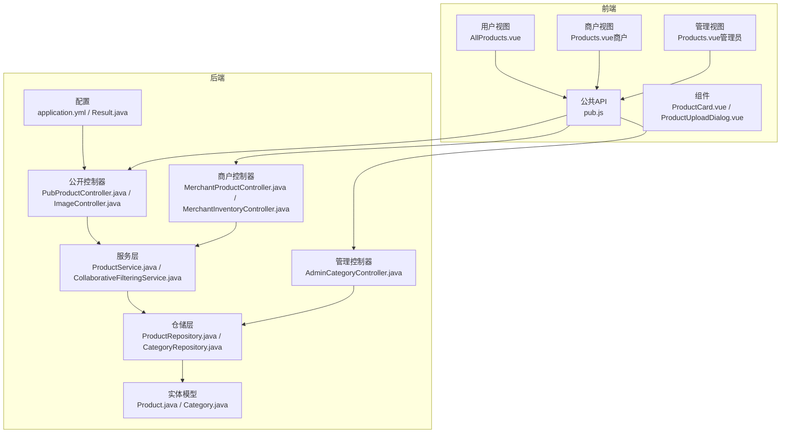

图表来源
- [AllProducts.vue:1-561](file://frontend/src/views/user/AllProducts.vue#L1-L561)
- [pub.js:1-74](file://frontend/src/api/pub.js#L1-L74)
- [ProductCard.vue:1-261](file://frontend/src/components/ProductCard.vue#L1-L261)
- [ProductUploadDialog.vue:403-667](file://frontend/src/components/merchant/ProductUploadDialog.vue#L403-L667)
- [Products.vue（商户）:118-206](file://frontend/src/views/merchant/Products.vue#L118-L206)
- [Products.vue（管理员）:79-137](file://frontend/src/views/admin/Products.vue#L79-L137)
- [PubProductController.java:1-95](file://backend/src/main/java/com/mall/controller/pub/PubProductController.java#L1-L95)
- [ImageController.java:1-155](file://backend/src/main/java/com/mall/controller/pub/ImageController.java#L1-L155)
- [MerchantProductController.java:1-67](file://backend/src/main/java/com/mall/controller/merchant/MerchantProductController.java#L1-L67)
- [MerchantInventoryController.java:1-69](file://backend/src/main/java/com/mall/controller/merchant/MerchantInventoryController.java#L1-L69)
- [AdminCategoryController.java:1-47](file://backend/src/main/java/com/mall/controller/admin/AdminCategoryController.java#L1-L47)
- [ProductService.java:1-126](file://backend/src/main/java/com/mall/service/ProductService.java#L1-L126)
- [ProductRepository.java:1-125](file://backend/src/main/java/com/mall/repository/ProductRepository.java#L1-L125)
- [CategoryRepository.java:1-17](file://backend/src/main/java/com/mall/repository/CategoryRepository.java#L1-L17)
- [Product.java:1-101](file://backend/src/main/java/com/mall/entity/Product.java#L1-L101)
- [Category.java:1-41](file://backend/src/main/java/com/mall/entity/Category.java#L1-L41)
- [application.yml:1-36](file://backend/src/main/resources/application.yml#L1-L36)
- [Result.java:1-24](file://backend/src/main/java/com/mall/dto/Result.java#L1-L24)

章节来源
- [application.yml:1-36](file://backend/src/main/resources/application.yml#L1-L36)

## 核心组件
- 数据模型：商品（Product）与分类（Category），包含基础字段、图片与属性、上下架状态、库存与销量等。
- 业务服务：商品服务（ProductService）负责查询、分页、搜索、排序、库存管理、推荐等；协同过滤服务（CollaborativeFilteringService）提供“猜您想买”推荐。
- 控制器：公开接口（PubProductController、ImageController）面向用户端；商户接口（MerchantProductController、MerchantInventoryController）面向运营端；管理接口（AdminCategoryController）面向后台管理。
- 前端视图：用户端商品列表与搜索、商户端商品管理与库存、管理员端分类管理；统一 API 封装（pub.js）与通用组件（ProductCard.vue、ProductUploadDialog.vue）。

章节来源
- [Product.java:1-101](file://backend/src/main/java/com/mall/entity/Product.java#L1-L101)
- [Category.java:1-41](file://backend/src/main/java/com/mall/entity/Category.java#L1-L41)
- [ProductService.java:1-126](file://backend/src/main/java/com/mall/service/ProductService.java#L1-L126)
- [CollaborativeFilteringService.java:1-81](file://backend/src/main/java/com/mall/service/CollaborativeFilteringService.java#L1-L81)
- [PubProductController.java:1-95](file://backend/src/main/java/com/mall/controller/pub/PubProductController.java#L1-L95)
- [ImageController.java:1-155](file://backend/src/main/java/com/mall/controller/pub/ImageController.java#L1-L155)
- [MerchantProductController.java:1-67](file://backend/src/main/java/com/mall/controller/merchant/MerchantProductController.java#L1-L67)
- [MerchantInventoryController.java:1-69](file://backend/src/main/java/com/mall/controller/merchant/MerchantInventoryController.java#L1-L69)
- [AdminCategoryController.java:1-47](file://backend/src/main/java/com/mall/controller/admin/AdminCategoryController.java#L1-L47)
- [AllProducts.vue:1-561](file://frontend/src/views/user/AllProducts.vue#L1-L561)
- [pub.js:1-74](file://frontend/src/api/pub.js#L1-L74)
- [ProductCard.vue:1-261](file://frontend/src/components/ProductCard.vue#L1-L261)
- [ProductUploadDialog.vue:403-667](file://frontend/src/components/merchant/ProductUploadDialog.vue#L403-L667)

## 架构总览
系统采用前后端分离架构，后端以 Spring MVC 提供 REST API，前端通过 axios 封装的 request 发起请求。商品数据通过 JPA 仓库访问数据库，公开接口限定“上架且运营启用”，推荐通过协同过滤算法实现。

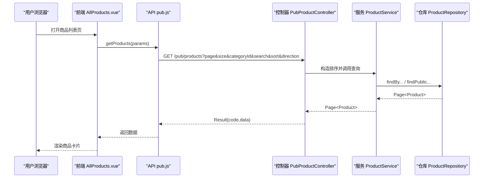

图表来源
- [AllProducts.vue:186-217](file://frontend/src/views/user/AllProducts.vue#L186-L217)
- [pub.js:8-11](file://frontend/src/api/pub.js#L8-L11)
- [PubProductController.java:24-46](file://backend/src/main/java/com/mall/controller/pub/PubProductController.java#L24-L46)
- [ProductService.java:32-50](file://backend/src/main/java/com/mall/service/ProductService.java#L32-L50)
- [ProductRepository.java:17-27](file://backend/src/main/java/com/mall/repository/ProductRepository.java#L17-L27)

## 详细组件分析

### 商品数据模型设计
- 商品实体（Product）包含基础信息（名称、描述、品牌）、价格体系（现价/原价）、库存与销量、上下架状态、新品标识、图片字段（主图、详情图列表、轮播图）、属性参数、时间戳等。
- 分类实体（Category）包含名称、父级分类、图标、排序、时间戳等，支持树形结构与排序。

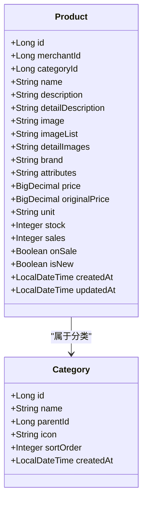

图表来源
- [Product.java:16-100](file://backend/src/main/java/com/mall/entity/Product.java#L16-L100)
- [Category.java:15-41](file://backend/src/main/java/com/mall/entity/Category.java#L15-L41)

章节来源
- [Product.java:1-101](file://backend/src/main/java/com/mall/entity/Product.java#L1-L101)
- [Category.java:1-41](file://backend/src/main/java/com/mall/entity/Category.java#L1-L41)

### 商品浏览与搜索
- 公开接口支持分页、分类过滤、关键词搜索、排序（价格、销量、时间）。
- 用户端查询限定“上架且运营启用”，保证展示商品的有效性。
- 支持新品与销量排行查询，以及“猜您想买”个性化推荐。

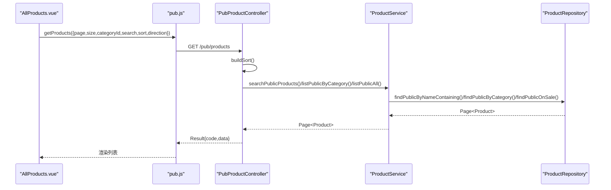

图表来源
- [AllProducts.vue:186-217](file://frontend/src/views/user/AllProducts.vue#L186-L217)
- [pub.js:8-11](file://frontend/src/api/pub.js#L8-L11)
- [PubProductController.java:24-61](file://backend/src/main/java/com/mall/controller/pub/PubProductController.java#L24-L61)
- [ProductService.java:79-82](file://backend/src/main/java/com/mall/service/ProductService.java#L79-L82)
- [ProductRepository.java:93-105](file://backend/src/main/java/com/mall/repository/ProductRepository.java#L93-L105)

章节来源
- [PubProductController.java:1-95](file://backend/src/main/java/com/mall/controller/pub/PubProductController.java#L1-L95)
- [ProductService.java:1-126](file://backend/src/main/java/com/mall/service/ProductService.java#L1-L126)
- [ProductRepository.java:1-125](file://backend/src/main/java/com/mall/repository/ProductRepository.java#L1-L125)
- [AllProducts.vue:1-561](file://frontend/src/views/user/AllProducts.vue#L1-L561)
- [pub.js:1-74](file://frontend/src/api/pub.js#L1-L74)

### 商品详情展示
- 公开详情接口仅返回“上架且运营启用”的商品，保障线上一致性。
- 前端通过路由参数进入详情页，调用公开接口获取商品详情。

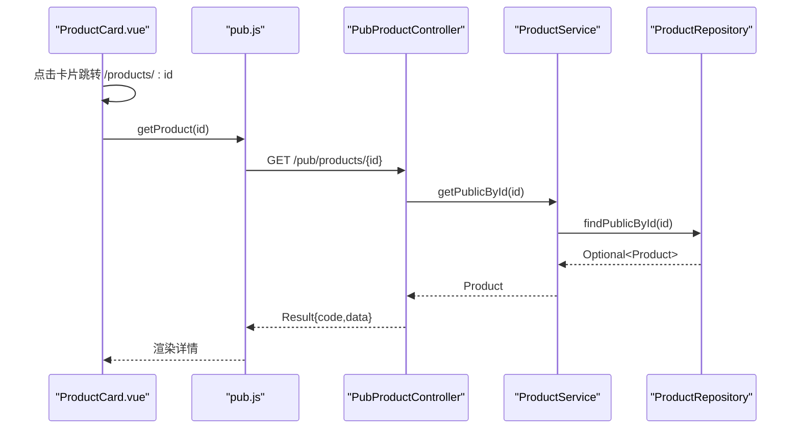

图表来源
- [ProductCard.vue:52-54](file://frontend/src/components/ProductCard.vue#L52-L54)
- [pub.js:13-16](file://frontend/src/api/pub.js#L13-L16)
- [PubProductController.java:63-69](file://backend/src/main/java/com/mall/controller/pub/PubProductController.java#L63-L69)
- [ProductService.java:27-30](file://backend/src/main/java/com/mall/service/ProductService.java#L27-L30)
- [ProductRepository.java:85-91](file://backend/src/main/java/com/mall/repository/ProductRepository.java#L85-L91)

章节来源
- [PubProductController.java:63-69](file://backend/src/main/java/com/mall/controller/pub/PubProductController.java#L63-L69)
- [ProductService.java:27-30](file://backend/src/main/java/com/mall/service/ProductService.java#L27-L30)
- [ProductRepository.java:85-91](file://backend/src/main/java/com/mall/repository/ProductRepository.java#L85-L91)
- [ProductCard.vue:1-261](file://frontend/src/components/ProductCard.vue#L1-L261)

### 商品分类管理
- 管理端提供分类的增删改查接口，支持按父级查询与排序。
- 前端商户与管理员页面可联动分类数据，用于商品发布与管理。

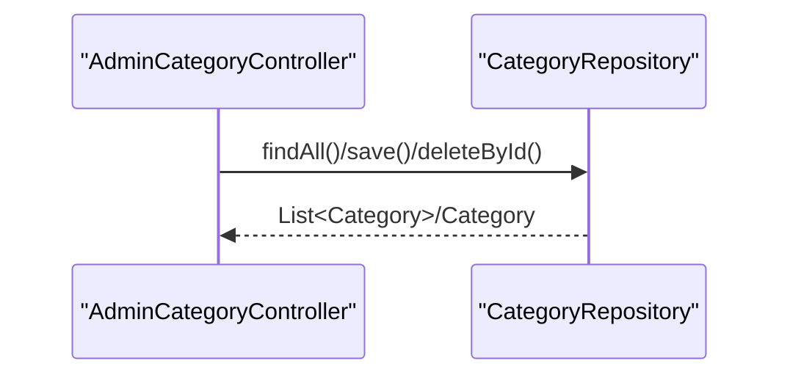

图表来源
- [AdminCategoryController.java:1-47](file://backend/src/main/java/com/mall/controller/admin/AdminCategoryController.java#L1-L47)
- [CategoryRepository.java:1-17](file://backend/src/main/java/com/mall/repository/CategoryRepository.java#L1-L17)

章节来源
- [AdminCategoryController.java:1-47](file://backend/src/main/java/com/mall/controller/admin/AdminCategoryController.java#L1-L47)
- [CategoryRepository.java:1-17](file://backend/src/main/java/com/mall/repository/CategoryRepository.java#L1-L17)

### 商品上下架与信息维护
- 商户端可查询、创建、更新、删除自有商品，支持按分类名自动创建分类。
- 商品信息包括名称、描述、详情、价格、库存、品牌、图片、属性、上下架状态、新品标识等。

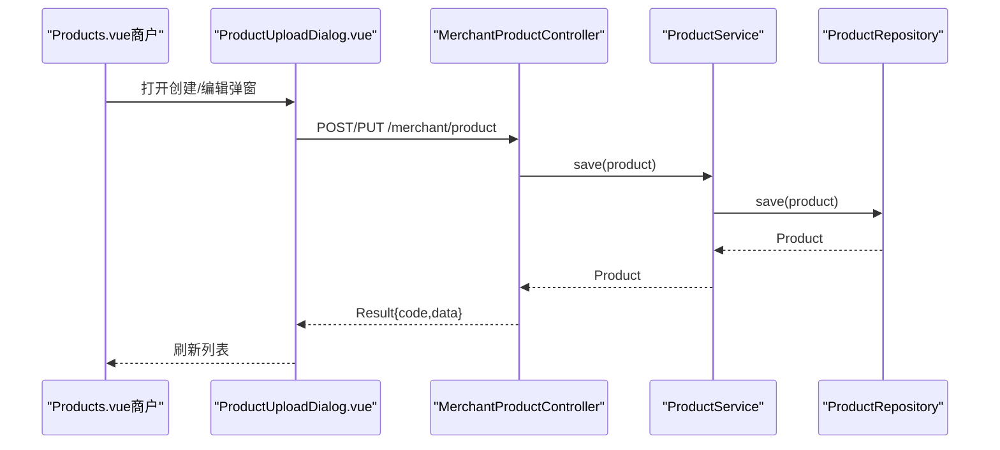

图表来源
- [Products.vue（商户）:176-206](file://frontend/src/views/merchant/Products.vue#L176-L206)
- [ProductUploadDialog.vue:621-658](file://frontend/src/components/merchant/ProductUploadDialog.vue#L621-L658)
- [MerchantProductController.java:56-67](file://backend/src/main/java/com/mall/controller/merchant/MerchantProductController.java#L56-L67)
- [ProductService.java:84-87](file://backend/src/main/java/com/mall/service/ProductService.java#L84-L87)
- [ProductRepository.java:13-13](file://backend/src/main/java/com/mall/repository/ProductRepository.java#L13-L13)

章节来源
- [MerchantProductController.java:1-67](file://backend/src/main/java/com/mall/controller/merchant/MerchantProductController.java#L1-L67)
- [Products.vue（商户）:118-206](file://frontend/src/views/merchant/Products.vue#L118-L206)
- [ProductUploadDialog.vue:403-667](file://frontend/src/components/merchant/ProductUploadDialog.vue#L403-L667)
- [ProductService.java:84-87](file://backend/src/main/java/com/mall/service/ProductService.java#L84-L87)
- [ProductRepository.java:13-13](file://backend/src/main/java/com/mall/repository/ProductRepository.java#L13-L13)

### 商品库存管理
- 商户端可分页查询库存、按关键字与库存状态筛选、调整库存。
- 库存状态：缺货（0）、低库存（1，1-10）、正常（>10）。

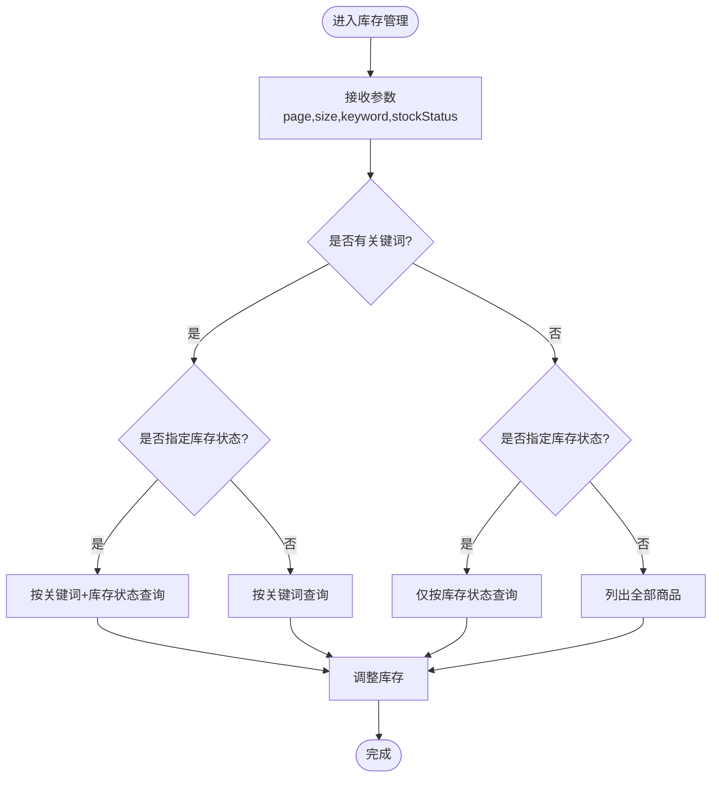

图表来源
- [MerchantInventoryController.java:33-69](file://backend/src/main/java/com/mall/controller/merchant/MerchantInventoryController.java#L33-L69)
- [ProductService.java:94-119](file://backend/src/main/java/com/mall/service/ProductService.java#L94-L119)

章节来源
- [MerchantInventoryController.java:1-69](file://backend/src/main/java/com/mall/controller/merchant/MerchantInventoryController.java#L1-L69)
- [ProductService.java:94-119](file://backend/src/main/java/com/mall/service/ProductService.java#L94-L119)

### 图片上传处理
- 公开图片接口支持上传、列出与查看图片，上传后返回可访问 URL。
- 前端在商品详情编辑器中集成图片上传，支持主图与详情图多图上传。

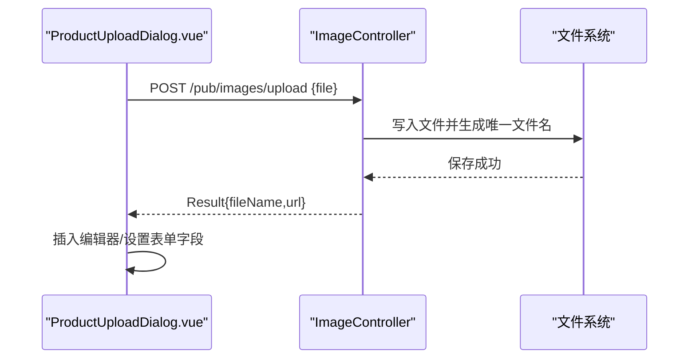

图表来源
- [ProductUploadDialog.vue:403-430](file://frontend/src/components/merchant/ProductUploadDialog.vue#L403-L430)
- [ImageController.java:107-153](file://backend/src/main/java/com/mall/controller/pub/ImageController.java#L107-L153)

章节来源
- [ImageController.java:1-155](file://backend/src/main/java/com/mall/controller/pub/ImageController.java#L1-L155)
- [ProductUploadDialog.vue:403-667](file://frontend/src/components/merchant/ProductUploadDialog.vue#L403-L667)

### 推荐系统集成
- “猜您想买”基于协同过滤算法：统计与当前用户有共同购买记录的其他用户，按共同项数量给商品打分并排序，若无匹配则回退到销量排行。
- 需传入用户 ID（登录态）以进行个性化推荐。

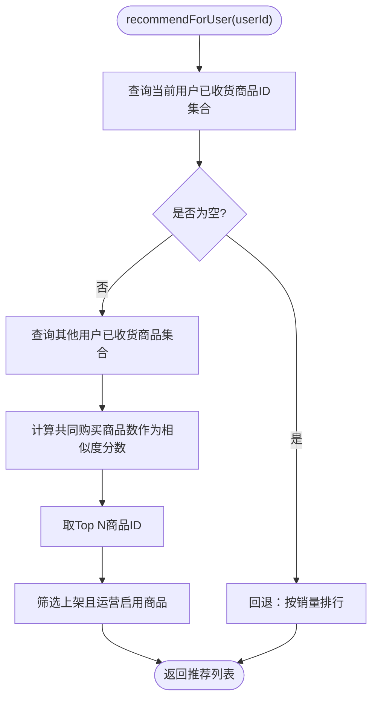

图表来源
- [CollaborativeFilteringService.java:32-75](file://backend/src/main/java/com/mall/service/CollaborativeFilteringService.java#L32-L75)
- [ProductRepository.java:77-83](file://backend/src/main/java/com/mall/repository/ProductRepository.java#L77-L83)

章节来源
- [CollaborativeFilteringService.java:1-81](file://backend/src/main/java/com/mall/service/CollaborativeFilteringService.java#L1-L81)
- [ProductRepository.java:77-83](file://backend/src/main/java/com/mall/repository/ProductRepository.java#L77-L83)

## 依赖关系分析
- 控制器依赖服务层；服务层依赖仓库层；仓库层访问实体模型。
- 前端通过统一 API 模块调用后端控制器，视图组件复用通用组件。
- 配置文件定义数据库连接、JPA、日志与 JWT 等全局参数。

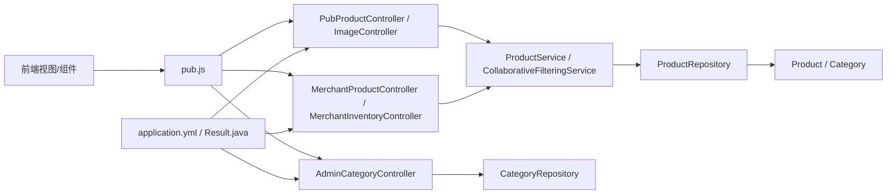

图表来源
- [pub.js:1-74](file://frontend/src/api/pub.js#L1-L74)
- [PubProductController.java:1-95](file://backend/src/main/java/com/mall/controller/pub/PubProductController.java#L1-L95)
- [ImageController.java:1-155](file://backend/src/main/java/com/mall/controller/pub/ImageController.java#L1-L155)
- [MerchantProductController.java:1-67](file://backend/src/main/java/com/mall/controller/merchant/MerchantProductController.java#L1-L67)
- [MerchantInventoryController.java:1-69](file://backend/src/main/java/com/mall/controller/merchant/MerchantInventoryController.java#L1-L69)
- [AdminCategoryController.java:1-47](file://backend/src/main/java/com/mall/controller/admin/AdminCategoryController.java#L1-L47)
- [ProductService.java:1-126](file://backend/src/main/java/com/mall/service/ProductService.java#L1-L126)
- [CollaborativeFilteringService.java:1-81](file://backend/src/main/java/com/mall/service/CollaborativeFilteringService.java#L1-L81)
- [ProductRepository.java:1-125](file://backend/src/main/java/com/mall/repository/ProductRepository.java#L1-L125)
- [CategoryRepository.java:1-17](file://backend/src/main/java/com/mall/repository/CategoryRepository.java#L1-L17)
- [Product.java:1-101](file://backend/src/main/java/com/mall/entity/Product.java#L1-L101)
- [Category.java:1-41](file://backend/src/main/java/com/mall/entity/Category.java#L1-L41)
- [application.yml:1-36](file://backend/src/main/resources/application.yml#L1-L36)
- [Result.java:1-24](file://backend/src/main/java/com/mall/dto/Result.java#L1-L24)

章节来源
- [application.yml:1-36](file://backend/src/main/resources/application.yml#L1-L36)
- [Result.java:1-24](file://backend/src/main/java/com/mall/dto/Result.java#L1-L24)

## 性能考虑
- 分页与排序：后端统一使用 PageRequest 与 Sort，前端默认每页 12 条，避免一次性加载过多数据。
- 查询优化：公开接口通过 JPQL 限制“上架且运营启用”，减少无效数据扫描。
- 推荐回退：当协同过滤无结果时回退销量排行，保证推荐体验。
- 图片存储：上传后生成唯一文件名并返回可访问 URL，便于缓存与 CDN 加速。

## 故障排查指南
- 图片上传失败
  - 检查文件类型是否为允许格式（jpg, jpeg, png, gif, webp, bmp）。
  - 确认上传路径存在且具备写权限。
  - 查看后端日志与返回的错误消息。
- 商品搜索无结果
  - 确认关键词不为空，且商品处于“上架且运营启用”状态。
  - 检查是否传入了错误的分类 ID 或排序字段。
- 推荐为空
  - 登录用户需提供 userId 参数。
  - 若用户无历史购买记录，将回退到销量排行。
- 库存调整失败
  - 确保库存数量非负，且操作的商品属于当前商户。
  - 检查权限与商品是否存在。

章节来源
- [ImageController.java:107-153](file://backend/src/main/java/com/mall/controller/pub/ImageController.java#L107-L153)
- [PubProductController.java:24-61](file://backend/src/main/java/com/mall/controller/pub/PubProductController.java#L24-L61)
- [CollaborativeFilteringService.java:32-75](file://backend/src/main/java/com/mall/service/CollaborativeFilteringService.java#L32-L75)
- [MerchantInventoryController.java:46-69](file://backend/src/main/java/com/mall/controller/merchant/MerchantInventoryController.java#L46-L69)

## 结论
该商品管理系统围绕商品全生命周期展开，从前端浏览搜索、详情展示，到后端商品与分类管理、库存与图片处理，再到推荐系统与权限控制，形成了完整的功能闭环。通过清晰的分层架构与统一的 API 设计，开发者可以快速扩展与维护系统功能。

## 附录

### API 调用示例（路径）
- 获取公开商品列表
  - 方法：GET
  - 路径：/pub/products
  - 参数：page, size, categoryId（可选）, search（可选）, sort（可选）, direction（默认 asc）
  - 示例路径参考：[pub.js:8-11](file://frontend/src/api/pub.js#L8-L11)
- 获取商品详情
  - 方法：GET
  - 路径：/pub/products/{id}
  - 示例路径参考：[pub.js:13-16](file://frontend/src/api/pub.js#L13-L16)
- 获取新品列表
  - 方法：GET
  - 路径：/pub/products/new
  - 参数：size（默认 10）
  - 示例路径参考：[pub.js:18-21](file://frontend/src/api/pub.js#L18-L21)
- 获取销量排行
  - 方法：GET
  - 路径：/pub/products/rank
  - 参数：size（默认 10）
  - 示例路径参考：[pub.js:23-26](file://frontend/src/api/pub.js#L23-L26)
- 个性化推荐
  - 方法：GET
  - 路径：/pub/products/recommend
  - 参数：userId（必填）, size（默认 20）
  - 示例路径参考：[pub.js:28-31](file://frontend/src/api/pub.js#L28-L31)
- 图片上传
  - 方法：POST
  - 路径：/pub/images/upload
  - 参数：file（必填）
  - 示例路径参考：[ImageController.java:107-153](file://backend/src/main/java/com/mall/controller/pub/ImageController.java#L107-L153)
- 商户商品列表
  - 方法：GET
  - 路径：/merchant/product
  - 参数：page, size
  - 示例路径参考：[MerchantProductController.java:36-44](file://backend/src/main/java/com/mall/controller/merchant/MerchantProductController.java#L36-L44)
- 商户库存查询
  - 方法：GET
  - 路径：/merchant/inventory
  - 参数：page, size, keyword（可选）, stockStatus（可选）
  - 示例路径参考：[MerchantInventoryController.java:33-44](file://backend/src/main/java/com/mall/controller/merchant/MerchantInventoryController.java#L33-L44)
- 管理端分类管理
  - 方法：GET/POST/PUT/DELETE
  - 路径：/admin/category
  - 示例路径参考：[AdminCategoryController.java:20-45](file://backend/src/main/java/com/mall/controller/admin/AdminCategoryController.java#L20-L45)

### 商品管理界面截图
- 用户端商品列表与搜索、分类筛选、排序与分页
  - 截图位置参考：[AllProducts.vue:1-561](file://frontend/src/views/user/AllProducts.vue#L1-L561)
- 商户端商品管理与创建/编辑弹窗
  - 截图位置参考：[Products.vue（商户）:118-206](file://frontend/src/views/merchant/Products.vue#L118-L206)、[ProductUploadDialog.vue:403-667](file://frontend/src/components/merchant/ProductUploadDialog.vue#L403-L667)
- 管理端分类管理
  - 截图位置参考：[Products.vue（管理员）:79-137](file://frontend/src/views/admin/Products.vue#L79-L137)