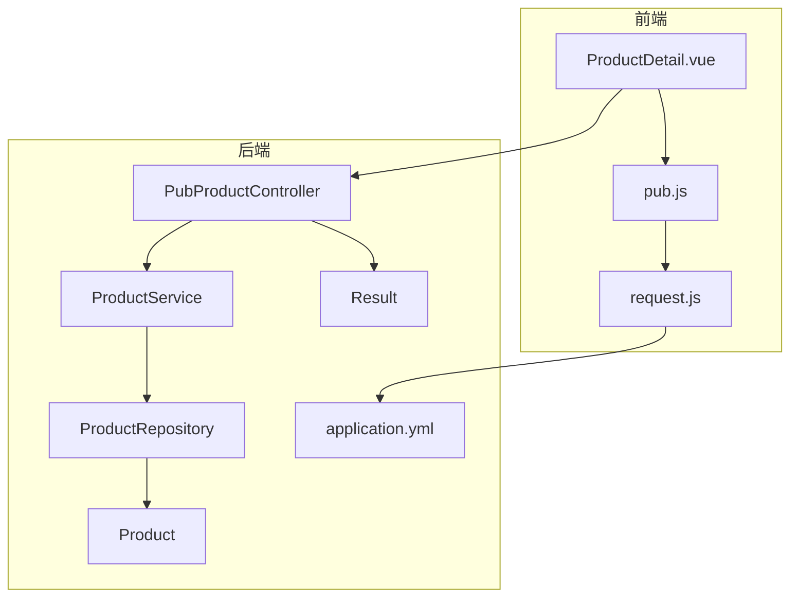
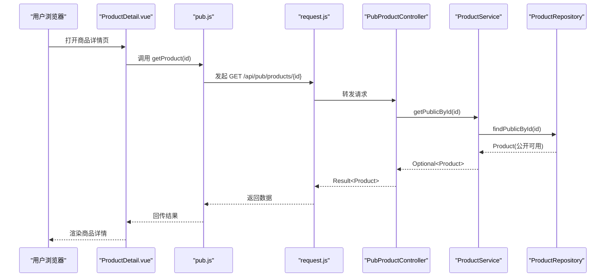
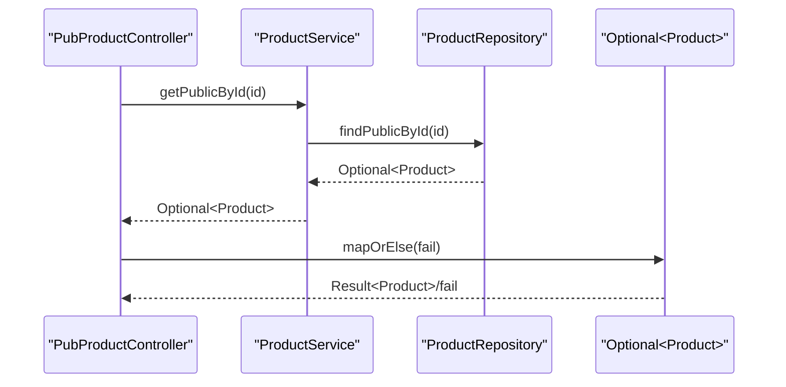
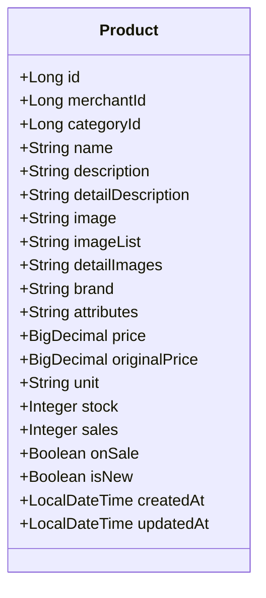
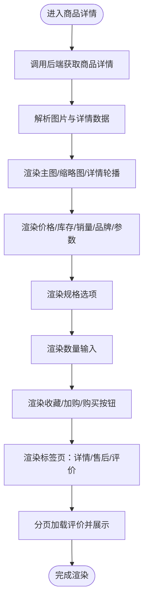
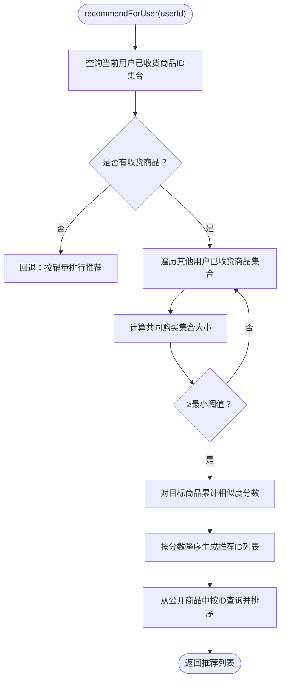
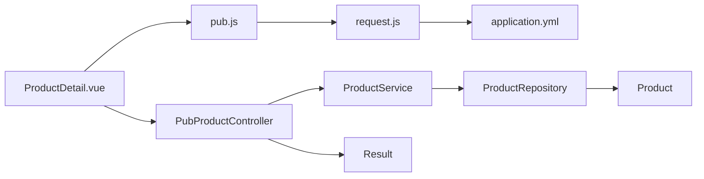

# 商品详情管理

<cite>
**本文引用的文件**
- [PubProductController.java](file://backend/src/main/java/com/mall/controller/pub/PubProductController.java)
- [ProductService.java](file://backend/src/main/java/com/mall/service/ProductService.java)
- [ProductRepository.java](file://backend/src/main/java/com/mall/repository/ProductRepository.java)
- [Product.java](file://backend/src/main/java/com/mall/entity/Product.java)
- [Result.java](file://backend/src/main/java/com/mall/dto/Result.java)
- [application.yml](file://backend/src/main/resources/application.yml)
- [ProductDetail.vue](file://frontend/src/views/user/ProductDetail.vue)
- [pub.js](file://frontend/src/api/pub.js)
- [request.js](file://frontend/src/api/request.js)
- [PubReviewController.java](file://backend/src/main/java/com/mall/controller/pub/PubReviewController.java)
- [ProductReview.java](file://backend/src/main/java/com/mall/entity/ProductReview.java)
- [CollaborativeFilteringService.java](file://backend/src/main/java/com/mall/service/CollaborativeFilteringService.java)
- [Recommend.vue](file://frontend/src/views/user/Recommend.vue)
</cite>

## 目录
1. [简介](#简介)
2. [项目结构](#项目结构)
3. [核心组件](#核心组件)
4. [架构总览](#架构总览)
5. [详细组件分析](#详细组件分析)
6. [依赖分析](#依赖分析)
7. [性能考虑](#性能考虑)
8. [故障排查指南](#故障排查指南)
9. [结论](#结论)
10. [附录](#附录)

## 简介
本文件围绕商品详情管理功能，系统性梳理后端接口与前端页面的实现细节，覆盖商品详情查询、商品信息展示、图片管理、属性显示、规格选择、价格与库存展示、评价展示、相关推荐与收藏等能力。文档同时提供API调用示例、数据格式说明与错误处理机制，帮助开发者完整实现商品详情功能。

## 项目结构
- 后端采用Spring Boot + Spring Data JPA，控制器位于pub包，提供公开接口；服务层负责业务逻辑；仓储层封装查询条件。
- 前端采用Vue 3 + Element Plus，商品详情页面位于user视图，通过API模块调用后端接口；请求统一通过axios实例封装。

图表来源
- [ProductDetail.vue](file://frontend/src/views/user/ProductDetail.vue)
- [pub.js](file://frontend/src/api/pub.js)
- [request.js](file://frontend/src/api/request.js)
- [PubProductController.java](file://backend/src/main/java/com/mall/controller/pub/PubProductController.java)
- [ProductService.java](file://backend/src/main/java/com/mall/service/ProductService.java)
- [ProductRepository.java](file://backend/src/main/java/com/mall/repository/ProductRepository.java)
- [Product.java](file://backend/src/main/java/com/mall/entity/Product.java)
- [Result.java](file://backend/src/main/java/com/mall/dto/Result.java)
- [application.yml](file://backend/src/main/resources/application.yml)

章节来源
- [ProductDetail.vue](file://frontend/src/views/user/ProductDetail.vue)
- [pub.js](file://frontend/src/api/pub.js)
- [request.js](file://frontend/src/api/request.js)
- [PubProductController.java](file://backend/src/main/java/com/mall/controller/pub/PubProductController.java)
- [ProductService.java](file://backend/src/main/java/com/mall/service/ProductService.java)
- [ProductRepository.java](file://backend/src/main/java/com/mall/repository/ProductRepository.java)
- [Product.java](file://backend/src/main/java/com/mall/entity/Product.java)
- [Result.java](file://backend/src/main/java/com/mall/dto/Result.java)
- [application.yml](file://backend/src/main/resources/application.yml)

## 核心组件
- 商品详情查询接口：后端提供公开商品详情查询，仅返回“上架且运营启用”的商品。
- 商品信息展示：前端展示名称、描述、品牌、参数、价格、库存、销量、是否新品、是否下架标识等。
- 图片管理：支持主图、缩略图、详情轮播图三类图片，前端提供图片切换与对话框选择。
- 属性显示：品牌与参数字段以纯文本形式展示，支持换行渲染。
- 规格选择：前端支持规格项选择，计算价格差额，配合数量输入与加入购物车/立即购买流程。
- 价格与库存：前端动态计算折扣、节省金额，库存紧张时提示剩余数量。
- 评价展示：按商品分页查询评价，展示评分、昵称、内容与时间。
- 相关推荐：基于协同过滤的“猜您想买”推荐，前端展示卡片列表。
- 收藏功能：用户登录态下支持收藏，前端提示成功/失败消息。

章节来源
- [PubProductController.java](file://backend/src/main/java/com/mall/controller/pub/PubProductController.java)
- [ProductService.java](file://backend/src/main/java/com/mall/service/ProductService.java)
- [ProductRepository.java](file://backend/src/main/java/com/mall/repository/ProductRepository.java)
- [Product.java](file://backend/src/main/java/com/mall/entity/Product.java)
- [ProductDetail.vue](file://frontend/src/views/user/ProductDetail.vue)
- [pub.js](file://frontend/src/api/pub.js)
- [PubReviewController.java](file://backend/src/main/java/com/mall/controller/pub/PubReviewController.java)
- [ProductReview.java](file://backend/src/main/java/com/mall/entity/ProductReview.java)
- [CollaborativeFilteringService.java](file://backend/src/main/java/com/mall/service/CollaborativeFilteringService.java)
- [Recommend.vue](file://frontend/src/views/user/Recommend.vue)

## 架构总览
后端通过REST控制器暴露公开接口，服务层封装查询逻辑，仓储层使用原生JPQL实现“上架+商家启用”的组合条件。前端通过统一请求模块调用后端接口，完成商品详情、评价、推荐等功能。

图表来源
- [ProductDetail.vue](file://frontend/src/views/user/ProductDetail.vue)
- [pub.js](file://frontend/src/api/pub.js)
- [request.js](file://frontend/src/api/request.js)
- [PubProductController.java](file://backend/src/main/java/com/mall/controller/pub/PubProductController.java)
- [ProductService.java](file://backend/src/main/java/com/mall/service/ProductService.java)
- [ProductRepository.java](file://backend/src/main/java/com/mall/repository/ProductRepository.java)

## 详细组件分析

### 后端：商品详情查询接口
- 控制器路径：/pub/products/{id}
- 参数：路径变量id（Long）
- 业务逻辑：
  - 调用服务层的公开查询方法，仅返回“上架且运营启用”的商品。
  - 若未找到，返回失败结果。
- 返回结构：Result对象，包含code、message、data。

图表来源
- [PubProductController.java](file://backend/src/main/java/com/mall/controller/pub/PubProductController.java)
- [ProductService.java](file://backend/src/main/java/com/mall/service/ProductService.java)
- [ProductRepository.java](file://backend/src/main/java/com/mall/repository/ProductRepository.java)
- [Result.java](file://backend/src/main/java/com/mall/dto/Result.java)

章节来源
- [PubProductController.java](file://backend/src/main/java/com/mall/controller/pub/PubProductController.java)
- [ProductService.java](file://backend/src/main/java/com/mall/service/ProductService.java)
- [ProductRepository.java](file://backend/src/main/java/com/mall/repository/ProductRepository.java)
- [Result.java](file://backend/src/main/java/com/mall/dto/Result.java)

### 后端：商品状态检查与数据结构
- 状态字段：
  - onSale：是否上架
  - merchant.enabled：商家启用状态（仓储查询中通过子查询过滤）
- 数据结构要点：
  - 主图image、多图imageList、详情轮播图detailImages均以逗号分隔的URL字符串存储。
  - attributes为参数/规格说明的文本字段。
  - price/originalPrice/sales/stock等数值字段用于前端展示与交互。

图表来源
- [Product.java](file://backend/src/main/java/com/mall/entity/Product.java)

章节来源
- [Product.java](file://backend/src/main/java/com/mall/entity/Product.java)
- [ProductRepository.java](file://backend/src/main/java/com/mall/repository/ProductRepository.java)

### 前端：商品详情页面组件设计
- 页面骨架：骨架屏占位，提升首屏体验。
- 图片区域：
  - 主图展示与缩略图切换。
  - 详情轮播图展示，支持点击选择。
  - 详情图选择对话框，用于多款商品购买确认。
- 商品信息：
  - 名称、销量、库存、价格（现价/原价/折扣）、描述、品牌、参数。
  - 库存紧张提示。
- 规格与数量：
  - 规格项选择，支持图标与价格差额展示。
  - 数量输入框，最大值受库存限制。
- 操作按钮：
  - 收藏、加入购物车、立即购买。
- 标签页：
  - 商品详情（支持HTML渲染）、售后服务、商品评价。
- 评价加载：
  - 分页加载，支持“加载更多”。

图表来源
- [ProductDetail.vue](file://frontend/src/views/user/ProductDetail.vue)
- [pub.js](file://frontend/src/api/pub.js)

章节来源
- [ProductDetail.vue](file://frontend/src/views/user/ProductDetail.vue)
- [pub.js](file://frontend/src/api/pub.js)

### 前端：API调用与数据格式
- 商品详情API
  - 方法：GET
  - 路径：/api/pub/products/{id}
  - 参数：无
  - 返回：Result对象，data为Product
- 商品评价API
  - 方法：GET
  - 路径：/api/pub/reviews
  - 参数：productId（必填）、page（默认0）、size（默认10）
  - 返回：Result对象，data为分页列表，每条记录包含id、productId、orderId、userId、rating、content、createdAt、nickname
- 相关推荐API
  - 方法：GET
  - 路径：/api/pub/products/recommend
  - 参数：userId（必填）、size（默认20）
  - 返回：Result对象，data为商品列表

章节来源
- [pub.js](file://frontend/src/api/pub.js)
- [PubReviewController.java](file://backend/src/main/java/com/mall/controller/pub/PubReviewController.java)
- [ProductReview.java](file://backend/src/main/java/com/mall/entity/ProductReview.java)
- [CollaborativeFilteringService.java](file://backend/src/main/java/com/mall/service/CollaborativeFilteringService.java)
- [Recommend.vue](file://frontend/src/views/user/Recommend.vue)

### 后端：协同过滤推荐（猜您想买）
- 接口：/pub/products/recommend
- 参数：userId（必填）、size（默认20）
- 算法要点：
  - 基于“共同购买”的相似度打分，过滤掉共同购买数过少的用户。
  - 若当前用户无购买记录或无足够相似用户，回退到销量榜推荐。
  - 最终从公开商品中按ID集合查询并保持顺序。

图表来源
- [CollaborativeFilteringService.java](file://backend/src/main/java/com/mall/service/CollaborativeFilteringService.java)
- [ProductRepository.java](file://backend/src/main/java/com/mall/repository/ProductRepository.java)

章节来源
- [CollaborativeFilteringService.java](file://backend/src/main/java/com/mall/service/CollaborativeFilteringService.java)
- [ProductRepository.java](file://backend/src/main/java/com/mall/repository/ProductRepository.java)

### 前端：相关推荐页面
- 页面名称：Recommend.vue
- 功能：基于当前登录用户ID调用推荐接口，展示商品卡片列表。
- 依赖：pub.js中的getRecommend方法。

章节来源
- [Recommend.vue](file://frontend/src/views/user/Recommend.vue)
- [pub.js](file://frontend/src/api/pub.js)

## 依赖分析
- 前端请求链路：ProductDetail.vue → pub.js → request.js → /api（application.yml配置）
- 后端控制链路：PubProductController → ProductService → ProductRepository → Product
- 关键依赖：
  - application.yml定义了后端服务端口与上下文路径，前端通过/baseURL="/api"统一转发。
  - Result作为统一响应载体，前后端约定code=200表示成功。

图表来源
- [ProductDetail.vue](file://frontend/src/views/user/ProductDetail.vue)
- [pub.js](file://frontend/src/api/pub.js)
- [request.js](file://frontend/src/api/request.js)
- [application.yml](file://backend/src/main/resources/application.yml)
- [PubProductController.java](file://backend/src/main/java/com/mall/controller/pub/PubProductController.java)
- [ProductService.java](file://backend/src/main/java/com/mall/service/ProductService.java)
- [ProductRepository.java](file://backend/src/main/java/com/mall/repository/ProductRepository.java)
- [Product.java](file://backend/src/main/java/com/mall/entity/Product.java)
- [Result.java](file://backend/src/main/java/com/mall/dto/Result.java)

章节来源
- [application.yml](file://backend/src/main/resources/application.yml)
- [request.js](file://frontend/src/api/request.js)

## 性能考虑
- 分页查询：后端提供分页参数，避免一次性返回大量数据。
- 条件查询：仓储层使用原生JPQL，明确筛选“上架+商家启用”，减少无效数据传输。
- 前端缓存：建议在路由级别对商品详情做轻量缓存，避免重复请求。
- 图片优化：主图与缩略图建议使用CDN与懒加载策略，详情轮播图按需渲染。
- 推荐回退：当无相似用户时回退销量排行，保证推荐可用性。

## 故障排查指南
- 401/403鉴权失败：
  - 前端请求拦截器会在响应中检测状态码，清理本地token与用户信息并跳转登录页。
- 商品不存在：
  - 后端get方法返回失败结果，前端应提示“商品不存在”。
- 评价加载异常：
  - 前端捕获异常并停止loading，可在控制台查看具体错误。
- 推荐为空：
  - 当用户无购买记录或相似用户不足时，回退到销量排行；若仍为空，提示“暂无推荐”。

章节来源
- [request.js](file://frontend/src/api/request.js)
- [PubProductController.java](file://backend/src/main/java/com/mall/controller/pub/PubProductController.java)
- [PubReviewController.java](file://backend/src/main/java/com/mall/controller/pub/PubReviewController.java)
- [CollaborativeFilteringService.java](file://backend/src/main/java/com/mall/service/CollaborativeFilteringService.java)

## 结论
商品详情管理功能通过后端公开接口与前端页面协同实现，具备完善的商品信息展示、图片管理、规格与价格库存交互、评价与推荐能力。遵循统一的Result响应规范与分页查询策略，既保证了系统的可维护性，也提升了用户体验。开发者可据此快速集成并扩展更多特性。

## 附录

### API定义与调用示例
- 商品详情查询
  - 方法：GET
  - 路径：/api/pub/products/{id}
  - 示例：调用pub.getProduct(123)获取ID为123的商品详情
- 商品评价查询
  - 方法：GET
  - 路径：/api/pub/reviews
  - 参数：productId（必填）、page（默认0）、size（默认10）
  - 示例：调用pub.getReviews(123, 0, 10)
- 相关推荐
  - 方法：GET
  - 路径：/api/pub/products/recommend
  - 参数：userId（必填）、size（默认20）
  - 示例：调用pub.getRecommend(1, 20)

章节来源
- [pub.js](file://frontend/src/api/pub.js)
- [ProductDetail.vue](file://frontend/src/views/user/ProductDetail.vue)