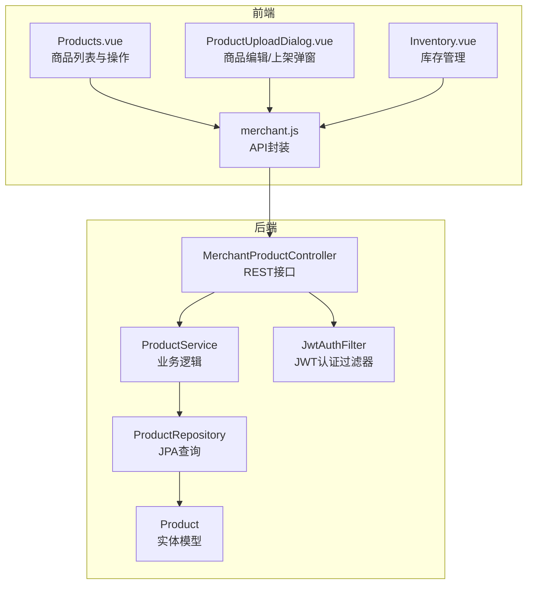
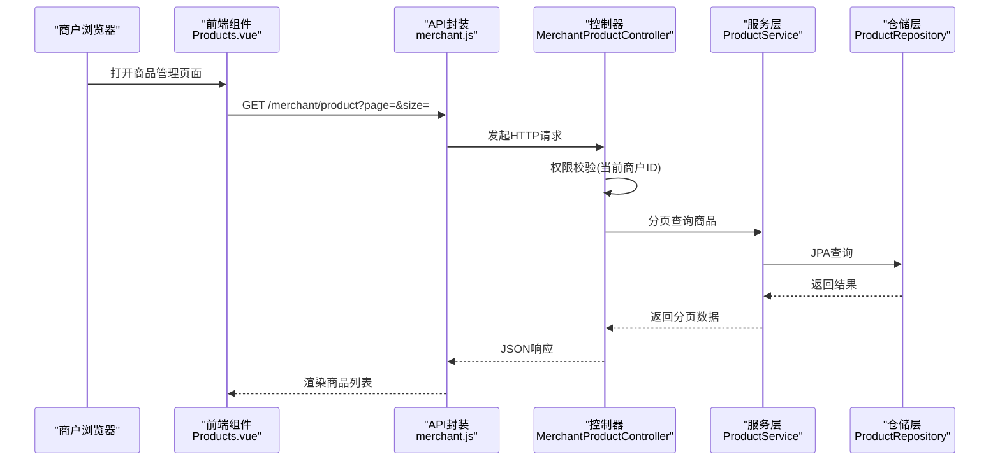
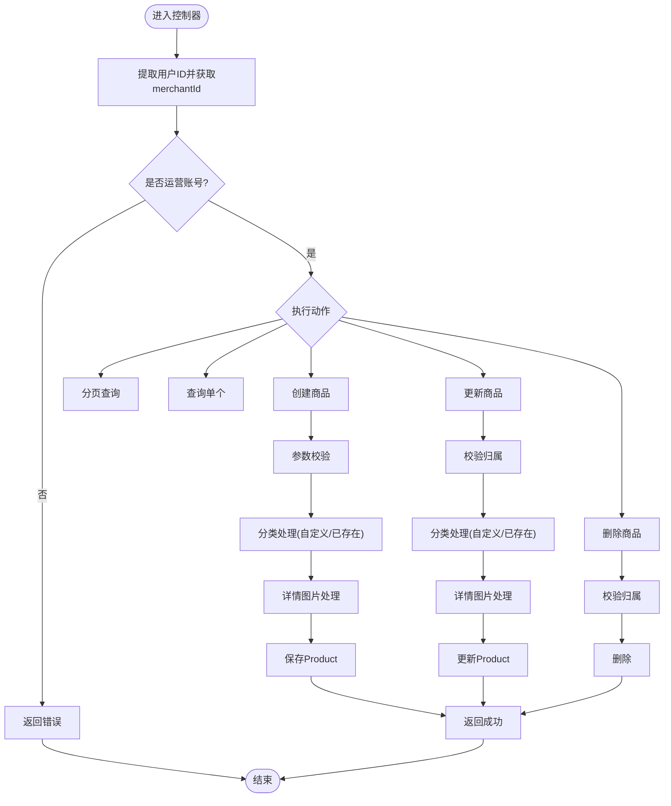
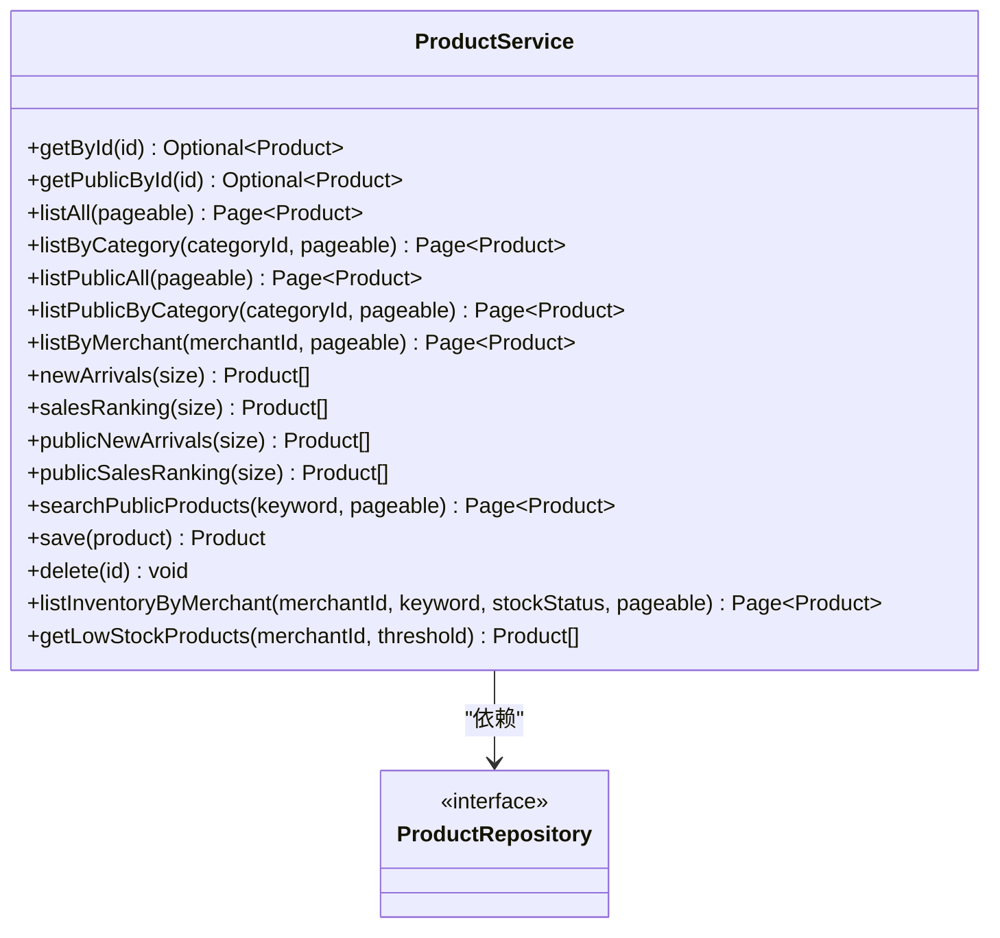
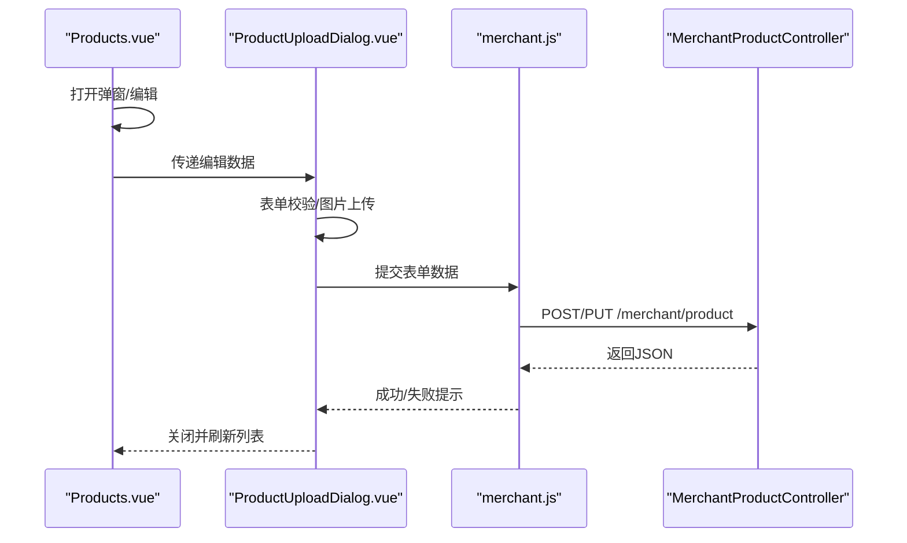
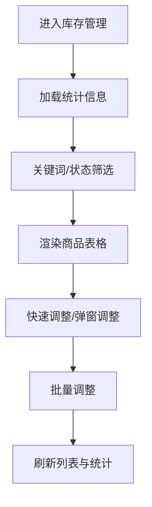
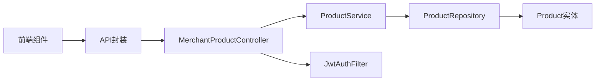

# 商户商品管理

<cite>
**本文引用的文件**
- [MerchantProductController.java](file://backend/src/main/java/com/mall/controller/merchant/MerchantProductController.java)
- [ProductService.java](file://backend/src/main/java/com/mall/service/ProductService.java)
- [ProductRepository.java](file://backend/src/main/java/com/mall/repository/ProductRepository.java)
- [Product.java](file://backend/src/main/java/com/mall/entity/Product.java)
- [ProductCreateRequest.java](file://backend/src/main/java/com/mall/dto/ProductCreateRequest.java)
- [JwtAuthFilter.java](file://backend/src/main/java/com/mall/security/JwtAuthFilter.java)
- [application.yml](file://backend/src/main/resources/application.yml)
- [Products.vue](file://frontend/src/views/merchant/Products.vue)
- [ProductUploadDialog.vue](file://frontend/src/components/merchant/ProductUploadDialog.vue)
- [merchant.js](file://frontend/src/api/merchant.js)
- [Inventory.vue](file://frontend/src/views/merchant/Inventory.vue)
- [banner.sql](file://backend/src/main/resources/banner.sql)
</cite>

## 目录
1. [简介](#简介)
2. [项目结构](#项目结构)
3. [核心组件](#核心组件)
4. [架构总览](#架构总览)
5. [详细组件分析](#详细组件分析)
6. [依赖关系分析](#依赖关系分析)
7. [性能考虑](#性能考虑)
8. [故障排除指南](#故障排除指南)
9. [结论](#结论)
10. [附录](#附录)

## 简介
本文件面向商户端，全面阐述商品管理功能的前后端实现与使用指南。内容覆盖商品上架、下架、编辑、删除、批量操作、库存管理、图片上传、价格与库存设置、分类选择、权限验证、数据校验、状态管理以及API规范。通过Mermaid图表与分层讲解，帮助商户高效管理自有商品。

## 项目结构
- 后端采用Spring Boot + Spring Data JPA，控制器位于merchant包，服务层负责业务逻辑，仓储层封装查询。
- 前端基于Vue 3 + Element Plus，页面组件位于views/merchant与components/merchant，API封装于frontend/src/api/merchant.js。

**图表来源**
- [Products.vue:1-400](file://frontend/src/views/merchant/Products.vue#L1-L400)
- [ProductUploadDialog.vue:1-920](file://frontend/src/components/merchant/ProductUploadDialog.vue#L1-L920)
- [merchant.js:1-135](file://frontend/src/api/merchant.js#L1-L135)
- [MerchantProductController.java:1-180](file://backend/src/main/java/com/mall/controller/merchant/MerchantProductController.java#L1-L180)
- [ProductService.java:1-126](file://backend/src/main/java/com/mall/service/ProductService.java#L1-L126)
- [ProductRepository.java:1-125](file://backend/src/main/java/com/mall/repository/ProductRepository.java#L1-L125)
- [Product.java:1-101](file://backend/src/main/java/com/mall/entity/Product.java#L1-L101)
- [JwtAuthFilter.java:1-57](file://backend/src/main/java/com/mall/security/JwtAuthFilter.java#L1-L57)

**章节来源**
- [Products.vue:1-400](file://frontend/src/views/merchant/Products.vue#L1-L400)
- [ProductUploadDialog.vue:1-920](file://frontend/src/components/merchant/ProductUploadDialog.vue#L1-L920)
- [merchant.js:1-135](file://frontend/src/api/merchant.js#L1-L135)
- [MerchantProductController.java:1-180](file://backend/src/main/java/com/mall/controller/merchant/MerchantProductController.java#L1-L180)
- [ProductService.java:1-126](file://backend/src/main/java/com/mall/service/ProductService.java#L1-L126)
- [ProductRepository.java:1-125](file://backend/src/main/java/com/mall/repository/ProductRepository.java#L1-L125)
- [Product.java:1-101](file://backend/src/main/java/com/mall/entity/Product.java#L1-L101)
- [JwtAuthFilter.java:1-57](file://backend/src/main/java/com/mall/security/JwtAuthFilter.java#L1-L57)

## 核心组件
- MerchantProductController：提供商品CRUD与分页查询，集成权限校验与数据校验。
- ProductService：封装商品查询、保存、删除与库存查询逻辑。
- ProductRepository：基于JPA的查询方法，支持公开端与运营端不同视角。
- Product：商品实体，包含名称、价格、库存、上下架状态、品牌、图片等字段。
- ProductCreateRequest：商品创建/更新的请求DTO，用于接收前端表单数据。
- JwtAuthFilter：从请求头解析JWT，注入认证信息到SecurityContext。
- 前端组件：Products.vue（列表）、ProductUploadDialog.vue（编辑/上架）、merchant.js（API封装）、Inventory.vue（库存管理）。

**章节来源**
- [MerchantProductController.java:1-180](file://backend/src/main/java/com/mall/controller/merchant/MerchantProductController.java#L1-L180)
- [ProductService.java:1-126](file://backend/src/main/java/com/mall/service/ProductService.java#L1-L126)
- [ProductRepository.java:1-125](file://backend/src/main/java/com/mall/repository/ProductRepository.java#L1-L125)
- [Product.java:1-101](file://backend/src/main/java/com/mall/entity/Product.java#L1-L101)
- [ProductCreateRequest.java:1-32](file://backend/src/main/java/com/mall/dto/ProductCreateRequest.java#L1-L32)
- [JwtAuthFilter.java:1-57](file://backend/src/main/java/com/mall/security/JwtAuthFilter.java#L1-L57)
- [Products.vue:1-400](file://frontend/src/views/merchant/Products.vue#L1-L400)
- [ProductUploadDialog.vue:1-920](file://frontend/src/components/merchant/ProductUploadDialog.vue#L1-L920)
- [merchant.js:1-135](file://frontend/src/api/merchant.js#L1-L135)
- [Inventory.vue:1-679](file://frontend/src/views/merchant/Inventory.vue#L1-L679)

## 架构总览
商户商品管理采用前后端分离架构，前端通过HTTP请求调用后端REST接口；后端通过JWT进行身份认证，控制器对请求进行权限与参数校验，服务层协调仓储层完成数据持久化。

**图表来源**
- [Products.vue:141-164](file://frontend/src/views/merchant/Products.vue#L141-L164)
- [merchant.js:13-16](file://frontend/src/api/merchant.js#L13-L16)
- [MerchantProductController.java:36-44](file://backend/src/main/java/com/mall/controller/merchant/MerchantProductController.java#L36-L44)
- [ProductService.java:52-55](file://backend/src/main/java/com/mall/service/ProductService.java#L52-L55)
- [ProductRepository.java:21-21](file://backend/src/main/java/com/mall/repository/ProductRepository.java#L21-L21)

**章节来源**
- [Products.vue:141-164](file://frontend/src/views/merchant/Products.vue#L141-L164)
- [merchant.js:13-16](file://frontend/src/api/merchant.js#L13-L16)
- [MerchantProductController.java:36-44](file://backend/src/main/java/com/mall/controller/merchant/MerchantProductController.java#L36-L44)
- [ProductService.java:52-55](file://backend/src/main/java/com/mall/service/ProductService.java#L52-L55)
- [ProductRepository.java:21-21](file://backend/src/main/java/com/mall/repository/ProductRepository.java#L21-L21)

## 详细组件分析

### 控制器：MerchantProductController
- 权限验证：从Authentication中提取用户ID，查询User关联的merchantId，非运营账号直接拒绝。
- 列表查询：支持分页，默认每页10条，返回当前商户的上架商品。
- 单个查询：校验商品是否存在且属于当前商户。
- 创建商品：参数校验（名称、价格、库存），支持自定义分类名自动创建/复用，详情图片统一处理为逗号分隔字符串，设置默认值（单位、是否新品、是否上架）。
- 更新商品：先校验商品归属，再按请求更新字段，支持自定义分类。
- 删除商品：校验归属后删除。

**图表来源**
- [MerchantProductController.java:28-178](file://backend/src/main/java/com/mall/controller/merchant/MerchantProductController.java#L28-L178)

**章节来源**
- [MerchantProductController.java:28-178](file://backend/src/main/java/com/mall/controller/merchant/MerchantProductController.java#L28-L178)

### 服务层：ProductService
- 提供运营维度的商品分页查询（仅上架）。
- 提供用户侧公开查询（上架且商户启用）。
- 提供库存维度查询（关键词、库存状态筛选）。
- 统一save/delete操作。

**图表来源**
- [ProductService.java:18-125](file://backend/src/main/java/com/mall/service/ProductService.java#L18-L125)
- [ProductRepository.java:12-124](file://backend/src/main/java/com/mall/repository/ProductRepository.java#L12-L124)

**章节来源**
- [ProductService.java:18-125](file://backend/src/main/java/com/mall/service/ProductService.java#L18-L125)
- [ProductRepository.java:12-124](file://backend/src/main/java/com/mall/repository/ProductRepository.java#L12-L124)

### 数据模型：Product
- 字段覆盖名称、描述、详情、主图、详情图、品牌、属性、价格、原价、单位、库存、销量、上下架状态、是否新品、时间戳等。
- 默认值：unit为"件"、stock为0、sales为0、onSale为true、isNew为false。

```mermaid
erDiagram
PRODUCT {
bigint id PK
bigint merchant_id
bigint category_id
varchar name
varchar description
longtext detail_description
varchar image
text image_list
text detail_images
varchar brand
longtext attributes
decimal price
decimal original_price
varchar unit
int stock
int sales
boolean on_sale
boolean is_new
timestamp created_at
timestamp updated_at
}
```

**图表来源**
- [Product.java:16-99](file://backend/src/main/java/com/mall/entity/Product.java#L16-L99)

**章节来源**
- [Product.java:16-99](file://backend/src/main/java/com/mall/entity/Product.java#L16-L99)

### 前端组件：商品列表与编辑
- Products.vue：渲染商品列表，支持分页、编辑、查看详情、删除；通过API封装调用后端接口。
- ProductUploadDialog.vue：表单组件，支持分类选择/自定义分类、富文本编辑器、主图与详情图上传、价格与库存设置、上架/新品开关；提交时将图片数组转换为逗号分隔字符串。
- merchant.js：封装GET/POST/PUT/DELETE请求至/merchant/product及库存相关接口。

**图表来源**
- [Products.vue:166-226](file://frontend/src/views/merchant/Products.vue#L166-L226)
- [ProductUploadDialog.vue:621-658](file://frontend/src/components/merchant/ProductUploadDialog.vue#L621-L658)
- [merchant.js:23-36](file://frontend/src/api/merchant.js#L23-L36)
- [MerchantProductController.java:56-114](file://backend/src/main/java/com/mall/controller/merchant/MerchantProductController.java#L56-L114)

**章节来源**
- [Products.vue:1-400](file://frontend/src/views/merchant/Products.vue#L1-L400)
- [ProductUploadDialog.vue:1-920](file://frontend/src/components/merchant/ProductUploadDialog.vue#L1-L920)
- [merchant.js:1-135](file://frontend/src/api/merchant.js#L1-L135)
- [MerchantProductController.java:56-114](file://backend/src/main/java/com/mall/controller/merchant/MerchantProductController.java#L56-L114)

### 库存管理
- 前端Inventory.vue：统计总商品数、低库存、缺货数量；支持按关键词与库存状态筛选；支持单个/批量库存调整。
- 后端ProductService提供库存维度查询方法，ProductRepository提供对应JPQL查询。

**图表来源**
- [Inventory.vue:1-679](file://frontend/src/views/merchant/Inventory.vue#L1-L679)
- [ProductService.java:94-124](file://backend/src/main/java/com/mall/service/ProductService.java#L94-L124)
- [ProductRepository.java:107-123](file://backend/src/main/java/com/mall/repository/ProductRepository.java#L107-L123)

**章节来源**
- [Inventory.vue:1-679](file://frontend/src/views/merchant/Inventory.vue#L1-L679)
- [ProductService.java:94-124](file://backend/src/main/java/com/mall/service/ProductService.java#L94-L124)
- [ProductRepository.java:107-123](file://backend/src/main/java/com/mall/repository/ProductRepository.java#L107-L123)

## 依赖关系分析
- 控制器依赖服务层，服务层依赖仓储层，仓储层依赖实体模型。
- 前端通过API封装调用后端REST接口。
- 安全层通过JWT过滤器解析Authorization头，注入认证信息。

**图表来源**
- [MerchantProductController.java:24-26](file://backend/src/main/java/com/mall/controller/merchant/MerchantProductController.java#L24-L26)
- [ProductService.java:20-20](file://backend/src/main/java/com/mall/service/ProductService.java#L20-L20)
- [ProductRepository.java:13-13](file://backend/src/main/java/com/mall/repository/ProductRepository.java#L13-L13)
- [Product.java:16-16](file://backend/src/main/java/com/mall/entity/Product.java#L16-L16)
- [JwtAuthFilter.java:36-41](file://backend/src/main/java/com/mall/security/JwtAuthFilter.java#L36-L41)

**章节来源**
- [MerchantProductController.java:24-26](file://backend/src/main/java/com/mall/controller/merchant/MerchantProductController.java#L24-L26)
- [ProductService.java:20-20](file://backend/src/main/java/com/mall/service/ProductService.java#L20-L20)
- [ProductRepository.java:13-13](file://backend/src/main/java/com/mall/repository/ProductRepository.java#L13-L13)
- [Product.java:16-16](file://backend/src/main/java/com/mall/entity/Product.java#L16-L16)
- [JwtAuthFilter.java:36-41](file://backend/src/main/java/com/mall/security/JwtAuthFilter.java#L36-L41)

## 性能考虑
- 分页查询：后端默认每页10条，避免一次性传输大量数据；前端Products.vue与Inventory.vue均支持分页。
- 查询优化：ProductRepository针对公开端与运营端分别提供专用查询方法，减少不必要的过滤。
- 图片处理：前端将多图数组合并为逗号分隔字符串存储，降低复杂度；建议后端在展示时按需拆分。
- 缓存策略：可结合业务场景引入Redis缓存热门商品详情，减少数据库压力。

[本节为通用指导，无需特定文件来源]

## 故障排除指南
- 权限错误：若返回“商品不存在”，检查当前登录商户是否拥有该商品所有权。
- 参数校验失败：名称为空、价格非正、库存为负等会触发校验错误，需修正后再提交。
- 图片上传失败：检查上传接口返回的错误消息，确认文件类型与大小限制。
- 分页数据异常：确认前端传入的page与size参数是否正确。

**章节来源**
- [MerchantProductController.java:49-53](file://backend/src/main/java/com/mall/controller/merchant/MerchantProductController.java#L49-L53)
- [MerchantProductController.java:59-67](file://backend/src/main/java/com/mall/controller/merchant/MerchantProductController.java#L59-L67)
- [ProductUploadDialog.vue:270-288](file://frontend/src/components/merchant/ProductUploadDialog.vue#L270-L288)

## 结论
商户商品管理功能以清晰的分层架构实现，从前端UI到后端服务与仓储，职责明确、耦合度低。通过严格的权限校验与参数校验、完善的库存管理与图片处理机制，商户可高效完成商品的全生命周期管理。建议后续扩展批量导入导出、商品审核流程与状态变更记录，进一步提升管理效率与合规性。

[本节为总结性内容，无需特定文件来源]

## 附录

### API规范：商品管理
- 获取商品列表
  - 方法与路径：GET /api/merchant/product
  - 认证：需要JWT
  - 查询参数：
    - page：页码（从0开始，默认0）
    - size：每页大小（默认10）
  - 响应：分页对象，包含content与totalElements
- 获取商品详情
  - 方法与路径：GET /api/merchant/product/{id}
  - 认证：需要JWT
  - 响应：商品详情对象
- 创建商品
  - 方法与路径：POST /api/merchant/product
  - 认证：需要JWT
  - 请求体：ProductCreateRequest
  - 响应：创建后的商品对象
- 更新商品
  - 方法与路径：PUT /api/merchant/product/{id}
  - 认证：需要JWT
  - 请求体：ProductCreateRequest
  - 响应：更新后的商品对象
- 删除商品
  - 方法与路径：DELETE /api/merchant/product/{id}
  - 认证：需要JWT
  - 响应：空对象

**章节来源**
- [merchant.js:13-36](file://frontend/src/api/merchant.js#L13-L36)
- [MerchantProductController.java:36-178](file://backend/src/main/java/com/mall/controller/merchant/MerchantProductController.java#L36-L178)

### 请求参数与响应结构
- ProductCreateRequest字段
  - name：商品名称（必填，2-128字符）
  - description：商品简介（可选）
  - detailDescription：详情描述（可选）
  - detailImages：详情图片字符串（可选）
  - images：详情图片URL数组（可选，将被转换为detailImages）
  - brand：品牌（可选）
  - attributes：商品参数/规格（可选）
  - unit：价格单位（默认"件"）
  - categoryId：分类ID（可选）
  - categoryName：自定义分类名称（可选）
  - price：现价（必填，>0）
  - originalPrice：原价（可选）
  - stock：库存（必填，>=0）
  - image：主图URL（可选）
  - isNew：是否新品（可选，默认false）
  - onSale：是否上架（可选，默认true）

- Product响应字段
  - id、merchantId、categoryId、name、description、detailDescription、image、imageList、detailImages、brand、attributes、price、originalPrice、unit、stock、sales、onSale、isNew、createdAt、updatedAt

**章节来源**
- [ProductCreateRequest.java:14-31](file://backend/src/main/java/com/mall/dto/ProductCreateRequest.java#L14-L31)
- [Product.java:16-99](file://backend/src/main/java/com/mall/entity/Product.java#L16-L99)

### 权限与安全
- 认证方式：JWT Bearer Token，放置在Authorization请求头中。
- 过滤器：JwtAuthFilter解析令牌，注入用户ID与角色到SecurityContext。
- 控制器：MerchantProductController通过Authentication获取用户ID，并映射到merchantId进行权限校验。

**章节来源**
- [application.yml:27-30](file://backend/src/main/resources/application.yml#L27-L30)
- [JwtAuthFilter.java:30-46](file://backend/src/main/java/com/mall/security/JwtAuthFilter.java#L30-L46)
- [MerchantProductController.java:28-34](file://backend/src/main/java/com/mall/controller/merchant/MerchantProductController.java#L28-L34)

### 数据库与索引
- banner表与product表存在外键关联，便于首页轮播与商品绑定。

**章节来源**
- [banner.sql:1-14](file://backend/src/main/resources/banner.sql#L1-L14)