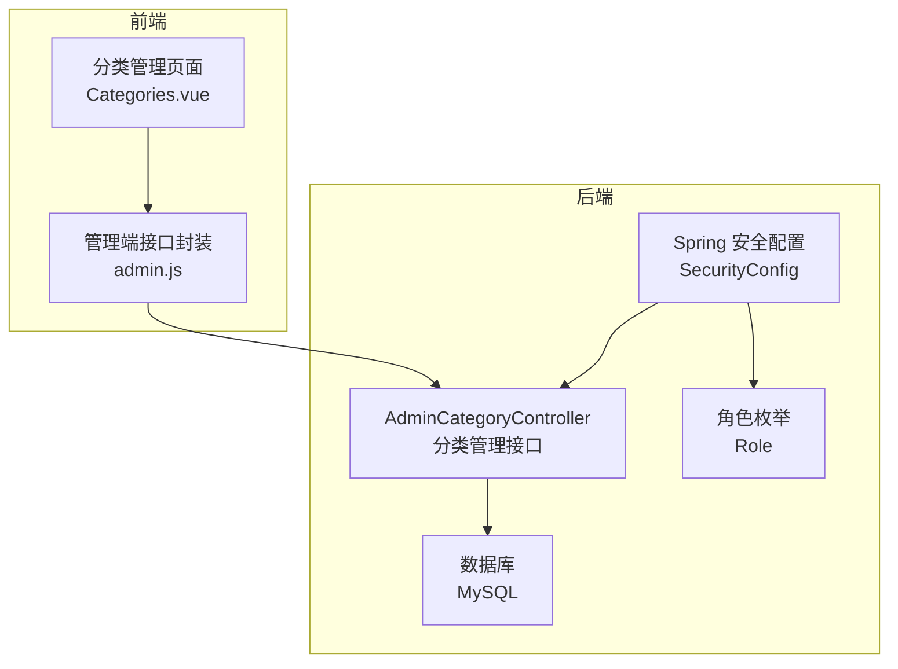
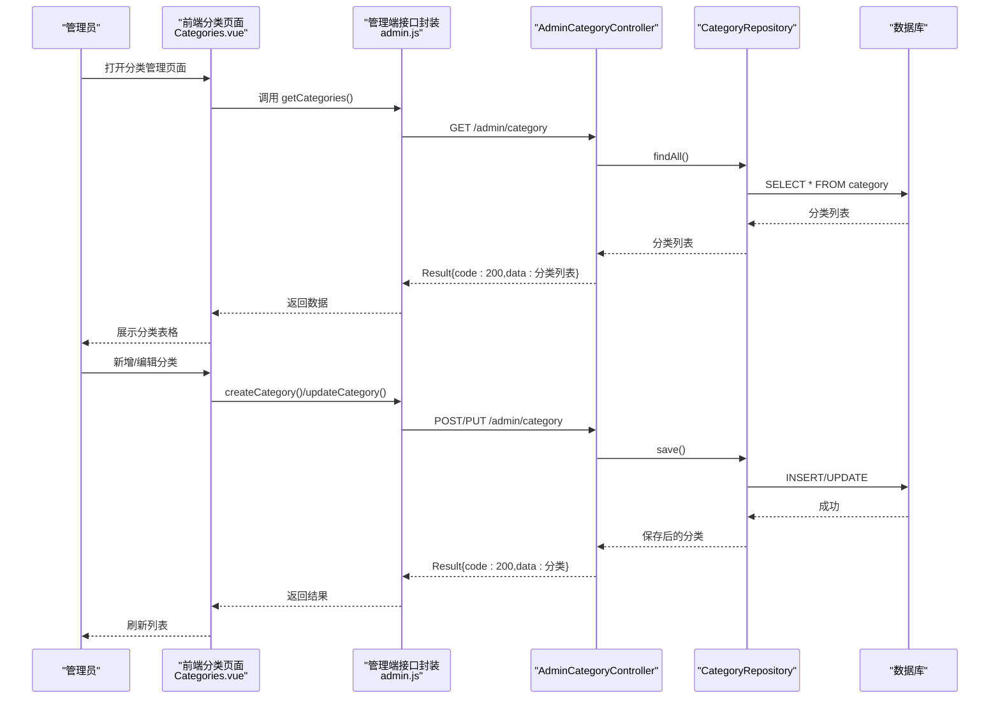
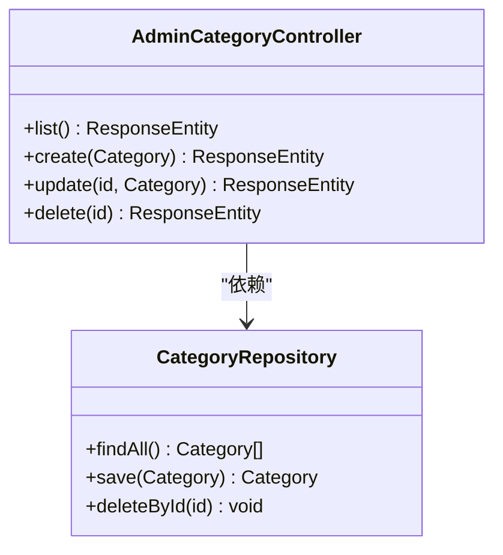
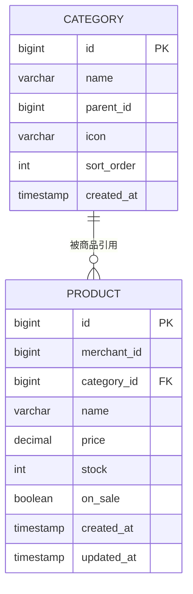
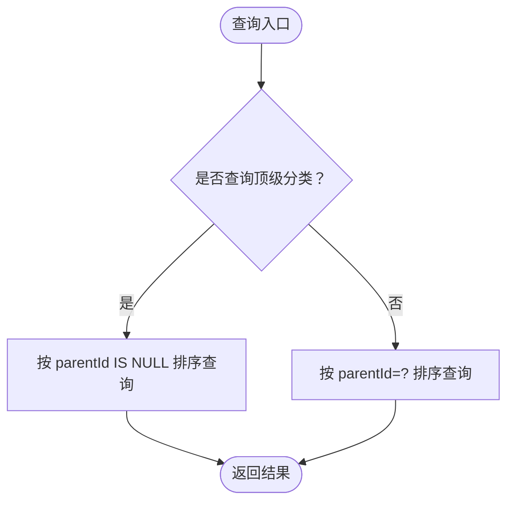
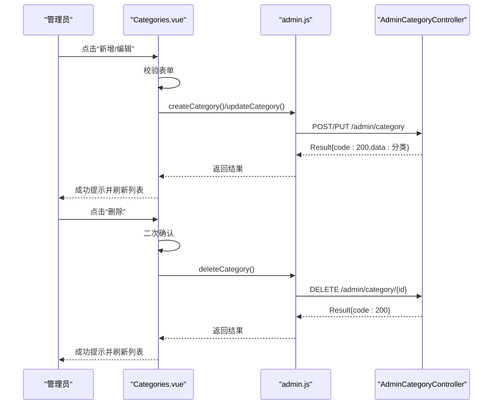
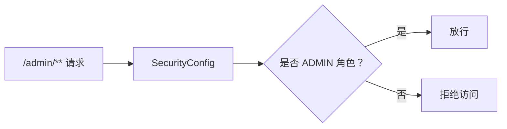
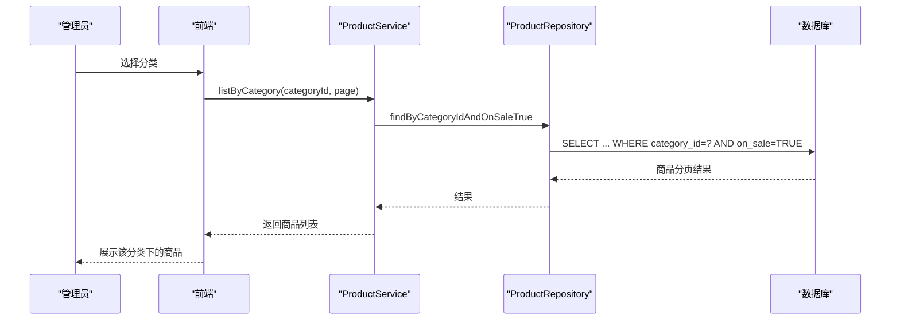
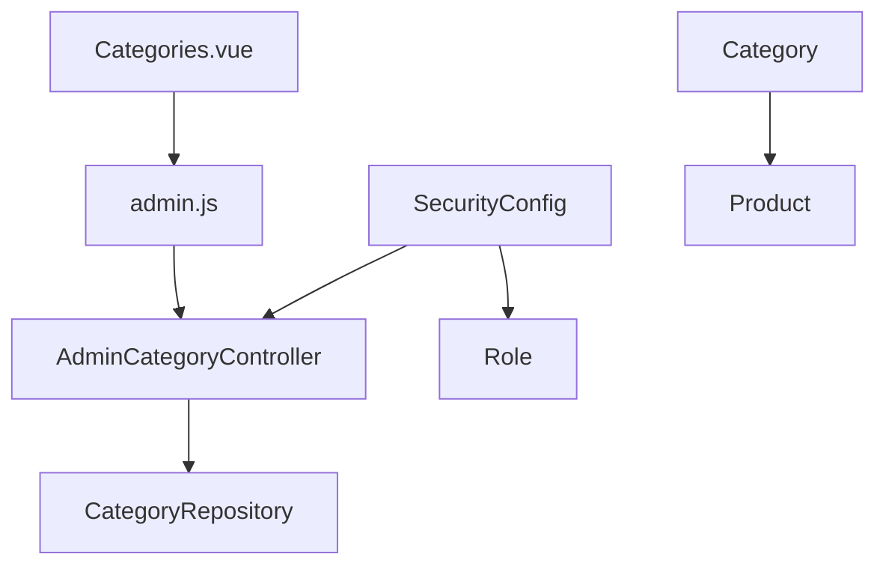

# 管理员分类管理

<cite>
**本文引用的文件**
- [AdminCategoryController.java](file://backend/src/main/java/com/mall/controller/admin/AdminCategoryController.java)
- [Category.java](file://backend/src/main/java/com/mall/entity/Category.java)
- [CategoryRepository.java](file://backend/src/main/java/com/mall/repository/CategoryRepository.java)
- [Categories.vue](file://frontend/src/views/admin/Categories.vue)
- [admin.js](file://frontend/src/api/admin.js)
- [DataInitializer.java](file://backend/src/main/java/com/mall/config/DataInitializer.java)
- [application.yml](file://backend/src/main/resources/application.yml)
- [SecurityConfig.java](file://backend/src/main/java/com/mall/config/SecurityConfig.java)
- [Role.java](file://backend/src/main/java/com/mall/common/Role.java)
- [Product.java](file://backend/src/main/java/com/mall/entity/Product.java)
- [ProductService.java](file://backend/src/main/java/com/mall/service/ProductService.java)
</cite>

## 目录
1. [简介](#简介)
2. [项目结构](#项目结构)
3. [核心组件](#核心组件)
4. [架构总览](#架构总览)
5. [详细组件分析](#详细组件分析)
6. [依赖分析](#依赖分析)
7. [性能考虑](#性能考虑)
8. [故障排查指南](#故障排查指南)
9. [结论](#结论)
10. [附录](#附录)

## 简介
本文件面向管理员分类管理功能，系统性阐述商品分类体系的设计与实现，覆盖分类层级结构、增删改查、排序、父子关系处理、分类树构建、前后端交互、权限控制与统计关联等内容。重点解析后端控制器 AdminCategoryController 的接口实现、数据模型 Category 及其仓库方法、前端分类管理页面 Categories.vue 的交互逻辑与过滤排序能力，并结合数据库初始化脚本与安全配置，帮助管理员高效维护商品分类体系。

## 项目结构
- 后端模块位于 backend，采用基于层的组织方式：controller（控制器）、entity（实体）、repository（仓储）、service（服务）、config（配置）、common（通用枚举）。
- 前端模块位于 frontend，采用基于视图的组织方式：views/admin 下的分类管理页面、api/admin.js 封装管理端接口调用。
- 数据库通过 JPA/Hibernate 自动建模，application.yml 配置数据源与 JPA 行为；SecurityConfig 对 /admin/** 路由进行管理员权限校验。

**图表来源**
- [Categories.vue:1-236](file://frontend/src/views/admin/Categories.vue#L1-L236)
- [admin.js:58-76](file://frontend/src/api/admin.js#L58-L76)
- [AdminCategoryController.java:12-46](file://backend/src/main/java/com/mall/controller/admin/AdminCategoryController.java#L12-L46)
- [SecurityConfig.java:33-54](file://backend/src/main/java/com/mall/config/SecurityConfig.java#L33-L54)
- [Role.java:1-8](file://backend/src/main/java/com/mall/common/Role.java#L1-L8)

**章节来源**
- [application.yml:1-36](file://backend/src/main/resources/application.yml#L1-L36)
- [SecurityConfig.java:33-54](file://backend/src/main/java/com/mall/config/SecurityConfig.java#L33-L54)

## 核心组件
- 分类实体 Category：包含自增主键、名称、父级标识、图标、排序字段、创建时间等，支持父子层级与排序。
- 分类仓库 CategoryRepository：提供按父级查询子分类、按父级为空查询顶级分类、按名称与父级为空查询唯一顶级分类等方法。
- 管理端控制器 AdminCategoryController：提供分类列表、创建、更新、删除接口，统一返回 Result 包裹。
- 前端分类管理页面 Categories.vue：提供分类列表展示、搜索、父级筛选、新增/编辑弹窗、删除确认、本地排序与计数。
- 管理端接口封装 admin.js：对 /admin/category 的 GET/POST/PUT/DELETE 进行封装，供前端调用。
- 数据初始化 DataInitializer：在应用启动时创建示例分类与商品，验证分类与商品的映射关系。
- 安全配置 SecurityConfig：限制 /admin/** 仅管理员可访问，配合 Role 枚举实现权限控制。

**章节来源**
- [Category.java:8-40](file://backend/src/main/java/com/mall/entity/Category.java#L8-L40)
- [CategoryRepository.java:9-16](file://backend/src/main/java/com/mall/repository/CategoryRepository.java#L9-L16)
- [AdminCategoryController.java:12-46](file://backend/src/main/java/com/mall/controller/admin/AdminCategoryController.java#L12-L46)
- [Categories.vue:107-215](file://frontend/src/views/admin/Categories.vue#L107-L215)
- [admin.js:58-76](file://frontend/src/api/admin.js#L58-L76)
- [DataInitializer.java:63-88](file://backend/src/main/java/com/mall/config/DataInitializer.java#L63-L88)
- [SecurityConfig.java:48-50](file://backend/src/main/java/com/mall/config/SecurityConfig.java#L48-L50)
- [Role.java:1-8](file://backend/src/main/java/com/mall/common/Role.java#L1-L8)

## 架构总览
管理员分类管理遵循经典的 MVC+分层架构：
- 控制器层：AdminCategoryController 暴露 REST 接口，接收请求并调用仓库持久化。
- 仓储层：CategoryRepository 提供按父级与排序的查询方法，支撑分类树构建与排序展示。
- 实体层：Category 映射数据库表，具备父子关系与排序字段。
- 前端层：Categories.vue 通过 admin.js 调用后端接口，完成分类的增删改查与本地过滤排序。
- 安全层：SecurityConfig 以路径匹配方式限制 /admin/** 仅管理员可用，结合 Role 枚举实现细粒度权限。

**图表来源**
- [Categories.vue:164-199](file://frontend/src/views/admin/Categories.vue#L164-L199)
- [admin.js:58-76](file://frontend/src/api/admin.js#L58-L76)
- [AdminCategoryController.java:20-45](file://backend/src/main/java/com/mall/controller/admin/AdminCategoryController.java#L20-L45)
- [CategoryRepository.java:9-16](file://backend/src/main/java/com/mall/repository/CategoryRepository.java#L9-L16)

## 详细组件分析

### 后端：AdminCategoryController 接口实现
- 列表接口：GET /admin/category 返回所有分类，按默认顺序返回。
- 创建接口：POST /admin/category 接收分类对象，设置 id 为空后保存。
- 更新接口：PUT /admin/category/{id} 接收分类对象，设置 id 并保存。
- 删除接口：DELETE /admin/category/{id} 根据 id 删除。
- 返回格式：统一使用 Result 包裹，便于前端统一处理。

**图表来源**
- [AdminCategoryController.java:12-46](file://backend/src/main/java/com/mall/controller/admin/AdminCategoryController.java#L12-L46)
- [CategoryRepository.java:9-16](file://backend/src/main/java/com/mall/repository/CategoryRepository.java#L9-L16)

**章节来源**
- [AdminCategoryController.java:20-45](file://backend/src/main/java/com/mall/controller/admin/AdminCategoryController.java#L20-L45)

### 数据模型与数据库设计
- 实体 Category 字段：id、name、parentId、icon、sortOrder、createdAt。
- 关系设计：parentId 指向父分类 id，形成树形层级；sortOrder 决定同级排序。
- 初始化数据：DataInitializer 在启动时创建多个顶级分类，验证分类与商品映射。
- 商品关联：Product 实体包含 categoryId 字段，用于商品到分类的单向映射。

**图表来源**
- [Category.java:17-39](file://backend/src/main/java/com/mall/entity/Category.java#L17-L39)
- [Product.java:18-88](file://backend/src/main/java/com/mall/entity/Product.java#L18-L88)
- [DataInitializer.java:63-88](file://backend/src/main/java/com/mall/config/DataInitializer.java#L63-L88)

**章节来源**
- [Category.java:8-40](file://backend/src/main/java/com/mall/entity/Category.java#L8-L40)
- [Product.java:25-26](file://backend/src/main/java/com/mall/entity/Product.java#L25-L26)
- [DataInitializer.java:63-88](file://backend/src/main/java/com/mall/config/DataInitializer.java#L63-L88)

### 仓储与查询优化
- 顶级分类查询：findByParentIdIsNullOrderBySortOrderAsc，按排序升序返回。
- 子分类查询：findByParentIdOrderBySortOrderAsc，按排序升序返回。
- 唯一顶级分类查询：findByNameAndParentIdIsNull，避免重复顶级分类。
- 建议：在数据库为 category(parent_id, sort_order) 建立复合索引，提升父子查询与排序性能。

**图表来源**
- [CategoryRepository.java:11-15](file://backend/src/main/java/com/mall/repository/CategoryRepository.java#L11-L15)

**章节来源**
- [CategoryRepository.java:9-16](file://backend/src/main/java/com/mall/repository/CategoryRepository.java#L9-L16)

### 前端：分类管理页面交互
- 页面布局：标题、工具栏（新增、搜索、父级筛选）、表格、对话框。
- 数据加载：created 生命周期调用 getCategories() 获取分类列表。
- 过滤与排序：支持关键词（名称/ID）与父级筛选，本地按 sortOrder 升序排序，次级按 id 升序。
- 表单校验：名称必填，父级不可等于自身；提交成功后刷新列表。
- 删除流程：二次确认后调用 deleteCategory，成功后刷新列表。

**图表来源**
- [Categories.vue:169-213](file://frontend/src/views/admin/Categories.vue#L169-L213)
- [admin.js:58-76](file://frontend/src/api/admin.js#L58-L76)
- [AdminCategoryController.java:26-45](file://backend/src/main/java/com/mall/controller/admin/AdminCategoryController.java#L26-L45)

**章节来源**
- [Categories.vue:107-215](file://frontend/src/views/admin/Categories.vue#L107-L215)
- [admin.js:58-76](file://frontend/src/api/admin.js#L58-L76)

### 权限控制与安全
- 路径权限：SecurityConfig 中 /admin/** 仅 ADMIN 角色可访问。
- 角色枚举：Role 定义 ADMIN/MERCHANT/USER 三类角色。
- 认证链路：JWT 过滤器在认证前执行，CSRF 关闭，跨域允许本地前端访问。

**图表来源**
- [SecurityConfig.java:48-50](file://backend/src/main/java/com/mall/config/SecurityConfig.java#L48-L50)
- [Role.java:1-8](file://backend/src/main/java/com/mall/common/Role.java#L1-L8)

**章节来源**
- [SecurityConfig.java:33-54](file://backend/src/main/java/com/mall/config/SecurityConfig.java#L33-L54)
- [Role.java:1-8](file://backend/src/main/java/com/mall/common/Role.java#L1-L8)

### 分类统计与商品映射
- 商品按分类查询：ProductService.listByCategory 与 ProductService.listPublicByCategory 支持管理端与用户端按分类筛选。
- 分类与商品映射：DataInitializer 为每个分类创建若干商品，验证分类到商品的单向映射关系。
- 统计建议：可在业务层扩展统计接口，如“某分类下商品数量”、“某分类下在售商品数量”等，结合分页与缓存优化。

**图表来源**
- [ProductService.java:37-50](file://backend/src/main/java/com/mall/service/ProductService.java#L37-L50)
- [DataInitializer.java:71-88](file://backend/src/main/java/com/mall/config/DataInitializer.java#L71-L88)

**章节来源**
- [ProductService.java:37-50](file://backend/src/main/java/com/mall/service/ProductService.java#L37-L50)
- [DataInitializer.java:71-88](file://backend/src/main/java/com/mall/config/DataInitializer.java#L71-L88)

## 依赖分析
- 控制器与仓库：AdminCategoryController 依赖 CategoryRepository，后者提供分类的 CRUD 与排序查询。
- 前后端通信：Categories.vue 通过 admin.js 调用 /admin/category 接口，实现分类管理。
- 安全依赖：SecurityConfig 对 /admin/** 进行权限拦截，依赖 Role 枚举判断角色。
- 数据依赖：Category 与 Product 通过 categoryId 建立一对多映射，影响商品查询与分类统计。

**图表来源**
- [AdminCategoryController.java:18](file://backend/src/main/java/com/mall/controller/admin/AdminCategoryController.java#L18)
- [CategoryRepository.java:9](file://backend/src/main/java/com/mall/repository/CategoryRepository.java#L9)
- [Categories.vue:100-105](file://frontend/src/views/admin/Categories.vue#L100-L105)
- [admin.js:58-76](file://frontend/src/api/admin.js#L58-L76)
- [SecurityConfig.java:48-50](file://backend/src/main/java/com/mall/config/SecurityConfig.java#L48-L50)
- [Role.java:1-8](file://backend/src/main/java/com/mall/common/Role.java#L1-L8)
- [Category.java:24](file://backend/src/main/java/com/mall/entity/Category.java#L24)
- [Product.java:25](file://backend/src/main/java/com/mall/entity/Product.java#L25)

**章节来源**
- [AdminCategoryController.java:18](file://backend/src/main/java/com/mall/controller/admin/AdminCategoryController.java#L18)
- [CategoryRepository.java:9](file://backend/src/main/java/com/mall/repository/CategoryRepository.java#L9)
- [Categories.vue:100-105](file://frontend/src/views/admin/Categories.vue#L100-L105)
- [admin.js:58-76](file://frontend/src/api/admin.js#L58-L76)
- [SecurityConfig.java:48-50](file://backend/src/main/java/com/mall/config/SecurityConfig.java#L48-L50)
- [Role.java:1-8](file://backend/src/main/java/com/mall/common/Role.java#L1-L8)
- [Category.java:24](file://backend/src/main/java/com/mall/entity/Category.java#L24)
- [Product.java:25](file://backend/src/main/java/com/mall/entity/Product.java#L25)

## 性能考虑
- 数据库索引：为 category(parent_id, sort_order) 建立复合索引，减少排序与父子查询成本。
- 查询优化：优先使用仓库提供的排序查询方法，避免在内存中二次排序。
- 分页策略：前端分页与后端分页结合，避免一次性加载大量分类数据。
- 缓存建议：对分类树结构进行缓存，写操作时失效或更新，读多写少场景收益显著。
- 接口幂等：创建/更新接口保持幂等，避免重复数据与脏读。

## 故障排查指南
- 权限错误：若访问 /admin/** 返回 403，请确认登录用户角色为 ADMIN。
- 参数校验：前端表单校验失败会提示“请填写分类名称”或“父级分类不能选择自己”，修复后重试。
- 删除异常：删除前请确认分类下无子分类或商品依赖，否则需先清理关联数据。
- 接口异常：检查后端日志与数据库连接配置，确认 application.yml 中的数据库与 JPA 设置正确。

**章节来源**
- [SecurityConfig.java:48-50](file://backend/src/main/java/com/mall/config/SecurityConfig.java#L48-L50)
- [Categories.vue:181-188](file://frontend/src/views/admin/Categories.vue#L181-L188)
- [application.yml:4-16](file://backend/src/main/resources/application.yml#L4-L16)

## 结论
管理员分类管理功能以简洁的数据模型与清晰的接口设计实现了分类的层级化、排序化与可视化管理。后端通过 AdminCategoryController 与 CategoryRepository 提供稳定的 CRUD 能力，前端 Categories.vue 提供直观的交互体验。结合安全配置与初始化数据，系统具备良好的可维护性与扩展性。后续可在排序、拖拽、批量操作、搜索增强等方面进一步完善，同时加强数据库索引与缓存策略以提升性能。

## 附录
- 示例初始化数据：启动时自动创建多个顶级分类与对应商品，便于演示分类与商品映射关系。
- 管理端接口清单：GET/POST/PUT/DELETE /admin/category，统一返回 Result 格式。
- 前端交互要点：搜索、父级筛选、本地排序、二次确认删除。

**章节来源**
- [DataInitializer.java:63-88](file://backend/src/main/java/com/mall/config/DataInitializer.java#L63-L88)
- [admin.js:58-76](file://frontend/src/api/admin.js#L58-L76)
- [Categories.vue:134-155](file://frontend/src/views/admin/Categories.vue#L134-L155)