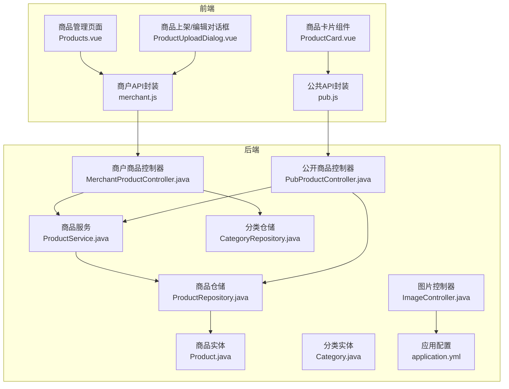
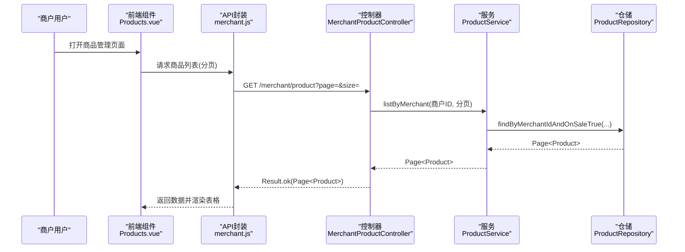
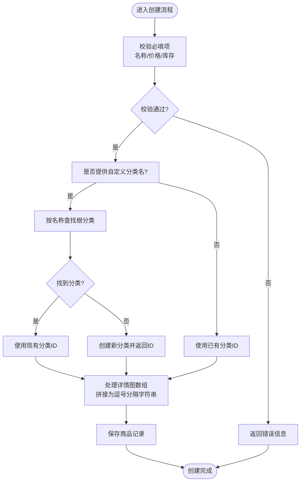
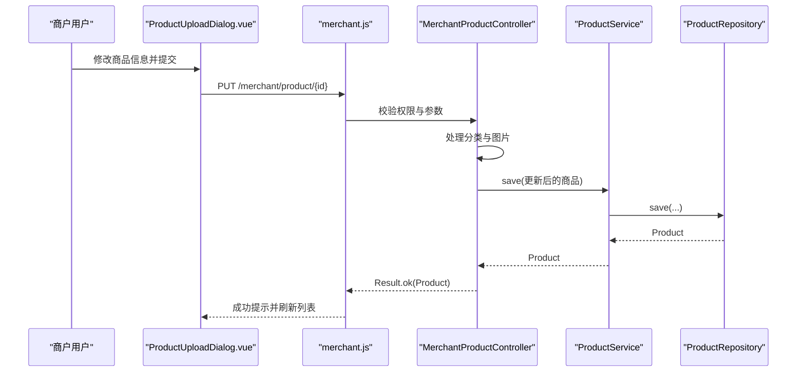
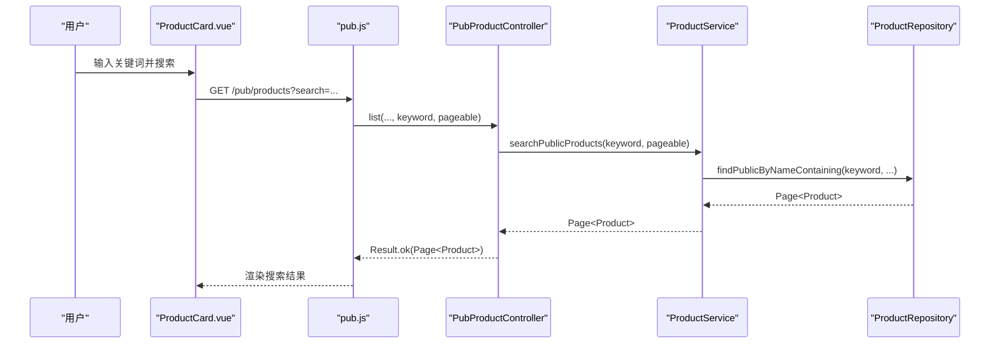
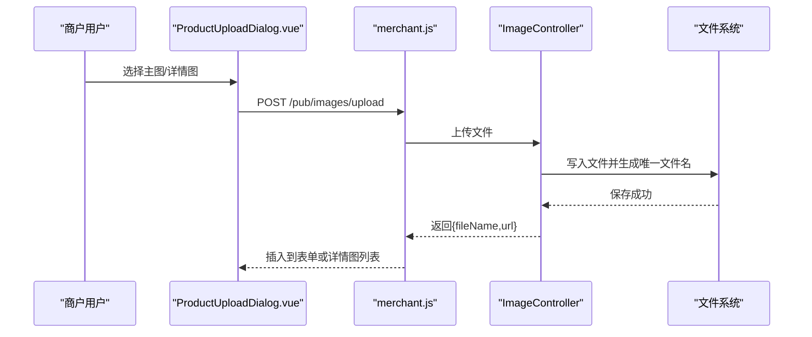
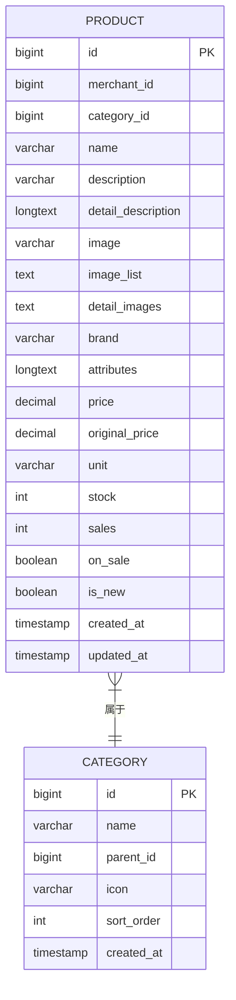
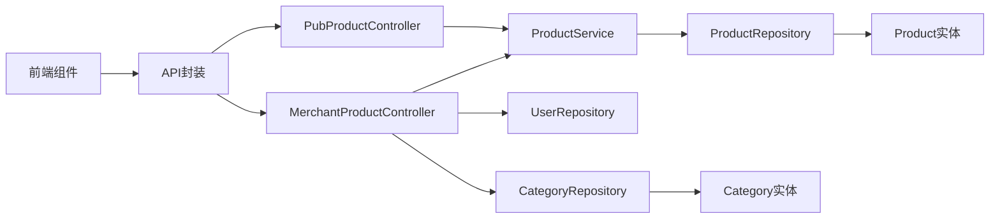

# 商品管理

<cite>
**本文引用的文件**
- [MerchantProductController.java](file://backend/src/main/java/com/mall/controller/merchant/MerchantProductController.java)
- [ProductService.java](file://backend/src/main/java/com/mall/service/ProductService.java)
- [Product.java](file://backend/src/main/java/com/mall/entity/Product.java)
- [ProductCreateRequest.java](file://backend/src/main/java/com/mall/dto/ProductCreateRequest.java)
- [ProductRepository.java](file://backend/src/main/java/com/mall/repository/ProductRepository.java)
- [PubProductController.java](file://backend/src/main/java/com/mall/controller/pub/PubProductController.java)
- [Category.java](file://backend/src/main/java/com/mall/entity/Category.java)
- [CategoryRepository.java](file://backend/src/main/java/com/mall/repository/CategoryRepository.java)
- [ImageController.java](file://backend/src/main/java/com/mall/controller/pub/ImageController.java)
- [application.yml](file://backend/src/main/resources/application.yml)
- [Products.vue](file://frontend/src/views/merchant/Products.vue)
- [ProductUploadDialog.vue](file://frontend/src/components/merchant/ProductUploadDialog.vue)
- [ProductCard.vue](file://frontend/src/components/ProductCard.vue)
- [merchant.js](file://frontend/src/api/merchant.js)
- [pub.js](file://frontend/src/api/pub.js)
</cite>

## 目录
1. [引言](#引言)
2. [项目结构](#项目结构)
3. [核心组件](#核心组件)
4. [架构总览](#架构总览)
5. [详细组件分析](#详细组件分析)
6. [依赖分析](#依赖分析)
7. [性能考虑](#性能考虑)
8. [故障排查指南](#故障排查指南)
9. [结论](#结论)
10. [附录](#附录)

## 引言
本文件面向商户，系统性阐述商品管理功能，覆盖商品的增删改查、信息维护、分类管理、图片上传、价格与库存设置、状态管理（上架/下架）、搜索与筛选、表单验证与图片处理逻辑、自定义分类创建机制，以及前后端交互与操作流程。文档同时提供API调用示例与前端组件使用方法，帮助商户高效完成商品全生命周期管理。

## 项目结构
后端采用Spring Boot + Spring Data JPA，按职责划分为控制器层、服务层、仓储层与实体层；前端基于Vue 3 + Element Plus，提供商品管理页面与对话框组件。公共图片接口统一处理图片上传与访问。

**图表来源**
- [Products.vue](file://frontend/src/views/merchant/Products.vue)
- [ProductUploadDialog.vue](file://frontend/src/components/merchant/ProductUploadDialog.vue)
- [ProductCard.vue](file://frontend/src/components/ProductCard.vue)
- [merchant.js](file://frontend/src/api/merchant.js)
- [pub.js](file://frontend/src/api/pub.js)
- [MerchantProductController.java](file://backend/src/main/java/com/mall/controller/merchant/MerchantProductController.java)
- [ProductService.java](file://backend/src/main/java/com/mall/service/ProductService.java)
- [ProductRepository.java](file://backend/src/main/java/com/mall/repository/ProductRepository.java)
- [Product.java](file://backend/src/main/java/com/mall/entity/Product.java)
- [PubProductController.java](file://backend/src/main/java/com/mall/controller/pub/PubProductController.java)
- [ImageController.java](file://backend/src/main/java/com/mall/controller/pub/ImageController.java)
- [CategoryRepository.java](file://backend/src/main/java/com/mall/repository/CategoryRepository.java)
- [Category.java](file://backend/src/main/java/com/mall/entity/Category.java)
- [application.yml](file://backend/src/main/resources/application.yml)

**章节来源**
- [Products.vue](file://frontend/src/views/merchant/Products.vue)
- [ProductUploadDialog.vue](file://frontend/src/components/merchant/ProductUploadDialog.vue)
- [ProductCard.vue](file://frontend/src/components/ProductCard.vue)
- [merchant.js](file://frontend/src/api/merchant.js)
- [pub.js](file://frontend/src/api/pub.js)
- [MerchantProductController.java](file://backend/src/main/java/com/mall/controller/merchant/MerchantProductController.java)
- [ProductService.java](file://backend/src/main/java/com/mall/service/ProductService.java)
- [ProductRepository.java](file://backend/src/main/java/com/mall/repository/ProductRepository.java)
- [Product.java](file://backend/src/main/java/com/mall/entity/Product.java)
- [PubProductController.java](file://backend/src/main/java/com/mall/controller/pub/PubProductController.java)
- [ImageController.java](file://backend/src/main/java/com/mall/controller/pub/ImageController.java)
- [CategoryRepository.java](file://backend/src/main/java/com/mall/repository/CategoryRepository.java)
- [Category.java](file://backend/src/main/java/com/mall/entity/Category.java)
- [application.yml](file://backend/src/main/resources/application.yml)

## 核心组件
- 控制器层
  - 商户商品控制器：提供商品列表、详情、创建、更新、删除接口，并支持按分类名自动创建分类。
  - 公开商品控制器：提供公开商品列表、详情、新品、销量排行、搜索等接口。
  - 图片控制器：提供图片上传、列表查询与访问。
- 服务层
  - 商品服务：封装商品查询、分页、搜索、库存管理等业务逻辑。
- 仓储层
  - 商品仓储：封装JPA查询，含公开端与管理端查询。
  - 分类仓储：提供分类查询与按名称查找。
- 实体层
  - 商品实体：包含名称、描述、价格、库存、上下架状态、品牌、图片等字段。
  - 分类实体：包含名称、父级、排序等字段。
- 前端组件
  - 商品管理页面：分页表格、操作按钮、分页组件。
  - 商品上架/编辑对话框：表单校验、富文本编辑器、主图与详情图上传、自定义分类输入。
  - 商品卡片组件：前台展示商品信息与价格。

**章节来源**
- [MerchantProductController.java](file://backend/src/main/java/com/mall/controller/merchant/MerchantProductController.java)
- [PubProductController.java](file://backend/src/main/java/com/mall/controller/pub/PubProductController.java)
- [ImageController.java](file://backend/src/main/java/com/mall/controller/pub/ImageController.java)
- [ProductService.java](file://backend/src/main/java/com/mall/service/ProductService.java)
- [ProductRepository.java](file://backend/src/main/java/com/mall/repository/ProductRepository.java)
- [CategoryRepository.java](file://backend/src/main/java/com/mall/repository/CategoryRepository.java)
- [Product.java](file://backend/src/main/java/com/mall/entity/Product.java)
- [Category.java](file://backend/src/main/java/com/mall/entity/Category.java)
- [Products.vue](file://frontend/src/views/merchant/Products.vue)
- [ProductUploadDialog.vue](file://frontend/src/components/merchant/ProductUploadDialog.vue)
- [ProductCard.vue](file://frontend/src/components/ProductCard.vue)

## 架构总览
系统遵循前后端分离架构，前端通过API封装调用后端REST接口；后端控制器负责鉴权与参数校验，服务层封装业务逻辑，仓储层负责数据持久化。商品状态受“上架”与“运营启用”双重控制，仅当两者均为真时才对用户可见。

**图表来源**
- [Products.vue](file://frontend/src/views/merchant/Products.vue)
- [merchant.js](file://frontend/src/api/merchant.js)
- [MerchantProductController.java](file://backend/src/main/java/com/mall/controller/merchant/MerchantProductController.java)
- [ProductService.java](file://backend/src/main/java/com/mall/service/ProductService.java)
- [ProductRepository.java](file://backend/src/main/java/com/mall/repository/ProductRepository.java)

## 详细组件分析

### 商品创建流程（支持自定义分类创建）
- 表单收集：名称、简介、详情、主图、详情图、价格、原价、库存、单位、品牌、是否新品、是否上架、分类选择或自定义分类名。
- 后端校验：名称非空、价格>0、库存≥0。
- 分类处理：若提供自定义分类名，先按名称查找根分类，不存在则创建新分类并返回其ID。
- 图片处理：将前端传入的详情图数组合并为逗号分隔字符串存储于detailImages字段。
- 保存商品：填充其余字段（默认单位、销售量、创建时间等），持久化并返回结果。

**图表来源**
- [MerchantProductController.java](file://backend/src/main/java/com/mall/controller/merchant/MerchantProductController.java)
- [ProductCreateRequest.java](file://backend/src/main/java/com/mall/dto/ProductCreateRequest.java)
- [CategoryRepository.java](file://backend/src/main/java/com/mall/repository/CategoryRepository.java)

**章节来源**
- [MerchantProductController.java](file://backend/src/main/java/com/mall/controller/merchant/MerchantProductController.java)
- [ProductCreateRequest.java](file://backend/src/main/java/com/mall/dto/ProductCreateRequest.java)
- [CategoryRepository.java](file://backend/src/main/java/com/mall/repository/CategoryRepository.java)

### 商品更新机制
- 权限校验：仅允许当前商户拥有该商品时进行更新。
- 分类处理：与创建一致，支持更新时指定自定义分类名以自动创建或复用。
- 图片处理：同创建流程，将详情图数组转为逗号分隔字符串。
- 字段更新：名称、描述、详情、分类、价格、原价、库存、单位、品牌、主图、详情图、新品标记、上架状态等。
- 保存并返回最新商品信息。

**图表来源**
- [ProductUploadDialog.vue](file://frontend/src/components/merchant/ProductUploadDialog.vue)
- [merchant.js](file://frontend/src/api/merchant.js)
- [MerchantProductController.java](file://backend/src/main/java/com/mall/controller/merchant/MerchantProductController.java)
- [ProductService.java](file://backend/src/main/java/com/mall/service/ProductService.java)
- [ProductRepository.java](file://backend/src/main/java/com/mall/repository/ProductRepository.java)

**章节来源**
- [ProductUploadDialog.vue](file://frontend/src/components/merchant/ProductUploadDialog.vue)
- [merchant.js](file://frontend/src/api/merchant.js)
- [MerchantProductController.java](file://backend/src/main/java/com/mall/controller/merchant/MerchantProductController.java)
- [ProductService.java](file://backend/src/main/java/com/mall/service/ProductService.java)
- [ProductRepository.java](file://backend/src/main/java/com/mall/repository/ProductRepository.java)

### 商品状态管理（上架/下架）
- 上架状态字段：商品实体包含onSale布尔字段，默认上架。
- 公开展示条件：公开查询要求商品onSale为真，且所属商户enabled为真。
- 商户侧查询：商户端查询默认仅返回onSale为真的商品，便于日常管理。

**章节来源**
- [Product.java](file://backend/src/main/java/com/mall/entity/Product.java)
- [ProductRepository.java](file://backend/src/main/java/com/mall/repository/ProductRepository.java)
- [ProductService.java](file://backend/src/main/java/com/mall/service/ProductService.java)
- [PubProductController.java](file://backend/src/main/java/com/mall/controller/pub/PubProductController.java)

### 商品搜索与筛选
- 商户侧搜索：按名称或描述模糊匹配，结合分页与库存状态筛选。
- 公开展示搜索：仅对“上架且运营启用”的商品进行搜索，支持关键词匹配。
- 分类筛选：支持按categoryId过滤公开商品列表。
- 排序：公开商品列表支持按价格、销量、创建时间排序。

**图表来源**
- [ProductCard.vue](file://frontend/src/components/ProductCard.vue)
- [pub.js](file://frontend/src/api/pub.js)
- [PubProductController.java](file://backend/src/main/java/com/mall/controller/pub/PubProductController.java)
- [ProductService.java](file://backend/src/main/java/com/mall/service/ProductService.java)
- [ProductRepository.java](file://backend/src/main/java/com/mall/repository/ProductRepository.java)

**章节来源**
- [pub.js](file://frontend/src/api/pub.js)
- [PubProductController.java](file://backend/src/main/java/com/mall/controller/pub/PubProductController.java)
- [ProductService.java](file://backend/src/main/java/com/mall/service/ProductService.java)
- [ProductRepository.java](file://backend/src/main/java/com/mall/repository/ProductRepository.java)

### 分类管理与自动创建
- 分类查询：提供按父级排序的分类列表与按名称查找根分类的能力。
- 自动创建：创建/更新商品时，若提供自定义分类名且不存在，则创建新分类并返回其ID；否则复用现有分类。
- 分类选择：前端对话框支持从现有分类中选择，或输入自定义分类名。

**章节来源**
- [CategoryRepository.java](file://backend/src/main/java/com/mall/repository/CategoryRepository.java)
- [Category.java](file://backend/src/main/java/com/mall/entity/Category.java)
- [MerchantProductController.java](file://backend/src/main/java/com/mall/controller/merchant/MerchantProductController.java)
- [ProductUploadDialog.vue](file://frontend/src/components/merchant/ProductUploadDialog.vue)

### 图片上传与处理
- 支持格式：jpg、jpeg、png、gif、webp、bmp。
- 上传路径：由配置文件中的文件上传路径决定。
- 上传接口：POST /pub/images/upload，返回文件名与可访问URL。
- 前端上传：
  - 主图上传：单文件上传，成功后回填到表单。
  - 详情图上传：多文件上传，带进度条，完成后回填至图片列表。
  - 富文本编辑器：集成图片上传，自动插入图片URL。
- 图片访问：GET /pub/images/view/{fileName} 提供静态资源访问。

**图表来源**
- [ProductUploadDialog.vue](file://frontend/src/components/merchant/ProductUploadDialog.vue)
- [merchant.js](file://frontend/src/api/merchant.js)
- [ImageController.java](file://backend/src/main/java/com/mall/controller/pub/ImageController.java)
- [application.yml](file://backend/src/main/resources/application.yml)

**章节来源**
- [ProductUploadDialog.vue](file://frontend/src/components/merchant/ProductUploadDialog.vue)
- [merchant.js](file://frontend/src/api/merchant.js)
- [ImageController.java](file://backend/src/main/java/com/mall/controller/pub/ImageController.java)
- [application.yml](file://backend/src/main/resources/application.yml)

### 数据模型与字段说明
- 商品实体字段要点
  - 名称、描述、详情、主图、详情图列表、品牌、属性、价格、原价、单位、库存、销量、上架状态、新品标记、创建/更新时间。
- 分类实体字段要点
  - 名称、父级ID、图标、排序、创建时间。

**图表来源**
- [Product.java](file://backend/src/main/java/com/mall/entity/Product.java)
- [Category.java](file://backend/src/main/java/com/mall/entity/Category.java)

**章节来源**
- [Product.java](file://backend/src/main/java/com/mall/entity/Product.java)
- [Category.java](file://backend/src/main/java/com/mall/entity/Category.java)

### 前端组件使用方法
- 商品管理页面
  - 加载商品列表：调用API封装的getProducts(params)。
  - 新增/编辑：打开ProductUploadDialog，提交后刷新列表。
  - 删除：二次确认后调用deleteProduct(id)。
- 商品上架/编辑对话框
  - 表单校验：名称长度、价格>0、库存≥0、分类选择或自定义分类二选一。
  - 图片上传：主图单选、详情图多选、富文本编辑器集成上传。
  - 自定义分类：输入分类名后自动创建或复用。
- 商品卡片组件
  - 展示商品名称、简介、价格、原价、销量、新品/热销标签。
  - 点击跳转详情页，加入购物车（用户端）。

**章节来源**
- [Products.vue](file://frontend/src/views/merchant/Products.vue)
- [ProductUploadDialog.vue](file://frontend/src/components/merchant/ProductUploadDialog.vue)
- [ProductCard.vue](file://frontend/src/components/ProductCard.vue)
- [merchant.js](file://frontend/src/api/merchant.js)
- [pub.js](file://frontend/src/api/pub.js)

### API调用示例
- 获取商品列表（商户）
  - GET /api/merchant/product?page={}&size={}
- 获取商品详情（商户）
  - GET /api/merchant/product/{id}
- 创建商品（商户）
  - POST /api/merchant/product
  - Body：ProductCreateRequest（包含名称、描述、详情、主图、详情图数组、价格、原价、库存、单位、品牌、是否新品、是否上架、分类ID或自定义分类名）
- 更新商品（商户）
  - PUT /api/merchant/product/{id}
  - Body：ProductCreateRequest（字段同上）
- 删除商品（商户）
  - DELETE /api/merchant/product/{id}
- 图片上传（公共）
  - POST /api/pub/images/upload
  - 参数：file（multipart/form-data）

**章节来源**
- [merchant.js](file://frontend/src/api/merchant.js)
- [pub.js](file://frontend/src/api/pub.js)
- [MerchantProductController.java](file://backend/src/main/java/com/mall/controller/merchant/MerchantProductController.java)
- [ImageController.java](file://backend/src/main/java/com/mall/controller/pub/ImageController.java)

## 依赖分析
- 控制器与服务
  - MerchantProductController依赖ProductService、UserRepository、CategoryRepository。
  - ProductService依赖ProductRepository。
- 仓储与实体
  - ProductRepository定义公开与管理端查询方法，Product实体映射数据库表。
  - CategoryRepository提供分类查询与按名称查找。
- 前后端交互
  - 前端通过API封装调用后端控制器；图片上传直连后端图片接口。

**图表来源**
- [MerchantProductController.java](file://backend/src/main/java/com/mall/controller/merchant/MerchantProductController.java)
- [ProductService.java](file://backend/src/main/java/com/mall/service/ProductService.java)
- [ProductRepository.java](file://backend/src/main/java/com/mall/repository/ProductRepository.java)
- [Product.java](file://backend/src/main/java/com/mall/entity/Product.java)
- [CategoryRepository.java](file://backend/src/main/java/com/mall/repository/CategoryRepository.java)
- [Category.java](file://backend/src/main/java/com/mall/entity/Category.java)
- [Products.vue](file://frontend/src/views/merchant/Products.vue)
- [merchant.js](file://frontend/src/api/merchant.js)
- [pub.js](file://frontend/src/api/pub.js)
- [PubProductController.java](file://backend/src/main/java/com/mall/controller/pub/PubProductController.java)

**章节来源**
- [MerchantProductController.java](file://backend/src/main/java/com/mall/controller/merchant/MerchantProductController.java)
- [ProductService.java](file://backend/src/main/java/com/mall/service/ProductService.java)
- [ProductRepository.java](file://backend/src/main/java/com/mall/repository/ProductRepository.java)
- [CategoryRepository.java](file://backend/src/main/java/com/mall/repository/CategoryRepository.java)
- [Products.vue](file://frontend/src/views/merchant/Products.vue)
- [merchant.js](file://frontend/src/api/merchant.js)
- [pub.js](file://frontend/src/api/pub.js)
- [PubProductController.java](file://backend/src/main/java/com/mall/controller/pub/PubProductController.java)

## 性能考虑
- 分页查询：后端默认分页，避免一次性加载大量数据。
- 公开展示过滤：在仓储层直接限制onSale与商户启用状态，减少无效数据传输。
- 图片上传：前端支持多图批量上传与进度反馈，后端校验文件类型与大小，避免无效请求。
- 排序与搜索：公开商品列表支持按价格、销量、创建时间排序，搜索使用LIKE匹配，建议配合索引优化。

## 故障排查指南
- 商品不存在/无权限
  - 现象：更新或删除时提示商品不存在。
  - 排查：确认当前登录商户ID与商品merchantId一致；检查请求路径与参数。
- 表单校验失败
  - 现象：创建/更新时提示名称、价格、库存或分类校验失败。
  - 排查：检查必填字段是否填写完整；价格必须大于0；库存不能为负；分类需选择或提供自定义分类名。
- 图片上传失败
  - 现象：上传后无法显示或返回错误。
  - 排查：确认文件格式符合要求；检查上传路径配置；查看后端日志与返回消息。
- 公开展示为空
  - 现象：前台看不到商品。
  - 排查：确认商品onSale为真且所属商户enabled为真；检查搜索关键词与分类过滤。

**章节来源**
- [MerchantProductController.java](file://backend/src/main/java/com/mall/controller/merchant/MerchantProductController.java)
- [ProductService.java](file://backend/src/main/java/com/mall/service/ProductService.java)
- [ImageController.java](file://backend/src/main/java/com/mall/controller/pub/ImageController.java)

## 结论
本系统围绕“商户视角的商品全生命周期管理”设计，提供完善的增删改查、分类管理、图片上传、价格与库存设置、状态控制与搜索筛选能力。通过前后端清晰的职责划分与统一的API封装，商户可高效完成商品信息维护与日常运营工作。建议在生产环境中进一步完善批量操作、数据导入导出与更细粒度的权限控制。

## 附录
- 配置参考
  - 服务器端口与上下文路径：application.yml中server.port与server.servlet.context-path。
  - 文件上传路径：application.yml中file.upload.path。
- 常用接口
  - 商户商品：GET/POST/PUT/DELETE /api/merchant/product
  - 公开商品：GET /api/pub/products
  - 图片上传：POST /api/pub/images/upload

**章节来源**
- [application.yml](file://backend/src/main/resources/application.yml)
- [merchant.js](file://frontend/src/api/merchant.js)
- [pub.js](file://frontend/src/api/pub.js)