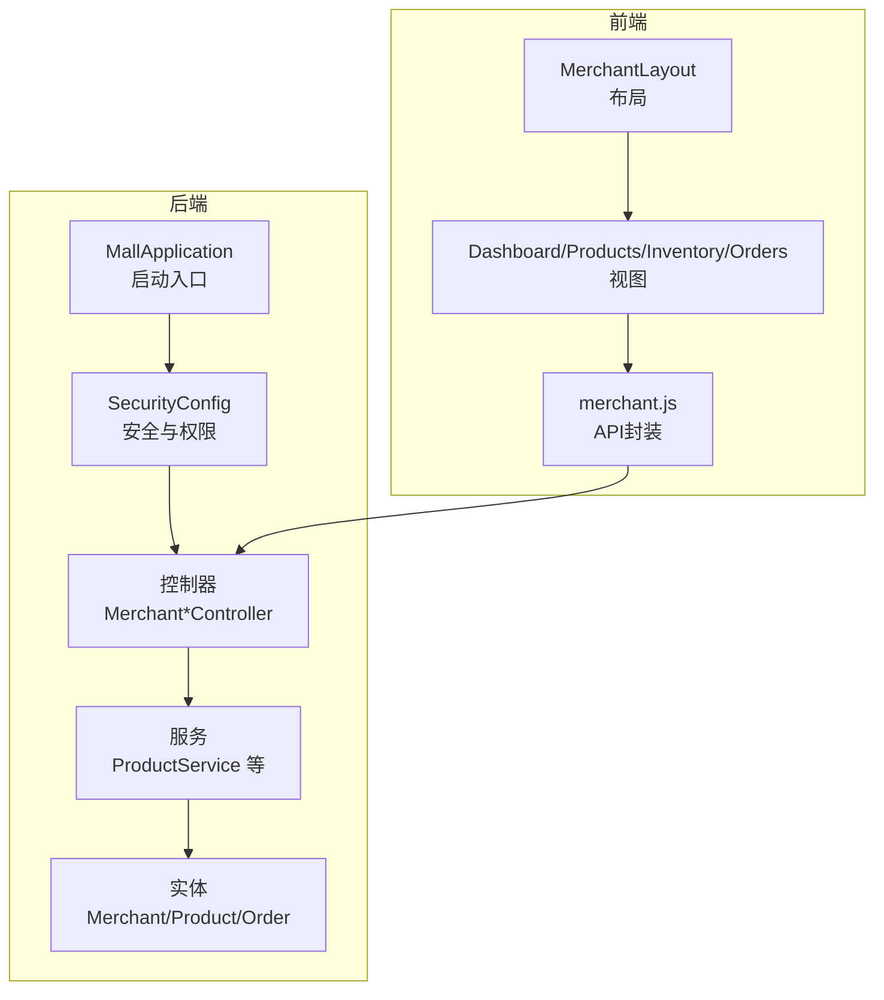
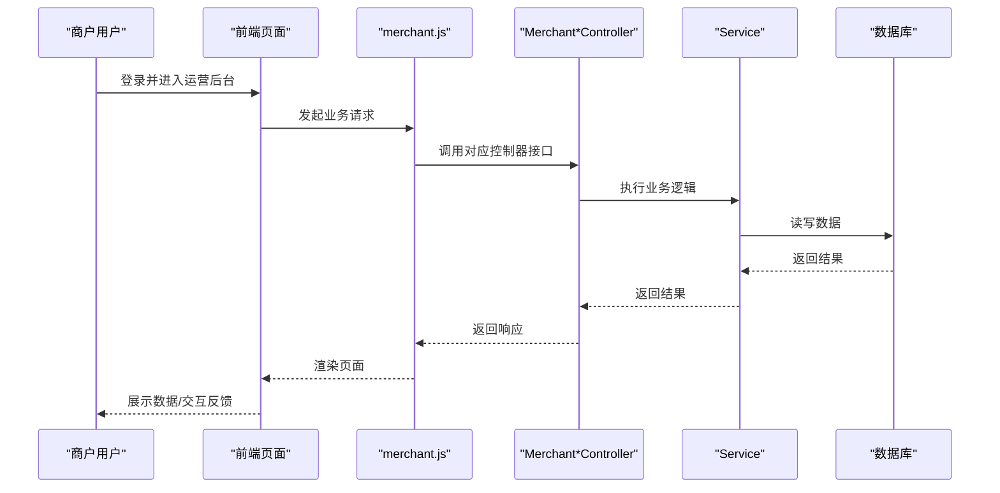
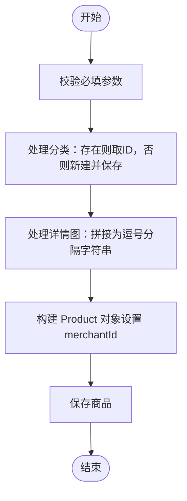
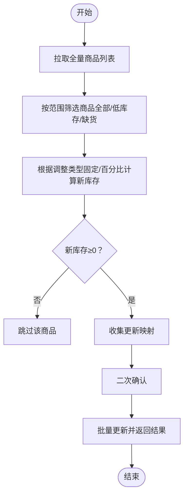
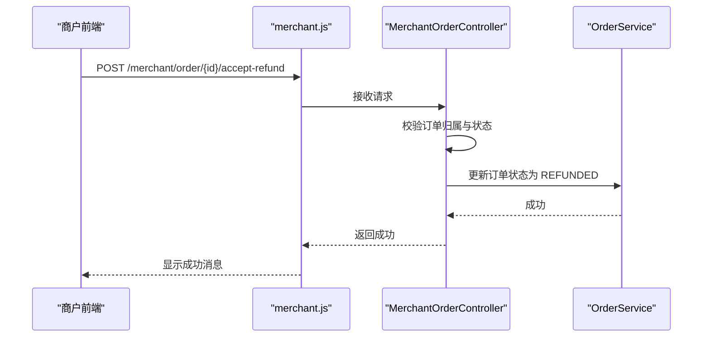
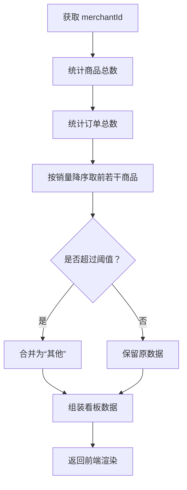
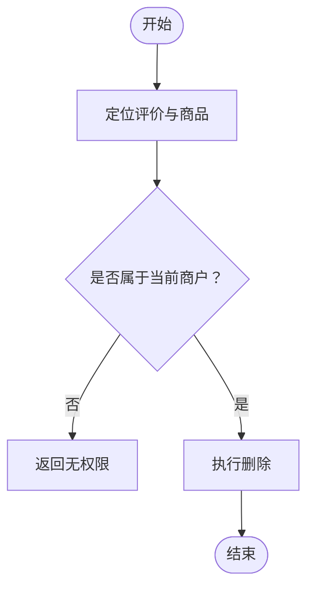
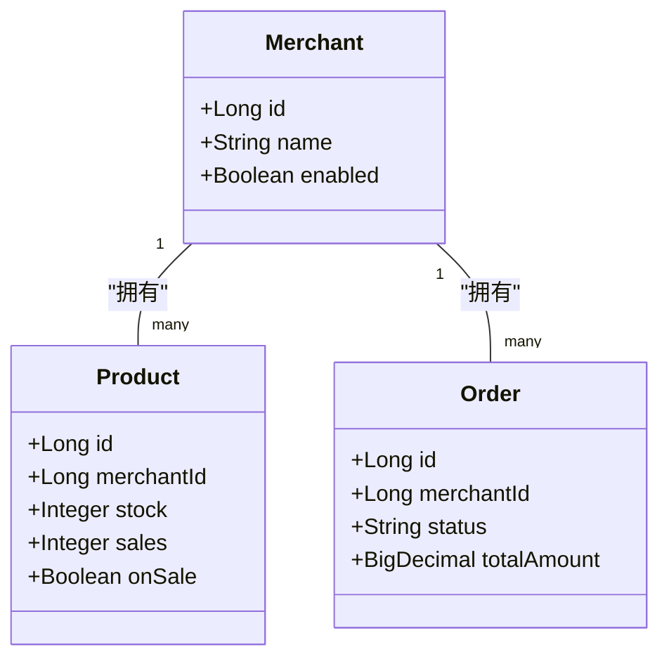

# 商户管理系统

<cite>
**本文引用的文件**
- [MallApplication.java](file://backend/src/main/java/com/mall/MallApplication.java)
- [Role.java](file://backend/src/main/java/com/mall/common/Role.java)
- [SecurityConfig.java](file://backend/src/main/java/com/mall/config/SecurityConfig.java)
- [Merchant.java](file://backend/src/main/java/com/mall/entity/Merchant.java)
- [Product.java](file://backend/src/main/java/com/mall/entity/Product.java)
- [Order.java](file://backend/src/main/java/com/mall/entity/Order.java)
- [MerchantProductController.java](file://backend/src/main/java/com/mall/controller/merchant/MerchantProductController.java)
- [MerchantInventoryController.java](file://backend/src/main/java/com/mall/controller/merchant/MerchantInventoryController.java)
- [MerchantOrderController.java](file://backend/src/main/java/com/mall/controller/merchant/MerchantOrderController.java)
- [MerchantReportController.java](file://backend/src/main/java/com/mall/controller/merchant/MerchantReportController.java)
- [MerchantReviewController.java](file://backend/src/main/java/com/mall/controller/merchant/MerchantReviewController.java)
- [ProductService.java](file://backend/src/main/java/com/mall/service/ProductService.java)
- [MerchantLayout.vue](file://frontend/src/layouts/MerchantLayout.vue)
- [Dashboard.vue](file://frontend/src/views/merchant/Dashboard.vue)
- [Products.vue](file://frontend/src/views/merchant/Products.vue)
- [Inventory.vue](file://frontend/src/views/merchant/Inventory.vue)
- [Orders.vue](file://frontend/src/views/merchant/Orders.vue)
- [merchant.js](file://frontend/src/api/merchant.js)
</cite>

## 目录
1. [简介](#简介)
2. [项目结构](#项目结构)
3. [核心组件](#核心组件)
4. [架构总览](#架构总览)
5. [详细组件分析](#详细组件分析)
6. [依赖分析](#依赖分析)
7. [性能考虑](#性能考虑)
8. [故障排查指南](#故障排查指南)
9. [结论](#结论)
10. [附录](#附录)

## 简介
本系统面向商户提供完整的后台管理能力，覆盖商品管理、库存管理、订单处理、销售报表、评价管理等核心业务模块。系统采用前后端分离架构，后端基于 Spring Boot，前端基于 Vue 3 + Element Plus，通过 JWT 实现权限控制，支持商户维度的数据隔离与操作。

## 项目结构
- 后端
  - 控制器层：按角色划分，商户相关接口位于 merchant 包下
  - 服务层：封装业务逻辑，如商品、库存、订单、报表、评价
  - 实体层：定义数据库模型，如 Merchant、Product、Order
  - 安全配置：基于 Spring Security + JWT，按路径与角色进行授权
- 前端
  - 布局：MerchantLayout 提供统一导航与退出登录
  - 视图：Dashboard、Products、Inventory、Orders 等页面
  - API：merchant.js 封装商户相关请求方法

**图表来源**
- [MallApplication.java:1-13](file://backend/src/main/java/com/mall/MallApplication.java#L1-L13)
- [SecurityConfig.java:1-74](file://backend/src/main/java/com/mall/config/SecurityConfig.java#L1-L74)
- [MerchantProductController.java:1-180](file://backend/src/main/java/com/mall/controller/merchant/MerchantProductController.java#L1-L180)
- [ProductService.java:1-126](file://backend/src/main/java/com/mall/service/ProductService.java#L1-L126)
- [MerchantLayout.vue:1-127](file://frontend/src/layouts/MerchantLayout.vue#L1-L127)
- [merchant.js:1-135](file://frontend/src/api/merchant.js#L1-L135)

**章节来源**
- [MallApplication.java:1-13](file://backend/src/main/java/com/mall/MallApplication.java#L1-L13)
- [SecurityConfig.java:33-55](file://backend/src/main/java/com/mall/config/SecurityConfig.java#L33-L55)
- [MerchantLayout.vue:21-27](file://frontend/src/layouts/MerchantLayout.vue#L21-L27)
- [merchant.js:8-135](file://frontend/src/api/merchant.js#L8-L135)

## 核心组件
- 商户权限控制
  - 基于角色的访问控制：/merchant/** 需要 MERCHANT 角色
  - JWT 过滤器在认证后注入用户上下文，控制器通过 Authentication 获取当前商户
- 商品管理
  - 支持分页查询、详情、新增、更新、删除；支持按分类名自动创建分类
- 库存管理
  - 支持库存查询、单个/批量调整、低库存预警
- 订单处理
  - 支持订单列表、详情、发货、同意退款、单项退款审批
- 销售报表
  - 提供看板数据与销量占比图表
- 评价管理
  - 支持评价列表、按商品查询、删除、批量删除

**章节来源**
- [SecurityConfig.java:48-50](file://backend/src/main/java/com/mall/config/SecurityConfig.java#L48-L50)
- [MerchantProductController.java:36-178](file://backend/src/main/java/com/mall/controller/merchant/MerchantProductController.java#L36-L178)
- [MerchantInventoryController.java:33-117](file://backend/src/main/java/com/mall/controller/merchant/MerchantInventoryController.java#L33-L117)
- [MerchantOrderController.java:37-99](file://backend/src/main/java/com/mall/controller/merchant/MerchantOrderController.java#L37-L99)
- [MerchantReportController.java:41-79](file://backend/src/main/java/com/mall/controller/merchant/MerchantReportController.java#L41-L79)
- [MerchantReviewController.java:39-155](file://backend/src/main/java/com/mall/controller/merchant/MerchantReviewController.java#L39-L155)

## 架构总览
系统采用前后端分离，前端通过 API 层调用后端控制器，控制器经服务层访问仓储层完成持久化。安全层统一拦截请求并校验角色与权限。

**图表来源**
- [merchant.js:8-135](file://frontend/src/api/merchant.js#L8-L135)
- [MerchantProductController.java:36-178](file://backend/src/main/java/com/mall/controller/merchant/MerchantProductController.java#L36-L178)
- [MerchantInventoryController.java:33-117](file://backend/src/main/java/com/mall/controller/merchant/MerchantInventoryController.java#L33-L117)
- [MerchantOrderController.java:37-99](file://backend/src/main/java/com/mall/controller/merchant/MerchantOrderController.java#L37-L99)
- [MerchantReportController.java:41-79](file://backend/src/main/java/com/mall/controller/merchant/MerchantReportController.java#L41-L79)
- [MerchantReviewController.java:39-155](file://backend/src/main/java/com/mall/controller/merchant/MerchantReviewController.java#L39-L155)

## 详细组件分析

### 商品管理模块
- 功能要点
  - 分页查询当前商户商品
  - 商品详情校验归属
  - 新增/更新时支持按分类名自动创建分类
  - 图片详情字段支持多种输入方式
- 关键流程（新增商品）

**图表来源**
- [MerchantProductController.java:56-114](file://backend/src/main/java/com/mall/controller/merchant/MerchantProductController.java#L56-L114)

**章节来源**
- [MerchantProductController.java:36-178](file://backend/src/main/java/com/mall/controller/merchant/MerchantProductController.java#L36-L178)
- [ProductService.java:52-55](file://backend/src/main/java/com/mall/service/ProductService.java#L52-L55)

### 库存管理模块
- 功能要点
  - 支持关键词与库存状态筛选
  - 单个/批量库存调整
  - 低库存预警（阈值可配）
- 关键流程（批量调整）

**图表来源**
- [Inventory.vue:548-642](file://frontend/src/views/merchant/Inventory.vue#L548-L642)
- [MerchantInventoryController.java:77-108](file://backend/src/main/java/com/mall/controller/merchant/MerchantInventoryController.java#L77-L108)

**章节来源**
- [MerchantInventoryController.java:33-117](file://backend/src/main/java/com/mall/controller/merchant/MerchantInventoryController.java#L33-L117)
- [Inventory.vue:405-458](file://frontend/src/views/merchant/Inventory.vue#L405-L458)

### 订单处理模块
- 功能要点
  - 订单列表与详情（含订单项）
  - 发货：仅允许已支付订单
  - 同意退款：仅处理“退货申请中”订单
  - 单项退款审批
- 关键流程（同意退款）

**图表来源**
- [merchant.js:117-120](file://frontend/src/api/merchant.js#L117-L120)
- [MerchantOrderController.java:73-85](file://backend/src/main/java/com/mall/controller/merchant/MerchantOrderController.java#L73-L85)

**章节来源**
- [MerchantOrderController.java:37-99](file://backend/src/main/java/com/mall/controller/merchant/MerchantOrderController.java#L37-L99)

### 销售报表模块
- 功能要点
  - 看板：商品数、订单数
  - 销量占比：Top10 商品，其余合并为“其他”
- 关键流程（看板数据）

**图表来源**
- [MerchantReportController.java:41-79](file://backend/src/main/java/com/mall/controller/merchant/MerchantReportController.java#L41-L79)

**章节来源**
- [MerchantReportController.java:41-79](file://backend/src/main/java/com/mall/controller/merchant/MerchantReportController.java#L41-L79)
- [Dashboard.vue:43-113](file://frontend/src/views/merchant/Dashboard.vue#L43-L113)

### 评价管理模块
- 功能要点
  - 查询当前商户所有商品的评价
  - 支持按商品与最低评分过滤
  - 删除单条/批量删除
- 关键流程（删除评价）

**图表来源**
- [MerchantReviewController.java:112-132](file://backend/src/main/java/com/mall/controller/merchant/MerchantReviewController.java#L112-L132)

**章节来源**
- [MerchantReviewController.java:39-155](file://backend/src/main/java/com/mall/controller/merchant/MerchantReviewController.java#L39-L155)

### 前端界面与交互
- 布局与导航
  - MerchantLayout 提供统一顶部栏与菜单导航，支持退出登录
- 数据看板
  - Dashboard 展示商品数、订单数与销量占比饼图
- 商品管理
  - Products 页面支持分页、编辑、删除、查看详情
- 库存管理
  - Inventory 页面支持搜索、筛选、快速调整、批量调整与预警统计
- 订单管理
  - Orders 页面展示订单状态与发货、退款处理入口

**章节来源**
- [MerchantLayout.vue:19-35](file://frontend/src/layouts/MerchantLayout.vue#L19-L35)
- [Dashboard.vue:8-31](file://frontend/src/views/merchant/Dashboard.vue#L8-L31)
- [Products.vue:18-98](file://frontend/src/views/merchant/Products.vue#L18-L98)
- [Inventory.vue:1-800](file://frontend/src/views/merchant/Inventory.vue#L1-L800)
- [Orders.vue:8-78](file://frontend/src/views/merchant/Orders.vue#L8-L78)

## 依赖分析
- 角色与权限
  - 角色枚举定义了 ADMIN、MERCHANT、USER
  - SecurityConfig 对 /merchant/** 路径要求 MERCHANT 角色
- 控制器与服务
  - MerchantProductController 依赖 ProductService、UserRepository、CategoryRepository
  - MerchantInventoryController 依赖 ProductService、UserRepository
  - MerchantOrderController 依赖 OrderService、UserRepository
  - MerchantReportController 依赖 UserRepository、ProductRepository、OrderRepository
  - MerchantReviewController 依赖 ProductReviewRepository、ProductRepository、UserRepository
- 实体关系
  - Product.merchantId 与 Merchant.id 关联
  - Order.merchantId 与 Merchant.id 关联

**图表来源**
- [Merchant.java:15-56](file://backend/src/main/java/com/mall/entity/Merchant.java#L15-L56)
- [Product.java:16-101](file://backend/src/main/java/com/mall/entity/Product.java#L16-L101)
- [Order.java:16-83](file://backend/src/main/java/com/mall/entity/Order.java#L16-L83)

**章节来源**
- [Role.java:3-7](file://backend/src/main/java/com/mall/common/Role.java#L3-L7)
- [SecurityConfig.java:48-50](file://backend/src/main/java/com/mall/config/SecurityConfig.java#L48-L50)
- [MerchantProductController.java:24-26](file://backend/src/main/java/com/mall/controller/merchant/MerchantProductController.java#L24-L26)
- [MerchantInventoryController.java:22-23](file://backend/src/main/java/com/mall/controller/merchant/MerchantInventoryController.java#L22-L23)
- [MerchantOrderController.java:26-27](file://backend/src/main/java/com/mall/controller/merchant/MerchantOrderController.java#L26-L27)
- [MerchantReportController.java:29-31](file://backend/src/main/java/com/mall/controller/merchant/MerchantReportController.java#L29-L31)
- [MerchantReviewController.java:27-29](file://backend/src/main/java/com/mall/controller/merchant/MerchantReviewController.java#L27-L29)

## 性能考虑
- 分页查询
  - 商品、库存、评价、订单均使用分页参数，避免一次性加载大量数据
- 查询优化
  - ProductService 提供按商户维度的分页查询，减少无关数据扫描
- 前端渲染
  - 报表使用 ECharts 渲染，建议在数据量大时进行虚拟滚动或服务端聚合
- 批量操作
  - 库存批量调整建议限制单次更新数量，避免长事务与锁竞争

[本节为通用指导，无需源码引用]

## 故障排查指南
- 权限相关
  - 若出现 403/401，检查登录用户角色是否为 MERCHANT，以及请求路径是否匹配 /merchant/**
- 商品操作
  - 新增/更新失败可能由于价格或库存参数不合法，需检查入参校验
- 库存调整
  - 批量调整时若部分商品失败，前端会提示具体商品ID，需核对库存合法性
- 订单状态
  - 发货仅允许已支付订单，同意退款仅允许“退货申请中”订单，状态不符会返回错误
- 前端交互
  - 若看板无数据，检查后端报表接口返回结构与前端渲染逻辑

**章节来源**
- [SecurityConfig.java:48-50](file://backend/src/main/java/com/mall/config/SecurityConfig.java#L48-L50)
- [MerchantProductController.java:59-67](file://backend/src/main/java/com/mall/controller/merchant/MerchantProductController.java#L59-L67)
- [MerchantInventoryController.java:54-56](file://backend/src/main/java/com/mall/controller/merchant/MerchantInventoryController.java#L54-L56)
- [MerchantOrderController.java:68-82](file://backend/src/main/java/com/mall/controller/merchant/MerchantOrderController.java#L68-L82)
- [Dashboard.vue:72-112](file://frontend/src/views/merchant/Dashboard.vue#L72-L112)

## 结论
本系统围绕商户维度提供完整的能力闭环：商品、库存、订单、报表与评价管理，配合完善的权限控制与前后端协作，能够满足日常运营需求。后续可在查询性能、批量操作并发控制与报表导出等方面进一步优化。

[本节为总结性内容，无需源码引用]

## 附录

### API 调用示例（后端接口）
- 商品管理
  - GET /merchant/product?page=&size=
  - GET /merchant/product/{id}
  - POST /merchant/product
  - PUT /merchant/product/{id}
  - DELETE /merchant/product/{id}
- 库存管理
  - GET /merchant/inventory?page=&size=&keyword=&stockStatus=
  - PUT /merchant/inventory/{productId}/stock
  - PUT /merchant/inventory/batch-stock
  - GET /merchant/inventory/warnings?threshold=
- 订单管理
  - GET /merchant/order?page=&size=
  - GET /merchant/order/{id}
  - POST /merchant/order/{id}/ship
  - POST /merchant/order/{id}/accept-refund
  - POST /merchant/order/{orderId}/items/{itemId}/accept-refund
- 报表
  - GET /merchant/report/dashboard
- 评价管理
  - GET /merchant/review?page=&size=&productId=&minRating=
  - GET /merchant/review/product/{productId}
  - DELETE /merchant/review/{reviewId}
  - POST /merchant/review/batch-delete

**章节来源**
- [MerchantProductController.java:36-178](file://backend/src/main/java/com/mall/controller/merchant/MerchantProductController.java#L36-L178)
- [MerchantInventoryController.java:33-117](file://backend/src/main/java/com/mall/controller/merchant/MerchantInventoryController.java#L33-L117)
- [MerchantOrderController.java:37-99](file://backend/src/main/java/com/mall/controller/merchant/MerchantOrderController.java#L37-L99)
- [MerchantReportController.java:41-79](file://backend/src/main/java/com/mall/controller/merchant/MerchantReportController.java#L41-L79)
- [MerchantReviewController.java:39-155](file://backend/src/main/java/com/mall/controller/merchant/MerchantReviewController.java#L39-L155)

### 前端 API 使用（merchant.js）
- 报表：getReport()
- 商品：getProducts()/getProduct()/createProduct()/updateProduct()/deleteProduct()
- 库存：getInventory()/updateProductStock()/batchUpdateStock()/getStockWarnings()
- 订单：getOrders()/getOrderDetail()/shipOrder()/acceptRefund()
- 评价：getReviews()/getProductReviews()/deleteReview()/deleteReviews()

**章节来源**
- [merchant.js:8-135](file://frontend/src/api/merchant.js#L8-L135)