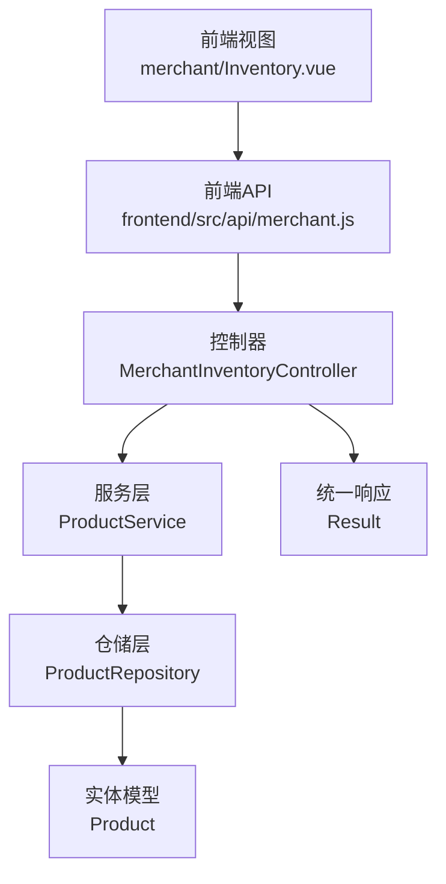
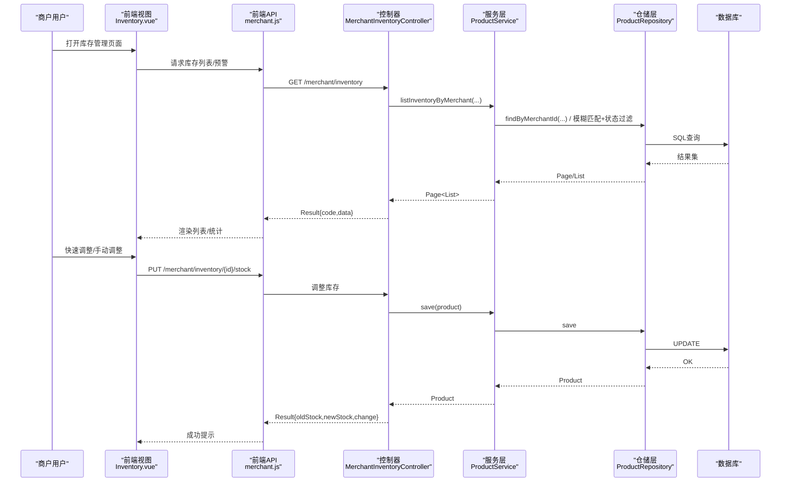
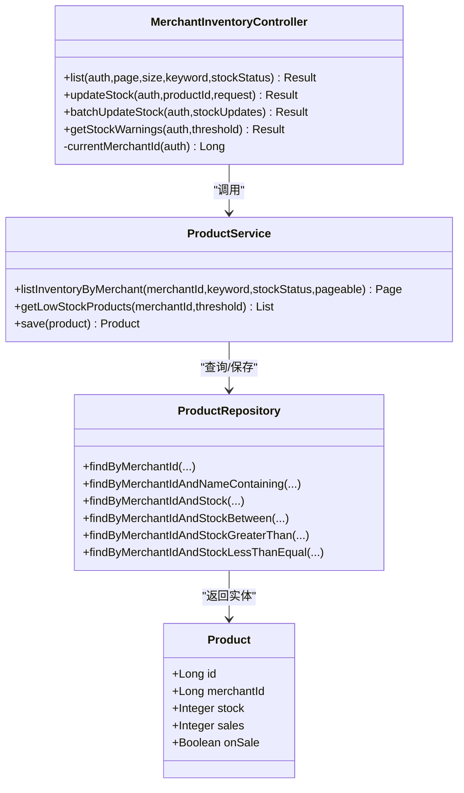
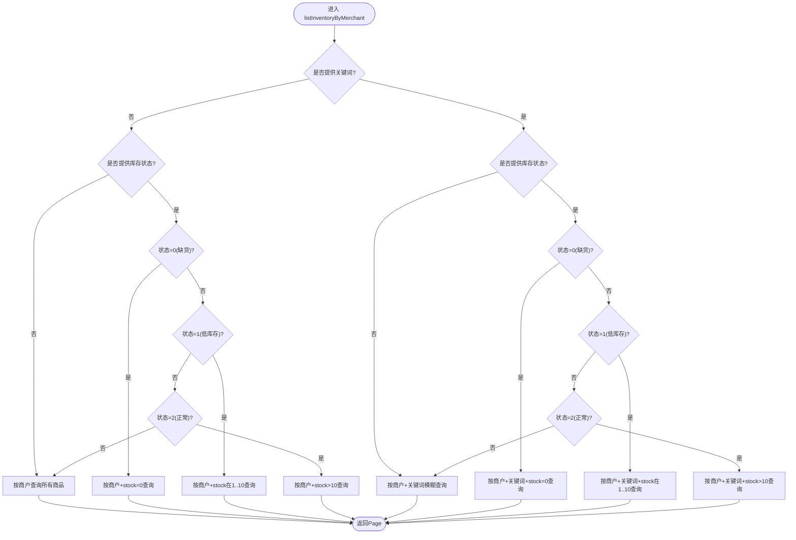
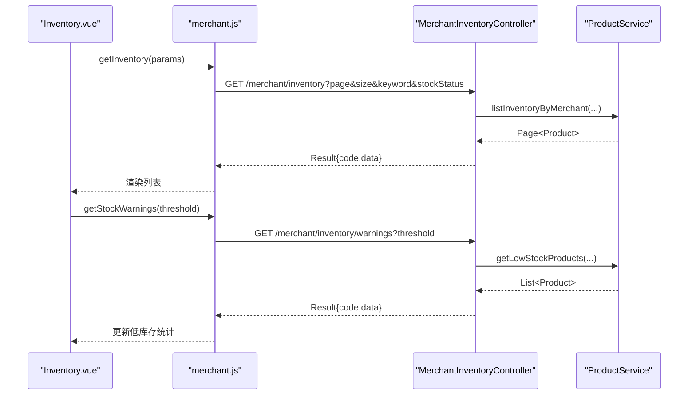
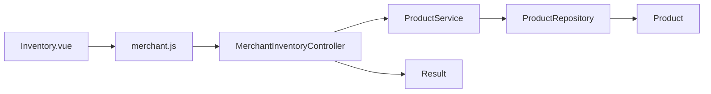

# 库存管理

<cite>
**本文引用的文件**
- [MerchantInventoryController.java](file://backend/src/main/java/com/mall/controller/merchant/MerchantInventoryController.java)
- [ProductService.java](file://backend/src/main/java/com/mall/service/ProductService.java)
- [ProductRepository.java](file://backend/src/main/java/com/mall/repository/ProductRepository.java)
- [Product.java](file://backend/src/main/java/com/mall/entity/Product.java)
- [Inventory.vue](file://frontend/src/views/merchant/Inventory.vue)
- [merchant.js](file://frontend/src/api/merchant.js)
- [application.yml](file://backend/src/main/resources/application.yml)
- [Result.java](file://backend/src/main/java/com/mall/dto/Result.java)
- [DataInitializer.java](file://backend/src/main/java/com/mall/config/DataInitializer.java)
</cite>

## 目录
1. [简介](#简介)
2. [项目结构](#项目结构)
3. [核心组件](#核心组件)
4. [架构总览](#架构总览)
5. [详细组件分析](#详细组件分析)
6. [依赖分析](#依赖分析)
7. [性能考虑](#性能考虑)
8. [故障排查指南](#故障排查指南)
9. [结论](#结论)
10. [附录](#附录)

## 简介
本文件面向商户，系统性阐述“库存管理”功能，包括库存查询、库存调整、库存预警、库存统计等模块；解释实时库存监控机制、库存变更记录、低库存提醒设置、安全库存阈值配置；并提供库存盘点流程、批量库存修改、库存报表生成、库存成本计算的实践建议。目标是帮助商户有效控制库存水平，避免缺货或积压。

## 项目结构
后端采用Spring Boot + JPA，前端使用Vue + Element UI，库存管理功能位于商户端模块：
- 后端控制器：/merchant/inventory
- 业务服务：ProductService
- 数据访问：ProductRepository
- 实体模型：Product
- 前端视图：merchant/Inventory.vue
- 前端API：frontend/src/api/merchant.js

图表来源
- [MerchantInventoryController.java:16-118](file://backend/src/main/java/com/mall/controller/merchant/MerchantInventoryController.java#L16-L118)
- [ProductService.java:15-125](file://backend/src/main/java/com/mall/service/ProductService.java#L15-L125)
- [ProductRepository.java:12-124](file://backend/src/main/java/com/mall/repository/ProductRepository.java#L12-L124)
- [Product.java:9-101](file://backend/src/main/java/com/mall/entity/Product.java#L9-L101)
- [merchant.js:68-88](file://frontend/src/api/merchant.js#L68-L88)
- [Inventory.vue:339-668](file://frontend/src/views/merchant/Inventory.vue#L339-L668)
- [Result.java:10-23](file://backend/src/main/java/com/mall/dto/Result.java#L10-L23)

章节来源
- [MerchantInventoryController.java:16-118](file://backend/src/main/java/com/mall/controller/merchant/MerchantInventoryController.java#L16-L118)
- [ProductService.java:15-125](file://backend/src/main/java/com/mall/service/ProductService.java#L15-L125)
- [ProductRepository.java:12-124](file://backend/src/main/java/com/mall/repository/ProductRepository.java#L12-L124)
- [Product.java:9-101](file://backend/src/main/java/com/mall/entity/Product.java#L9-L101)
- [merchant.js:68-88](file://frontend/src/api/merchant.js#L68-L88)
- [Inventory.vue:339-668](file://frontend/src/views/merchant/Inventory.vue#L339-L668)
- [Result.java:10-23](file://backend/src/main/java/com/mall/dto/Result.java#L10-L23)

## 核心组件
- 控制器：提供库存查询、库存调整、批量调整、库存预警接口
- 服务层：封装库存查询逻辑、低库存筛选
- 仓储层：基于JPA的库存相关查询方法
- 实体模型：包含库存字段stock、销量sales、上下架状态onSale等
- 前端视图：库存列表、快速调整、批量调整、预警统计
- 前端API：封装REST调用

章节来源
- [MerchantInventoryController.java:33-117](file://backend/src/main/java/com/mall/controller/merchant/MerchantInventoryController.java#L33-L117)
- [ProductService.java:94-124](file://backend/src/main/java/com/mall/service/ProductService.java#L94-L124)
- [ProductRepository.java:107-124](file://backend/src/main/java/com/mall/repository/ProductRepository.java#L107-L124)
- [Product.java:68-82](file://backend/src/main/java/com/mall/entity/Product.java#L68-L82)
- [merchant.js:70-88](file://frontend/src/api/merchant.js#L70-L88)
- [Inventory.vue:404-668](file://frontend/src/views/merchant/Inventory.vue#L404-L668)

## 架构总览
从用户操作到数据库的完整链路如下：

图表来源
- [MerchantInventoryController.java:33-117](file://backend/src/main/java/com/mall/controller/merchant/MerchantInventoryController.java#L33-L117)
- [ProductService.java:94-124](file://backend/src/main/java/com/mall/service/ProductService.java#L94-L124)
- [ProductRepository.java:107-124](file://backend/src/main/java/com/mall/repository/ProductRepository.java#L107-L124)
- [merchant.js:70-88](file://frontend/src/api/merchant.js#L70-L88)
- [Inventory.vue:404-668](file://frontend/src/views/merchant/Inventory.vue#L404-L668)

## 详细组件分析

### 控制器：库存管理接口
- 接口路径前缀：/merchant/inventory
- 主要接口
  - GET /merchant/inventory：分页查询当前商户库存，支持关键词与库存状态过滤
  - PUT /merchant/inventory/{productId}/stock：调整单个商品库存
  - PUT /merchant/inventory/batch-stock：批量调整库存
  - GET /merchant/inventory/warnings：获取低库存商品（阈值可配）

图表来源
- [MerchantInventoryController.java:16-118](file://backend/src/main/java/com/mall/controller/merchant/MerchantInventoryController.java#L16-L118)
- [ProductService.java:15-125](file://backend/src/main/java/com/mall/service/ProductService.java#L15-L125)
- [ProductRepository.java:12-124](file://backend/src/main/java/com/mall/repository/ProductRepository.java#L12-L124)
- [Product.java:16-101](file://backend/src/main/java/com/mall/entity/Product.java#L16-L101)

章节来源
- [MerchantInventoryController.java:33-117](file://backend/src/main/java/com/mall/controller/merchant/MerchantInventoryController.java#L33-L117)

### 服务层：库存查询与低库存筛选
- listInventoryByMerchant：根据关键词与库存状态进行组合查询，支持缺货、低库存、正常库存三类状态
- getLowStockProducts：按阈值筛选低库存商品

图表来源
- [ProductService.java:94-119](file://backend/src/main/java/com/mall/service/ProductService.java#L94-L119)

章节来源
- [ProductService.java:94-124](file://backend/src/main/java/com/mall/service/ProductService.java#L94-L124)

### 仓储层：库存相关查询方法
- 提供按商户、关键词、库存区间、阈值等条件的查询方法，支撑前端筛选与预警

章节来源
- [ProductRepository.java:107-124](file://backend/src/main/java/com/mall/repository/ProductRepository.java#L107-L124)

### 实体模型：库存字段与业务含义
- stock：当前库存数量，默认0
- sales：销量，默认0
- onSale：是否上架，默认true
- merchantId：所属商户ID

章节来源
- [Product.java:68-82](file://backend/src/main/java/com/mall/entity/Product.java#L68-L82)

### 前端：库存管理界面与交互
- 概览卡片：总商品数、低库存商品数、缺货商品数、总库存量
- 搜索与筛选：关键词、库存状态（全部/缺货/低库存/正常）
- 库存列表：商品信息、当前库存、月销量、销售转化率、快速调整、详细调整
- 批量调整：固定值/百分比两种模式，支持全量、低库存、缺货三种目标范围
- 预警统计：通过GET /merchant/inventory/warnings获取低库存商品

图表来源
- [merchant.js:70-88](file://frontend/src/api/merchant.js#L70-L88)
- [MerchantInventoryController.java:33-117](file://backend/src/main/java/com/mall/controller/merchant/MerchantInventoryController.java#L33-L117)
- [ProductService.java:94-124](file://backend/src/main/java/com/mall/service/ProductService.java#L94-L124)
- [Inventory.vue:404-668](file://frontend/src/views/merchant/Inventory.vue#L404-L668)

章节来源
- [merchant.js:70-88](file://frontend/src/api/merchant.js#L70-L88)
- [Inventory.vue:404-668](file://frontend/src/views/merchant/Inventory.vue#L404-L668)

## 依赖分析
- 控制器依赖服务层，服务层依赖仓储层，仓储层依赖实体模型
- 前端通过API封装调用后端控制器
- 统一响应对象Result用于前后端约定

图表来源
- [MerchantInventoryController.java:16-118](file://backend/src/main/java/com/mall/controller/merchant/MerchantInventoryController.java#L16-L118)
- [ProductService.java:15-125](file://backend/src/main/java/com/mall/service/ProductService.java#L15-L125)
- [ProductRepository.java:12-124](file://backend/src/main/java/com/mall/repository/ProductRepository.java#L12-L124)
- [Product.java:9-101](file://backend/src/main/java/com/mall/entity/Product.java#L9-L101)
- [merchant.js:68-88](file://frontend/src/api/merchant.js#L68-L88)
- [Result.java:10-23](file://backend/src/main/java/com/mall/dto/Result.java#L10-L23)

章节来源
- [Result.java:10-23](file://backend/src/main/java/com/mall/dto/Result.java#L10-L23)

## 性能考虑
- 分页查询：后端默认每页10条，前端支持10/20/50/100切换，建议结合关键词与状态筛选降低数据量
- 低库存预警：阈值参数可调，建议根据品类与销售节奏设置不同阈值
- 批量调整：前端一次性拉取全量商品以计算新库存，建议限制最大拉取数量或分批执行
- 数据库索引：建议对merchantId、stock、onSale建立合适索引以提升查询性能
- 前端渲染：大列表时注意虚拟滚动与懒加载策略

## 故障排查指南
- 权限校验失败：控制器会校验当前登录用户是否属于商户，若返回“非运营账号”，请检查登录用户角色与merchantId
- 库存调整失败：当库存小于0或商品不存在/无权限时，会返回错误信息，请检查输入值与商品归属
- 批量调整异常：若部分商品不满足条件或库存为负，前端会提示“没有符合条件的商品”，请检查应用范围与调整值
- 预警为空：当阈值过低或过高时可能无结果，建议调整阈值重新查询

章节来源
- [MerchantInventoryController.java:25-31](file://backend/src/main/java/com/mall/controller/merchant/MerchantInventoryController.java#L25-L31)
- [MerchantInventoryController.java:52-61](file://backend/src/main/java/com/mall/controller/merchant/MerchantInventoryController.java#L52-L61)
- [MerchantInventoryController.java:87-95](file://backend/src/main/java/com/mall/controller/merchant/MerchantInventoryController.java#L87-L95)
- [Inventory.vue:550-612](file://frontend/src/views/merchant/Inventory.vue#L550-L612)

## 结论
该库存管理模块提供了完整的商户端库存查询、调整、预警与统计能力，前后端职责清晰、扩展性强。建议在生产环境中结合业务场景优化阈值配置、批量操作策略与数据库索引，并持续关注前端渲染性能与用户体验。

## 附录

### API定义与调用示例
- 查询库存列表
  - 方法：GET
  - 路径：/merchant/inventory
  - 参数：page、size、keyword、stockStatus
  - 示例：GET /merchant/inventory?page=0&size=10&keyword=足球&stockStatus=1
- 调整单个商品库存
  - 方法：PUT
  - 路径：/merchant/inventory/{productId}/stock
  - 请求体：{ "stock": 100 }
  - 示例：PUT /merchant/inventory/123/stock
- 批量调整库存
  - 方法：PUT
  - 路径：/merchant/inventory/batch-stock
  - 请求体：{ "productId": newStock, ... }
  - 示例：PUT /merchant/inventory/batch-stock
- 获取低库存商品
  - 方法：GET
  - 路径：/merchant/inventory/warnings
  - 参数：threshold（默认10）
  - 示例：GET /merchant/inventory/warnings?threshold=5

章节来源
- [merchant.js:70-88](file://frontend/src/api/merchant.js#L70-L88)
- [MerchantInventoryController.java:33-117](file://backend/src/main/java/com/mall/controller/merchant/MerchantInventoryController.java#L33-L117)

### 安全库存阈值配置建议
- 不同品类设置差异化阈值：热销品可设较低阈值，滞销品可适当提高
- 季节性商品：根据历史销售与补货周期动态调整
- 促销活动期间：临时提高阈值，避免缺货影响销售

### 库存盘点流程建议
- 周期性盘点：建议按月/季度进行全盘，日常以系统库存为准
- 异常处理：发现差异时先冻结相关商品，核对出入库记录后再调整
- 记录留痕：每次盘点与调整均应保留日志，便于审计

### 库存成本计算建议
- 单品成本：建议在商品录入时维护成本价字段，便于计算毛利
- 库存总成本：成本价 × 当前库存总量
- 库存周转率：销量 ÷ 平均库存，用于评估资金占用效率

### 预警通知机制
- 阈值触发：当库存低于阈值时，系统可推送消息至商户后台或短信提醒
- 多级预警：如库存降至0、1、5等节点分别触发不同级别提醒
- 自动补货建议：结合历史销量与供应商交期，给出补货建议