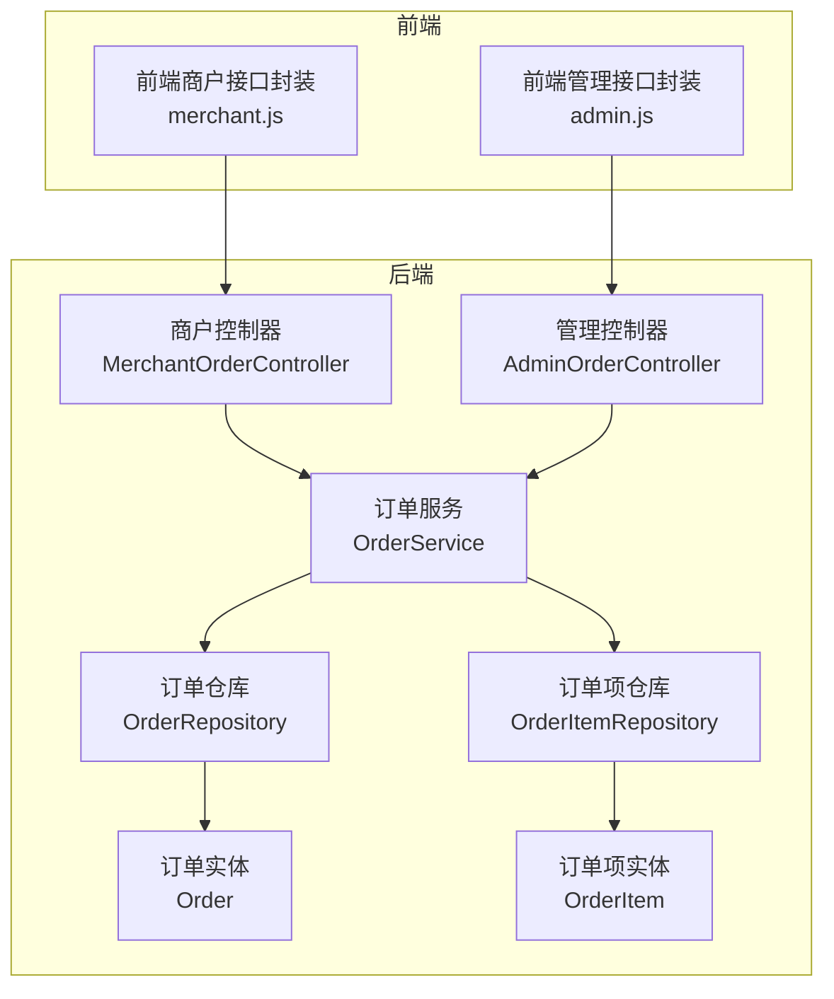
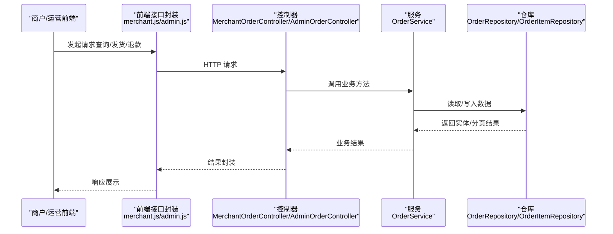
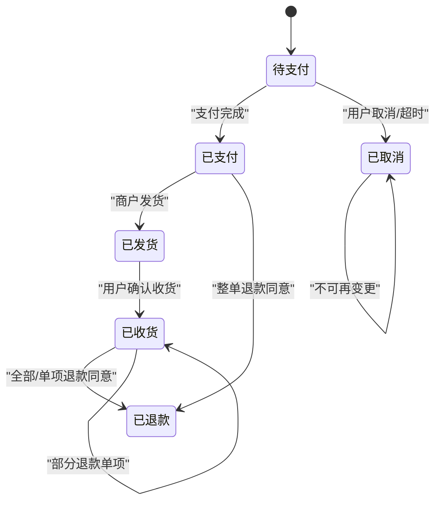
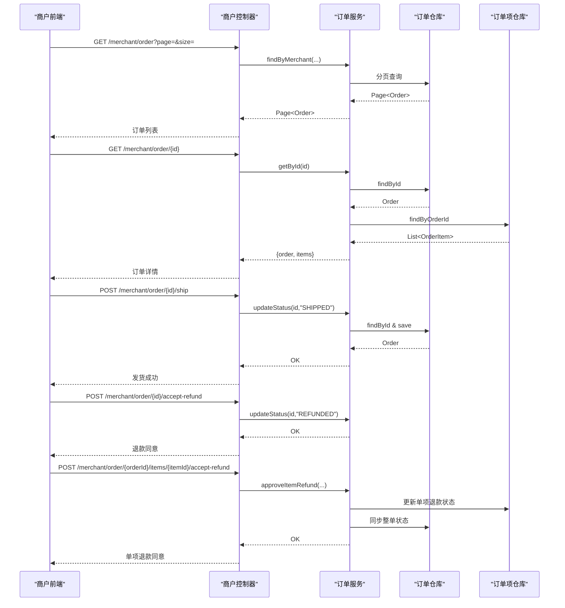
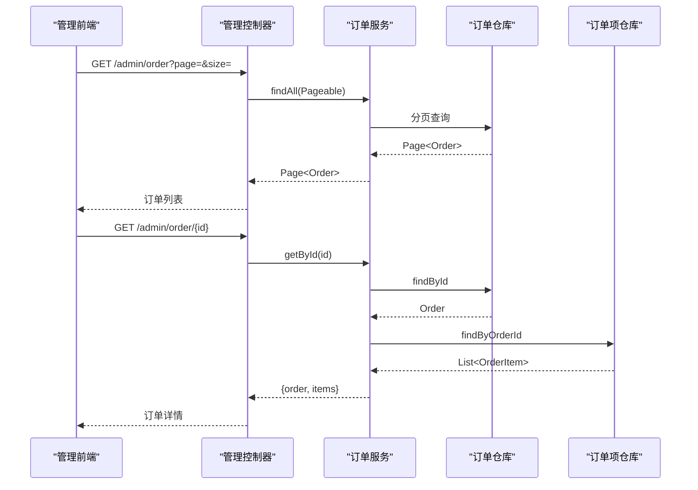
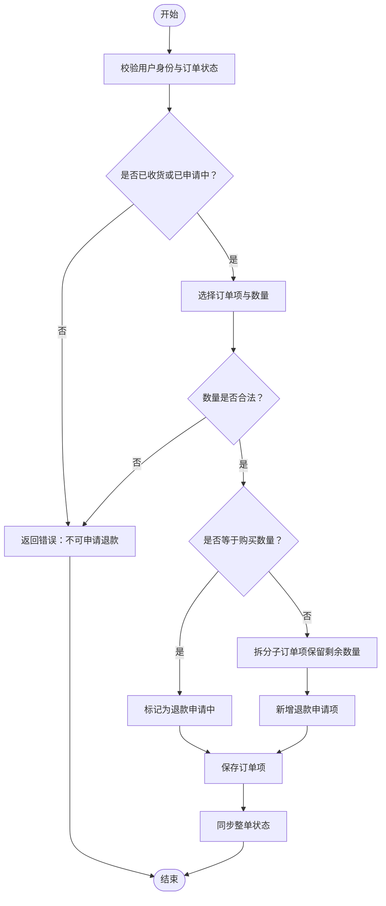
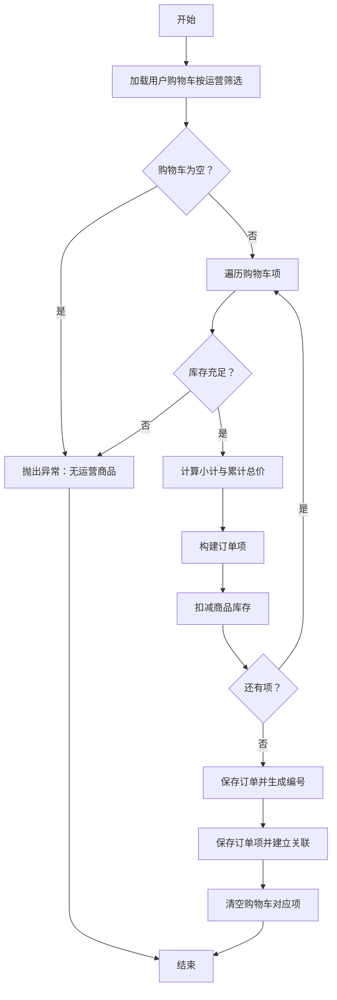
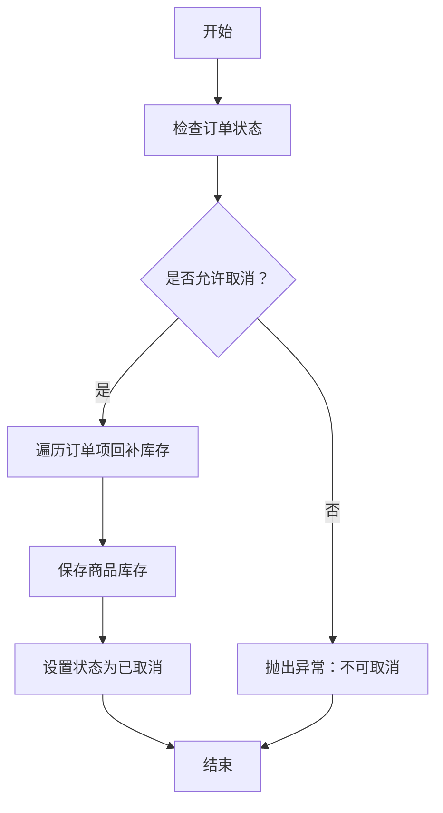
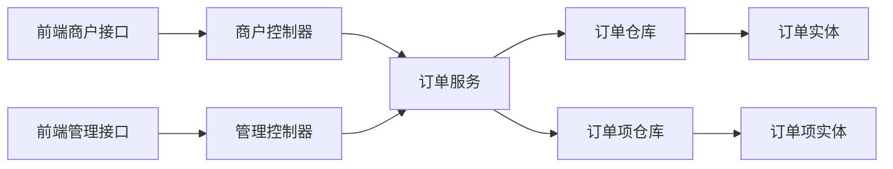

# 订单处理

<cite>
**本文引用的文件**   
- [MerchantOrderController.java](file://backend/src/main/java/com/mall/controller/merchant/MerchantOrderController.java)
- [AdminOrderController.java](file://backend/src/main/java/com/mall/controller/admin/AdminOrderController.java)
- [OrderService.java](file://backend/src/main/java/com/mall/service/OrderService.java)
- [Order.java](file://backend/src/main/java/com/mall/entity/Order.java)
- [OrderItem.java](file://backend/src/main/java/com/mall/entity/OrderItem.java)
- [OrderRepository.java](file://backend/src/main/java/com/mall/repository/OrderRepository.java)
- [OrderItemRepository.java](file://backend/src/main/java/com/mall/repository/OrderItemRepository.java)
- [application.yml](file://backend/src/main/resources/application.yml)
- [merchant.js](file://frontend/src/api/merchant.js)
- [admin.js](file://frontend/src/api/admin.js)
</cite>

## 目录
1. [简介](#简介)
2. [项目结构](#项目结构)
3. [核心组件](#核心组件)
4. [架构总览](#架构总览)
5. [详细组件分析](#详细组件分析)
6. [依赖分析](#依赖分析)
7. [性能考虑](#性能考虑)
8. [故障排查指南](#故障排查指南)
9. [结论](#结论)
10. [附录](#附录)

## 简介
本文件面向商户与平台运营，系统性梳理“订单处理”功能，覆盖订单接收、订单确认、订单发货、订单状态更新、订单查询、订单详情查看、订单打印、批量处理、异常订单处理、退款申请处理与统计分析。文档基于后端控制器、服务层与实体模型，结合前端接口封装，给出清晰的流程图与时序图，帮助商户高效处理客户订单，提升客户满意度。

## 项目结构
后端采用 Spring Boot + JPA 的分层架构，订单处理涉及三层：
- 控制器层：商户端与管理端分别提供订单查询、发货、退款处理等接口
- 服务层：统一编排订单创建、状态变更、退款申请与同步逻辑
- 数据访问层：通过仓库接口访问数据库，提供分页查询与聚合查询能力
- 前端接口封装：在前端以模块化函数形式暴露 REST 接口调用

**图表来源**
- [MerchantOrderController.java:20-100](file://backend/src/main/java/com/mall/controller/merchant/MerchantOrderController.java#L20-L100)
- [AdminOrderController.java:17-45](file://backend/src/main/java/com/mall/controller/admin/AdminOrderController.java#L17-L45)
- [OrderService.java:23-280](file://backend/src/main/java/com/mall/service/OrderService.java#L23-L280)
- [OrderRepository.java:13-27](file://backend/src/main/java/com/mall/repository/OrderRepository.java#L13-L27)
- [OrderItemRepository.java:9-19](file://backend/src/main/java/com/mall/repository/OrderItemRepository.java#L9-L19)
- [Order.java:9-83](file://backend/src/main/java/com/mall/entity/Order.java#L9-L83)
- [OrderItem.java:9-73](file://backend/src/main/java/com/mall/entity/OrderItem.java#L9-L73)

**章节来源**
- [application.yml:1-36](file://backend/src/main/resources/application.yml#L1-L36)

## 核心组件
- 商户控制器：提供订单列表、详情、发货、整单/单项退款同意等能力
- 管理控制器：提供全站订单列表与详情查询
- 订单服务：实现下单、状态更新、取消、退款申请与同步、单项退款审批等业务逻辑
- 订单与订单项实体：定义订单状态、退款状态、收货人信息、金额与时间戳等字段
- 仓库接口：提供按用户/运营/全站分页查询、按订单查询明细、聚合查询等

**章节来源**
- [MerchantOrderController.java:20-100](file://backend/src/main/java/com/mall/controller/merchant/MerchantOrderController.java#L20-L100)
- [AdminOrderController.java:17-45](file://backend/src/main/java/com/mall/controller/admin/AdminOrderController.java#L17-L45)
- [OrderService.java:23-280](file://backend/src/main/java/com/mall/service/OrderService.java#L23-L280)
- [Order.java:16-83](file://backend/src/main/java/com/mall/entity/Order.java#L16-L83)
- [OrderItem.java:16-73](file://backend/src/main/java/com/mall/entity/OrderItem.java#L16-L73)
- [OrderRepository.java:13-27](file://backend/src/main/java/com/mall/repository/OrderRepository.java#L13-L27)
- [OrderItemRepository.java:9-19](file://backend/src/main/java/com/mall/repository/OrderItemRepository.java#L9-L19)

## 架构总览
订单处理遵循“前端接口封装 → 控制器 → 服务 → 仓库 → 数据库”的标准调用链。前端通过 merchant.js 与 admin.js 封装 REST 请求，控制器校验权限与参数，服务层执行业务规则与事务控制，仓库持久化数据。

**图表来源**
- [merchant.js:58-120](file://frontend/src/api/merchant.js#L58-L120)
- [admin.js:78-86](file://frontend/src/api/admin.js#L78-L86)
- [MerchantOrderController.java:37-100](file://backend/src/main/java/com/mall/controller/merchant/MerchantOrderController.java#L37-L100)
- [AdminOrderController.java:25-44](file://backend/src/main/java/com/mall/controller/admin/AdminOrderController.java#L25-L44)
- [OrderService.java:90-121](file://backend/src/main/java/com/mall/service/OrderService.java#L90-L121)
- [OrderRepository.java:13-27](file://backend/src/main/java/com/mall/repository/OrderRepository.java#L13-L27)
- [OrderItemRepository.java:9-19](file://backend/src/main/java/com/mall/repository/OrderItemRepository.java#L9-L19)

## 详细组件分析

### 订单状态模型与流转
订单状态包括：待支付、已支付、已发货、已收货、已取消；退款状态包括：无申请、申请中、已退款。服务层严格控制状态转换，避免非法状态变更。

**图表来源**
- [Order.java:31-33](file://backend/src/main/java/com/mall/entity/Order.java#L31-L33)
- [OrderItem.java:50-52](file://backend/src/main/java/com/mall/entity/OrderItem.java#L50-L52)
- [OrderService.java:115-161](file://backend/src/main/java/com/mall/service/OrderService.java#L115-L161)

**章节来源**
- [Order.java:31-64](file://backend/src/main/java/com/mall/entity/Order.java#L31-L64)
- [OrderItem.java:50-58](file://backend/src/main/java/com/mall/entity/OrderItem.java#L50-L58)
- [OrderService.java:115-161](file://backend/src/main/java/com/mall/service/OrderService.java#L115-L161)

### 商户端订单处理流程
- 订单查询：分页返回当前运营的订单列表
- 订单详情：返回订单与订单项明细
- 发货：仅允许“已支付”订单执行发货，状态变更为“已发货”
- 整单退款同意：仅允许“退款申请中”订单执行同意，状态变更为“已退款”
- 单项退款同意：针对某个订单项执行同意，若所有有申请的项均完成退款，则整单同步为“已退款”

**图表来源**
- [MerchantOrderController.java:37-100](file://backend/src/main/java/com/mall/controller/merchant/MerchantOrderController.java#L37-L100)
- [OrderService.java:115-121](file://backend/src/main/java/com/mall/service/OrderService.java#L115-L121)
- [OrderService.java:257-278](file://backend/src/main/java/com/mall/service/OrderService.java#L257-L278)
- [OrderRepository.java:13-21](file://backend/src/main/java/com/mall/repository/OrderRepository.java#L13-L21)
- [OrderItemRepository.java:9-11](file://backend/src/main/java/com/mall/repository/OrderItemRepository.java#L9-L11)

**章节来源**
- [MerchantOrderController.java:37-100](file://backend/src/main/java/com/mall/controller/merchant/MerchantOrderController.java#L37-L100)
- [OrderService.java:115-121](file://backend/src/main/java/com/mall/service/OrderService.java#L115-L121)
- [OrderService.java:257-278](file://backend/src/main/java/com/mall/service/OrderService.java#L257-L278)

### 管理端订单查询
- 全站订单列表：分页查询所有订单
- 订单详情：返回订单与订单项明细

**图表来源**
- [AdminOrderController.java:25-44](file://backend/src/main/java/com/mall/controller/admin/AdminOrderController.java#L25-L44)
- [OrderService.java:105-113](file://backend/src/main/java/com/mall/service/OrderService.java#L105-L113)
- [OrderRepository.java:13-21](file://backend/src/main/java/com/mall/repository/OrderRepository.java#L13-L21)
- [OrderItemRepository.java:9-11](file://backend/src/main/java/com/mall/repository/OrderItemRepository.java#L9-L11)

**章节来源**
- [AdminOrderController.java:25-44](file://backend/src/main/java/com/mall/controller/admin/AdminOrderController.java#L25-L44)

### 退款申请与批量处理
- 用户申请整单退款：仅限“已收货”订单，状态置为“退款申请中”
- 用户申请单项退款：支持部分数量退款，自动拆分子订单项或标记为退款申请中
- 商户同意单项退款：若所有有申请的项均完成退款，整单同步为“已退款”
- 批量单项退款：一次选择多个订单项进行退款，支持数量校验与拆分

**图表来源**
- [OrderService.java:167-240](file://backend/src/main/java/com/mall/service/OrderService.java#L167-L240)
- [OrderService.java:257-278](file://backend/src/main/java/com/mall/service/OrderService.java#L257-L278)
- [OrderItemRepository.java:9-11](file://backend/src/main/java/com/mall/repository/OrderItemRepository.java#L9-L11)

**章节来源**
- [OrderService.java:147-278](file://backend/src/main/java/com/mall/service/OrderService.java#L147-L278)

### 订单创建与库存扣减
- 从购物车按运营筛选商品，计算总价
- 校验库存充足，扣减商品库存
- 清空对应购物车项，生成订单与订单项
- 设置初始状态为“待支付”

**图表来源**
- [OrderService.java:33-88](file://backend/src/main/java/com/mall/service/OrderService.java#L33-L88)
- [OrderRepository.java:13-21](file://backend/src/main/java/com/mall/repository/OrderRepository.java#L13-L21)
- [OrderItemRepository.java:9-11](file://backend/src/main/java/com/mall/repository/OrderItemRepository.java#L9-L11)

**章节来源**
- [OrderService.java:33-88](file://backend/src/main/java/com/mall/service/OrderService.java#L33-L88)

### 订单取消与库存回补
- 用户在“已收货/退款申请中/已退款”之外的状态可取消
- 取消时回补库存，状态置为“已取消”

**图表来源**
- [OrderService.java:123-145](file://backend/src/main/java/com/mall/service/OrderService.java#L123-L145)

**章节来源**
- [OrderService.java:123-145](file://backend/src/main/java/com/mall/service/OrderService.java#L123-L145)

### 订单打印与详情查看
- 订单详情接口返回订单与订单项，便于前端渲染打印模板
- 建议在前端订单详情页面导出 PDF 或使用浏览器打印功能

**章节来源**
- [MerchantOrderController.java:47-59](file://backend/src/main/java/com/mall/controller/merchant/MerchantOrderController.java#L47-L59)
- [AdminOrderController.java:33-43](file://backend/src/main/java/com/mall/controller/admin/AdminOrderController.java#L33-L43)

## 依赖分析
- 控制器依赖服务层，服务层依赖仓库接口
- 订单与订单项实体通过 JPA 映射到数据库表
- 前端通过接口封装调用控制器，控制器与服务层之间保持清晰职责边界

**图表来源**
- [merchant.js:58-120](file://frontend/src/api/merchant.js#L58-L120)
- [admin.js:78-86](file://frontend/src/api/admin.js#L78-L86)
- [MerchantOrderController.java:20-100](file://backend/src/main/java/com/mall/controller/merchant/MerchantOrderController.java#L20-L100)
- [AdminOrderController.java:17-45](file://backend/src/main/java/com/mall/controller/admin/AdminOrderController.java#L17-L45)
- [OrderService.java:23-280](file://backend/src/main/java/com/mall/service/OrderService.java#L23-L280)
- [OrderRepository.java:13-27](file://backend/src/main/java/com/mall/repository/OrderRepository.java#L13-L27)
- [OrderItemRepository.java:9-19](file://backend/src/main/java/com/mall/repository/OrderItemRepository.java#L9-L19)
- [Order.java:9-83](file://backend/src/main/java/com/mall/entity/Order.java#L9-L83)
- [OrderItem.java:9-73](file://backend/src/main/java/com/mall/entity/OrderItem.java#L9-L73)

**章节来源**
- [OrderService.java:23-280](file://backend/src/main/java/com/mall/service/OrderService.java#L23-L280)
- [OrderRepository.java:13-27](file://backend/src/main/java/com/mall/repository/OrderRepository.java#L13-L27)
- [OrderItemRepository.java:9-19](file://backend/src/main/java/com/mall/repository/OrderItemRepository.java#L9-L19)

## 性能考虑
- 分页查询：列表接口使用 Pageable，建议前端传入合理的页码与大小，避免一次性加载过多数据
- 批量处理：批量单项退款时建议限制单次选择数量，避免大事务导致锁竞争
- 事务边界：状态更新与库存扣减均在事务内执行，保证一致性
- 缓存策略：可对热门商品与订单统计结果做缓存，降低数据库压力（扩展点）

## 故障排查指南
- 订单不存在或越权：控制器会校验订单归属，返回明确错误提示
- 订单状态不符：发货仅允许“已支付”，退款仅允许“退款申请中”或“已收货”状态，否则返回错误
- 库存不足：下单时会校验库存，不足则抛出异常
- 数量不合法：单项退款数量必须在购买数量范围内，否则抛出异常
- 异常统一处理：后端提供全局异常处理器，前端可根据 Result 结果进行提示

**章节来源**
- [MerchantOrderController.java:61-85](file://backend/src/main/java/com/mall/controller/merchant/MerchantOrderController.java#L61-L85)
- [OrderService.java:49-51](file://backend/src/main/java/com/mall/service/OrderService.java#L49-L51)
- [OrderService.java:147-171](file://backend/src/main/java/com/mall/service/OrderService.java#L147-L171)
- [OrderService.java:196-210](file://backend/src/main/java/com/mall/service/OrderService.java#L196-L210)

## 结论
本订单处理方案以清晰的控制器与服务层划分、严格的订单状态机与事务控制为核心，覆盖了从下单到发货、从退款到统计的完整闭环。通过前端接口封装与标准化的调用流程，商户与运营可以高效地完成订单处理任务，保障交易顺畅与用户体验。

## 附录

### API 调用示例（路径参考）
- 商户端
  - 查询订单列表：GET /merchant/order?page=&size=
  - 查询订单详情：GET /merchant/order/{id}
  - 订单发货：POST /merchant/order/{id}/ship
  - 同意整单退款：POST /merchant/order/{id}/accept-refund
  - 同意单项退款：POST /merchant/order/{orderId}/items/{itemId}/accept-refund
- 管理端
  - 查询全站订单列表：GET /admin/order?page=&size=
  - 查询订单详情：GET /admin/order/{id}

**章节来源**
- [merchant.js:58-120](file://frontend/src/api/merchant.js#L58-L120)
- [admin.js:78-86](file://frontend/src/api/admin.js#L78-L86)
- [MerchantOrderController.java:37-100](file://backend/src/main/java/com/mall/controller/merchant/MerchantOrderController.java#L37-L100)
- [AdminOrderController.java:25-44](file://backend/src/main/java/com/mall/controller/admin/AdminOrderController.java#L25-L44)