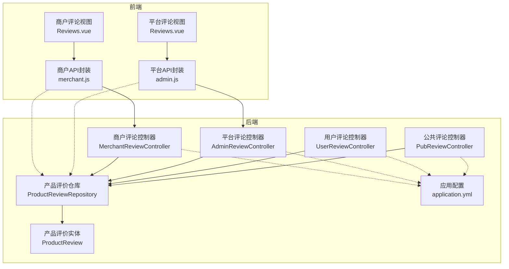
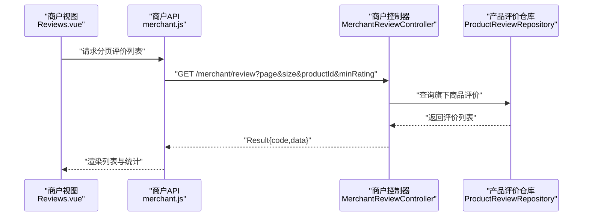
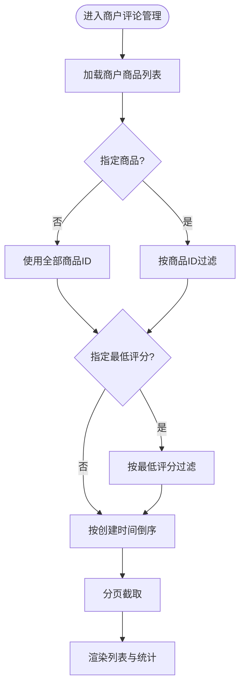
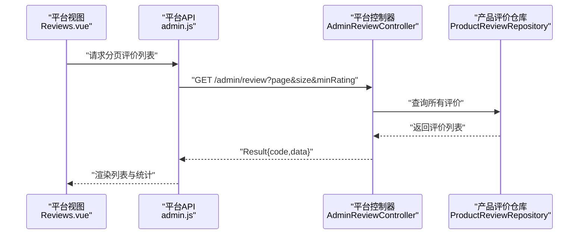
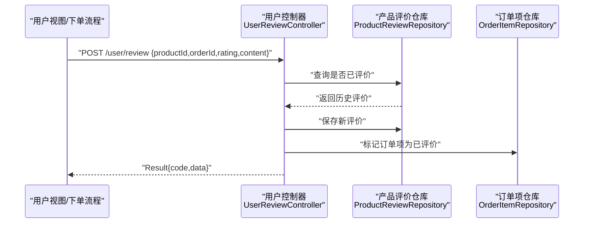
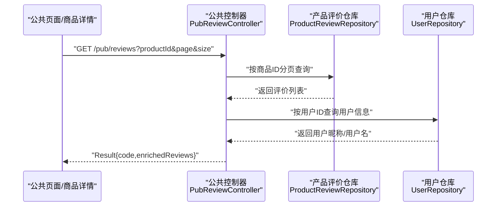
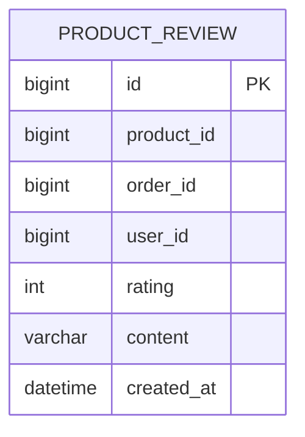
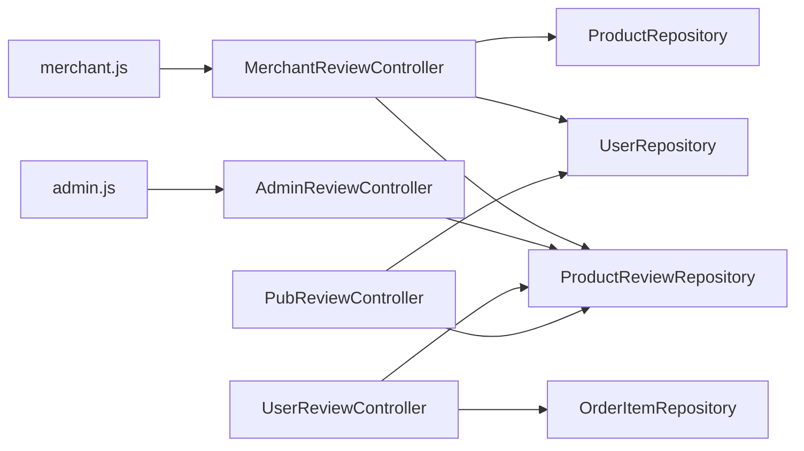

# 评论管理

<cite>
**本文引用的文件**
- [backend/src/main/java/com/mall/controller/merchant/MerchantReviewController.java](file://backend/src/main/java/com/mall/controller/merchant/MerchantReviewController.java)
- [backend/src/main/java/com/mall/controller/admin/AdminReviewController.java](file://backend/src/main/java/com/mall/controller/admin/AdminReviewController.java)
- [backend/src/main/java/com/mall/controller/user/UserReviewController.java](file://backend/src/main/java/com/mall/controller/user/UserReviewController.java)
- [backend/src/main/java/com/mall/controller/pub/PubReviewController.java](file://backend/src/main/java/com/mall/controller/pub/PubReviewController.java)
- [backend/src/main/java/com/mall/entity/ProductReview.java](file://backend/src/main/java/com/mall/entity/ProductReview.java)
- [backend/src/main/java/com/mall/repository/ProductReviewRepository.java](file://backend/src/main/java/com/mall/repository/ProductReviewRepository.java)
- [backend/src/main/resources/application.yml](file://backend/src/main/resources/application.yml)
- [frontend/src/views/merchant/Reviews.vue](file://frontend/src/views/merchant/Reviews.vue)
- [frontend/src/views/admin/Reviews.vue](file://frontend/src/views/admin/Reviews.vue)
- [frontend/src/api/merchant.js](file://frontend/src/api/merchant.js)
- [frontend/src/api/admin.js](file://frontend/src/api/admin.js)
</cite>

## 目录
1. [简介](#简介)
2. [项目结构](#项目结构)
3. [核心组件](#核心组件)
4. [架构总览](#架构总览)
5. [详细组件分析](#详细组件分析)
6. [依赖分析](#依赖分析)
7. [性能考虑](#性能考虑)
8. [故障排查指南](#故障排查指南)
9. [结论](#结论)
10. [附录](#附录)

## 简介
本文件面向商户与平台管理员，系统性阐述“评论管理”功能，包括商品评价查看、评论删除、评论统计、评论展示机制、评论审核与敏感词过滤、评论置顶等能力现状与扩展建议。当前系统已支持：
- 商户端：查看旗下商品评价、按商品与最低评分筛选、分页、批量删除、统计卡片（总评价数、5星评价、平均评分、低评价）。
- 平台端：全站评价查看、按最低评分筛选、分页、批量删除、统计卡片。
- 用户端：提交评价、避免重复评价、标记订单项为已评价。
- 公共端：按商品分页查询评价，并补充用户昵称。

未在现有代码中发现评论回复、评论审核流程、敏感词过滤、评论置顶等模块。后续可在现有基础上进行扩展。

## 项目结构
后端采用分层架构，前端采用 Vue 单页应用，通过统一的 API 接口与后端交互。评论管理涉及以下关键模块：
- 控制器层：商户端、平台端、用户端、公共端的评论控制器。
- 实体与仓储：ProductReview 实体与 JPA 仓库。
- 前端视图与 API：商户与平台的评论管理页面，以及对应的 API 封装。

**图表来源**
- [backend/src/main/java/com/mall/controller/merchant/MerchantReviewController.java:21-157](file://backend/src/main/java/com/mall/controller/merchant/MerchantReviewController.java#L21-L157)
- [backend/src/main/java/com/mall/controller/admin/AdminReviewController.java:16-92](file://backend/src/main/java/com/mall/controller/admin/AdminReviewController.java#L16-L92)
- [backend/src/main/java/com/mall/controller/user/UserReviewController.java:17-73](file://backend/src/main/java/com/mall/controller/user/UserReviewController.java#L17-L73)
- [backend/src/main/java/com/mall/controller/pub/PubReviewController.java:19-64](file://backend/src/main/java/com/mall/controller/pub/PubReviewController.java#L19-L64)
- [backend/src/main/java/com/mall/repository/ProductReviewRepository.java:10-16](file://backend/src/main/java/com/mall/repository/ProductReviewRepository.java#L10-L16)
- [backend/src/main/java/com/mall/entity/ProductReview.java:8-44](file://backend/src/main/java/com/mall/entity/ProductReview.java#L8-L44)
- [backend/src/main/resources/application.yml:1-36](file://backend/src/main/resources/application.yml#L1-L36)
- [frontend/src/views/merchant/Reviews.vue:1-462](file://frontend/src/views/merchant/Reviews.vue#L1-L462)
- [frontend/src/views/admin/Reviews.vue:1-402](file://frontend/src/views/admin/Reviews.vue#L1-L402)
- [frontend/src/api/merchant.js:90-111](file://frontend/src/api/merchant.js#L90-L111)
- [frontend/src/api/admin.js:113-129](file://frontend/src/api/admin.js#L113-L129)

**章节来源**
- [backend/src/main/java/com/mall/controller/merchant/MerchantReviewController.java:21-157](file://backend/src/main/java/com/mall/controller/merchant/MerchantReviewController.java#L21-L157)
- [backend/src/main/java/com/mall/controller/admin/AdminReviewController.java:16-92](file://backend/src/main/java/com/mall/controller/admin/AdminReviewController.java#L16-L92)
- [backend/src/main/java/com/mall/controller/user/UserReviewController.java:17-73](file://backend/src/main/java/com/mall/controller/user/UserReviewController.java#L17-L73)
- [backend/src/main/java/com/mall/controller/pub/PubReviewController.java:19-64](file://backend/src/main/java/com/mall/controller/pub/PubReviewController.java#L19-L64)
- [backend/src/main/java/com/mall/repository/ProductReviewRepository.java:10-16](file://backend/src/main/java/com/mall/repository/ProductReviewRepository.java#L10-L16)
- [backend/src/main/java/com/mall/entity/ProductReview.java:8-44](file://backend/src/main/java/com/mall/entity/ProductReview.java#L8-L44)
- [backend/src/main/resources/application.yml:1-36](file://backend/src/main/resources/application.yml#L1-L36)
- [frontend/src/views/merchant/Reviews.vue:1-462](file://frontend/src/views/merchant/Reviews.vue#L1-L462)
- [frontend/src/views/admin/Reviews.vue:1-402](file://frontend/src/views/admin/Reviews.vue#L1-L402)
- [frontend/src/api/merchant.js:90-111](file://frontend/src/api/merchant.js#L90-L111)
- [frontend/src/api/admin.js:113-129](file://frontend/src/api/admin.js#L113-L129)

## 核心组件
- 商户评论控制器：提供分页查询、按商品与最低评分过滤、删除单条与批量删除、按商品查询全部评价。
- 平台评论控制器：提供全站分页查询、按最低评分过滤、删除单条与批量删除。
- 用户评论控制器：新增评价、防重复评价、标记订单项为已评价。
- 公共评论控制器：按商品分页查询评价并补充用户昵称。
- 产品评价实体：定义评价字段（商品ID、订单ID、用户ID、评分、内容、创建时间）。
- 产品评价仓库：JPA 仓库，提供按商品排序查询与列表查询。
- 前端视图与 API：商户与平台评论管理页面，支持筛选、分页、删除、统计展示。

**章节来源**
- [backend/src/main/java/com/mall/controller/merchant/MerchantReviewController.java:39-91](file://backend/src/main/java/com/mall/controller/merchant/MerchantReviewController.java#L39-L91)
- [backend/src/main/java/com/mall/controller/merchant/MerchantReviewController.java:93-110](file://backend/src/main/java/com/mall/controller/merchant/MerchantReviewController.java#L93-L110)
- [backend/src/main/java/com/mall/controller/merchant/MerchantReviewController.java:112-155](file://backend/src/main/java/com/mall/controller/merchant/MerchantReviewController.java#L112-L155)
- [backend/src/main/java/com/mall/controller/admin/AdminReviewController.java:24-64](file://backend/src/main/java/com/mall/controller/admin/AdminReviewController.java#L24-L64)
- [backend/src/main/java/com/mall/controller/admin/AdminReviewController.java:66-90](file://backend/src/main/java/com/mall/controller/admin/AdminReviewController.java#L66-L90)
- [backend/src/main/java/com/mall/controller/user/UserReviewController.java:31-71](file://backend/src/main/java/com/mall/controller/user/UserReviewController.java#L31-L71)
- [backend/src/main/java/com/mall/controller/pub/PubReviewController.java:28-61](file://backend/src/main/java/com/mall/controller/pub/PubReviewController.java#L28-L61)
- [backend/src/main/java/com/mall/entity/ProductReview.java:15-43](file://backend/src/main/java/com/mall/entity/ProductReview.java#L15-L43)
- [backend/src/main/java/com/mall/repository/ProductReviewRepository.java:10-16](file://backend/src/main/java/com/mall/repository/ProductReviewRepository.java#L10-L16)
- [frontend/src/views/merchant/Reviews.vue:37-83](file://frontend/src/views/merchant/Reviews.vue#L37-L83)
- [frontend/src/views/merchant/Reviews.vue:261-281](file://frontend/src/views/merchant/Reviews.vue#L261-L281)
- [frontend/src/views/admin/Reviews.vue:37-66](file://frontend/src/views/admin/Reviews.vue#L37-L66)
- [frontend/src/views/admin/Reviews.vue:222-242](file://frontend/src/views/admin/Reviews.vue#L222-L242)

## 架构总览
评论管理的前后端交互遵循统一的数据传输格式，前端通过 API 封装调用后端控制器，控制器访问仓库持久化数据，实体映射数据库表结构。

**图表来源**
- [frontend/src/views/merchant/Reviews.vue:236-259](file://frontend/src/views/merchant/Reviews.vue#L236-L259)
- [frontend/src/api/merchant.js:92-95](file://frontend/src/api/merchant.js#L92-L95)
- [backend/src/main/java/com/mall/controller/merchant/MerchantReviewController.java:39-91](file://backend/src/main/java/com/mall/controller/merchant/MerchantReviewController.java#L39-L91)

**章节来源**
- [frontend/src/views/merchant/Reviews.vue:236-259](file://frontend/src/views/merchant/Reviews.vue#L236-L259)
- [frontend/src/api/merchant.js:92-95](file://frontend/src/api/merchant.js#L92-L95)
- [backend/src/main/java/com/mall/controller/merchant/MerchantReviewController.java:39-91](file://backend/src/main/java/com/mall/controller/merchant/MerchantReviewController.java#L39-L91)

## 详细组件分析

### 商户评论管理（查看、筛选、删除）
- 功能要点
  - 分页查询：支持页码、每页数量、商品ID、最低评分（含“低于3星”）。
  - 筛选逻辑：先获取商户名下所有商品，再筛选对应评价；支持按商品与最低评分过滤。
  - 删除能力：单条删除与批量删除，均校验商品归属。
  - 统计展示：前端计算总评价数、5星数量、平均评分、低评价数量。
- 数据流
  - 前端发起请求，控制器根据登录用户映射到商户ID，限制查询范围。
  - 仓库返回评价列表，控制器进行二次过滤与排序，最后分页返回。

**图表来源**
- [backend/src/main/java/com/mall/controller/merchant/MerchantReviewController.java:39-91](file://backend/src/main/java/com/mall/controller/merchant/MerchantReviewController.java#L39-L91)
- [frontend/src/views/merchant/Reviews.vue:236-281](file://frontend/src/views/merchant/Reviews.vue#L236-L281)

**章节来源**
- [backend/src/main/java/com/mall/controller/merchant/MerchantReviewController.java:39-91](file://backend/src/main/java/com/mall/controller/merchant/MerchantReviewController.java#L39-L91)
- [frontend/src/views/merchant/Reviews.vue:236-281](file://frontend/src/views/merchant/Reviews.vue#L236-L281)

### 平台评论管理（全站查看、删除）
- 功能要点
  - 全站分页查询：不绑定商户，直接基于评价总数进行分页。
  - 筛选逻辑：支持最低评分过滤。
  - 删除能力：单条与批量删除。
- 数据流
  - 控制器直接从仓库读取评价，应用过滤与排序，返回分页结果。

**图表来源**
- [frontend/src/views/admin/Reviews.vue:196-220](file://frontend/src/views/admin/Reviews.vue#L196-L220)
- [frontend/src/api/admin.js:115-118](file://frontend/src/api/admin.js#L115-L118)
- [backend/src/main/java/com/mall/controller/admin/AdminReviewController.java:24-64](file://backend/src/main/java/com/mall/controller/admin/AdminReviewController.java#L24-L64)

**章节来源**
- [frontend/src/views/admin/Reviews.vue:196-220](file://frontend/src/views/admin/Reviews.vue#L196-L220)
- [frontend/src/api/admin.js:115-118](file://frontend/src/api/admin.js#L115-L118)
- [backend/src/main/java/com/mall/controller/admin/AdminReviewController.java:24-64](file://backend/src/main/java/com/mall/controller/admin/AdminReviewController.java#L24-L64)

### 用户提交评价（查看、提交、防重复）
- 功能要点
  - 提交评价：接收商品ID、订单ID（可选）、评分、内容，保存评价。
  - 防重复：同一用户对同一商品（同一订单）不可重复评价。
  - 标记已评价：若提供订单ID，匹配订单项并标记为已评价。
- 数据流
  - 控制器校验重复后保存评价，更新订单项状态。

**图表来源**
- [backend/src/main/java/com/mall/controller/user/UserReviewController.java:31-71](file://backend/src/main/java/com/mall/controller/user/UserReviewController.java#L31-L71)
- [backend/src/main/java/com/mall/repository/ProductReviewRepository.java:14-14](file://backend/src/main/java/com/mall/repository/ProductReviewRepository.java#L14-L14)

**章节来源**
- [backend/src/main/java/com/mall/controller/user/UserReviewController.java:31-71](file://backend/src/main/java/com/mall/controller/user/UserReviewController.java#L31-L71)

### 公共端评价展示（按商品分页、昵称补全）
- 功能要点
  - 分页查询：按商品ID分页返回评价。
  - 昵称补全：根据用户ID获取用户昵称，若为空则回退用户名，否则显示“匿名用户”。
- 数据流
  - 控制器查询评价并组装返回数据，前端展示完整信息。

**图表来源**
- [backend/src/main/java/com/mall/controller/pub/PubReviewController.java:28-61](file://backend/src/main/java/com/mall/controller/pub/PubReviewController.java#L28-L61)

**章节来源**
- [backend/src/main/java/com/mall/controller/pub/PubReviewController.java:28-61](file://backend/src/main/java/com/mall/controller/pub/PubReviewController.java#L28-L61)

### 数据模型与存储
- 产品评价实体包含主键、商品ID、订单ID、用户ID、评分、内容、创建时间；创建时自动填充时间戳。
- 仓库提供按商品排序查询与列表查询方法，支撑前端分页与排序需求。

**图表来源**
- [backend/src/main/java/com/mall/entity/ProductReview.java:15-43](file://backend/src/main/java/com/mall/entity/ProductReview.java#L15-L43)
- [backend/src/main/java/com/mall/repository/ProductReviewRepository.java:10-16](file://backend/src/main/java/com/mall/repository/ProductReviewRepository.java#L10-L16)

**章节来源**
- [backend/src/main/java/com/mall/entity/ProductReview.java:15-43](file://backend/src/main/java/com/mall/entity/ProductReview.java#L15-L43)
- [backend/src/main/java/com/mall/repository/ProductReviewRepository.java:10-16](file://backend/src/main/java/com/mall/repository/ProductReviewRepository.java#L10-L16)

## 依赖分析
- 控制器依赖
  - 商户控制器依赖产品仓库、商品仓库、用户仓库，用于权限校验与数据过滤。
  - 平台控制器依赖产品评价仓库，直接查询全站评价。
  - 用户控制器依赖产品评价仓库与订单项仓库，用于保存评价与标记状态。
  - 公共控制器依赖产品评价仓库与用户仓库，用于分页查询与昵称补全。
- 前端依赖
  - 商户与平台视图分别调用对应的 API 封装，实现筛选、分页、删除与统计。
- 配置依赖
  - 应用配置提供数据库连接、JPA 设置、JWT 密钥与过期时间、日志级别等。

**图表来源**
- [backend/src/main/java/com/mall/controller/merchant/MerchantReviewController.java:27-29](file://backend/src/main/java/com/mall/controller/merchant/MerchantReviewController.java#L27-L29)
- [backend/src/main/java/com/mall/controller/admin/AdminReviewController.java:22-22](file://backend/src/main/java/com/mall/controller/admin/AdminReviewController.java#L22-L22)
- [backend/src/main/java/com/mall/controller/user/UserReviewController.java:23-24](file://backend/src/main/java/com/mall/controller/user/UserReviewController.java#L23-L24)
- [backend/src/main/java/com/mall/controller/pub/PubReviewController.java:25-26](file://backend/src/main/java/com/mall/controller/pub/PubReviewController.java#L25-L26)
- [frontend/src/api/merchant.js:92-110](file://frontend/src/api/merchant.js#L92-L110)
- [frontend/src/api/admin.js:115-128](file://frontend/src/api/admin.js#L115-L128)

**章节来源**
- [backend/src/main/java/com/mall/controller/merchant/MerchantReviewController.java:27-29](file://backend/src/main/java/com/mall/controller/merchant/MerchantReviewController.java#L27-L29)
- [backend/src/main/java/com/mall/controller/admin/AdminReviewController.java:22-22](file://backend/src/main/java/com/mall/controller/admin/AdminReviewController.java#L22-L22)
- [backend/src/main/java/com/mall/controller/user/UserReviewController.java:23-24](file://backend/src/main/java/com/mall/controller/user/UserReviewController.java#L23-L24)
- [backend/src/main/java/com/mall/controller/pub/PubReviewController.java:25-26](file://backend/src/main/java/com/mall/controller/pub/PubReviewController.java#L25-L26)
- [frontend/src/api/merchant.js:92-110](file://frontend/src/api/merchant.js#L92-L110)
- [frontend/src/api/admin.js:115-128](file://frontend/src/api/admin.js#L115-L128)

## 性能考虑
- 服务器端分页：控制器对全量评价进行内存过滤与排序，当评价规模增大时可能产生性能瓶颈。建议：
  - 在仓库层增加数据库侧过滤与排序（如按商品ID与评分索引），减少内存处理。
  - 对“低于3星”的过滤改为数据库条件，避免全量扫描。
- 前端分页：前端仅做简单统计与展示，性能开销较小。
- 数据库索引：建议为 product_id、rating、created_at 建立复合索引以优化查询。
- 缓存策略：对热门商品的评价列表可引入缓存，降低重复查询压力。

[本节为通用性能建议，不直接分析具体文件，故无“章节来源”]

## 故障排查指南
- 无权限删除评价
  - 现象：提示“无权限删除此评价”。
  - 原因：删除时校验商品归属，若评价所属商品不属于当前商户则拒绝。
  - 处理：确认删除对象是否属于当前登录商户的商品。
- 评价不存在
  - 现象：删除接口返回“评价不存在”。
  - 原因：传入的评价ID无效或已被删除。
  - 处理：检查ID有效性，确认前端列表是否已刷新。
- 重复评价
  - 现象：提交评价返回“该商品已评价，不能重复评价”。
  - 原因：同一用户对同一商品（同一订单）已存在评价。
  - 处理：引导用户修改订单或商品，或在业务上允许多次评价但需调整校验逻辑。
- 统计异常
  - 现象：统计卡片数值异常。
  - 原因：前端统计基于当前页数据，若筛选条件变化未重新计算可能导致错觉。
  - 处理：确保每次筛选与分页切换后重新计算统计值。

**章节来源**
- [backend/src/main/java/com/mall/controller/merchant/MerchantReviewController.java:112-132](file://backend/src/main/java/com/mall/controller/merchant/MerchantReviewController.java#L112-L132)
- [backend/src/main/java/com/mall/controller/admin/AdminReviewController.java:66-76](file://backend/src/main/java/com/mall/controller/admin/AdminReviewController.java#L66-L76)
- [backend/src/main/java/com/mall/controller/user/UserReviewController.java:40-47](file://backend/src/main/java/com/mall/controller/user/UserReviewController.java#L40-L47)
- [frontend/src/views/merchant/Reviews.vue:261-281](file://frontend/src/views/merchant/Reviews.vue#L261-L281)

## 结论
当前系统已具备完整的商户与平台评论管理能力：分页查询、筛选、删除、统计展示与用户提交评价。未发现评论回复、评论审核、敏感词过滤、评论置顶等高级功能。建议在现有基础上扩展：
- 引入评论审核流程与敏感词过滤服务。
- 增加评论置顶字段与排序规则。
- 完善评论回复与多级回复结构。
- 优化大数据量下的查询性能与缓存策略。

[本节为总结性内容，不直接分析具体文件，故无“章节来源”]

## 附录

### 评论管理界面操作指引（商户端）
- 查看与筛选
  - 选择商品：在筛选区选择目标商品，自动刷新列表。
  - 选择最低评分：支持“全部”“5星”“4星及以上”“3星及以上”“低于3星”，实时生效。
  - 刷新：点击“刷新”按钮重新加载当前筛选条件下的数据。
- 分页与统计
  - 使用分页控件切换页码与每页数量。
  - 统计卡片显示总评价数、5星评价数、平均评分、低评价数。
- 删除
  - 单条删除：在操作列点击“删除”，弹窗确认后执行。
  - 批量删除：勾选多条记录后点击“删除选中”，弹窗确认后批量删除。

**章节来源**
- [frontend/src/views/merchant/Reviews.vue:37-83](file://frontend/src/views/merchant/Reviews.vue#L37-L83)
- [frontend/src/views/merchant/Reviews.vue:295-344](file://frontend/src/views/merchant/Reviews.vue#L295-L344)
- [frontend/src/views/merchant/Reviews.vue:351-361](file://frontend/src/views/merchant/Reviews.vue#L351-L361)

### 评论管理界面操作指引（平台端）
- 查看与筛选
  - 选择最低评分：支持“全部”“5星”“4星及以上”“3星及以上”“低于3星”，实时生效。
  - 刷新：点击“刷新”按钮重新加载当前筛选条件下的数据。
- 分页与统计
  - 使用分页控件切换页码与每页数量。
  - 统计卡片显示总评价数、5星评价数、平均评分、低评价数。
- 删除
  - 单条删除：在操作列点击“删除”，弹窗确认后执行。
  - 批量删除：勾选多条记录后点击“删除选中”，弹窗确认后批量删除。

**章节来源**
- [frontend/src/views/admin/Reviews.vue:37-66](file://frontend/src/views/admin/Reviews.vue#L37-L66)
- [frontend/src/views/admin/Reviews.vue:250-299](file://frontend/src/views/admin/Reviews.vue#L250-L299)
- [frontend/src/views/admin/Reviews.vue:306-316](file://frontend/src/views/admin/Reviews.vue#L306-L316)

### API 定义（节选）
- 商户端
  - GET /merchant/review：分页查询当前商户旗下商品评价，参数：page、size、productId、minRating。
  - GET /merchant/review/product/{productId}：查询单个商品的所有评价。
  - DELETE /merchant/review/{reviewId}：删除单条评价。
  - POST /merchant/review/batch-delete：批量删除评价。
- 平台端
  - GET /admin/review：分页查询全站评价，参数：page、size、productId、minRating。
  - DELETE /admin/review/{reviewId}：删除单条评价。
  - POST /admin/review/batch-delete：批量删除评价。
- 用户端
  - POST /user/review：提交评价，参数：productId、orderId（可选）、rating、content。
- 公共端
  - GET /pub/reviews：按商品分页查询评价，参数：productId、page、size。

**章节来源**
- [frontend/src/api/merchant.js:92-110](file://frontend/src/api/merchant.js#L92-L110)
- [frontend/src/api/admin.js:115-128](file://frontend/src/api/admin.js#L115-L128)
- [backend/src/main/java/com/mall/controller/user/UserReviewController.java:31-71](file://backend/src/main/java/com/mall/controller/user/UserReviewController.java#L31-L71)
- [backend/src/main/java/com/mall/controller/pub/PubReviewController.java:28-61](file://backend/src/main/java/com/mall/controller/pub/PubReviewController.java#L28-L61)

### 评论数据分析与统计
- 统计指标
  - 总评价数：当前筛选条件下评价总数。
  - 5星评价数：评分等于5的数量。
  - 平均评分：当前筛选条件下评分的平均值（保留一位小数）。
  - 低评价：评分小于3的数量。
- 计算方式
  - 前端基于当前页数据计算上述指标，建议在控制器层也提供聚合接口以提升准确性与性能。

**章节来源**
- [frontend/src/views/merchant/Reviews.vue:261-281](file://frontend/src/views/merchant/Reviews.vue#L261-L281)
- [frontend/src/views/admin/Reviews.vue:222-242](file://frontend/src/views/admin/Reviews.vue#L222-L242)

### 评论展示机制
- 展示字段
  - 商品信息：通过商品ID映射商品名称。
  - 用户ID：展示评价用户ID。
  - 评分：使用只读评分组件展示星级。
  - 内容：支持悬停查看完整内容，超长内容截断显示。
  - 时间：展示评价创建时间。
- 昵称补全（公共端）
  - 根据用户ID获取用户昵称，若为空则回退用户名，否则显示“匿名用户”。

**章节来源**
- [frontend/src/views/merchant/Reviews.vue:101-147](file://frontend/src/views/merchant/Reviews.vue#L101-L147)
- [frontend/src/views/admin/Reviews.vue:84-126](file://frontend/src/views/admin/Reviews.vue#L84-L126)
- [backend/src/main/java/com/mall/controller/pub/PubReviewController.java:45-52](file://backend/src/main/java/com/mall/controller/pub/PubReviewController.java#L45-L52)

### 评论内容审核与敏感词过滤
- 现状
  - 未在现有代码中发现评论审核流程与敏感词过滤逻辑。
- 建议
  - 引入审核状态字段（待审/通过/屏蔽）与敏感词库。
  - 在提交与展示环节增加审核与过滤逻辑，支持人工复核与自动拦截。

[本节为扩展建议，不直接分析具体文件，故无“章节来源”]

### 评论置顶功能
- 现状
  - 未在现有代码中发现评论置顶相关字段与接口。
- 建议
  - 新增置顶标识字段与排序权重，支持按权重降序展示。
  - 提供置顶开关与置顶时间控制，便于运营人员管理。

[本节为扩展建议，不直接分析具体文件，故无“章节来源”]

### 差评处理与客户反馈收集
- 差评处理
  - 建议结合“低评价”统计与筛选，定期导出差评列表进行专项分析与改进。
- 客户反馈收集
  - 可在评价内容中提取关键词与情感倾向，辅助改进产品与服务。

[本节为通用建议，不直接分析具体文件，故无“章节来源”]

### 评论导出功能
- 现状
  - 未在现有代码中发现评论导出接口。
- 建议
  - 新增导出接口，支持按筛选条件导出 Excel 或 CSV，包含商品名称、用户ID、评分、内容、时间等字段。

[本节为扩展建议，不直接分析具体文件，故无“章节来源”]