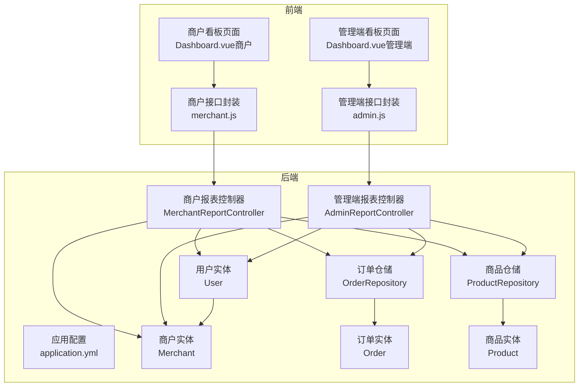
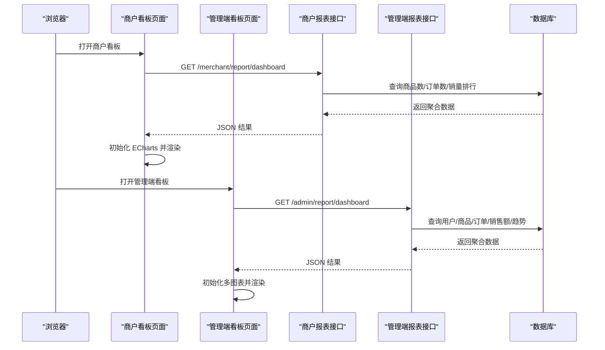
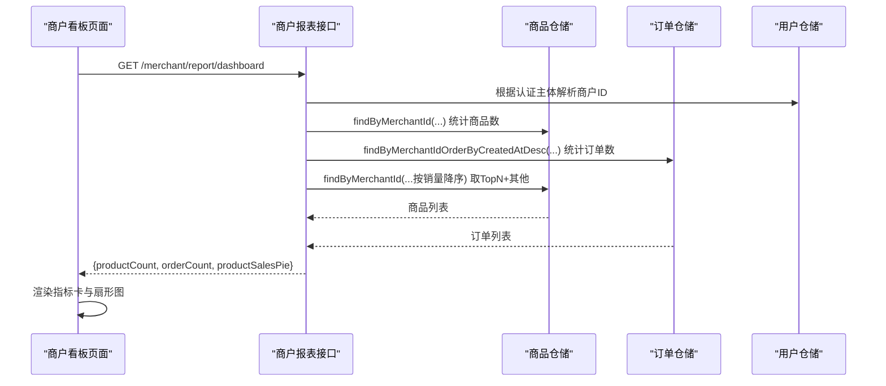
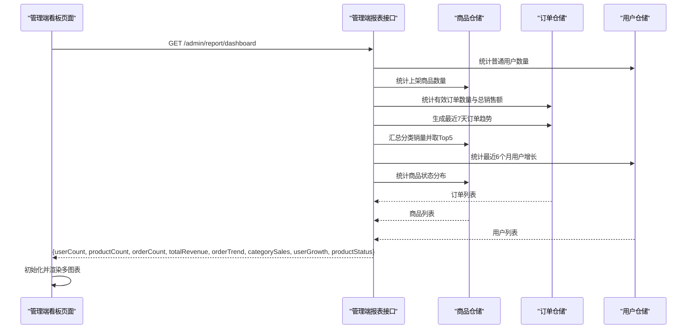
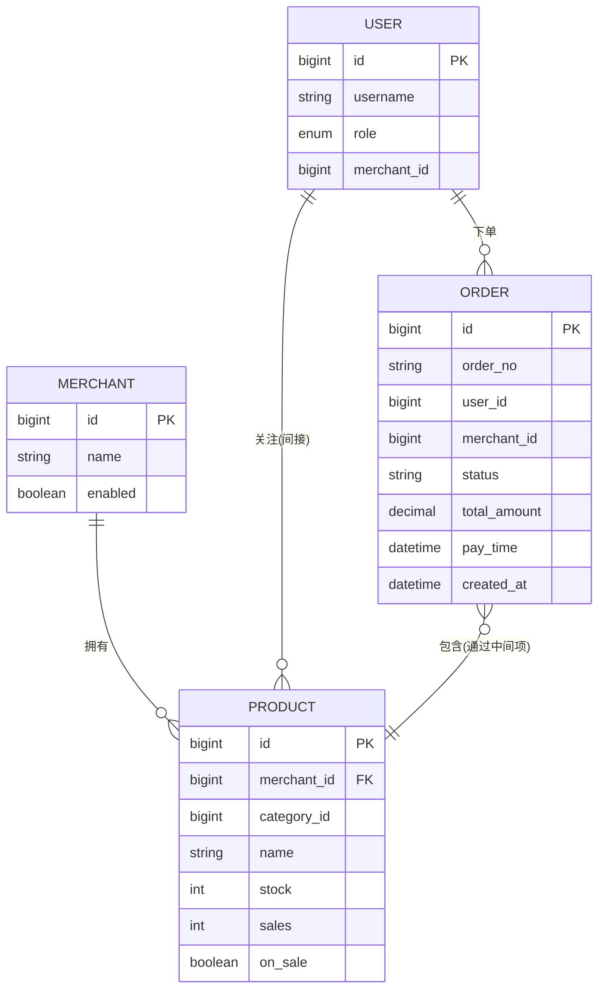
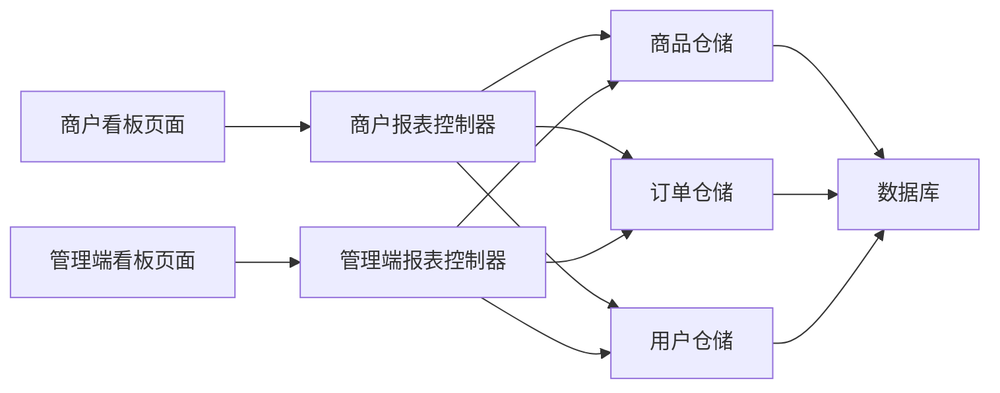

# 销售报表统计

<cite>
**本文引用的文件**
- [MerchantReportController.java](file://backend/src/main/java/com/mall/controller/merchant/MerchantReportController.java)
- [AdminReportController.java](file://backend/src/main/java/com/mall/controller/admin/AdminReportController.java)
- [Order.java](file://backend/src/main/java/com/mall/entity/Order.java)
- [Product.java](file://backend/src/main/java/com/mall/entity/Product.java)
- [User.java](file://backend/src/main/java/com/mall/entity/User.java)
- [Merchant.java](file://backend/src/main/java/com/mall/entity/Merchant.java)
- [OrderRepository.java](file://backend/src/main/java/com/mall/repository/OrderRepository.java)
- [ProductRepository.java](file://backend/src/main/java/com/mall/repository/ProductRepository.java)
- [Dashboard.vue（商户）](file://frontend/src/views/merchant/Dashboard.vue)
- [Dashboard.vue（管理端）](file://frontend/src/views/admin/Dashboard.vue)
- [merchant.js](file://frontend/src/api/merchant.js)
- [admin.js](file://frontend/src/api/admin.js)
- [application.yml](file://backend/src/main/resources/application.yml)
</cite>

## 目录
1. [简介](#简介)
2. [项目结构](#项目结构)
3. [核心组件](#核心组件)
4. [架构总览](#架构总览)
5. [详细组件分析](#详细组件分析)
6. [依赖分析](#依赖分析)
7. [性能考虑](#性能考虑)
8. [故障排查指南](#故障排查指南)
9. [结论](#结论)
10. [附录](#附录)

## 简介
本功能围绕“商户销售报表统计”展开，覆盖以下能力：
- 实时销售监控仪表板：商户看板与管理端看板，分别提供关键指标与综合运营视图
- 销售数据统计：订单量、销售额、商品销量排行、用户增长趋势、商品状态分布
- 数据可视化：折线图、饼图、指标卡等
- 报表生成与导出：前端基于 ECharts 展示，支持按需扩展导出
- 报表定制：通过接口返回的数据结构，前端可灵活组合展示维度

目标是帮助商户通过数据洞察优化经营决策，提升销售业绩。

## 项目结构
后端采用 Spring Boot + JPA，前后端分离；前端使用 Vue + Element Plus + ECharts。

**图表来源**
- [application.yml:1-36](file://backend/src/main/resources/application.yml#L1-L36)
- [MerchantReportController.java:1-81](file://backend/src/main/java/com/mall/controller/merchant/MerchantReportController.java#L1-L81)
- [AdminReportController.java:1-176](file://backend/src/main/java/com/mall/controller/admin/AdminReportController.java#L1-L176)
- [OrderRepository.java:1-28](file://backend/src/main/java/com/mall/repository/OrderRepository.java#L1-L28)
- [ProductRepository.java:1-125](file://backend/src/main/java/com/mall/repository/ProductRepository.java#L1-L125)
- [User.java:1-88](file://backend/src/main/java/com/mall/entity/User.java#L1-L88)
- [Merchant.java:1-56](file://backend/src/main/java/com/mall/entity/Merchant.java#L1-L56)
- [Order.java:1-83](file://backend/src/main/java/com/mall/entity/Order.java#L1-L83)
- [Product.java:1-101](file://backend/src/main/java/com/mall/entity/Product.java#L1-L101)
- [Dashboard.vue（商户）:1-137](file://frontend/src/views/merchant/Dashboard.vue#L1-L137)
- [Dashboard.vue（管理端）:1-786](file://frontend/src/views/admin/Dashboard.vue#L1-L786)
- [merchant.js:1-135](file://frontend/src/api/merchant.js#L1-L135)
- [admin.js:1-129](file://frontend/src/api/admin.js#L1-L129)

**章节来源**
- [application.yml:1-36](file://backend/src/main/resources/application.yml#L1-L36)
- [MerchantReportController.java:1-81](file://backend/src/main/java/com/mall/controller/merchant/MerchantReportController.java#L1-L81)
- [AdminReportController.java:1-176](file://backend/src/main/java/com/mall/controller/admin/AdminReportController.java#L1-L176)
- [OrderRepository.java:1-28](file://backend/src/main/java/com/mall/repository/OrderRepository.java#L1-L28)
- [ProductRepository.java:1-125](file://backend/src/main/java/com/mall/repository/ProductRepository.java#L1-L125)
- [User.java:1-88](file://backend/src/main/java/com/mall/entity/User.java#L1-L88)
- [Merchant.java:1-56](file://backend/src/main/java/com/mall/entity/Merchant.java#L1-L56)
- [Order.java:1-83](file://backend/src/main/java/com/mall/entity/Order.java#L1-L83)
- [Product.java:1-101](file://backend/src/main/java/com/mall/entity/Product.java#L1-L101)
- [Dashboard.vue（商户）:1-137](file://frontend/src/views/merchant/Dashboard.vue#L1-L137)
- [Dashboard.vue（管理端）:1-786](file://frontend/src/views/admin/Dashboard.vue#L1-L786)
- [merchant.js:1-135](file://frontend/src/api/merchant.js#L1-L135)
- [admin.js:1-129](file://frontend/src/api/admin.js#L1-L129)

## 核心组件
- 商户看板接口：提供商品数、订单数、商品销量扇形图（Top10+其他）
- 管理端看板接口：提供用户数、商品数、订单数、总销售额、最近7天订单趋势、分类销售占比、最近6个月用户增长、商品状态分布
- 前端看板页面：基于 ECharts 渲染指标卡与图表，响应式布局
- 接口封装：统一请求路径与参数，便于扩展报表维度与导出

**章节来源**
- [MerchantReportController.java:42-79](file://backend/src/main/java/com/mall/controller/merchant/MerchantReportController.java#L42-L79)
- [AdminReportController.java:34-77](file://backend/src/main/java/com/mall/controller/admin/AdminReportController.java#L34-L77)
- [Dashboard.vue（商户）:34-114](file://frontend/src/views/merchant/Dashboard.vue#L34-L114)
- [Dashboard.vue（管理端）:148-526](file://frontend/src/views/admin/Dashboard.vue#L148-L526)
- [merchant.js:8-11](file://frontend/src/api/merchant.js#L8-L11)
- [admin.js:8-11](file://frontend/src/api/admin.js#L8-L11)

## 架构总览
后端控制器负责聚合业务数据并返回结构化结果；前端页面通过 API 获取数据并渲染图表；ECharts 提供丰富的可视化能力。

**图表来源**
- [MerchantReportController.java:42-79](file://backend/src/main/java/com/mall/controller/merchant/MerchantReportController.java#L42-L79)
- [AdminReportController.java:34-77](file://backend/src/main/java/com/mall/controller/admin/AdminReportController.java#L34-L77)
- [Dashboard.vue（商户）:43-48](file://frontend/src/views/merchant/Dashboard.vue#L43-L48)
- [Dashboard.vue（管理端）:182-193](file://frontend/src/views/admin/Dashboard.vue#L182-L193)
- [merchant.js:8-11](file://frontend/src/api/merchant.js#L8-L11)
- [admin.js:8-11](file://frontend/src/api/admin.js#L8-L11)

## 详细组件分析

### 商户看板（Dashboard）
- 功能要点
  - 指标卡：商品数、订单数
  - 图表：商品销量占比（扇形图，Top10+其他）
- 数据来源
  - 商品数：按当前登录商户 ID 查询商品总数
  - 订单数：按当前登录商户 ID 查询订单总数
  - 销量排行：按销量降序取前若干名，其余合并为“其他”
- 前端实现
  - 使用 ECharts 渲染扇形图，支持窗口大小变化自适应
  - 监听数据变化自动重绘

**图表来源**
- [MerchantReportController.java:34-79](file://backend/src/main/java/com/mall/controller/merchant/MerchantReportController.java#L34-L79)
- [ProductRepository.java:15-25](file://backend/src/main/java/com/mall/repository/ProductRepository.java#L15-L25)
- [OrderRepository.java:19](file://backend/src/main/java/com/mall/repository/OrderRepository.java#L19)
- [User.java:60-62](file://backend/src/main/java/com/mall/entity/User.java#L60-L62)
- [Dashboard.vue（商户）:43-114](file://frontend/src/views/merchant/Dashboard.vue#L43-L114)

**章节来源**
- [MerchantReportController.java:42-79](file://backend/src/main/java/com/mall/controller/merchant/MerchantReportController.java#L42-L79)
- [ProductRepository.java:15-25](file://backend/src/main/java/com/mall/repository/ProductRepository.java#L15-L25)
- [OrderRepository.java:19](file://backend/src/main/java/com/mall/repository/OrderRepository.java#L19)
- [User.java:60-62](file://backend/src/main/java/com/mall/entity/User.java#L60-L62)
- [Dashboard.vue（商户）:34-114](file://frontend/src/views/merchant/Dashboard.vue#L34-L114)

### 管理端看板（Dashboard）
- 功能要点
  - 指标卡：用户总数、商品总数、订单总数、总销售额
  - 图表：最近7天订单趋势（折线）、分类销售占比（扇形）、最近6个月用户增长（折线）、商品状态分布（扇形）
- 数据来源
  - 用户总数：过滤普通用户（USER）
  - 商品总数：过滤上架商品（onSale=true）
  - 订单总数：过滤待支付与已取消后的订单
  - 总销售额：对已支付订单金额求和并保留两位小数
  - 最近7天订单趋势：按自然日统计
  - 分类销售占比：按分类汇总销量（Top5）
  - 用户增长：按月统计截止到当月第一天的累计用户数
  - 商品状态分布：销售中/已售罄/已下架
- 前端实现
  - 多图表初始化与选项配置，支持响应式与销毁清理
  - 日期标签动态生成，避免硬编码

**图表来源**
- [AdminReportController.java:34-174](file://backend/src/main/java/com/mall/controller/admin/AdminReportController.java#L34-L174)
- [OrderRepository.java:19](file://backend/src/main/java/com/mall/repository/OrderRepository.java#L19)
- [ProductRepository.java:17-25](file://backend/src/main/java/com/mall/repository/ProductRepository.java#L17-L25)
- [Dashboard.vue（管理端）:182-526](file://frontend/src/views/admin/Dashboard.vue#L182-L526)

**章节来源**
- [AdminReportController.java:34-174](file://backend/src/main/java/com/mall/controller/admin/AdminReportController.java#L34-L174)
- [OrderRepository.java:19](file://backend/src/main/java/com/mall/repository/OrderRepository.java#L19)
- [ProductRepository.java:17-25](file://backend/src/main/java/com/mall/repository/ProductRepository.java#L17-L25)
- [Dashboard.vue（管理端）:148-526](file://frontend/src/views/admin/Dashboard.vue#L148-L526)

### 数据模型与仓储
- 关键实体
  - 订单：包含订单号、用户ID、商户ID、状态、金额、时间等字段
  - 商品：包含商户ID、分类ID、名称、价格、库存、销量、上下架状态等字段
  - 用户：包含角色、商户关联ID等
  - 商户：基本信息与启用状态
- 仓储方法
  - 商户看板：按商户ID查询商品与订单总数，按销量排序取TopN
  - 管理端：按状态过滤订单、按上架状态过滤商品、按月/日聚合统计

**图表来源**
- [Order.java:18-81](file://backend/src/main/java/com/mall/entity/Order.java#L18-L81)
- [Product.java:18-99](file://backend/src/main/java/com/mall/entity/Product.java#L18-L99)
- [User.java:19-86](file://backend/src/main/java/com/mall/entity/User.java#L19-L86)
- [Merchant.java:17-54](file://backend/src/main/java/com/mall/entity/Merchant.java#L17-L54)

**章节来源**
- [Order.java:18-81](file://backend/src/main/java/com/mall/entity/Order.java#L18-L81)
- [Product.java:18-99](file://backend/src/main/java/com/mall/entity/Product.java#L18-L99)
- [User.java:19-86](file://backend/src/main/java/com/mall/entity/User.java#L19-L86)
- [Merchant.java:17-54](file://backend/src/main/java/com/mall/entity/Merchant.java#L17-L54)

### 报表配置与展示
- 报表配置选项
  - 时间范围：最近7天、最近6个月（管理端）
  - 维度：分类销售占比、商品状态分布（管理端）
  - 排行：商品销量TopN（商户端）
- 图表展示方式
  - 折线图：订单趋势、用户增长
  - 饼图：分类销售占比、商品状态分布、商品销量占比
  - 指标卡：用户数、商品数、订单数、总销售额
- 数据导出
  - 当前实现以前端可视化为主，未见后端导出接口；可在前端基于 ECharts 导出 PNG/SVG 或通过扩展后端接口实现 Excel 导出

**章节来源**
- [AdminReportController.java:79-174](file://backend/src/main/java/com/mall/controller/admin/AdminReportController.java#L79-L174)
- [MerchantReportController.java:49-76](file://backend/src/main/java/com/mall/controller/merchant/MerchantReportController.java#L49-L76)
- [Dashboard.vue（管理端）:218-526](file://frontend/src/views/admin/Dashboard.vue#L218-L526)
- [Dashboard.vue（商户）:72-114](file://frontend/src/views/merchant/Dashboard.vue#L72-L114)

## 依赖分析
- 控制器依赖仓储与实体，仓储依赖 JPA 与数据库
- 前端依赖 ECharts 进行可视化，通过 API 封装访问后端接口
- 安全与认证：控制器通过 Spring Security 解析当前用户并校验角色（商户/管理端）

**图表来源**
- [MerchantReportController.java:29-31](file://backend/src/main/java/com/mall/controller/merchant/MerchantReportController.java#L29-L31)
- [AdminReportController.java:29-31](file://backend/src/main/java/com/mall/controller/admin/AdminReportController.java#L29-L31)
- [OrderRepository.java:13-27](file://backend/src/main/java/com/mall/repository/OrderRepository.java#L13-L27)
- [ProductRepository.java:12-124](file://backend/src/main/java/com/mall/repository/ProductRepository.java#L12-L124)
- [Dashboard.vue（商户）:34-48](file://frontend/src/views/merchant/Dashboard.vue#L34-L48)
- [Dashboard.vue（管理端）:148-193](file://frontend/src/views/admin/Dashboard.vue#L148-L193)

**章节来源**
- [MerchantReportController.java:29-31](file://backend/src/main/java/com/mall/controller/merchant/MerchantReportController.java#L29-L31)
- [AdminReportController.java:29-31](file://backend/src/main/java/com/mall/controller/admin/AdminReportController.java#L29-L31)
- [OrderRepository.java:13-27](file://backend/src/main/java/com/mall/repository/OrderRepository.java#L13-L27)
- [ProductRepository.java:12-124](file://backend/src/main/java/com/mall/repository/ProductRepository.java#L12-L124)
- [Dashboard.vue（商户）:34-48](file://frontend/src/views/merchant/Dashboard.vue#L34-L48)
- [Dashboard.vue（管理端）:148-193](file://frontend/src/views/admin/Dashboard.vue#L148-L193)

## 性能考虑
- 数据聚合复杂度
  - 管理端看板涉及全量订单/商品/用户扫描与多次流式聚合，建议在生产环境开启数据库索引与分页策略
- 图表渲染
  - 前端一次性渲染多图表，注意内存释放与 resize 事件处理
- 接口调用
  - 建议增加缓存或定时刷新策略，避免频繁全量扫描

[本节为通用建议，不直接分析具体文件]

## 故障排查指南
- 认证失败
  - 商户看板需当前用户为商户角色，否则会抛出异常；确认登录用户是否绑定商户ID
- 数据为空
  - 若商品/订单数据不足，扇形图可能显示“暂无数据”；检查商品销量字段与订单状态过滤条件
- 图表不显示
  - 检查 ECharts 初始化与容器尺寸；确认数据结构与选项配置一致
- 接口报错
  - 核对请求路径与后端控制器映射；确认数据库连接与 JPA 配置

**章节来源**
- [MerchantReportController.java:34-39](file://backend/src/main/java/com/mall/controller/merchant/MerchantReportController.java#L34-L39)
- [Dashboard.vue（商户）:83-94](file://frontend/src/views/merchant/Dashboard.vue#L83-L94)
- [application.yml:4-25](file://backend/src/main/resources/application.yml#L4-L25)

## 结论
该销售报表统计功能以“看板+图表”的形式为商户与管理端提供了关键运营指标与趋势分析。通过后端聚合与前端可视化结合，商户可以快速掌握商品销量、订单与销售额等核心数据，并据此优化库存与营销策略。后续可在现有基础上扩展报表维度、时间粒度与导出能力，进一步提升数据驱动决策水平。

[本节为总结性内容，不直接分析具体文件]

## 附录
- 报表维度建议
  - 时间：日/周/月/季度/年
  - 维度：品类、品牌、渠道、促销活动
  - 指标：GMV、订单量、客单价、转化率、复购率、滞销率
- 可视化建议
  - 交互：缩放、钻取、筛选器
  - 主题：深色/浅色模式切换
- 导出建议
  - 前端：基于 ECharts 导出图片
  - 后端：新增报表导出接口，支持 Excel/PDF

[本节为概念性内容，不直接分析具体文件]