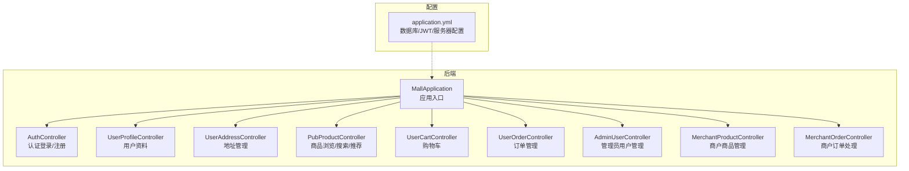
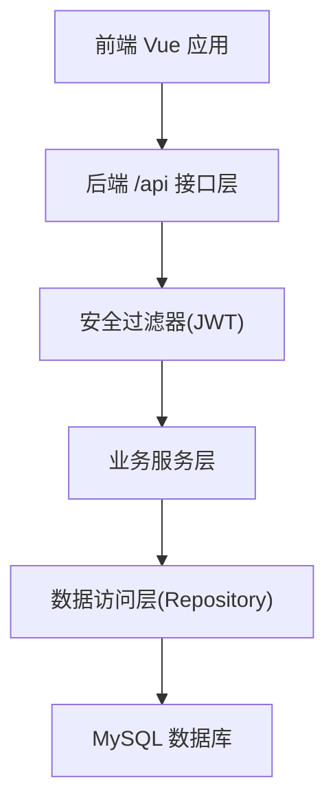
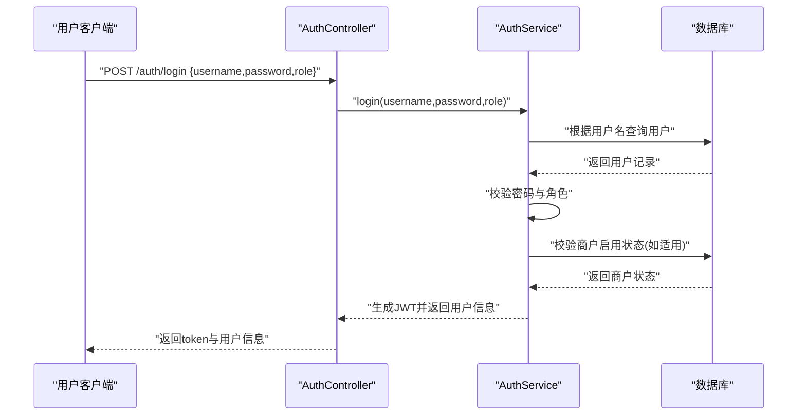
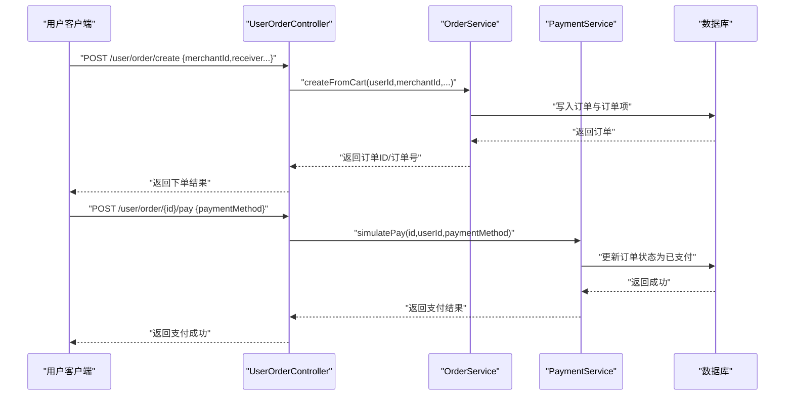
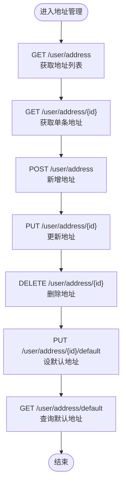
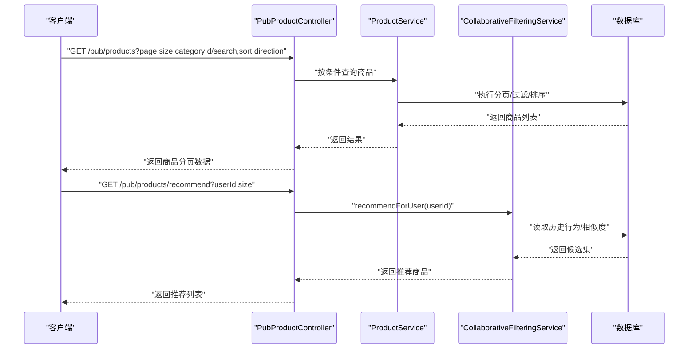
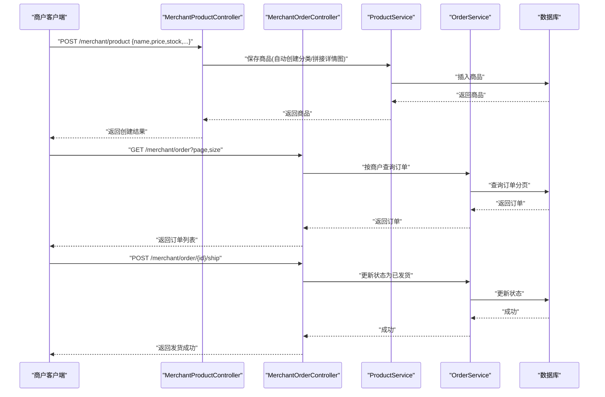
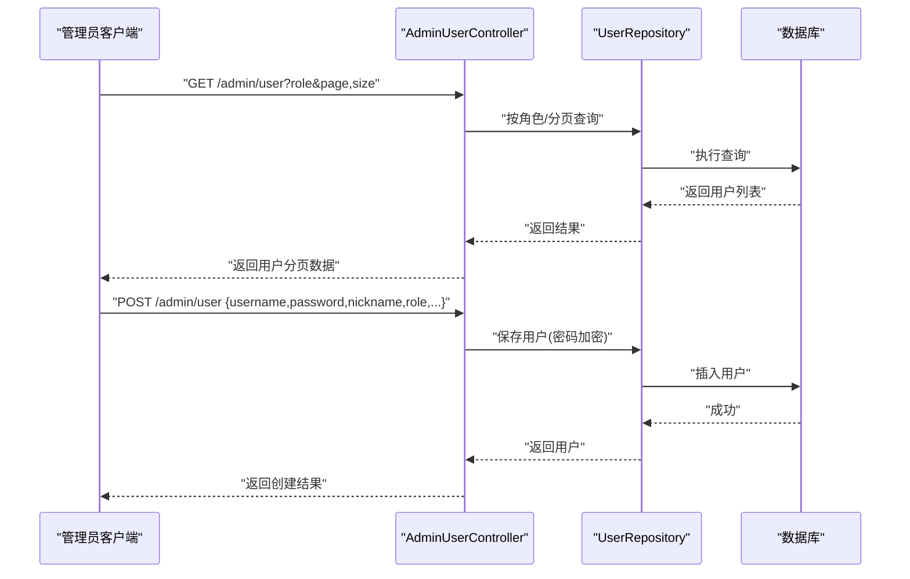
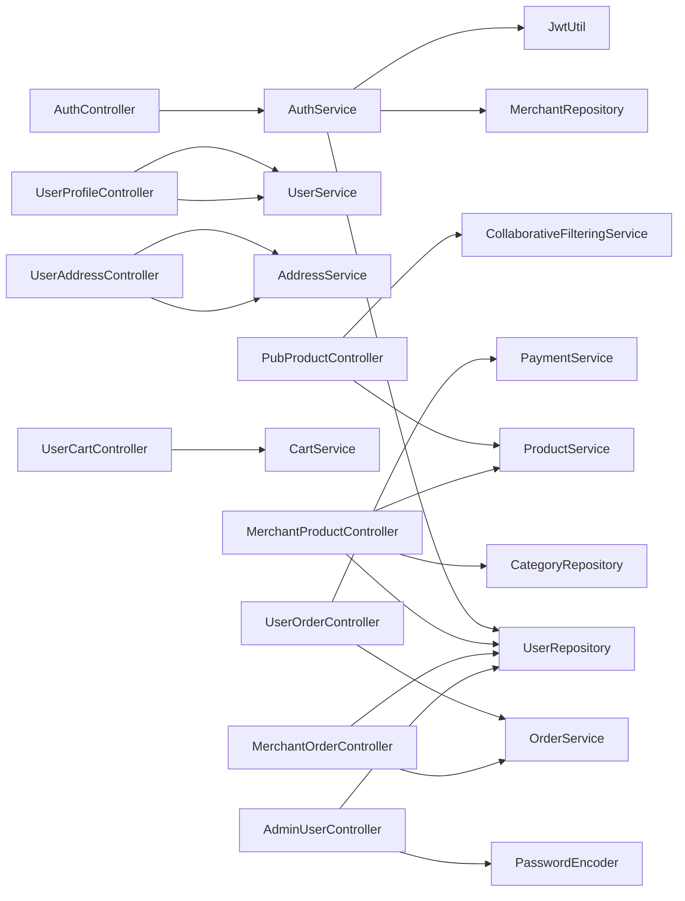

# 核心功能模块

<cite>
**本文引用的文件**
- [MallApplication.java](file://backend/src/main/java/com/mall/MallApplication.java)
- [application.yml](file://backend/src/main/resources/application.yml)
- [AuthController.java](file://backend/src/main/java/com/mall/controller/AuthController.java)
- [AuthService.java](file://backend/src/main/java/com/mall/service/AuthService.java)
- [User.java](file://backend/src/main/java/com/mall/entity/User.java)
- [UserProfileController.java](file://backend/src/main/java/com/mall/controller/user/UserProfileController.java)
- [UserAddressController.java](file://backend/src/main/java/com/mall/controller/user/UserAddressController.java)
- [PubProductController.java](file://backend/src/main/java/com/mall/controller/pub/PubProductController.java)
- [Product.java](file://backend/src/main/java/com/mall/entity/Product.java)
- [UserCartController.java](file://backend/src/main/java/com/mall/controller/user/UserCartController.java)
- [UserOrderController.java](file://backend/src/main/java/com/mall/controller/user/UserOrderController.java)
- [AdminUserController.java](file://backend/src/main/java/com/mall/controller/admin/AdminUserController.java)
- [MerchantProductController.java](file://backend/src/main/java/com/mall/controller/merchant/MerchantProductController.java)
- [MerchantOrderController.java](file://backend/src/main/java/com/mall/controller/merchant/MerchantOrderController.java)
</cite>

## 目录
1. [简介](#简介)
2. [项目结构](#项目结构)
3. [核心组件](#核心组件)
4. [架构总览](#架构总览)
5. [详细组件分析](#详细组件分析)
6. [依赖分析](#依赖分析)
7. [性能考虑](#性能考虑)
8. [故障排查指南](#故障排查指南)
9. [结论](#结论)
10. [附录](#附录)

## 简介
本文件面向电商商城系统的核心功能模块，围绕用户管理、商品管理、订单管理、商户管理、管理员系统五大板块，提供业务流程说明、API 接口设计、数据流转过程，并给出常见问题解决方案与最佳实践建议。目标是帮助开发者快速理解并实现各功能模块。

## 项目结构
后端采用 Spring Boot 架构，按“控制器-服务-仓储-实体”分层组织；前端使用 Vue 3 技术栈，通过统一的 /api 前缀访问后端 REST 接口。数据库连接与安全配置集中在 application.yml 中，JWT 用于认证授权。

图表来源
- [MallApplication.java:1-13](file://backend/src/main/java/com/mall/MallApplication.java#L1-L13)
- [application.yml:1-36](file://backend/src/main/resources/application.yml#L1-L36)
- [AuthController.java:1-73](file://backend/src/main/java/com/mall/controller/AuthController.java#L1-L73)
- [UserProfileController.java:1-41](file://backend/src/main/java/com/mall/controller/user/UserProfileController.java#L1-L41)
- [UserAddressController.java:1-73](file://backend/src/main/java/com/mall/controller/user/UserAddressController.java#L1-L73)
- [PubProductController.java:1-95](file://backend/src/main/java/com/mall/controller/pub/PubProductController.java#L1-L95)
- [UserCartController.java:1-67](file://backend/src/main/java/com/mall/controller/user/UserCartController.java#L1-L67)
- [UserOrderController.java:1-198](file://backend/src/main/java/com/mall/controller/user/UserOrderController.java#L1-L198)
- [AdminUserController.java:1-81](file://backend/src/main/java/com/mall/controller/admin/AdminUserController.java#L1-L81)
- [MerchantProductController.java:1-180](file://backend/src/main/java/com/mall/controller/merchant/MerchantProductController.java#L1-L180)
- [MerchantOrderController.java:1-100](file://backend/src/main/java/com/mall/controller/merchant/MerchantOrderController.java#L1-L100)

章节来源
- [MallApplication.java:1-13](file://backend/src/main/java/com/mall/MallApplication.java#L1-L13)
- [application.yml:1-36](file://backend/src/main/resources/application.yml#L1-L36)

## 核心组件
- 认证与授权：基于 JWT 的登录/注册，支持用户、商户角色切换校验。
- 用户管理：个人资料、收货地址、购物车、订单生命周期管理。
- 商品管理：公开商品浏览、搜索、分类筛选、新品与销量排行、协同过滤推荐。
- 商户管理：商品上下架与编辑、库存管理、订单发货与退款处理。
- 管理员系统：用户增删改查、角色与状态管理。

章节来源
- [AuthController.java:1-73](file://backend/src/main/java/com/mall/controller/AuthController.java#L1-L73)
- [AuthService.java:1-92](file://backend/src/main/java/com/mall/service/AuthService.java#L1-L92)
- [User.java:1-88](file://backend/src/main/java/com/mall/entity/User.java#L1-L88)
- [UserProfileController.java:1-41](file://backend/src/main/java/com/mall/controller/user/UserProfileController.java#L1-L41)
- [UserAddressController.java:1-73](file://backend/src/main/java/com/mall/controller/user/UserAddressController.java#L1-L73)
- [PubProductController.java:1-95](file://backend/src/main/java/com/mall/controller/pub/PubProductController.java#L1-L95)
- [Product.java:1-101](file://backend/src/main/java/com/mall/entity/Product.java#L1-L101)
- [UserCartController.java:1-67](file://backend/src/main/java/com/mall/controller/user/UserCartController.java#L1-L67)
- [UserOrderController.java:1-198](file://backend/src/main/java/com/mall/controller/user/UserOrderController.java#L1-L198)
- [AdminUserController.java:1-81](file://backend/src/main/java/com/mall/controller/admin/AdminUserController.java#L1-L81)
- [MerchantProductController.java:1-180](file://backend/src/main/java/com/mall/controller/merchant/MerchantProductController.java#L1-L180)
- [MerchantOrderController.java:1-100](file://backend/src/main/java/com/mall/controller/merchant/MerchantOrderController.java#L1-L100)

## 架构总览
系统采用前后端分离，后端以 Spring MVC 提供 REST 接口，前端通过统一的 /api 前缀访问。认证通过 JWT Token 实现，不同角色（USER、MERCHANT、ADMIN）拥有不同的受保护接口路径与权限边界。

图表来源
- [application.yml:22-25](file://backend/src/main/resources/application.yml#L22-L25)
- [application.yml:27-30](file://backend/src/main/resources/application.yml#L27-L30)

## 详细组件分析

### 用户管理系统
- 登录/注册
  - 登录：校验用户名、密码与角色一致性，运营账号需检查商户启用状态，成功后签发 JWT。
  - 注册：校验必填项，密码加密后保存为普通用户。
- 个人资料
  - 查询与更新当前登录用户资料。
- 地址管理
  - 列表、详情、新增、修改、删除、设默认、查询默认地址。
- 购物车
  - 查询、添加、改数量、删除。
- 订单管理
  - 下单（从购物车）、查询我的订单（含订单项）、订单详情、模拟支付、确认收货、完成订单、取消订单、退货/退款申请（整单/单项/批量）。

图表来源
- [AuthController.java:18-35](file://backend/src/main/java/com/mall/controller/AuthController.java#L18-L35)
- [AuthService.java:28-59](file://backend/src/main/java/com/mall/service/AuthService.java#L28-L59)
- [User.java:56-65](file://backend/src/main/java/com/mall/entity/User.java#L56-L65)

图表来源
- [UserOrderController.java:34-111](file://backend/src/main/java/com/mall/controller/user/UserOrderController.java#L34-L111)

图表来源
- [UserAddressController.java:19-71](file://backend/src/main/java/com/mall/controller/user/UserAddressController.java#L19-L71)

章节来源
- [AuthController.java:18-71](file://backend/src/main/java/com/mall/controller/AuthController.java#L18-L71)
- [AuthService.java:28-90](file://backend/src/main/java/com/mall/service/AuthService.java#L28-L90)
- [User.java:19-88](file://backend/src/main/java/com/mall/entity/User.java#L19-L88)
- [UserProfileController.java:21-39](file://backend/src/main/java/com/mall/controller/user/UserProfileController.java#L21-L39)
- [UserAddressController.java:19-71](file://backend/src/main/java/com/mall/controller/user/UserAddressController.java#L19-L71)
- [UserCartController.java:28-65](file://backend/src/main/java/com/mall/controller/user/UserCartController.java#L28-L65)
- [UserOrderController.java:34-196](file://backend/src/main/java/com/mall/controller/user/UserOrderController.java#L34-L196)

### 商品管理系统
- 公开商品浏览
  - 分页查询、按分类过滤、关键词搜索、排序（价格/销量/时间）。
- 商品详情
  - 公开详情查询。
- 新品与销量排行
  - 提供新品列表与销量排行接口。
- 协同过滤推荐
  - 需登录用户传入 userId，返回推荐商品列表。

图表来源
- [PubProductController.java:25-93](file://backend/src/main/java/com/mall/controller/pub/PubProductController.java#L25-L93)
- [Product.java:22-82](file://backend/src/main/java/com/mall/entity/Product.java#L22-L82)

章节来源
- [PubProductController.java:25-93](file://backend/src/main/java/com/mall/controller/pub/PubProductController.java#L25-L93)
- [Product.java:22-101](file://backend/src/main/java/com/mall/entity/Product.java#L22-L101)

### 商户管理系统
- 商品管理
  - 列表、详情、新增、更新、删除；支持按分类名自动创建/复用分类；详情图以逗号分隔存储。
- 库存管理
  - 商品库存字段支持增减与校验。
- 订单处理
  - 发货（仅已支付订单）、同意退款（整单/单项）、订单详情与订单项查询。

图表来源
- [MerchantProductController.java:56-114](file://backend/src/main/java/com/mall/controller/merchant/MerchantProductController.java#L56-L114)
- [MerchantOrderController.java:37-71](file://backend/src/main/java/com/mall/controller/merchant/MerchantOrderController.java#L37-L71)

章节来源
- [MerchantProductController.java:36-178](file://backend/src/main/java/com/mall/controller/merchant/MerchantProductController.java#L36-L178)
- [MerchantOrderController.java:37-99](file://backend/src/main/java/com/mall/controller/merchant/MerchantOrderController.java#L37-L99)

### 管理员系统
- 用户管理
  - 分页查询（可按角色过滤）、创建（密码加密）、更新（昵称、状态、商户绑定）、删除。
- 商品审核与报表统计
  - 当前仓库中未提供商品审核与报表统计的具体控制器实现，后续可扩展对应接口与服务。

图表来源
- [AdminUserController.java:26-59](file://backend/src/main/java/com/mall/controller/admin/AdminUserController.java#L26-L59)

章节来源
- [AdminUserController.java:26-79](file://backend/src/main/java/com/mall/controller/admin/AdminUserController.java#L26-L79)

## 依赖分析
- 控制器层依赖服务层，服务层依赖仓储层，仓储层访问数据库。
- 认证控制器依赖认证服务，认证服务依赖用户/商户仓储与 JWT 工具。
- 商品浏览控制器依赖商品服务与协同过滤服务。
- 订单控制器依赖订单与支付服务。
- 商户控制器依赖商品与订单服务及用户/分类仓储。
- 管理员控制器依赖用户仓储与密码编码器。

图表来源
- [AuthController.java:1-73](file://backend/src/main/java/com/mall/controller/AuthController.java#L1-L73)
- [AuthService.java:1-92](file://backend/src/main/java/com/mall/service/AuthService.java#L1-L92)
- [UserProfileController.java:1-41](file://backend/src/main/java/com/mall/controller/user/UserProfileController.java#L1-L41)
- [UserAddressController.java:1-73](file://backend/src/main/java/com/mall/controller/user/UserAddressController.java#L1-L73)
- [PubProductController.java:1-95](file://backend/src/main/java/com/mall/controller/pub/PubProductController.java#L1-L95)
- [UserCartController.java:1-67](file://backend/src/main/java/com/mall/controller/user/UserCartController.java#L1-L67)
- [UserOrderController.java:1-198](file://backend/src/main/java/com/mall/controller/user/UserOrderController.java#L1-L198)
- [MerchantProductController.java:1-180](file://backend/src/main/java/com/mall/controller/merchant/MerchantProductController.java#L1-L180)
- [MerchantOrderController.java:1-100](file://backend/src/main/java/com/mall/controller/merchant/MerchantOrderController.java#L1-L100)
- [AdminUserController.java:1-81](file://backend/src/main/java/com/mall/controller/admin/AdminUserController.java#L1-L81)

## 性能考虑
- 分页与排序
  - 商品列表与订单列表均使用分页请求对象，避免一次性加载大量数据。
- SQL 优化
  - 建议在商品表与订单表的关键查询字段上建立索引（如 merchant_id、category_id、order_no、user_id）。
- 缓存策略
  - 可引入 Redis 缓存热门商品、分类与推荐结果，降低数据库压力。
- 图片资源
  - 建议将图片上传至对象存储（如 OSS），后端仅存储访问链接，提升响应速度。
- 并发控制
  - 库存扣减应采用乐观锁或分布式锁，防止超卖。

## 故障排查指南
- 登录失败
  - 检查用户名是否存在、密码是否正确、角色是否匹配、商户是否启用。
- 注册失败
  - 检查用户名是否重复、必填字段是否为空。
- 地址操作异常
  - 确认地址归属当前用户，避免越权访问。
- 购物车数量更新失败
  - 检查商品是否存在、数量是否合理。
- 订单状态异常
  - 确认订单归属当前用户，状态变更是否符合业务规则（如仅已支付订单可发货）。
- JWT 过期或无效
  - 检查服务端 JWT 配置与客户端存储的 token 是否一致。

章节来源
- [AuthService.java:28-59](file://backend/src/main/java/com/mall/service/AuthService.java#L28-L59)
- [UserOrderController.java:113-133](file://backend/src/main/java/com/mall/controller/user/UserOrderController.java#L113-L133)
- [MerchantOrderController.java:61-71](file://backend/src/main/java/com/mall/controller/merchant/MerchantOrderController.java#L61-L71)

## 结论
本系统通过清晰的分层架构与角色化接口，实现了从用户到商户再到管理员的完整业务闭环。建议在现有基础上完善商品审核与报表统计能力，并结合缓存与索引策略进一步提升性能与稳定性。

## 附录
- API 调用示例（路径与方法）
  - 登录：POST /auth/login
  - 注册：POST /auth/register
  - 获取用户资料：GET /user/profile
  - 更新用户资料：PUT /user/profile
  - 地址列表：GET /user/address
  - 新增地址：POST /user/address
  - 更新地址：PUT /user/address/{id}
  - 删除地址：DELETE /user/address/{id}
  - 设默认地址：PUT /user/address/{id}/default
  - 查询默认地址：GET /user/address/default
  - 购物车列表：GET /user/cart
  - 添加商品到购物车：POST /user/cart/add
  - 修改数量：PUT /user/cart/quantity
  - 移除商品：DELETE /user/cart/{productId}
  - 下单：POST /user/order/create
  - 我的订单：GET /user/order
  - 订单详情：GET /user/order/{id}
  - 模拟支付：POST /user/order/{id}/pay
  - 确认收货：POST /user/order/{id}/confirm-receive
  - 完成订单：POST /user/order/{id}/complete
  - 取消订单：POST /user/order/{id}/cancel
  - 申请整单退款：POST /user/order/{id}/refund-request
  - 申请单项退款：POST /user/order/{id}/items/{itemId}/refund-request
  - 批量申请多项退款：POST /user/order/{id}/items/batch-refund-request
  - 商户商品列表：GET /merchant/product
  - 商户商品详情：GET /merchant/product/{id}
  - 商户新增商品：POST /merchant/product
  - 商户更新商品：PUT /merchant/product/{id}
  - 商户删除商品：DELETE /merchant/product/{id}
  - 商户订单列表：GET /merchant/order
  - 商户订单详情：GET /merchant/order/{id}
  - 商户发货：POST /merchant/order/{id}/ship
  - 商户同意整单退款：POST /merchant/order/{id}/accept-refund
  - 商户同意单项退款：POST /merchant/order/{id}/items/{itemId}/accept-refund
  - 管理员用户列表：GET /admin/user
  - 管理员创建用户：POST /admin/user
  - 管理员更新用户：PUT /admin/user/{id}
  - 管理员删除用户：DELETE /admin/user/{id}
  - 公开商品列表：GET /pub/products
  - 公开商品详情：GET /pub/products/{id}
  - 新品列表：GET /pub/products/new
  - 销量排行：GET /pub/products/rank
  - 推荐商品：GET /pub/products/recommend

- 数据模型要点
  - 用户表包含角色、启用状态、收货人信息与头像等字段。
  - 商品表包含名称、描述、价格、库存、销量、上下架状态、是否新品等字段。
  - 订单表包含用户ID、商户ID、订单号、金额、支付方式与状态等字段。

章节来源
- [application.yml:22-30](file://backend/src/main/resources/application.yml#L22-L30)
- [User.java:19-88](file://backend/src/main/java/com/mall/entity/User.java#L19-L88)
- [Product.java:22-101](file://backend/src/main/java/com/mall/entity/Product.java#L22-L101)
- [UserOrderController.java:34-196](file://backend/src/main/java/com/mall/controller/user/UserOrderController.java#L34-L196)
- [MerchantProductController.java:56-178](file://backend/src/main/java/com/mall/controller/merchant/MerchantProductController.java#L56-L178)
- [MerchantOrderController.java:37-99](file://backend/src/main/java/com/mall/controller/merchant/MerchantOrderController.java#L37-L99)
- [AdminUserController.java:26-79](file://backend/src/main/java/com/mall/controller/admin/AdminUserController.java#L26-L79)
- [PubProductController.java:25-93](file://backend/src/main/java/com/mall/controller/pub/PubProductController.java#L25-L93)