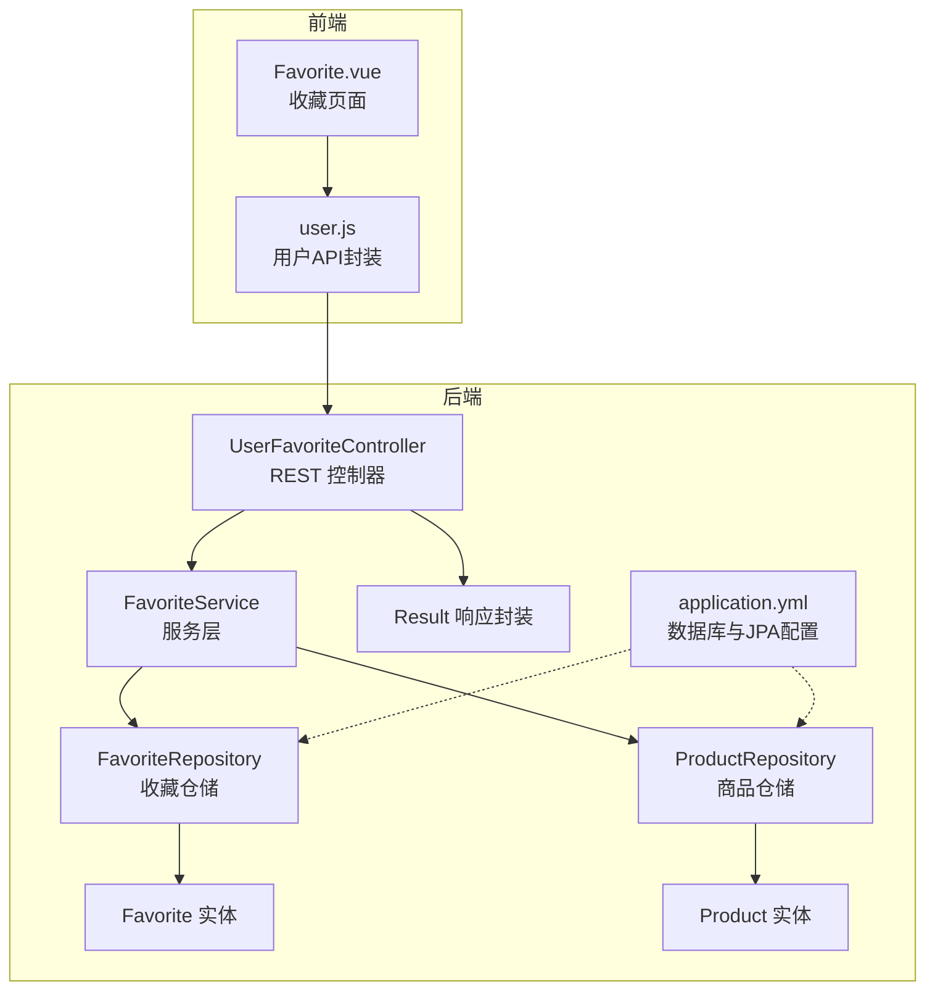
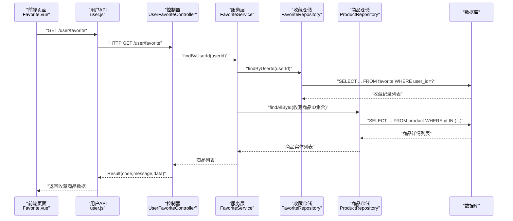
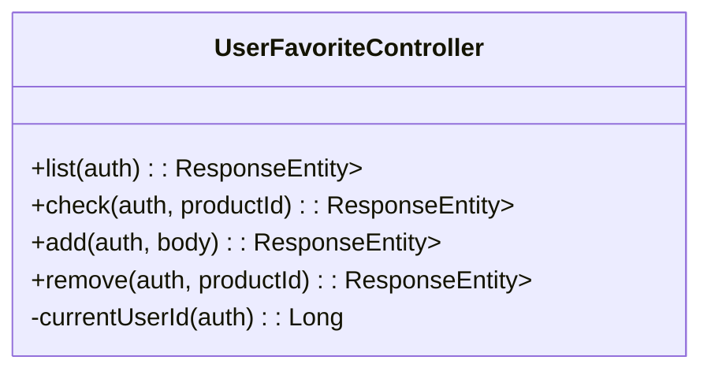
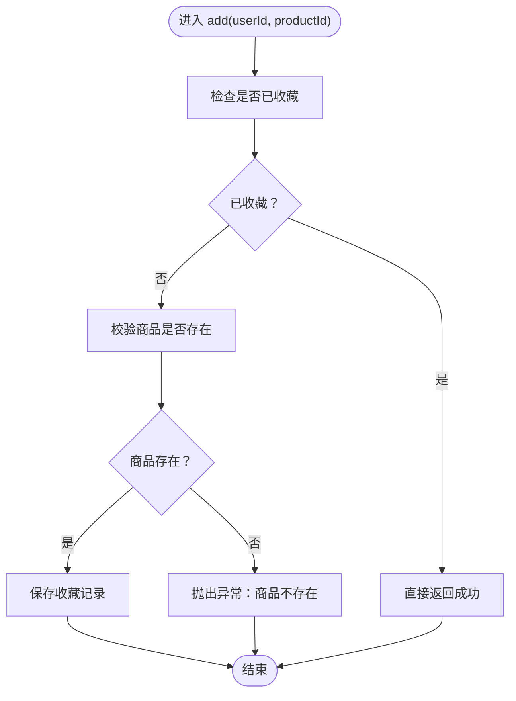
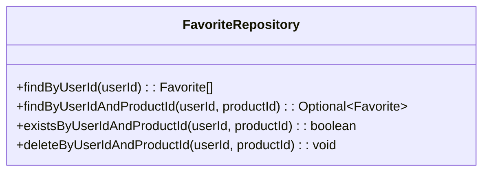
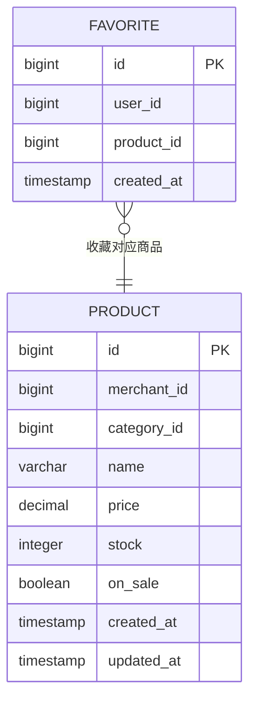
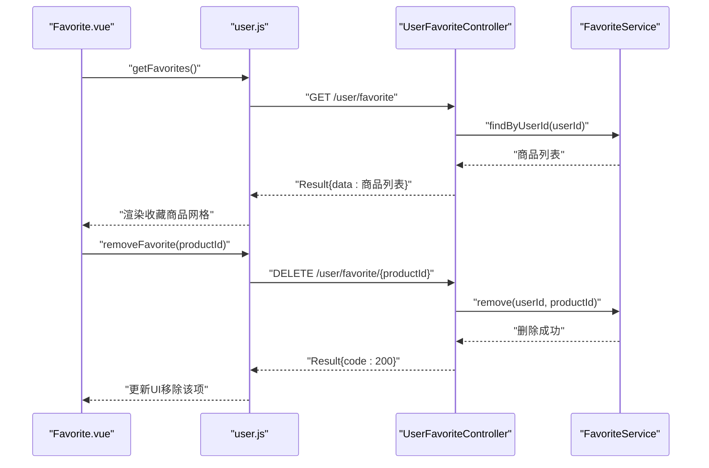
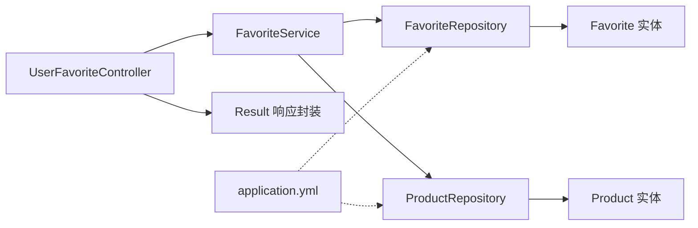

# 收藏夹管理

<cite>
**本文引用的文件**
- [UserFavoriteController.java](file://backend/src/main/java/com/mall/controller/user/UserFavoriteController.java)
- [FavoriteService.java](file://backend/src/main/java/com/mall/service/FavoriteService.java)
- [Favorite.java](file://backend/src/main/java/com/mall/entity/Favorite.java)
- [FavoriteRepository.java](file://backend/src/main/java/com/mall/repository/FavoriteRepository.java)
- [Product.java](file://backend/src/main/java/com/mall/entity/Product.java)
- [Result.java](file://backend/src/main/java/com/mall/dto/Result.java)
- [application.yml](file://backend/src/main/resources/application.yml)
- [Favorite.vue](file://frontend/src/views/user/Favorite.vue)
- [user.js](file://frontend/src/api/user.js)
</cite>

## 目录
1. [简介](#简介)
2. [项目结构](#项目结构)
3. [核心组件](#核心组件)
4. [架构总览](#架构总览)
5. [详细组件分析](#详细组件分析)
6. [依赖关系分析](#依赖关系分析)
7. [性能考量](#性能考量)
8. [故障排查指南](#故障排查指南)
9. [结论](#结论)
10. [附录](#附录)

## 简介
本技术文档围绕“收藏夹”功能进行系统化梳理，覆盖后端控制器、服务层、仓储层、实体模型以及前端交互的完整链路。重点包括：
- 收藏列表查询、收藏状态检查、新增收藏、取消收藏等核心能力
- UserFavoriteController 的实现逻辑与安全上下文处理
- FavoriteService 的业务规则、事务控制与异常处理
- Favorite 实体的数据模型、唯一约束与索引优化建议
- 收藏与商品的关联关系、用户体验优化与数据一致性保障
- 完整的收藏管理 API 文档（RESTful 接口、参数与响应）

## 项目结构
收藏功能在后端采用经典的三层架构：控制器层负责请求接入与鉴权，服务层承载业务规则与事务边界，仓储层负责数据持久化；前端通过统一的用户 API 进行调用。

图表来源
- [UserFavoriteController.java:14-59](file://backend/src/main/java/com/mall/controller/user/UserFavoriteController.java#L14-L59)
- [FavoriteService.java:14-42](file://backend/src/main/java/com/mall/service/FavoriteService.java#L14-L42)
- [FavoriteRepository.java:9-18](file://backend/src/main/java/com/mall/repository/FavoriteRepository.java#L9-L18)
- [Favorite.java:8-34](file://backend/src/main/java/com/mall/entity/Favorite.java#L8-L34)
- [Product.java:9-101](file://backend/src/main/java/com/mall/entity/Product.java#L9-L101)
- [Result.java:10-23](file://backend/src/main/java/com/mall/dto/Result.java#L10-L23)
- [application.yml:1-36](file://backend/src/main/resources/application.yml#L1-L36)

章节来源
- [UserFavoriteController.java:14-59](file://backend/src/main/java/com/mall/controller/user/UserFavoriteController.java#L14-L59)
- [application.yml:1-36](file://backend/src/main/resources/application.yml#L1-L36)

## 核心组件
- 控制器层：UserFavoriteController 提供收藏列表、收藏状态检查、新增收藏、取消收藏四个接口，并通过 Authentication 获取当前用户 ID。
- 服务层：FavoriteService 封装收藏业务规则，包括去重判断、商品存在性校验、事务边界内的新增与删除。
- 仓储层：FavoriteRepository 提供按用户查询、按用户+商品查询、存在性检查、按用户+商品删除等方法。
- 实体层：Favorite 实体定义收藏记录的字段与唯一约束；Product 实体定义商品信息。
- 前端：Favorite.vue 展示收藏列表，user.js 统一封装收藏相关 API。

章节来源
- [UserFavoriteController.java:22-58](file://backend/src/main/java/com/mall/controller/user/UserFavoriteController.java#L22-L58)
- [FavoriteService.java:21-41](file://backend/src/main/java/com/mall/service/FavoriteService.java#L21-L41)
- [FavoriteRepository.java:11-17](file://backend/src/main/java/com/mall/repository/FavoriteRepository.java#L11-L17)
- [Favorite.java:9-33](file://backend/src/main/java/com/mall/entity/Favorite.java#L9-L33)
- [Product.java:18-101](file://backend/src/main/java/com/mall/entity/Product.java#L18-L101)
- [Favorite.vue:57-94](file://frontend/src/views/user/Favorite.vue#L57-L94)
- [user.js:38-56](file://frontend/src/api/user.js#L38-L56)

## 架构总览
下图展示从前端到后端的典型调用序列，以“获取收藏列表”为例。

图表来源
- [UserFavoriteController.java:28-32](file://backend/src/main/java/com/mall/controller/user/UserFavoriteController.java#L28-L32)
- [FavoriteService.java:21-25](file://backend/src/main/java/com/mall/service/FavoriteService.java#L21-L25)
- [FavoriteRepository.java:11](file://backend/src/main/java/com/mall/repository/FavoriteRepository.java#L11)
- [Product.java:18-101](file://backend/src/main/java/com/mall/entity/Product.java#L18-L101)

## 详细组件分析

### 控制器层：UserFavoriteController
- 路由前缀：/user/favorite
- 认证方式：基于 Spring Security 的 Authentication，从 principal 中提取当前用户 ID
- 接口职责：
  - GET /user/favorite：返回当前用户的收藏商品列表
  - GET /user/favorite/check?productId=...：检查指定商品是否已收藏
  - POST /user/favorite/add：新增收藏（请求体包含 productId）
  - DELETE /user/favorite/{productId}：取消收藏

图表来源
- [UserFavoriteController.java:14-59](file://backend/src/main/java/com/mall/controller/user/UserFavoriteController.java#L14-L59)

章节来源
- [UserFavoriteController.java:22-58](file://backend/src/main/java/com/mall/controller/user/UserFavoriteController.java#L22-L58)

### 服务层：FavoriteService
- 业务规则：
  - 查询收藏列表：先按用户查询收藏记录，再批量查询商品详情
  - 检查收藏状态：使用 existsByUserIdAndProductId 判断
  - 新增收藏：若已收藏则直接返回；若商品不存在则抛出异常；否则保存收藏记录
  - 取消收藏：按用户+商品删除收藏记录
- 事务控制：新增与删除均标注 @Transactional，确保一致性

图表来源
- [FavoriteService.java:31-36](file://backend/src/main/java/com/mall/service/FavoriteService.java#L31-L36)

章节来源
- [FavoriteService.java:21-41](file://backend/src/main/java/com/mall/service/FavoriteService.java#L21-L41)

### 仓储层：FavoriteRepository
- 方法映射：
  - findByUserId：按用户 ID 查询收藏记录
  - findByUserIdAndProductId：按用户+商品查询收藏记录
  - existsByUserIdAndProductId：存在性检查
  - deleteByUserIdAndProductId：按用户+商品删除收藏记录

图表来源
- [FavoriteRepository.java:9-18](file://backend/src/main/java/com/mall/repository/FavoriteRepository.java#L9-L18)

章节来源
- [FavoriteRepository.java:11-17](file://backend/src/main/java/com/mall/repository/FavoriteRepository.java#L11-L17)

### 实体模型：Favorite 与 Product
- Favorite 实体：
  - 主键：自增 id
  - 字段：user_id、product_id、created_at（仅插入时写入）
  - 唯一约束：(user_id, product_id)，天然去重
- Product 实体：
  - 商品基本信息、价格、库存、上架状态等字段
  - 与收藏的关系：收藏记录通过 product_id 关联商品

图表来源
- [Favorite.java:17-33](file://backend/src/main/java/com/mall/entity/Favorite.java#L17-L33)
- [Product.java:18-101](file://backend/src/main/java/com/mall/entity/Product.java#L18-L101)

章节来源
- [Favorite.java:9-33](file://backend/src/main/java/com/mall/entity/Favorite.java#L9-L33)
- [Product.java:18-101](file://backend/src/main/java/com/mall/entity/Product.java#L18-L101)

### 前端集成：收藏页面与 API
- 页面：Favorite.vue 加载收藏列表，支持空态与骨架屏
- API：user.js 封装收藏相关接口，包括获取列表、检查收藏、新增收藏、取消收藏
- 交互：取消收藏时弹窗确认，成功后从本地列表剔除

图表来源
- [Favorite.vue:57-94](file://frontend/src/views/user/Favorite.vue#L57-L94)
- [user.js:38-56](file://frontend/src/api/user.js#L38-L56)
- [UserFavoriteController.java:28-58](file://backend/src/main/java/com/mall/controller/user/UserFavoriteController.java#L28-L58)
- [FavoriteService.java:38-41](file://backend/src/main/java/com/mall/service/FavoriteService.java#L38-L41)

章节来源
- [Favorite.vue:57-94](file://frontend/src/views/user/Favorite.vue#L57-L94)
- [user.js:38-56](file://frontend/src/api/user.js#L38-L56)

## 依赖关系分析
- 控制器依赖服务层，服务层依赖两个仓储：收藏仓储与商品仓储
- 收藏仓储与商品仓储分别映射到 Favorite 与 Product 实体
- 应用配置中定义了数据库连接与 JPA 行为，影响查询与事务

图表来源
- [UserFavoriteController.java:20](file://backend/src/main/java/com/mall/controller/user/UserFavoriteController.java#L20)
- [FavoriteService.java:18-19](file://backend/src/main/java/com/mall/service/FavoriteService.java#L18-L19)
- [FavoriteRepository.java:9](file://backend/src/main/java/com/mall/repository/FavoriteRepository.java#L9)
- [Product.java:9](file://backend/src/main/java/com/mall/entity/Product.java#L9)
- [Result.java:10-23](file://backend/src/main/java/com/mall/dto/Result.java#L10-L23)
- [application.yml:1-36](file://backend/src/main/resources/application.yml#L1-L36)

章节来源
- [UserFavoriteController.java:20](file://backend/src/main/java/com/mall/controller/user/UserFavoriteController.java#L20)
- [FavoriteService.java:18-19](file://backend/src/main/java/com/mall/service/FavoriteService.java#L18-L19)
- [application.yml:1-36](file://backend/src/main/resources/application.yml#L1-L36)

## 性能考量
- 查询路径优化
  - 收藏列表：先按用户查询收藏记录，再批量查询商品详情，避免 N+1 查询
  - 存在性检查：使用 existsByUserIdAndProductId，减少不必要的实体加载
- 去重策略
  - 数据库层面通过 (user_id, product_id) 唯一约束保证收藏不重复
  - 服务层在新增前再次检查，避免并发场景下的重复插入
- 索引建议
  - 在 favorite(user_id) 上建立索引，提升按用户查询效率
  - 在 favorite(user_id, product_id) 上建立复合索引，覆盖存在性检查与去重
- 事务与锁
  - 新增收藏使用 @Transactional，结合唯一约束，可有效避免并发重复
- 前端体验
  - 列表加载采用骨架屏，空态友好提示，提升弱网体验
  - 取消收藏采用二次确认，避免误操作

章节来源
- [FavoriteService.java:21-29](file://backend/src/main/java/com/mall/service/FavoriteService.java#L21-L29)
- [FavoriteRepository.java:11-17](file://backend/src/main/java/com/mall/repository/FavoriteRepository.java#L11-L17)
- [Favorite.java:9](file://backend/src/main/java/com/mall/entity/Favorite.java#L9)
- [Favorite.vue:10-31](file://frontend/src/views/user/Favorite.vue#L10-L31)

## 故障排查指南
- 新增收藏失败
  - 现象：返回错误信息
  - 可能原因：商品不存在或数据库唯一约束冲突
  - 处理建议：确认 productId 是否正确；检查商品状态；查看日志定位异常
- 取消收藏无效
  - 现象：前端未移除该项
  - 可能原因：接口调用失败或未刷新列表
  - 处理建议：确认接口返回码；手动触发重新加载收藏列表
- 收藏列表为空
  - 现象：空态显示
  - 可能原因：当前用户无收藏或网络异常
  - 处理建议：检查鉴权与网络；确认用户 ID 正确

章节来源
- [UserFavoriteController.java:45-50](file://backend/src/main/java/com/mall/controller/user/UserFavoriteController.java#L45-L50)
- [FavoriteService.java:32-36](file://backend/src/main/java/com/mall/service/FavoriteService.java#L32-L36)
- [Favorite.vue:75-88](file://frontend/src/views/user/Favorite.vue#L75-L88)

## 结论
收藏夹功能通过清晰的分层设计与严格的事务控制，实现了稳定的收藏管理能力。数据库唯一约束与服务层去重策略共同保证了数据一致性；前端骨架屏与空态优化提升了用户体验。后续可在索引与批量查询方面进一步优化，以支撑更大规模的用户与商品数据。

## 附录

### 收藏管理 API 文档
- 获取收藏列表
  - 方法：GET
  - 路径：/user/favorite
  - 认证：需要登录
  - 响应：Result{code,message,data}，data 为商品列表
- 检查商品是否已收藏
  - 方法：GET
  - 路径：/user/favorite/check
  - 参数：productId（查询参数）
  - 响应：Result{code,message,data:{favorite:boolean}}
- 新增收藏
  - 方法：POST
  - 路径：/user/favorite/add
  - 请求体：{productId: Long}
  - 响应：Result{code,message,data:null}
- 取消收藏
  - 方法：DELETE
  - 路径：/user/favorite/{productId}
  - 路径参数：productId
  - 响应：Result{code,message,data:null}

章节来源
- [UserFavoriteController.java:28-58](file://backend/src/main/java/com/mall/controller/user/UserFavoriteController.java#L28-L58)
- [user.js:38-56](file://frontend/src/api/user.js#L38-L56)
- [Result.java:16-22](file://backend/src/main/java/com/mall/dto/Result.java#L16-L22)

### 数据模型与索引建议
- Favorite 实体字段
  - id：主键
  - user_id：用户标识
  - product_id：商品标识
  - created_at：创建时间
- 唯一约束
  - (user_id, product_id)：保证同一用户对同一商品只收藏一次
- 索引建议
  - favorite(user_id)：提升按用户查询收藏列表的性能
  - favorite(user_id, product_id)：覆盖存在性检查与去重

章节来源
- [Favorite.java:9-33](file://backend/src/main/java/com/mall/entity/Favorite.java#L9-L33)
- [FavoriteRepository.java:11-17](file://backend/src/main/java/com/mall/repository/FavoriteRepository.java#L11-L17)

### 与商品信息的关联关系
- 收藏列表查询流程：先取收藏记录，再批量查询商品详情，避免 N+1 查询
- 关联关系：Favorite.product_id -> Product.id

章节来源
- [FavoriteService.java:21-25](file://backend/src/main/java/com/mall/service/FavoriteService.java#L21-L25)
- [Product.java:18-101](file://backend/src/main/java/com/mall/entity/Product.java#L18-L101)

### 用户体验优化
- 前端骨架屏与空态：提升弱网与首次加载体验
- 取消收藏二次确认：降低误操作风险
- 成功反馈：取消收藏后即时提示与 UI 更新

章节来源
- [Favorite.vue:10-31](file://frontend/src/views/user/Favorite.vue#L10-L31)
- [Favorite.vue:75-88](file://frontend/src/views/user/Favorite.vue#L75-L88)