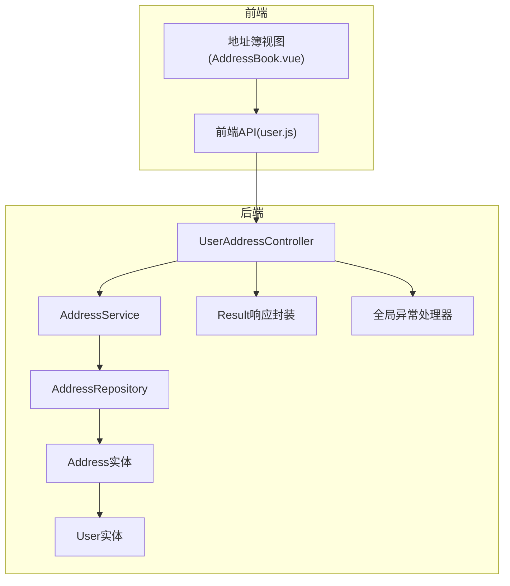
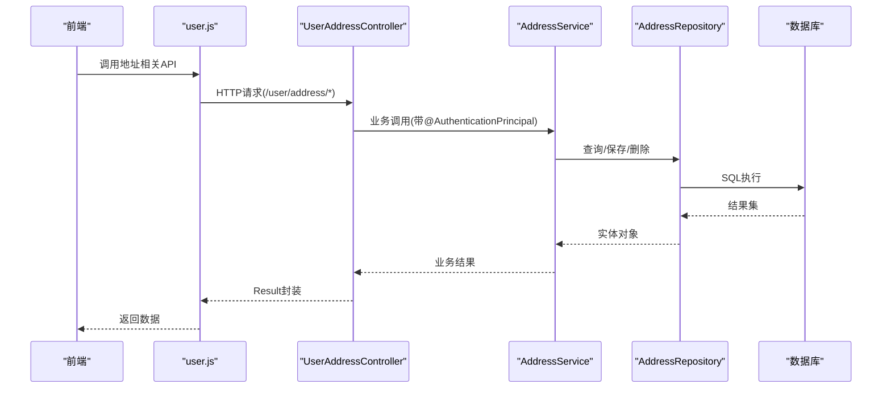
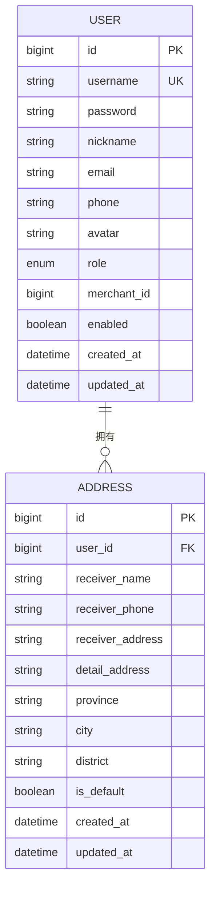
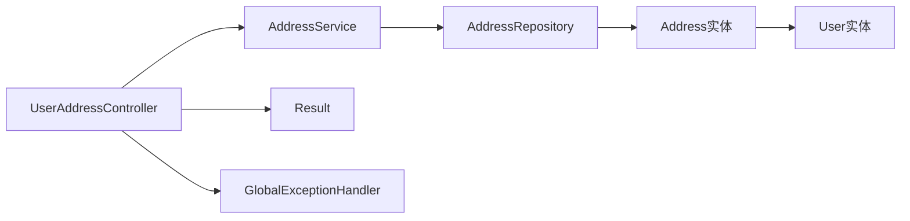

# 收货地址管理

<cite>
**本文引用的文件**
- [UserAddressController.java](file://backend/src/main/java/com/mall/controller/user/UserAddressController.java)
- [AddressService.java](file://backend/src/main/java/com/mall/service/AddressService.java)
- [AddressRepository.java](file://backend/src/main/java/com/mall/repository/AddressRepository.java)
- [Address.java](file://backend/src/main/java/com/mall/entity/Address.java)
- [User.java](file://backend/src/main/java/com/mall/entity/User.java)
- [Result.java](file://backend/src/main/java/com/mall/dto/Result.java)
- [GlobalExceptionHandler.java](file://backend/src/main/java/com/mall/exception/GlobalExceptionHandler.java)
- [application.yml](file://backend/src/main/resources/application.yml)
- [user.js](file://frontend/src/api/user.js)
- [AddressBook.vue](file://frontend/src/views/user/AddressBook.vue)
- [mall.sql](file://mall.sql)
</cite>

## 目录
1. [简介](#简介)
2. [项目结构](#项目结构)
3. [核心组件](#核心组件)
4. [架构总览](#架构总览)
5. [详细组件分析](#详细组件分析)
6. [依赖分析](#依赖分析)
7. [性能考虑](#性能考虑)
8. [故障排查指南](#故障排查指南)
9. [结论](#结论)
10. [附录](#附录)

## 简介
本技术文档围绕“收货地址管理”功能进行全面梳理，覆盖地址的增删改查、默认地址设置与查询、数据模型设计、API 接口规范、参数校验策略、事务与并发控制、错误处理机制以及前端集成方式。文档旨在帮助开发者快速理解并正确使用该功能模块，同时提供最佳实践建议与排障指引。

## 项目结构
后端采用 Spring Boot + JPA 的分层架构：
- 控制器层：UserAddressController 提供 REST 接口
- 服务层：AddressService 实现业务逻辑与事务控制
- 数据访问层：AddressRepository 基于 Spring Data JPA
- 实体层：Address、User 实体及关联关系
- DTO 层：Result 统一响应封装
- 异常层：GlobalExceptionHandler 全局异常处理

图表来源
- [UserAddressController.java:13-72](file://backend/src/main/java/com/mall/controller/user/UserAddressController.java#L13-L72)
- [AddressService.java:12-89](file://backend/src/main/java/com/mall/service/AddressService.java#L12-L89)
- [AddressRepository.java:11-21](file://backend/src/main/java/com/mall/repository/AddressRepository.java#L11-L21)
- [Address.java:7-59](file://backend/src/main/java/com/mall/entity/Address.java#L7-L59)
- [User.java:10-87](file://backend/src/main/java/com/mall/entity/User.java#L10-L87)
- [Result.java:7-23](file://backend/src/main/java/com/mall/dto/Result.java#L7-L23)
- [GlobalExceptionHandler.java:10-17](file://backend/src/main/java/com/mall/exception/GlobalExceptionHandler.java#L10-L17)

章节来源
- [UserAddressController.java:1-73](file://backend/src/main/java/com/mall/controller/user/UserAddressController.java#L1-L73)
- [AddressService.java:1-91](file://backend/src/main/java/com/mall/service/AddressService.java#L1-L91)
- [AddressRepository.java:1-22](file://backend/src/main/java/com/mall/repository/AddressRepository.java#L1-L22)
- [Address.java:1-60](file://backend/src/main/java/com/mall/entity/Address.java#L1-L60)
- [User.java:1-88](file://backend/src/main/java/com/mall/entity/User.java#L1-L88)
- [Result.java:1-24](file://backend/src/main/java/com/mall/dto/Result.java#L1-L24)
- [GlobalExceptionHandler.java:1-20](file://backend/src/main/java/com/mall/exception/GlobalExceptionHandler.java#L1-L20)
- [application.yml:1-36](file://backend/src/main/resources/application.yml#L1-L36)

## 核心组件
- 控制器：UserAddressController 提供地址列表、详情、新增、更新、删除、设置默认、查询默认等接口
- 服务：AddressService 实现业务规则（默认地址唯一性、用户权限校验、事务边界）
- 仓储：AddressRepository 提供按用户排序、默认地址查询、计数等查询方法
- 实体：Address 与 User 多对一关联，支持默认地址标记与时间戳
- 统一响应：Result 封装统一的 code/message/data 结构
- 全局异常：将运行时异常转换为业务失败响应

章节来源
- [UserAddressController.java:13-72](file://backend/src/main/java/com/mall/controller/user/UserAddressController.java#L13-L72)
- [AddressService.java:12-89](file://backend/src/main/java/com/mall/service/AddressService.java#L12-L89)
- [AddressRepository.java:11-21](file://backend/src/main/java/com/mall/repository/AddressRepository.java#L11-L21)
- [Address.java:7-59](file://backend/src/main/java/com/mall/entity/Address.java#L7-L59)
- [User.java:73-75](file://backend/src/main/java/com/mall/entity/User.java#L73-L75)
- [Result.java:7-23](file://backend/src/main/java/com/mall/dto/Result.java#L7-L23)
- [GlobalExceptionHandler.java:10-17](file://backend/src/main/java/com/mall/exception/GlobalExceptionHandler.java#L10-L17)

## 架构总览
下图展示从前端到后端的典型调用链路与数据流。

图表来源
- [user.js:128-161](file://frontend/src/api/user.js#L128-L161)
- [UserAddressController.java:19-71](file://backend/src/main/java/com/mall/controller/user/UserAddressController.java#L19-L71)
- [AddressService.java:17-89](file://backend/src/main/java/com/mall/service/AddressService.java#L17-L89)
- [AddressRepository.java:13-18](file://backend/src/main/java/com/mall/repository/AddressRepository.java#L13-L18)

## 详细组件分析

### 控制器：UserAddressController
- 路由前缀：/user/address
- 主要接口：
  - GET /user/address：获取当前用户的地址列表（按默认优先、创建时间降序）
  - GET /user/address/{id}：按ID获取地址详情（鉴权：仅本人）
  - POST /user/address：新增地址
  - PUT /user/address/{id}：更新地址
  - DELETE /user/address/{id}：删除地址
  - PUT /user/address/{id}/default：设置默认地址
  - GET /user/address/default：获取默认地址

参数与鉴权：
- 使用 @AuthenticationPrincipal 注入当前登录用户，所有读写均进行“地址归属校验”
- 请求体为 Address 实体，响应统一使用 Result 封装

错误处理：
- 地址不存在或无权限时返回 Result.fail
- 全局异常通过 GlobalExceptionHandler 统一封装为业务失败

章节来源
- [UserAddressController.java:19-71](file://backend/src/main/java/com/mall/controller/user/UserAddressController.java#L19-L71)
- [Result.java:16-22](file://backend/src/main/java/com/mall/dto/Result.java#L16-L22)
- [GlobalExceptionHandler.java:13-17](file://backend/src/main/java/com/mall/exception/GlobalExceptionHandler.java#L13-L17)

### 服务：AddressService
- getUserAddresses：按用户查询，排序规则为 isDefault 降序、createdAt 降序
- getAddressById：按ID查询并校验归属（user.id 匹配）
- createAddress：若新地址 isDefault=true，则先清除该用户其他默认地址
- updateAddress：若将某地址设为默认且原默认地址存在，则先清除其他默认；逐字段更新
- deleteAddress：按ID与归属校验后删除
- setDefaultAddress：按ID与归属校验后，先清空该用户默认地址再设置目标地址为默认
- getDefaultAddress：查询用户默认地址

事务与一致性：
- 所有写操作（新增、更新、删除、设置默认）均在 @Transactional 中执行，保证默认地址唯一性与原子性

复杂度分析：
- 查询列表：O(n log n)（排序），n 为用户地址数量
- 设置默认：O(n)（遍历查找并置否）

章节来源
- [AddressService.java:17-89](file://backend/src/main/java/com/mall/service/AddressService.java#L17-L89)

### 仓储：AddressRepository
- findByUserOrderByIsDefaultDescCreatedAtDesc：按用户查询并排序
- findDefaultByUser：查询用户默认地址
- countByUserId：统计用户地址数量（可扩展用途）

章节来源
- [AddressRepository.java:13-20](file://backend/src/main/java/com/mall/repository/AddressRepository.java#L13-L20)

### 实体：Address 与 User
- Address
  - 字段：receiverName、receiverPhone、receiverAddress、detailAddress、province、city、district、isDefault、createdAt、updatedAt
  - 关系：多对一关联 User，外键 user_id
  - 时间戳：PrePersist/PreUpdate 自动维护
- User
  - 与 Address 一对多（mappedBy="user"）
  - 同时包含“默认收货人信息”字段（用于系统级默认地址展示）

图表来源
- [Address.java:10-59](file://backend/src/main/java/com/mall/entity/Address.java#L10-L59)
- [User.java:17-87](file://backend/src/main/java/com/mall/entity/User.java#L17-L87)

章节来源
- [Address.java:10-59](file://backend/src/main/java/com/mall/entity/Address.java#L10-L59)
- [User.java:73-75](file://backend/src/main/java/com/mall/entity/User.java#L73-L75)

### 前端集成
- 前端通过 user.js 封装的 API 调用后端接口
- AddressBook.vue 负责地址表单校验（手机号正则）、提交数据组装（含 isDefault、省市区拼接）
- 默认地址展示样式高亮

章节来源
- [user.js:128-161](file://frontend/src/api/user.js#L128-L161)
- [AddressBook.vue:165-176](file://frontend/src/views/user/AddressBook.vue#L165-L176)
- [AddressBook.vue:326-341](file://frontend/src/views/user/AddressBook.vue#L326-L341)

## 依赖分析
- 控制器依赖服务层，服务层依赖仓储层
- 仓储层基于 JPA，实体间通过注解建立映射
- 统一响应与全局异常贯穿整个调用链

图表来源
- [UserAddressController.java:17-17](file://backend/src/main/java/com/mall/controller/user/UserAddressController.java#L17-L17)
- [AddressService.java:15-15](file://backend/src/main/java/com/mall/service/AddressService.java#L15-L15)
- [AddressRepository.java:12-12](file://backend/src/main/java/com/mall/repository/AddressRepository.java#L12-L12)
- [Address.java:15-17](file://backend/src/main/java/com/mall/entity/Address.java#L15-L17)
- [User.java:73-75](file://backend/src/main/java/com/mall/entity/User.java#L73-L75)
- [Result.java:10-22](file://backend/src/main/java/com/mall/dto/Result.java#L10-L22)
- [GlobalExceptionHandler.java:13-17](file://backend/src/main/java/com/mall/exception/GlobalExceptionHandler.java#L13-L17)

## 性能考虑
- 列表查询排序：按 isDefault 降序、createdAt 降序，有利于前端默认地址优先展示
- 默认地址变更：每次设置默认都会遍历用户地址并置否其他默认，复杂度 O(n)，建议在高频场景下考虑缓存默认地址 ID 或减少频繁切换
- 批量操作：当前未提供批量删除/设置默认接口，如需批量操作可在服务层增加批处理方法，注意事务拆分与幂等性
- 数据库索引：建议在 user_id、is_default 上建立复合索引以提升查询性能

[本节为通用性能建议，不直接分析具体文件]

## 故障排查指南
常见问题与定位要点：
- 400 失败响应：检查 Result.fail 的消息内容，确认是业务异常还是全局异常捕获
- 地址不存在：控制器中对不存在地址返回失败，检查地址ID与用户归属
- 权限不足：确保请求携带正确 Token 并通过 @AuthenticationPrincipal 注入用户
- 默认地址重复：服务层已保证同一用户只有一个默认地址，若出现多个默认，检查是否存在并发修改或未走服务层逻辑

章节来源
- [UserAddressController.java:28-31](file://backend/src/main/java/com/mall/controller/user/UserAddressController.java#L28-L31)
- [UserAddressController.java:58-61](file://backend/src/main/java/com/mall/controller/user/UserAddressController.java#L58-L61)
- [GlobalExceptionHandler.java:13-17](file://backend/src/main/java/com/mall/exception/GlobalExceptionHandler.java#L13-L17)

## 结论
收货地址管理模块遵循清晰的分层设计，通过服务层统一处理默认地址唯一性与权限校验，结合 JPA 的查询方法实现高效的数据访问。前后端通过统一的 Result 响应与 API 规范协作，具备良好的可维护性与扩展性。建议后续引入批量操作与缓存策略以进一步提升性能与用户体验。

[本节为总结性内容，不直接分析具体文件]

## 附录

### API 接口文档
- 获取地址列表
  - 方法：GET
  - 路径：/user/address
  - 认证：需要登录
  - 响应：Result<List<Address>>
- 获取地址详情
  - 方法：GET
  - 路径：/user/address/{id}
  - 认证：需要登录
  - 响应：Result<Address>
- 新增地址
  - 方法：POST
  - 路径：/user/address
  - 认证：需要登录
  - 请求体：Address
  - 响应：Result<Address>
- 更新地址
  - 方法：PUT
  - 路径：/user/address/{id}
  - 认证：需要登录
  - 请求体：Address
  - 响应：Result<Address>
- 删除地址
  - 方法：DELETE
  - 路径：/user/address/{id}
  - 认证：需要登录
  - 响应：Result<Void>
- 设置默认地址
  - 方法：PUT
  - 路径：/user/address/{id}/default
  - 认证：需要登录
  - 响应：Result<Address>
- 获取默认地址
  - 方法：GET
  - 路径：/user/address/default
  - 认证：需要登录
  - 响应：Result<Address>

章节来源
- [UserAddressController.java:19-71](file://backend/src/main/java/com/mall/controller/user/UserAddressController.java#L19-L71)
- [user.js:128-161](file://frontend/src/api/user.js#L128-L161)

### 参数与字段说明
- Address 字段
  - receiverName：收货人姓名，必填，长度限制
  - receiverPhone：收货人电话，必填，长度限制
  - receiverAddress：标准地址（省市区+街道），必填，长度限制
  - detailAddress：门牌号等详细地址，选填，长度限制
  - province/city/district：省市区，选填，长度限制
  - isDefault：是否默认地址，默认 false
  - createdAt/updatedAt：自动维护时间戳
- User 与 Address 关联
  - 多对一：Address.user
  - 一对多：User.addresses（懒加载）

章节来源
- [Address.java:19-41](file://backend/src/main/java/com/mall/entity/Address.java#L19-L41)
- [User.java:73-75](file://backend/src/main/java/com/mall/entity/User.java#L73-L75)

### 默认地址管理策略
- 同一用户仅允许一个默认地址
- 新增/更新/设置默认时，若目标 isDefault=true，则先清除该用户其他默认地址
- 查询默认地址使用专用查询方法，保证一致性

章节来源
- [AddressService.java:29-33](file://backend/src/main/java/com/mall/service/AddressService.java#L29-L33)
- [AddressService.java:43-45](file://backend/src/main/java/com/mall/service/AddressService.java#L43-L45)
- [AddressService.java:71-73](file://backend/src/main/java/com/mall/service/AddressService.java#L71-L73)
- [AddressRepository.java:17-18](file://backend/src/main/java/com/mall/repository/AddressRepository.java#L17-L18)

### 错误处理与响应格式
- 统一响应：Result<T>，包含 code、message、data
- 成功：code=200，message="success"
- 失败：code=400，message=错误信息
- 全局异常：RuntimeException 统一转为 Result.fail

章节来源
- [Result.java:16-22](file://backend/src/main/java/com/mall/dto/Result.java#L16-L22)
- [GlobalExceptionHandler.java:13-17](file://backend/src/main/java/com/mall/exception/GlobalExceptionHandler.java#L13-L17)

### 数据库与配置
- 数据源与 JPA 配置见 application.yml
- address 表结构与 sys_user 表结构见 mall.sql

章节来源
- [application.yml:4-17](file://backend/src/main/resources/application.yml#L4-L17)
- [mall.sql:24-35](file://mall.sql#L24-L35)
- [mall.sql:455-475](file://mall.sql#L455-L475)