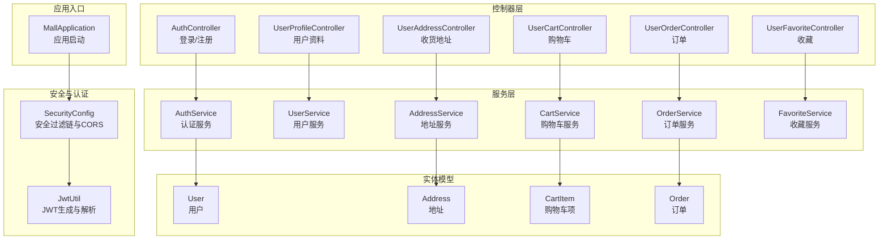
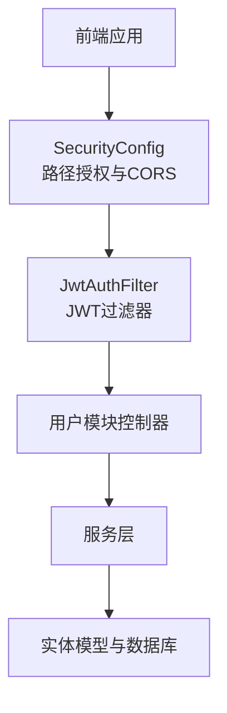
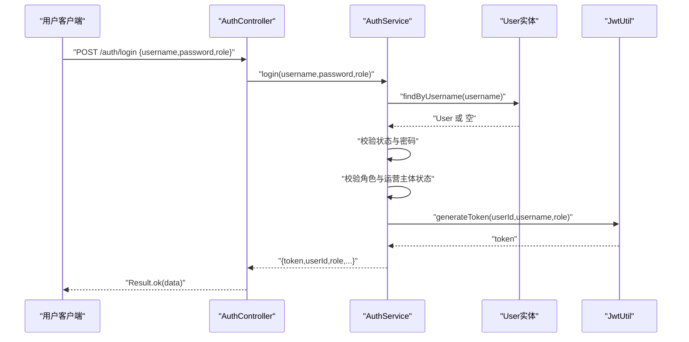
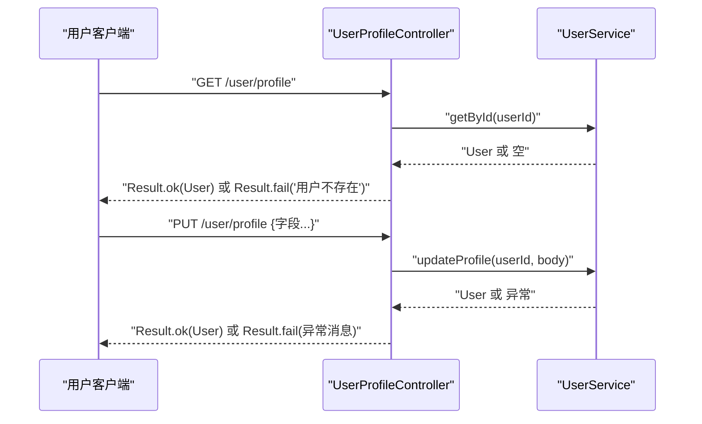
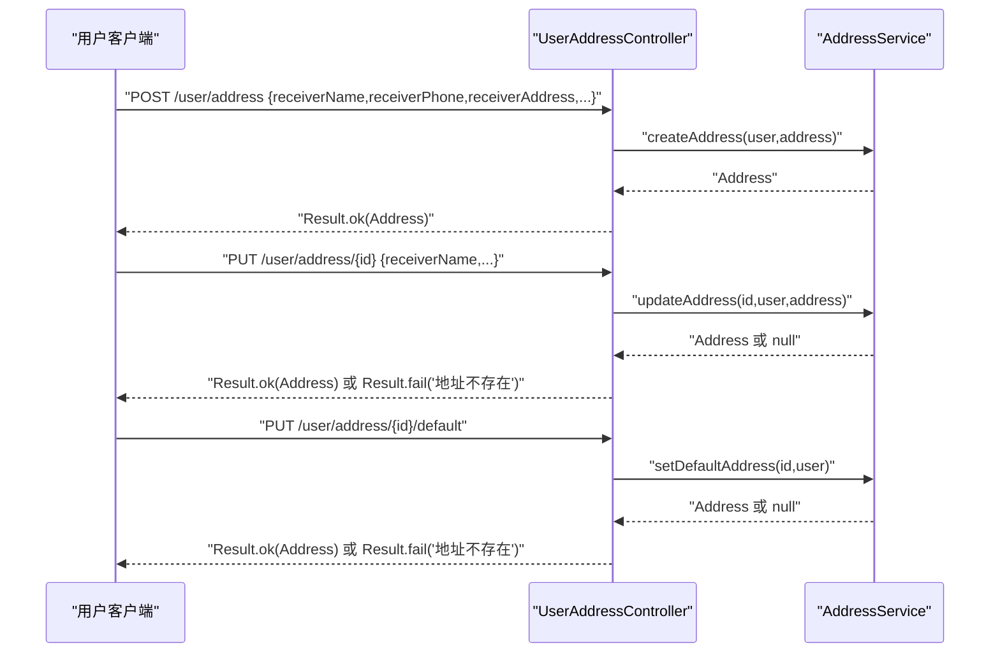
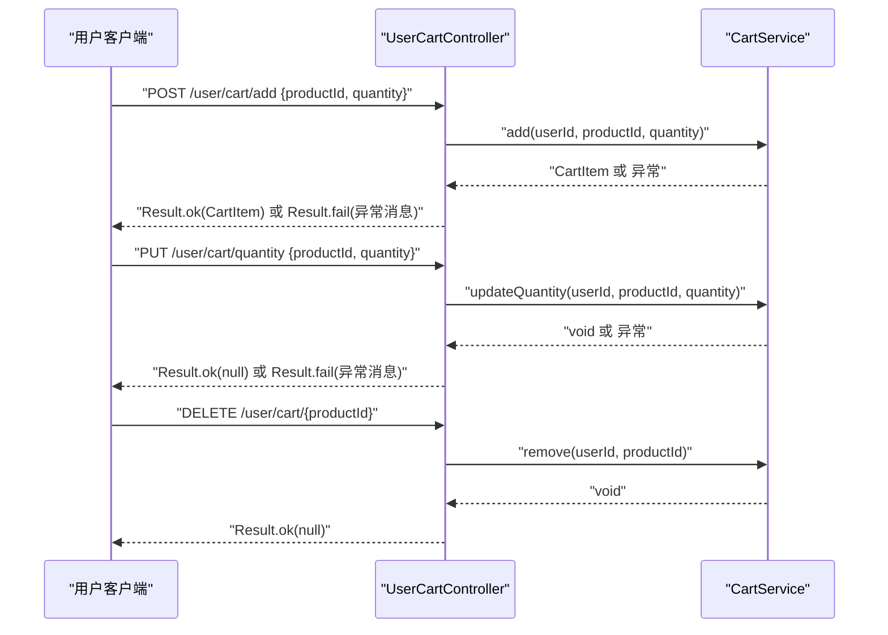
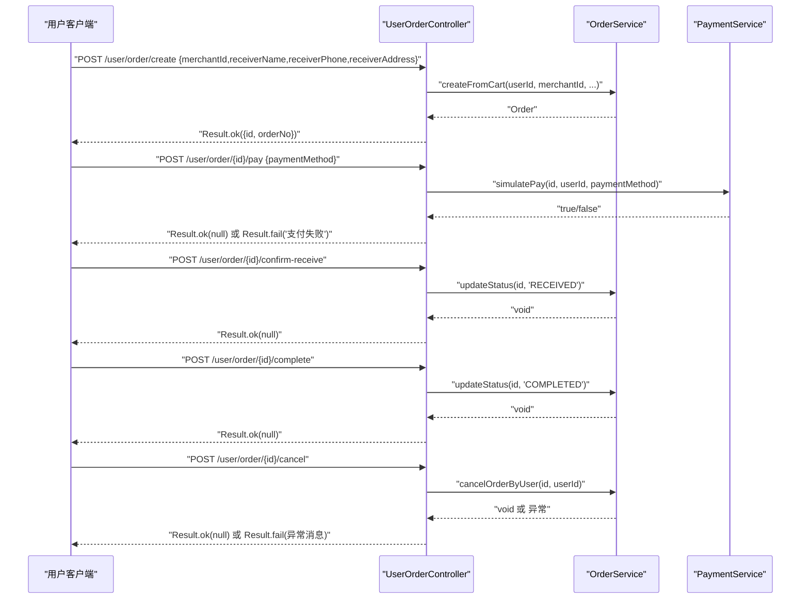
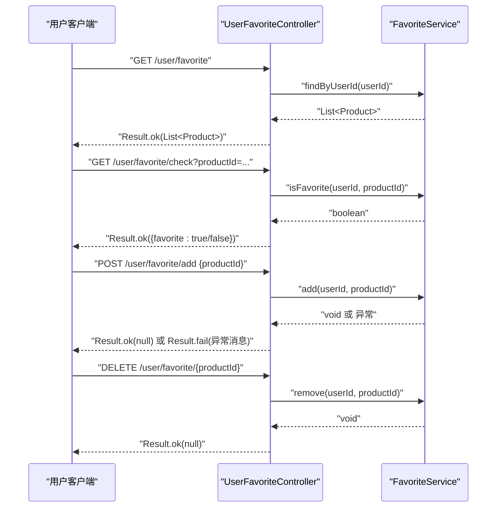
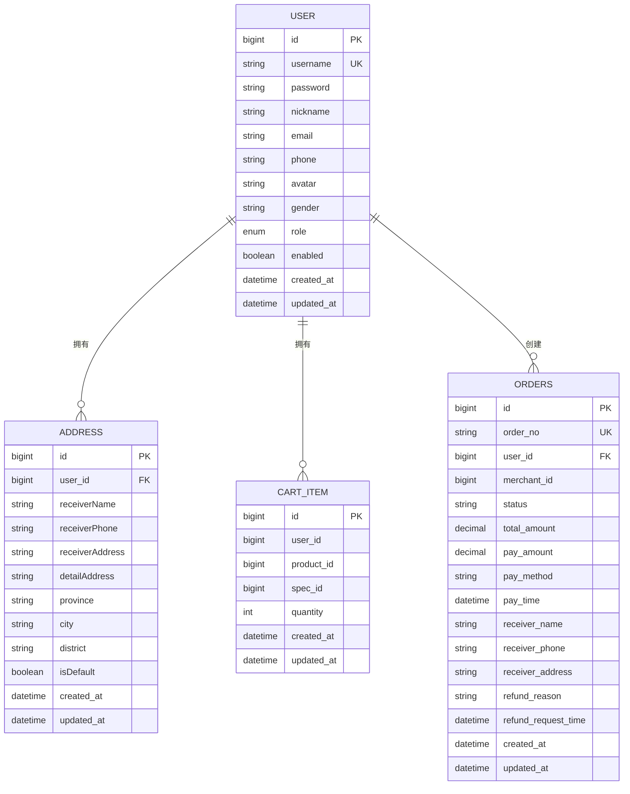
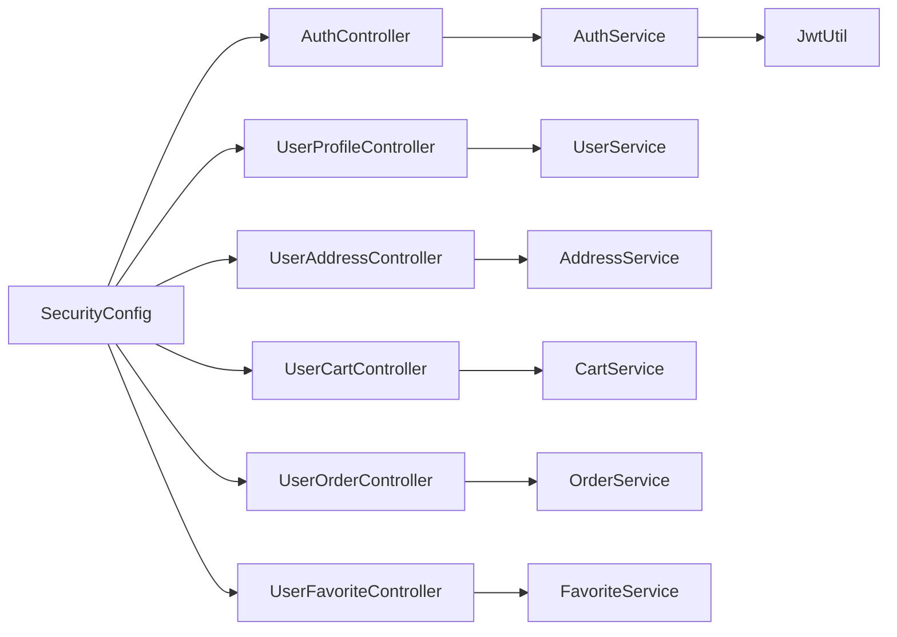

# 用户管理系统

<cite>
**本文引用的文件**
- [MallApplication.java](file://backend/src/main/java/com/mall/MallApplication.java)
- [SecurityConfig.java](file://backend/src/main/java/com/mall/config/SecurityConfig.java)
- [JwtUtil.java](file://backend/src/main/java/com/mall/security/JwtUtil.java)
- [Role.java](file://backend/src/main/java/com/mall/common/Role.java)
- [AuthController.java](file://backend/src/main/java/com/mall/controller/AuthController.java)
- [AuthService.java](file://backend/src/main/java/com/mall/service/AuthService.java)
- [UserProfileController.java](file://backend/src/main/java/com/mall/controller/user/UserProfileController.java)
- [UserAddressController.java](file://backend/src/main/java/com/mall/controller/user/UserAddressController.java)
- [UserCartController.java](file://backend/src/main/java/com/mall/controller/user/UserCartController.java)
- [UserOrderController.java](file://backend/src/main/java/com/mall/controller/user/UserOrderController.java)
- [UserFavoriteController.java](file://backend/src/main/java/com/mall/controller/user/UserFavoriteController.java)
- [User.java](file://backend/src/main/java/com/mall/entity/User.java)
- [Address.java](file://backend/src/main/java/com/mall/entity/Address.java)
- [CartItem.java](file://backend/src/main/java/com/mall/entity/CartItem.java)
- [Order.java](file://backend/src/main/java/com/mall/entity/Order.java)
</cite>

## 目录
1. [简介](#简介)
2. [项目结构](#项目结构)
3. [核心组件](#核心组件)
4. [架构总览](#架构总览)
5. [详细组件分析](#详细组件分析)
6. [依赖分析](#依赖分析)
7. [性能考虑](#性能考虑)
8. [故障排查指南](#故障排查指南)
9. [结论](#结论)
10. [附录](#附录)

## 简介
本文件为用户管理系统功能文档，覆盖用户注册登录、个人信息管理、收货地址管理、购物车管理、订单管理、收藏夹等核心功能。文档详细说明各模块业务流程、API 接口设计、数据模型关系、JWT 认证机制、角色权限控制与数据验证规则，并提供 API 调用示例、错误处理机制与常见问题解决方案，帮助开发者快速理解与实现用户相关功能。

## 项目结构
后端采用 Spring Boot 架构，按功能域分层组织：
- 应用入口与配置：应用启动类、安全配置、JWT 工具
- 控制器层：认证控制器、用户模块控制器（资料、地址、购物车、订单、收藏）
- 服务层：认证、用户、地址、购物车、订单、收藏等服务
- 数据访问层：JPA Repository（省略）
- 实体模型：User、Address、CartItem、Order 等
- DTO 与通用枚举：Result 结果封装、Role 角色枚举

图表来源
- [MallApplication.java:1-13](file://backend/src/main/java/com/mall/MallApplication.java#L1-L13)
- [SecurityConfig.java:1-74](file://backend/src/main/java/com/mall/config/SecurityConfig.java#L1-L74)
- [JwtUtil.java:1-48](file://backend/src/main/java/com/mall/security/JwtUtil.java#L1-L48)
- [AuthController.java:1-73](file://backend/src/main/java/com/mall/controller/AuthController.java#L1-L73)
- [UserProfileController.java:1-41](file://backend/src/main/java/com/mall/controller/user/UserProfileController.java#L1-L41)
- [UserAddressController.java:1-73](file://backend/src/main/java/com/mall/controller/user/UserAddressController.java#L1-L73)
- [UserCartController.java:1-67](file://backend/src/main/java/com/mall/controller/user/UserCartController.java#L1-L67)
- [UserOrderController.java:1-198](file://backend/src/main/java/com/mall/controller/user/UserOrderController.java#L1-L198)
- [UserFavoriteController.java:1-60](file://backend/src/main/java/com/mall/controller/user/UserFavoriteController.java#L1-L60)
- [User.java:1-88](file://backend/src/main/java/com/mall/entity/User.java#L1-L88)
- [Address.java:1-60](file://backend/src/main/java/com/mall/entity/Address.java#L1-L60)
- [CartItem.java:1-50](file://backend/src/main/java/com/mall/entity/CartItem.java#L1-L50)
- [Order.java:1-83](file://backend/src/main/java/com/mall/entity/Order.java#L1-L83)

章节来源
- [MallApplication.java:1-13](file://backend/src/main/java/com/mall/MallApplication.java#L1-L13)
- [SecurityConfig.java:1-74](file://backend/src/main/java/com/mall/config/SecurityConfig.java#L1-L74)

## 核心组件
- 应用启动类：负责启动 Spring Boot 应用
- 安全配置：开启 CORS、禁用 CSRF、无状态会话、基于路径的角色授权、在用户名密码过滤器之前加入 JWT 过滤器
- JWT 工具：生成与解析 JWT，携带用户标识、用户名、角色
- 角色枚举：ADMIN、MERCHANT、USER
- 控制器：统一返回 Result 包装结果；用户模块控制器均通过 Spring Security 注入当前用户上下文
- 服务层：封装业务逻辑，如登录校验、注册、地址 CRUD、购物车增删改、订单状态流转、收藏管理
- 实体模型：User、Address、CartItem、Order，定义字段、约束与时间戳更新逻辑

章节来源
- [SecurityConfig.java:33-55](file://backend/src/main/java/com/mall/config/SecurityConfig.java#L33-L55)
- [JwtUtil.java:23-46](file://backend/src/main/java/com/mall/security/JwtUtil.java#L23-L46)
- [Role.java:1-8](file://backend/src/main/java/com/mall/common/Role.java#L1-L8)
- [AuthController.java:18-71](file://backend/src/main/java/com/mall/controller/AuthController.java#L18-L71)
- [UserProfileController.java:20-39](file://backend/src/main/java/com/mall/controller/user/UserProfileController.java#L20-L39)
- [UserAddressController.java:19-71](file://backend/src/main/java/com/mall/controller/user/UserAddressController.java#L19-L71)
- [UserCartController.java:27-65](file://backend/src/main/java/com/mall/controller/user/UserCartController.java#L27-L65)
- [UserOrderController.java:33-196](file://backend/src/main/java/com/mall/controller/user/UserOrderController.java#L33-L196)
- [UserFavoriteController.java:27-58](file://backend/src/main/java/com/mall/controller/user/UserFavoriteController.java#L27-L58)
- [User.java:17-86](file://backend/src/main/java/com/mall/entity/User.java#L17-L86)
- [Address.java:10-58](file://backend/src/main/java/com/mall/entity/Address.java#L10-L58)
- [CartItem.java:15-48](file://backend/src/main/java/com/mall/entity/CartItem.java#L15-L48)
- [Order.java:16-81](file://backend/src/main/java/com/mall/entity/Order.java#L16-L81)

## 架构总览
系统采用前后端分离，前端通过 HTTP 请求调用后端 REST 接口。后端通过 Spring Security 进行统一鉴权，JWT 作为无状态认证载体。用户模块接口均受“/user/**”路径保护，要求具备 USER 角色。

图表来源
- [SecurityConfig.java:33-55](file://backend/src/main/java/com/mall/config/SecurityConfig.java#L33-L55)
- [JwtUtil.java:23-46](file://backend/src/main/java/com/mall/security/JwtUtil.java#L23-L46)
- [UserAddressController.java:1-73](file://backend/src/main/java/com/mall/controller/user/UserAddressController.java#L1-L73)
- [UserCartController.java:1-67](file://backend/src/main/java/com/mall/controller/user/UserCartController.java#L1-L67)
- [UserOrderController.java:1-198](file://backend/src/main/java/com/mall/controller/user/UserOrderController.java#L1-L198)
- [UserFavoriteController.java:1-60](file://backend/src/main/java/com/mall/controller/user/UserFavoriteController.java#L1-L60)

## 详细组件分析

### 认证与授权
- 登录流程
  - 前端提交用户名、密码、角色
  - 后端根据用户名查找用户，校验状态与密码
  - 校验所选角色与用户实际角色一致
  - 若为运营账号，校验运营主体启用状态
  - 成功则签发 JWT，返回 token 与用户信息
- 注册流程
  - 校验用户名唯一性
  - 密码加密后保存为普通用户
- 角色权限
  - /user/** 需要 USER 角色
  - /merchant/** 需要 MERCHANT 角色
  - /admin/** 需要 ADMIN 角色
- JWT 机制
  - 生成时包含 userId、username、role、签发时间与过期时间
  - 解析时校验签名并提取声明

图表来源
- [AuthController.java:18-35](file://backend/src/main/java/com/mall/controller/AuthController.java#L18-L35)
- [AuthService.java:27-59](file://backend/src/main/java/com/mall/service/AuthService.java#L27-L59)
- [JwtUtil.java:23-32](file://backend/src/main/java/com/mall/security/JwtUtil.java#L23-L32)
- [User.java:17-58](file://backend/src/main/java/com/mall/entity/User.java#L17-L58)

章节来源
- [AuthController.java:18-71](file://backend/src/main/java/com/mall/controller/AuthController.java#L18-L71)
- [AuthService.java:27-90](file://backend/src/main/java/com/mall/service/AuthService.java#L27-L90)
- [SecurityConfig.java:48-50](file://backend/src/main/java/com/mall/config/SecurityConfig.java#L48-L50)
- [JwtUtil.java:23-46](file://backend/src/main/java/com/mall/security/JwtUtil.java#L23-L46)

### 个人信息管理
- 接口
  - GET /user/profile：获取当前登录用户资料
  - PUT /user/profile：更新当前登录用户资料
- 数据模型
  - User 实体包含基础信息、头像、性别、收货人信息等
- 权限
  - 仅 USER 角色可访问
- 错误处理
  - 用户不存在时返回失败

图表来源
- [UserProfileController.java:20-39](file://backend/src/main/java/com/mall/controller/user/UserProfileController.java#L20-L39)
- [User.java:17-86](file://backend/src/main/java/com/mall/entity/User.java#L17-L86)

章节来源
- [UserProfileController.java:20-39](file://backend/src/main/java/com/mall/controller/user/UserProfileController.java#L20-L39)
- [User.java:17-86](file://backend/src/main/java/com/mall/entity/User.java#L17-L86)

### 收货地址管理
- 接口
  - GET /user/address：获取当前用户所有地址
  - GET /user/address/{id}：按 ID 获取地址
  - POST /user/address：新增地址
  - PUT /user/address/{id}：更新地址
  - DELETE /user/address/{id}：删除地址
  - PUT /user/address/{id}/default：设为默认地址
  - GET /user/address/default：获取默认地址
- 数据模型
  - Address 实体包含收件人姓名、电话、地址、省市区、默认标记等
- 权限
  - 仅 USER 角色可访问
- 业务要点
  - 默认地址唯一性由业务保证（同一用户仅一个默认地址）

图表来源
- [UserAddressController.java:19-71](file://backend/src/main/java/com/mall/controller/user/UserAddressController.java#L19-L71)
- [Address.java:10-58](file://backend/src/main/java/com/mall/entity/Address.java#L10-L58)

章节来源
- [UserAddressController.java:19-71](file://backend/src/main/java/com/mall/controller/user/UserAddressController.java#L19-L71)
- [Address.java:10-58](file://backend/src/main/java/com/mall/entity/Address.java#L10-L58)

### 购物车管理
- 接口
  - GET /user/cart：查询当前用户购物车
  - POST /user/cart/add：添加商品到购物车（支持 quantity）
  - PUT /user/cart/quantity：修改商品数量
  - DELETE /user/cart/{productId}：移除商品
- 数据模型
  - CartItem 实体包含用户 ID、商品 ID、规格 ID、数量
- 权限
  - 仅 USER 角色可访问
- 业务要点
  - 数量更新与删除均以用户维度进行

图表来源
- [UserCartController.java:27-65](file://backend/src/main/java/com/mall/controller/user/UserCartController.java#L27-L65)
- [CartItem.java:15-48](file://backend/src/main/java/com/mall/entity/CartItem.java#L15-L48)

章节来源
- [UserCartController.java:27-65](file://backend/src/main/java/com/mall/controller/user/UserCartController.java#L27-L65)
- [CartItem.java:15-48](file://backend/src/main/java/com/mall/entity/CartItem.java#L15-L48)

### 订单管理
- 接口
  - POST /user/order/create：从购物车创建订单（需提供商户 ID 与收货信息）
  - GET /user/order：分页查询我的订单（含订单项）
  - GET /user/order/{id}：查询订单详情（含订单项）
  - POST /user/order/{id}/pay：模拟支付（标记为已支付）
  - POST /user/order/{id}/confirm-receive：确认收货
  - POST /user/order/{id}/complete：完成订单
  - POST /user/order/{id}/cancel：取消订单
  - POST /user/order/{id}/refund-request：整单退款申请
  - POST /user/order/{orderId}/items/{itemId}/refund-request：单项退款申请
  - POST /user/order/{orderId}/items/batch-refund-request：批量单项退款申请
- 数据模型
  - Order 实体包含订单号、用户与商户 ID、状态、金额、收货信息、退款状态等
- 权限
  - 仅 USER 角色可访问
- 业务要点
  - 订单状态机：PENDING → PAID → SHIPPED → RECEIVED → COMPLETED
  - 退款流程：整单/单项/批量单项申请，状态变更由服务层控制

图表来源
- [UserOrderController.java:33-196](file://backend/src/main/java/com/mall/controller/user/UserOrderController.java#L33-L196)
- [Order.java:16-81](file://backend/src/main/java/com/mall/entity/Order.java#L16-L81)

章节来源
- [UserOrderController.java:33-196](file://backend/src/main/java/com/mall/controller/user/UserOrderController.java#L33-L196)
- [Order.java:16-81](file://backend/src/main/java/com/mall/entity/Order.java#L16-L81)

### 收藏夹管理
- 接口
  - GET /user/favorite：查询收藏商品列表
  - GET /user/favorite/check?productId=...：检查是否已收藏
  - POST /user/favorite/add：新增收藏
  - DELETE /user/favorite/{productId}：取消收藏
- 权限
  - 仅 USER 角色可访问
- 业务要点
  - 收藏去重由服务层保证（避免重复收藏）

图表来源
- [UserFavoriteController.java:27-58](file://backend/src/main/java/com/mall/controller/user/UserFavoriteController.java#L27-L58)

章节来源
- [UserFavoriteController.java:27-58](file://backend/src/main/java/com/mall/controller/user/UserFavoriteController.java#L27-L58)

### 数据模型关系
- 用户与地址：一对多（用户拥有多个地址）
- 用户与购物车：一对多（用户拥有多个购物车项）
- 用户与订单：一对多（用户拥有多个订单）
- 订单与订单项：一对多（订单包含多个订单项）

图表来源
- [User.java:17-86](file://backend/src/main/java/com/mall/entity/User.java#L17-L86)
- [Address.java:10-58](file://backend/src/main/java/com/mall/entity/Address.java#L10-L58)
- [CartItem.java:15-48](file://backend/src/main/java/com/mall/entity/CartItem.java#L15-L48)
- [Order.java:16-81](file://backend/src/main/java/com/mall/entity/Order.java#L16-L81)

章节来源
- [User.java:17-86](file://backend/src/main/java/com/mall/entity/User.java#L17-L86)
- [Address.java:10-58](file://backend/src/main/java/com/mall/entity/Address.java#L10-L58)
- [CartItem.java:15-48](file://backend/src/main/java/com/mall/entity/CartItem.java#L15-L48)
- [Order.java:16-81](file://backend/src/main/java/com/mall/entity/Order.java#L16-L81)

## 依赖分析
- 组件耦合
  - 控制器依赖对应服务层，服务层依赖实体与仓储（省略），JWT 工具被认证服务使用
- 外部依赖
  - Spring Security、BCrypt 密码编码器、JWT 库
- 角色与路径映射
  - /user/** → USER
  - /merchant/** → MERCHANT
  - /admin/** → ADMIN

图表来源
- [SecurityConfig.java:33-55](file://backend/src/main/java/com/mall/config/SecurityConfig.java#L33-L55)
- [AuthController.java:18-35](file://backend/src/main/java/com/mall/controller/AuthController.java#L18-L35)
- [UserProfileController.java:20-39](file://backend/src/main/java/com/mall/controller/user/UserProfileController.java#L20-L39)
- [UserAddressController.java:19-71](file://backend/src/main/java/com/mall/controller/user/UserAddressController.java#L19-L71)
- [UserCartController.java:27-65](file://backend/src/main/java/com/mall/controller/user/UserCartController.java#L27-L65)
- [UserOrderController.java:33-196](file://backend/src/main/java/com/mall/controller/user/UserOrderController.java#L33-L196)
- [UserFavoriteController.java:27-58](file://backend/src/main/java/com/mall/controller/user/UserFavoriteController.java#L27-L58)
- [AuthService.java:27-59](file://backend/src/main/java/com/mall/service/AuthService.java#L27-L59)
- [JwtUtil.java:23-32](file://backend/src/main/java/com/mall/security/JwtUtil.java#L23-L32)

章节来源
- [SecurityConfig.java:33-55](file://backend/src/main/java/com/mall/config/SecurityConfig.java#L33-L55)
- [AuthService.java:27-59](file://backend/src/main/java/com/mall/service/AuthService.java#L27-L59)

## 性能考虑
- 数据访问
  - 使用懒加载与关联查询优化，避免 N+1 查询
  - 对高频查询建立合适索引（如用户唯一键、订单号唯一键）
- 缓存策略
  - 对热点商品与推荐内容引入缓存（建议在服务层增加缓存注解）
- 并发控制
  - 购物车与库存扣减需使用分布式锁或乐观锁
- 分页与排序
  - 订单与收藏列表使用分页查询，避免一次性加载过多数据

## 故障排查指南
- 登录失败
  - 检查用户名是否存在且启用
  - 校验密码是否匹配
  - 确认所选角色与用户实际角色一致
  - 若为运营账号，确认运营主体启用状态
- 地址操作失败
  - 确认地址 ID 属于当前用户
  - 检查默认地址唯一性
- 购物车异常
  - 确认商品 ID 与用户 ID 正确
  - 检查数量参数合法性
- 订单状态异常
  - 确认订单归属当前用户
  - 按状态机顺序流转，避免非法状态跳转
- 权限不足
  - 确认请求路径与角色匹配
  - 检查 JWT 是否正确携带与未过期

章节来源
- [AuthService.java:27-59](file://backend/src/main/java/com/mall/service/AuthService.java#L27-L59)
- [UserAddressController.java:26-61](file://backend/src/main/java/com/mall/controller/user/UserAddressController.java#L26-L61)
- [UserCartController.java:36-64](file://backend/src/main/java/com/mall/controller/user/UserCartController.java#L36-L64)
- [UserOrderController.java:90-143](file://backend/src/main/java/com/mall/controller/user/UserOrderController.java#L90-L143)
- [SecurityConfig.java:48-50](file://backend/src/main/java/com/mall/config/SecurityConfig.java#L48-L50)

## 结论
本用户管理系统通过清晰的分层架构与严格的权限控制，提供了完整的用户生命周期管理能力。JWT 无状态认证与 Spring Security 的结合，确保了接口的安全性与可扩展性。开发者可依据本文档快速集成与扩展用户相关功能。

## 附录
- API 调用示例（示意）
  - 登录
    - POST /auth/login
    - 请求体：{ "username": "...", "password": "...", "role": "USER" }
    - 返回：{ "token": "...", "userId": "...", "role": "USER", ... }
  - 注册
    - POST /auth/register
    - 请求体：{ "username", "password", "nickname", "gender", "email", "phone", "receiverName", "receiverPhone", "receiverAddress" }
    - 返回：{ "message": "注册成功" }
  - 获取个人资料
    - GET /user/profile
    - 返回：用户信息对象
  - 新增收货地址
    - POST /user/address
    - 请求体：{ "receiverName", "receiverPhone", "receiverAddress", "detailAddress", "province", "city", "district", "isDefault" }
    - 返回：新增地址对象
  - 购物车添加商品
    - POST /user/cart/add
    - 请求体：{ "productId": 1, "quantity": 1 }
    - 返回：购物车项对象
  - 创建订单
    - POST /user/order/create
    - 请求体：{ "merchantId": 1, "receiverName", "receiverPhone", "receiverAddress" }
    - 返回：{ "id": "...", "orderNo": "..." }
  - 支付订单
    - POST /user/order/{id}/pay
    - 请求体：{ "paymentMethod": "WECHAT" }
    - 返回：空对象或错误信息
  - 取消订单
    - POST /user/order/{id}/cancel
    - 返回：空对象或错误信息
  - 收藏商品
    - POST /user/favorite/add
    - 请求体：{ "productId": 1 }
    - 返回：空对象
  - 取消收藏
    - DELETE /user/favorite/{productId}
    - 返回：空对象

章节来源
- [AuthController.java:18-71](file://backend/src/main/java/com/mall/controller/AuthController.java#L18-L71)
- [UserProfileController.java:20-39](file://backend/src/main/java/com/mall/controller/user/UserProfileController.java#L20-L39)
- [UserAddressController.java:34-71](file://backend/src/main/java/com/mall/controller/user/UserAddressController.java#L34-L71)
- [UserCartController.java:34-65](file://backend/src/main/java/com/mall/controller/user/UserCartController.java#L34-L65)
- [UserOrderController.java:33-143](file://backend/src/main/java/com/mall/controller/user/UserOrderController.java#L33-L143)
- [UserFavoriteController.java:41-58](file://backend/src/main/java/com/mall/controller/user/UserFavoriteController.java#L41-L58)