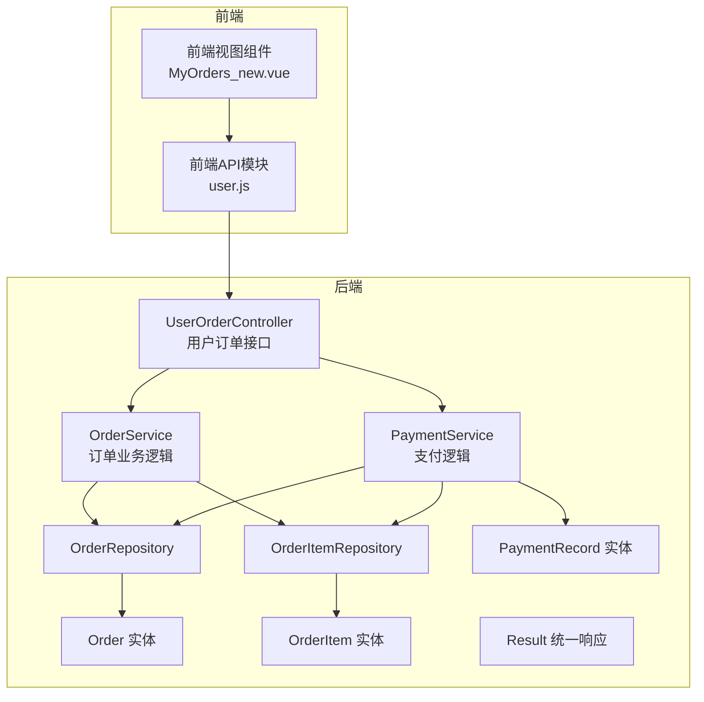
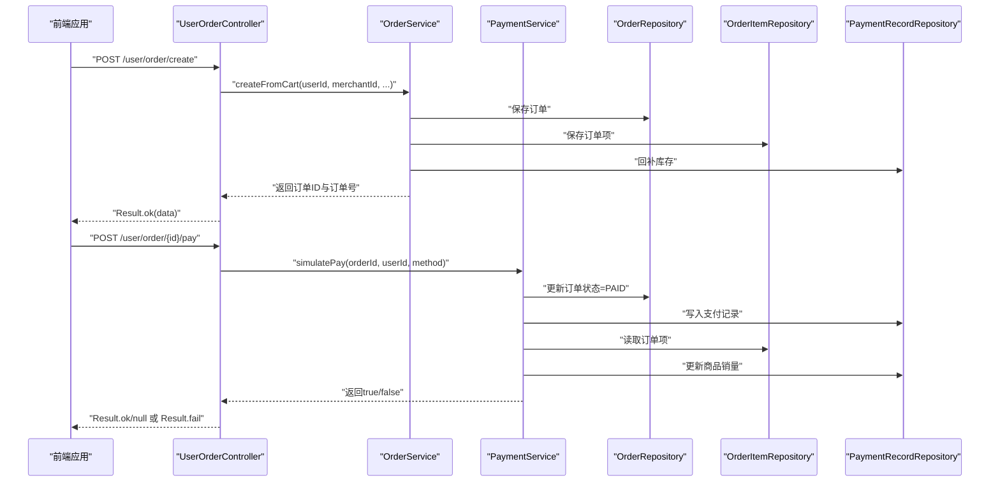
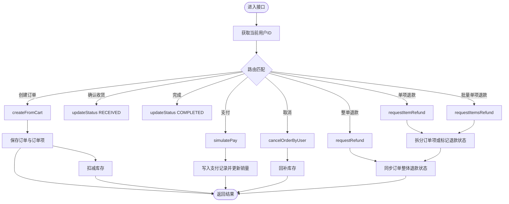
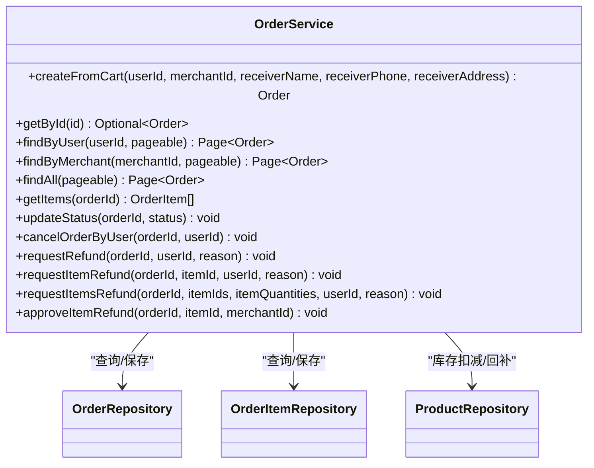
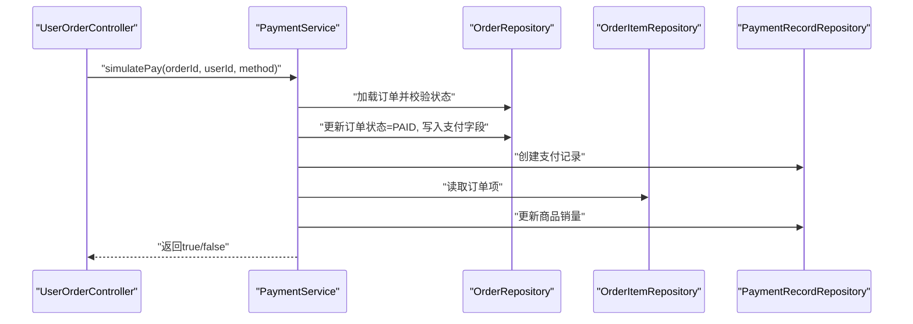
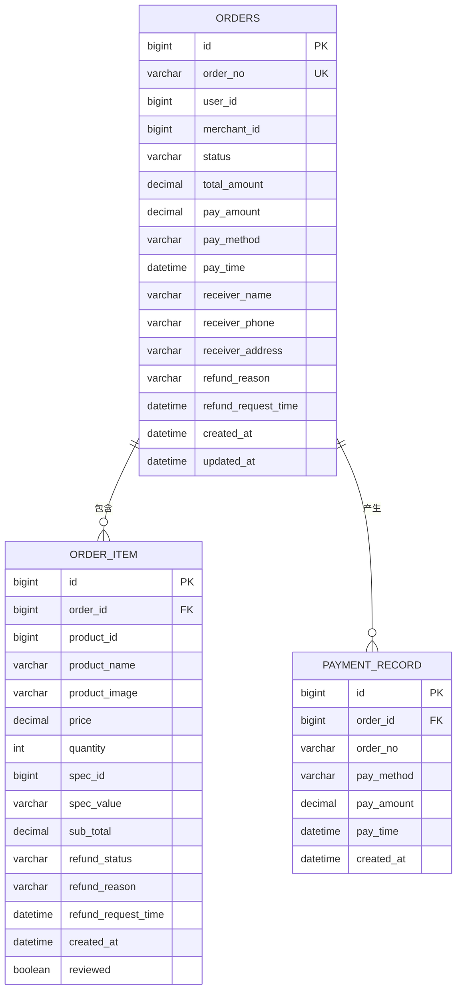
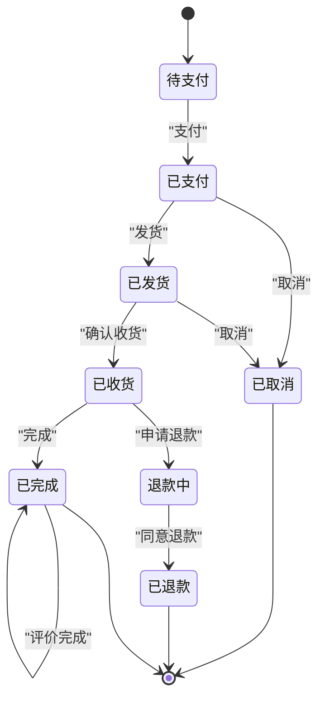
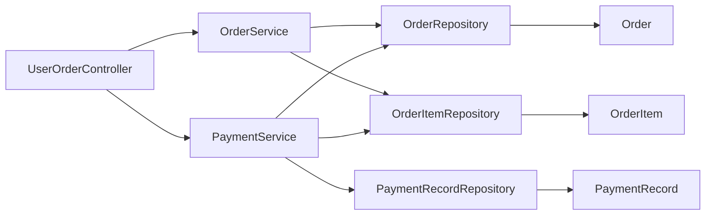

# 订单管理

<cite>
**本文引用的文件**
- [UserOrderController.java](file://backend/src/main/java/com/mall/controller/user/UserOrderController.java)
- [OrderService.java](file://backend/src/main/java/com/mall/service/OrderService.java)
- [Order.java](file://backend/src/main/java/com/mall/entity/Order.java)
- [OrderItem.java](file://backend/src/main/java/com/mall/entity/OrderItem.java)
- [OrderRepository.java](file://backend/src/main/java/com/mall/repository/OrderRepository.java)
- [OrderItemRepository.java](file://backend/src/main/java/com/mall/repository/OrderItemRepository.java)
- [PaymentService.java](file://backend/src/main/java/com/mall/service/PaymentService.java)
- [PaymentRecord.java](file://backend/src/main/java/com/mall/entity/PaymentRecord.java)
- [PaymentRecordRepository.java](file://backend/src/main/java/com/mall/repository/PaymentRecordRepository.java)
- [Result.java](file://backend/src/main/java/com/mall/dto/Result.java)
- [application.yml](file://backend/src/main/resources/application.yml)
- [user.js](file://frontend/src/api/user.js)
- [MyOrders_new.vue](file://frontend/src/views/user/MyOrders_new.vue)
</cite>

## 目录
1. [简介](#简介)
2. [项目结构](#项目结构)
3. [核心组件](#核心组件)
4. [架构总览](#架构总览)
5. [详细组件分析](#详细组件分析)
6. [依赖分析](#依赖分析)
7. [性能考虑](#性能考虑)
8. [故障排查指南](#故障排查指南)
9. [结论](#结论)
10. [附录](#附录)

## 简介
本技术文档围绕用户订单管理功能进行全面阐述，覆盖订单生命周期的完整流程：创建、查询、状态更新、取消、详情查看、支付、确认收货、完成以及退款/退货申请。文档深入解析控制器与服务层的实现逻辑，明确数据模型设计、状态机、支付流程集成、库存扣减与价格计算等业务规则，并提供完整的API文档、异常处理策略与性能优化建议。同时给出与支付、物流、库存系统的集成方案，帮助读者快速理解并扩展系统能力。

## 项目结构
后端采用Spring Boot + Spring Data JPA的分层架构，前端Vue通过Axios封装的API模块调用后端接口。订单管理相关的核心文件分布如下：
- 控制器层：用户端订单接口由UserOrderController提供RESTful接口
- 服务层：订单业务逻辑集中在OrderService，支付逻辑在PaymentService
- 数据访问层：JPA仓库负责数据库读写
- 实体层：Order、OrderItem、PaymentRecord等持久化实体
- DTO层：Result统一响应包装
- 配置层：application.yml定义数据库、JPA、JWT等配置

图表来源
- [UserOrderController.java:19-198](file://backend/src/main/java/com/mall/controller/user/UserOrderController.java#L19-L198)
- [OrderService.java:23-280](file://backend/src/main/java/com/mall/service/OrderService.java#L23-L280)
- [PaymentService.java:21-67](file://backend/src/main/java/com/mall/service/PaymentService.java#L21-L67)
- [OrderRepository.java:13-27](file://backend/src/main/java/com/mall/repository/OrderRepository.java#L13-L27)
- [OrderItemRepository.java:9-19](file://backend/src/main/java/com/mall/repository/OrderItemRepository.java#L9-L19)
- [Order.java:9-83](file://backend/src/main/java/com/mall/entity/Order.java#L9-L83)
- [OrderItem.java:9-73](file://backend/src/main/java/com/mall/entity/OrderItem.java#L9-L73)
- [PaymentRecord.java:9-46](file://backend/src/main/java/com/mall/entity/PaymentRecord.java#L9-L46)
- [Result.java:10-24](file://backend/src/main/java/com/mall/dto/Result.java#L10-L24)

章节来源
- [application.yml:1-36](file://backend/src/main/resources/application.yml#L1-L36)

## 核心组件
- 用户订单控制器：提供创建订单、查询我的订单、订单详情、支付、确认收货、完成、取消、退款申请等接口
- 订单服务：负责从购物车创建订单、库存扣减、价格计算、状态更新、退款申请与同步、取消订单回补库存等
- 支付服务：模拟支付，设置支付方式、支付金额、支付时间，写入支付记录并更新商品销量
- 数据模型：Order、OrderItem、PaymentRecord三者构成订单主从关系，支持订单项维度的退款状态跟踪
- 统一响应：Result封装HTTP响应码、消息与数据，便于前后端交互

章节来源
- [UserOrderController.java:23-198](file://backend/src/main/java/com/mall/controller/user/UserOrderController.java#L23-L198)
- [OrderService.java:26-280](file://backend/src/main/java/com/mall/service/OrderService.java#L26-L280)
- [PaymentService.java:23-67](file://backend/src/main/java/com/mall/service/PaymentService.java#L23-L67)
- [Order.java:16-83](file://backend/src/main/java/com/mall/entity/Order.java#L16-L83)
- [OrderItem.java:16-73](file://backend/src/main/java/com/mall/entity/OrderItem.java#L16-L73)
- [PaymentRecord.java:17-46](file://backend/src/main/java/com/mall/entity/PaymentRecord.java#L17-L46)
- [Result.java:10-24](file://backend/src/main/java/com/mall/dto/Result.java#L10-L24)

## 架构总览
用户通过前端调用后端REST接口，控制器接收请求并进行鉴权与参数校验，随后委托服务层执行业务逻辑。服务层通过仓库访问数据库，完成订单创建、状态更新、退款处理、库存扣减与销量统计等操作。支付流程通过PaymentService模拟完成，写入支付记录并更新商品销量。

图表来源
- [UserOrderController.java:34-111](file://backend/src/main/java/com/mall/controller/user/UserOrderController.java#L34-L111)
- [OrderService.java:34-88](file://backend/src/main/java/com/mall/service/OrderService.java#L34-L88)
- [PaymentService.java:30-65](file://backend/src/main/java/com/mall/service/PaymentService.java#L30-L65)

## 详细组件分析

### 用户订单控制器（UserOrderController）
- 职责：提供用户侧订单管理的RESTful接口，包含创建订单、查询我的订单、订单详情、支付、确认收货、完成、取消、退款申请等
- 安全：通过Authentication获取当前用户ID，所有订单操作均进行用户身份校验
- 参数：接口参数来自请求体或路径变量，部分接口支持可选参数（如支付方式）
- 响应：统一使用Result包装，成功返回200，失败返回400及错误信息
- 关键流程：
  - 创建订单：从购物车筛选指定商户的商品，校验库存，生成订单号，保存订单与订单项，并扣减库存
  - 支付：模拟支付，设置订单状态为已支付，写入支付记录，更新商品销量
  - 状态变更：确认收货、完成订单、取消订单、申请退款/退货
  - 退款：支持整单申请、单项申请、批量单项申请，支持部分数量退款拆分订单项

图表来源
- [UserOrderController.java:34-196](file://backend/src/main/java/com/mall/controller/user/UserOrderController.java#L34-L196)
- [OrderService.java:34-280](file://backend/src/main/java/com/mall/service/OrderService.java#L34-L280)
- [PaymentService.java:30-65](file://backend/src/main/java/com/mall/service/PaymentService.java#L30-L65)

章节来源
- [UserOrderController.java:23-198](file://backend/src/main/java/com/mall/controller/user/UserOrderController.java#L23-L198)

### 订单服务（OrderService）
- 订单创建：
  - 从购物车筛选指定商户的商品，校验库存充足性
  - 计算订单总价，构建订单项，保存订单与订单项
  - 扣减对应商品库存，清空购物车中已下单商品
- 订单查询：
  - 支持按用户、按商户、全站分页查询，按创建时间倒序
  - 提供订单项查询与订单详情查询
- 状态更新：
  - 通用状态更新方法，支持外部调用（如发货、完成）
- 取消订单：
  - 仅允许在特定状态下取消，取消后回补库存
- 退款处理：
  - 整单退款：仅允许已收货订单发起，设置订单整体退款状态
  - 单项退款：校验订单状态与商品数量，支持部分数量退款拆分订单项
  - 批量单项退款：支持多商品、多数量组合，自动拆分与合并
  - 同步机制：当所有订单项都处于“已申请”或“已退款”时，订单整体状态同步为“退款中”

图表来源
- [OrderService.java:26-280](file://backend/src/main/java/com/mall/service/OrderService.java#L26-L280)
- [OrderRepository.java:13-27](file://backend/src/main/java/com/mall/repository/OrderRepository.java#L13-L27)
- [OrderItemRepository.java:9-19](file://backend/src/main/java/com/mall/repository/OrderItemRepository.java#L9-L19)

章节来源
- [OrderService.java:26-280](file://backend/src/main/java/com/mall/service/OrderService.java#L26-L280)

### 支付服务（PaymentService）
- 功能：模拟支付流程，校验订单状态与用户身份，设置支付方式、支付金额、支付时间，写入支付记录，并更新商品销量
- 流程：检查订单存在性与状态，设置支付字段，保存订单；创建支付记录；遍历订单项更新商品销量
- 注意：当前为模拟支付，实际生产环境需替换为真实支付网关并增加幂等与对账机制

图表来源
- [PaymentService.java:30-65](file://backend/src/main/java/com/mall/service/PaymentService.java#L30-L65)
- [OrderRepository.java:15-26](file://backend/src/main/java/com/mall/repository/OrderRepository.java#L15-L26)
- [OrderItemRepository.java:11-14](file://backend/src/main/java/com/mall/repository/OrderItemRepository.java#L11-L14)
- [PaymentRecordRepository.java:6](file://backend/src/main/java/com/mall/repository/PaymentRecordRepository.java#L6)

章节来源
- [PaymentService.java:23-67](file://backend/src/main/java/com/mall/service/PaymentService.java#L23-L67)

### 数据模型与关系
- 订单实体（Order）：包含订单号、用户ID、商户ID、状态、金额、收货人信息、退款原因与时间、时间戳等
- 订单项实体（OrderItem）：包含订单ID、商品ID、名称、图片、单价、数量、小计、退款状态与时间、是否评价、时间戳等
- 支付记录实体（PaymentRecord）：记录支付方式、金额、时间等
- 关系：订单与订单项为一对多关系；支付记录与订单为一对一关联

图表来源
- [Order.java:18-81](file://backend/src/main/java/com/mall/entity/Order.java#L18-L81)
- [OrderItem.java:18-71](file://backend/src/main/java/com/mall/entity/OrderItem.java#L18-L71)
- [PaymentRecord.java:19-44](file://backend/src/main/java/com/mall/entity/PaymentRecord.java#L19-L44)

章节来源
- [Order.java:16-83](file://backend/src/main/java/com/mall/entity/Order.java#L16-L83)
- [OrderItem.java:16-73](file://backend/src/main/java/com/mall/entity/OrderItem.java#L16-L73)
- [PaymentRecord.java:17-46](file://backend/src/main/java/com/mall/entity/PaymentRecord.java#L17-L46)

### 订单状态机
- 用户端状态：PENDING（待支付）、PAID（已支付）、SHIPPED（已发货）、RECEIVED（已收货）、CANCELLED（已取消）
- 退款状态：REFUND_REQUESTED（退款中）、REFUNDED（已退款）
- 状态流转：
  - 创建订单：初始状态为PENDING
  - 支付：PENDING -> PAID
  - 发货：PAID -> SHIPPED
  - 确认收货：SHIPPED -> RECEIVED
  - 完成：RECEIVED -> COMPLETED
  - 取消：PENDING/PAID/SHIPPED -> CANCELLED（仅限特定状态）
  - 退款：RECEIVED -> REFUND_REQUESTED，单项退款完成后同步为REFUNDED

[此图为概念性状态图，不直接映射具体源码文件]

## 依赖分析
- 控制器依赖服务：UserOrderController依赖OrderService与PaymentService
- 服务依赖仓库：OrderService依赖OrderRepository、OrderItemRepository、ProductRepository；PaymentService依赖OrderRepository、OrderItemRepository、PaymentRecordRepository
- 实体依赖：Order与OrderItem通过外键关联；PaymentRecord与Order通过订单号关联
- 统一响应：Result作为全局响应包装，简化前后端交互

图表来源
- [UserOrderController.java:25-26](file://backend/src/main/java/com/mall/controller/user/UserOrderController.java#L25-L26)
- [OrderService.java:28-31](file://backend/src/main/java/com/mall/service/OrderService.java#L28-L31)
- [PaymentService.java:25-28](file://backend/src/main/java/com/mall/service/PaymentService.java#L25-L28)
- [OrderRepository.java:13-27](file://backend/src/main/java/com/mall/repository/OrderRepository.java#L13-L27)
- [OrderItemRepository.java:9-19](file://backend/src/main/java/com/mall/repository/OrderItemRepository.java#L9-L19)
- [PaymentRecordRepository.java:6](file://backend/src/main/java/com/mall/repository/PaymentRecordRepository.java#L6)

章节来源
- [OrderRepository.java:13-27](file://backend/src/main/java/com/mall/repository/OrderRepository.java#L13-L27)
- [OrderItemRepository.java:9-19](file://backend/src/main/java/com/mall/repository/OrderItemRepository.java#L9-L19)
- [PaymentRecordRepository.java:6](file://backend/src/main/java/com/mall/repository/PaymentRecordRepository.java#L6)

## 性能考虑
- 数据库索引：为订单号、用户ID、商户ID、状态、创建时间建立合适索引，提升查询性能
- 分页查询：使用Pageable进行分页，避免一次性加载大量数据
- 批量操作：退款批量处理时尽量减少循环内的数据库访问次数，可考虑批量更新
- 缓存策略：对商品信息、用户信息等热点数据进行缓存，降低数据库压力
- 幂等性：支付、退款等关键操作需保证幂等，避免重复处理导致的数据不一致
- 异步处理：对于非关键路径（如通知发送）可采用异步队列，提高响应速度

[本节为通用性能建议，不直接分析具体源码文件]

## 故障排查指南
- 订单不存在或越权：控制器与服务层均进行用户身份校验，若返回失败提示，请检查用户ID与订单归属
- 库存不足：创建订单时会校验库存，若抛出库存不足异常，请检查商品库存与购物车数量
- 状态不可变更：取消、退款等操作仅在特定状态下允许，若失败请确认当前订单状态
- 支付失败：模拟支付会校验订单状态与用户身份，若返回失败，请检查订单状态是否为PENDING且用户匹配
- 退款数量不合法：批量退款时需校验申请数量不超过购买数量，否则会抛出异常

章节来源
- [UserOrderController.java:90-144](file://backend/src/main/java/com/mall/controller/user/UserOrderController.java#L90-L144)
- [OrderService.java:124-145](file://backend/src/main/java/com/mall/service/OrderService.java#L124-L145)
- [OrderService.java:147-240](file://backend/src/main/java/com/mall/service/OrderService.java#L147-L240)
- [PaymentService.java:30-45](file://backend/src/main/java/com/mall/service/PaymentService.java#L30-L45)

## 结论
本订单管理模块以清晰的分层架构实现了完整的用户侧订单生命周期管理，结合统一响应、严格的参数校验与状态机控制，确保了业务流程的正确性与可维护性。通过与支付、库存、物流系统的集成方案，可进一步完善电商核心链路。建议在生产环境中补充真实支付网关、完善的异常监控与日志体系，并持续优化数据库索引与缓存策略以提升性能。

[本节为总结性内容，不直接分析具体源码文件]

## 附录

### 订单管理API文档
- 统一响应格式
  - 成功：code=200，message="success"，data为具体数据
  - 失败：code=400，message为错误信息，data=null
- 接口一览
  - 创建订单
    - 方法：POST
    - 路径：/user/order/create
    - 请求体：{merchantId, receiverName, receiverPhone, receiverAddress}
    - 响应：{id, orderNo}
  - 我的订单列表（分页）
    - 方法：GET
    - 路径：/user/order?page=&size=
    - 响应：分页对象，包含订单基础信息与items列表
  - 订单详情
    - 方法：GET
    - 路径：/user/order/{id}
    - 响应：{order, items}
  - 支付
    - 方法：POST
    - 路径：/user/order/{id}/pay
    - 请求体：{paymentMethod}（可选，默认WECHAT）
    - 响应：Result.ok/null 或 Result.fail
  - 确认收货
    - 方法：POST
    - 路径：/user/order/{id}/confirm-receive
    - 响应：Result.ok/null
  - 完成订单
    - 方法：POST
    - 路径：/user/order/{id}/complete
    - 响应：Result.ok/null
  - 取消订单
    - 方法：POST
    - 路径：/user/order/{id}/cancel
    - 响应：Result.ok/null
  - 申请整单退款
    - 方法：POST
    - 路径：/user/order/{id}/refund-request
    - 请求体：{reason}
    - 响应：Result.ok/null
  - 申请单项退款
    - 方法：POST
    - 路径：/user/order/{orderId}/items/{itemId}/refund-request
    - 请求体：{reason}
    - 响应：Result.ok/null
  - 批量单项退款
    - 方法：POST
    - 路径：/user/order/{orderId}/items/batch-refund-request
    - 请求体：{reason, itemIds[], itemQuantities:{itemId:qty}}
    - 响应：Result.ok/null

章节来源
- [user.js:58-112](file://frontend/src/api/user.js#L58-L112)
- [UserOrderController.java:34-196](file://backend/src/main/java/com/mall/controller/user/UserOrderController.java#L34-L196)
- [Result.java:16-22](file://backend/src/main/java/com/mall/dto/Result.java#L16-L22)

### 数据模型与状态说明
- 订单状态（Order.status）
  - PENDING：待支付
  - PAID：已支付
  - SHIPPED：已发货
  - RECEIVED：已收货
  - CANCELLED：已取消
- 退款状态（OrderItem.refundStatus）
  - null：无退款申请
  - REFUND_REQUESTED：退款申请中
  - REFUNDED：已退款
- 时间戳
  - 订单：createdAt、updatedAt
  - 订单项：createdAt
  - 支付记录：createdAt

章节来源
- [Order.java:31-70](file://backend/src/main/java/com/mall/entity/Order.java#L31-L70)
- [OrderItem.java:50-71](file://backend/src/main/java/com/mall/entity/OrderItem.java#L50-L71)
- [PaymentRecord.java:38-44](file://backend/src/main/java/com/mall/entity/PaymentRecord.java#L38-L44)

### 集成方案与最佳实践
- 支付集成
  - 生产环境替换模拟支付为真实支付网关，确保回调签名验证与幂等处理
  - 对接支付网关后，将支付记录与订单状态更新纳入事务，保证一致性
- 物流集成
  - 发货接口（/user/order/{id}/ship）可对接物流系统，生成运单号并更新订单状态
- 库存系统
  - 库存扣减与回补需在事务内完成，防止超卖与重复回补
  - 建议引入库存锁定与超时释放机制，避免并发冲突
- 异常处理
  - 使用统一异常处理器捕获业务异常，返回Result.fail
  - 对关键操作增加重试与熔断策略，提升系统稳定性
- 性能优化
  - 对高频查询建立复合索引，如(user_id, status, created_at)
  - 使用分页与懒加载，避免一次性加载过多数据
  - 对热点数据进行缓存，降低数据库压力

[本节为通用集成与优化建议，不直接分析具体源码文件]