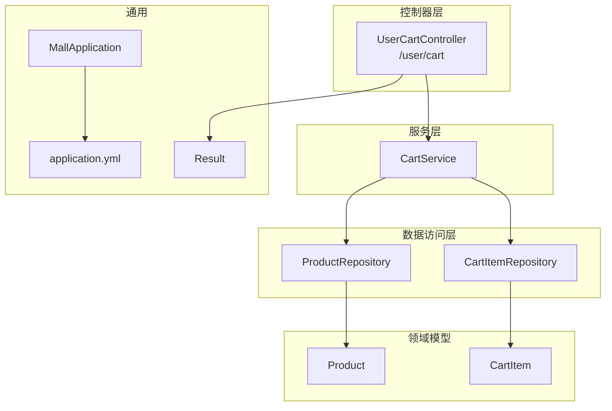
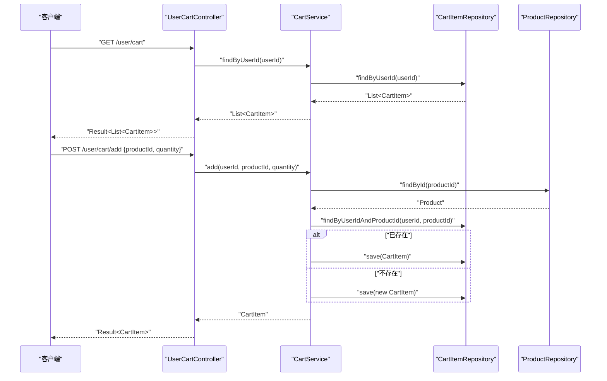
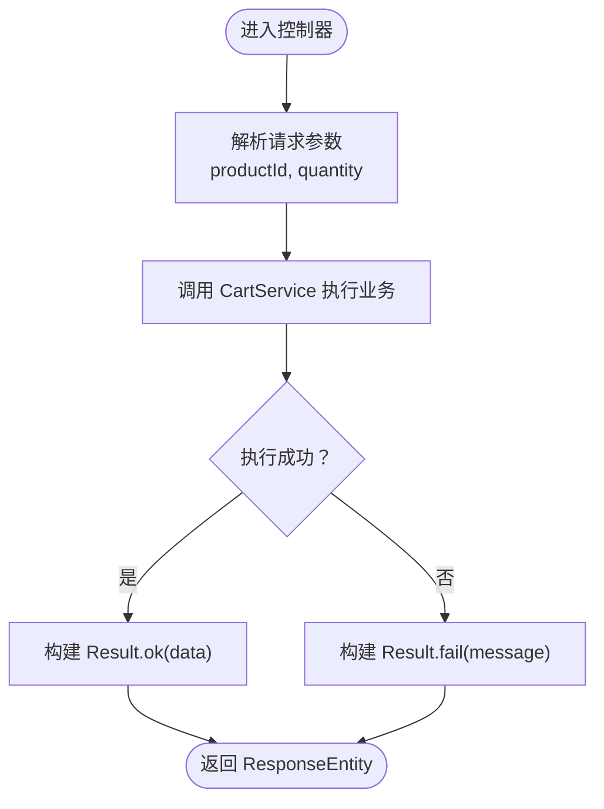
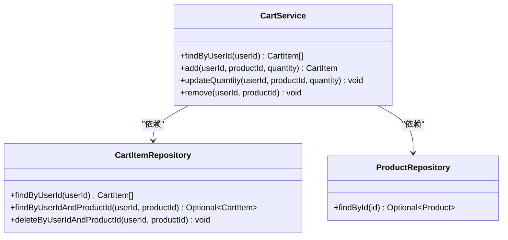
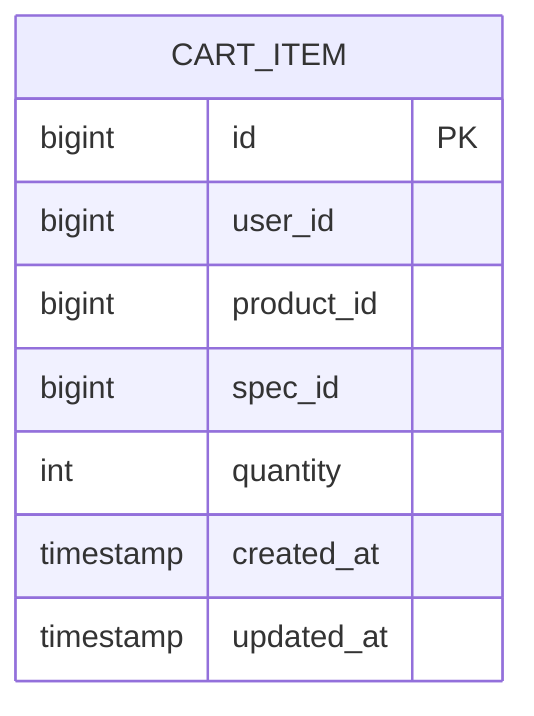
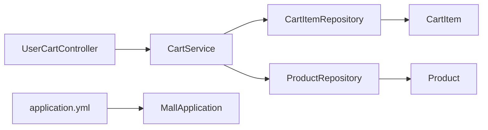

# 购物车管理

<cite>
**本文引用的文件**
- [UserCartController.java](file://backend/src/main/java/com/mall/controller/user/UserCartController.java)
- [CartService.java](file://backend/src/main/java/com/mall/service/CartService.java)
- [CartItem.java](file://backend/src/main/java/com/mall/entity/CartItem.java)
- [CartItemRepository.java](file://backend/src/main/java/com/mall/repository/CartItemRepository.java)
- [Product.java](file://backend/src/main/java/com/mall/entity/Product.java)
- [CartItemDTO.java](file://backend/src/main/java/com/mall/dto/CartItemDTO.java)
- [CartItemRequest.java](file://backend/src/main/java/com/mall/dto/CartItemRequest.java)
- [Result.java](file://backend/src/main/java/com/mall/dto/Result.java)
- [application.yml](file://backend/src/main/resources/application.yml)
- [MallApplication.java](file://backend/src/main/java/com/mall/MallApplication.java)
</cite>

## 目录
1. [简介](#简介)
2. [项目结构](#项目结构)
3. [核心组件](#核心组件)
4. [架构总览](#架构总览)
5. [详细组件分析](#详细组件分析)
6. [依赖分析](#依赖分析)
7. [性能考虑](#性能考虑)
8. [故障排查指南](#故障排查指南)
9. [结论](#结论)
10. [附录](#附录)

## 简介
本技术文档围绕购物车管理功能展开，覆盖以下方面：
- 核心功能：添加商品到购物车、修改商品数量、删除购物项、清空购物车、查询购物车列表
- 控制器实现：UserCartController 的接口设计、请求处理流程与错误处理
- 服务层实现：CartService 的事务性操作、库存与上架状态校验、持久化策略
- 数据模型：CartItem 字段定义、业务规则、与 Product 的关联关系
- API 接口文档：RESTful 设计、参数规范、响应格式
- 性能优化与并发控制：事务边界、唯一约束、JPA 操作策略
- 常见问题与解决方案：库存不足、商品下架、数量异常等

## 项目结构
后端采用 Spring Boot + JPA 的分层架构，购物车模块位于 user 层控制器、service 层服务与 JPA 实体及仓库之间，配置通过 application.yml 完成。

图表来源
- [UserCartController.java:14-66](file://backend/src/main/java/com/mall/controller/user/UserCartController.java#L14-L66)
- [CartService.java:14-61](file://backend/src/main/java/com/mall/service/CartService.java#L14-L61)
- [CartItemRepository.java:9-20](file://backend/src/main/java/com/mall/repository/CartItemRepository.java#L9-L20)
- [Product.java:9-100](file://backend/src/main/java/com/mall/entity/Product.java#L9-L100)
- [Result.java:10-23](file://backend/src/main/java/com/mall/dto/Result.java#L10-L23)
- [MallApplication.java:6-12](file://backend/src/main/java/com/mall/MallApplication.java#L6-L12)
- [application.yml:1-36](file://backend/src/main/resources/application.yml#L1-L36)

章节来源
- [UserCartController.java:14-66](file://backend/src/main/java/com/mall/controller/user/UserCartController.java#L14-L66)
- [CartService.java:14-61](file://backend/src/main/java/com/mall/service/CartService.java#L14-L61)
- [application.yml:1-36](file://backend/src/main/resources/application.yml#L1-L36)

## 核心组件
- 控制器：UserCartController 提供 GET /user/cart、POST /user/cart/add、PUT /user/cart/quantity、DELETE /user/cart/{productId} 四个接口，统一返回 Result 包装结果。
- 服务层：CartService 负责业务规则执行（库存与上架状态校验）、事务控制、购物车项的新增、更新数量、删除。
- 数据模型：CartItem 表示购物车项，包含用户标识、商品标识、规格标识、数量以及时间戳；Product 表示商品，包含价格、库存、是否上架等。
- 仓库层：CartItemRepository 提供按用户、商品、规格维度的查询与删除能力；ProductRepository 用于商品存在性与状态校验。
- 统一响应：Result 提供统一的 code/message/data 结构，便于前端处理。

章节来源
- [UserCartController.java:27-65](file://backend/src/main/java/com/mall/controller/user/UserCartController.java#L27-L65)
- [CartService.java:21-60](file://backend/src/main/java/com/mall/service/CartService.java#L21-L60)
- [CartItem.java:8-49](file://backend/src/main/java/com/mall/entity/CartItem.java#L8-L49)
- [Product.java:9-100](file://backend/src/main/java/com/mall/entity/Product.java#L9-L100)
- [Result.java:10-23](file://backend/src/main/java/com/mall/dto/Result.java#L10-L23)

## 架构总览
购物车模块遵循典型的 MVC 分层与 DDD 领域对象划分：
- 控制器负责接收请求、解析参数、调用服务、封装响应
- 服务层编排业务规则与事务边界，避免跨层重复逻辑
- 仓储层屏蔽数据库细节，提供面向领域的查询与写入方法
- 领域模型承载不变属性与生命周期事件（如创建/更新时间）

图表来源
- [UserCartController.java:27-45](file://backend/src/main/java/com/mall/controller/user/UserCartController.java#L27-L45)
- [CartService.java:21-43](file://backend/src/main/java/com/mall/service/CartService.java#L21-L43)
- [CartItemRepository.java:11-17](file://backend/src/main/java/com/mall/repository/CartItemRepository.java#L11-L17)
- [Product.java:9-100](file://backend/src/main/java/com/mall/entity/Product.java#L9-L100)

## 详细组件分析

### 控制器：UserCartController
- 路由前缀：/user/cart
- 认证方式：基于 Authentication 获取当前用户 ID
- 接口职责：
  - 列表查询：GET /user/cart 返回当前用户的购物车列表
  - 添加商品：POST /user/cart/add 接收 productId、quantity（默认1），返回新增或合并后的购物项
  - 修改数量：PUT /user/cart/quantity 接收 productId、quantity，当 quantity<=0 时自动删除该项
  - 删除商品：DELETE /user/cart/{productId} 按用户与商品维度删除
- 错误处理：捕获服务层异常，统一以 Result.fail 返回错误信息

图表来源
- [UserCartController.java:34-65](file://backend/src/main/java/com/mall/controller/user/UserCartController.java#L34-L65)

章节来源
- [UserCartController.java:14-66](file://backend/src/main/java/com/mall/controller/user/UserCartController.java#L14-L66)

### 服务层：CartService
- 事务边界：所有对外暴露的方法均在事务内执行，确保一致性
- 业务规则：
  - 新增购物项前校验商品存在且处于上架状态
  - 若同一用户+商品+规格已存在，则累加数量并保存
  - 更新数量时若 quantity<=0 则删除该项
- 关键方法：
  - findByUserId：按用户查询购物车列表
  - add：新增或合并购物项
  - updateQuantity：更新数量或删除
  - remove：按用户+商品删除

图表来源
- [CartService.java:14-61](file://backend/src/main/java/com/mall/service/CartService.java#L14-L61)
- [CartItemRepository.java:9-20](file://backend/src/main/java/com/mall/repository/CartItemRepository.java#L9-L20)
- [Product.java:9-100](file://backend/src/main/java/com/mall/entity/Product.java#L9-L100)

章节来源
- [CartService.java:14-61](file://backend/src/main/java/com/mall/service/CartService.java#L14-L61)

### 数据模型：CartItem
- 唯一键：uniqueConstraints(user_id, product_id, spec_id)，支持同一商品不同规格的购物车项并存
- 字段要点：
  - id：自增主键
  - user_id：用户标识
  - product_id：商品标识
  - spec_id：规格标识（可空）
  - quantity：数量，默认1
  - created_at/updated_at：自动维护时间戳
- 生命周期事件：@PrePersist/@PreUpdate 自动填充时间字段

图表来源
- [CartItem.java:8-49](file://backend/src/main/java/com/mall/entity/CartItem.java#L8-L49)

章节来源
- [CartItem.java:8-49](file://backend/src/main/java/com/mall/entity/CartItem.java#L8-L49)

### 数据模型：Product
- 与购物车的关联：商品必须存在且 onSale=true 才能加入购物车
- 关键字段：price、stock、onSale 等，用于库存与价格相关判断

章节来源
- [Product.java:9-100](file://backend/src/main/java/com/mall/entity/Product.java#L9-L100)

### DTO 与请求模型
- CartItemDTO：用于展示型聚合，包含商品名称、图片、单价、规格信息、小计总价等
- CartItemRequest：用于请求参数建模，包含 productId、specId、quantity
- Result：统一响应包装，包含 code、message、data

章节来源
- [CartItemDTO.java:11-32](file://backend/src/main/java/com/mall/dto/CartItemDTO.java#L11-L32)
- [CartItemRequest.java:9-16](file://backend/src/main/java/com/mall/dto/CartItemRequest.java#L9-L16)
- [Result.java:10-23](file://backend/src/main/java/com/mall/dto/Result.java#L10-L23)

## 依赖分析
- 控制器依赖服务层：UserCartController 仅依赖 CartService
- 服务层依赖仓储层：CartService 依赖 CartItemRepository 与 ProductRepository
- 仓储层依赖实体：CartItemRepository 操作 CartItem，ProductRepository 操作 Product
- 配置依赖：application.yml 提供数据源、JPA、JWT 等配置

图表来源
- [UserCartController.java:20](file://backend/src/main/java/com/mall/controller/user/UserCartController.java#L20)
- [CartService.java:18-19](file://backend/src/main/java/com/mall/service/CartService.java#L18-L19)
- [application.yml:1-36](file://backend/src/main/resources/application.yml#L1-L36)
- [MallApplication.java:6-12](file://backend/src/main/java/com/mall/MallApplication.java#L6-L12)

章节来源
- [application.yml:1-36](file://backend/src/main/resources/application.yml#L1-L36)

## 性能考虑
- 事务边界：所有购物车写操作均在事务内完成，保证一致性，但需注意长事务带来的锁竞争
- 唯一约束：购物车项的唯一约束避免重复插入，减少冗余记录
- 查询路径：按用户维度查询购物车列表，适合高频读取场景
- 缓存建议：当前实现未内置缓存，可在服务层引入 Redis 缓存用户购物车列表，降低数据库压力
- 并发控制：建议在高并发场景下对同一用户+商品+规格的写操作进行乐观锁或分布式锁控制
- SQL 优化：确保 CartItemRepository 的查询方法命中索引（user_id、product_id、spec_id）

## 故障排查指南
- 商品不存在或已下架
  - 现象：添加购物车时报错
  - 原因：商品不存在或 onSale=false
  - 处理：提示用户商品不可购买
- 数量非法
  - 现象：更新数量时 quantity<=0 导致删除
  - 原因：业务逻辑要求数量必须大于0
  - 处理：前端应限制输入范围
- 并发冲突
  - 现象：同时修改同一商品数量导致数据不一致
  - 原因：缺少并发控制
  - 处理：引入乐观锁或分布式锁
- 响应格式
  - 统一使用 Result 包装，code=200 表示成功，其他表示失败，message 描述错误原因

章节来源
- [CartService.java:25-43](file://backend/src/main/java/com/mall/service/CartService.java#L25-L43)
- [UserCartController.java:39-44](file://backend/src/main/java/com/mall/controller/user/UserCartController.java#L39-L44)
- [Result.java:16-22](file://backend/src/main/java/com/mall/dto/Result.java#L16-L22)

## 结论
购物车模块通过清晰的分层设计实现了稳定的增删改查能力，并在服务层完成了关键的业务校验（商品存在性、上架状态）。建议后续引入缓存与并发控制以提升高并发下的性能与一致性。

## 附录

### API 接口文档

- 查询购物车列表
  - 方法：GET
  - 路径：/user/cart
  - 认证：需要登录
  - 响应：Result<List<CartItem>>

- 添加商品到购物车
  - 方法：POST
  - 路径：/user/cart/add
  - 请求体：{ productId: number, quantity?: number }
  - 认证：需要登录
  - 响应：Result<CartItem>

- 更新购物车商品数量
  - 方法：PUT
  - 路径：/user/cart/quantity
  - 请求体：{ productId: number, quantity: number }
  - 认证：需要登录
  - 响应：Result<void>

- 从购物车移除商品
  - 方法：DELETE
  - 路径：/user/cart/{productId}
  - 参数：productId
  - 认证：需要登录
  - 响应：Result<void>

- 统一响应结构
  - 成功：code=200, message="success", data=实际数据
  - 失败：code≠200, message=错误信息, data=null

章节来源
- [UserCartController.java:27-65](file://backend/src/main/java/com/mall/controller/user/UserCartController.java#L27-L65)
- [Result.java:16-22](file://backend/src/main/java/com/mall/dto/Result.java#L16-L22)