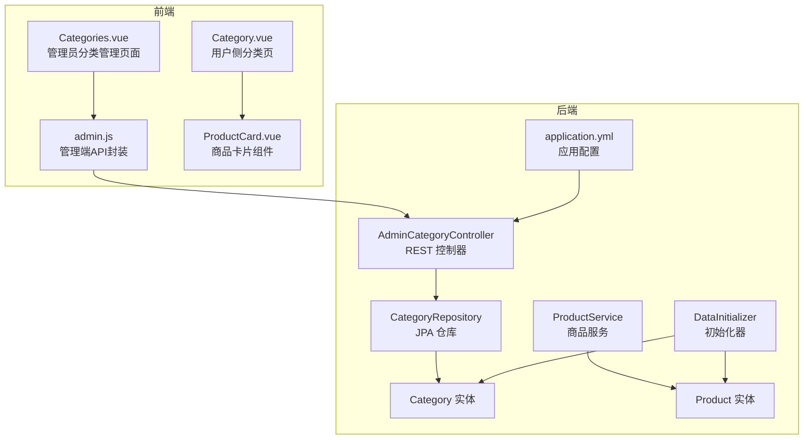
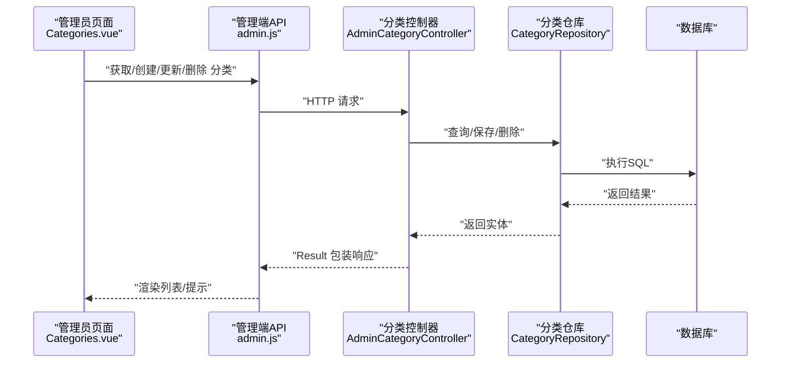
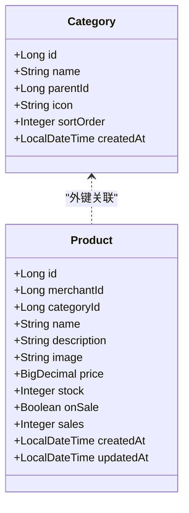
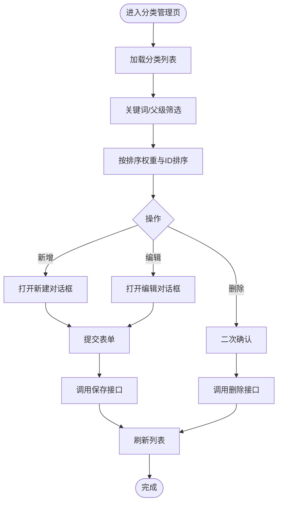
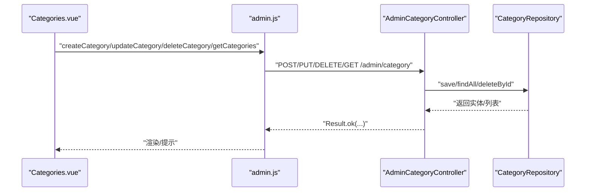
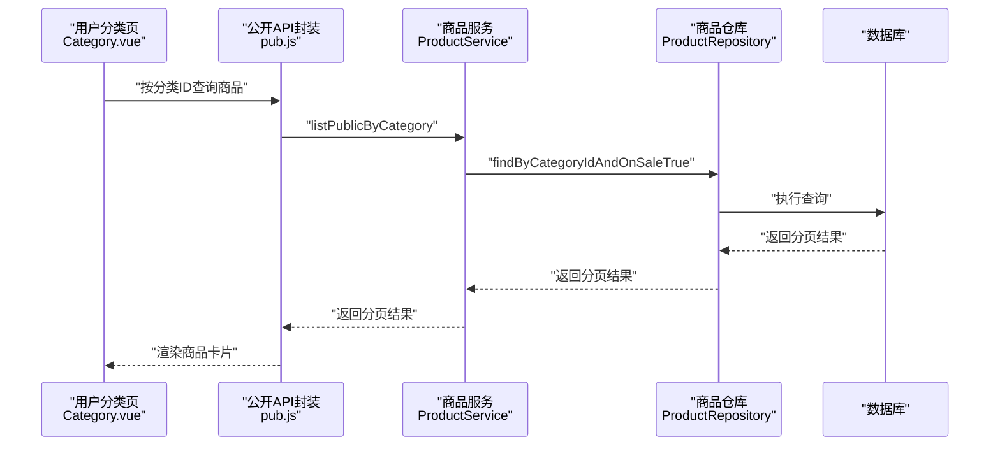
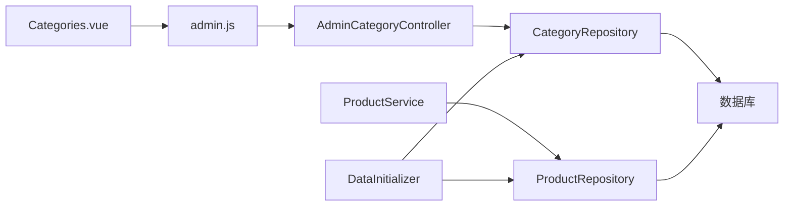

# 分类管理

<cite>
**本文引用的文件**
- [Category.java](file://backend/src/main/java/com/mall/entity/Category.java)
- [AdminCategoryController.java](file://backend/src/main/java/com/mall/controller/admin/AdminCategoryController.java)
- [CategoryRepository.java](file://backend/src/main/java/com/mall/repository/CategoryRepository.java)
- [Categories.vue](file://frontend/src/views/admin/Categories.vue)
- [admin.js](file://frontend/src/api/admin.js)
- [Product.java](file://backend/src/main/java/com/mall/entity/Product.java)
- [ProductService.java](file://backend/src/main/java/com/mall/service/ProductService.java)
- [application.yml](file://backend/src/main/resources/application.yml)
- [DataInitializer.java](file://backend/src/main/java/com/mall/config/DataInitializer.java)
- [Category.vue](file://frontend/src/views/user/Category.vue)
- [ProductCard.vue](file://frontend/src/components/ProductCard.vue)
</cite>

## 目录
1. [简介](#简介)
2. [项目结构](#项目结构)
3. [核心组件](#核心组件)
4. [架构总览](#架构总览)
5. [详细组件分析](#详细组件分析)
6. [依赖分析](#依赖分析)
7. [性能考虑](#性能考虑)
8. [故障排查指南](#故障排查指南)
9. [结论](#结论)
10. [附录](#附录)

## 简介
本文件围绕管理员对商品分类的全生命周期管理进行系统化说明，覆盖分类创建、层级管理、排序调整、父子关系维护、以及与商品数据的关联关系。文档同时阐述分类树结构设计、排序权重、以及在商品组织、导航优化、搜索精准度与营销推广中的作用，并提供前后端API调用路径、数据模型与界面交互流程，帮助开发者快速实现灵活可扩展的商品分类体系。

## 项目结构
后端采用Spring Boot + JPA，前端使用Vue 3 + Element Plus，分类管理由管理员端负责，用户端通过分类入口浏览商品。

图表来源
- [AdminCategoryController.java:1-47](file://backend/src/main/java/com/mall/controller/admin/AdminCategoryController.java#L1-L47)
- [CategoryRepository.java:1-17](file://backend/src/main/java/com/mall/repository/CategoryRepository.java#L1-L17)
- [Category.java:1-41](file://backend/src/main/java/com/mall/entity/Category.java#L1-L41)
- [ProductService.java:1-126](file://backend/src/main/java/com/mall/service/ProductService.java#L1-L126)
- [Product.java:1-101](file://backend/src/main/java/com/mall/entity/Product.java#L1-L101)
- [application.yml:1-36](file://backend/src/main/resources/application.yml#L1-L36)
- [DataInitializer.java:1-95](file://backend/src/main/java/com/mall/config/DataInitializer.java#L1-L95)
- [Categories.vue:1-236](file://frontend/src/views/admin/Categories.vue#L1-L236)
- [admin.js:58-76](file://frontend/src/api/admin.js#L58-L76)
- [Category.vue:1-35](file://frontend/src/views/user/Category.vue#L1-L35)
- [ProductCard.vue:1-261](file://frontend/src/components/ProductCard.vue#L1-L261)

章节来源
- [AdminCategoryController.java:1-47](file://backend/src/main/java/com/mall/controller/admin/AdminCategoryController.java#L1-L47)
- [CategoryRepository.java:1-17](file://backend/src/main/java/com/mall/repository/CategoryRepository.java#L1-L17)
- [Category.java:1-41](file://backend/src/main/java/com/mall/entity/Category.java#L1-L41)
- [ProductService.java:1-126](file://backend/src/main/java/com/mall/service/ProductService.java#L1-L126)
- [Product.java:1-101](file://backend/src/main/java/com/mall/entity/Product.java#L1-L101)
- [application.yml:1-36](file://backend/src/main/resources/application.yml#L1-L36)
- [DataInitializer.java:1-95](file://backend/src/main/java/com/mall/config/DataInitializer.java#L1-L95)
- [Categories.vue:1-236](file://frontend/src/views/admin/Categories.vue#L1-L236)
- [admin.js:58-76](file://frontend/src/api/admin.js#L58-L76)
- [Category.vue:1-35](file://frontend/src/views/user/Category.vue#L1-L35)
- [ProductCard.vue:1-261](file://frontend/src/components/ProductCard.vue#L1-L261)

## 核心组件
- 分类实体：定义分类的标识、名称、父级、图标、排序权重与创建时间等字段。
- 分类仓库：提供按父级查询、顶级查询、名称唯一性校验等方法。
- 管理端控制器：提供分类列表、创建、更新、删除的REST接口。
- 管理端页面：提供分类列表、搜索、筛选、排序与增删改操作。
- 商品服务：提供按分类查询商品的能力，支撑用户侧分类浏览。
- 初始化器：演示默认分类与商品数据，便于本地开发验证。

章节来源
- [Category.java:15-40](file://backend/src/main/java/com/mall/entity/Category.java#L15-L40)
- [CategoryRepository.java:9-16](file://backend/src/main/java/com/mall/repository/CategoryRepository.java#L9-L16)
- [AdminCategoryController.java:12-46](file://backend/src/main/java/com/mall/controller/admin/AdminCategoryController.java#L12-L46)
- [Categories.vue:107-214](file://frontend/src/views/admin/Categories.vue#L107-L214)
- [ProductService.java:37-50](file://backend/src/main/java/com/mall/service/ProductService.java#L37-L50)
- [DataInitializer.java:63-88](file://backend/src/main/java/com/mall/config/DataInitializer.java#L63-L88)

## 架构总览
管理员通过前端页面发起请求，经由管理端控制器处理，持久化到数据库；用户侧通过商品服务按分类检索商品，渲染到分类页面与商品卡片组件中。

图表来源
- [Categories.vue:164-213](file://frontend/src/views/admin/Categories.vue#L164-L213)
- [admin.js:58-76](file://frontend/src/api/admin.js#L58-L76)
- [AdminCategoryController.java:20-45](file://backend/src/main/java/com/mall/controller/admin/AdminCategoryController.java#L20-L45)
- [CategoryRepository.java:9-16](file://backend/src/main/java/com/mall/repository/CategoryRepository.java#L9-L16)

## 详细组件分析

### 数据模型与分类树设计
- 分类实体包含主键、名称、父级、图标、排序权重与创建时间；父级为空表示顶级分类。
- 分类仓库提供按父级排序查询与顶级查询，保证树形结构的有序展示。
- 初始化器预置了若干顶级分类，便于快速验证分类功能。

图表来源
- [Category.java:15-40](file://backend/src/main/java/com/mall/entity/Category.java#L15-L40)
- [Product.java:16-100](file://backend/src/main/java/com/mall/entity/Product.java#L16-L100)

章节来源
- [Category.java:15-40](file://backend/src/main/java/com/mall/entity/Category.java#L15-L40)
- [CategoryRepository.java:11-15](file://backend/src/main/java/com/mall/repository/CategoryRepository.java#L11-L15)
- [DataInitializer.java:63-69](file://backend/src/main/java/com/mall/config/DataInitializer.java#L63-L69)

### 管理端分类管理页面
- 功能点：新增、编辑、删除、搜索（名称/ID）、按父级筛选、排序展示。
- 表单字段：名称、父级、排序权重；支持防止自指选择。
- 列表排序：优先按排序权重升序，其次按ID升序。

图表来源
- [Categories.vue:157-213](file://frontend/src/views/admin/Categories.vue#L157-L213)
- [admin.js:58-76](file://frontend/src/api/admin.js#L58-L76)

章节来源
- [Categories.vue:8-96](file://frontend/src/views/admin/Categories.vue#L8-L96)
- [Categories.vue:107-214](file://frontend/src/views/admin/Categories.vue#L107-L214)
- [admin.js:58-76](file://frontend/src/api/admin.js#L58-L76)

### 管理端API与控制器
- 接口清单：获取列表、创建、更新、删除。
- 控制器直接使用仓库进行持久化，返回统一的结果包装。

图表来源
- [admin.js:58-76](file://frontend/src/api/admin.js#L58-L76)
- [AdminCategoryController.java:20-45](file://backend/src/main/java/com/mall/controller/admin/AdminCategoryController.java#L20-L45)
- [CategoryRepository.java:9-16](file://backend/src/main/java/com/mall/repository/CategoryRepository.java#L9-L16)

章节来源
- [AdminCategoryController.java:12-46](file://backend/src/main/java/com/mall/controller/admin/AdminCategoryController.java#L12-L46)
- [CategoryRepository.java:9-16](file://backend/src/main/java/com/mall/repository/CategoryRepository.java#L9-L16)
- [admin.js:58-76](file://frontend/src/api/admin.js#L58-L76)

### 用户侧分类浏览与商品展示
- 用户侧分类页根据路由参数加载对应分类下的商品列表。
- 商品卡片组件展示商品基础信息与购买动作，支持移动端样式适配。

图表来源
- [Category.vue:24-29](file://frontend/src/views/user/Category.vue#L24-L29)
- [ProductService.java:47-50](file://backend/src/main/java/com/mall/service/ProductService.java#L47-L50)
- [Product.java:25-26](file://backend/src/main/java/com/mall/entity/Product.java#L25-L26)

章节来源
- [Category.vue:1-35](file://frontend/src/views/user/Category.vue#L1-L35)
- [ProductService.java:37-50](file://backend/src/main/java/com/mall/service/ProductService.java#L37-L50)
- [ProductCard.vue:1-261](file://frontend/src/components/ProductCard.vue#L1-L261)

### 分类属性与SEO优化建议
- 当前模型未包含SEO字段（如关键词、描述、别名等），可在实体中扩展以支持SEO优化。
- 建议在控制器与页面增加SEO字段的输入与展示，以便生成更友好的URL与元信息。

章节来源
- [Category.java:21-31](file://backend/src/main/java/com/mall/entity/Category.java#L21-L31)

### 分类权重与排序调整
- 排序权重字段用于控制同级分类的显示顺序；仓库提供按排序权重升序的查询方法。
- 管理端页面支持对排序权重进行数值调整，保存后立即生效。

章节来源
- [Category.java:30-31](file://backend/src/main/java/com/mall/entity/Category.java#L30-L31)
- [CategoryRepository.java:11-13](file://backend/src/main/java/com/mall/repository/CategoryRepository.java#L11-L13)
- [Categories.vue:148-154](file://frontend/src/views/admin/Categories.vue#L148-L154)

### 父子关系维护与层级管理
- 父级ID为空表示顶级分类；页面表单限制父级不可选择自身，避免自指。
- 仓库提供按父级查询的方法，支持构建树形结构或扁平化展示。

章节来源
- [Category.java:24-25](file://backend/src/main/java/com/mall/entity/Category.java#L24-L25)
- [Categories.vue:185-188](file://frontend/src/views/admin/Categories.vue#L185-L188)
- [CategoryRepository.java:11-13](file://backend/src/main/java/com/mall/repository/CategoryRepository.java#L11-L13)

### 移动端适配
- 商品卡片组件在小屏设备上调整字体大小与内边距，提升可读性与点击面积。
- 分类页面布局在窄屏下自动换行，保证良好的浏览体验。

章节来源
- [ProductCard.vue:247-259](file://frontend/src/components/ProductCard.vue#L247-L259)
- [Categories.vue:219-235](file://frontend/src/views/admin/Categories.vue#L219-L235)

## 依赖分析
- 控制器依赖仓库接口，仓库基于JPA与数据库交互。
- 商品服务依赖商品仓库，按分类查询商品，支撑用户侧分类浏览。
- 前端页面依赖API封装，API封装调用后端控制器。
- 初始化器在启动时插入默认分类与商品数据，便于演示。

图表来源
- [Categories.vue:107-214](file://frontend/src/views/admin/Categories.vue#L107-L214)
- [admin.js:58-76](file://frontend/src/api/admin.js#L58-L76)
- [AdminCategoryController.java:18-18](file://backend/src/main/java/com/mall/controller/admin/AdminCategoryController.java#L18-L18)
- [CategoryRepository.java:9-16](file://backend/src/main/java/com/mall/repository/CategoryRepository.java#L9-L16)
- [ProductService.java:20-20](file://backend/src/main/java/com/mall/service/ProductService.java#L20-L20)
- [DataInitializer.java:20-22](file://backend/src/main/java/com/mall/config/DataInitializer.java#L20-L22)

章节来源
- [AdminCategoryController.java:12-46](file://backend/src/main/java/com/mall/controller/admin/AdminCategoryController.java#L12-L46)
- [CategoryRepository.java:9-16](file://backend/src/main/java/com/mall/repository/CategoryRepository.java#L9-L16)
- [ProductService.java:37-50](file://backend/src/main/java/com/mall/service/ProductService.java#L37-L50)
- [DataInitializer.java:63-88](file://backend/src/main/java/com/mall/config/DataInitializer.java#L63-L88)

## 性能考虑
- 分类查询：按父级与排序权重查询，建议在数据库为父级与排序字段建立索引以提升查询效率。
- 商品按分类查询：商品表的分类字段应建立索引，避免大表全表扫描。
- 分页与排序：后端使用分页对象，前端合理设置每页数量，避免一次性加载过多数据。
- 静态资源：后端配置静态资源目录，图片与静态资源可缓存以降低带宽压力。

章节来源
- [CategoryRepository.java:11-13](file://backend/src/main/java/com/mall/repository/CategoryRepository.java#L11-L13)
- [ProductService.java:37-50](file://backend/src/main/java/com/mall/service/ProductService.java#L37-L50)
- [application.yml:18-25](file://backend/src/main/resources/application.yml#L18-L25)

## 故障排查指南
- 无法加载分类列表：检查管理端控制器是否正确注入仓库，确认数据库连接配置。
- 保存失败：检查请求体字段是否完整，父级选择是否合法（不可自指）。
- 删除异常：确认分类下是否存在子分类或商品，若存在需先清理再删除。
- 用户侧分类无数据：确认商品状态与上下架状态，以及商品是否绑定目标分类。

章节来源
- [AdminCategoryController.java:20-45](file://backend/src/main/java/com/mall/controller/admin/AdminCategoryController.java#L20-L45)
- [Categories.vue:185-188](file://frontend/src/views/admin/Categories.vue#L185-L188)
- [ProductService.java:37-50](file://backend/src/main/java/com/mall/service/ProductService.java#L37-L50)

## 结论
该分类管理体系以简洁的实体模型与清晰的前后端职责划分，实现了管理员对分类的全量管理与用户侧的高效浏览。通过排序权重与父子关系，系统具备良好的可扩展性；结合商品服务的分类查询能力，可有效支撑导航优化、搜索精准度与营销推广等场景。建议后续补充SEO字段与索引优化，进一步提升性能与可维护性。

## 附录

### API调用示例（路径）
- 获取分类列表
  - 前端调用：[admin.js:58-61](file://frontend/src/api/admin.js#L58-L61)
  - 后端接口：[AdminCategoryController.java:21-24](file://backend/src/main/java/com/mall/controller/admin/AdminCategoryController.java#L21-L24)
- 新增分类
  - 前端调用：[admin.js:63-66](file://frontend/src/api/admin.js#L63-L66)
  - 后端接口：[AdminCategoryController.java:26-31](file://backend/src/main/java/com/mall/controller/admin/AdminCategoryController.java#L26-L31)
- 更新分类
  - 前端调用：[admin.js:68-71](file://frontend/src/api/admin.js#L68-L71)
  - 后端接口：[AdminCategoryController.java:33-38](file://backend/src/main/java/com/mall/controller/admin/AdminCategoryController.java#L33-L38)
- 删除分类
  - 前端调用：[admin.js:73-76](file://frontend/src/api/admin.js#L73-L76)
  - 后端接口：[AdminCategoryController.java:40-45](file://backend/src/main/java/com/mall/controller/admin/AdminCategoryController.java#L40-L45)

### 分类数据模型与关系
- 分类实体字段：主键、名称、父级、图标、排序权重、创建时间
  - 参考：[Category.java:15-40](file://backend/src/main/java/com/mall/entity/Category.java#L15-L40)
- 商品实体字段：包含分类外键
  - 参考：[Product.java:25-26](file://backend/src/main/java/com/mall/entity/Product.java#L25-L26)

### 默认数据初始化
- 初始化器创建默认分类与商品，便于本地验证
  - 参考：[DataInitializer.java:63-88](file://backend/src/main/java/com/mall/config/DataInitializer.java#L63-L88)