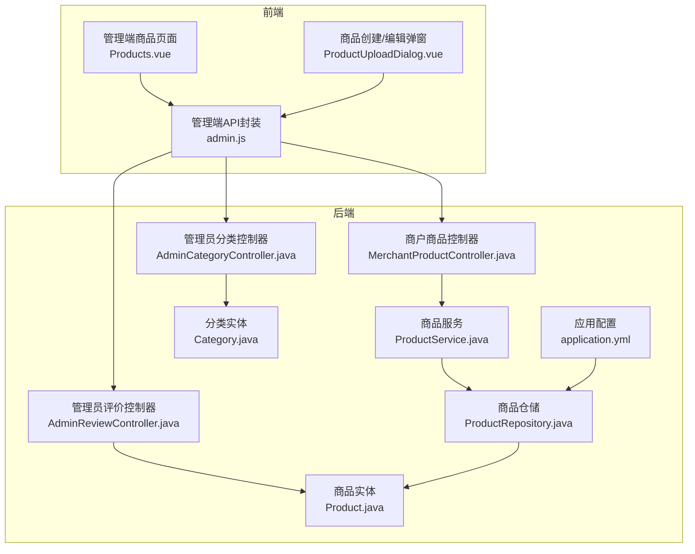
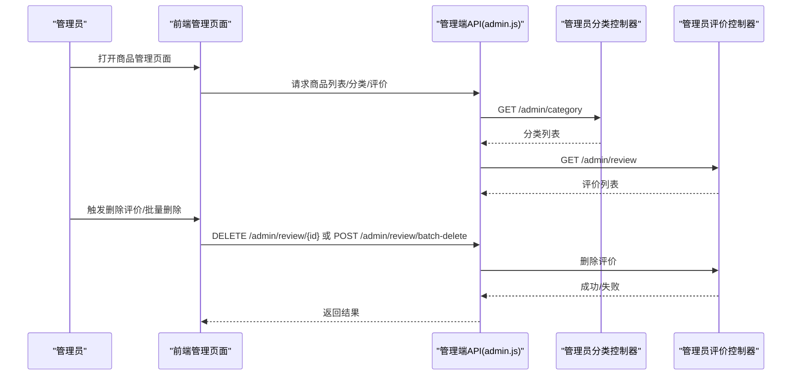
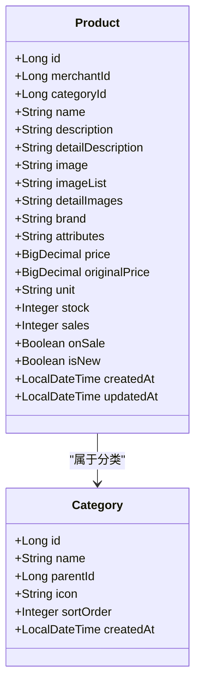
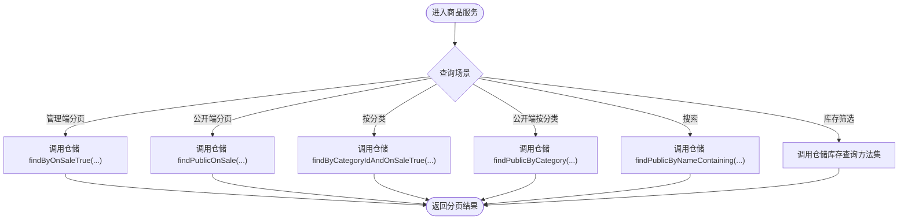
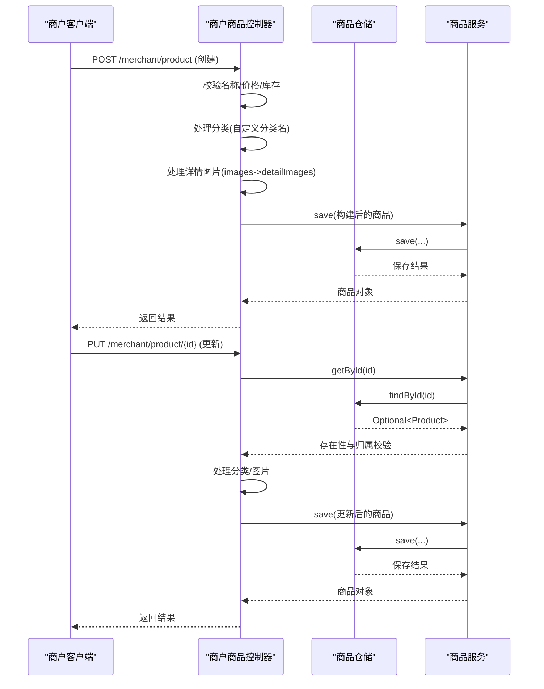
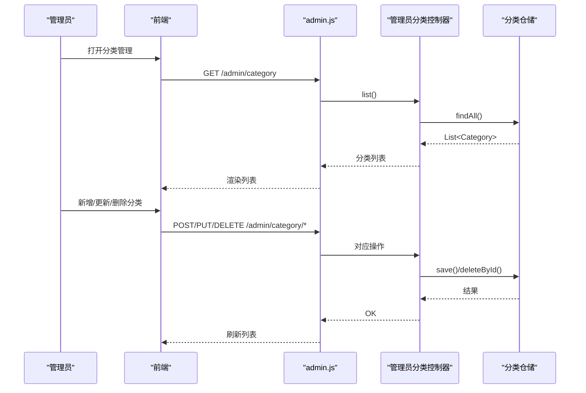
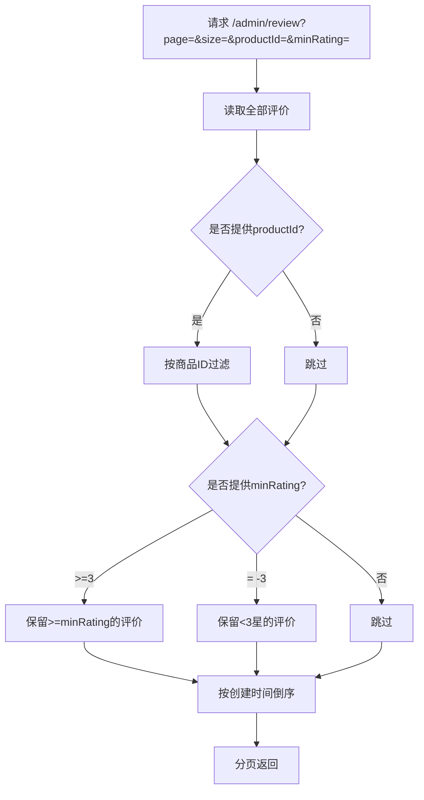
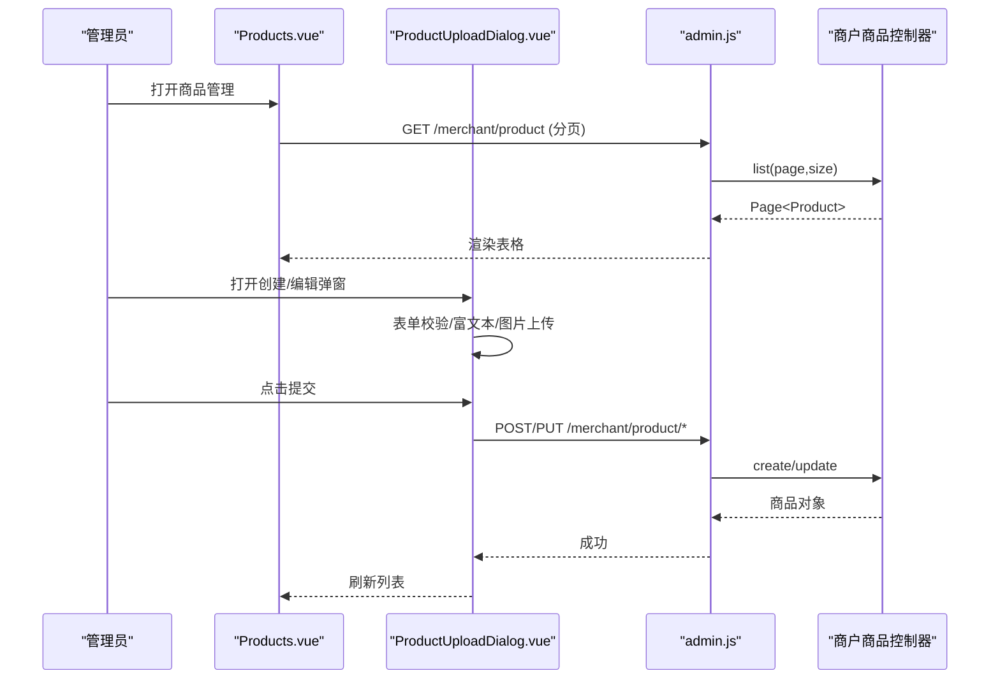
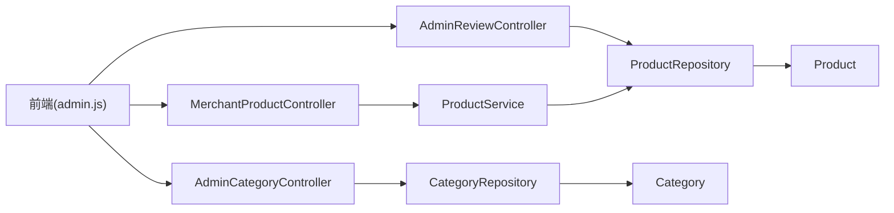

# 商品管理

<cite>
**本文引用的文件**
- [application.yml](file://backend/src/main/resources/application.yml)
- [Product.java](file://backend/src/main/java/com/mall/entity/Product.java)
- [Category.java](file://backend/src/main/java/com/mall/entity/Category.java)
- [ProductService.java](file://backend/src/main/java/com/mall/service/ProductService.java)
- [ProductRepository.java](file://backend/src/main/java/com/mall/repository/ProductRepository.java)
- [CategoryRepository.java](file://backend/src/main/java/com/mall/repository/CategoryRepository.java)
- [ProductCreateRequest.java](file://backend/src/main/java/com/mall/dto/ProductCreateRequest.java)
- [MerchantProductController.java](file://backend/src/main/java/com/mall/controller/merchant/MerchantProductController.java)
- [AdminCategoryController.java](file://backend/src/main/java/com/mall/controller/admin/AdminCategoryController.java)
- [AdminReviewController.java](file://backend/src/main/java/com/mall/controller/admin/AdminReviewController.java)
- [Products.vue](file://frontend/src/views/admin/Products.vue)
- [ProductUploadDialog.vue](file://frontend/src/components/merchant/ProductUploadDialog.vue)
- [admin.js](file://frontend/src/api/admin.js)
</cite>

## 目录
1. [引言](#引言)
2. [项目结构](#项目结构)
3. [核心组件](#核心组件)
4. [架构总览](#架构总览)
5. [详细组件分析](#详细组件分析)
6. [依赖分析](#依赖分析)
7. [性能考虑](#性能考虑)
8. [故障排查指南](#故障排查指南)
9. [结论](#结论)
10. [附录](#附录)

## 引言
本文件面向管理员与开发者，系统化梳理电商系统中的“商品管理”能力，覆盖商品审核、上下架、信息维护、分类管理、库存与价格控制、图片管理、搜索与筛选、以及批量操作等核心功能。文档以代码为依据，结合前后端交互路径，帮助开发者快速实现并扩展商品管理模块。

## 项目结构
后端采用 Spring Boot + JPA 的分层架构，前端使用 Vue + Element Plus 构建管理界面。商品管理涉及以下关键模块：
- 实体层：商品、分类、评价等实体定义
- 仓储层：JPA Repository 提供数据访问
- 服务层：业务逻辑封装（商品列表、库存查询、公开端过滤等）
- 控制器层：商户与管理员两类接口
- 前端视图与对话框：商品列表、创建/编辑弹窗、图片上传

图表来源
- [Products.vue:1-344](file://frontend/src/views/admin/Products.vue#L1-L344)
- [ProductUploadDialog.vue:1-920](file://frontend/src/components/merchant/ProductUploadDialog.vue#L1-L920)
- [admin.js:1-129](file://frontend/src/api/admin.js#L1-L129)
- [MerchantProductController.java:1-180](file://backend/src/main/java/com/mall/controller/merchant/MerchantProductController.java#L1-L180)
- [AdminCategoryController.java:1-47](file://backend/src/main/java/com/mall/controller/admin/AdminCategoryController.java#L1-L47)
- [AdminReviewController.java:1-92](file://backend/src/main/java/com/mall/controller/admin/AdminReviewController.java#L1-L92)
- [ProductService.java:1-126](file://backend/src/main/java/com/mall/service/ProductService.java#L1-L126)
- [ProductRepository.java:1-125](file://backend/src/main/java/com/mall/repository/ProductRepository.java#L1-L125)
- [Product.java:1-101](file://backend/src/main/java/com/mall/entity/Product.java#L1-L101)
- [Category.java:1-41](file://backend/src/main/java/com/mall/entity/Category.java#L1-L41)
- [application.yml:1-36](file://backend/src/main/resources/application.yml#L1-L36)

章节来源
- [application.yml:1-36](file://backend/src/main/resources/application.yml#L1-L36)

## 核心组件
- 商品实体（Product）：包含基础信息、价格、库存、上下架状态、新品标记、图片字段、创建/更新时间等
- 分类实体（Category）：支持树形结构（父级）、排序、图标、创建时间
- 商品服务（ProductService）：提供管理端与公开端的商品查询、分页、搜索、库存查询、销量与新品排行等
- 商品仓储（ProductRepository）：封装 JPA 查询，含公开端过滤（仅上架且商家启用）
- 商户商品控制器（MerchantProductController）：负责商品的创建、更新、删除，并支持按分类名自动创建分类、详情图片拼接
- 管理员分类控制器（AdminCategoryController）：提供分类的增删改查
- 管理员评价控制器（AdminReviewController）：提供评价的分页、过滤、删除与批量删除
- 前端管理页面（Products.vue）：展示商品列表、分页、操作按钮
- 前端商品弹窗（ProductUploadDialog.vue）：表单校验、图片上传、富文本编辑、提交

章节来源
- [Product.java:1-101](file://backend/src/main/java/com/mall/entity/Product.java#L1-L101)
- [Category.java:1-41](file://backend/src/main/java/com/mall/entity/Category.java#L1-L41)
- [ProductService.java:1-126](file://backend/src/main/java/com/mall/service/ProductService.java#L1-L126)
- [ProductRepository.java:1-125](file://backend/src/main/java/com/mall/repository/ProductRepository.java#L1-L125)
- [ProductCreateRequest.java:1-32](file://backend/src/main/java/com/mall/dto/ProductCreateRequest.java#L1-L32)
- [MerchantProductController.java:1-180](file://backend/src/main/java/com/mall/controller/merchant/MerchantProductController.java#L1-L180)
- [AdminCategoryController.java:1-47](file://backend/src/main/java/com/mall/controller/admin/AdminCategoryController.java#L1-L47)
- [AdminReviewController.java:1-92](file://backend/src/main/java/com/mall/controller/admin/AdminReviewController.java#L1-L92)
- [Products.vue:1-344](file://frontend/src/views/admin/Products.vue#L1-L344)
- [ProductUploadDialog.vue:1-920](file://frontend/src/components/merchant/ProductUploadDialog.vue#L1-L920)

## 架构总览
商品管理在系统中的定位与职责：
- 质量控制：通过公开端过滤（仅上架且商家启用）保障展示商品质量
- 合规审核：管理员可对评价进行审核与清理，间接影响商品信誉
- 市场调节：通过上下架、新品标记、销量排行等手段引导流量与销售

图表来源
- [Products.vue:1-344](file://frontend/src/views/admin/Products.vue#L1-L344)
- [admin.js:115-129](file://frontend/src/api/admin.js#L115-L129)
- [AdminCategoryController.java:1-47](file://backend/src/main/java/com/mall/controller/admin/AdminCategoryController.java#L1-L47)
- [AdminReviewController.java:1-92](file://backend/src/main/java/com/mall/controller/admin/AdminReviewController.java#L1-L92)

## 详细组件分析

### 商品实体与数据模型
- 字段要点：名称、描述、详情、主图、详情图集、品牌、属性、价格、原价、单位、库存、销量、上下架、新品标记、分类与商户关联、时间戳
- 关键约束：价格与库存校验、默认值设置、创建/更新时间自动填充
- 与公开端的关系：公开查询要求商品处于“上架且商家启用”的状态

图表来源
- [Product.java:1-101](file://backend/src/main/java/com/mall/entity/Product.java#L1-L101)
- [Category.java:1-41](file://backend/src/main/java/com/mall/entity/Category.java#L1-L41)

章节来源
- [Product.java:1-101](file://backend/src/main/java/com/mall/entity/Product.java#L1-L101)
- [Category.java:1-41](file://backend/src/main/java/com/mall/entity/Category.java#L1-L41)

### 商品服务与仓储
- 服务层职责：管理端与公开端的商品查询、分页、搜索、库存筛选、销量与新品排行
- 仓储层职责：封装 JPA 查询，含公开端过滤（仅上架且商家启用），库存相关查询方法
- 公开端查询：统一限制 onSale 为真，并要求商户 enabled 也为真

图表来源
- [ProductService.java:1-126](file://backend/src/main/java/com/mall/service/ProductService.java#L1-L126)
- [ProductRepository.java:1-125](file://backend/src/main/java/com/mall/repository/ProductRepository.java#L1-L125)

章节来源
- [ProductService.java:1-126](file://backend/src/main/java/com/mall/service/ProductService.java#L1-L126)
- [ProductRepository.java:1-125](file://backend/src/main/java/com/mall/repository/ProductRepository.java#L1-L125)

### 商户商品接口与创建/更新流程
- 登录态绑定：从认证信息中解析当前商户 ID，确保只能操作自身商品
- 创建流程：校验必填项与数值范围；若提供自定义分类名则自动创建或复用分类；将图片列表拼接为逗号分隔字符串写入 detailImages；构建商品并保存
- 更新流程：校验存在性与归属；同创建流程处理分类与图片；更新字段后保存
- 删除流程：校验存在性与归属后删除

图表来源
- [MerchantProductController.java:1-180](file://backend/src/main/java/com/mall/controller/merchant/MerchantProductController.java#L1-L180)
- [ProductService.java:1-126](file://backend/src/main/java/com/mall/service/ProductService.java#L1-L126)
- [ProductRepository.java:1-125](file://backend/src/main/java/com/mall/repository/ProductRepository.java#L1-L125)
- [ProductCreateRequest.java:1-32](file://backend/src/main/java/com/mall/dto/ProductCreateRequest.java#L1-L32)

章节来源
- [MerchantProductController.java:1-180](file://backend/src/main/java/com/mall/controller/merchant/MerchantProductController.java#L1-L180)
- [ProductCreateRequest.java:1-32](file://backend/src/main/java/com/mall/dto/ProductCreateRequest.java#L1-L32)

### 管理员分类管理
- 列表：GET /admin/category
- 新增：POST /admin/category
- 更新：PUT /admin/category/{id}
- 删除：DELETE /admin/category/{id}

图表来源
- [AdminCategoryController.java:1-47](file://backend/src/main/java/com/mall/controller/admin/AdminCategoryController.java#L1-L47)
- [CategoryRepository.java:1-17](file://backend/src/main/java/com/mall/repository/CategoryRepository.java#L1-L17)

章节来源
- [AdminCategoryController.java:1-47](file://backend/src/main/java/com/mall/controller/admin/AdminCategoryController.java#L1-L47)
- [CategoryRepository.java:1-17](file://backend/src/main/java/com/mall/repository/CategoryRepository.java#L1-L17)

### 管理员评价管理
- 分页与过滤：支持按商品 ID 与最低评分过滤，按创建时间倒序
- 删除：单条删除与批量删除

图表来源
- [AdminReviewController.java:1-92](file://backend/src/main/java/com/mall/controller/admin/AdminReviewController.java#L1-L92)

章节来源
- [AdminReviewController.java:1-92](file://backend/src/main/java/com/mall/controller/admin/AdminReviewController.java#L1-L92)

### 前端商品管理页面与表单
- 管理端商品页面：展示商品列表、价格、库存、上架状态、操作按钮（编辑/详情/删除）
- 商品创建/编辑弹窗：表单校验、富文本编辑器、主图与详情图上传、分类选择/自定义分类、价格与库存校验、上架与新品开关
- 图片上传：支持单图与多图上传，带进度提示

图表来源
- [Products.vue:1-344](file://frontend/src/views/admin/Products.vue#L1-L344)
- [ProductUploadDialog.vue:1-920](file://frontend/src/components/merchant/ProductUploadDialog.vue#L1-L920)
- [admin.js:1-129](file://frontend/src/api/admin.js#L1-L129)
- [MerchantProductController.java:1-180](file://backend/src/main/java/com/mall/controller/merchant/MerchantProductController.java#L1-L180)

章节来源
- [Products.vue:1-344](file://frontend/src/views/admin/Products.vue#L1-L344)
- [ProductUploadDialog.vue:1-920](file://frontend/src/components/merchant/ProductUploadDialog.vue#L1-L920)
- [admin.js:1-129](file://frontend/src/api/admin.js#L1-L129)

## 依赖分析
- 控制器依赖服务层，服务层依赖仓储层，仓储层依赖实体
- 公开端查询依赖商户启用状态，确保商品质量
- 前端通过 admin.js 封装管理端接口，分别调用分类与评价相关控制器

图表来源
- [admin.js:1-129](file://frontend/src/api/admin.js#L1-L129)
- [MerchantProductController.java:1-180](file://backend/src/main/java/com/mall/controller/merchant/MerchantProductController.java#L1-L180)
- [AdminCategoryController.java:1-47](file://backend/src/main/java/com/mall/controller/admin/AdminCategoryController.java#L1-L47)
- [AdminReviewController.java:1-92](file://backend/src/main/java/com/mall/controller/admin/AdminReviewController.java#L1-L92)
- [ProductService.java:1-126](file://backend/src/main/java/com/mall/service/ProductService.java#L1-L126)
- [ProductRepository.java:1-125](file://backend/src/main/java/com/mall/repository/ProductRepository.java#L1-L125)
- [CategoryRepository.java:1-17](file://backend/src/main/java/com/mall/repository/CategoryRepository.java#L1-L17)
- [Product.java:1-101](file://backend/src/main/java/com/mall/entity/Product.java#L1-L101)
- [Category.java:1-41](file://backend/src/main/java/com/mall/entity/Category.java#L1-L41)

章节来源
- [admin.js:1-129](file://frontend/src/api/admin.js#L1-L129)
- [MerchantProductController.java:1-180](file://backend/src/main/java/com/mall/controller/merchant/MerchantProductController.java#L1-L180)
- [AdminCategoryController.java:1-47](file://backend/src/main/java/com/mall/controller/admin/AdminCategoryController.java#L1-L47)
- [AdminReviewController.java:1-92](file://backend/src/main/java/com/mall/controller/admin/AdminReviewController.java#L1-L92)
- [ProductService.java:1-126](file://backend/src/main/java/com/mall/service/ProductService.java#L1-L126)
- [ProductRepository.java:1-125](file://backend/src/main/java/com/mall/repository/ProductRepository.java#L1-L125)
- [CategoryRepository.java:1-17](file://backend/src/main/java/com/mall/repository/CategoryRepository.java#L1-L17)
- [Product.java:1-101](file://backend/src/main/java/com/mall/entity/Product.java#L1-L101)
- [Category.java:1-41](file://backend/src/main/java/com/mall/entity/Category.java#L1-L41)

## 性能考虑
- 分页查询：优先使用 Pageable，避免一次性加载全量数据
- 公开端查询：通过 JPQL 在数据库层面过滤“上架且商家启用”，减少无效数据传输
- 库存查询：提供多种筛选组合（关键词+库存状态），建议前端传参时明确筛选条件
- 图片上传：前端支持多图并发上传与进度反馈，建议后端限制单次上传数量与大小

## 故障排查指南
- 商品不存在或无权限：商户控制器在查询与删除时会校验归属，返回相应错误
- 价格/库存非法：创建/更新时对价格与库存进行校验，前端表单也提供校验规则
- 评价删除失败：若评价不存在，删除接口会返回失败提示
- 分类操作异常：分类控制器提供标准 CRUD 接口，检查请求体与路径参数

章节来源
- [MerchantProductController.java:116-178](file://backend/src/main/java/com/mall/controller/merchant/MerchantProductController.java#L116-L178)
- [AdminReviewController.java:66-90](file://backend/src/main/java/com/mall/controller/admin/AdminReviewController.java#L66-L90)

## 结论
本商品管理方案以清晰的分层设计与严格的业务校验为基础，覆盖了从商品创建、维护到上下架、库存与价格控制、图片管理、分类与评价治理的完整闭环。通过公开端过滤与商户绑定，有效保障商品质量与合规性。开发者可基于现有控制器与服务快速扩展审核流程、批量操作与高级搜索功能。

## 附录

### API 定义与调用示例（路径与说明）
- 获取分类列表
  - 方法：GET
  - 路径：/admin/category
  - 说明：返回所有分类
- 新增分类
  - 方法：POST
  - 路径：/admin/category
  - 说明：创建新分类
- 更新分类
  - 方法：PUT
  - 路径：/admin/category/{id}
  - 说明：更新指定分类
- 删除分类
  - 方法：DELETE
  - 路径：/admin/category/{id}
  - 说明：删除指定分类
- 查询评价列表
  - 方法：GET
  - 路径：/admin/review
  - 参数：page、size、productId、minRating
  - 说明：支持按商品与最低评分过滤
- 删除单条评价
  - 方法：DELETE
  - 路径：/admin/review/{reviewId}
- 批量删除评价
  - 方法：POST
  - 路径：/admin/review/batch-delete
  - 说明：传入评价ID数组
- 商户商品列表
  - 方法：GET
  - 路径：/merchant/product
  - 参数：page、size
- 商户商品详情
  - 方法：GET
  - 路径：/merchant/product/{id}
- 商户创建商品
  - 方法：POST
  - 路径：/merchant/product
  - 说明：支持自定义分类名与图片列表
- 商户更新商品
  - 方法：PUT
  - 路径：/merchant/product/{id}
- 商户删除商品
  - 方法：DELETE
  - 路径：/merchant/product/{id}

章节来源
- [AdminCategoryController.java:1-47](file://backend/src/main/java/com/mall/controller/admin/AdminCategoryController.java#L1-L47)
- [AdminReviewController.java:1-92](file://backend/src/main/java/com/mall/controller/admin/AdminReviewController.java#L1-L92)
- [MerchantProductController.java:1-180](file://backend/src/main/java/com/mall/controller/merchant/MerchantProductController.java#L1-L180)
- [admin.js:1-129](file://frontend/src/api/admin.js#L1-L129)