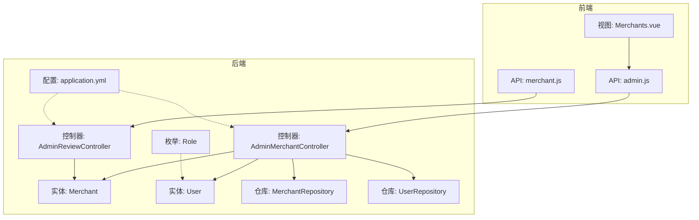
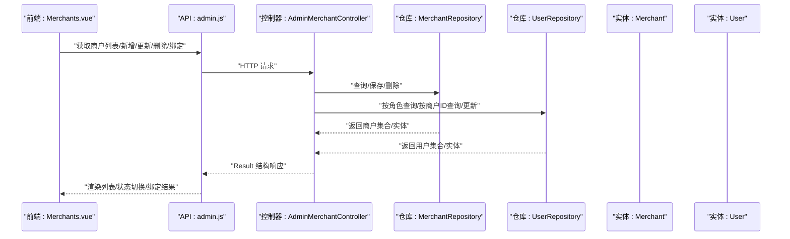
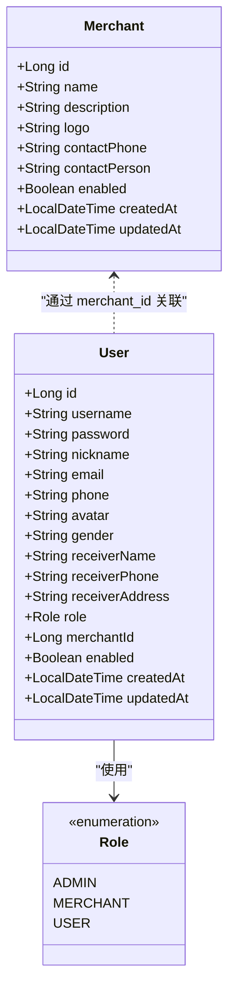
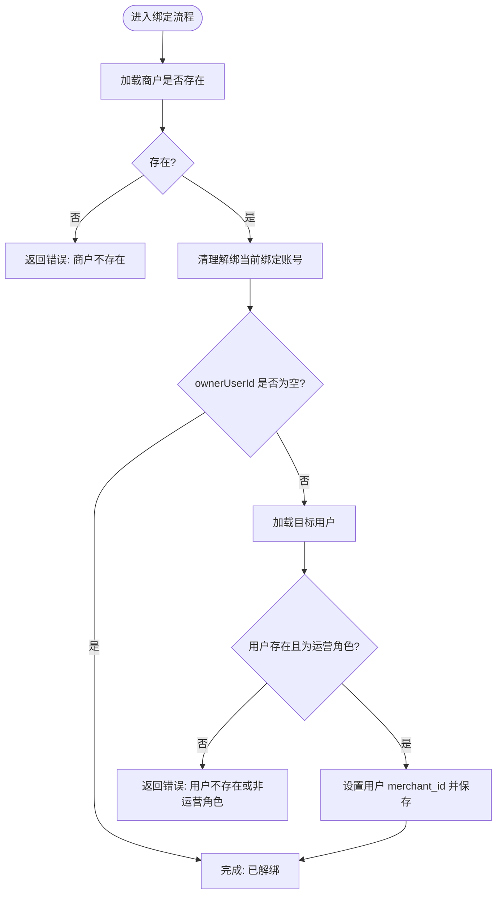
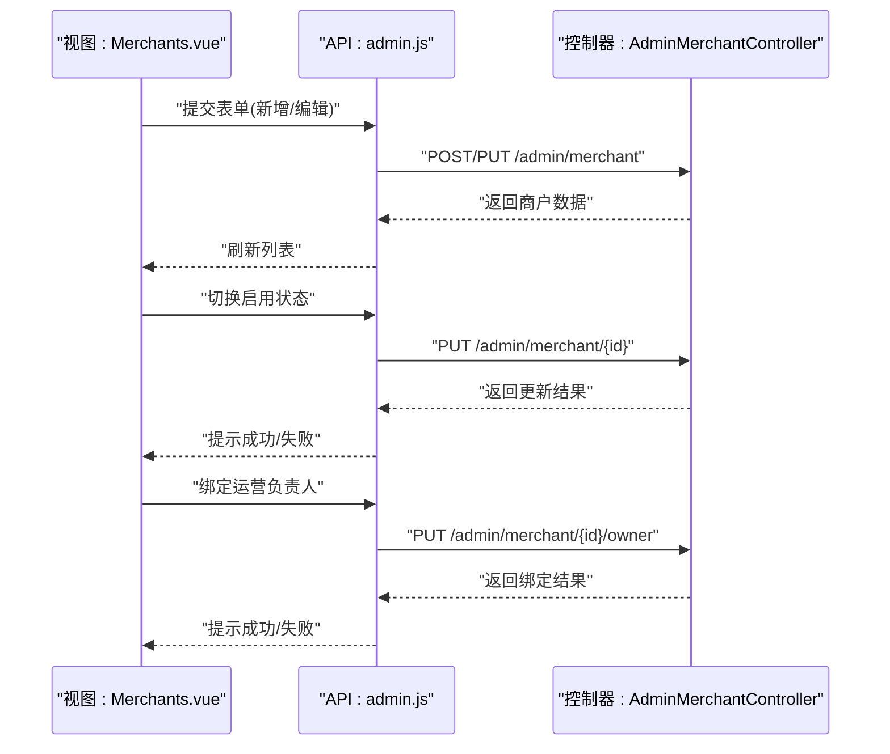
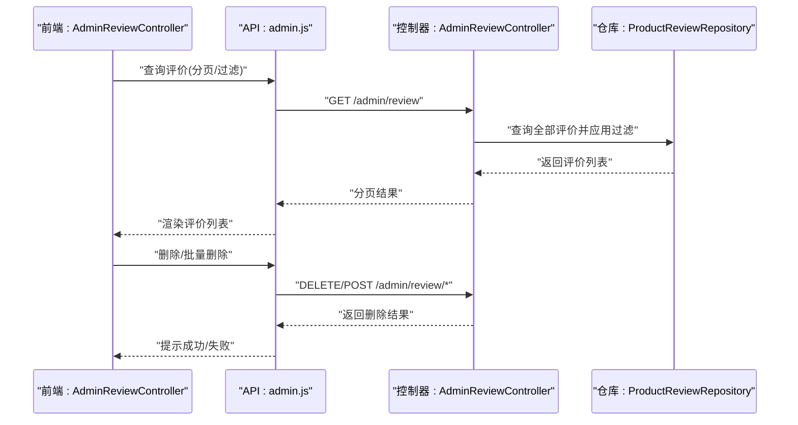
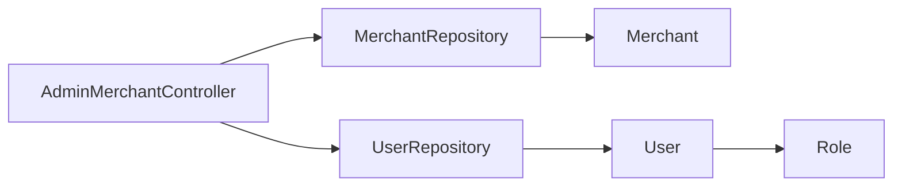

# 商户管理

<cite>
**本文引用的文件**
- [AdminMerchantController.java](file://backend/src/main/java/com/mall/controller/admin/AdminMerchantController.java)
- [Merchant.java](file://backend/src/main/java/com/mall/entity/Merchant.java)
- [MerchantRepository.java](file://backend/src/main/java/com/mall/repository/MerchantRepository.java)
- [User.java](file://backend/src/main/java/com/mall/entity/User.java)
- [UserRepository.java](file://backend/src/main/java/com/mall/repository/UserRepository.java)
- [Role.java](file://backend/src/main/java/com/mall/common/Role.java)
- [Merchants.vue](file://frontend/src/views/admin/Merchants.vue)
- [admin.js](file://frontend/src/api/admin.js)
- [application.yml](file://backend/src/main/resources/application.yml)
- [AdminReviewController.java](file://backend/src/main/java/com/mall/controller/admin/AdminReviewController.java)
- [merchant.js](file://frontend/src/api/merchant.js)
</cite>

## 目录
1. [简介](#简介)
2. [项目结构](#项目结构)
3. [核心组件](#核心组件)
4. [架构总览](#架构总览)
5. [详细组件分析](#详细组件分析)
6. [依赖分析](#依赖分析)
7. [性能考虑](#性能考虑)
8. [故障排查指南](#故障排查指南)
9. [结论](#结论)
10. [附录](#附录)

## 简介
本文件面向B2B电商系统中的“商户管理”模块，围绕管理员视角下的商户审核、信息管理、状态控制、商户与运营账号绑定等核心能力进行系统化说明。文档同时覆盖前端界面、后端控制器与实体模型之间的交互关系，并给出API调用示例、状态变更规则、以及在平台治理、风险控制与服务保障方面的价值定位。需要特别说明的是：当前代码库中未包含独立的“商户服务层”（如 MerchantService），因此商户相关业务逻辑集中在控制器中；后续建议引入服务层以提升可维护性与可测试性。

## 项目结构
- 后端采用Spring Boot + JPA，数据库连接与JPA配置位于应用配置文件中。
- 前端使用Vue + Element UI，通过统一请求封装调用后端REST接口。
- 商户管理涉及的后端控制器、实体与仓库位于后端工程；前端视图与API封装位于前端工程。

**图表来源**
- [application.yml:1-36](file://backend/src/main/resources/application.yml#L1-L36)
- [AdminMerchantController.java:1-122](file://backend/src/main/java/com/mall/controller/admin/AdminMerchantController.java#L1-L122)
- [AdminReviewController.java:1-92](file://backend/src/main/java/com/mall/controller/admin/AdminReviewController.java#L1-L92)
- [Merchant.java:1-56](file://backend/src/main/java/com/mall/entity/Merchant.java#L1-L56)
- [User.java:1-88](file://backend/src/main/java/com/mall/entity/User.java#L1-L88)
- [MerchantRepository.java:1-9](file://backend/src/main/java/com/mall/repository/MerchantRepository.java#L1-L9)
- [UserRepository.java:1-20](file://backend/src/main/java/com/mall/repository/UserRepository.java#L1-L20)
- [Role.java:1-8](file://backend/src/main/java/com/mall/common/Role.java#L1-L8)
- [Merchants.vue:1-199](file://frontend/src/views/admin/Merchants.vue#L1-L199)
- [admin.js:1-129](file://frontend/src/api/admin.js#L1-L129)
- [merchant.js:1-129](file://frontend/src/api/merchant.js#L1-L129)

**章节来源**
- [application.yml:1-36](file://backend/src/main/resources/application.yml#L1-L36)
- [Merchants.vue:1-199](file://frontend/src/views/admin/Merchants.vue#L1-L199)
- [admin.js:1-129](file://frontend/src/api/admin.js#L1-L129)

## 核心组件
- 管理端商户控制器：提供商户列表、新增、更新、删除、绑定/解绑运营负责人等能力。
- 实体与仓库：商户实体与用户实体，分别对应商户表与用户表；仓库负责数据访问。
- 角色枚举：定义管理员、运营、普通用户三类角色，用于权限与绑定校验。
- 前端视图与API：提供商户列表展示、开关启用状态、弹窗新增/编辑、删除、绑定运营负责人等交互。

**章节来源**
- [AdminMerchantController.java:26-120](file://backend/src/main/java/com/mall/controller/admin/AdminMerchantController.java#L26-L120)
- [Merchant.java:15-55](file://backend/src/main/java/com/mall/entity/Merchant.java#L15-L55)
- [User.java:17-87](file://backend/src/main/java/com/mall/entity/User.java#L17-L87)
- [MerchantRepository.java:1-9](file://backend/src/main/java/com/mall/repository/MerchantRepository.java#L1-L9)
- [UserRepository.java:10-19](file://backend/src/main/java/com/mall/repository/UserRepository.java#L10-L19)
- [Role.java:3-7](file://backend/src/main/java/com/mall/common/Role.java#L3-L7)
- [Merchants.vue:12-199](file://frontend/src/views/admin/Merchants.vue#L12-L199)
- [admin.js:33-56](file://frontend/src/api/admin.js#L33-L56)

## 架构总览
下图展示了管理员商户管理的端到端交互：前端通过admin.js调用后端AdminMerchantController，控制器读写Merchant与User实体及对应的仓库；同时，前端也可通过merchant.js调用运营侧评价管理接口，管理员侧则通过AdminReviewController进行全局评价治理。

**图表来源**
- [Merchants.vue:115-195](file://frontend/src/views/admin/Merchants.vue#L115-L195)
- [admin.js:33-56](file://frontend/src/api/admin.js#L33-L56)
- [AdminMerchantController.java:26-120](file://backend/src/main/java/com/mall/controller/admin/AdminMerchantController.java#L26-L120)
- [MerchantRepository.java:1-9](file://backend/src/main/java/com/mall/repository/MerchantRepository.java#L1-L9)
- [UserRepository.java:10-19](file://backend/src/main/java/com/mall/repository/UserRepository.java#L10-L19)

## 详细组件分析

### 数据模型与状态
- 商户实体字段：标识、名称、描述、Logo、联系电话、联系人、启用状态、创建/更新时间。
- 用户实体字段：标识、用户名、密码、昵称、邮箱、电话、头像、性别、收货信息、角色、关联商户ID、启用状态、创建/更新时间。
- 角色枚举：ADMIN、MERCHANT、USER，用于区分不同用户身份与权限边界。
- 状态控制：商户启用/禁用由enabled布尔值控制，默认启用。

**图表来源**
- [Merchant.java:15-55](file://backend/src/main/java/com/mall/entity/Merchant.java#L15-L55)
- [User.java:17-87](file://backend/src/main/java/com/mall/entity/User.java#L17-L87)
- [Role.java:3-7](file://backend/src/main/java/com/mall/common/Role.java#L3-L7)

**章节来源**
- [Merchant.java:15-55](file://backend/src/main/java/com/mall/entity/Merchant.java#L15-L55)
- [User.java:17-87](file://backend/src/main/java/com/mall/entity/User.java#L17-L87)
- [Role.java:3-7](file://backend/src/main/java/com/mall/common/Role.java#L3-L7)

### 控制器与业务流程
- 列表与详情：支持分页/筛选（前端传参）、返回商户基础信息与所属运营负责人信息。
- 新增/更新：对商户信息进行持久化，更新时保持ID一致。
- 删除：直接按ID删除商户。
- 绑定/解绑运营负责人：先清理当前商户已绑定的运营账号，再校验目标用户是否为运营角色并绑定。

**图表来源**
- [AdminMerchantController.java:76-105](file://backend/src/main/java/com/mall/controller/admin/AdminMerchantController.java#L76-L105)
- [UserRepository.java:16-18](file://backend/src/main/java/com/mall/repository/UserRepository.java#L16-L18)
- [Role.java:3-7](file://backend/src/main/java/com/mall/common/Role.java#L3-L7)

**章节来源**
- [AdminMerchantController.java:26-120](file://backend/src/main/java/com/mall/controller/admin/AdminMerchantController.java#L26-L120)

### 前端交互与API调用
- 列表展示：拉取商户列表，显示名称、所属用户、描述、启用状态等。
- 启用/禁用：通过更新商户接口切换enabled状态。
- 新增/编辑：弹窗收集名称、描述、启用状态、所属用户等，提交后调用新增/更新接口，并联动绑定运营负责人。
- 删除：二次确认后调用删除接口。
- API映射：前端admin.js封装了商户管理相关REST接口，与后端控制器路径一一对应。

**图表来源**
- [Merchants.vue:115-195](file://frontend/src/views/admin/Merchants.vue#L115-L195)
- [admin.js:33-56](file://frontend/src/api/admin.js#L33-L56)
- [AdminMerchantController.java:26-120](file://backend/src/main/java/com/mall/controller/admin/AdminMerchantController.java#L26-L120)

**章节来源**
- [Merchants.vue:12-199](file://frontend/src/views/admin/Merchants.vue#L12-L199)
- [admin.js:33-56](file://frontend/src/api/admin.js#L33-L56)

### 评价治理与风控联动
- 管理员可分页查看全站评价，支持按商品ID与最低评分过滤，支持删除与批量删除。
- 该能力可用于识别高风险商户或异常评价，辅助平台风控策略落地。

**图表来源**
- [AdminReviewController.java:24-90](file://backend/src/main/java/com/mall/controller/admin/AdminReviewController.java#L24-L90)
- [admin.js:115-129](file://frontend/src/api/admin.js#L115-L129)

**章节来源**
- [AdminReviewController.java:24-90](file://backend/src/main/java/com/mall/controller/admin/AdminReviewController.java#L24-L90)

## 依赖分析
- 控制器依赖：AdminMerchantController依赖MerchantRepository与UserRepository，用于商户与用户的CRUD与关联查询。
- 实体依赖：User实体中merchantId字段与Merchant实体形成一对多关联（一个商户可有多个运营账号，但当前绑定逻辑保证唯一）。
- 配置依赖：application.yml提供数据库连接、JPA方言与端口等运行参数，影响实体映射与连接池行为。

**图表来源**
- [AdminMerchantController.java:23-24](file://backend/src/main/java/com/mall/controller/admin/AdminMerchantController.java#L23-L24)
- [MerchantRepository.java:1-9](file://backend/src/main/java/com/mall/repository/MerchantRepository.java#L1-L9)
- [UserRepository.java:10-19](file://backend/src/main/java/com/mall/repository/UserRepository.java#L10-L19)
- [Merchant.java:15-55](file://backend/src/main/java/com/mall/entity/Merchant.java#L15-L55)
- [User.java:17-87](file://backend/src/main/java/com/mall/entity/User.java#L17-L87)
- [Role.java:3-7](file://backend/src/main/java/com/mall/common/Role.java#L3-L7)

**章节来源**
- [AdminMerchantController.java:23-24](file://backend/src/main/java/com/mall/controller/admin/AdminMerchantController.java#L23-L24)
- [application.yml:1-36](file://backend/src/main/resources/application.yml#L1-L36)

## 性能考虑
- 列表查询：当前控制器对商户列表采取全量查询并组装返回，若数据规模较大，建议引入分页与索引优化。
- 绑定流程：绑定前会清理解绑当前绑定账号，再进行新绑定，避免重复绑定；建议在事务中执行以保证一致性。
- 评价治理：AdminReviewController对全量评价进行内存过滤，建议结合数据库层面的分页与条件查询，减少内存压力。

[本节为通用性能建议，不直接分析具体文件]

## 故障排查指南
- 商户不存在：绑定运营负责人时若商户ID无效，控制器返回错误提示。
- 用户不存在或非运营角色：绑定时若目标用户不存在或角色不为运营，控制器返回错误提示。
- 启用状态切换失败：前端切换enabled后若后端返回失败，页面会回滚开关并提示错误。
- 删除失败：前端二次确认后删除，若后端返回失败，页面提示错误。

**章节来源**
- [AdminMerchantController.java:78-104](file://backend/src/main/java/com/mall/controller/admin/AdminMerchantController.java#L78-L104)
- [Merchants.vue:140-148](file://frontend/src/views/admin/Merchants.vue#L140-L148)
- [Merchants.vue:182-194](file://frontend/src/views/admin/Merchants.vue#L182-L194)

## 结论
当前系统在管理员维度提供了完整的商户信息管理与运营负责人绑定能力，配合前端交互实现了可视化治理。建议后续引入服务层以分离业务逻辑，增强可测试性与扩展性；同时在商户审核、资质验证、保证金与违规处理等方面补充独立的领域模型与流程控制器，以支撑更完善的B2B平台商户治理体系。

[本节为总结性内容，不直接分析具体文件]

## 附录

### API调用示例（基于现有接口）
- 获取商户列表
  - 方法与路径：GET /admin/merchant
  - 返回：Result结构，data为商户数组，包含所属运营负责人信息
- 新增商户
  - 方法与路径：POST /admin/merchant
  - 请求体：商户对象（不含ID）
  - 返回：Result结构，data为新增商户
- 更新商户
  - 方法与路径：PUT /admin/merchant/{id}
  - 请求体：商户对象（含ID）
  - 返回：Result结构，data为更新后的商户
- 删除商户
  - 方法与路径：DELETE /admin/merchant/{id}
  - 返回：Result结构
- 绑定/解绑运营负责人
  - 方法与路径：PUT /admin/merchant/{id}/owner
  - 请求体：{ ownerUserId: number | null }
  - 返回：Result结构
- 获取运营负责人列表（按角色筛选）
  - 方法与路径：GET /admin/user?role=MERCHNAT
  - 返回：Result结构，data为运营用户数组

**章节来源**
- [admin.js:33-56](file://frontend/src/api/admin.js#L33-L56)
- [AdminMerchantController.java:26-120](file://backend/src/main/java/com/mall/controller/admin/AdminMerchantController.java#L26-L120)

### 审核流程与状态变更规则（基于现有能力）
- 审核入口：管理员在商户列表中查看并切换enabled状态，实现“启用/禁用”的即时治理。
- 绑定规则：一次只能绑定一个运营负责人；绑定前自动解绑当前绑定账号。
- 与评价治理联动：管理员可通过评价管理接口识别异常商户并采取限制措施。

**章节来源**
- [AdminMerchantController.java:76-105](file://backend/src/main/java/com/mall/controller/admin/AdminMerchantController.java#L76-L105)
- [AdminReviewController.java:24-90](file://backend/src/main/java/com/mall/controller/admin/AdminReviewController.java#L24-L90)

### 平台治理与风险控制要点
- 平台治理：通过商户启用/禁用与运营负责人绑定，实现对商户主体的快速治理。
- 风险控制：结合评价治理能力，识别低分评价与异常评论，辅助风控策略落地。
- 服务质量保障：通过运营负责人绑定与商户信息管理，确保责任主体清晰，便于问题追溯与处理。

[本节为概念性说明，不直接分析具体文件]