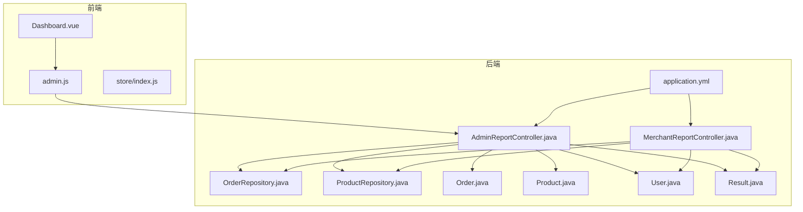
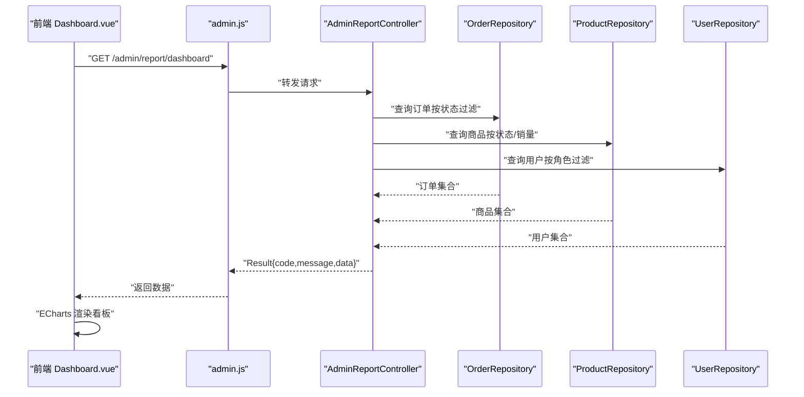
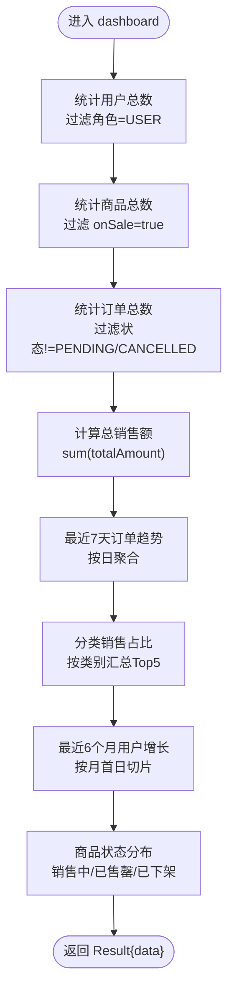
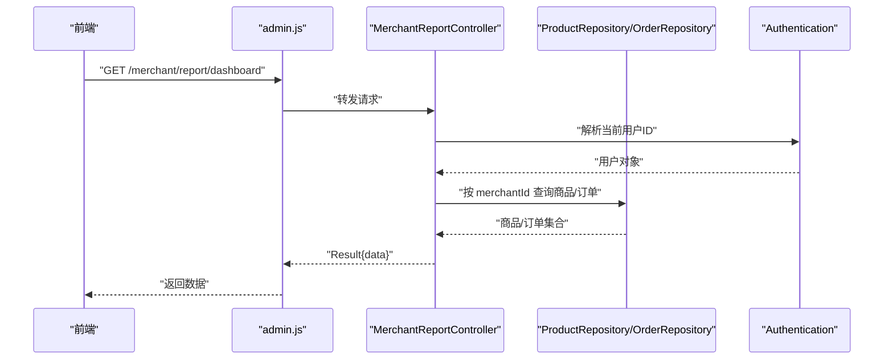
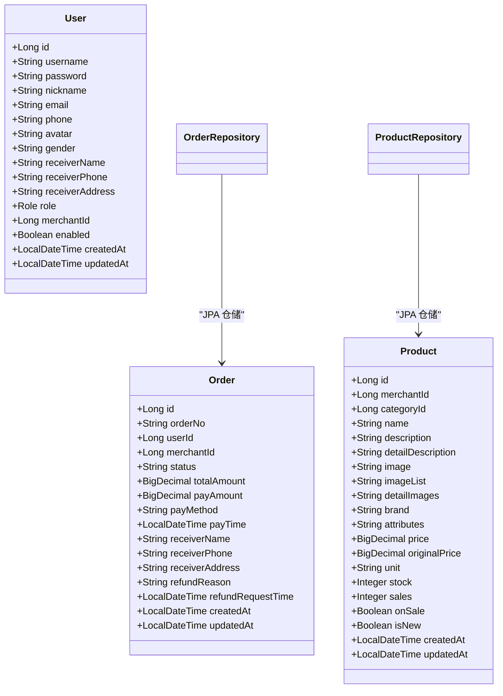
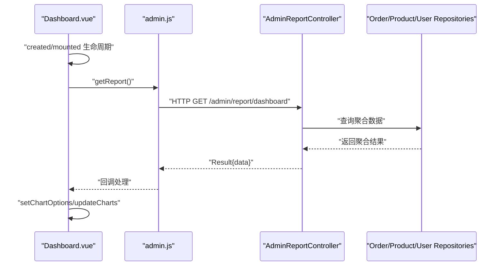
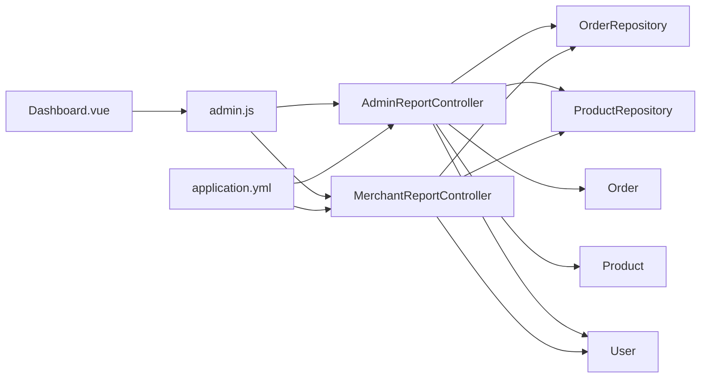

# 报表统计

<cite>
**本文引用的文件**
- [AdminReportController.java](file://backend/src/main/java/com/mall/controller/admin/AdminReportController.java)
- [MerchantReportController.java](file://backend/src/main/java/com/mall/controller/merchant/MerchantReportController.java)
- [Order.java](file://backend/src/main/java/com/mall/entity/Order.java)
- [Product.java](file://backend/src/main/java/com/mall/entity/Product.java)
- [User.java](file://backend/src/main/java/com/mall/entity/User.java)
- [OrderRepository.java](file://backend/src/main/java/com/mall/repository/OrderRepository.java)
- [ProductRepository.java](file://backend/src/main/java/com/mall/repository/ProductRepository.java)
- [Result.java](file://backend/src/main/java/com/mall/dto/Result.java)
- [application.yml](file://backend/src/main/resources/application.yml)
- [Dashboard.vue](file://frontend/src/views/admin/Dashboard.vue)
- [admin.js](file://frontend/src/api/admin.js)
- [index.js](file://frontend/src/store/index.js)
</cite>

## 目录
1. [引言](#引言)
2. [项目结构](#项目结构)
3. [核心组件](#核心组件)
4. [架构总览](#架构总览)
5. [详细组件分析](#详细组件分析)
6. [依赖分析](#依赖分析)
7. [性能考虑](#性能考虑)
8. [故障排查指南](#故障排查指南)
9. [结论](#结论)
10. [附录](#附录)

## 引言
本文件面向管理员报表统计功能，围绕销售报表、用户统计、商品分析、财务报表等核心统计维度，系统阐述数据聚合算法、报表生成机制、图表展示、数据导出建议、统计维度设计、时间范围选择、数据准确性保证与性能优化策略。文档同时给出前后端对接的 API 调用示例、报表模板与数据可视化方案，帮助开发者快速实现灵活高效的报表统计系统，并支撑商业决策中的经营分析、趋势预测与资源配置。

## 项目结构
后端采用 Spring Boot + JPA 的分层架构，报表统计由控制器负责聚合业务数据并返回统一结果包装；前端使用 ECharts 展示看板图表。关键目录与文件如下：
- 后端
  - 控制器：AdminReportController（管理端看板）、MerchantReportController（商家看板）
  - 实体：Order（订单）、Product（商品）、User（用户）
  - 仓储：OrderRepository、ProductRepository
  - DTO：Result（统一响应包装）
  - 配置：application.yml（数据库、JPA、服务器端口等）
- 前端
  - 视图：Dashboard.vue（管理端看板页面）
  - API：admin.js（管理端报表请求封装）
  - 状态：store/index.js（用户登录态）

**图表来源**
- [AdminReportController.java:1-176](file://backend/src/main/java/com/mall/controller/admin/AdminReportController.java#L1-L176)
- [MerchantReportController.java:1-81](file://backend/src/main/java/com/mall/controller/merchant/MerchantReportController.java#L1-L81)
- [OrderRepository.java:1-28](file://backend/src/main/java/com/mall/repository/OrderRepository.java#L1-L28)
- [ProductRepository.java:1-125](file://backend/src/main/java/com/mall/repository/ProductRepository.java#L1-L125)
- [Order.java:1-83](file://backend/src/main/java/com/mall/entity/Order.java#L1-L83)
- [Product.java:1-101](file://backend/src/main/java/com/mall/entity/Product.java#L1-L101)
- [User.java:1-88](file://backend/src/main/java/com/mall/entity/User.java#L1-L88)
- [Result.java:1-24](file://backend/src/main/java/com/mall/dto/Result.java#L1-L24)
- [application.yml:1-36](file://backend/src/main/resources/application.yml#L1-L36)
- [Dashboard.vue:1-786](file://frontend/src/views/admin/Dashboard.vue#L1-L786)
- [admin.js:1-129](file://frontend/src/api/admin.js#L1-L129)
- [index.js:1-31](file://frontend/src/store/index.js#L1-L31)

**章节来源**
- [AdminReportController.java:1-176](file://backend/src/main/java/com/mall/controller/admin/AdminReportController.java#L1-L176)
- [MerchantReportController.java:1-81](file://backend/src/main/java/com/mall/controller/merchant/MerchantReportController.java#L1-L81)
- [OrderRepository.java:1-28](file://backend/src/main/java/com/mall/repository/OrderRepository.java#L1-L28)
- [ProductRepository.java:1-125](file://backend/src/main/java/com/mall/repository/ProductRepository.java#L1-L125)
- [Order.java:1-83](file://backend/src/main/java/com/mall/entity/Order.java#L1-L83)
- [Product.java:1-101](file://backend/src/main/java/com/mall/entity/Product.java#L1-L101)
- [User.java:1-88](file://backend/src/main/java/com/mall/entity/User.java#L1-L88)
- [Result.java:1-24](file://backend/src/main/java/com/mall/dto/Result.java#L1-L24)
- [application.yml:1-36](file://backend/src/main/resources/application.yml#L1-L36)
- [Dashboard.vue:1-786](file://frontend/src/views/admin/Dashboard.vue#L1-L786)
- [admin.js:1-129](file://frontend/src/api/admin.js#L1-L129)
- [index.js:1-31](file://frontend/src/store/index.js#L1-L31)

## 核心组件
- 管理端看板控制器：聚合用户数、商品数、订单数、总销售额、最近7天订单趋势、分类销售占比、最近6个月用户增长、商品状态分布。
- 商家看板控制器：按登录商家聚合商品数、订单数、Top 商品销量扇形图（Top10 合并“其他”）。
- 数据模型：Order（订单状态、金额、时间）、Product（销量、上下架、库存）、User（角色、商家绑定）。
- 统一响应：Result 包装 code、message、data，便于前后端一致处理。
- 前端看板：Dashboard.vue 使用 ECharts 渲染指标卡片与多维图表，admin.js 封装 /admin/report/dashboard 请求。

**章节来源**
- [AdminReportController.java:34-77](file://backend/src/main/java/com/mall/controller/admin/AdminReportController.java#L34-L77)
- [MerchantReportController.java:42-79](file://backend/src/main/java/com/mall/controller/merchant/MerchantReportController.java#L42-L79)
- [Order.java:31-45](file://backend/src/main/java/com/mall/entity/Order.java#L31-L45)
- [Product.java:72-78](file://backend/src/main/java/com/mall/entity/Product.java#L72-L78)
- [User.java:56-65](file://backend/src/main/java/com/mall/entity/User.java#L56-L65)
- [Result.java:10-23](file://backend/src/main/java/com/mall/dto/Result.java#L10-L23)
- [Dashboard.vue:148-526](file://frontend/src/views/admin/Dashboard.vue#L148-L526)
- [admin.js:9-11](file://frontend/src/api/admin.js#L9-L11)

## 架构总览
管理端报表统计的端到端流程如下：
- 前端 Dashboard.vue 在生命周期内调用 admin.js 的 getReport 接口。
- 后端 AdminReportController.dashboard 聚合数据，返回 Result 包裹的 Map。
- 前端接收数据后，构建 ECharts 选项并渲染图表。

**图表来源**
- [Dashboard.vue:182-193](file://frontend/src/views/admin/Dashboard.vue#L182-L193)
- [admin.js:9-11](file://frontend/src/api/admin.js#L9-L11)
- [AdminReportController.java:34-77](file://backend/src/main/java/com/mall/controller/admin/AdminReportController.java#L34-L77)
- [OrderRepository.java:13-27](file://backend/src/main/java/com/mall/repository/OrderRepository.java#L13-L27)
- [ProductRepository.java:12-125](file://backend/src/main/java/com/mall/repository/ProductRepository.java#L12-L125)

## 详细组件分析

### 管理端看板（AdminReportController）
- 指标聚合
  - 用户总数：仅统计普通用户（角色 USER）。
  - 商品总数：仅统计 onSale=true 的商品。
  - 订单总数：排除 PENDING、CANCELLED 状态的订单。
  - 总销售额：对已支付及以上状态订单的 totalAmount 求和并保留两位小数。
  - 最近7天订单趋势：按自然日聚合，过滤无效状态。
  - 分类销售占比：基于商品的 sales 字段进行分类汇总，取前五名，名称为占位映射。
  - 最近6个月用户增长：按月首日切片统计累计用户数。
  - 商品状态分布：销售中（onSale=true, stock>0）、已售罄（onSale=true, stock=0）、已下架（onSale=false）。
- 数据准确性与边界
  - 状态过滤避免将待支付、已取消订单计入交易额与订单数。
  - 时间切片使用 LocalDate/LocalDateTime，注意时区配置（application.yml 中 serverTimezone）。
  - 销售额与数量计算使用流式聚合，注意空值保护与精度处理。
- 可扩展点
  - 分类销售占比可改为从 Category 实体获取真实名称。
  - 用户增长可支持按周/季度统计。
  - 商品状态分布可增加“补货预警”等维度。

**图表来源**
- [AdminReportController.java:34-77](file://backend/src/main/java/com/mall/controller/admin/AdminReportController.java#L34-L77)
- [AdminReportController.java:79-147](file://backend/src/main/java/com/mall/controller/admin/AdminReportController.java#L79-L147)
- [AdminReportController.java:149-174](file://backend/src/main/java/com/mall/controller/admin/AdminReportController.java#L149-L174)

**章节来源**
- [AdminReportController.java:34-77](file://backend/src/main/java/com/mall/controller/admin/AdminReportController.java#L34-L77)
- [AdminReportController.java:79-147](file://backend/src/main/java/com/mall/controller/admin/AdminReportController.java#L79-L147)
- [AdminReportController.java:149-174](file://backend/src/main/java/com/mall/controller/admin/AdminReportController.java#L149-L174)
- [Order.java:31-45](file://backend/src/main/java/com/mall/entity/Order.java#L31-L45)
- [Product.java:72-78](file://backend/src/main/java/com/mall/entity/Product.java#L72-L78)
- [User.java:56-65](file://backend/src/main/java/com/mall/entity/User.java#L56-L65)

### 商家看板（MerchantReportController）
- 指标聚合
  - 从 Authentication 中解析当前登录用户，读取其 merchantId。
  - 商品数：按 merchantId 查询商品总数。
  - 订单数：按 merchantId 查询订单总数。
  - 商品销量扇形图：按销量降序取前若干名，其余合并为“其他”，默认 Top10。
- 安全性
  - 非商家账号会抛出异常，确保权限隔离。
- 可扩展点
  - 支持按时间范围筛选（如近30天）。
  - 增加“缺货预警”或“滞销商品”维度。

**图表来源**
- [MerchantReportController.java:33-79](file://backend/src/main/java/com/mall/controller/merchant/MerchantReportController.java#L33-L79)
- [ProductRepository.java:14-21](file://backend/src/main/java/com/mall/repository/ProductRepository.java#L14-L21)
- [OrderRepository.java:19-21](file://backend/src/main/java/com/mall/repository/OrderRepository.java#L19-L21)

**章节来源**
- [MerchantReportController.java:33-79](file://backend/src/main/java/com/mall/controller/merchant/MerchantReportController.java#L33-L79)
- [ProductRepository.java:14-21](file://backend/src/main/java/com/mall/repository/ProductRepository.java#L14-L21)
- [OrderRepository.java:19-21](file://backend/src/main/java/com/mall/repository/OrderRepository.java#L19-L21)

### 数据模型与仓储
- Order：包含状态、金额、支付时间、创建时间等字段，是销售报表与财务报表的核心来源。
- Product：包含销量、上下架、库存、分类等，是商品分析与库存预警的基础。
- User：包含角色与商家绑定，用于区分普通用户与商家用户。
- 仓储接口：提供按用户/商家维度的分页查询、按状态过滤、按销量/创建时间排序等方法，支撑报表聚合。

**图表来源**
- [Order.java:16-82](file://backend/src/main/java/com/mall/entity/Order.java#L16-L82)
- [Product.java:16-100](file://backend/src/main/java/com/mall/entity/Product.java#L16-L100)
- [User.java:17-87](file://backend/src/main/java/com/mall/entity/User.java#L17-L87)
- [OrderRepository.java:13-27](file://backend/src/main/java/com/mall/repository/OrderRepository.java#L13-L27)
- [ProductRepository.java:12-125](file://backend/src/main/java/com/mall/repository/ProductRepository.java#L12-L125)

**章节来源**
- [Order.java:16-82](file://backend/src/main/java/com/mall/entity/Order.java#L16-L82)
- [Product.java:16-100](file://backend/src/main/java/com/mall/entity/Product.java#L16-L100)
- [User.java:17-87](file://backend/src/main/java/com/mall/entity/User.java#L17-L87)
- [OrderRepository.java:13-27](file://backend/src/main/java/com/mall/repository/OrderRepository.java#L13-L27)
- [ProductRepository.java:12-125](file://backend/src/main/java/com/mall/repository/ProductRepository.java#L12-L125)

### 前端看板与可视化
- Dashboard.vue
  - 指标卡片：用户总数、商品总数、订单总数、总销售额。
  - 图表区域：订单趋势（最近7天）、分类销售占比（饼图）、用户增长（最近6个月）、商品状态分布（饼图）。
  - ECharts 初始化、选项构建、数据绑定与图表销毁。
- admin.js
  - 封装 GET /admin/report/dashboard 请求，供 Dashboard.vue 调用。
- 登录态
  - store/index.js 管理用户登录态与 token 存储，保障报表接口鉴权。

**图表来源**
- [Dashboard.vue:163-193](file://frontend/src/views/admin/Dashboard.vue#L163-L193)
- [Dashboard.vue:200-511](file://frontend/src/views/admin/Dashboard.vue#L200-L511)
- [admin.js:9-11](file://frontend/src/api/admin.js#L9-L11)
- [AdminReportController.java:34-77](file://backend/src/main/java/com/mall/controller/admin/AdminReportController.java#L34-L77)

**章节来源**
- [Dashboard.vue:148-526](file://frontend/src/views/admin/Dashboard.vue#L148-L526)
- [admin.js:9-11](file://frontend/src/api/admin.js#L9-L11)
- [index.js:6-30](file://frontend/src/store/index.js#L6-L30)

## 依赖分析
- 控制器依赖仓储与实体，仓储依赖 JPA 与数据库。
- 前端依赖 admin.js 与 ECharts，通过统一 Result 结构交互。
- 配置文件 application.yml 提供数据库连接、JPA 方言与时区设置，影响时间与日期处理。

**图表来源**
- [Dashboard.vue:148-526](file://frontend/src/views/admin/Dashboard.vue#L148-L526)
- [admin.js:9-11](file://frontend/src/api/admin.js#L9-L11)
- [AdminReportController.java:29-31](file://backend/src/main/java/com/mall/controller/admin/AdminReportController.java#L29-L31)
- [MerchantReportController.java:29-31](file://backend/src/main/java/com/mall/controller/merchant/MerchantReportController.java#L29-L31)
- [OrderRepository.java:13-27](file://backend/src/main/java/com/mall/repository/OrderRepository.java#L13-L27)
- [ProductRepository.java:12-125](file://backend/src/main/java/com/mall/repository/ProductRepository.java#L12-L125)
- [application.yml:1-36](file://backend/src/main/resources/application.yml#L1-L36)

**章节来源**
- [AdminReportController.java:29-31](file://backend/src/main/java/com/mall/controller/admin/AdminReportController.java#L29-L31)
- [MerchantReportController.java:29-31](file://backend/src/main/java/com/mall/controller/merchant/MerchantReportController.java#L29-L31)
- [OrderRepository.java:13-27](file://backend/src/main/java/com/mall/repository/OrderRepository.java#L13-L27)
- [ProductRepository.java:12-125](file://backend/src/main/java/com/mall/repository/ProductRepository.java#L12-L125)
- [application.yml:1-36](file://backend/src/main/resources/application.yml#L1-L36)

## 性能考虑
- 数据量大时的优化建议
  - 后端：对高频查询添加索引（如 orders.status、orders.created_at、product.merchant_id、product.sales），使用分页与排序限制（如按销量降序取前 N 名）。
  - 前端：延迟初始化图表、按需加载数据、减少重绘（resize 时机控制）。
- 时间范围与切片
  - 使用数据库原生函数进行日期切片，避免 Java 侧大量循环。
- 缓存策略
  - 对静态指标（如商品总数、用户总数）可短期缓存，降低数据库压力。
- 并发与幂等
  - 报表接口应幂等，避免重复统计；并发场景下注意状态一致性。

[本节为通用指导，无需特定文件来源]

## 故障排查指南
- 接口返回失败
  - 检查 Result.code/message 是否为 400 或错误提示；确认 admin.js 的请求路径是否正确。
- 图表不显示或为空
  - 检查 Dashboard.vue 的 setChartOptions 是否被调用，确认 data.orderTrend、data.categorySales、data.userGrowth、data.productStatus 是否存在。
- 数据不准确
  - 核对状态过滤条件（PENDING/CANCELLED）与销售额计算逻辑；检查时区配置（serverTimezone）。
- 权限问题
  - 商家看板需登录商家账号，否则会抛出异常；确认用户角色与 merchantId 绑定。

**章节来源**
- [Result.java:10-23](file://backend/src/main/java/com/mall/dto/Result.java#L10-L23)
- [admin.js:9-11](file://frontend/src/api/admin.js#L9-L11)
- [Dashboard.vue:182-193](file://frontend/src/views/admin/Dashboard.vue#L182-L193)
- [AdminReportController.java:50-61](file://backend/src/main/java/com/mall/controller/admin/AdminReportController.java#L50-L61)
- [application.yml:22-25](file://backend/src/main/resources/application.yml#L22-L25)
- [MerchantReportController.java:33-39](file://backend/src/main/java/com/mall/controller/merchant/MerchantReportController.java#L33-L39)

## 结论
本系统以 AdminReportController 与 MerchantReportController 为核心，结合 Order/Product/User 实体与仓储接口，实现了管理端与商家端的关键统计指标与可视化看板。通过统一 Result 包装与 ECharts 图表渲染，满足了销售报表、用户统计、商品分析与财务报表的初步需求。后续可在分类名称映射、时间范围选择、数据导出、缓存与索引优化等方面进一步增强，以支撑更复杂的商业决策场景。

[本节为总结，无需特定文件来源]

## 附录

### API 调用示例
- 管理端看板
  - 方法：GET
  - 路径：/admin/report/dashboard
  - 返回：Result{code,message,data}，其中 data 包含 userCount、productCount、orderCount、totalRevenue、orderTrend、categorySales、userGrowth、productStatus
  - 前端调用：admin.js 的 getReport
- 商家看板
  - 方法：GET
  - 路径：/merchant/report/dashboard
  - 返回：Result{code,message,data}，其中 data 包含 productCount、orderCount、productSalesPie
  - 前端调用：同 admin.js 的 getReport（需登录商家账号）

**章节来源**
- [admin.js:9-11](file://frontend/src/api/admin.js#L9-L11)
- [AdminReportController.java:34-77](file://backend/src/main/java/com/mall/controller/admin/AdminReportController.java#L34-L77)
- [MerchantReportController.java:42-79](file://backend/src/main/java/com/mall/controller/merchant/MerchantReportController.java#L42-L79)

### 报表模板与可视化方案
- 模板字段
  - 管理端：用户总数、商品总数、订单总数、总销售额、最近7天订单趋势、分类销售占比Top5、最近6个月用户增长、商品状态分布。
  - 商家端：商品数、订单数、Top 商品销量（合并“其他”）。
- 可视化建议
  - 订单趋势：折线图（平滑曲线+面积填充）。
  - 分类销售占比：环形饼图（带强调与百分比标签）。
  - 用户增长：折线图（月度累计）。
  - 商品状态：环形饼图（三段配色）。
- 数据导出
  - 建议提供 CSV/Excel 导出按钮，导出原始聚合数据与图表数据源，便于二次分析。

[本节为概念性内容，无需特定文件来源]