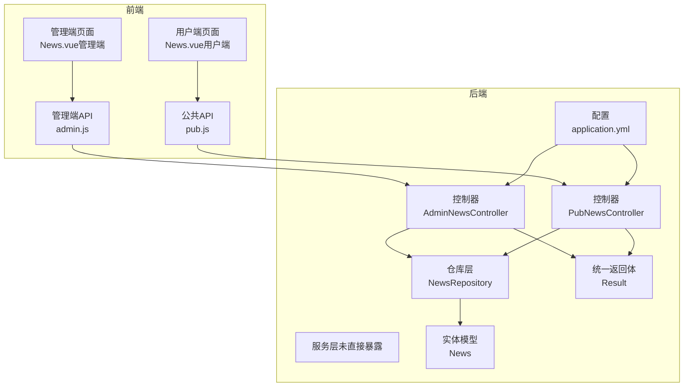
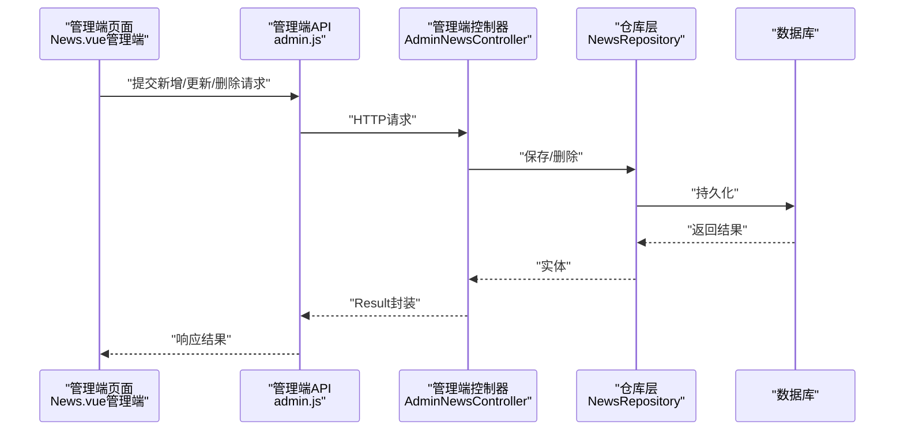
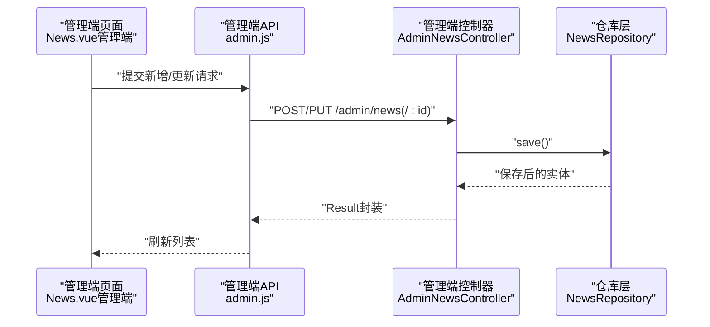
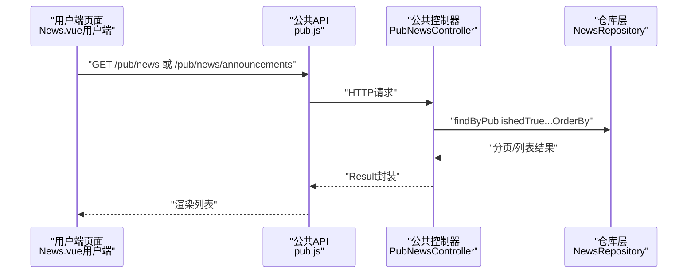
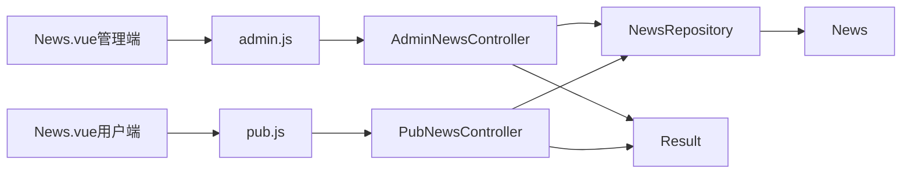

# 新闻管理

<cite>
**本文引用的文件**
- [News.java](file://backend/src/main/java/com/mall/entity/News.java)
- [AdminNewsController.java](file://backend/src/main/java/com/mall/controller/admin/AdminNewsController.java)
- [NewsRepository.java](file://backend/src/main/java/com/mall/repository/NewsRepository.java)
- [PubNewsController.java](file://backend/src/main/java/com/mall/controller/pub/PubNewsController.java)
- [Result.java](file://backend/src/main/java/com/mall/dto/Result.java)
- [application.yml](file://backend/src/main/resources/application.yml)
- [News.vue（管理端）](file://frontend/src/views/admin/News.vue)
- [admin.js](file://frontend/src/api/admin.js)
- [News.vue（用户端）](file://frontend/src/views/user/News.vue)
- [pub.js](file://frontend/src/api/pub.js)
- [AdminCategoryController.java](file://backend/src/main/java/com/mall/controller/admin/AdminCategoryController.java)
- [Category.java](file://backend/src/main/java/com/mall/entity/Category.java)
</cite>

## 目录
1. [简介](#简介)
2. [项目结构](#项目结构)
3. [核心组件](#核心组件)
4. [架构总览](#架构总览)
5. [详细组件分析](#详细组件分析)
6. [依赖分析](#依赖分析)
7. [性能考虑](#性能考虑)
8. [故障排查指南](#故障排查指南)
9. [结论](#结论)
10. [附录](#附录)

## 简介
本文件面向管理员新闻管理功能，系统性阐述新闻资讯发布、编辑、审核、分类管理等核心能力，并结合前端界面与后端接口，给出完整的数据模型、内容格式规范、分发策略、SEO与移动端适配建议，以及API调用示例与发布流程。该功能在提升用户粘性、传播品牌价值、促进活动推广与用户互动方面具有重要作用。

## 项目结构
- 后端采用Spring Boot + JPA，数据库使用MySQL，通过JPA仓库层访问News实体。
- 前端采用Vue 2 + Element UI，管理端与用户端分别提供独立页面与API封装。
- 管理端提供新闻的增删改查；用户端提供新闻列表与公告列表的公共展示。

图表来源
- [AdminNewsController.java:13-47](file://backend/src/main/java/com/mall/controller/admin/AdminNewsController.java#L13-L47)
- [PubNewsController.java:13-35](file://backend/src/main/java/com/mall/controller/pub/PubNewsController.java#L13-L35)
- [NewsRepository.java:10-18](file://backend/src/main/java/com/mall/repository/NewsRepository.java#L10-L18)
- [News.java:8-51](file://backend/src/main/java/com/mall/entity/News.java#L8-L51)
- [Result.java:7-23](file://backend/src/main/java/com/mall/dto/Result.java#L7-L23)
- [application.yml:1-36](file://backend/src/main/resources/application.yml#L1-L36)
- [News.vue（管理端）:131-269](file://frontend/src/views/admin/News.vue#L131-L269)
- [admin.js:88-111](file://frontend/src/api/admin.js#L88-L111)
- [News.vue（用户端）:84-145](file://frontend/src/views/user/News.vue#L84-L145)
- [pub.js:45-53](file://frontend/src/api/pub.js#L45-L53)

章节来源
- [AdminNewsController.java:13-47](file://backend/src/main/java/com/mall/controller/admin/AdminNewsController.java#L13-L47)
- [PubNewsController.java:13-35](file://backend/src/main/java/com/mall/controller/pub/PubNewsController.java#L13-L35)
- [NewsRepository.java:10-18](file://backend/src/main/java/com/mall/repository/NewsRepository.java#L10-L18)
- [News.java:8-51](file://backend/src/main/java/com/mall/entity/News.java#L8-L51)
- [Result.java:7-23](file://backend/src/main/java/com/mall/dto/Result.java#L7-L23)
- [application.yml:1-36](file://backend/src/main/resources/application.yml#L1-L36)
- [News.vue（管理端）:1-307](file://frontend/src/views/admin/News.vue#L1-L307)
- [admin.js:1-129](file://frontend/src/api/admin.js#L1-L129)
- [News.vue（用户端）:1-279](file://frontend/src/views/user/News.vue#L1-L279)
- [pub.js:1-74](file://frontend/src/api/pub.js#L1-L74)

## 核心组件
- 实体模型：News（标题、内容、类型、发布状态、创建/更新时间）
- 控制器：
  - 管理端：AdminNewsController（增删改查）
  - 公共端：PubNewsController（分页查询资讯、查询公告）
- 仓库层：NewsRepository（基于JPA的分页查询）
- 统一返回体：Result（code/message/data）
- 前端页面与API：
  - 管理端：News.vue（管理端），admin.js（管理端API封装）
  - 用户端：News.vue（用户端），pub.js（公共API封装）

章节来源
- [News.java:8-51](file://backend/src/main/java/com/mall/entity/News.java#L8-L51)
- [AdminNewsController.java:13-47](file://backend/src/main/java/com/mall/controller/admin/AdminNewsController.java#L13-L47)
- [PubNewsController.java:13-35](file://backend/src/main/java/com/mall/controller/pub/PubNewsController.java#L13-L35)
- [NewsRepository.java:10-18](file://backend/src/main/java/com/mall/repository/NewsRepository.java#L10-L18)
- [Result.java:7-23](file://backend/src/main/java/com/mall/dto/Result.java#L7-L23)
- [News.vue（管理端）:1-307](file://frontend/src/views/admin/News.vue#L1-L307)
- [admin.js:88-111](file://frontend/src/api/admin.js#L88-L111)
- [News.vue（用户端）:1-279](file://frontend/src/views/user/News.vue#L1-L279)
- [pub.js:45-53](file://frontend/src/api/pub.js#L45-L53)

## 架构总览
- 管理端工作流：管理端页面发起请求到管理端API，AdminNewsController处理业务逻辑，NewsRepository持久化，返回统一结果体。
- 用户端工作流：用户端页面通过公共API获取资讯与公告，PubNewsController从仓库层查询已发布的新闻，按类型过滤并排序。
- 分类管理：AdminCategoryController提供分类的增删改查，便于后续扩展新闻分类字段（当前News实体未直接关联分类）。

图表来源
- [AdminNewsController.java:13-47](file://backend/src/main/java/com/mall/controller/admin/AdminNewsController.java#L13-L47)
- [NewsRepository.java:10-18](file://backend/src/main/java/com/mall/repository/NewsRepository.java#L10-L18)
- [Result.java:7-23](file://backend/src/main/java/com/mall/dto/Result.java#L7-L23)
- [News.vue（管理端）:178-235](file://frontend/src/views/admin/News.vue#L178-L235)
- [admin.js:88-111](file://frontend/src/api/admin.js#L88-L111)

章节来源
- [AdminNewsController.java:13-47](file://backend/src/main/java/com/mall/controller/admin/AdminNewsController.java#L13-L47)
- [NewsRepository.java:10-18](file://backend/src/main/java/com/mall/repository/NewsRepository.java#L10-L18)
- [Result.java:7-23](file://backend/src/main/java/com/mall/dto/Result.java#L7-L23)
- [News.vue（管理端）:178-235](file://frontend/src/views/admin/News.vue#L178-L235)
- [admin.js:88-111](file://frontend/src/api/admin.js#L88-L111)

## 详细组件分析

### 数据模型与内容格式规范
- 实体字段
  - id：主键自增
  - title：字符串，最大长度128
  - content：文本，最大长度2000
  - type：枚举值“NEWS”或“ANNOUNCEMENT”
  - published：布尔值，是否发布
  - createdAt/updatedAt：自动维护的时间戳
- 内容格式规范
  - 标题与内容长度限制已在前端校验，后端实体也定义了长度约束
  - 发布状态由published字段控制，仅已发布内容可在公共端展示
- SEO与移动端适配
  - 建议在用户端列表页增加meta描述与关键词（可在路由或页面渲染时注入）
  - 移动端适配：用户端News.vue已使用Element UI的卡片布局与标签样式，具备基础响应式能力

章节来源
- [News.java:8-51](file://backend/src/main/java/com/mall/entity/News.java#L8-L51)
- [News.vue（管理端）:137-154](file://frontend/src/views/admin/News.vue#L137-L154)
- [News.vue（用户端）:133-143](file://frontend/src/views/user/News.vue#L133-L143)

### 管理端功能与API
- 功能清单
  - 列表查询：支持全量查询
  - 新增：清空id后保存
  - 更新：按id覆盖保存
  - 删除：按id删除
- API定义（管理端）
  - GET /admin/news：查询列表
  - POST /admin/news：创建
  - PUT /admin/news/{id}：更新
  - DELETE /admin/news/{id}：删除
- 前端交互
  - 管理端News.vue提供创建/编辑对话框，支持类型选择、发布开关、标题与内容校验
  - 支持草稿与发布两种状态切换

图表来源
- [AdminNewsController.java:13-47](file://backend/src/main/java/com/mall/controller/admin/AdminNewsController.java#L13-L47)
- [NewsRepository.java:10-18](file://backend/src/main/java/com/mall/repository/NewsRepository.java#L10-L18)
- [admin.js:88-111](file://frontend/src/api/admin.js#L88-L111)
- [News.vue（管理端）:178-235](file://frontend/src/views/admin/News.vue#L178-L235)

章节来源
- [AdminNewsController.java:13-47](file://backend/src/main/java/com/mall/controller/admin/AdminNewsController.java#L13-L47)
- [admin.js:88-111](file://frontend/src/api/admin.js#L88-L111)
- [News.vue（管理端）:178-235](file://frontend/src/views/admin/News.vue#L178-L235)

### 公共端功能与API
- 功能清单
  - 分页查询已发布资讯（排除公告）
  - 查询最新公告列表（可指定数量）
- API定义（公共端）
  - GET /pub/news?page=&size=
  - GET /pub/news/announcements?size=
- 前端交互
  - 用户端News.vue根据tab切换加载资讯/公告，或合并两者并按时间排序
  - 支持空状态与样式区分（公告卡片有特殊样式）

图表来源
- [PubNewsController.java:13-35](file://backend/src/main/java/com/mall/controller/pub/PubNewsController.java#L13-L35)
- [NewsRepository.java:10-18](file://backend/src/main/java/com/mall/repository/NewsRepository.java#L10-L18)
- [pub.js:45-53](file://frontend/src/api/pub.js#L45-L53)
- [News.vue（用户端）:98-132](file://frontend/src/views/user/News.vue#L98-L132)

章节来源
- [PubNewsController.java:13-35](file://backend/src/main/java/com/mall/controller/pub/PubNewsController.java#L13-L35)
- [NewsRepository.java:10-18](file://backend/src/main/java/com/mall/repository/NewsRepository.java#L10-L18)
- [pub.js:45-53](file://frontend/src/api/pub.js#L45-L53)
- [News.vue（用户端）:98-132](file://frontend/src/views/user/News.vue#L98-L132)

### 审核与时效性控制
- 当前实现
  - 通过published字段控制是否对外展示
  - 创建/更新时未强制审核流程，发布即生效
- 建议增强
  - 引入审核状态字段（待审核/已通过/已拒绝）
  - 增加审核人、审核时间、审核意见等字段
  - 增加定时下线或有效期字段，配合定时任务清理过期内容
  - 在管理端增加审核操作按钮与审核记录

章节来源
- [News.java:32-33](file://backend/src/main/java/com/mall/entity/News.java#L32-L33)
- [AdminNewsController.java:27-39](file://backend/src/main/java/com/mall/controller/admin/AdminNewsController.java#L27-L39)

### 多渠道分发
- 当前实现
  - 公共端提供资讯与公告两类入口
  - 用户端News.vue支持按类型筛选与合并展示
- 建议增强
  - 增加推送渠道（站内信、邮件、短信）
  - 增加导出功能（CSV/Excel）
  - 增加订阅/收藏能力（与用户中心联动）
  - 增加社交分享按钮与SEO元信息

章节来源
- [PubNewsController.java:13-35](file://backend/src/main/java/com/mall/controller/pub/PubNewsController.java#L13-L35)
- [News.vue（用户端）:98-132](file://frontend/src/views/user/News.vue#L98-L132)

### 分类管理
- 当前实现
  - 分类实体与管理端控制器已存在
  - 新闻实体未直接关联分类字段
- 建议增强
  - 在News实体中增加categoryId字段
  - 在管理端News.vue中增加分类选择
  - 在公共端News.vue中增加按分类筛选

章节来源
- [AdminCategoryController.java:12-46](file://backend/src/main/java/com/mall/controller/admin/AdminCategoryController.java#L12-L46)
- [Category.java:8-40](file://backend/src/main/java/com/mall/entity/Category.java#L8-L40)
- [News.java:8-51](file://backend/src/main/java/com/mall/entity/News.java#L8-L51)

## 依赖分析
- 控制器依赖仓库层，仓库层依赖实体模型
- 统一返回体Result贯穿前后端
- 前端通过admin.js与pub.js封装HTTP请求

图表来源
- [AdminNewsController.java:13-47](file://backend/src/main/java/com/mall/controller/admin/AdminNewsController.java#L13-L47)
- [PubNewsController.java:13-35](file://backend/src/main/java/com/mall/controller/pub/PubNewsController.java#L13-L35)
- [NewsRepository.java:10-18](file://backend/src/main/java/com/mall/repository/NewsRepository.java#L10-L18)
- [News.java:8-51](file://backend/src/main/java/com/mall/entity/News.java#L8-L51)
- [Result.java:7-23](file://backend/src/main/java/com/mall/dto/Result.java#L7-L23)
- [News.vue（管理端）:131-269](file://frontend/src/views/admin/News.vue#L131-L269)
- [admin.js:88-111](file://frontend/src/api/admin.js#L88-L111)
- [News.vue（用户端）:84-145](file://frontend/src/views/user/News.vue#L84-L145)
- [pub.js:45-53](file://frontend/src/api/pub.js#L45-L53)

章节来源
- [AdminNewsController.java:13-47](file://backend/src/main/java/com/mall/controller/admin/AdminNewsController.java#L13-L47)
- [PubNewsController.java:13-35](file://backend/src/main/java/com/mall/controller/pub/PubNewsController.java#L13-L35)
- [NewsRepository.java:10-18](file://backend/src/main/java/com/mall/repository/NewsRepository.java#L10-L18)
- [News.java:8-51](file://backend/src/main/java/com/mall/entity/News.java#L8-L51)
- [Result.java:7-23](file://backend/src/main/java/com/mall/dto/Result.java#L7-L23)
- [News.vue（管理端）:131-269](file://frontend/src/views/admin/News.vue#L131-L269)
- [admin.js:88-111](file://frontend/src/api/admin.js#L88-L111)
- [News.vue（用户端）:84-145](file://frontend/src/views/user/News.vue#L84-L145)
- [pub.js:45-53](file://frontend/src/api/pub.js#L45-L53)

## 性能考虑
- 分页查询：公共端已使用分页参数，建议管理端也引入分页以提升大数据量下的体验
- 查询优化：NewsRepository已提供按published与type过滤的查询方法，建议在高频查询上建立合适索引
- 前端缓存：用户端News.vue可对最近一次请求结果进行轻量缓存，减少重复请求
- 字段长度：标题与内容长度限制有助于避免超长文本带来的渲染与存储压力

## 故障排查指南
- 返回码与消息
  - 成功：code=200，message="success"
  - 失败：code非200，message为错误信息
- 常见问题
  - 标题/内容为空或超长：前端已做校验，后端实体也有长度约束
  - 发布状态异常：检查published字段是否正确设置
  - 公共端无数据：确认NewsRepository查询条件与published字段
- 日志与配置
  - application.yml中配置了日志级别，可据此定位问题

章节来源
- [Result.java:7-23](file://backend/src/main/java/com/mall/dto/Result.java#L7-L23)
- [News.vue（管理端）:137-154](file://frontend/src/views/admin/News.vue#L137-L154)
- [News.vue（用户端）:133-143](file://frontend/src/views/user/News.vue#L133-L143)
- [application.yml:32-36](file://backend/src/main/resources/application.yml#L32-L36)

## 结论
本新闻管理功能提供了完整的管理端与公共端能力，支持资讯与公告的发布、编辑与展示。当前实现简洁清晰，具备良好的扩展空间。建议后续引入审核流程、分类关联、时效控制与多渠道分发能力，以满足更复杂的运营需求，并进一步提升用户粘性与品牌传播效果。

## 附录

### API调用示例（管理端）
- 查询列表
  - GET /admin/news
- 新增
  - POST /admin/news
  - 请求体：News对象（不包含id）
- 更新
  - PUT /admin/news/{id}
  - 请求体：News对象（包含id）
- 删除
  - DELETE /admin/news/{id}

章节来源
- [AdminNewsController.java:13-47](file://backend/src/main/java/com/mall/controller/admin/AdminNewsController.java#L13-L47)
- [admin.js:88-111](file://frontend/src/api/admin.js#L88-L111)

### API调用示例（公共端）
- 分页查询资讯
  - GET /pub/news?page=&size=
- 查询公告
  - GET /pub/news/announcements?size=

章节来源
- [PubNewsController.java:13-35](file://backend/src/main/java/com/mall/controller/pub/PubNewsController.java#L13-L35)
- [pub.js:45-53](file://frontend/src/api/pub.js#L45-L53)

### 发布流程
- 管理端
  - 在管理端News.vue中填写标题、内容、类型与发布状态
  - 提交后调用admin.js对应接口，成功后刷新列表
- 公共端
  - 用户端News.vue根据tab切换加载资讯/公告
  - 合并展示时按时间倒序排列

章节来源
- [News.vue（管理端）:178-235](file://frontend/src/views/admin/News.vue#L178-L235)
- [admin.js:88-111](file://frontend/src/api/admin.js#L88-L111)
- [News.vue（用户端）:98-132](file://frontend/src/views/user/News.vue#L98-L132)
- [pub.js:45-53](file://frontend/src/api/pub.js#L45-L53)

### 内容管理策略
- 内容质量
  - 严格控制标题与内容长度，避免冗余信息
  - 使用明确的类型标识（资讯/公告），便于用户理解
- 时效性
  - 建议引入有效期字段与定时任务，自动下线过期内容
- 用户互动
  - 可扩展评论、收藏、分享等能力，提升用户参与度
- SEO优化
  - 建议在用户端页面注入meta描述与关键词，提升搜索引擎可见性
- 移动端适配
  - 已具备基础响应式样式，建议进一步优化触摸交互与字体大小