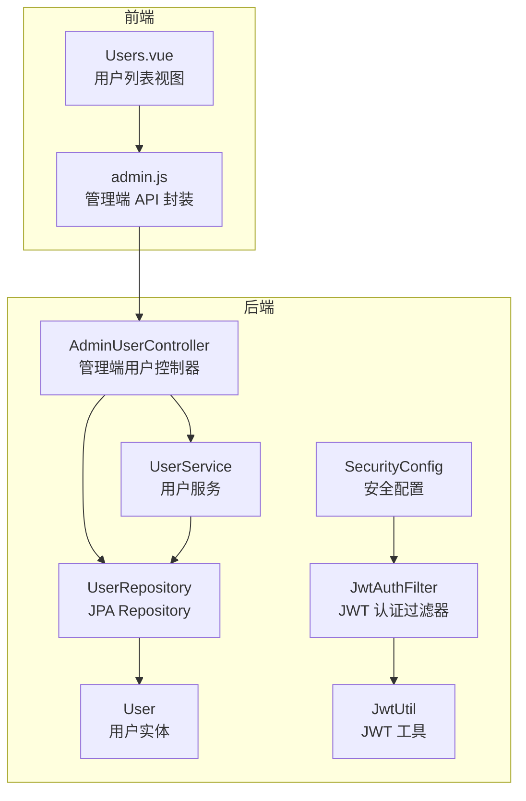
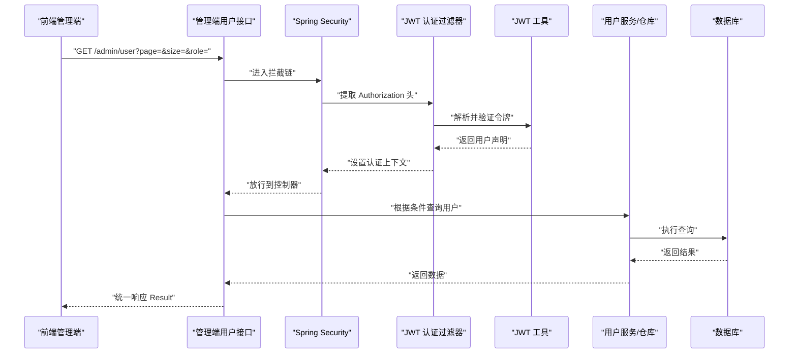
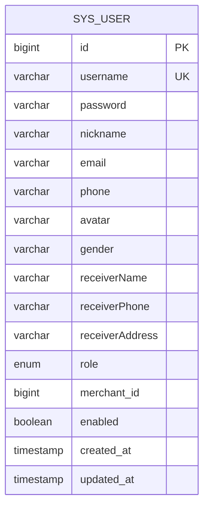
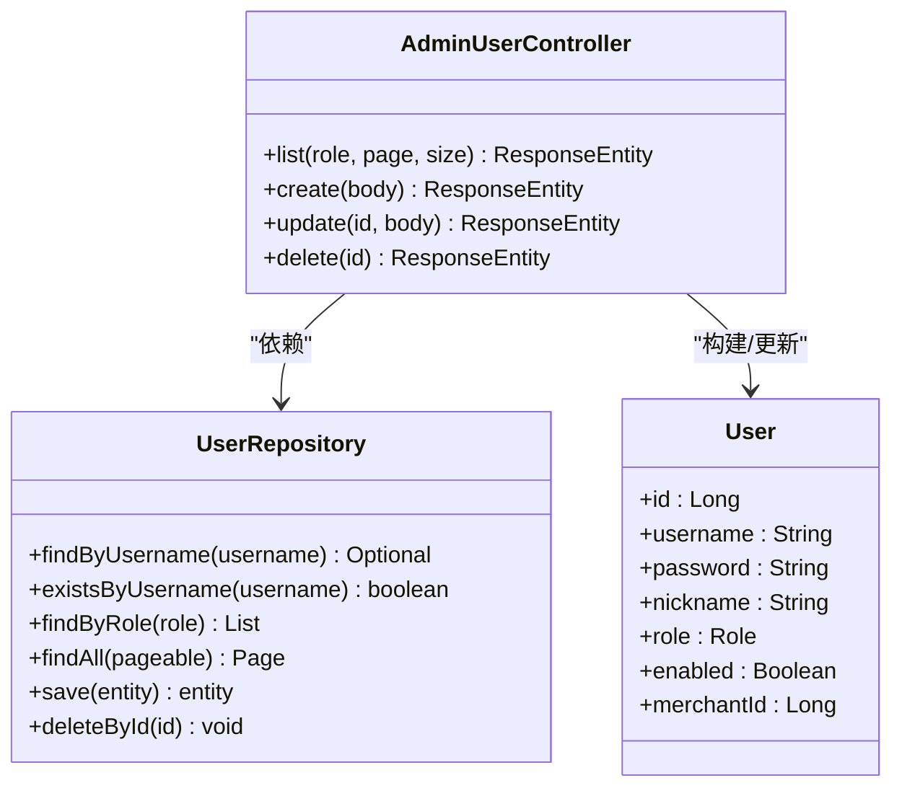
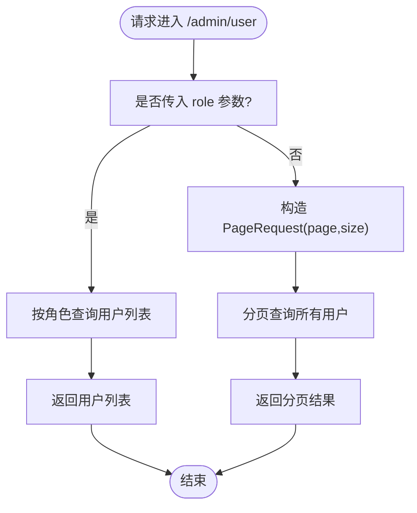
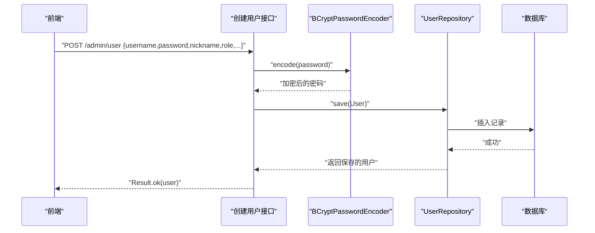
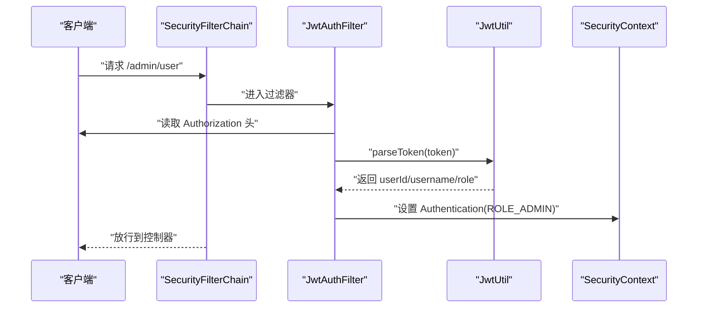
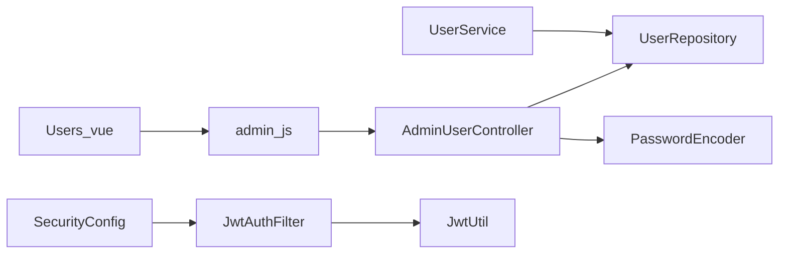

# 用户管理

<cite>
**本文引用的文件**
- [AdminUserController.java](file://backend/src/main/java/com/mall/controller/admin/AdminUserController.java)
- [User.java](file://backend/src/main/java/com/mall/entity/User.java)
- [UserService.java](file://backend/src/main/java/com/mall/service/UserService.java)
- [UserRepository.java](file://backend/src/main/java/com/mall/repository/UserRepository.java)
- [Role.java](file://backend/src/main/java/com/mall/common/Role.java)
- [Result.java](file://backend/src/main/java/com/mall/dto/Result.java)
- [SecurityConfig.java](file://backend/src/main/java/com/mall/config/SecurityConfig.java)
- [JwtAuthFilter.java](file://backend/src/main/java/com/mall/security/JwtAuthFilter.java)
- [JwtUtil.java](file://backend/src/main/java/com/mall/security/JwtUtil.java)
- [application.yml](file://backend/src/main/resources/application.yml)
- [Users.vue](file://frontend/src/views/admin/Users.vue)
- [admin.js](file://frontend/src/api/admin.js)
</cite>

## 目录
1. [简介](#简介)
2. [项目结构](#项目结构)
3. [核心组件](#核心组件)
4. [架构总览](#架构总览)
5. [详细组件分析](#详细组件分析)
6. [依赖关系分析](#依赖关系分析)
7. [性能考虑](#性能考虑)
8. [故障排查指南](#故障排查指南)
9. [结论](#结论)
10. [附录](#附录)

## 简介
本文件面向管理员用户管理功能，系统性阐述用户列表查询、用户创建、用户信息更新、用户删除等核心能力；详细说明分页查询机制、角色过滤、用户状态管理、密码加密处理；给出用户数据模型、API 接口规范、权限控制机制；并提供具体 API 调用示例、参数说明与返回值格式。同时解释用户管理在电商系统中的重要作用，包括用户审核、状态控制、权限分配等场景，帮助开发者正确实现与使用该功能。

## 项目结构
用户管理功能位于后端的管理端控制器层，采用 Spring MVC + Spring Data JPA 的典型分层架构：
- 控制器层：管理端用户接口，负责接收请求、参数校验、调用服务层并返回统一结果包装。
- 服务层：封装业务逻辑（如用户资料更新），保证事务一致性。
- 数据访问层：基于 JPA Repository 提供用户数据的持久化与查询。
- 实体模型：User 实体映射 sys_user 表，包含用户基本信息、角色、状态等字段。
- 安全配置：基于 JWT 的认证过滤器与 Spring Security 配置，限制 /admin/** 只允许 ADMIN 角色访问。
- 前端页面：管理端用户列表页面与 API 封装，展示用户列表、支持新增/编辑/删除。



图表来源
- [AdminUserController.java:17-80](file://backend/src/main/java/com/mall/controller/admin/AdminUserController.java#L17-L80)
- [UserService.java:12-41](file://backend/src/main/java/com/mall/service/UserService.java#L12-L41)
- [UserRepository.java:10-19](file://backend/src/main/java/com/mall/repository/UserRepository.java#L10-L19)
- [User.java:10-87](file://backend/src/main/java/com/mall/entity/User.java#L10-L87)
- [SecurityConfig.java:25-55](file://backend/src/main/java/com/mall/config/SecurityConfig.java#L25-L55)
- [JwtAuthFilter.java:18-56](file://backend/src/main/java/com/mall/security/JwtAuthFilter.java#L18-L56)
- [JwtUtil.java:12-47](file://backend/src/main/java/com/mall/security/JwtUtil.java#L12-L47)
- [Users.vue:71-149](file://frontend/src/views/admin/Users.vue#L71-L149)
- [admin.js:13-31](file://frontend/src/api/admin.js#L13-L31)

章节来源
- [AdminUserController.java:17-80](file://backend/src/main/java/com/mall/controller/admin/AdminUserController.java#L17-L80)
- [User.java:10-87](file://backend/src/main/java/com/mall/entity/User.java#L10-L87)
- [UserService.java:12-41](file://backend/src/main/java/com/mall/service/UserService.java#L12-L41)
- [UserRepository.java:10-19](file://backend/src/main/java/com/mall/repository/UserRepository.java#L10-L19)
- [SecurityConfig.java:25-55](file://backend/src/main/java/com/mall/config/SecurityConfig.java#L25-L55)
- [JwtAuthFilter.java:18-56](file://backend/src/main/java/com/mall/security/JwtAuthFilter.java#L18-L56)
- [JwtUtil.java:12-47](file://backend/src/main/java/com/mall/security/JwtUtil.java#L12-L47)
- [Users.vue:71-149](file://frontend/src/views/admin/Users.vue#L71-L149)
- [admin.js:13-31](file://frontend/src/api/admin.js#L13-L31)

## 核心组件
- 管理端用户控制器：提供用户列表查询、创建、更新、删除接口，支持按角色过滤与分页。
- 用户实体：定义用户字段、枚举角色、启用状态、时间戳等。
- 用户仓库：继承 JPA Repository，提供按用户名、角色、商户 ID 等查询方法。
- 用户服务：封装用户资料更新等业务逻辑，保证事务一致性。
- 安全配置：限制 /admin/** 仅 ADMIN 角色可访问，使用 JWT 认证过滤器解析令牌并注入权限。
- 前端页面与 API：管理端用户列表视图与 API 封装，支持新增、编辑、删除与状态切换。

章节来源
- [AdminUserController.java:26-79](file://backend/src/main/java/com/mall/controller/admin/AdminUserController.java#L26-L79)
- [User.java:17-87](file://backend/src/main/java/com/mall/entity/User.java#L17-L87)
- [UserRepository.java:10-19](file://backend/src/main/java/com/mall/repository/UserRepository.java#L10-L19)
- [UserService.java:12-41](file://backend/src/main/java/com/mall/service/UserService.java#L12-L41)
- [SecurityConfig.java:33-55](file://backend/src/main/java/com/mall/config/SecurityConfig.java#L33-L55)
- [Users.vue:71-149](file://frontend/src/views/admin/Users.vue#L71-L149)
- [admin.js:13-31](file://frontend/src/api/admin.js#L13-L31)

## 架构总览
用户管理功能遵循前后端分离架构，后端通过 RESTful 接口提供能力，前端以 Vue 组件展示与交互。安全层通过 JWT 认证与 Spring Security 授权策略，确保只有 ADMIN 角色可以访问管理端用户接口。



图表来源
- [AdminUserController.java:26-36](file://backend/src/main/java/com/mall/controller/admin/AdminUserController.java#L26-L36)
- [SecurityConfig.java:33-55](file://backend/src/main/java/com/mall/config/SecurityConfig.java#L33-L55)
- [JwtAuthFilter.java:30-46](file://backend/src/main/java/com/mall/security/JwtAuthFilter.java#L30-L46)
- [JwtUtil.java:34-44](file://backend/src/main/java/com/mall/security/JwtUtil.java#L34-L44)

## 详细组件分析

### 用户数据模型
用户实体映射 sys_user 表，包含以下关键字段：
- 标识与凭证：id、username、password
- 基础信息：nickname、email、phone、avatar、gender
- 收货信息：receiverName、receiverPhone、receiverAddress
- 角色与状态：role（枚举）、enabled（布尔）
- 时间戳：createdAt、updatedAt
- 关联地址：一对多地址集合（懒加载）



图表来源
- [User.java:17-87](file://backend/src/main/java/com/mall/entity/User.java#L17-L87)

章节来源
- [User.java:17-87](file://backend/src/main/java/com/mall/entity/User.java#L17-L87)

### 管理端用户控制器
- 列表查询：支持按角色过滤与分页；当传入 role 参数时返回该角色用户列表，否则返回分页结果。
- 创建用户：校验用户名唯一性，对密码进行加密后保存，支持设置昵称、角色、商户绑定与默认启用状态。
- 更新用户：支持更新昵称、启用状态、商户绑定等字段。
- 删除用户：根据用户 ID 删除记录。



图表来源
- [AdminUserController.java:26-79](file://backend/src/main/java/com/mall/controller/admin/AdminUserController.java#L26-L79)
- [UserRepository.java:10-19](file://backend/src/main/java/com/mall/repository/UserRepository.java#L10-L19)
- [User.java:17-87](file://backend/src/main/java/com/mall/entity/User.java#L17-L87)

章节来源
- [AdminUserController.java:26-79](file://backend/src/main/java/com/mall/controller/admin/AdminUserController.java#L26-L79)
- [UserRepository.java:10-19](file://backend/src/main/java/com/mall/repository/UserRepository.java#L10-L19)

### 分页查询机制与角色过滤
- 分页参数：page（默认 0）、size（默认 10）。
- 角色过滤：当 role 参数存在时，直接查询指定角色用户列表；否则使用 PageRequest 进行分页查询。
- 返回格式：统一 Result 包装，包含 code、message、data 字段。



图表来源
- [AdminUserController.java:26-36](file://backend/src/main/java/com/mall/controller/admin/AdminUserController.java#L26-L36)

章节来源
- [AdminUserController.java:26-36](file://backend/src/main/java/com/mall/controller/admin/AdminUserController.java#L26-L36)
- [Result.java:10-23](file://backend/src/main/java/com/mall/dto/Result.java#L10-L23)

### 密码加密处理
- 创建用户时，使用 PasswordEncoder 对明文密码进行加密存储。
- 后端使用 BCryptPasswordEncoder，确保密码安全。
- 登录认证流程由 JWT 工具生成令牌，认证过滤器解析令牌并注入权限。



图表来源
- [AdminUserController.java:38-59](file://backend/src/main/java/com/mall/controller/admin/AdminUserController.java#L38-L59)
- [SecurityConfig.java:69-72](file://backend/src/main/java/com/mall/config/SecurityConfig.java#L69-L72)
- [JwtUtil.java:23-32](file://backend/src/main/java/com/mall/security/JwtUtil.java#L23-L32)

章节来源
- [AdminUserController.java:38-59](file://backend/src/main/java/com/mall/controller/admin/AdminUserController.java#L38-L59)
- [SecurityConfig.java:69-72](file://backend/src/main/java/com/mall/config/SecurityConfig.java#L69-L72)

### 权限控制机制
- 路由级授权：/admin/** 仅 ADMIN 角色可访问。
- 认证方式：JWT 令牌，请求头携带 Authorization: Bearer <token>。
- 过滤器：JwtAuthFilter 解析令牌，将角色转换为 ROLE_ADMIN 注入 SecurityContext。
- 密钥与过期：application.yml 中配置 JWT 密钥与过期时间。



图表来源
- [SecurityConfig.java:33-55](file://backend/src/main/java/com/mall/config/SecurityConfig.java#L33-L55)
- [JwtAuthFilter.java:30-46](file://backend/src/main/java/com/mall/security/JwtAuthFilter.java#L30-L46)
- [JwtUtil.java:34-44](file://backend/src/main/java/com/mall/security/JwtUtil.java#L34-L44)
- [application.yml:27-30](file://backend/src/main/resources/application.yml#L27-L30)

章节来源
- [SecurityConfig.java:33-55](file://backend/src/main/java/com/mall/config/SecurityConfig.java#L33-L55)
- [JwtAuthFilter.java:18-56](file://backend/src/main/java/com/mall/security/JwtAuthFilter.java#L18-L56)
- [JwtUtil.java:12-47](file://backend/src/main/java/com/mall/security/JwtUtil.java#L12-L47)
- [application.yml:27-30](file://backend/src/main/resources/application.yml#L27-L30)

### 前端集成与交互
- 用户列表页面 Users.vue 展示用户 ID、用户名、昵称、角色、启用状态，并提供新增、编辑、删除操作。
- API 封装 admin.js 提供 getUsers、createUser、updateUser、deleteUser 方法。
- 响应统一使用 Result 结构，前端根据 code 与 message 判断操作结果。

章节来源
- [Users.vue:71-149](file://frontend/src/views/admin/Users.vue#L71-L149)
- [admin.js:13-31](file://frontend/src/api/admin.js#L13-L31)

## 依赖关系分析
- 控制器依赖仓库与密码编码器；仓库继承 JPA，提供按角色、用户名等查询方法。
- 服务层封装用户资料更新逻辑，保证事务一致性。
- 安全配置与 JWT 过滤器共同完成认证与授权。
- 前端通过 API 封装调用后端接口。



图表来源
- [AdminUserController.java:23-24](file://backend/src/main/java/com/mall/controller/admin/AdminUserController.java#L23-L24)
- [UserService.java:16-20](file://backend/src/main/java/com/mall/service/UserService.java#L16-L20)
- [SecurityConfig.java:27-31](file://backend/src/main/java/com/mall/config/SecurityConfig.java#L27-L31)
- [JwtAuthFilter.java:24-28](file://backend/src/main/java/com/mall/security/JwtAuthFilter.java#L24-L28)
- [JwtUtil.java:15-21](file://backend/src/main/java/com/mall/security/JwtUtil.java#L15-L21)
- [Users.vue:71-72](file://frontend/src/views/admin/Users.vue#L71-L72)
- [admin.js:13-31](file://frontend/src/api/admin.js#L13-L31)

章节来源
- [AdminUserController.java:23-24](file://backend/src/main/java/com/mall/controller/admin/AdminUserController.java#L23-L24)
- [UserService.java:16-20](file://backend/src/main/java/com/mall/service/UserService.java#L16-L20)
- [SecurityConfig.java:27-31](file://backend/src/main/java/com/mall/config/SecurityConfig.java#L27-L31)
- [JwtAuthFilter.java:24-28](file://backend/src/main/java/com/mall/security/JwtAuthFilter.java#L24-L28)
- [JwtUtil.java:15-21](file://backend/src/main/java/com/mall/security/JwtUtil.java#L15-L21)
- [Users.vue:71-72](file://frontend/src/views/admin/Users.vue#L71-L72)
- [admin.js:13-31](file://frontend/src/api/admin.js#L13-L31)

## 性能考虑
- 分页查询：合理设置 page 与 size，避免一次性返回大量数据；建议在前端实现虚拟滚动或无限滚动优化。
- 角色过滤：当仅需特定角色用户时优先使用 role 参数，减少不必要的分页查询。
- 密码加密：使用 BCrypt，成本较高但安全性高；注意在批量导入场景下进行异步处理。
- 数据库索引：对 username、role、merchant_id 等常用查询字段建立索引，提升查询效率。
- 缓存策略：对只读用户列表可引入 Redis 缓存，降低数据库压力。

## 故障排查指南
- 用户名重复：创建用户时若用户名已存在，接口返回错误信息；前端应提示用户更换用户名。
- 用户不存在：更新用户时若用户不存在，接口返回错误信息；前端应提示刷新页面或检查用户 ID。
- 权限不足：访问 /admin/** 未携带有效 ADMIN 角色令牌，将被拒绝；请确认登录用户角色与令牌有效性。
- 密码不一致：创建用户时密码未加密或加密失败，导致后续登录异常；请检查密码编码器配置。
- 分页参数非法：page 或 size 非法可能导致查询异常；请确保传入合法数值。

章节来源
- [AdminUserController.java:45-47](file://backend/src/main/java/com/mall/controller/admin/AdminUserController.java#L45-L47)
- [AdminUserController.java:64-66](file://backend/src/main/java/com/mall/controller/admin/AdminUserController.java#L64-L66)
- [SecurityConfig.java:48-50](file://backend/src/main/java/com/mall/config/SecurityConfig.java#L48-L50)

## 结论
用户管理功能通过清晰的分层设计与完善的权限控制，实现了管理员对用户的基础管理能力。结合角色过滤、分页查询、状态管理与密码加密，满足了电商系统中用户审核、状态控制与权限分配等核心需求。开发者可据此快速实现与扩展用户管理模块，并在生产环境中关注性能与安全细节。

## 附录

### API 接口规范

- 获取用户列表
  - 方法：GET
  - 路径：/admin/user
  - 查询参数：
    - role：可选，枚举值 ADMIN/MERCHANT/USER
    - page：可选，默认 0
    - size：可选，默认 10
  - 成功响应：Result.ok(data)，data 为用户列表或分页对象
  - 示例：GET /admin/user?role=USER&page=0&size=10

- 创建用户
  - 方法：POST
  - 路径：/admin/user
  - 请求体字段：
    - username：字符串，必填，唯一
    - password：字符串，必填，将被加密存储
    - nickname：字符串，必填
    - role：枚举值 ADMIN/MERCHANT/USER，必填
    - merchantId：可选，仅当 role=MERCHANT 时有效
    - enabled：可选，默认 true
  - 成功响应：Result.ok(user)
  - 示例：
    ```json
    {
      "username": "testuser",
      "password": "SecurePass123!",
      "nickname": "测试用户",
      "role": "USER"
    }
    ```

- 更新用户
  - 方法：PUT
  - 路径：/admin/user/{id}
  - 路径参数：id
  - 请求体字段（可选）：
    - nickname：字符串
    - enabled：布尔
    - merchantId：可选，仅当 role=MERCHANT 时有效
  - 成功响应：Result.ok(user)
  - 示例：PUT /admin/user/123

- 删除用户
  - 方法：DELETE
  - 路径：/admin/user/{id}
  - 路径参数：id
  - 成功响应：Result.ok(null)

- 统一响应结构
  - code：整数，200 表示成功，其他表示失败
  - message：字符串，描述信息
  - data：任意类型，实际数据

章节来源
- [AdminUserController.java:26-79](file://backend/src/main/java/com/mall/controller/admin/AdminUserController.java#L26-L79)
- [Result.java:10-23](file://backend/src/main/java/com/mall/dto/Result.java#L10-L23)
- [admin.js:13-31](file://frontend/src/api/admin.js#L13-L31)