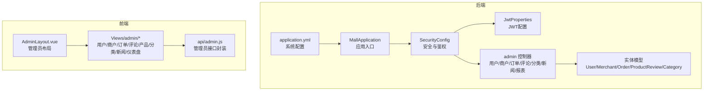
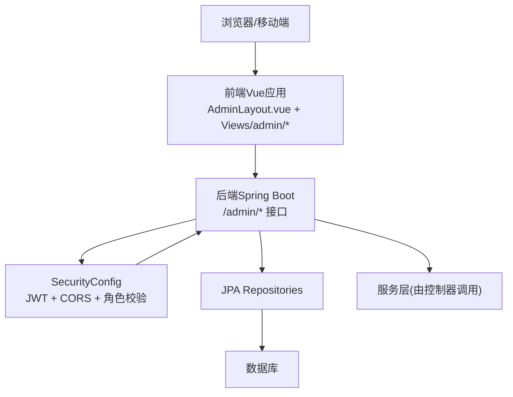
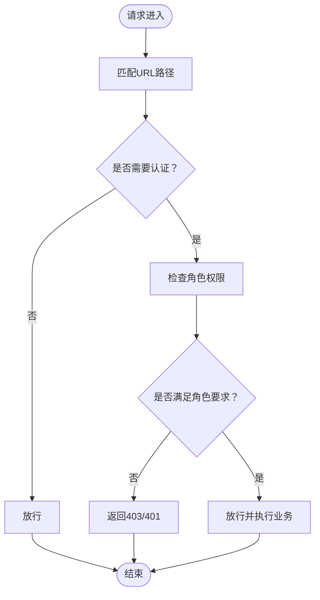
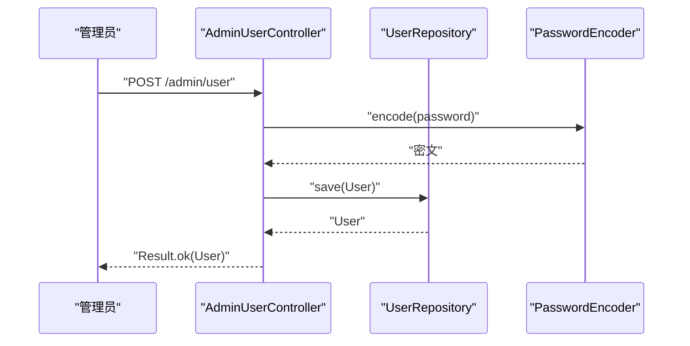
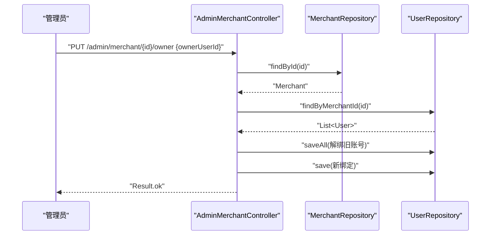
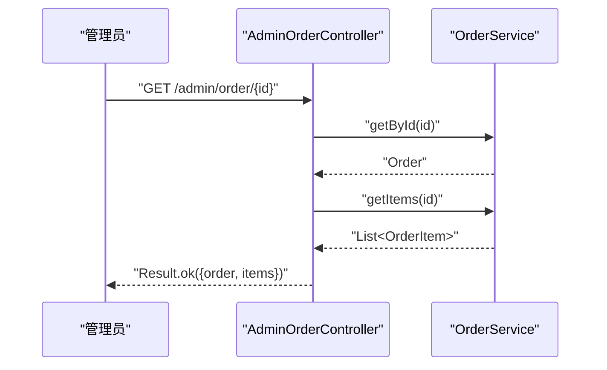
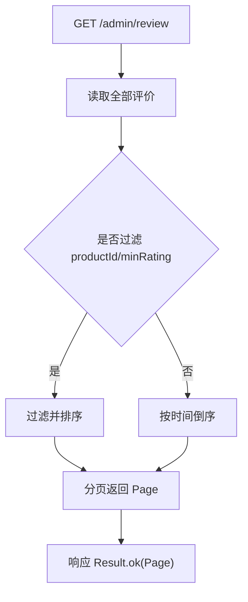
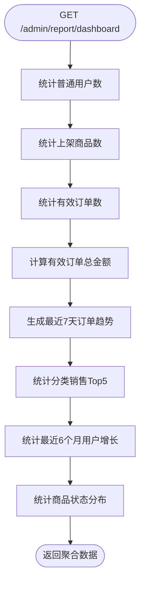
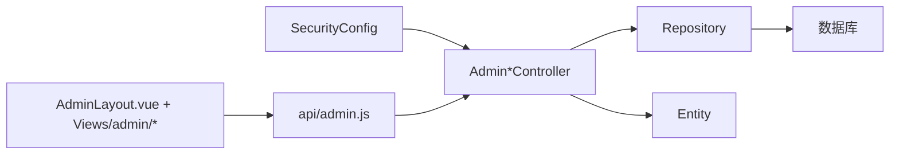

# 管理员系统

<cite>
**本文引用的文件**
- [MallApplication.java](file://backend/src/main/java/com/mall/MallApplication.java)
- [Role.java](file://backend/src/main/java/com/mall/common/Role.java)
- [SecurityConfig.java](file://backend/src/main/java/com/mall/config/SecurityConfig.java)
- [JwtProperties.java](file://backend/src/main/java/com/mall/config/JwtProperties.java)
- [AdminUserController.java](file://backend/src/main/java/com/mall/controller/admin/AdminUserController.java)
- [AdminMerchantController.java](file://backend/src/main/java/com/mall/controller/admin/AdminMerchantController.java)
- [AdminOrderController.java](file://backend/src/main/java/com/mall/controller/admin/AdminOrderController.java)
- [AdminReviewController.java](file://backend/src/main/java/com/mall/controller/admin/AdminReviewController.java)
- [AdminCategoryController.java](file://backend/src/main/java/com/mall/controller/admin/AdminCategoryController.java)
- [AdminNewsController.java](file://backend/src/main/java/com/mall/controller/admin/AdminNewsController.java)
- [AdminReportController.java](file://backend/src/main/java/com/mall/controller/admin/AdminReportController.java)
- [User.java](file://backend/src/main/java/com/mall/entity/User.java)
- [Merchant.java](file://backend/src/main/java/com/mall/entity/Merchant.java)
- [Order.java](file://backend/src/main/java/com/mall/entity/Order.java)
- [ProductReview.java](file://backend/src/main/java/com/mall/entity/ProductReview.java)
- [Category.java](file://backend/src/main/java/com/mall/entity/Category.java)
- [application.yml](file://backend/src/main/resources/application.yml)
- [AdminLayout.vue](file://frontend/src/layouts/AdminLayout.vue)
- [Users.vue](file://frontend/src/views/admin/Users.vue)
- [Merchants.vue](file://frontend/src/views/admin/Merchants.vue)
- [Orders.vue](file://frontend/src/views/admin/Orders.vue)
- [Reviews.vue](file://frontend/src/views/admin/Reviews.vue)
- [Products.vue](file://frontend/src/views/admin/Products.vue)
- [Categories.vue](file://frontend/src/views/admin/Categories.vue)
- [News.vue](file://frontend/src/views/admin/News.vue)
- [Dashboard.vue](file://frontend/src/views/admin/Dashboard.vue)
- [admin.js](file://frontend/src/api/admin.js)
</cite>

## 目录
1. [简介](#简介)
2. [项目结构](#项目结构)
3. [核心组件](#核心组件)
4. [架构总览](#架构总览)
5. [详细组件分析](#详细组件分析)
6. [依赖分析](#依赖分析)
7. [性能考虑](#性能考虑)
8. [故障排查指南](#故障排查指南)
9. [结论](#结论)
10. [附录](#附录)

## 简介
本文件面向管理员系统的功能与实现，覆盖用户管理、商品审核、商户管理、订单管理、报表统计、评论管理、分类管理、新闻管理等模块。文档同时阐述管理员权限体系、数据审核流程、系统监控机制、报表分析功能，以及管理员后台界面设计、批量操作与系统配置管理。文中提供API调用示例路径、操作手册要点与常见问题解决方案，帮助开发者快速理解并实现管理员相关功能。

## 项目结构
后端采用Spring Boot工程，按模块分层组织；前端使用Vue3，采用布局+视图的页面组织方式。管理员相关功能集中在后端的admin包与前端的views/admin目录中。

**图表来源**
- [MallApplication.java:1-13](file://backend/src/main/java/com/mall/MallApplication.java#L1-L13)
- [SecurityConfig.java:1-74](file://backend/src/main/java/com/mall/config/SecurityConfig.java#L1-L74)
- [JwtProperties.java:1-18](file://backend/src/main/java/com/mall/config/JwtProperties.java#L1-L18)
- [AdminUserController.java:1-81](file://backend/src/main/java/com/mall/controller/admin/AdminUserController.java#L1-L81)
- [AdminMerchantController.java:1-122](file://backend/src/main/java/com/mall/controller/admin/AdminMerchantController.java#L1-L122)
- [AdminOrderController.java:1-45](file://backend/src/main/java/com/mall/controller/admin/AdminOrderController.java#L1-L45)
- [AdminReviewController.java:1-92](file://backend/src/main/java/com/mall/controller/admin/AdminReviewController.java#L1-L92)
- [AdminCategoryController.java:1-47](file://backend/src/main/java/com/mall/controller/admin/AdminCategoryController.java#L1-L47)
- [AdminNewsController.java:1-48](file://backend/src/main/java/com/mall/controller/admin/AdminNewsController.java#L1-L48)
- [AdminReportController.java:1-176](file://backend/src/main/java/com/mall/controller/admin/AdminReportController.java#L1-L176)
- [application.yml](file://backend/src/main/resources/application.yml)
- [AdminLayout.vue](file://frontend/src/layouts/AdminLayout.vue)
- [admin.js](file://frontend/src/api/admin.js)

**章节来源**
- [MallApplication.java:1-13](file://backend/src/main/java/com/mall/MallApplication.java#L1-L13)
- [application.yml](file://backend/src/main/resources/application.yml)

## 核心组件
- 角色枚举：定义ADMIN、MERCHANT、USER三种角色，用于权限控制与业务区分。
- 安全配置：基于JWT的无状态认证，对/admin/**路径进行ADMIN角色校验，启用CORS并配置密码编码器。
- 管理员控制器：提供用户、商户、订单、评论、分类、新闻、报表等REST接口。
- 实体模型：User、Merchant、Order、ProductReview、Category等，承载业务数据与字段约束。
- 前端布局与视图：AdminLayout.vue统一布局，views/admin下对应各功能页面，api/admin.js封装管理员接口调用。

**章节来源**
- [Role.java:1-8](file://backend/src/main/java/com/mall/common/Role.java#L1-L8)
- [SecurityConfig.java:1-74](file://backend/src/main/java/com/mall/config/SecurityConfig.java#L1-L74)
- [AdminUserController.java:1-81](file://backend/src/main/java/com/mall/controller/admin/AdminUserController.java#L1-L81)
- [AdminMerchantController.java:1-122](file://backend/src/main/java/com/mall/controller/admin/AdminMerchantController.java#L1-L122)
- [AdminOrderController.java:1-45](file://backend/src/main/java/com/mall/controller/admin/AdminOrderController.java#L1-L45)
- [AdminReviewController.java:1-92](file://backend/src/main/java/com/mall/controller/admin/AdminReviewController.java#L1-L92)
- [AdminCategoryController.java:1-47](file://backend/src/main/java/com/mall/controller/admin/AdminCategoryController.java#L1-L47)
- [AdminNewsController.java:1-48](file://backend/src/main/java/com/mall/controller/admin/AdminNewsController.java#L1-L48)
- [AdminReportController.java:1-176](file://backend/src/main/java/com/mall/controller/admin/AdminReportController.java#L1-L176)
- [User.java:1-88](file://backend/src/main/java/com/mall/entity/User.java#L1-L88)
- [Merchant.java:1-56](file://backend/src/main/java/com/mall/entity/Merchant.java#L1-L56)
- [Order.java:1-83](file://backend/src/main/java/com/mall/entity/Order.java#L1-L83)
- [ProductReview.java:1-44](file://backend/src/main/java/com/mall/entity/ProductReview.java#L1-L44)
- [Category.java:1-41](file://backend/src/main/java/com/mall/entity/Category.java#L1-L41)
- [AdminLayout.vue](file://frontend/src/layouts/AdminLayout.vue)
- [admin.js](file://frontend/src/api/admin.js)

## 架构总览
管理员系统采用前后端分离架构，后端通过Spring Security + JWT实现无状态鉴权，前端通过布局组件统一导航与权限展示。

**图表来源**
- [SecurityConfig.java:34-55](file://backend/src/main/java/com/mall/config/SecurityConfig.java#L34-L55)
- [AdminUserController.java:17-81](file://backend/src/main/java/com/mall/controller/admin/AdminUserController.java#L17-L81)
- [AdminMerchantController.java:17-122](file://backend/src/main/java/com/mall/controller/admin/AdminMerchantController.java#L17-L122)
- [AdminOrderController.java:17-45](file://backend/src/main/java/com/mall/controller/admin/AdminOrderController.java#L17-L45)
- [AdminReviewController.java:16-92](file://backend/src/main/java/com/mall/controller/admin/AdminReviewController.java#L16-L92)
- [AdminCategoryController.java:12-47](file://backend/src/main/java/com/mall/controller/admin/AdminCategoryController.java#L12-L47)
- [AdminNewsController.java:13-48](file://backend/src/main/java/com/mall/controller/admin/AdminNewsController.java#L13-L48)
- [AdminReportController.java:23-176](file://backend/src/main/java/com/mall/controller/admin/AdminReportController.java#L23-L176)

## 详细组件分析

### 管理员权限体系
- 路径级角色控制：/admin/** 需要ADMIN角色；/merchant/** 需要MERCHANT角色；/user/** 需要USER角色。
- JWT认证：请求需携带令牌，后端在过滤器中解析并注入认证上下文。
- CORS：允许指定前端地址访问，支持跨域请求。
- 密码编码：使用BCrypt对用户密码进行加密存储。

**图表来源**
- [SecurityConfig.java:39-52](file://backend/src/main/java/com/mall/config/SecurityConfig.java#L39-L52)

**章节来源**
- [SecurityConfig.java:1-74](file://backend/src/main/java/com/mall/config/SecurityConfig.java#L1-L74)
- [JwtProperties.java:1-18](file://backend/src/main/java/com/mall/config/JwtProperties.java#L1-L18)
- [Role.java:1-8](file://backend/src/main/java/com/mall/common/Role.java#L1-L8)

### 用户管理
- 功能点：分页查询用户（可按角色过滤）、创建用户（密码加密）、更新用户信息（昵称、状态、绑定商家）、删除用户。
- 关键接口：
  - GET /admin/user?page=&size=&role=
  - POST /admin/user
  - PUT /admin/user/{id}
  - DELETE /admin/user/{id}

**图表来源**
- [AdminUserController.java:38-59](file://backend/src/main/java/com/mall/controller/admin/AdminUserController.java#L38-L59)
- [User.java:1-88](file://backend/src/main/java/com/mall/entity/User.java#L1-L88)

**章节来源**
- [AdminUserController.java:1-81](file://backend/src/main/java/com/mall/controller/admin/AdminUserController.java#L1-L81)
- [User.java:1-88](file://backend/src/main/java/com/mall/entity/User.java#L1-L88)

### 商户管理
- 功能点：查询商户列表（附带所属商家账号信息）、新建/更新/删除商户、绑定/解绑商家账号到商户。
- 关键接口：
  - GET /admin/merchant
  - POST /admin/merchant
  - PUT /admin/merchant/{id}
  - PUT /admin/merchant/{id}/owner
  - GET /admin/merchant/{id}
  - DELETE /admin/merchant/{id}

**图表来源**
- [AdminMerchantController.java:76-105](file://backend/src/main/java/com/mall/controller/admin/AdminMerchantController.java#L76-L105)
- [Merchant.java:1-56](file://backend/src/main/java/com/mall/entity/Merchant.java#L1-L56)
- [User.java:1-88](file://backend/src/main/java/com/mall/entity/User.java#L1-L88)

**章节来源**
- [AdminMerchantController.java:1-122](file://backend/src/main/java/com/mall/controller/admin/AdminMerchantController.java#L1-L122)
- [Merchant.java:1-56](file://backend/src/main/java/com/mall/entity/Merchant.java#L1-L56)
- [User.java:1-88](file://backend/src/main/java/com/mall/entity/User.java#L1-L88)

### 订单管理
- 功能点：分页查询全站订单、查询订单详情（含订单项）。
- 关键接口：
  - GET /admin/order?page=&size=
  - GET /admin/order/{id}

**图表来源**
- [AdminOrderController.java:33-43](file://backend/src/main/java/com/mall/controller/admin/AdminOrderController.java#L33-L43)
- [Order.java:1-83](file://backend/src/main/java/com/mall/entity/Order.java#L1-L83)

**章节来源**
- [AdminOrderController.java:1-45](file://backend/src/main/java/com/mall/controller/admin/AdminOrderController.java#L1-L45)
- [Order.java:1-83](file://backend/src/main/java/com/mall/entity/Order.java#L1-L83)

### 评论管理
- 功能点：分页查询所有评价（支持按商品ID与最低评分过滤）、删除单条评价、批量删除评价。
- 关键接口：
  - GET /admin/review?page=&size=&productId=&minRating=
  - DELETE /admin/review/{reviewId}
  - POST /admin/review/batch-delete

**图表来源**
- [AdminReviewController.java:24-64](file://backend/src/main/java/com/mall/controller/admin/AdminReviewController.java#L24-L64)
- [ProductReview.java:1-44](file://backend/src/main/java/com/mall/entity/ProductReview.java#L1-L44)

**章节来源**
- [AdminReviewController.java:1-92](file://backend/src/main/java/com/mall/controller/admin/AdminReviewController.java#L1-L92)
- [ProductReview.java:1-44](file://backend/src/main/java/com/mall/entity/ProductReview.java#L1-L44)

### 分类管理
- 功能点：获取分类列表、创建分类、更新分类、删除分类。
- 关键接口：
  - GET /admin/category
  - POST /admin/category
  - PUT /admin/category/{id}
  - DELETE /admin/category/{id}

**章节来源**
- [AdminCategoryController.java:1-47](file://backend/src/main/java/com/mall/controller/admin/AdminCategoryController.java#L1-L47)
- [Category.java:1-41](file://backend/src/main/java/com/mall/entity/Category.java#L1-L41)

### 新闻管理
- 功能点：查询资讯列表、创建资讯、更新资讯、删除资讯。
- 关键接口：
  - GET /admin/news
  - POST /admin/news
  - PUT /admin/news/{id}
  - DELETE /admin/news/{id}

**章节来源**
- [AdminNewsController.java:1-48](file://backend/src/main/java/com/mall/controller/admin/AdminNewsController.java#L1-L48)

### 报表统计
- 功能点：后台看板数据（用户数、商品数、订单数、总销售额）、最近7天订单趋势、分类销售占比、最近6个月用户增长、商品状态分布。
- 关键接口：
  - GET /admin/report/dashboard

**图表来源**
- [AdminReportController.java:33-175](file://backend/src/main/java/com/mall/controller/admin/AdminReportController.java#L33-L175)

**章节来源**
- [AdminReportController.java:1-176](file://backend/src/main/java/com/mall/controller/admin/AdminReportController.java#L1-L176)

### 管理员后台界面设计与批量操作
- 布局：AdminLayout.vue提供统一导航与侧边栏。
- 页面：Users、Merchants、Orders、Reviews、Products、Categories、News、Dashboard等视图组件。
- 批量操作：前端可复用表格多选，调用后端批量删除接口（如评论批量删除）。
- 系统配置：application.yml集中管理数据库、日志、JWT等配置项。

**章节来源**
- [AdminLayout.vue](file://frontend/src/layouts/AdminLayout.vue)
- [Users.vue](file://frontend/src/views/admin/Users.vue)
- [Merchants.vue](file://frontend/src/views/admin/Merchants.vue)
- [Orders.vue](file://frontend/src/views/admin/Orders.vue)
- [Reviews.vue](file://frontend/src/views/admin/Reviews.vue)
- [Products.vue](file://frontend/src/views/admin/Products.vue)
- [Categories.vue](file://frontend/src/views/admin/Categories.vue)
- [News.vue](file://frontend/src/views/admin/News.vue)
- [Dashboard.vue](file://frontend/src/views/admin/Dashboard.vue)
- [admin.js](file://frontend/src/api/admin.js)
- [application.yml](file://backend/src/main/resources/application.yml)

## 依赖分析
- 控制器依赖：各admin控制器依赖对应的Repository或Service完成数据访问与业务处理。
- 实体依赖：User、Merchant、Order、ProductReview、Category等实体定义了表结构与字段。
- 安全依赖：SecurityConfig统一配置JWT过滤器、CORS、角色路径映射与密码编码器。
- 前端依赖：AdminLayout.vue作为容器，各页面组件通过api/admin.js发起HTTP请求。

**图表来源**
- [SecurityConfig.java:27-54](file://backend/src/main/java/com/mall/config/SecurityConfig.java#L27-L54)
- [AdminUserController.java:23-24](file://backend/src/main/java/com/mall/controller/admin/AdminUserController.java#L23-L24)
- [AdminMerchantController.java:23-24](file://backend/src/main/java/com/mall/controller/admin/AdminMerchantController.java#L23-L24)
- [AdminOrderController.java](file://backend/src/main/java/com/mall/controller/admin/AdminOrderController.java#L23)
- [AdminReviewController.java](file://backend/src/main/java/com/mall/controller/admin/AdminReviewController.java#L22)
- [AdminCategoryController.java](file://backend/src/main/java/com/mall/controller/admin/AdminCategoryController.java#L18)
- [AdminNewsController.java](file://backend/src/main/java/com/mall/controller/admin/AdminNewsController.java#L19)
- [AdminReportController.java:29-31](file://backend/src/main/java/com/mall/controller/admin/AdminReportController.java#L29-L31)
- [AdminLayout.vue](file://frontend/src/layouts/AdminLayout.vue)
- [admin.js](file://frontend/src/api/admin.js)

**章节来源**
- [SecurityConfig.java:1-74](file://backend/src/main/java/com/mall/config/SecurityConfig.java#L1-L74)

## 性能考虑
- 分页查询：用户、商户、订单、评论均支持分页参数，避免一次性加载大量数据。
- 过滤与排序：评论接口支持按商品ID与最低评分过滤，并按创建时间倒序，减少前端二次处理。
- 报表聚合：后台看板数据在服务端聚合，避免前端复杂计算。
- 缓存建议：可在报表接口增加缓存策略，降低高峰期数据库压力（需结合具体场景评估）。
- 数据库索引：对常用过滤字段（如用户角色、订单状态、评论商品ID）建立索引以提升查询效率。

[本节为通用指导，无需列出章节来源]

## 故障排查指南
- 403/401未授权：确认请求头携带JWT令牌且角色满足/admin/**要求。
- 跨域失败：检查CORS配置中的allowedOrigins与credentials设置。
- 密码错误：确认后端使用BCrypt编码存储，登录时正确比对。
- 用户名重复：创建用户时若用户名已存在，接口返回失败提示。
- 商家绑定异常：绑定前会先解绑该店铺当前所有账号，确保唯一性；仅MERCHANT角色用户可绑定。
- 评论删除：单条与批量删除均需验证资源是否存在。

**章节来源**
- [SecurityConfig.java:57-72](file://backend/src/main/java/com/mall/config/SecurityConfig.java#L57-L72)
- [AdminUserController.java:45-47](file://backend/src/main/java/com/mall/controller/admin/AdminUserController.java#L45-L47)
- [AdminMerchantController.java:83-105](file://backend/src/main/java/com/mall/controller/admin/AdminMerchantController.java#L83-L105)
- [AdminReviewController.java:66-90](file://backend/src/main/java/com/mall/controller/admin/AdminReviewController.java#L66-L90)

## 结论
管理员系统通过清晰的权限控制、完善的REST接口与前后端分离的设计，实现了用户、商户、订单、评论、分类、新闻与报表等核心功能。配合分页、过滤与批量操作能力，满足后台管理的高频需求。建议在生产环境中进一步完善缓存、索引与监控告警，持续优化性能与稳定性。

[本节为总结性内容，无需列出章节来源]

## 附录

### API调用示例（路径参考）
- 用户管理
  - GET /admin/user?page=0&size=10&role=USER
  - POST /admin/user
  - PUT /admin/user/{id}
  - DELETE /admin/user/{id}
- 商户管理
  - GET /admin/merchant
  - POST /admin/merchant
  - PUT /admin/merchant/{id}
  - PUT /admin/merchant/{id}/owner
  - GET /admin/merchant/{id}
  - DELETE /admin/merchant/{id}
- 订单管理
  - GET /admin/order?page=0&size=10
  - GET /admin/order/{id}
- 评论管理
  - GET /admin/review?page=0&size=10&productId=&minRating=
  - DELETE /admin/review/{reviewId}
  - POST /admin/review/batch-delete
- 分类管理
  - GET /admin/category
  - POST /admin/category
  - PUT /admin/category/{id}
  - DELETE /admin/category/{id}
- 新闻管理
  - GET /admin/news
  - POST /admin/news
  - PUT /admin/news/{id}
  - DELETE /admin/news/{id}
- 报表统计
  - GET /admin/report/dashboard

**章节来源**
- [AdminUserController.java:26-79](file://backend/src/main/java/com/mall/controller/admin/AdminUserController.java#L26-L79)
- [AdminMerchantController.java:26-120](file://backend/src/main/java/com/mall/controller/admin/AdminMerchantController.java#L26-L120)
- [AdminOrderController.java:25-43](file://backend/src/main/java/com/mall/controller/admin/AdminOrderController.java#L25-L43)
- [AdminReviewController.java:24-90](file://backend/src/main/java/com/mall/controller/admin/AdminReviewController.java#L24-L90)
- [AdminCategoryController.java:20-45](file://backend/src/main/java/com/mall/controller/admin/AdminCategoryController.java#L20-L45)
- [AdminNewsController.java:21-46](file://backend/src/main/java/com/mall/controller/admin/AdminNewsController.java#L21-L46)
- [AdminReportController.java:33-77](file://backend/src/main/java/com/mall/controller/admin/AdminReportController.java#L33-L77)

### 管理员操作手册要点
- 登录与权限：使用ADMIN角色账户登录，确保/admin/**路径可用。
- 用户管理：支持按角色筛选、批量禁用/启用、绑定商家。
- 商户管理：支持绑定唯一运营账号、启用/停用、编辑联系方式。
- 订单管理：查看订单详情、核对收货信息与支付状态。
- 评论管理：按商品筛选、删除不当评论、批量清理低质量内容。
- 分类管理：维护分类层级与排序，保障商品归类准确。
- 新闻管理：发布/更新公告，及时通知用户。
- 报表查看：关注用户增长、销售趋势与商品状态分布，辅助决策。

[本节为操作指引，无需列出章节来源]