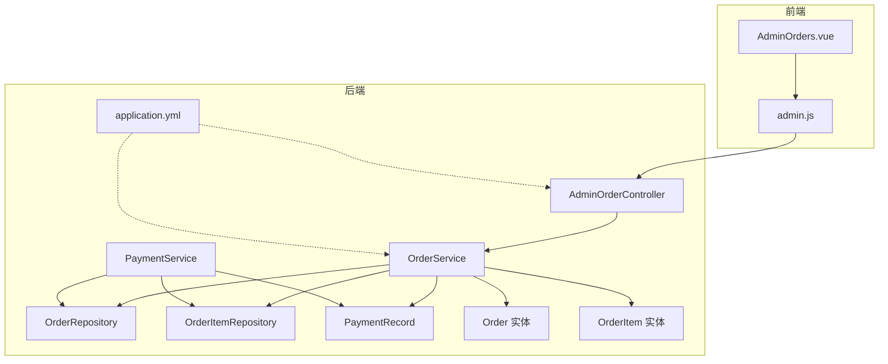
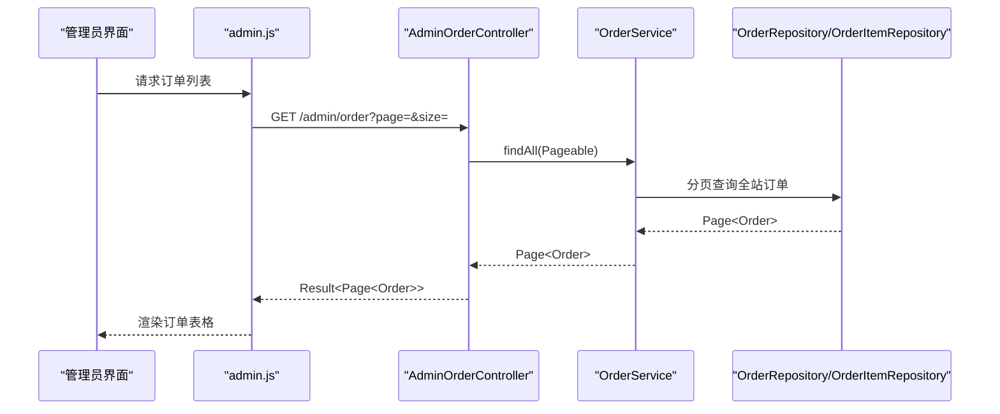
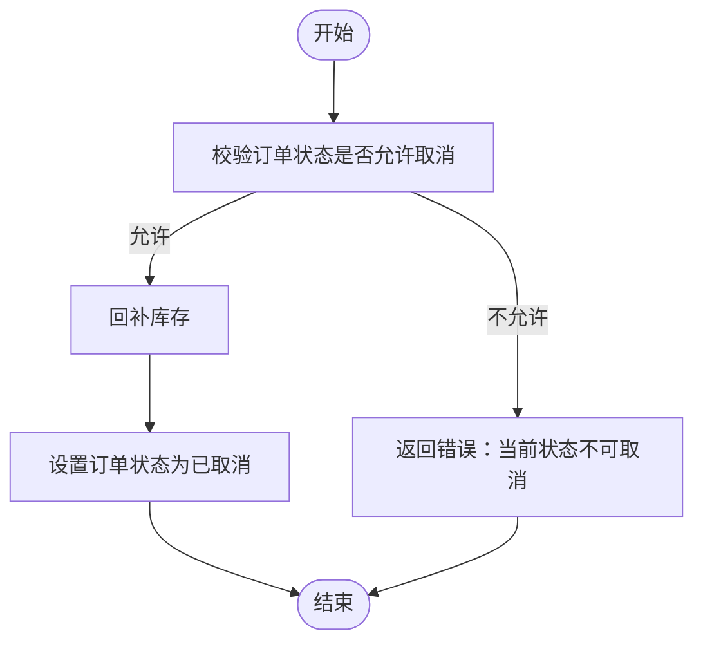
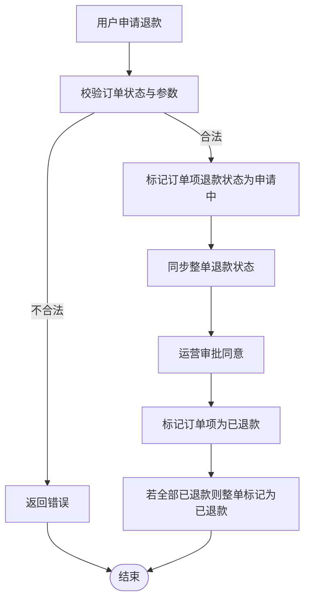
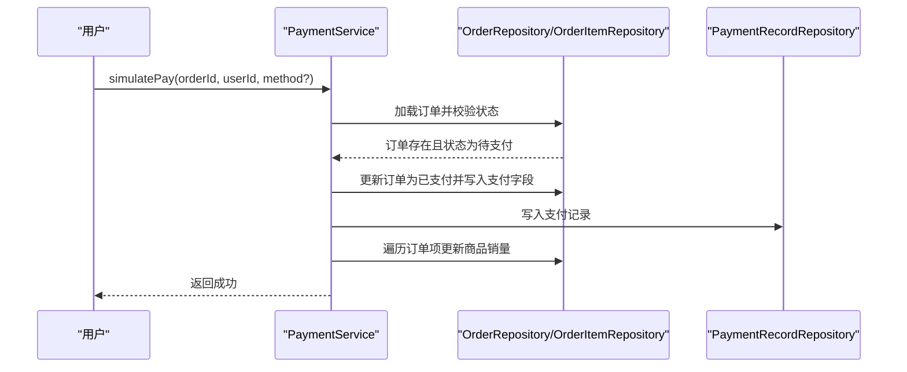
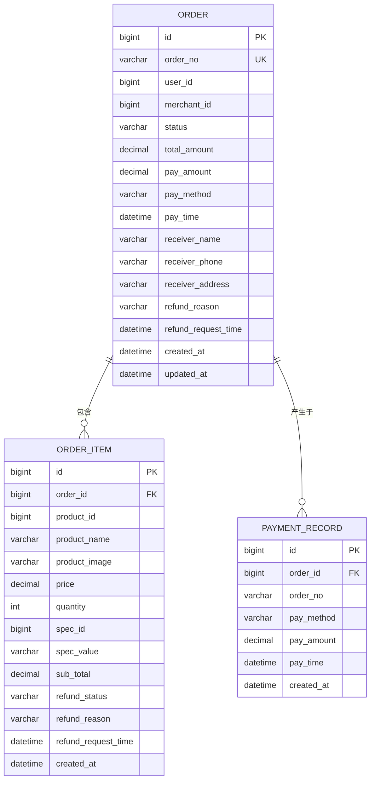
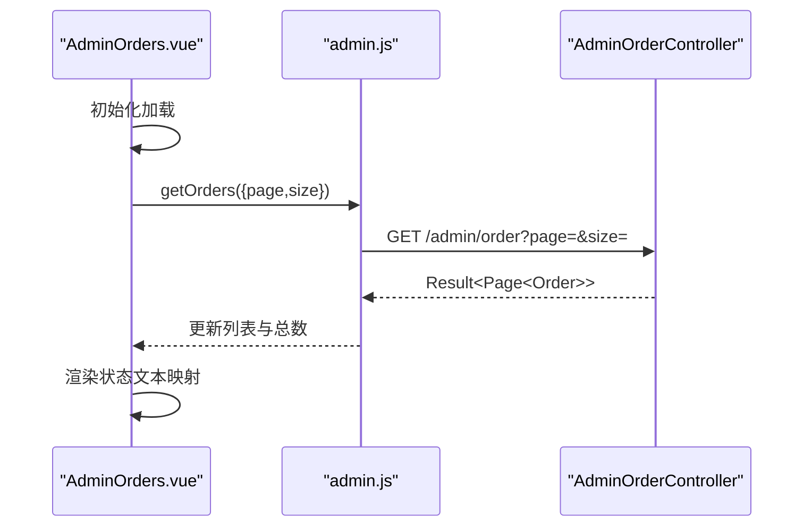
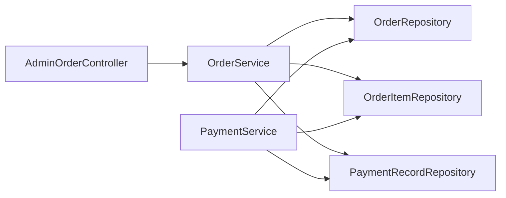
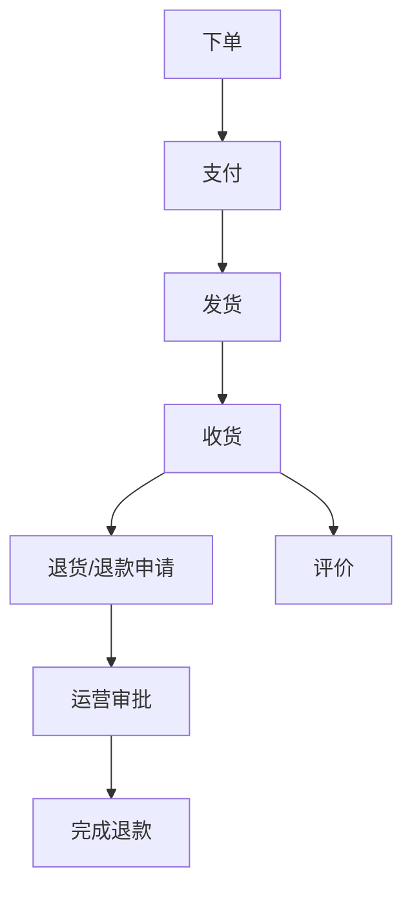

# 订单管理

<cite>
**本文引用的文件**
- [AdminOrderController.java](file://backend/src/main/java/com/mall/controller/admin/AdminOrderController.java)
- [OrderService.java](file://backend/src/main/java/com/mall/service/OrderService.java)
- [Order.java](file://backend/src/main/java/com/mall/entity/Order.java)
- [OrderItem.java](file://backend/src/main/java/com/mall/entity/OrderItem.java)
- [OrderRepository.java](file://backend/src/main/java/com/mall/repository/OrderRepository.java)
- [OrderItemRepository.java](file://backend/src/main/java/com/mall/repository/OrderItemRepository.java)
- [PaymentService.java](file://backend/src/main/java/com/mall/service/PaymentService.java)
- [PaymentRecord.java](file://backend/src/main/java/com/mall/entity/PaymentRecord.java)
- [application.yml](file://backend/src/main/resources/application.yml)
- [Orders.vue](file://frontend/src/views/admin/Orders.vue)
- [admin.js](file://frontend/src/api/admin.js)
- [Result.java](file://backend/src/main/java/com/mall/dto/Result.java)
</cite>

## 目录
1. [简介](#简介)
2. [项目结构](#项目结构)
3. [核心组件](#核心组件)
4. [架构总览](#架构总览)
5. [详细组件分析](#详细组件分析)
6. [依赖分析](#依赖分析)
7. [性能考虑](#性能考虑)
8. [故障排查指南](#故障排查指南)
9. [结论](#结论)
10. [附录](#附录)

## 简介
本文件面向管理员端的订单管理功能，围绕订单查询、订单审核、异常订单处理、退款与售后、统计分析与状态监控展开，帮助开发者快速理解并实现完善的订单管理体系。文档同时解释订单在电商系统中的核心地位：保障交易安全、保护消费者权益、维护平台信誉。

## 项目结构
后端采用 Spring Boot + JPA 的分层架构，管理员端订单接口位于控制器层，业务逻辑集中在服务层，数据持久化通过仓库层完成；前端使用 Vue + Element Plus 提供可视化管理界面。

图表来源
- [AdminOrderController.java:1-45](file://backend/src/main/java/com/mall/controller/admin/AdminOrderController.java#L1-L45)
- [OrderService.java:1-280](file://backend/src/main/java/com/mall/service/OrderService.java#L1-L280)
- [OrderRepository.java:1-28](file://backend/src/main/java/com/mall/repository/OrderRepository.java#L1-L28)
- [OrderItemRepository.java:1-20](file://backend/src/main/java/com/mall/repository/OrderItemRepository.java#L1-L20)
- [PaymentService.java:1-67](file://backend/src/main/java/com/mall/service/PaymentService.java#L1-L67)
- [application.yml:1-36](file://backend/src/main/resources/application.yml#L1-L36)

章节来源
- [application.yml:1-36](file://backend/src/main/resources/application.yml#L1-L36)

## 核心组件
- 管理员订单接口：提供全站订单分页查询与订单详情（含订单项）查询。
- 订单服务：负责下单、状态更新、取消、退款申请与审批、订单项级退款处理。
- 支付服务：模拟支付成功，写入支付记录并更新商品销量。
- 数据模型：订单、订单项、支付记录，以及对应的仓库接口。

章节来源
- [AdminOrderController.java:25-43](file://backend/src/main/java/com/mall/controller/admin/AdminOrderController.java#L25-L43)
- [OrderService.java:33-121](file://backend/src/main/java/com/mall/service/OrderService.java#L33-L121)
- [OrderService.java:147-278](file://backend/src/main/java/com/mall/service/OrderService.java#L147-L278)
- [PaymentService.java:30-65](file://backend/src/main/java/com/mall/service/PaymentService.java#L30-L65)

## 架构总览
管理员端订单管理由“前端页面 + 接口封装 + 控制器 + 服务 + 仓库 + 实体”构成，遵循清晰的分层职责与事务边界，确保状态流转与数据一致性。

图表来源
- [Orders.vue:56-62](file://frontend/src/views/admin/Orders.vue#L56-L62)
- [admin.js:78-81](file://frontend/src/api/admin.js#L78-L81)
- [AdminOrderController.java:26-31](file://backend/src/main/java/com/mall/controller/admin/AdminOrderController.java#L26-L31)
- [OrderService.java:105-108](file://backend/src/main/java/com/mall/service/OrderService.java#L105-L108)
- [OrderRepository.java:21](file://backend/src/main/java/com/mall/repository/OrderRepository.java#L21)

## 详细组件分析

### 管理员订单接口（AdminOrderController）
- 职责
  - 分页查询全站订单
  - 查询订单详情（含订单项）
- 关键点
  - 使用分页请求对象构造分页参数
  - 返回统一结果包装类
  - 订单详情聚合订单与订单项

章节来源
- [AdminOrderController.java:25-43](file://backend/src/main/java/com/mall/controller/admin/AdminOrderController.java#L25-L43)
- [Result.java:16-22](file://backend/src/main/java/com/mall/dto/Result.java#L16-L22)

### 订单服务（OrderService）
- 下单与库存扣减
  - 从购物车按运营维度筛选商品
  - 校验库存充足性
  - 生成订单号、构建订单与订单项、保存并扣减库存
- 查询与分页
  - 按用户/运营/全站分页查询
  - 查询订单项明细
- 状态更新
  - 支持任意状态更新（由上层控制）
- 取消订单
  - 仅在特定状态下允许取消
  - 回补库存
- 退款流程
  - 用户申请：支持整单或单项/批量单项申请
  - 运营审批：单项同意退款，若全部已退款则整单标记为已退款
  - 自动同步：订单项退款状态变化后同步整单状态

图表来源
- [OrderService.java:123-145](file://backend/src/main/java/com/mall/service/OrderService.java#L123-L145)

图表来源
- [OrderService.java:147-278](file://backend/src/main/java/com/mall/service/OrderService.java#L147-L278)

章节来源
- [OrderService.java:33-88](file://backend/src/main/java/com/mall/service/OrderService.java#L33-L88)
- [OrderService.java:115-121](file://backend/src/main/java/com/mall/service/OrderService.java#L115-L121)
- [OrderService.java:123-145](file://backend/src/main/java/com/mall/service/OrderService.java#L123-L145)
- [OrderService.java:147-278](file://backend/src/main/java/com/mall/service/OrderService.java#L147-L278)

### 支付服务（PaymentService）
- 功能
  - 模拟支付成功：校验订单状态、设置支付方式与支付时间、写入支付记录
  - 更新商品销量
- 注意
  - 默认支付方式为 WECHAT（若未传入）
  - 仅对“待支付”订单生效

图表来源
- [PaymentService.java:30-65](file://backend/src/main/java/com/mall/service/PaymentService.java#L30-L65)

章节来源
- [PaymentService.java:30-65](file://backend/src/main/java/com/mall/service/PaymentService.java#L30-L65)

### 数据模型与仓库
- 订单（Order）
  - 字段覆盖订单号、用户与运营标识、状态、金额、收货信息、退款相关信息、时间戳
  - 状态枚举：待支付、已支付、已发货、已收货、已取消、退货申请中、已退款
- 订单项（OrderItem）
  - 字段覆盖订单、商品、单价、数量、小计、单品退款状态与时间戳
- 支付记录（PaymentRecord）
  - 字段覆盖订单关联、支付方式、金额、支付时间
- 仓库接口
  - 订单：按用户/运营/全站分页、按用户与状态查询、查询已收货订单
  - 订单项：按订单查询、查询用户已收货商品ID、协同过滤所需原始数据

图表来源
- [Order.java:18-81](file://backend/src/main/java/com/mall/entity/Order.java#L18-L81)
- [OrderItem.java:18-71](file://backend/src/main/java/com/mall/entity/OrderItem.java#L18-L71)
- [PaymentRecord.java:19-44](file://backend/src/main/java/com/mall/entity/PaymentRecord.java#L19-L44)

章节来源
- [Order.java:18-81](file://backend/src/main/java/com/mall/entity/Order.java#L18-L81)
- [OrderItem.java:18-71](file://backend/src/main/java/com/mall/entity/OrderItem.java#L18-L71)
- [PaymentRecord.java:19-44](file://backend/src/main/java/com/mall/entity/PaymentRecord.java#L19-L44)
- [OrderRepository.java:13-27](file://backend/src/main/java/com/mall/repository/OrderRepository.java#L13-L27)
- [OrderItemRepository.java:9-19](file://backend/src/main/java/com/mall/repository/OrderItemRepository.java#L9-L19)

### 前端集成与展示
- 页面组件
  - 订单列表页：展示订单号、用户ID、运营ID、金额、状态、下单时间
  - 状态映射：将内部状态码转换为中文显示
- API 封装
  - 列表与详情接口：GET /admin/order 与 GET /admin/order/{id}

图表来源
- [Orders.vue:32-63](file://frontend/src/views/admin/Orders.vue#L32-L63)
- [admin.js:78-86](file://frontend/src/api/admin.js#L78-L86)
- [AdminOrderController.java:26-43](file://backend/src/main/java/com/mall/controller/admin/AdminOrderController.java#L26-L43)

章节来源
- [Orders.vue:8-29](file://frontend/src/views/admin/Orders.vue#L8-L29)
- [Orders.vue:43-54](file://frontend/src/views/admin/Orders.vue#L43-L54)
- [admin.js:78-86](file://frontend/src/api/admin.js#L78-L86)

## 依赖分析
- 控制器依赖服务：AdminOrderController 依赖 OrderService 完成查询与聚合
- 服务依赖仓库：OrderService 依赖 OrderRepository、OrderItemRepository、ProductRepository 等完成数据访问
- 支付服务依赖：PaymentService 依赖 OrderRepository、OrderItemRepository、ProductRepository、PaymentRecordRepository
- 前后端通信：前端通过 admin.js 封装的接口调用后端控制器

图表来源
- [AdminOrderController.java:23](file://backend/src/main/java/com/mall/controller/admin/AdminOrderController.java#L23)
- [OrderService.java:28-32](file://backend/src/main/java/com/mall/service/OrderService.java#L28-L32)
- [PaymentService.java:25-28](file://backend/src/main/java/com/mall/service/PaymentService.java#L25-L28)

章节来源
- [AdminOrderController.java:23](file://backend/src/main/java/com/mall/controller/admin/AdminOrderController.java#L23)
- [OrderService.java:28-32](file://backend/src/main/java/com/mall/service/OrderService.java#L28-L32)
- [PaymentService.java:25-28](file://backend/src/main/java/com/mall/service/PaymentService.java#L25-L28)

## 性能考虑
- 分页查询：使用 Pageable 减少一次性加载大量订单带来的内存压力
- 状态索引：建议在数据库层面为订单状态、用户ID、运营ID建立索引以提升查询效率
- 批量操作：退款批量申请与拆分订单项时，注意避免 N+1 查询，可结合批量保存优化
- 缓存策略：对热点报表（如销售统计）可引入缓存减少重复计算

## 故障排查指南
- 订单不存在
  - 现象：查询订单详情返回失败
  - 处理：检查订单ID与分页参数
  - 参考路径：[AdminOrderController.java:37](file://backend/src/main/java/com/mall/controller/admin/AdminOrderController.java#L37)
- 库存不足
  - 现象：下单时报库存不足
  - 处理：提示具体商品名称并引导补货
  - 参考路径：[OrderService.java:49-51](file://backend/src/main/java/com/mall/service/OrderService.java#L49-L51)
- 不可取消状态
  - 现象：用户尝试取消订单被拒绝
  - 处理：提示当前状态不可取消
  - 参考路径：[OrderService.java:128-129](file://backend/src/main/java/com/mall/service/OrderService.java#L128-L129)
- 退款参数非法
  - 现象：退款数量不合法或重复申请
  - 处理：校验数量范围与状态，必要时拆分子项
  - 参考路径：[OrderService.java:196-210](file://backend/src/main/java/com/mall/service/OrderService.java#L196-L210)
- 支付失败
  - 现象：模拟支付返回失败
  - 处理：检查订单状态是否为“待支付”，用户是否匹配
  - 参考路径：[PaymentService.java:32-36](file://backend/src/main/java/com/mall/service/PaymentService.java#L32-L36)

章节来源
- [AdminOrderController.java:37](file://backend/src/main/java/com/mall/controller/admin/AdminOrderController.java#L37)
- [OrderService.java:49-51](file://backend/src/main/java/com/mall/service/OrderService.java#L49-L51)
- [OrderService.java:128-129](file://backend/src/main/java/com/mall/service/OrderService.java#L128-L129)
- [OrderService.java:196-210](file://backend/src/main/java/com/mall/service/OrderService.java#L196-L210)
- [PaymentService.java:32-36](file://backend/src/main/java/com/mall/service/PaymentService.java#L32-L36)

## 结论
管理员端订单管理以清晰的分层设计与严格的事务边界为核心，覆盖了订单查询、状态更新、取消、退款与审批、支付与售后等关键环节。通过统一的结果封装与前后端接口约定，系统在保障交易安全与消费者权益的同时，也为平台信誉维护提供了坚实基础。开发者可在此基础上扩展物流跟踪、投诉与纠纷调解等能力。

## 附录

### API 调用示例（后端接口）
- 分页查询全站订单
  - 方法与路径：GET /admin/order?page=&size=
  - 返回：Result<Page<Order>>
  - 参考路径：[AdminOrderController.java:26-31](file://backend/src/main/java/com/mall/controller/admin/AdminOrderController.java#L26-L31)
- 查询订单详情（含订单项）
  - 方法与路径：GET /admin/order/{id}
  - 返回：Result<{order, items}>
  - 参考路径：[AdminOrderController.java:33-43](file://backend/src/main/java/com/mall/controller/admin/AdminOrderController.java#L33-L43)

### 订单处理流程（概念示意）
