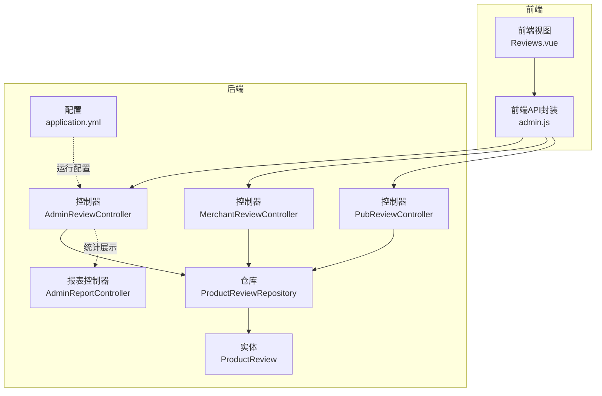
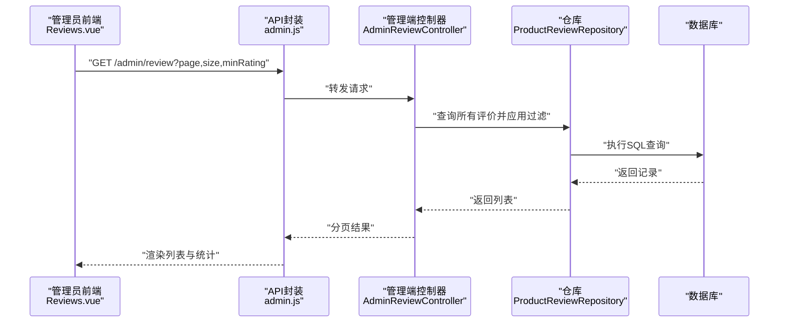
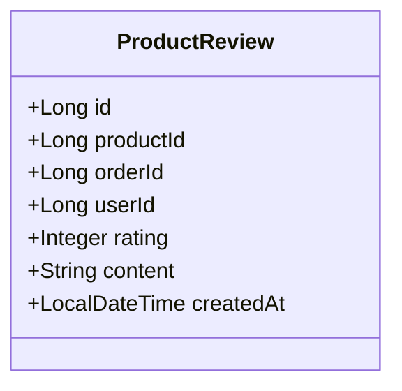
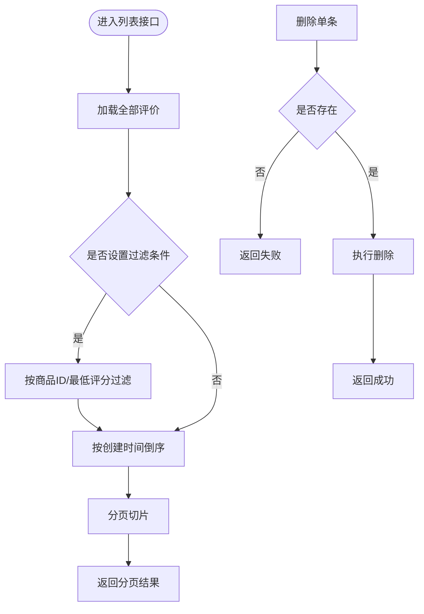
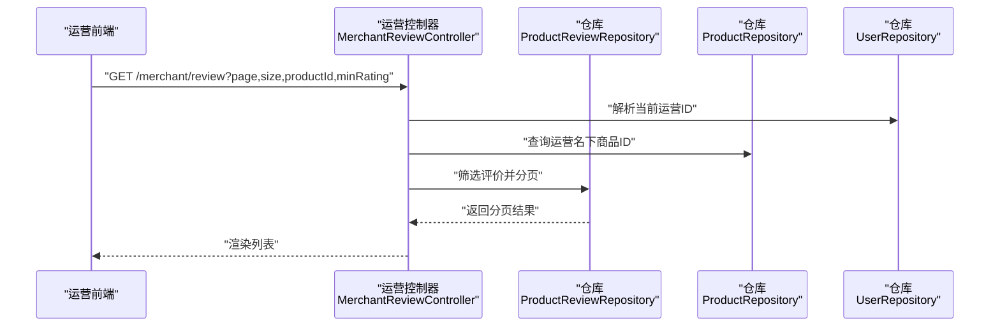
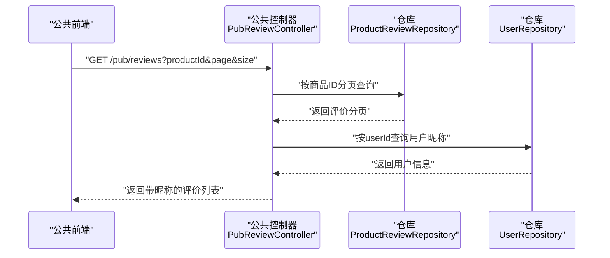
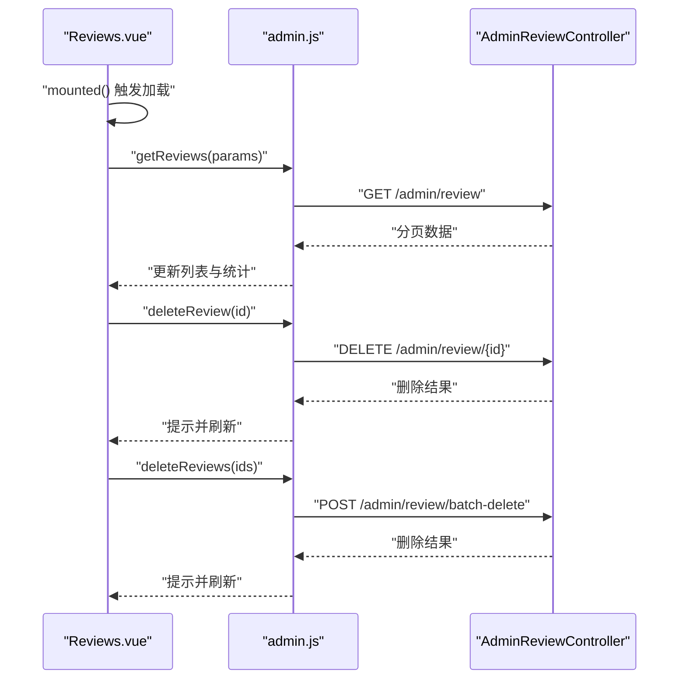
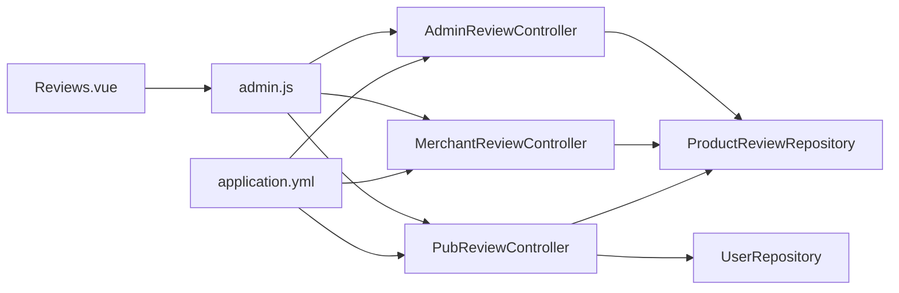

# 评论管理

<cite>
**本文引用的文件**
- [AdminReviewController.java](file://backend/src/main/java/com/mall/controller/admin/AdminReviewController.java)
- [ProductReview.java](file://backend/src/main/java/com/mall/entity/ProductReview.java)
- [ProductReviewRepository.java](file://backend/src/main/java/com/mall/repository/ProductReviewRepository.java)
- [MerchantReviewController.java](file://backend/src/main/java/com/mall/controller/merchant/MerchantReviewController.java)
- [PubReviewController.java](file://backend/src/main/java/com/mall/controller/pub/PubReviewController.java)
- [Reviews.vue](file://frontend/src/views/admin/Reviews.vue)
- [admin.js](file://frontend/src/api/admin.js)
- [application.yml](file://backend/src/main/resources/application.yml)
- [Role.java](file://backend/src/main/java/com/mall/common/Role.java)
- [User.java](file://backend/src/main/java/com/mall/entity/User.java)
- [AdminReportController.java](file://backend/src/main/java/com/mall/controller/admin/AdminReportController.java)
</cite>

## 目录
1. [简介](#简介)
2. [项目结构](#项目结构)
3. [核心组件](#核心组件)
4. [架构总览](#架构总览)
5. [详细组件分析](#详细组件分析)
6. [依赖分析](#依赖分析)
7. [性能考虑](#性能考虑)
8. [故障排查指南](#故障排查指南)
9. [结论](#结论)
10. [附录](#附录)

## 简介
本文件面向管理员评论管理功能，围绕“审核、屏蔽、恶意评论处理、统计分析”等核心目标，系统梳理评论数据模型、审核流程、用户反馈机制与内容安全策略。同时结合现有后端控制器与前端页面，给出可落地的API调用示例、处理流程与最佳实践，帮助开发者构建健康的内容管理环境，支撑社区建设与品牌维护。

## 项目结构
后端采用Spring Boot三层结构：控制器层负责HTTP接口；服务层承载业务逻辑；数据访问层通过JPA仓库对接数据库。前端基于Vue与Element UI，提供管理员后台的评论管理界面。

**图表来源**
- [AdminReviewController.java:16-92](file://backend/src/main/java/com/mall/controller/admin/AdminReviewController.java#L16-L92)
- [MerchantReviewController.java:21-157](file://backend/src/main/java/com/mall/controller/merchant/MerchantReviewController.java#L21-L157)
- [PubReviewController.java:19-64](file://backend/src/main/java/com/mall/controller/pub/PubReviewController.java#L19-L64)
- [ProductReview.java:8-44](file://backend/src/main/java/com/mall/entity/ProductReview.java#L8-L44)
- [ProductReviewRepository.java:10-15](file://backend/src/main/java/com/mall/repository/ProductReviewRepository.java#L10-L15)
- [AdminReportController.java:27-77](file://backend/src/main/java/com/mall/controller/admin/AdminReportController.java#L27-L77)
- [application.yml:1-36](file://backend/src/main/resources/application.yml#L1-L36)

**章节来源**
- [AdminReviewController.java:16-92](file://backend/src/main/java/com/mall/controller/admin/AdminReviewController.java#L16-L92)
- [MerchantReviewController.java:21-157](file://backend/src/main/java/com/mall/controller/merchant/MerchantReviewController.java#L21-L157)
- [PubReviewController.java:19-64](file://backend/src/main/java/com/mall/controller/pub/PubReviewController.java#L19-L64)
- [ProductReview.java:8-44](file://backend/src/main/java/com/mall/entity/ProductReview.java#L8-L44)
- [ProductReviewRepository.java:10-15](file://backend/src/main/java/com/mall/repository/ProductReviewRepository.java#L10-L15)
- [AdminReportController.java:27-77](file://backend/src/main/java/com/mall/controller/admin/AdminReportController.java#L27-L77)
- [application.yml:1-36](file://backend/src/main/resources/application.yml#L1-L36)

## 核心组件
- 数据模型：ProductReview（评价实体），包含商品ID、订单ID、用户ID、评分、内容、创建时间等字段。
- 管理端接口：AdminReviewController提供分页查询、删除、批量删除等能力。
- 运营端接口：MerchantReviewController提供运营视角下的评价查询、删除与批量删除，并进行权限校验。
- 公共接口：PubReviewController提供按商品分页查询评价列表，并补充用户昵称。
- 前端界面：Reviews.vue提供统计卡片、筛选器、表格与分页，调用admin.js封装的API。
- 配置：application.yml定义了数据库连接、JPA方言、日志级别与服务端口等。

**章节来源**
- [ProductReview.java:15-44](file://backend/src/main/java/com/mall/entity/ProductReview.java#L15-L44)
- [AdminReviewController.java:24-90](file://backend/src/main/java/com/mall/controller/admin/AdminReviewController.java#L24-L90)
- [MerchantReviewController.java:39-155](file://backend/src/main/java/com/mall/controller/merchant/MerchantReviewController.java#L39-L155)
- [PubReviewController.java:28-61](file://backend/src/main/java/com/mall/controller/pub/PubReviewController.java#L28-L61)
- [Reviews.vue:158-318](file://frontend/src/views/admin/Reviews.vue#L158-L318)
- [admin.js:113-129](file://frontend/src/api/admin.js#L113-L129)
- [application.yml:4-25](file://backend/src/main/resources/application.yml#L4-L25)

## 架构总览
管理员评论管理遵循“前端请求—后端控制器—数据仓库—数据库”的标准分层架构。前端通过admin.js统一调用后端REST接口，后端控制器根据角色与权限进行数据过滤与校验，最终返回分页结果或执行删除操作。

**图表来源**
- [Reviews.vue:196-220](file://frontend/src/views/admin/Reviews.vue#L196-L220)
- [admin.js:115-118](file://frontend/src/api/admin.js#L115-L118)
- [AdminReviewController.java:24-64](file://backend/src/main/java/com/mall/controller/admin/AdminReviewController.java#L24-L64)
- [ProductReviewRepository.java:10-15](file://backend/src/main/java/com/mall/repository/ProductReviewRepository.java#L10-L15)

## 详细组件分析

### 数据模型：ProductReview
- 字段要点：主键、商品ID、订单ID、用户ID、评分、内容、创建时间（自动填充）。
- 设计意图：支持按商品维度聚合评价、关联用户信息、保留审计时间戳。

**图表来源**
- [ProductReview.java:15-44](file://backend/src/main/java/com/mall/entity/ProductReview.java#L15-L44)

**章节来源**
- [ProductReview.java:15-44](file://backend/src/main/java/com/mall/entity/ProductReview.java#L15-L44)

### 管理端接口：AdminReviewController
- 功能清单
  - 分页查询所有评价，支持按商品ID与最低评分过滤，按创建时间倒序。
  - 删除单条评价。
  - 批量删除评价。
- 处理逻辑
  - 先全量加载再内存过滤与排序，最后分页切片。
  - 删除前检查存在性，避免无效删除。
- 审核建议
  - 对高风险内容可先“屏蔽显示但不删除”，配合人工复核后再决定处置。

**图表来源**
- [AdminReviewController.java:24-90](file://backend/src/main/java/com/mall/controller/admin/AdminReviewController.java#L24-L90)

**章节来源**
- [AdminReviewController.java:24-90](file://backend/src/main/java/com/mall/controller/admin/AdminReviewController.java#L24-L90)

### 运营端接口：MerchantReviewController
- 功能清单
  - 仅能查看其名下商品的评价，按商品ID与最低评分过滤，按创建时间倒序。
  - 删除与批量删除，均进行“商品归属校验”。
- 权限控制
  - 通过当前登录用户的merchantId与商品所属merchantId匹配，防止越权操作。
- 使用场景
  - 运营对自身商品的评价进行日常监控与处理。

**图表来源**
- [MerchantReviewController.java:39-91](file://backend/src/main/java/com/mall/controller/merchant/MerchantReviewController.java#L39-L91)
- [MerchantReviewController.java:112-155](file://backend/src/main/java/com/mall/controller/merchant/MerchantReviewController.java#L112-L155)

**章节来源**
- [MerchantReviewController.java:31-37](file://backend/src/main/java/com/mall/controller/merchant/MerchantReviewController.java#L31-L37)
- [MerchantReviewController.java:39-91](file://backend/src/main/java/com/mall/controller/merchant/MerchantReviewController.java#L39-L91)
- [MerchantReviewController.java:112-155](file://backend/src/main/java/com/mall/controller/merchant/MerchantReviewController.java#L112-L155)

### 公共接口：PubReviewController
- 功能清单
  - 按商品ID分页查询评价列表，并为每条评价补充用户昵称（若无则回退用户名）。
- 适用场景
  - 前台商品详情页展示评价，便于用户阅读与互动。

**图表来源**
- [PubReviewController.java:28-61](file://backend/src/main/java/com/mall/controller/pub/PubReviewController.java#L28-L61)

**章节来源**
- [PubReviewController.java:28-61](file://backend/src/main/java/com/mall/controller/pub/PubReviewController.java#L28-L61)

### 前端界面：Reviews.vue（管理端）
- 功能清单
  - 统计卡片：总评价数、5星评价数、平均评分、低评价数。
  - 筛选器：最低评分（含“低于3星”）、刷新按钮。
  - 表格：商品ID、用户ID、评分、内容（超长内容气泡预览）、创建时间、删除操作。
  - 分页：支持切换页大小与页码。
  - 批量删除：多选后批量提交。
- API调用
  - 通过admin.js封装的getReviews、deleteReview、deleteReviews发起请求。

**图表来源**
- [Reviews.vue:196-318](file://frontend/src/views/admin/Reviews.vue#L196-L318)
- [admin.js:115-129](file://frontend/src/api/admin.js#L115-L129)
- [AdminReviewController.java:24-90](file://backend/src/main/java/com/mall/controller/admin/AdminReviewController.java#L24-L90)

**章节来源**
- [Reviews.vue:9-35](file://frontend/src/views/admin/Reviews.vue#L9-L35)
- [Reviews.vue:37-66](file://frontend/src/views/admin/Reviews.vue#L37-L66)
- [Reviews.vue:68-154](file://frontend/src/views/admin/Reviews.vue#L68-L154)
- [Reviews.vue:196-318](file://frontend/src/views/admin/Reviews.vue#L196-L318)
- [admin.js:115-129](file://frontend/src/api/admin.js#L115-L129)

### 内容安全与平台规则执行
- 当前实现
  - 管理端与运营端具备“删除/批量删除”能力，满足基础的违规处置需求。
  - 公共接口未内置敏感词过滤或自动拦截逻辑。
- 建议扩展
  - 引入敏感词库与正则规则，结合内容长度与关键词命中率进行分级处理（如：警告、屏蔽、删除）。
  - 对重复低质内容、刷评行为建立风控阈值与自动化标记。
  - 在删除前增加“审核备注”字段与“处理状态”，便于审计与复核。

[本节为通用建议，无需列出具体文件来源]

## 依赖分析
- 控制器与仓库
  - AdminReviewController与MerchantReviewController均依赖ProductReviewRepository进行数据查询与删除。
  - PubReviewController依赖ProductReviewRepository与UserRepository进行评价与用户信息合并。
- 前后端交互
  - Reviews.vue通过admin.js调用后端接口，形成清晰的前后端契约。
- 配置与运行
  - application.yml定义数据库与JPA方言，确保MySQL兼容与SQL格式化输出。

**图表来源**
- [AdminReviewController.java:22](file://backend/src/main/java/com/mall/controller/admin/AdminReviewController.java#L22)
- [MerchantReviewController.java:27-29](file://backend/src/main/java/com/mall/controller/merchant/MerchantReviewController.java#L27-L29)
- [PubReviewController.java:25-26](file://backend/src/main/java/com/mall/controller/pub/PubReviewController.java#L25-L26)
- [Reviews.vue:158-163](file://frontend/src/views/admin/Reviews.vue#L158-L163)
- [admin.js:115-129](file://frontend/src/api/admin.js#L115-L129)
- [application.yml:4-25](file://backend/src/main/resources/application.yml#L4-L25)

**章节来源**
- [AdminReviewController.java:22](file://backend/src/main/java/com/mall/controller/admin/AdminReviewController.java#L22)
- [MerchantReviewController.java:27-29](file://backend/src/main/java/com/mall/controller/merchant/MerchantReviewController.java#L27-L29)
- [PubReviewController.java:25-26](file://backend/src/main/java/com/mall/controller/pub/PubReviewController.java#L25-L26)
- [Reviews.vue:158-163](file://frontend/src/views/admin/Reviews.vue#L158-L163)
- [admin.js:115-129](file://frontend/src/api/admin.js#L115-L129)
- [application.yml:4-25](file://backend/src/main/resources/application.yml#L4-L25)

## 性能考虑
- 内存过滤与分页
  - AdminReviewController与MerchantReviewController在查询后进行内存过滤与排序，适合中小规模数据集；大规模数据建议在仓库层添加原生查询或索引优化。
- 数据库索引
  - 建议在product_review表的productId、createdAt、userId等字段建立合适索引，以提升分页与过滤效率。
- 前端渲染
  - Reviews.vue对超长内容使用气泡预览，减少DOM体积；建议对大列表启用虚拟滚动进一步优化渲染性能。

[本节为通用建议，无需列出具体文件来源]

## 故障排查指南
- 删除失败
  - 现象：删除单条或批量删除返回失败。
  - 排查：确认被删除的评价ID是否存在；管理端与运营端需满足权限校验（商品归属）。
- 无数据或为空
  - 现象：分页列表为空。
  - 排查：检查过滤参数（商品ID、最低评分）是否过于严格；确认商品与评价数据是否已创建。
- 时间显示异常
  - 现象：创建时间显示不正确。
  - 排查：检查服务器时区配置与前端格式化逻辑；application.yml中server.servlet.context-path与本地时间一致性。
- 权限问题
  - 现象：运营端无法查看或删除评价。
  - 排查：确认当前登录用户是否绑定运营身份（merchantId），以及所操作商品是否属于该运营。

**章节来源**
- [AdminReviewController.java:66-76](file://backend/src/main/java/com/mall/controller/admin/AdminReviewController.java#L66-L76)
- [MerchantReviewController.java:112-132](file://backend/src/main/java/com/mall/controller/merchant/MerchantReviewController.java#L112-L132)
- [application.yml:22-25](file://backend/src/main/resources/application.yml#L22-L25)

## 结论
当前系统已具备管理员与运营视角的评论查看与删除能力，满足基础的审核与屏蔽需求。为进一步强化内容治理，建议引入敏感词检测、自动拦截与分级处置、运营审核流程与审计日志，从而构建更完善的内容安全体系，提升用户体验与平台生态质量。

[本节为总结性内容，无需列出具体文件来源]

## 附录

### API调用示例（路径与参数）
- 分页查询评价（管理端）
  - 方法与路径：GET /admin/review
  - 参数：page（默认0）、size（默认10）、productId（可选）、minRating（可选，支持≥N或-3表示低于3星）
  - 返回：分页对象，包含content与totalElements
  - 参考：[admin.js:115-118](file://frontend/src/api/admin.js#L115-L118)，[AdminReviewController.java:24-64](file://backend/src/main/java/com/mall/controller/admin/AdminReviewController.java#L24-L64)
- 删除单条评价（管理端）
  - 方法与路径：DELETE /admin/review/{reviewId}
  - 返回：成功/失败消息
  - 参考：[admin.js:120-123](file://frontend/src/api/admin.js#L120-L123)，[AdminReviewController.java:66-76](file://backend/src/main/java/com/mall/controller/admin/AdminReviewController.java#L66-L76)
- 批量删除评价（管理端）
  - 方法与路径：POST /admin/review/batch-delete
  - 请求体：reviewIds数组
  - 返回：成功删除数量
  - 参考：[admin.js:125-128](file://frontend/src/api/admin.js#L125-L128)，[AdminReviewController.java:78-90](file://backend/src/main/java/com/mall/controller/admin/AdminReviewController.java#L78-L90)
- 查询商品评价（公共端）
  - 方法与路径：GET /pub/reviews?productId&page&size
  - 返回：带用户昵称的评价列表
  - 参考：[PubReviewController.java:28-61](file://backend/src/main/java/com/mall/controller/pub/PubReviewController.java#L28-L61)

### 审核标准与处理流程（建议）
- 审核标准
  - 明确敏感词类别与权重；对辱骂、广告、涉政、色情等高危内容直接拦截。
  - 对疑似刷评、恶意差评、重复内容建立阈值与规则。
- 处理流程
  - 发现违规：标记为“待审核”，隐藏显示但保留证据。
  - 人工复核：管理员/运营双审或专家评审。
  - 处置执行：警告、屏蔽、删除、封号等，记录操作日志。
  - 复盘优化：统计高频违规类型与来源，持续优化规则。

[本节为通用建议，无需列出具体文件来源]