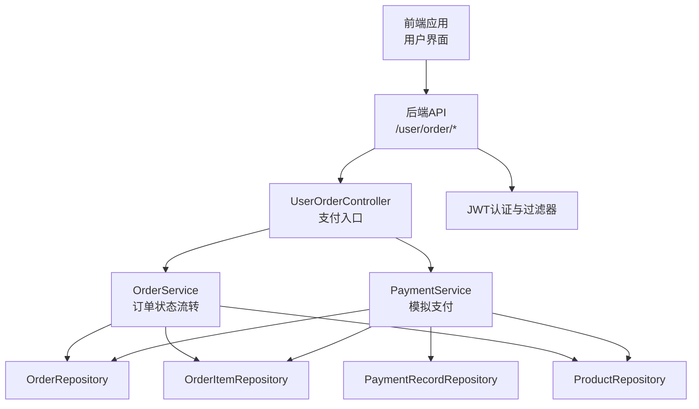
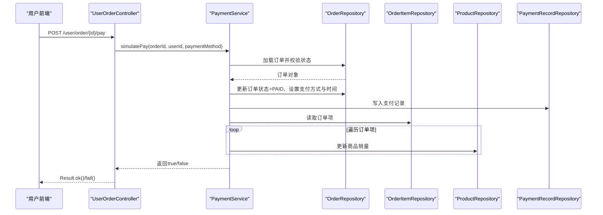
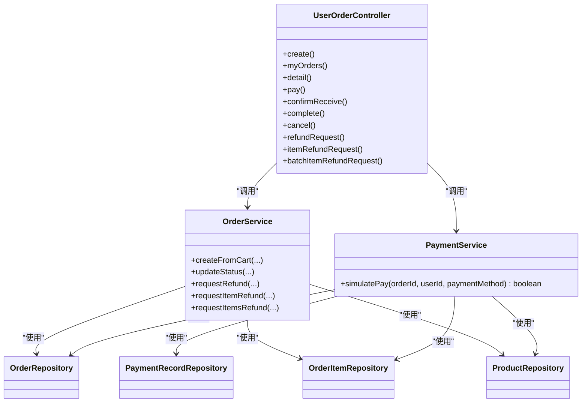

# 支付集成

<cite>
**本文引用的文件**
- [PaymentService.java](file://backend/src/main/java/com/mall/service/PaymentService.java)
- [UserOrderController.java](file://backend/src/main/java/com/mall/controller/user/UserOrderController.java)
- [OrderService.java](file://backend/src/main/java/com/mall/service/OrderService.java)
- [Order.java](file://backend/src/main/java/com/mall/entity/Order.java)
- [OrderItem.java](file://backend/src/main/java/com/mall/entity/OrderItem.java)
- [PaymentRecord.java](file://backend/src/main/java/com/mall/entity/PaymentRecord.java)
- [PaymentRecordRepository.java](file://backend/src/main/java/com/mall/repository/PaymentRecordRepository.java)
- [application.yml](file://backend/src/main/resources/application.yml)
- [JwtUtil.java](file://backend/src/main/java/com/mall/security/JwtUtil.java)
- [JwtAuthFilter.java](file://backend/src/main/java/com/mall/security/JwtAuthFilter.java)
- [SecurityConfig.java](file://backend/src/main/java/com/mall/config/SecurityConfig.java)
- [user.js](file://frontend/src/api/user.js)
- [request.js](file://frontend/src/api/request.js)
- [MyOrders.vue](file://frontend/src/views/user/MyOrders.vue)
- [mall.sql](file://mall.sql)
</cite>

## 目录
1. [简介](#简介)
2. [项目结构](#项目结构)
3. [核心组件](#核心组件)
4. [架构总览](#架构总览)
5. [详细组件分析](#详细组件分析)
6. [依赖分析](#依赖分析)
7. [性能考量](#性能考量)
8. [故障排查指南](#故障排查指南)
9. [结论](#结论)
10. [附录](#附录)

## 简介
本技术文档面向支付集成功能，基于现有代码库梳理出一套“模拟支付”实现方案，覆盖支付流程设计、支付方式集成、支付状态管理、支付记录处理、退款流程设计与安全机制。文档同时给出API定义、回调处理机制的扩展建议、最佳实践与性能优化建议，帮助开发者在不接入第三方支付平台的前提下完成支付闭环，并为后续对接真实支付网关提供清晰的迁移路径。

## 项目结构
后端采用Spring Boot + JPA架构，支付相关模块集中在以下层次：
- 控制器层：用户订单控制器提供支付入口
- 业务层：支付服务与订单服务协同完成支付与退款
- 数据访问层：JPA仓库持久化订单、订单项与支付记录
- 安全层：JWT认证与过滤器保障接口安全
- 前端：通过统一请求封装调用后端接口

图表来源
- [UserOrderController.java:103-111](file://backend/src/main/java/com/mall/controller/user/UserOrderController.java#L103-L111)
- [PaymentService.java:30-65](file://backend/src/main/java/com/mall/service/PaymentService.java#L30-L65)
- [OrderService.java:147-279](file://backend/src/main/java/com/mall/service/OrderService.java#L147-L279)
- [PaymentRecordRepository.java:1-8](file://backend/src/main/java/com/mall/repository/PaymentRecordRepository.java#L1-L8)

章节来源
- [UserOrderController.java:1-198](file://backend/src/main/java/com/mall/controller/user/UserOrderController.java#L1-L198)
- [application.yml:1-36](file://backend/src/main/resources/application.yml#L1-L36)

## 核心组件
- 支付服务：执行模拟支付，更新订单状态、写入支付记录、更新商品销量
- 订单服务：负责下单、状态流转、退款申请与审批
- 支付记录实体：持久化支付信息，保证数据完整性
- 订单实体：承载订单状态、支付方法、金额与时间等字段
- 订单项实体：承载订单项退款状态与数量等字段
- 前端API封装：统一请求与响应处理，自动附加JWT令牌

章节来源
- [PaymentService.java:18-65](file://backend/src/main/java/com/mall/service/PaymentService.java#L18-L65)
- [OrderService.java:25-279](file://backend/src/main/java/com/mall/service/OrderService.java#L25-L279)
- [PaymentRecord.java:9-45](file://backend/src/main/java/com/mall/entity/PaymentRecord.java#L9-L45)
- [Order.java:31-82](file://backend/src/main/java/com/mall/entity/Order.java#L31-L82)
- [OrderItem.java:50-72](file://backend/src/main/java/com/mall/entity/OrderItem.java#L50-L72)
- [user.js:73-76](file://frontend/src/api/user.js#L73-L76)
- [request.js:9-16](file://frontend/src/api/request.js#L9-L16)

## 架构总览
下图展示支付流程在后端的调用链与数据流：

图表来源
- [UserOrderController.java:103-111](file://backend/src/main/java/com/mall/controller/user/UserOrderController.java#L103-L111)
- [PaymentService.java:30-65](file://backend/src/main/java/com/mall/service/PaymentService.java#L30-L65)

## 详细组件分析

### 支付服务 PaymentService
职责与行为
- 接收订单ID、用户ID与支付方式
- 校验订单存在性、归属与状态（仅PENDING）
- 将订单状态置为PAID，记录支付方式、支付时间与金额
- 写入支付记录
- 更新商品销量

事务与一致性
- 使用@Transactional确保支付过程原子性
- 通过Repository顺序操作，避免并发问题

可扩展点
- 支付方式枚举化与默认值策略
- 支付记录扩展字段（如第三方流水号、渠道等）

章节来源
- [PaymentService.java:18-65](file://backend/src/main/java/com/mall/service/PaymentService.java#L18-L65)

### 订单服务 OrderService
职责与行为
- 下单：从购物车聚合商品、扣减库存、生成订单与订单项
- 状态流转：支持收货前取消、确认收货、完成订单
- 退款流程：支持整单、单项与批量单项退款申请，内部同步订单整体退款状态

退款流程细节
- 单项退款：校验状态、数量合法性，必要时拆分子项
- 批量退款：支持按项选择数量，自动拆分与合并
- 订单级同步：当所有子项均退款时，订单整体标记为REFUNDED

章节来源
- [OrderService.java:147-279](file://backend/src/main/java/com/mall/service/OrderService.java#L147-L279)

### 支付记录 PaymentRecord
数据模型
- 关联订单ID与订单号
- 记录支付方式、金额与时间
- 自动填充创建时间

用途
- 作为支付凭证与审计依据
- 便于后续对账与报表统计

章节来源
- [PaymentRecord.java:9-45](file://backend/src/main/java/com/mall/entity/PaymentRecord.java#L9-L45)
- [PaymentRecordRepository.java:1-8](file://backend/src/main/java/com/mall/repository/PaymentRecordRepository.java#L1-L8)

### 订单与订单项 Order/OrderItem
订单状态
- PENDING（待支付）、PAID（已支付）、SHIPPED（已发货）、RECEIVED（已收货）、CANCELLED（已取消）、REFUND_REQUESTED（退款申请中）、REFUNDED（已退款）、COMPLETED（已完成）

退款状态
- null（无申请）、REFUND_REQUESTED（申请中）、REFUNDED（已退款）

章节来源
- [Order.java:31-82](file://backend/src/main/java/com/mall/entity/Order.java#L31-L82)
- [OrderItem.java:50-72](file://backend/src/main/java/com/mall/entity/OrderItem.java#L50-L72)

### 前端支付调用
- 前端通过统一请求封装自动携带Authorization头
- 支付接口调用示例：POST /user/order/{id}/pay
- 成功后刷新订单列表以展示最新状态

章节来源
- [request.js:9-16](file://frontend/src/api/request.js#L9-L16)
- [user.js:73-76](file://frontend/src/api/user.js#L73-L76)
- [MyOrders.vue:727-736](file://frontend/src/views/user/MyOrders.vue#L727-L736)

## 依赖分析
- 控制器依赖服务：UserOrderController依赖OrderService与PaymentService
- 支付服务依赖仓储：PaymentService依赖OrderRepository、OrderItemRepository、ProductRepository、PaymentRecordRepository
- 订单服务依赖仓储：OrderService依赖OrderRepository、OrderItemRepository、ProductRepository
- 安全依赖：JwtUtil与JwtAuthFilter配合SecurityConfig实现无状态认证

图表来源
- [UserOrderController.java:25-26](file://backend/src/main/java/com/mall/controller/user/UserOrderController.java#L25-L26)
- [PaymentService.java:25-28](file://backend/src/main/java/com/mall/service/PaymentService.java#L25-L28)
- [OrderService.java:28-31](file://backend/src/main/java/com/mall/service/OrderService.java#L28-L31)

章节来源
- [UserOrderController.java:1-198](file://backend/src/main/java/com/mall/controller/user/UserOrderController.java#L1-L198)
- [PaymentService.java:1-67](file://backend/src/main/java/com/mall/service/PaymentService.java#L1-L67)
- [OrderService.java:1-280](file://backend/src/main/java/com/mall/service/OrderService.java#L1-L280)

## 性能考量
- 数据库层面
  - 订单与支付记录表具备唯一索引与常用查询字段索引，有利于分页与条件查询
  - 建议在高频查询字段上建立复合索引（如订单号、用户ID、状态、创建时间）
- 事务与锁
  - 支付与库存扣减在同一事务内，避免脏读与超卖风险
  - 建议在高并发场景下对库存字段加乐观锁或悲观锁策略
- 缓存与异步
  - 对热点商品信息与订单概览可引入缓存
  - 支付结果通知与退款审批可异步化，降低主流程阻塞
- 日志与监控
  - 记录关键操作日志与耗时指标，便于定位性能瓶颈

[本节为通用指导，无需特定文件来源]

## 故障排查指南
常见问题与处理
- 支付失败
  - 订单不存在或非当前用户：检查用户身份与订单归属
  - 订单状态非PENDING：确保订单未被其他流程修改
  - 前端提示失败：查看返回的错误信息并重试
- 退款异常
  - 数量不合法：检查请求的数量与可用数量
  - 已申请退款：避免重复提交
  - 订单状态不符：确认订单处于可退款状态
- 安全相关
  - 401/403：前端拦截器会清理本地token并跳转登录页，检查JWT签名与过期时间
  - 角色权限：确保用户角色与接口权限匹配

章节来源
- [UserOrderController.java:92-94](file://backend/src/main/java/com/mall/controller/user/UserOrderController.java#L92-L94)
- [OrderService.java:124-145](file://backend/src/main/java/com/mall/service/OrderService.java#L124-L145)
- [request.js:18-35](file://frontend/src/api/request.js#L18-L35)

## 结论
当前实现提供了完整的“模拟支付”闭环：从前端支付请求、后端支付服务落库、订单状态变更、支付记录写入到商品销量更新，形成可审计、可追踪的数据流。该方案适合快速验证业务流程，在满足合规与安全的前提下，可平滑过渡到真实第三方支付平台。后续建议补充回调通知、对账与风控能力，并完善退款审批流程与多渠道支付方式。

[本节为总结，无需特定文件来源]

## 附录

### 支付接口定义（模拟支付）
- 接口：POST /user/order/{id}/pay
- 请求体（可选）：{ "paymentMethod": "WECHAT|ALIPAY|CARD|COD" }
- 默认值：若未传入支付方式，默认为WECHAT
- 成功返回：Result.ok(null)
- 失败返回：Result.fail("支付失败")

章节来源
- [UserOrderController.java:103-111](file://backend/src/main/java/com/mall/controller/user/UserOrderController.java#L103-L111)
- [user.js:73-76](file://frontend/src/api/user.js#L73-L76)

### 支付状态与退款状态对照
- 订单状态
  - PENDING：待支付
  - PAID：已支付
  - SHIPPED：已发货
  - RECEIVED：已收货
  - CANCELLED：已取消
  - REFUND_REQUESTED：退款申请中
  - REFUNDED：已退款
  - COMPLETED：已完成
- 订单项退款状态
  - null：无申请
  - REFUND_REQUESTED：申请中
  - REFUNDED：已退款

章节来源
- [Order.java:31-82](file://backend/src/main/java/com/mall/entity/Order.java#L31-L82)
- [OrderItem.java:50-72](file://backend/src/main/java/com/mall/entity/OrderItem.java#L50-L72)

### 支付记录表结构（字段说明）
- id：自增主键
- order_id：关联订单ID
- order_no：订单编号
- pay_method：支付方式
- pay_amount：支付金额
- pay_time：支付时间
- created_at：创建时间

章节来源
- [PaymentRecord.java:19-44](file://backend/src/main/java/com/mall/entity/PaymentRecord.java#L19-L44)
- [mall.sql:296-306](file://mall.sql#L296-L306)

### 安全机制与最佳实践
- JWT认证
  - 后端通过JwtAuthFilter解析Authorization头，注入认证上下文
  - SecurityConfig配置各接口角色权限
- 最佳实践
  - 严格校验用户与订单归属
  - 事务内完成支付与库存扣减
  - 记录支付与退款操作日志
  - 前端统一拦截401/403并引导重新登录

章节来源
- [JwtAuthFilter.java:30-55](file://backend/src/main/java/com/mall/security/JwtAuthFilter.java#L30-L55)
- [SecurityConfig.java:33-55](file://backend/src/main/java/com/mall/config/SecurityConfig.java#L33-L55)
- [request.js:9-16](file://frontend/src/api/request.js#L9-L16)

### 回调处理与对账（扩展建议）
- 回调通知
  - 在真实支付平台接入后，建议新增回调接收接口，验证签名与幂等性
  - 回调成功后更新订单状态与支付记录
- 对账
  - 定期比对第三方流水与本地支付记录，发现差异及时处理
- 异常处理
  - 回调失败重试与死信队列，确保最终一致性

[本节为概念性建议，无需特定文件来源]

### 性能优化建议
- 数据库
  - 为订单号、用户ID、状态、创建时间建立索引
  - 分页查询使用覆盖索引
- 缓存
  - 商品详情与热门订单概览缓存
- 异步
  - 支付结果通知与退款审批异步化
- 监控
  - 关键接口埋点与告警

[本节为通用指导，无需特定文件来源]