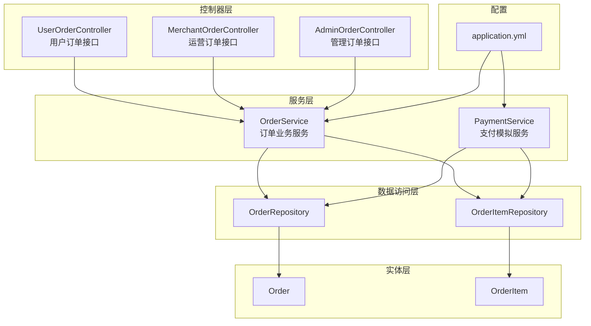
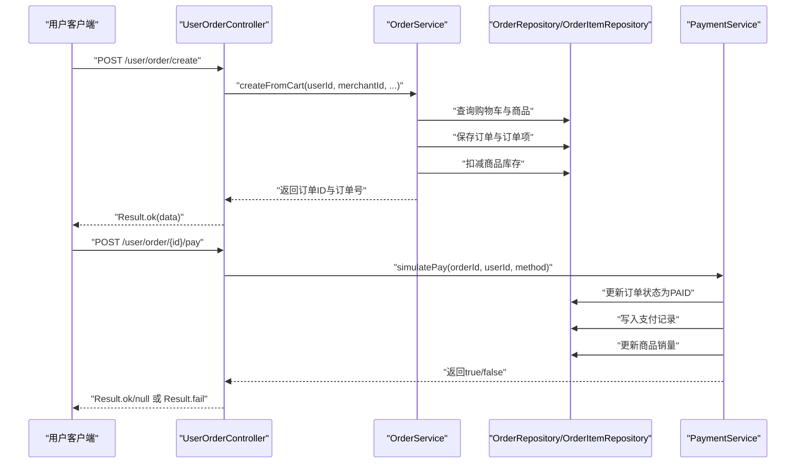
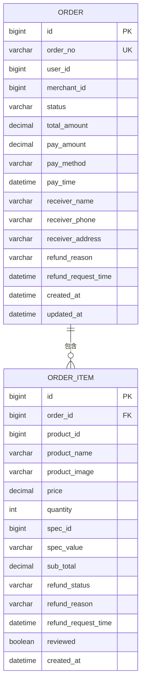
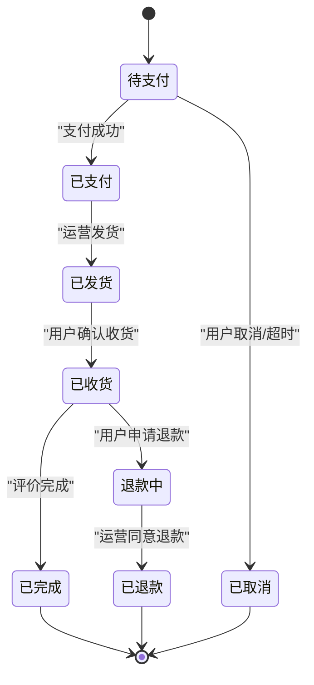
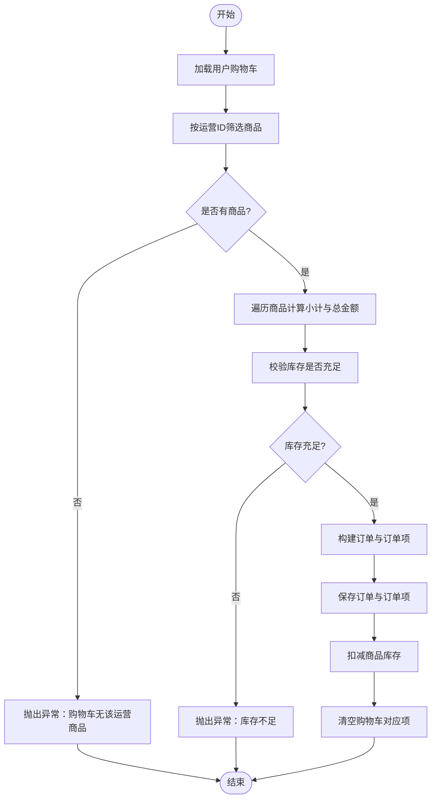
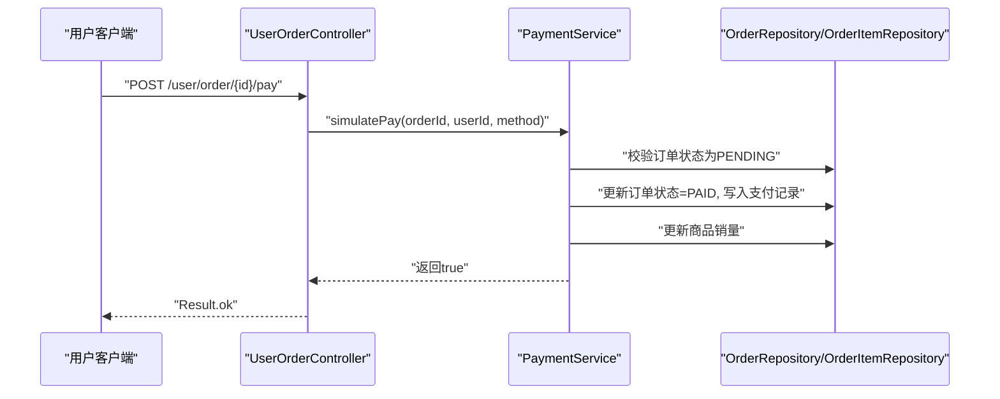
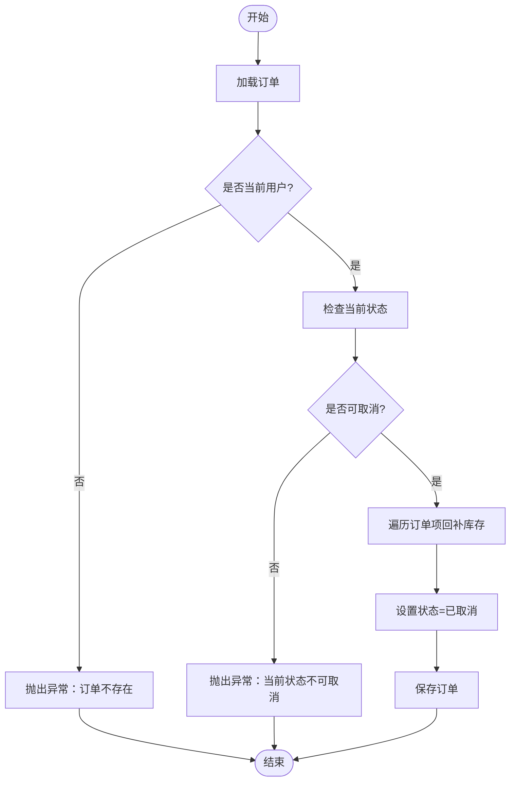
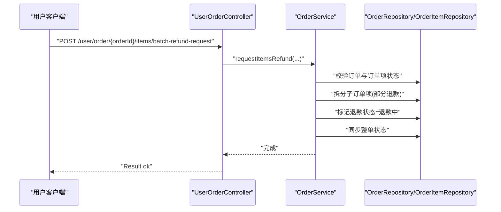
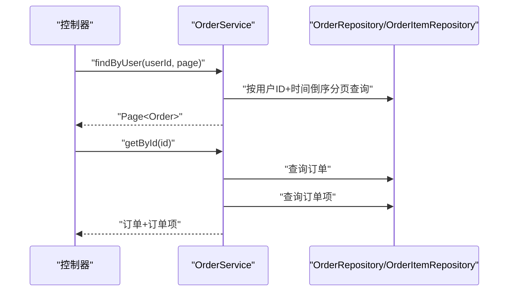
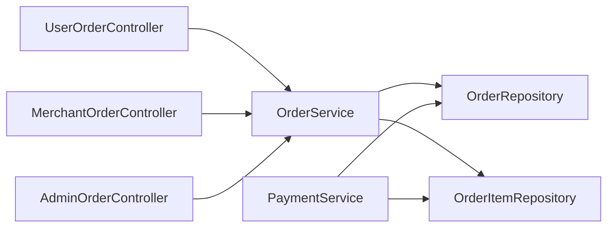

# 订单处理

<cite>
**本文引用的文件**
- [Order.java](file://backend/src/main/java/com/mall/entity/Order.java)
- [OrderItem.java](file://backend/src/main/java/com/mall/entity/OrderItem.java)
- [OrderService.java](file://backend/src/main/java/com/mall/service/OrderService.java)
- [OrderRepository.java](file://backend/src/main/java/com/mall/repository/OrderRepository.java)
- [OrderItemRepository.java](file://backend/src/main/java/com/mall/repository/OrderItemRepository.java)
- [UserOrderController.java](file://backend/src/main/java/com/mall/controller/user/UserOrderController.java)
- [MerchantOrderController.java](file://backend/src/main/java/com/mall/controller/merchant/MerchantOrderController.java)
- [AdminOrderController.java](file://backend/src/main/java/com/mall/controller/admin/AdminOrderController.java)
- [PaymentService.java](file://backend/src/main/java/com/mall/service/PaymentService.java)
- [application.yml](file://backend/src/main/resources/application.yml)
- [Result.java](file://backend/src/main/java/com/mall/dto/Result.java)
</cite>

## 目录
1. [简介](#简介)
2. [项目结构](#项目结构)
3. [核心组件](#核心组件)
4. [架构总览](#架构总览)
5. [详细组件分析](#详细组件分析)
6. [依赖分析](#依赖分析)
7. [性能考虑](#性能考虑)
8. [故障排查指南](#故障排查指南)
9. [结论](#结论)
10. [附录](#附录)

## 简介
本技术文档围绕订单处理功能进行全面梳理，覆盖订单创建、订单状态管理、订单查询、订单取消、退款申请与审批、库存扣减与回补等核心业务流程。文档从系统架构、数据模型、API 接口、状态转换规则、异常处理与性能优化等方面进行深入分析，帮助开发者正确实现订单处理的完整流程。

## 项目结构
后端采用 Spring Boot + JPA 的分层架构：
- 控制器层：用户端、运营端、管理端分别提供订单相关接口
- 服务层：封装订单业务逻辑，包括创建、状态变更、退款、库存扣减与回补
- 数据访问层：基于 JPA Repository 提供订单与订单项的持久化查询
- 实体层：订单与订单项的数据模型定义
- 配置层：数据库连接、JPA、JWT 等配置

图表来源
- [UserOrderController.java:19-198](file://backend/src/main/java/com/mall/controller/user/UserOrderController.java#L19-L198)
- [MerchantOrderController.java:20-100](file://backend/src/main/java/com/mall/controller/merchant/MerchantOrderController.java#L20-L100)
- [AdminOrderController.java:17-45](file://backend/src/main/java/com/mall/controller/admin/AdminOrderController.java#L17-L45)
- [OrderService.java:23-280](file://backend/src/main/java/com/mall/service/OrderService.java#L23-L280)
- [PaymentService.java:23-67](file://backend/src/main/java/com/mall/service/PaymentService.java#L23-L67)
- [OrderRepository.java:13-27](file://backend/src/main/java/com/mall/repository/OrderRepository.java#L13-L27)
- [OrderItemRepository.java:9-19](file://backend/src/main/java/com/mall/repository/OrderItemRepository.java#L9-L19)
- [Order.java:9-82](file://backend/src/main/java/com/mall/entity/Order.java#L9-L82)
- [OrderItem.java:9-72](file://backend/src/main/java/com/mall/entity/OrderItem.java#L9-L72)
- [application.yml:1-36](file://backend/src/main/resources/application.yml#L1-L36)

章节来源
- [application.yml:1-36](file://backend/src/main/resources/application.yml#L1-L36)

## 核心组件
- 订单实体 Order：描述订单基本信息、收货信息、支付信息、退款信息及时间戳
- 订单项实体 OrderItem：描述订单内单项商品信息、单价、数量、小计、退款状态与评价标记
- 订单服务 OrderService：负责订单创建、查询、状态变更、取消、退款申请与审批、库存扣减与回补
- 支付服务 PaymentService：模拟支付，设置订单为已支付、写入支付记录、更新商品销量
- 订单控制器 UserOrderController / MerchantOrderController / AdminOrderController：提供 REST API 接口
- 订单仓库 OrderRepository / OrderItemRepository：提供分页查询、按用户/运营/状态查询等

章节来源
- [Order.java:9-82](file://backend/src/main/java/com/mall/entity/Order.java#L9-L82)
- [OrderItem.java:9-72](file://backend/src/main/java/com/mall/entity/OrderItem.java#L9-L72)
- [OrderService.java:23-280](file://backend/src/main/java/com/mall/service/OrderService.java#L23-L280)
- [PaymentService.java:23-67](file://backend/src/main/java/com/mall/service/PaymentService.java#L23-L67)
- [OrderRepository.java:13-27](file://backend/src/main/java/com/mall/repository/OrderRepository.java#L13-L27)
- [OrderItemRepository.java:9-19](file://backend/src/main/java/com/mall/repository/OrderItemRepository.java#L9-L19)

## 架构总览
订单处理涉及“用户下单 → 支付 → 发货 → 收货 → 退款/完成”的完整生命周期。系统通过控制器接收请求，调用服务层执行业务逻辑，服务层协调仓库层读写数据库，同时在必要时联动支付服务与库存扣减/回补。

图表来源
- [UserOrderController.java:34-111](file://backend/src/main/java/com/mall/controller/user/UserOrderController.java#L34-L111)
- [OrderService.java:34-88](file://backend/src/main/java/com/mall/service/OrderService.java#L34-L88)
- [PaymentService.java:30-65](file://backend/src/main/java/com/mall/service/PaymentService.java#L30-L65)

## 详细组件分析

### 数据模型与关系
订单与订单项采用一对多关系：一个订单包含多个订单项。订单项中包含商品快照信息（名称、图片、价格），便于后续审计与退款处理。

图表来源
- [Order.java:18-81](file://backend/src/main/java/com/mall/entity/Order.java#L18-L81)
- [OrderItem.java:18-71](file://backend/src/main/java/com/mall/entity/OrderItem.java#L18-L71)

章节来源
- [Order.java:9-82](file://backend/src/main/java/com/mall/entity/Order.java#L9-L82)
- [OrderItem.java:9-72](file://backend/src/main/java/com/mall/entity/OrderItem.java#L9-L72)

### 订单生命周期与状态转换
订单状态包括：PENDING（待支付）、PAID（已支付）、SHIPPED（已发货）、RECEIVED（已收货）、CANCELLED（已取消）、REFUND_REQUESTED（退款中）、REFUNDED（已退款）、COMPLETED（已完成）。

图表来源
- [OrderService.java:116-161](file://backend/src/main/java/com/mall/service/OrderService.java#L116-L161)
- [OrderService.java:257-278](file://backend/src/main/java/com/mall/service/OrderService.java#L257-L278)
- [UserOrderController.java:113-133](file://backend/src/main/java/com/mall/controller/user/UserOrderController.java#L113-L133)
- [MerchantOrderController.java:61-85](file://backend/src/main/java/com/mall/controller/merchant/MerchantOrderController.java#L61-L85)

章节来源
- [OrderService.java:115-161](file://backend/src/main/java/com/mall/service/OrderService.java#L115-L161)
- [OrderService.java:254-278](file://backend/src/main/java/com/mall/service/OrderService.java#L254-L278)
- [UserOrderController.java:113-133](file://backend/src/main/java/com/mall/controller/user/UserOrderController.java#L113-L133)
- [MerchantOrderController.java:61-85](file://backend/src/main/java/com/mall/controller/merchant/MerchantOrderController.java#L61-L85)

### 订单创建流程
- 从购物车筛选属于同一运营的商品
- 校验库存充足性
- 计算订单总金额，生成订单号
- 保存订单与订单项，并扣减对应商品库存
- 清空已下单的购物车项

图表来源
- [OrderService.java:34-88](file://backend/src/main/java/com/mall/service/OrderService.java#L34-L88)

章节来源
- [OrderService.java:34-88](file://backend/src/main/java/com/mall/service/OrderService.java#L34-L88)

### 支付与状态更新
- 用户点击支付后，调用支付服务将订单状态置为已支付，写入支付记录，并更新商品销量
- 支付前置条件：订单存在、属于当前用户、状态为待支付

图表来源
- [UserOrderController.java:103-111](file://backend/src/main/java/com/mall/controller/user/UserOrderController.java#L103-L111)
- [PaymentService.java:30-65](file://backend/src/main/java/com/mall/service/PaymentService.java#L30-L65)

章节来源
- [UserOrderController.java:103-111](file://backend/src/main/java/com/mall/controller/user/UserOrderController.java#L103-L111)
- [PaymentService.java:30-65](file://backend/src/main/java/com/mall/service/PaymentService.java#L30-L65)

### 订单取消与库存回补
- 用户在特定状态下可取消订单（除已收货、退款中、已退款、已取消）
- 取消时回补相应商品库存，更新订单状态为已取消

图表来源
- [OrderService.java:123-145](file://backend/src/main/java/com/mall/service/OrderService.java#L123-L145)

章节来源
- [OrderService.java:123-145](file://backend/src/main/java/com/mall/service/OrderService.java#L123-L145)

### 退款申请与审批
- 用户可在已收货或退款中状态下申请整单或单项退款
- 支持部分数量退款：拆分子订单项，保留剩余数量，新增退款申请项
- 运营同意单项退款后，若所有有申请的项均已完成退款，则整单标记为已退款

图表来源
- [UserOrderController.java:170-196](file://backend/src/main/java/com/mall/controller/user/UserOrderController.java#L170-L196)
- [OrderService.java:187-240](file://backend/src/main/java/com/mall/service/OrderService.java#L187-L240)
- [OrderService.java:254-278](file://backend/src/main/java/com/mall/service/OrderService.java#L254-L278)

章节来源
- [UserOrderController.java:146-196](file://backend/src/main/java/com/mall/controller/user/UserOrderController.java#L146-L196)
- [OrderService.java:147-278](file://backend/src/main/java/com/mall/service/OrderService.java#L147-L278)

### 订单查询与分页
- 用户：按用户ID分页查询，支持查询订单详情与订单项
- 运营：按运营ID分页查询，支持查询订单详情与订单项
- 管理：全站订单分页查询，支持查询订单详情与订单项

图表来源
- [UserOrderController.java:52-100](file://backend/src/main/java/com/mall/controller/user/UserOrderController.java#L52-L100)
- [MerchantOrderController.java:37-59](file://backend/src/main/java/com/mall/controller/merchant/MerchantOrderController.java#L37-L59)
- [AdminOrderController.java:25-43](file://backend/src/main/java/com/mall/controller/admin/AdminOrderController.java#L25-L43)
- [OrderRepository.java:17-21](file://backend/src/main/java/com/mall/repository/OrderRepository.java#L17-L21)
- [OrderItemRepository.java:10-14](file://backend/src/main/java/com/mall/repository/OrderItemRepository.java#L10-L14)

章节来源
- [UserOrderController.java:52-100](file://backend/src/main/java/com/mall/controller/user/UserOrderController.java#L52-L100)
- [MerchantOrderController.java:37-59](file://backend/src/main/java/com/mall/controller/merchant/MerchantOrderController.java#L37-L59)
- [AdminOrderController.java:25-43](file://backend/src/main/java/com/mall/controller/admin/AdminOrderController.java#L25-L43)
- [OrderRepository.java:17-21](file://backend/src/main/java/com/mall/repository/OrderRepository.java#L17-L21)
- [OrderItemRepository.java:10-14](file://backend/src/main/java/com/mall/repository/OrderItemRepository.java#L10-L14)

## 依赖分析
- 控制器依赖服务层，服务层依赖仓库层与实体模型
- 支付服务依赖订单与订单项仓库，用于更新状态、写入支付记录与更新销量
- 仓库层基于 JPA 提供分页与条件查询能力

图表来源
- [UserOrderController.java:25-26](file://backend/src/main/java/com/mall/controller/user/UserOrderController.java#L25-L26)
- [MerchantOrderController.java:26-27](file://backend/src/main/java/com/mall/controller/merchant/MerchantOrderController.java#L26-L27)
- [AdminOrderController.java](file://backend/src/main/java/com/mall/controller/admin/AdminOrderController.java#L23)
- [OrderService.java:28-31](file://backend/src/main/java/com/mall/service/OrderService.java#L28-L31)
- [PaymentService.java:25-28](file://backend/src/main/java/com/mall/service/PaymentService.java#L25-L28)

章节来源
- [OrderService.java:28-31](file://backend/src/main/java/com/mall/service/OrderService.java#L28-L31)
- [PaymentService.java:25-28](file://backend/src/main/java/com/mall/service/PaymentService.java#L25-L28)

## 性能考虑
- 事务边界：订单创建、取消、退款、支付等关键流程使用事务保证一致性
- 批量操作：批量申请退款时对订单项进行拆分与保存，建议控制单次批量大小以避免长事务
- 分页查询：用户、运营、管理端均使用分页查询，避免一次性加载大量数据
- 索引建议：对订单表的 user_id、merchant_id、status、created_at 建立索引以提升查询性能
- 缓存策略：可对热点商品库存与销量进行缓存，减少数据库压力（需结合实际场景评估）

## 故障排查指南
- 订单不存在：控制器会校验订单归属与存在性，若失败返回错误结果
- 状态非法：如在已收货后仍尝试取消或在非待支付状态尝试支付，服务层会抛出异常
- 库存不足：下单时若商品库存小于购买数量，会抛出异常
- 退款数量不合法：部分退款时数量必须在可用范围内，否则抛出异常
- 支付前置条件：仅待支付订单可支付，否则返回失败

章节来源
- [UserOrderController.java:90-133](file://backend/src/main/java/com/mall/controller/user/UserOrderController.java#L90-L133)
- [MerchantOrderController.java:61-85](file://backend/src/main/java/com/mall/controller/merchant/MerchantOrderController.java#L61-L85)
- [OrderService.java:49-51](file://backend/src/main/java/com/mall/service/OrderService.java#L49-L51)
- [OrderService.java:127-133](file://backend/src/main/java/com/mall/service/OrderService.java#L127-L133)
- [OrderService.java:196-210](file://backend/src/main/java/com/mall/service/OrderService.java#L196-L210)
- [PaymentService.java:32-36](file://backend/src/main/java/com/mall/service/PaymentService.java#L32-L36)

## 结论
本订单处理系统通过清晰的分层架构与完善的业务流程，实现了从下单、支付、发货、收货到退款的全链路管理。服务层承担了库存扣减、状态转换与退款处理的核心逻辑，控制器层提供 REST API 适配用户、运营与管理端需求。建议在生产环境中进一步完善并发控制、幂等性保障与监控告警，以提升系统的稳定性与可观测性。

## 附录

### API 接口清单
- 用户端
  - POST /user/order/create：从购物车创建订单
  - GET /user/order：分页查询我的订单（含订单项）
  - GET /user/order/{id}：查询订单详情（含订单项）
  - POST /user/order/{id}/pay：模拟支付
  - POST /user/order/{id}/confirm-receive：确认收货
  - POST /user/order/{id}/complete：完成订单
  - POST /user/order/{id}/cancel：取消订单
  - POST /user/order/{id}/refund-request：整单退款申请
  - POST /user/order/{orderId}/items/{itemId}/refund-request：单项退款申请
  - POST /user/order/{orderId}/items/batch-refund-request：批量单项退款申请

- 运营端
  - GET /merchant/order：分页查询运营订单
  - GET /merchant/order/{id}：查询运营订单详情（含订单项）
  - POST /merchant/order/{id}/ship：发货
  - POST /merchant/order/{id}/accept-refund：同意整单退款
  - POST /merchant/order/{orderId}/items/{itemId}/accept-refund：同意单项退款

- 管理端
  - GET /admin/order：分页查询全站订单
  - GET /admin/order/{id}：查询订单详情（含订单项）

章节来源
- [UserOrderController.java:34-196](file://backend/src/main/java/com/mall/controller/user/UserOrderController.java#L34-L196)
- [MerchantOrderController.java:37-100](file://backend/src/main/java/com/mall/controller/merchant/MerchantOrderController.java#L37-L100)
- [AdminOrderController.java:25-43](file://backend/src/main/java/com/mall/controller/admin/AdminOrderController.java#L25-L43)

### 数据模型字段说明
- 订单（Order）
  - 订单号、用户ID、运营ID、状态、总金额、实付金额、支付方式、支付时间、收货人、电话、地址、退款原因、退款申请时间、创建/更新时间
- 订单项（OrderItem）
  - 订单ID、商品ID、商品名称、商品图片、单价、数量、规格ID、规格值、小计、退款状态、退款原因、退款申请时间、是否已评价、创建时间

章节来源
- [Order.java:22-70](file://backend/src/main/java/com/mall/entity/Order.java#L22-L70)
- [OrderItem.java:22-63](file://backend/src/main/java/com/mall/entity/OrderItem.java#L22-L63)

### 最佳实践
- 幂等性：支付、发货、确认收货、退款审批等接口应具备幂等保护
- 并发控制：库存扣减与回补需在事务内完成，避免超卖与重复回补
- 日志与追踪：为关键业务节点添加日志与链路追踪，便于问题定位
- 异常分类：对业务异常与系统异常进行区分，返回统一的错误码与提示
- 安全性：接口鉴权与参数校验缺一不可，防止越权与注入攻击