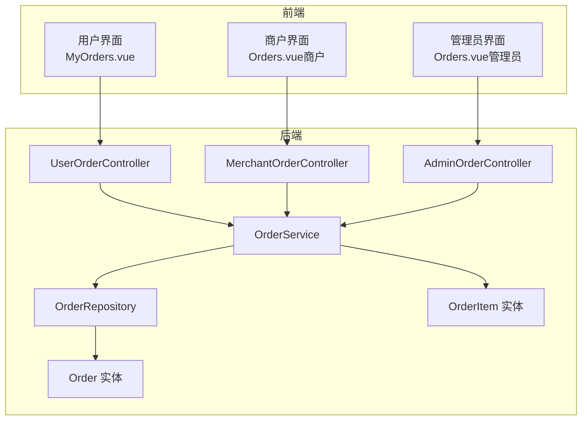
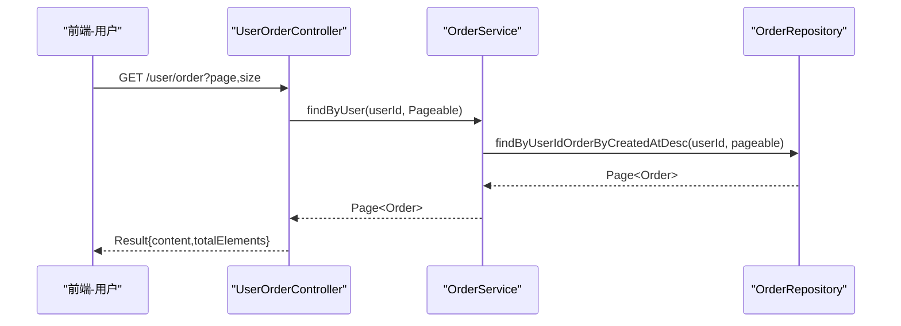
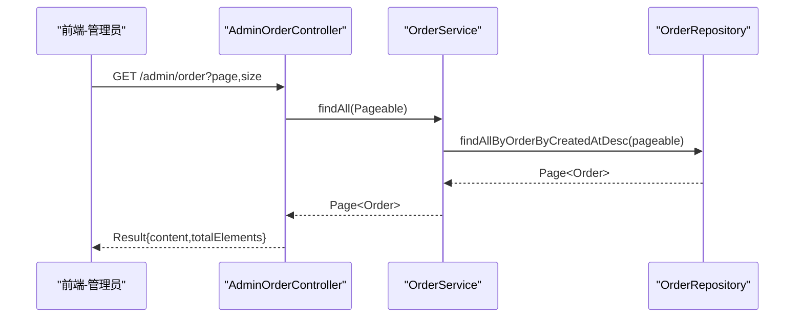
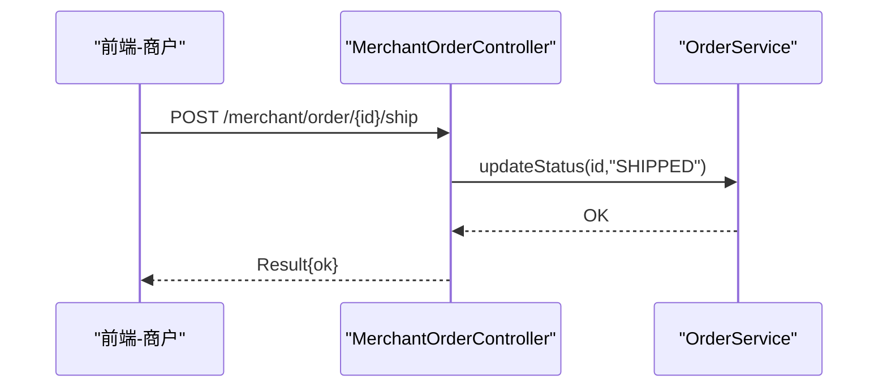
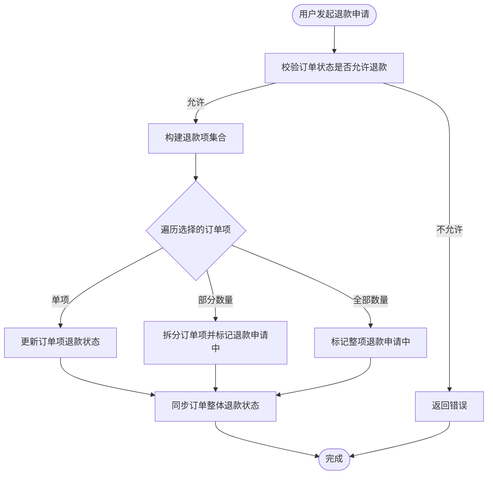
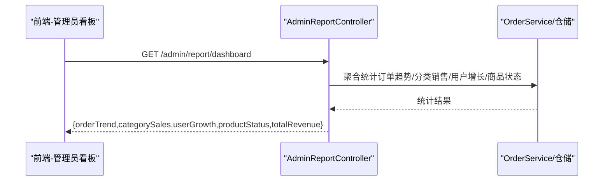
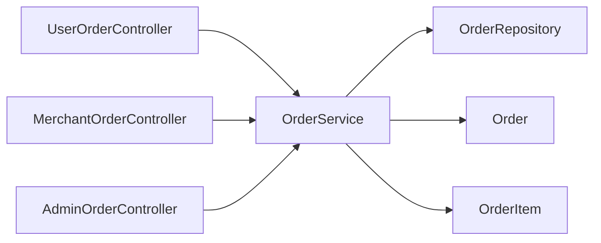
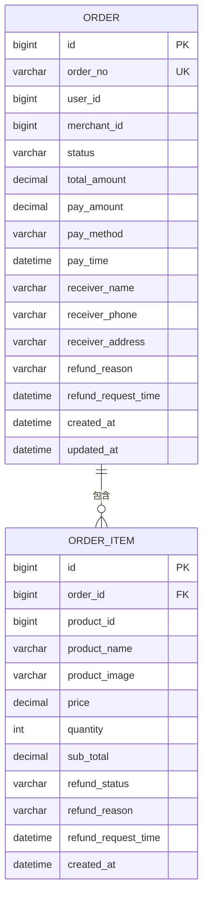

# 订单查询与分析

<cite>
**本文引用的文件**
- [AdminOrderController.java](file://backend/src/main/java/com/mall/controller/admin/AdminOrderController.java)
- [MerchantOrderController.java](file://backend/src/main/java/com/mall/controller/merchant/MerchantOrderController.java)
- [UserOrderController.java](file://backend/src/main/java/com/mall/controller/user/UserOrderController.java)
- [OrderService.java](file://backend/src/main/java/com/mall/service/OrderService.java)
- [OrderRepository.java](file://backend/src/main/java/com/mall/repository/OrderRepository.java)
- [Order.java](file://backend/src/main/java/com/mall/entity/Order.java)
- [OrderItem.java](file://backend/src/main/java/com/mall/entity/OrderItem.java)
- [application.yml](file://backend/src/main/resources/application.yml)
- [Orders.vue（管理员）](file://frontend/src/views/admin/Orders.vue)
- [Orders.vue（商户）](file://frontend/src/views/merchant/Orders.vue)
- [MyOrders.vue（用户）](file://frontend/src/views/user/MyOrders.vue)
- [user.js](file://frontend/src/api/user.js)
- [merchant.js](file://frontend/src/api/merchant.js)
- [admin.js](file://frontend/src/api/admin.js)
- [AdminReportController.java](file://backend/src/main/java/com/mall/controller/admin/AdminReportController.java)
</cite>

## 目录
1. [简介](#简介)
2. [项目结构](#项目结构)
3. [核心组件](#核心组件)
4. [架构总览](#架构总览)
5. [详细组件分析](#详细组件分析)
6. [依赖分析](#依赖分析)
7. [性能考虑](#性能考虑)
8. [故障排查指南](#故障排查指南)
9. [结论](#结论)
10. [附录](#附录)

## 简介
本技术文档围绕“订单查询与分析”主题，系统化梳理后端控制器、服务层、仓储层与前端视图之间的协作关系，覆盖以下关键能力：
- 订单查询接口设计：管理员、商户、用户三端分页查询与详情查询
- 订单统计分析：管理员看板的订单趋势、分类销售占比等指标
- 销售报表生成：基于聚合统计的可视化数据源
- 订单数据分析：按状态、时间、用户、商户维度的统计口径
- 角色化查询需求：管理员全站订单管理、商户本店订单与发货退款、用户个人订单历史
- 查询API规范：查询参数、筛选条件、排序规则、分页机制
- 数据模型与算法：订单与订单项的实体模型、退款与状态同步算法
- 性能优化策略：分页查询、索引建议、缓存与批量处理

## 项目结构
后端采用Spring Boot + Spring Data JPA，三层结构清晰：
- 控制器层：AdminOrderController、MerchantOrderController、UserOrderController
- 服务层：OrderService封装业务逻辑与事务控制
- 仓储层：OrderRepository提供分页查询与自定义查询
- 实体层：Order、OrderItem承载订单与明细数据
- 前端采用Vue + Element UI + ECharts，分别提供管理员、商户、用户的订单视图与交互

**图表来源**
- [UserOrderController.java:19-198](file://backend/src/main/java/com/mall/controller/user/UserOrderController.java#L19-L198)
- [MerchantOrderController.java:20-100](file://backend/src/main/java/com/mall/controller/merchant/MerchantOrderController.java#L20-L100)
- [AdminOrderController.java:17-45](file://backend/src/main/java/com/mall/controller/admin/AdminOrderController.java#L17-L45)
- [OrderService.java:23-280](file://backend/src/main/java/com/mall/service/OrderService.java#L23-L280)
- [OrderRepository.java:13-27](file://backend/src/main/java/com/mall/repository/OrderRepository.java#L13-L27)
- [Order.java:9-83](file://backend/src/main/java/com/mall/entity/Order.java#L9-L83)
- [OrderItem.java:9-73](file://backend/src/main/java/com/mall/entity/OrderItem.java#L9-L73)

**章节来源**
- [application.yml:1-36](file://backend/src/main/resources/application.yml#L1-L36)

## 核心组件
- 控制器层
  - 管理端：AdminOrderController提供全站订单分页查询与订单详情
  - 商户端：MerchantOrderController提供本店订单分页、详情、发货、同意退款、单项退款
  - 用户端：UserOrderController提供我的订单分页、详情、支付、收货、取消、退款申请与单项/批量退款
- 服务层：OrderService统一处理下单、查询、状态更新、退款申请与审批、库存回补等
- 仓储层：OrderRepository提供按用户、商户、全站的分页查询与自定义查询
- 实体层：Order与OrderItem承载订单主表与明细表字段，支持退款状态与评价标记

**章节来源**
- [AdminOrderController.java:17-45](file://backend/src/main/java/com/mall/controller/admin/AdminOrderController.java#L17-L45)
- [MerchantOrderController.java:20-100](file://backend/src/main/java/com/mall/controller/merchant/MerchantOrderController.java#L20-L100)
- [UserOrderController.java:19-198](file://backend/src/main/java/com/mall/controller/user/UserOrderController.java#L19-L198)
- [OrderService.java:23-280](file://backend/src/main/java/com/mall/service/OrderService.java#L23-L280)
- [OrderRepository.java:13-27](file://backend/src/main/java/com/mall/repository/OrderRepository.java#L13-L27)
- [Order.java:9-83](file://backend/src/main/java/com/mall/entity/Order.java#L9-L83)
- [OrderItem.java:9-73](file://backend/src/main/java/com/mall/entity/OrderItem.java#L9-L73)

## 架构总览
后端通过REST接口向三端提供订单能力，前端以组件形式呈现不同角色的订单管理界面。

**图表来源**
- [UserOrderController.java:52-86](file://backend/src/main/java/com/mall/controller/user/UserOrderController.java#L52-L86)
- [OrderService.java:95-98](file://backend/src/main/java/com/mall/service/OrderService.java#L95-L98)
- [OrderRepository.java:17-17](file://backend/src/main/java/com/mall/repository/OrderRepository.java#L17-L17)

**章节来源**
- [application.yml:22-25](file://backend/src/main/resources/application.yml#L22-L25)

## 详细组件分析

### 管理员订单管理
- 接口能力
  - 分页查询全站订单：GET /admin/order?page=&size=
  - 订单详情（含订单项）：GET /admin/order/{id}
- 前端视图
  - Orders.vue（管理员）展示订单号、用户ID、运营ID、金额、状态、下单时间，支持分页与状态文本映射
- 关键点
  - 控制器直接调用OrderService分页查询
  - 详情接口组合订单与订单项返回

**图表来源**
- [AdminOrderController.java:25-31](file://backend/src/main/java/com/mall/controller/admin/AdminOrderController.java#L25-L31)
- [OrderService.java:105-108](file://backend/src/main/java/com/mall/service/OrderService.java#L105-L108)
- [OrderRepository.java:21-21](file://backend/src/main/java/com/mall/repository/OrderRepository.java#L21-L21)

**章节来源**
- [AdminOrderController.java:17-45](file://backend/src/main/java/com/mall/controller/admin/AdminOrderController.java#L17-L45)
- [Orders.vue（管理员）:1-66](file://frontend/src/views/admin/Orders.vue#L1-L66)
- [admin.js:78-86](file://frontend/src/api/admin.js#L78-L86)

### 商户订单统计与操作
- 接口能力
  - 分页查询本店订单：GET /merchant/order?page=&size=
  - 订单详情（含订单项）：GET /merchant/order/{id}
  - 发货：POST /merchant/order/{id}/ship（仅已支付订单）
  - 同意退款：POST /merchant/order/{id}/accept-refund（仅退款申请中）
  - 单项退款审批：POST /merchant/order/{orderId}/items/{itemId}/accept-refund
- 前端视图
  - Orders.vue（商户）展示订单号、金额、状态、下单时间与发货/查看退货原因按钮，支持状态标签类型映射
- 关键点
  - 控制器从认证上下文解析当前商户ID，校验订单归属
  - 发货与退款均进行状态前置判断与错误提示

**图表来源**
- [MerchantOrderController.java:62-71](file://backend/src/main/java/com/mall/controller/merchant/MerchantOrderController.java#L62-L71)
- [OrderService.java:115-121](file://backend/src/main/java/com/mall/service/OrderService.java#L115-L121)

**章节来源**
- [MerchantOrderController.java:20-100](file://backend/src/main/java/com/mall/controller/merchant/MerchantOrderController.java#L20-L100)
- [Orders.vue（商户）:1-203](file://frontend/src/views/merchant/Orders.vue#L1-L203)
- [merchant.js:112-120](file://frontend/src/api/merchant.js#L112-L120)

### 用户订单历史查询
- 接口能力
  - 我的订单分页：GET /user/order?page=&size=
  - 订单详情（含订单项）：GET /user/order/{id}
  - 支付：POST /user/order/{id}/pay
  - 确认收货：POST /user/order/{id}/confirm-receive
  - 完成订单：POST /user/order/{id}/complete
  - 取消订单（收货前）：POST /user/order/{id}/cancel
  - 退款申请（整单/单项/批量）：POST /user/order/{id}/refund-request 或 /{orderId}/items/{itemId}/ 或 /{orderId}/items/batch-refund-request
- 前端视图
  - MyOrders.vue（用户）提供状态筛选、关键词搜索、分页、统计卡片、支付/取消/收货/评价/详情等操作
- 关键点
  - 控制器从认证上下文解析当前用户ID，校验订单归属
  - 退款申请支持单项与批量，涉及订单项拆分与状态同步

**图表来源**
- [UserOrderController.java:146-196](file://backend/src/main/java/com/mall/controller/user/UserOrderController.java#L146-L196)
- [OrderService.java:166-240](file://backend/src/main/java/com/mall/service/OrderService.java#L166-L240)

**章节来源**
- [UserOrderController.java:19-198](file://backend/src/main/java/com/mall/controller/user/UserOrderController.java#L19-L198)
- [MyOrders.vue（用户）:1-800](file://frontend/src/views/user/MyOrders.vue#L1-L800)
- [user.js:63-112](file://frontend/src/api/user.js#L63-L112)

### 订单统计分析与销售报表
- 管理端看板接口
  - GET /admin/report/dashboard 返回总交易额、最近7天订单趋势、分类销售占比、用户增长趋势、商品状态分布等
- 统计算法要点
  - 订单趋势：按自然日统计有效订单（排除PENDING/CANCELLED）
  - 分类销售占比：按商品销量聚合到分类维度
- 前端可视化
  - Dashboard.vue使用ECharts渲染折线图、饼图等

**图表来源**
- [AdminReportController.java:59-122](file://backend/src/main/java/com/mall/controller/admin/AdminReportController.java#L59-L122)

**章节来源**
- [AdminReportController.java:59-122](file://backend/src/main/java/com/mall/controller/admin/AdminReportController.java#L59-L122)
- [Orders.vue（管理员）:1-66](file://frontend/src/views/admin/Orders.vue#L1-L66)

## 依赖分析
- 控制器依赖服务层，服务层依赖仓储层
- 服务层在退款与状态同步时，需读取订单项并回写订单状态
- 前端通过API模块调用后端接口，传递分页参数与业务数据

**图表来源**
- [UserOrderController.java:25-26](file://backend/src/main/java/com/mall/controller/user/UserOrderController.java#L25-L26)
- [MerchantOrderController.java:26-27](file://backend/src/main/java/com/mall/controller/merchant/MerchantOrderController.java#L26-L27)
- [AdminOrderController.java:23-23](file://backend/src/main/java/com/mall/controller/admin/AdminOrderController.java#L23-L23)
- [OrderService.java:28-31](file://backend/src/main/java/com/mall/service/OrderService.java#L28-L31)
- [OrderRepository.java:13-13](file://backend/src/main/java/com/mall/repository/OrderRepository.java#L13-L13)

**章节来源**
- [OrderService.java:23-280](file://backend/src/main/java/com/mall/service/OrderService.java#L23-L280)

## 性能考虑
- 分页查询
  - 后端统一使用Pageable进行分页，避免一次性加载全量数据
  - 前端分页组件与后端分页返回结构一致，减少内存压力
- 排序规则
  - 默认按创建时间倒序，保证最新订单优先展示
- 数据访问
  - 使用JPA分页方法与自定义查询，避免N+1问题
- 索引建议
  - 在orders表上为user_id、merchant_id、created_at建立合适索引，提升分页与筛选效率
- 批量处理
  - 退款批量申请时，尽量合并数据库写入次数，减少事务开销
- 缓存与异步
  - 对高频报表（如看板数据）可引入缓存或定时任务预计算，降低实时查询压力

## 故障排查指南
- 常见错误与定位
  - 订单不存在/越权：控制器在查询或操作前校验订单归属，若返回“订单不存在”，检查用户ID/商户ID与订单绑定关系
  - 状态非法：发货要求“已支付”，退款要求“已收货”或“退款申请中”，否则返回错误提示
  - 库存不足：下单时若商品库存不足，抛出异常，需提示用户调整购买数量
- 日志与监控
  - 后端application.yml关闭了SQL打印，可在生产环境开启必要日志级别以便排查
- 前端交互
  - 分页与筛选：确认前端传参page/size与后端分页一致，关键词搜索与状态筛选逻辑正确
  - 退款流程：单项/批量退款需校验数量合法性与状态一致性

**章节来源**
- [UserOrderController.java:90-100](file://backend/src/main/java/com/mall/controller/user/UserOrderController.java#L90-L100)
- [MerchantOrderController.java:62-85](file://backend/src/main/java/com/mall/controller/merchant/MerchantOrderController.java#L62-L85)
- [OrderService.java:123-145](file://backend/src/main/java/com/mall/service/OrderService.java#L123-L145)
- [application.yml:32-36](file://backend/src/main/resources/application.yml#L32-L36)

## 结论
本系统围绕“订单查询与分析”提供了完善的三端能力：管理员全站订单管理、商户本店订单与售后处理、用户个人订单历史与退款。通过标准化的分页查询、状态机驱动的退款流程与基础的销售报表，满足日常运营与分析需求。建议在生产环境中进一步完善索引、缓存与异步统计，以支撑更大规模的数据查询与分析场景。

## 附录

### 查询API文档（三端通用）
- 分页查询
  - 参数：page（默认0）、size（默认10）
  - 排序：按创建时间倒序
  - 返回：分页对象，包含content与totalElements
- 管理端
  - GET /admin/order?page=&size=
  - GET /admin/order/{id}
- 商户端
  - GET /merchant/order?page=&size=
  - GET /merchant/order/{id}
  - POST /merchant/order/{id}/ship
  - POST /merchant/order/{id}/accept-refund
  - POST /merchant/order/{orderId}/items/{itemId}/accept-refund
- 用户端
  - GET /user/order?page=&size=
  - GET /user/order/{id}
  - POST /user/order/{id}/pay
  - POST /user/order/{id}/confirm-receive
  - POST /user/order/{id}/complete
  - POST /user/order/{id}/cancel
  - POST /user/order/{id}/refund-request
  - POST /user/order/{orderId}/items/{itemId}/refund-request
  - POST /user/order/{orderId}/items/batch-refund-request

**章节来源**
- [AdminOrderController.java:25-43](file://backend/src/main/java/com/mall/controller/admin/AdminOrderController.java#L25-L43)
- [MerchantOrderController.java:37-99](file://backend/src/main/java/com/mall/controller/merchant/MerchantOrderController.java#L37-L99)
- [UserOrderController.java:52-196](file://backend/src/main/java/com/mall/controller/user/UserOrderController.java#L52-L196)
- [admin.js:78-86](file://frontend/src/api/admin.js#L78-L86)
- [merchant.js:58-120](file://frontend/src/api/merchant.js#L58-L120)
- [user.js:63-112](file://frontend/src/api/user.js#L63-L112)

### 数据模型与算法
- 订单实体（Order）
  - 关键字段：订单号、用户ID、商户ID、状态、总金额、收货信息、退款相关信息、时间戳
- 订单项实体（OrderItem）
  - 关键字段：订单ID、商品ID、名称、图片、单价、数量、小计、退款状态、规格信息、时间戳
- 退款与状态同步
  - 单项退款：更新订单项退款状态，同步订单整体状态
  - 批量退款：支持部分数量拆分与整单申请，保持状态一致性

**图表来源**
- [Order.java:9-83](file://backend/src/main/java/com/mall/entity/Order.java#L9-L83)
- [OrderItem.java:9-73](file://backend/src/main/java/com/mall/entity/OrderItem.java#L9-L73)

**章节来源**
- [OrderService.java:147-278](file://backend/src/main/java/com/mall/service/OrderService.java#L147-L278)